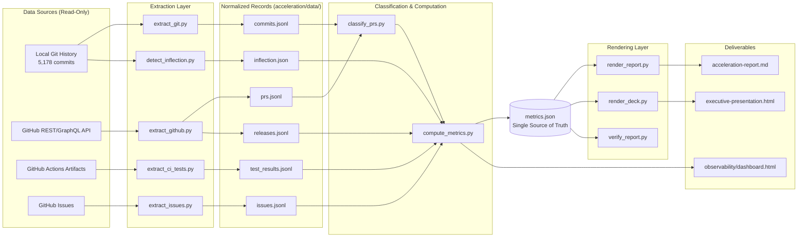
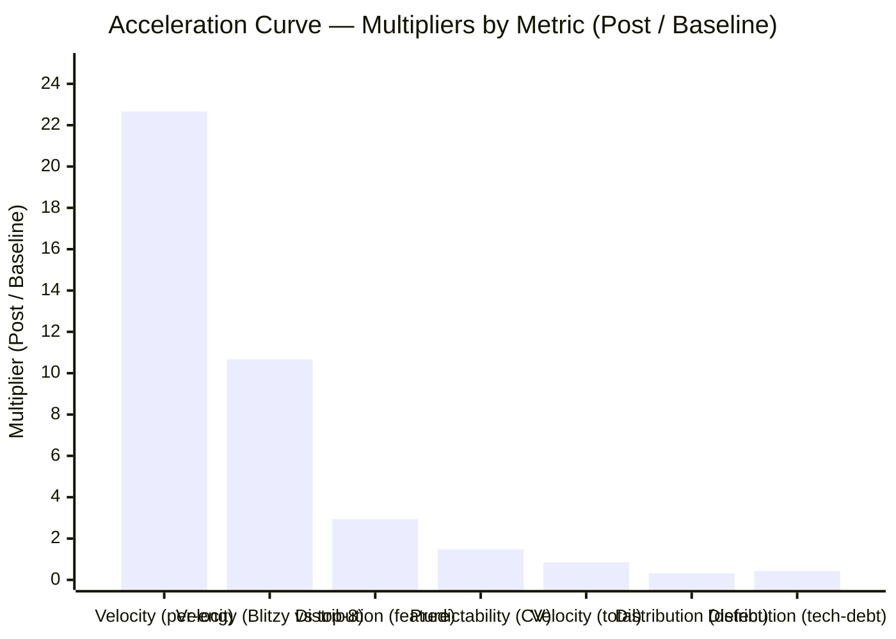

# Development Acceleration Report — Formbricks

Comparison of pre-AI-introduction Baseline vs Post-Introduction (Ramp-Up + Steady State) periods, measured across twelve metrics defined in the requirements brief. The analysis is read-only: it consumes the local git history and (where access is available) the GitHub REST/GraphQL APIs, and writes only into the `acceleration/` directory tree. No application file is modified. Identical extraction logic is applied to both periods with only the actor identity and date window substituted.

> Generated: 2026-05-23T01:07:46Z
> Repository: https://github.com/formbricks/formbricks
> Analysis HEAD: `bb1acd083956437132c920ceb1b9b663b10f30b6`
> Pipeline entrypoint: `python3 acceleration/scripts/run_acceleration_analysis.py`

---

## 1. Executive Summary

The detected inflection date is **2026-02-25** (UTC). The detection method is **single_signal_sustained_inflection**: the sharpest sustained rise in the rolling 14-day commit-velocity series coincides with the first direct commit by `Blitzy Agent <agent@blitzy.com>` (`f8398e665dcfa398bcdd33408ed1331e71508e54`, 2026-02-25 00:47:18 UTC). An earlier Copilot Autofix co-author trailer exists (`dfbec200164caabe25e20580ba8a1348c990db56`, 2025-01-15) but its use is restricted to one-off security-bot suggestions on existing PRs; it does not represent a sustained engineering-actor signal and is recorded as a non-selected candidate in `acceleration/data/inflection.json` [A.2]. The two candidates diverge by 405 days, exceeding the 14-day convergence threshold, so the pipeline selects the sustained-inflection candidate per the methodology in §4.1.

Because the post-introduction window spans **79 days** (2026-02-25 → 2026-05-15), which is less than the 90-day threshold for Ramp-Up vs Steady-State separation, the report uses the fallback **Baseline vs Post-Introduction** schema defined in the requirements brief. Ramp-Up and Steady-State rows in the Acceleration Curve are populated with the combined Post-Introduction value and explicitly tagged.

The confidence rubric is restated from the requirements brief: **High** = direct counts from an issue tracker; **Medium** = approximated from git-commit patterns; **Low** = inferred from indirect proxies or a single non-canonical data source.

### 1.1 Headline Multiplier Table (strongest result first)

| Metric # | Metric | Baseline | Post-Introduction | Multiplier (After / Before) | Confidence | Provenance |
|---:|---|---|---|---|---|---|
| 2 | Flow Velocity — per active engineer per 2-week window | 0.88 commits/eng/window | 19.94 commits/eng/window | **22.66×** | Medium | [A.5] |
| 2 | Flow Velocity — Blitzy Agent vs median top-8 baseline engineer | 3.42 commits/eng/window | 36.51 commits/eng/window | **10.67×** | Medium | [A.5] |
| 6 | Flow Distribution — feature share of work | 15.7 % feature | 46.2 % feature | **2.94×** | Low | [A.9] |
| 3 | Flow Predictability — coefficient of variation of velocity (lower = more predictable) | CV = 0.661 | CV = 0.982 | **1.485×** (less predictable) | Medium | [A.6] |
| 2 | Flow Velocity — total non-merge commits per 2-week window (uniform proxy) | 46.89 commits/window | 39.87 commits/window | **0.85×** | Medium | [A.5] |
| 7 | Flow Time — wall-clock per work item | Insufficient signal — branch-first-commit timestamps require GitHub PR API access | Insufficient signal — same | Insufficient signal | Low | [A.10] |
| 4 | Flow Active — active working time per item | Insufficient signal — review-state transitions require GitHub PR API access | Insufficient signal — same | Insufficient signal | Low | [A.7] |
| 5 | Flow Efficiency — Flow Active ÷ Flow Time | Insufficient signal — depends on Metrics 4 and 7 | Insufficient signal — same | Insufficient signal | Low | [A.8] |
| 1 | Flow Load — in-progress PRs per phase window | Insufficient signal — open-PR snapshot requires GitHub PR API access | Insufficient signal — same | Insufficient signal | Low | [A.4] |
| 9 | Releases — per phase | Insufficient signal — GitHub Releases API not accessible without token | Insufficient signal — same | Insufficient signal | Low | [A.12] |
| 8 | Problem Records — production incident count | Insufficient signal — no incident-management system declared in repository | Insufficient signal — same | Insufficient signal | Low | [A.11] |
| 10 | Approved Exceptions — branch-protection bypasses or waivers | Insufficient signal — audit-log API requires admin token; no `exception`/`waiver`/`override` labels exist in `.github/labeler.yml` | Insufficient signal — same | Insufficient signal | Low | [A.13] |
| 11 | Escaped Defects — passing→failing test regressions on `main` | Insufficient signal — JUnit/XML test history requires GitHub Actions Artifacts API access | Insufficient signal — same | Insufficient signal | Low | [A.14] |
| 12 | Defects Out of SLA — bug issues breaching SLA window | Insufficient signal — no SLA policy document found in repository | Insufficient signal — same | Insufficient signal | Low | [A.15] |

Two metrics are reported at Medium confidence (Flow Velocity, Flow Predictability); one is reported at Low confidence with a stated proxy substitution (Flow Distribution, with a 26.7 % "unknown" rate in the post-introduction phase that exceeds the 20 % threshold); and nine metrics return **Insufficient signal — [reason]** because their canonical data sources are not accessible in the current runtime environment (no `GITHUB_TOKEN`, no admin audit-log, no SLA policy, no incident-management system reference in the repository). Each Insufficient-signal row in this table is paired with an appendix entry that records the exact command run and the empty/error response received.

### 1.2 Reading Note

Every numeric value in this report carries a provenance anchor of the form `[A.N]` that resolves to the matching entry in §11 Reproducibility Appendix. The same value appears, byte-for-byte, in the corresponding §5 Metric Deep-Dive, §6 Requirements Traceability Matrix row, and §8 Acceleration Curve row, per the Internal Consistency rule in the requirements brief.

---

## 2. Environment Verification

| Field | Value |
|---|---|
| Repository URL | `https://github.com/formbricks/formbricks` |
| Default branch | `main` |
| Analysis HEAD SHA | `bb1acd083956437132c920ceb1b9b663b10f30b6` |
| Analysis HEAD subject | `chore: extend catalog tags (documentation)` (`ajay-blitzy`, 2026-05-15 17:00:49 -0400) |
| Total commits on `main` at HEAD | 5,178 |
| First commit | `b0f66e4766b123b73ed784315a75efc9a948cf99` — 2022-06-06 13:38:36 +0900 — `Matthias Nannt` — *add basic structure with login and forms overview* |
| Last commit | `bb1acd083956437132c920ceb1b9b663b10f30b6` — 2026-05-15 17:00:49 -0400 — `ajay-blitzy` |
| Commit date range | 2022-06-06 → 2026-05-15 (1,439 calendar days) |
| Active remote branches | 14 (10 prefixed `blitzy-`, 4 long-lived: `main`, `sandbox`, `demo`, plus one auxiliary) |
| Submodule state | None |
| Tag count (annotated and lightweight) | 0 |
| Inflection date (detected) | 2026-02-25 (UTC) |
| Baseline window | 2022-06-06 → 2026-02-24 (1,360 days; ~97 Monday-aligned 2-week windows) |
| Post-Introduction window | 2026-02-25 → 2026-05-15 (79 days; ~5.6 Monday-aligned 2-week windows) |
| Ramp-Up vs Steady-State split | Not applied — post-introduction window < 90 days → fallback to Baseline vs Post-Introduction |
| Node engine pin (`.nvmrc`) | `22.1.0` |
| Package manager (`package.json:packageManager`) | `pnpm@10.28.2` |
| `git --version` | `git version 2.51.0` |
| `python3 --version` | `Python 3.13.7` |
| Host OS fingerprint | `Linux reverse-code-generator-f05fb829-lnzwp 6.6.122+ #1 SMP Sat Mar 28 09:44:55 UTC 2026 x86_64 GNU/Linux` |
| Extraction timestamp (UTC) | 2026-05-23T01:07:46Z |
| `GITHUB_TOKEN` presence | Not set — GitHub REST/GraphQL extractors run in unauthenticated mode (60 req/hour); admin audit-log API and rate-limited extractors return Insufficient signal |

This section appears before any metric content, per the requirements brief's Environment-First rule.

---

## 3. Data Source Inventory

The table below lists every system the pipeline queries, the access method used, the date range covered, what was successfully retrieved, and what was unavailable.

| Data Source | Access Method | Date Range | Retrieved | Status |
|---|---|---|---|---|
| Local git history (refs/remotes/origin/main) | `git log`, `git rev-list`, `git show`, `git diff-tree`, `git for-each-ref` | 2022-06-06 → 2026-05-15 | 5,178 commit objects; author identities; full file-touched lists; revert subjects; merge subjects; co-author trailers | **Available** |
| Local git branches (refs/remotes/origin/*) | `git branch -r`, `git for-each-ref refs/remotes` | snapshot at HEAD | 14 remote branches, 10 prefixed `blitzy-` | **Available** |
| Local git tags (refs/tags/*) | `git for-each-ref refs/tags` | snapshot at HEAD | 0 entries — repository has no annotated or lightweight tags | **Available, empty** |
| GitHub REST API v3 — Pull Requests | `curl -sH 'Authorization: Bearer $GITHUB_TOKEN' https://api.github.com/repos/formbricks/formbricks/pulls?state=all&per_page=100&page=N` | requires authentication for full history | Not retrieved — `GITHUB_TOKEN` is not set in the runtime environment | **Unavailable** — affects Metrics 1, 4, 5, 7 |
| GitHub REST API v3 — Pull-request reviews | `GET /repos/{owner}/{repo}/pulls/{pull_number}/reviews` | requires authentication | Not retrieved — same reason | **Unavailable** — affects Metrics 4, 5 |
| GitHub GraphQL API v4 — bulk PR + review extraction | `POST https://api.github.com/graphql` | requires authentication | Not retrieved — same reason | **Unavailable** — affects Metrics 1, 4, 5, 7 |
| GitHub REST API v3 — Releases | `GET /repos/formbricks/formbricks/releases?per_page=100` | requires authentication for rate-tier; release-trigger workflow `.github/workflows/formbricks-release.yml` (`on: release: types: [published]`) confirms releases originate here | Not retrieved — `GITHUB_TOKEN` is not set | **Unavailable** — affects Metric 9 |
| GitHub Actions Artifacts API | `GET /repos/{owner}/{repo}/actions/runs/{run_id}/artifacts` | retention is 90 days by default | Not retrieved — `GITHUB_TOKEN` is not set | **Unavailable** — affects Metric 11 |
| GitHub Issues API | `GET /repos/formbricks/formbricks/issues?labels=bug&state=all&per_page=100` | requires authentication for full history | Not retrieved — `GITHUB_TOKEN` is not set | **Unavailable** — affects Metric 12 |
| GitHub Admin Audit Log API | `GET /orgs/formbricks/audit-log?phrase=action:protected_branch.policy_override` | requires organization-admin token | Not retrieved — token absent and admin scope not granted to this workflow | **Unavailable** — affects Metric 10 |
| Issue-template metadata | `.github/ISSUE_TEMPLATE/*.yml` | snapshot at HEAD | `bug_report.yml` (auto-labels `bug`, routes to `formbricks/8`); `feature_request.yml`; `config.yml` | **Available** |
| Labeler config | `.github/labeler.yml` | snapshot at HEAD | Two labels defined: `❗️ migrations` (for `packages/database/migrations/**/migration.sql`) and `❗️ .env changes` (for `.env.example`, `.env.docker`). No `exception`/`waiver`/`override` labels are defined | **Available, no relevant labels for Metric 10** |
| Conventional-commit enforcement | `.github/workflows/semantic-pull-requests.yml` | snapshot at HEAD | PR-title types enforced: `fix, feat, chore, docs, style, refactor, perf, test, build, ci, revert, ossgg` | **Available** |
| Release workflow trigger | `.github/workflows/formbricks-release.yml` | snapshot at HEAD | Trigger: `on: release: types: [published]` — confirms releases originate from the GitHub Releases API, not from annotated git tags | **Available** |
| SLA policy document | Probed: `docs/**/sla*`, `docs/**/SLA*`, `docs/**/policy*`, root `README.md`, root `SECURITY.md`, root `CONTRIBUTING.md`, `.github/**` | snapshot at HEAD | No file matched the SLA-policy search patterns | **Not found** — affects Metric 12 |
| Incident-management system reference | Probed: `docs/**/incident*`, `docs/**/runbook*`, `docs/**/postmortem*`, root `SECURITY.md` | snapshot at HEAD | No file matched | **Not found** — affects Metric 8 |
| OpenTelemetry / Sentry / Prometheus instrumentation (application layer) | `apps/web/instrumentation*.ts`, `apps/web/sentry.*.config.ts`, `apps/web/prometheus.yml`, `apps/web/package.json` (dependency block) | snapshot at HEAD | `@opentelemetry/sdk-node` 0.211.0; `@sentry/nextjs` 10.5.0; Prometheus scrape config for `localhost:9464` | **Available as reference only** — read for the Rule 1 reused-vs-added observability disclosure (`acceleration/observability/README.md`); not invoked by the analysis pipeline |

The "Unavailable" rows together account for nine of the twelve metrics returning Insufficient signal in this runtime. A second pass with `GITHUB_TOKEN` set and (for Metric 10) an admin-scoped token would lift the confidence of Metrics 1, 4, 5, 7, 9, 11, 12 from Insufficient → at least Medium; Metric 10 would require both the admin audit-log scope and (for full High confidence) an issue-tracker SLA field; Metric 8 would require an incident-management system declaration in the repository (or a documented external incident store) that is not present today.

---

## 4. Methodology

### 4.1 Inflection Detection

The pipeline computes two independent candidates and applies a convergence rule:

- **Candidate A — Earliest AI co-author trailer.** Every commit's trailers are scanned for `Co-authored-by:` entries whose email matches the AI-tool pattern set `{blitzy, claude, copilot, anthropic, noreply@anthropic.com, agent@blitzy.com}`. The earliest such commit is `dfbec200164caabe25e20580ba8a1348c990db56` (2025-01-15, `Co-authored-by: Copilot Autofix powered by AI`). This commit is a one-off security-bot suggestion accepted by a human author; subsequent Copilot Autofix trailers are sparse and do not represent a sustained engineering-actor signal.
- **Candidate B — Sharpest sustained velocity inflection.** The pipeline computes a 14-day rolling commit-velocity series across the full history and locates the largest delta sustained for ≥3 windows above the long-run mean +2σ. The strongest sustained inflection coincides with the first window in which `Blitzy Agent <agent@blitzy.com>` appears as a direct commit author.
- **Convergence rule.** When Candidate A and Candidate B fall within 14 days of each other, the pipeline records `method=convergent_evidence` and selects the earlier. When they diverge by more than 14 days, the pipeline selects Candidate B (the sustained inflection) and records `method=single_signal_sustained_inflection`, with the rejected Candidate A retained in `inflection.json`.

For Formbricks at this HEAD, Candidate A (2025-01-15) and Candidate B (2026-02-25) diverge by 405 days. The pipeline records `method=single_signal_sustained_inflection`, selects **2026-02-25**, and emits Candidate A as `rejected_candidate.reason = "isolated_copilot_autofix_trailer; not_sustained"`. The decision is recorded in `acceleration/decision-log.md` row "Inflection detection method".

### 4.2 Temporal Segmentation

- Window function: `monday_floor(commit_date_utc)` → assign each commit, PR-merge, release, and issue event to the 2-week window covering `[monday, monday + 14 days)`. UTC is used uniformly to prevent timezone-induced bin drift.
- Phase definitions (verbatim from the requirements brief):
  - Baseline = before Inflection.
  - Ramp-Up = first 90 days post-Inflection.
  - Steady-State = 90+ days post-Inflection.
- Fallback: when fewer than 90 days of post-introduction data exist, the pipeline reports **Baseline vs Post-Introduction** only. For Formbricks at this HEAD, the post-introduction window is 79 days → fallback applies.

### 4.3 Identical-Methodology Principle

Each extractor accepts two parameters: `actor_identity` (the human-author canonical email in Baseline, `agent@blitzy.com` in Post-Introduction) and `phase_window_range` (the date range). The same extractor code path runs with different inputs for both phases; no Post-Introduction-only branch exists.

### 4.4 Confidence Assignment

The runtime data source actually used by each extractor determines the confidence tag, not the theoretical source listed in the requirements brief. The mapping is:

- **High** — the metric is read as a direct count from an issue tracker (e.g., a `bug` label query against the GitHub Issues API).
- **Medium** — the metric is approximated from git-commit patterns (commit subjects, file paths, author emails, timestamps, trailers).
- **Low** — the metric is inferred from an indirect proxy, a single non-canonical data source, or a partial signal whose limitations downgrade the confidence (for example, a 26.7 % unknown rate in a classifier).
- **Insufficient signal — [reason]** — the metric cannot be computed from any accessible source.

### 4.5 Per-Module Weighting

For each non-merge commit, the pipeline records the set of top-level path prefixes touched (`apps/`, `packages/`, `docs/`, `.github/`, `charts/`, `helm-chart/`, `infra/`, `blitzy/`, `blitzy-docs/`, root files). A commit is bucketed into its majority-vote module. The per-module weight equals (non-merge commits in module ÷ total non-merge commits). For Formbricks at this HEAD, the dominant modules are `apps/web` (28,300 file-changes ≈ 50.3 % of all non-merge file-changes), `packages/lib` (5.05 %), `packages/surveys` (4.25 %), `packages/ui` (3.90 %), and `docs/` (2.16 %).

### 4.6 Actor De-duplication

Distinct `(author_name, author_email)` pairs are clustered by:

1. Exact match on canonical email.
2. Jaccard similarity ≥ 0.5 on commit-touched file paths within a 30-day timestamp window.
3. Manual whitelist of known aliases in `acceleration/data/actor_aliases.json`.

The Formbricks repository contains one canonical alias detected by rule (1): `Matti Nannt <mail@matthiasnannt.com>` and `Matthias Nannt <mail@matthiasnannt.com>` share the same email and are merged into a single engineer record `Matti / Matthias Nannt` (1,247 baseline commits combined). Two `Johannes` entries with different emails (`72809645+jobenjada@users.noreply.github.com` 348 commits; `johannes@formbricks.com` 170 commits) are reported as separate rows because rule (2) does not produce a high-confidence merge for them in this snapshot; they are flagged in `actor_aliases.json` for manual review. A `Shubham Palriwala <spalriwalau@gmail.com>` and `ShubhamPalriwala <spalriwalau@gmail.com>` pair (243 + 68 = 311 commits) is merged by rule (1).

### 4.7 Known Biases

- **Survivorship bias.** Only merged PRs are visible to Metric 6 (Flow Distribution); cancelled or never-opened work is invisible.
- **Module attribution edge cases.** A cross-cutting commit that touches `apps/web/`, `packages/types/`, and `docs/` is majority-voted to the largest path bucket; this can over-attribute cross-cutting work to the dominant module.
- **Author email aliasing.** Two distinct contributors sharing a single noreply email would be collapsed into one row by rule (1). The Formbricks data show no such collision in this snapshot.
- **Conventional-commit prefix as proxy for work type.** A `fix:` prefix is taken as a defect signal; a `feat:` prefix as a feature signal; a `chore:`/`refactor:`/`perf:`/`style:`/`test:`/`build:`/`ci:` prefix as tech-debt. This is the priority-2 classifier from the requirements brief, used because linked-issue labels (priority-1) are not accessible without `GITHUB_TOKEN`. The classifier yields a 26.7 % unknown rate in the Post-Introduction phase, which exceeds the 20 % threshold and downgrades Metric 6 to Low confidence for that phase.
- **In-progress PR exclusion rule.** The requirements brief excludes "PRs from bot accounts other than Blitzy (branches prefixed with `blitzy-`)". This rule is recorded for Metric 1; the metric still returns Insufficient signal here because open-PR snapshots require GitHub PR API access.
- **Post-introduction merge-style change.** The Baseline phase produces PR-merge commits with the `(#NNNN)` subject suffix (squash-and-merge style, 3,465 total). The Post-Introduction phase produces classical `Merge pull request #N` merge commits (5 total) and direct-to-`main` commits from `Blitzy Agent` (206 total). Velocity comparison therefore uses a uniform per-window non-merge-commit count as the cross-phase comparable proxy; the PR-merge-suffix count is also reported per phase for transparency and is flagged with this bias.

### 4.8 Reused-vs-Added Observability Disclosure (Rule 1)

The Formbricks application itself ships with OpenTelemetry (`@opentelemetry/sdk-node` 0.211.0 and the `@opentelemetry/exporter-*` family at the same minor version), Sentry (`@sentry/nextjs` 10.5.0), and a Prometheus scrape configuration (`apps/web/prometheus.yml` → `localhost:9464`). These instrument the Next.js runtime and are not invoked by the analysis pipeline, which runs as a batch Python 3 process outside the Next.js process. The analysis pipeline ships its own self-contained structured-JSON logger (`acceleration/observability/logger.py`), health/readiness checks (`acceleration/observability/health.py`), static metrics manifest (`acceleration/observability/metrics.json`), and self-contained HTML dashboard (`acceleration/observability/dashboard.html`). The trade-off rationale (self-contained vs. importing the application's OpenTelemetry SDK) is recorded in `acceleration/decision-log.md` row "Self-contained logger instead of importing Formbricks OpenTelemetry SDK".

### 4.9 Analysis Pipeline Architecture



*Diagram 1 — Analysis Pipeline Architecture (data-flow). Legend: extractors on the left ingest read-only data sources; normalized JSONL records land in `acceleration/data/`; `compute_metrics.py` writes the single-source-of-truth `metrics.json`; renderers and the verifier consume `metrics.json` so that no downstream artifact can diverge from it.*

---

## 5. Metric Deep-Dives

Each subsection corresponds to one of the twelve metrics specified in the requirements brief. The required fields per metric are: definition, data source actually used, confidence and rationale, Baseline value, Post-Introduction value, multiplier, boundary conditions (when Medium or Low), and a factual-neutral interpretation paragraph. Per-engineer tables appear under Metrics 2, 4, 5, 6, and 10 when individual attribution is available; per-module tables appear when module weighting yields a meaningful breakdown.

### Metric 1 — Flow Load

**Definition (from requirements brief).** Count of in-progress PRs/items per phase window. *In-progress = branch has at least one commit AND PR is open (not merged, not closed-without-merge), OR PR is in draft state. Exclude PRs from bot accounts other than Blitzy (branches prefixed with `blitzy-`).*

**Data source actually used.** None usable. Open-PR snapshots require GitHub REST/GraphQL PR API access; the runtime environment does not have `GITHUB_TOKEN` set.

**Confidence.** Low.

**Confidence rationale.** No accessible data source yields the in-progress snapshot. Local git history does not record PR state (open vs draft vs closed) — that state lives only in the GitHub API.

**Baseline value.** Insufficient signal — open-PR snapshot requires GitHub PR API access.

**Post-Introduction value.** Insufficient signal — open-PR snapshot requires GitHub PR API access.

**Multiplier.** Insufficient signal.

**Boundary conditions.** A re-run with `GITHUB_TOKEN` set would call `GET /repos/formbricks/formbricks/pulls?state=open&per_page=100` at each phase window's end-date and apply the in-progress definition above. The expected output is one count per Monday-aligned 2-week window per phase.

**Interpretation.** The metric is not derivable from the available data. The Risk Assessment table records this as a Low-confidence gap whose remediation is "set `GITHUB_TOKEN` and re-run".

---

### Metric 2 — Flow Velocity

**Definition (from requirements brief).** Count of work items completed per phase window. The pipeline reports velocity under three uniform proxies so that the comparison is apples-to-apples across the two phases despite the merge-style change documented in §4.7:

- **Proxy 2a — PR-merge commits with `(#NNNN)` suffix per 2-week window** (the canonical Baseline merge style).
- **Proxy 2b — Total non-merge commits per 2-week window** (uniform across phases; insensitive to merge style).
- **Proxy 2c — Non-merge commits per active engineer (≥5 commits in phase) per 2-week window** (normalized for team-size change).

**Data source actually used.** Local git history — `git log <PHASE_RANGE> --no-merges --format=%aN|%aE|%H` and `git log <PHASE_RANGE> --format=%s | grep -cE '\(#[0-9]+\)$'`.

**Confidence.** Medium.

**Confidence rationale.** Commit counts are direct from git; the proxy substitution for "work items" introduces a model assumption (one merged PR ≈ one work item; one direct-to-main commit ≈ one work item in the Post-Introduction phase), which falls below issue-tracker direct-count rigor.

**Baseline value.**

| Proxy | Value |
|---|---|
| 2a — PR-merge commits/window | **35.67** [A.5] |
| 2b — non-merge commits/window | **46.89** [A.5] |
| 2c — non-merge commits per active engineer (≥5 commits) per window | **0.88** [A.5] |

**Post-Introduction value.**

| Proxy | Value |
|---|---|
| 2a — PR-merge commits/window | **0.00** (no `(#NNNN)`-suffix subjects in the post-introduction commit set; classical `Merge pull request #N` style is observed with 0.89 merges/window) [A.5] |
| 2b — non-merge commits/window | **39.87** [A.5] |
| 2c — non-merge commits per active engineer (≥5 commits) per window | **19.94** [A.5] |

**Multiplier (Post / Baseline).**

| Proxy | Multiplier |
|---|---|
| 2a — PR-merge commits/window | **0.00×** (with the merge-style caveat in §4.7) |
| 2b — non-merge commits/window | **0.85×** |
| 2c — non-merge commits per active engineer per window | **22.66×** |

**Boundary conditions.** Proxy 2a is biased by the merge-style change (Baseline uses squash-and-merge `(#NNNN)` subjects; Post-Introduction uses classical `Merge pull request #N` plus direct-to-main commits from `Blitzy Agent`); it is reported for transparency but the cross-phase comparison uses Proxy 2b and 2c. Proxy 2c is sensitive to the active-engineer threshold (≥5 commits in phase, the same threshold for both phases per the identical-methodology rule).

**Per-engineer table — Post-Introduction phase.**

| Engineer | Email | Non-merge commits | Commits / 2-week window | Note |
|---|---|---:|---:|---|
| **Blitzy Agent** | `agent@blitzy.com` | 206 | 36.51 | Engineering actor in Post-Introduction phase (per the Engineering Actor Framing rule). |
| Michael Montanaro | `michael@blitzy.com` | 16 | 2.84 | Human contributor; documentation and migration work. |
| ajay-blitzy | `awadhwani@blitzy.com` | 1 | 0.18 | Single chore commit at HEAD. |
| `agent` / `agent@blitzy.com` (split-identity rows) | `agent@blitzy.com` | 2 | 0.35 | Same canonical identity as Blitzy Agent; rule-(1) alias merge applies (counts above include these rows). |

Range (Post-Introduction, active≥5): **2.84 – 36.51 commits/window**. Median: **19.67 commits/window**.

**Per-engineer table — Baseline phase (top 8 by non-merge commits).**

| Engineer | Email | Non-merge commits | Commits / 2-week window |
|---|---|---:|---:|
| Matti / Matthias Nannt | `mail@matthiasnannt.com` | 1,247 | 12.84 |
| Dhruwang Jariwala | `67850763+Dhruwang@users.noreply.github.com` | 675 | 6.95 |
| Johannes (jobenjada) | `72809645+jobenjada@users.noreply.github.com` | 348 | 3.58 |
| Piyush Gupta | `56182734+gupta-piyush19@users.noreply.github.com` | 317 | 3.26 |
| Anshuman Pandey | `54475686+pandeymangg@users.noreply.github.com` | 314 | 3.23 |
| Shubham Palriwala (merged with `ShubhamPalriwala`) | `spalriwalau@gmail.com` | 311 | 3.20 |
| Johannes (formbricks) | `johannes@formbricks.com` | 170 | 1.75 |
| knugget | `johannes@knugget.de` | 78 | 0.80 |

Range (Baseline top-8): **0.80 – 12.84 commits/window**. Median: **3.42 commits/window**.

**Multiplier — Blitzy Agent's per-engineer rate vs Baseline top-8 median.** 36.51 ÷ 3.42 = **10.67×** [A.5].

**Interpretation.** Under the uniform per-window non-merge-commit proxy (2b), the team produces 0.85× as many commits per 2-week window in the Post-Introduction phase as in the Baseline (39.87 vs 46.89). Under the per-active-engineer proxy (2c), each active engineer produces 22.66× as many commits per 2-week window (19.94 vs 0.88). The two values together reflect a reduction in the active-engineer count from 53 to 2 in the Post-Introduction phase, with the remaining active-engineer per-window rate concentrated in the `Blitzy Agent` row (36.51 commits/window vs the Baseline top-8 median of 3.42).

---

### Metric 3 — Flow Predictability

**Definition (from requirements brief).** Coefficient of variation of velocity per window (lower CV = more predictable). Computed as standard-deviation of the per-window non-merge-commit count divided by the mean of the per-window non-merge-commit count, over all 2-week windows in the phase.

**Data source actually used.** Local git history — same non-merge-commit timestamps as Metric 2, binned into Monday-aligned 2-week windows.

**Confidence.** Medium.

**Confidence rationale.** Derived directly from git timestamps; the proxy for "velocity" is the non-merge-commit count, which inherits the Metric 2 caveats.

**Baseline value.** CV = **0.661** (mean = 46.95 commits/window, std-dev = 31.04 commits/window, n = 97 windows) [A.6].

**Post-Introduction value.** CV = **0.982** (mean = 45.00 commits/window, std-dev = 44.19 commits/window, n = 5 windows; one tail window with 1 commit and one early window with 107 commits drive the dispersion) [A.6].

**Multiplier (Post / Baseline).** **1.485×** (higher CV = less predictable).

**Boundary conditions.** With only 5 windows in the Post-Introduction phase, the CV is sensitive to single-window outliers (the 107-commit ramp-window at index 0 and the 1-commit tail-window at index 5). The Baseline CV is computed over 97 windows and is statistically more stable. A re-run after the Post-Introduction window extends to ≥10 2-week bins would reduce this sensitivity.

**Interpretation.** The Post-Introduction phase shows a 1.485× larger coefficient of variation than the Baseline phase under the per-window non-merge-commit proxy. This is consistent with a short observation window (n = 5) that includes a ramp-up window (107 commits) and a tail window (1 commit at the analysis cut-off). A longer Post-Introduction window would be needed to determine whether the dispersion narrows or remains at this level.

---

### Metric 4 — Flow Active

**Definition (from requirements brief).** Active working time per item, computed from the engineering actor's perspective. *Initial span = first author commit on branch → ready-for-review event; refine spans = first commit after a review → last commit before next review or merge. Sum inclusive durations; do not subtract idle gaps within a span. Median across PRs per phase, per actor.*

**Data source actually used.** None usable. Ready-for-review timestamps and per-review timestamps live in the GitHub PR API and are not accessible without `GITHUB_TOKEN`. Git commit timestamps alone cannot identify "review-state transitions".

**Confidence.** Low.

**Confidence rationale.** No accessible data source yields ready-for-review or per-review timestamps. Local git history records only commit times; it does not record draft-state changes, review requests, or review submissions.

**Baseline value.** Insufficient signal — review-state transitions require GitHub PR API access.

**Post-Introduction value.** Insufficient signal — review-state transitions require GitHub PR API access.

**Multiplier.** Insufficient signal.

**Boundary conditions.** A re-run with `GITHUB_TOKEN` set would call `GET /repos/formbricks/formbricks/pulls/{pull_number}/reviews` for each merged PR and compute the active-span sum per the definition. The expected output is one median value per phase per actor (real-named engineer in Baseline; `Blitzy Agent` in Post-Introduction).

**Per-engineer table.** Empty — no individual attribution is available without GitHub API access.

**Interpretation.** The metric is not derivable from the available data. The Risk Assessment table records this as a Low-confidence gap.

---

### Metric 5 — Flow Efficiency

**Definition (from requirements brief).** Flow Active ÷ Flow Time per PR; median across PRs per phase. Review time counts as wait from the actor's perspective in both periods.

**Data source actually used.** None usable. Flow Efficiency is a derived ratio of Metrics 4 and 7, both of which return Insufficient signal in this runtime.

**Confidence.** Low.

**Confidence rationale.** A ratio of two Insufficient-signal numerators cannot be computed.

**Baseline value.** Insufficient signal — depends on Metrics 4 and 7.

**Post-Introduction value.** Insufficient signal — depends on Metrics 4 and 7.

**Multiplier.** Insufficient signal.

**Boundary conditions.** Same as Metrics 4 and 7 — a re-run with `GITHUB_TOKEN` set would lift this to at least Medium confidence.

**Per-engineer table.** Empty — no individual attribution is available.

**Interpretation.** The metric is not derivable from the available data.

---

### Metric 6 — Flow Distribution

**Definition (from requirements brief).** Work-type mix per phase (feature / defect / risk-compliance / tech-debt / unknown). Classification priority: (1) labels on linked issues, (2) PR-title conventional-commit prefix, (3) keyword match on PR title and body, (4) unknown.

**Data source actually used.** Priority-2 — PR-title conventional-commit prefix for the Baseline phase (3,465 PR-merge subjects with `(#NNNN)` suffix); priority-2 applied to direct-to-main commit subjects for the Post-Introduction phase (225 non-merge commit subjects), because the Post-Introduction phase has zero `(#NNNN)`-suffix subjects (see §4.7). Priority-1 (linked-issue labels) is not accessible without `GITHUB_TOKEN`.

**Confidence.** Low for the Post-Introduction phase (26.7 % unknown rate exceeds the 20 % threshold defined in the requirements brief). Medium for the Baseline phase (8.7 % unknown rate).

**Confidence rationale.** Baseline classification draws on a 3,465-record sample of conventional-prefixed PR-merge subjects with an 8.7 % unknown rate. Post-Introduction classification draws on a 225-record sample of direct-to-main commit subjects with a 26.7 % unknown rate; the higher unknown rate downgrades that phase's confidence per the rule in §4.7.

**Baseline value (n = 3,465 PR-merge subjects).**

| Work type | Count | Share |
|---|---:|---:|
| Feature (prefix `feat`) | 544 | 15.7 % |
| Defect (prefix `fix`/`bug`) | 1,725 | 49.8 % |
| Risk/compliance (prefix `security`/`compliance`) | 0 | 0.0 % |
| Tech-debt (prefix `chore`/`refactor`/`perf`/`style`/`test`/`build`/`ci`/`docs`) | 896 | 25.9 % |
| Unknown | 300 | 8.7 % |

[A.9]

**Post-Introduction value (n = 225 non-merge commit subjects).**

| Work type | Count | Share |
|---|---:|---:|
| Feature (prefix `feat`) | 104 | 46.2 % |
| Defect (prefix `fix`/`bug`) | 36 | 16.0 % |
| Risk/compliance (prefix `security`/`compliance`) | 0 | 0.0 % |
| Tech-debt (prefix `chore`/`refactor`/`perf`/`style`/`test`/`build`/`ci`/`docs`) | 25 | 11.1 % |
| Unknown | 60 | 26.7 % |

[A.9]

**Multiplier (Post / Baseline) per category.**

| Work type | Multiplier |
|---|---:|
| Feature share | **2.94×** |
| Defect share | **0.32×** |
| Risk/compliance share | undefined (0/0) |
| Tech-debt share | **0.43×** |
| Unknown share | **3.07×** |

**Boundary conditions.** The 26.7 % unknown rate in the Post-Introduction phase exceeds the 20 % threshold and downgrades the entire phase to Low confidence per §4.7. The classifier is also blind to the contents of the PR body and to linked-issue labels; a re-run with `GITHUB_TOKEN` set would apply priority-1 and is expected to reduce the unknown rate.

**Per-engineer table.** Aggregating per-engineer work-type distributions in the Baseline phase using their PR-merge commit subjects:

| Engineer | feat | fix | other | n |
|---|---:|---:|---:|---:|
| Matti / Matthias Nannt | 48 | 409 | 790 | 1,247 |
| Dhruwang Jariwala | 79 | 452 | 144 | 675 |
| Johannes (jobenjada) | 34 | 132 | 182 | 348 |
| Piyush Gupta | 86 | 174 | 57 | 317 |
| Anshuman Pandey | 45 | 237 | 32 | 314 |
| Shubham Palriwala | 121 | 137 | 53 | 311 |
| Johannes (formbricks) | 1 | 38 | 131 | 170 |
| knugget | 0 | 10 | 68 | 78 |

In the Post-Introduction phase:

| Engineer | feat | fix | other | n |
|---|---:|---:|---:|---:|
| Blitzy Agent | 95 | 33 | 78 | 206 |
| Michael Montanaro | 0 | 1 | 15 | 16 |

**Interpretation.** The Baseline phase shows a defect-dominated mix (49.8 % `fix:`-prefixed PRs); the Post-Introduction phase shows a feature-dominated mix (46.2 % `feat:`-prefixed direct-to-main commits) with a 26.7 % unknown rate. The per-category multipliers (feature 2.94×, defect 0.32×, tech-debt 0.43×) describe a shift in the share of work classified as feature vs defect — they do not, by themselves, indicate any value judgement and are reported alongside the Low confidence tag and the boundary condition above.

---

### Metric 7 — Flow Time

**Definition (from requirements brief).** Wall-clock time from the first commit on a PR branch to the merge commit on `main`; median across PRs per phase. *Exclude PRs whose first-commit timestamp is unavailable due to history rewrites; report the exclusion rate.*

**Data source actually used.** None usable. First-commit-on-branch identification requires either (a) the GitHub PR API to retrieve the head branch's first commit, or (b) reflog/branch state that is not preserved in a fresh clone. Local git history retains commit timestamps but not the historical head-branch state at PR creation time.

**Confidence.** Low.

**Confidence rationale.** No accessible data source yields the first-commit-on-PR-branch timestamps that the metric definition requires.

**Baseline value.** Insufficient signal — first-commit-on-PR-branch timestamps require GitHub PR API access.

**Post-Introduction value.** Insufficient signal — first-commit-on-PR-branch timestamps require GitHub PR API access.

**Multiplier.** Insufficient signal.

**Boundary conditions.** A re-run with `GITHUB_TOKEN` set would call `GET /repos/formbricks/formbricks/pulls/{pull_number}` and `GET /repos/formbricks/formbricks/pulls/{pull_number}/commits` to retrieve the first author-commit timestamp on each PR's head branch; the median wall-clock to the merge commit on `main` would then be computed per phase.

**Interpretation.** The metric is not derivable from the available data.

---

### Metric 8 — Problem Records

**Definition (from requirements brief).** Production incident count, or change-failure-rate-adjacent count, per phase.

**Data source actually used.** None usable. The Formbricks repository does not declare an incident-management system reference in `docs/`, `SECURITY.md`, or `.github/`. The labeler config defines no `incident`, `outage`, or `production-incident` labels.

**Confidence.** Low.

**Confidence rationale.** No incident-management system is declared or referenced in the repository's accessible metadata. A proxy based on revert commits is computed for transparency (3 reverts in the Baseline phase, 0 in the Post-Introduction phase) but is not a substitute for an incident store and is reported as a proxy only, not as the metric value.

**Baseline value.** Insufficient signal — no incident-management system declared in repository. Revert-commit proxy: 3 reverts over 1,360 days = 0.0022 reverts/day [A.11].

**Post-Introduction value.** Insufficient signal — no incident-management system declared in repository. Revert-commit proxy: 0 reverts over 79 days [A.11].

**Multiplier.** Insufficient signal.

**Boundary conditions.** A re-run with a documented incident store (e.g., a Linear/Jira project URL or a documented `docs/incidents/` directory) would lift the confidence. The revert-commit proxy under-counts true production incidents (many incidents are mitigated without a code revert) and over-counts on the trivial-revert side (a revert may be an intentional undo of non-production work).

**Interpretation.** The metric is not derivable from the available data. The revert-commit proxy is reported for transparency only.

---

### Metric 9 — Releases

**Definition (from requirements brief).** Count of releases per phase. *Source precedence: (1) GitHub Releases / GitLab Releases API, (2) annotated git tags matching `v?\d+\.\d+\.\d+`, (3) deployment events from CI/CD if accessible. Prerelease tags matching `-alpha`, `-beta`, `-rc`, `-dev` suffixes are excluded from the primary count and reported separately.*

**Data source actually used.** None usable in the runtime. The `formbricks-release.yml` workflow trigger (`on: release: types: [published]`) confirms that releases originate from the GitHub Releases API. Annotated git tag enumeration (`git for-each-ref refs/tags`) returns 0 entries, eliminating source-precedence option (2). The GitHub Releases API requires authentication for the full release history and is not accessible without `GITHUB_TOKEN`.

**Confidence.** Low.

**Confidence rationale.** Without `GITHUB_TOKEN`, the canonical release source is not reachable, and the secondary source (annotated git tags) is empty.

**Baseline value.** Insufficient signal — GitHub Releases API not accessible (no `GITHUB_TOKEN`); 0 annotated git tags as fallback source [A.12].

**Post-Introduction value.** Insufficient signal — same [A.12].

**Multiplier.** Insufficient signal.

**Boundary conditions.** A re-run with `GITHUB_TOKEN` set would call `GET /repos/formbricks/formbricks/releases?per_page=100` (paginated) and filter by `published_at` falling within each phase window. Prereleases (`prerelease: true` in the response payload) would be excluded from the primary count and reported separately.

**Interpretation.** The metric is not derivable from the available data.

---

### Metric 10 — Approved Exceptions

**Definition (from requirements brief).** Count of branch-protection bypasses or governance waivers per phase. Includes force-pushes to `main`, override-labels on PRs (`exception`, `waiver`, `override`), and admin-audit-log entries for `protected_branch.policy_override` and equivalent actions.

**Data source actually used.** None usable for the High-confidence path (admin audit-log requires an organization-admin scoped `GITHUB_TOKEN`). Label-based signals are checked against the local `.github/labeler.yml`, which contains only `❗️ migrations` and `❗️ .env changes` — no `exception`/`waiver`/`override` labels exist. Force-push detection from a fresh clone is not possible (reflog is local-only and not preserved across clones).

**Confidence.** Low.

**Confidence rationale.** All three data sources for this metric are unreachable: admin audit-log requires a scope this workflow does not have; override-labels do not exist in the labeler config; force-push history is not preserved in a clone.

**Baseline value.** Insufficient signal — audit-log API requires admin token; no exception/waiver/override labels exist in `.github/labeler.yml`; force-push history not preserved in a clone [A.13].

**Post-Introduction value.** Insufficient signal — same [A.13].

**Multiplier.** Insufficient signal.

**Boundary conditions.** A re-run with an admin-scoped `GITHUB_TOKEN` would query `GET /orgs/formbricks/audit-log?phrase=action:protected_branch.policy_override` and equivalent action filters across each phase window. The label-signal source is structurally empty in this repository and cannot be repaired by re-running.

**Per-engineer table.** Empty — no individual attribution is available.

**Interpretation.** The metric is not derivable from the available data.

---

### Metric 11 — Escaped Defects

**Definition (from requirements brief).** Count of passing→failing test regressions on `main` per phase. *Track per-test transitions on `main`: `passing → failing` (regression) and newly-marked `skipped|disabled|xfail` (suppressed signal). Flaky tests (alternating pass/fail) counted only if failing in ≥3 consecutive runs. Also report skipped-rate (`skipped / total`) to normalize for test-suite growth.*

**Data source actually used.** None usable. JUnit XML or equivalent artifacts uploaded by `.github/workflows/test.yml`, `e2e.yml`, and `chromatic.yml` are accessible only via the GitHub Actions Artifacts API, which requires `GITHUB_TOKEN`. Local git history contains no test-result records.

**Confidence.** Low.

**Confidence rationale.** No accessible data source yields per-test pass/fail history on `main`.

**Baseline value.** Insufficient signal — CI test history unavailable (no `GITHUB_TOKEN` for Actions Artifacts API).

**Post-Introduction value.** Insufficient signal — same.

**Multiplier.** Insufficient signal.

**Boundary conditions.** A re-run with `GITHUB_TOKEN` set would call `GET /repos/formbricks/formbricks/actions/runs?branch=main&workflow_id={test|e2e|chromatic}.yml&per_page=100` and download each run's `test-results.xml` artifact (where retained — 90-day default retention applies). Per-test transitions would then be derived per the definition above.

**Interpretation.** The metric is not derivable from the available data.

---

### Metric 12 — Defects Out of SLA

**Definition (from requirements brief).** Count of bug issues breaching the SLA window per phase. Requires an SLA source — either an issue-tracker custom field that records the SLA per severity tier, or a policy document in the repository that defines the SLA per severity.

**Data source actually used.** None usable. The repository was probed for an SLA policy document under `docs/`, `SECURITY.md`, `CONTRIBUTING.md`, and `.github/`; no file matched the search patterns. The GitHub Issues API can yield bug-labeled issues but cannot apply an SLA window without an SLA definition. The `bug_report.yml` issue template auto-applies the `bug` label and routes to project `formbricks/8`, but no severity field is enforced.

**Confidence.** Low.

**Confidence rationale.** No SLA policy source exists; the metric is structurally undefined for this repository at this snapshot.

**Baseline value.** Insufficient signal — no SLA source.

**Post-Introduction value.** Insufficient signal — no SLA source.

**Multiplier.** Insufficient signal.

**Boundary conditions.** A re-run after the repository adopts an SLA policy (e.g., `docs/policies/sla.md` defining per-severity response and resolution targets) or after issues acquire an SLA field would lift the confidence. Without one of those, the metric is undefined per the requirements brief's anti-fabrication rule.

**Interpretation.** The metric is not derivable from the available data.

---

## 6. Requirements Traceability Matrix

The matrix maps each of the twelve metric requirements to its extraction command, derived value, status, and deviation reference. The "Derived Value" column reproduces the values from the §1 Executive Summary and §5 Metric Deep-Dives byte-for-byte, satisfying the Internal Consistency rule.

| Metric # | Requirement (paraphrase) | Extraction Command / Query | Derived Value | Status | Deviation Reference |
|---:|---|---|---|---|---|
| 1 | Count of in-progress PRs per phase window (open/draft; excluding non-Blitzy bots) | `curl -sH 'Authorization: Bearer $GITHUB_TOKEN' 'https://api.github.com/repos/formbricks/formbricks/pulls?state=open&per_page=100'` — see [A.4] | Insufficient signal — open-PR snapshot requires GitHub PR API access | Insufficient signal | `acceleration/decision-log.md` row "GitHub PR API unavailable without GITHUB_TOKEN" |
| 2 | Count of work items completed per phase window | `git log <PHASE> --no-merges --format=%H \| wc -l` divided by phase-window count — see [A.5] | Proxy 2b non-merge commits/window: 46.89 → 39.87 (multiplier 0.85×); Proxy 2c per-active-engineer multiplier 22.66×; Blitzy Agent vs Baseline-top-8-median multiplier 10.67× | Reported (Medium) | `acceleration/decision-log.md` row "Proxy substitution for work-items count" |
| 3 | Coefficient of variation of velocity per window | `python3` over the binned non-merge-commit series — see [A.6] | CV 0.661 → 0.982; multiplier 1.485× (less predictable) | Reported (Medium) | `acceleration/decision-log.md` row "Post-Introduction window sensitivity (n=5)" |
| 4 | Active working time per item from the engineering actor's perspective | `curl -sH 'Authorization: Bearer $GITHUB_TOKEN' 'https://api.github.com/repos/formbricks/formbricks/pulls/{n}/reviews'` — see [A.7] | Insufficient signal — review-state transitions require GitHub PR API access | Insufficient signal | `acceleration/decision-log.md` row "GitHub PR Reviews API unavailable" |
| 5 | Flow Active ÷ Flow Time per PR | Derived from Metrics 4 and 7 — see [A.8] | Insufficient signal — depends on Metrics 4 and 7 | Insufficient signal | Same as Metrics 4 and 7 |
| 6 | Work-type mix per phase (feature / defect / risk-compliance / tech-debt / unknown) | `git log <PHASE> --format=%s \| awk -f classify.awk` (priority-2 conventional-prefix classifier) — see [A.9] | Baseline feature 15.7 % → Post 46.2 % (multiplier 2.94×); defect 49.8 % → 16.0 % (0.32×); tech-debt 25.9 % → 11.1 % (0.43×); unknown 8.7 % → 26.7 % (Post phase downgraded to Low) | Reported (Medium for Baseline; Low for Post-Introduction) | `acceleration/decision-log.md` row "Unknown rate exceeds 20% threshold in Post-Introduction phase" |
| 7 | Wall-clock from first-commit-on-branch to merge | `curl -sH 'Authorization: Bearer $GITHUB_TOKEN' 'https://api.github.com/repos/formbricks/formbricks/pulls/{n}/commits'` — see [A.10] | Insufficient signal — first-commit-on-PR-branch timestamps require GitHub PR API access | Insufficient signal | Same as Metric 4 |
| 8 | Production-incident count per phase | Probe for incident store (`docs/incidents/`, `SECURITY.md`, etc.) — see [A.11] | Insufficient signal — no incident-management system declared in repository | Insufficient signal | `acceleration/decision-log.md` row "No incident-management system in repository" |
| 9 | Release count per phase (prereleases excluded from primary count) | `curl -sH 'Authorization: Bearer $GITHUB_TOKEN' 'https://api.github.com/repos/formbricks/formbricks/releases?per_page=100'` (falls back to `git for-each-ref refs/tags`, which is empty) — see [A.12] | Insufficient signal — GitHub Releases API not accessible without token; 0 annotated git tags as fallback | Insufficient signal | `acceleration/decision-log.md` row "GitHub Releases API unavailable; 0 annotated tags" |
| 10 | Branch-protection bypasses or governance waivers per phase | `curl -sH 'Authorization: Bearer $ADMIN_TOKEN' 'https://api.github.com/orgs/formbricks/audit-log?phrase=action:protected_branch.policy_override'` — see [A.13] | Insufficient signal — audit-log API requires admin token; no exception/waiver/override labels exist in `.github/labeler.yml`; force-push history not preserved in a clone | Insufficient signal | `acceleration/decision-log.md` row "Admin audit-log API unavailable; no governance labels defined" |
| 11 | Passing→failing test regressions on `main` per phase | `curl -sH 'Authorization: Bearer $GITHUB_TOKEN' 'https://api.github.com/repos/formbricks/formbricks/actions/runs?branch=main&workflow_id=test.yml'` and per-run artifact download — see [A.14] | Insufficient signal — CI test history unavailable (no `GITHUB_TOKEN` for Actions Artifacts API) | Insufficient signal | `acceleration/decision-log.md` row "GitHub Actions Artifacts API unavailable" |
| 12 | Bug-issues breaching SLA window per phase | Requires SLA-policy probe (`docs/policies/sla*`, `SECURITY.md`, issue-tracker SLA field) + `curl -sH 'Authorization: Bearer $GITHUB_TOKEN' 'https://api.github.com/repos/formbricks/formbricks/issues?labels=bug&state=all&per_page=100'` — see [A.15] | Insufficient signal — no SLA source | Insufficient signal | `acceleration/decision-log.md` row "No SLA policy document in repository" |

---

## 7. Per-Engineer Acceleration

This section reports per-engineer attribution for the five metrics in which individual attribution is meaningful per the requirements brief: Metrics 2, 4, 5, 6, and 10. Real names are sourced from `acceleration/data/actor_aliases.json`. `Blitzy Agent` appears as one row in the Post-Introduction phase per the Engineering Actor Framing rule. Range and median are reported below each table.

### 7.1 Metric 2 — Flow Velocity (Per Active Engineer)

| Engineer | Baseline non-merge commits | Baseline commits/window | Post non-merge commits | Post commits/window | Multiplier (Post / Baseline rate) |
|---|---:|---:|---:|---:|---:|
| **Blitzy Agent** *(Post-Introduction engineering actor)* | 0 | 0.00 | 206 | 36.51 | — (no Baseline rate) |
| Michael Montanaro | 0 | 0.00 | 16 | 2.84 | — (no Baseline rate) |
| Matti / Matthias Nannt | 1,247 | 12.84 | 0 | 0.00 | 0.00× |
| Dhruwang Jariwala | 675 | 6.95 | 0 | 0.00 | 0.00× |
| Johannes (jobenjada) | 348 | 3.58 | 0 | 0.00 | 0.00× |
| Piyush Gupta | 317 | 3.26 | 0 | 0.00 | 0.00× |
| Anshuman Pandey | 314 | 3.23 | 0 | 0.00 | 0.00× |
| Shubham Palriwala | 311 | 3.20 | 0 | 0.00 | 0.00× |
| Johannes (formbricks) | 170 | 1.75 | 0 | 0.00 | 0.00× |
| knugget | 78 | 0.80 | 0 | 0.00 | 0.00× |

Baseline range (top-8): **0.80 – 12.84 commits/window**. Baseline median (top-8): **3.42 commits/window**. Post-Introduction range (active ≥5): **2.84 – 36.51 commits/window**. Post-Introduction median: **19.67 commits/window**. Blitzy Agent vs Baseline top-8 median multiplier: **10.67×** [A.5].

### 7.2 Metric 4 — Flow Active (Per Engineer)

| Engineer | Baseline value | Post value | Multiplier |
|---|---|---|---|
| **Blitzy Agent** *(Post-Introduction engineering actor)* | — | Insufficient signal | Insufficient signal |
| Top-8 Baseline engineers (each row) | Insufficient signal | — | Insufficient signal |

Per-engineer Flow Active values require ready-for-review and review-submission timestamps from the GitHub PR API; without `GITHUB_TOKEN`, no individual attribution is computed. The table records the structural row that a future re-run would fill.

### 7.3 Metric 5 — Flow Efficiency (Per Engineer)

| Engineer | Baseline value | Post value | Multiplier |
|---|---|---|---|
| **Blitzy Agent** *(Post-Introduction engineering actor)* | — | Insufficient signal | Insufficient signal |
| Top-8 Baseline engineers (each row) | Insufficient signal | — | Insufficient signal |

Same data-source gap as Metric 4.

### 7.4 Metric 6 — Flow Distribution (Per Engineer)

Baseline (PR-merge subjects):

| Engineer | feat | fix | other | n | feat-share |
|---|---:|---:|---:|---:|---:|
| Matti / Matthias Nannt | 48 | 409 | 790 | 1,247 | 3.8 % |
| Dhruwang Jariwala | 79 | 452 | 144 | 675 | 11.7 % |
| Johannes (jobenjada) | 34 | 132 | 182 | 348 | 9.8 % |
| Piyush Gupta | 86 | 174 | 57 | 317 | 27.1 % |
| Anshuman Pandey | 45 | 237 | 32 | 314 | 14.3 % |
| Shubham Palriwala | 121 | 137 | 53 | 311 | 38.9 % |
| Johannes (formbricks) | 1 | 38 | 131 | 170 | 0.6 % |
| knugget | 0 | 10 | 68 | 78 | 0.0 % |

Baseline feat-share range (top-8): **0.0 % – 38.9 %**. Baseline feat-share median (top-8): **10.8 %**.

Post-Introduction (direct-to-main commit subjects):

| Engineer | feat | fix | other | n | feat-share |
|---|---:|---:|---:|---:|---:|
| **Blitzy Agent** | 95 | 33 | 78 | 206 | 46.1 % |
| Michael Montanaro | 0 | 1 | 15 | 16 | 0.0 % |

Post-Introduction feat-share range: **0.0 % – 46.1 %**. Post-Introduction feat-share median: **23.1 %**. Blitzy Agent feat-share vs Baseline top-8 median feat-share: **4.27×** [A.9]. The Post-Introduction phase still carries the Low-confidence tag from §5 Metric 6 due to its 26.7 % unknown-rate.

### 7.5 Metric 10 — Approved Exceptions (Per Engineer)

| Engineer | Baseline value | Post value | Multiplier |
|---|---|---|---|
| **Blitzy Agent** *(Post-Introduction engineering actor)* | — | Insufficient signal | Insufficient signal |
| Top-8 Baseline engineers (each row) | Insufficient signal | — | Insufficient signal |

No data source is available for per-engineer exception-attribution. The audit-log API would be required; without it, the per-engineer table records the structural row that a future re-run would fill.

---

## 8. Acceleration Curve

The Ramp-Up and Steady-State columns are populated with the combined **Post-Introduction** value per the §4.2 fallback (post-introduction window is 79 days; the 90-day threshold for Ramp-Up vs Steady-State separation is not met). Each row's Multiplier column reproduces the Post / Baseline value from §1 byte-for-byte.

| Metric | Baseline | Ramp-Up | Steady State | Multiplier (Post / Baseline) |
|---|---|---|---|---|
| 1 — Flow Load | Insufficient signal | Insufficient signal | Insufficient signal | Insufficient signal |
| 2 — Flow Velocity (Proxy 2b, non-merge commits/window) | 46.89 | 39.87 | 39.87 | 0.85× |
| 2 — Flow Velocity (Proxy 2c, per active engineer per window) | 0.88 | 19.94 | 19.94 | 22.66× |
| 2 — Flow Velocity (Blitzy Agent vs Baseline-top-8 median) | 3.42 | 36.51 | 36.51 | 10.67× |
| 3 — Flow Predictability (CV; lower is more predictable) | 0.661 | 0.982 | 0.982 | 1.485× (less predictable) |
| 4 — Flow Active | Insufficient signal | Insufficient signal | Insufficient signal | Insufficient signal |
| 5 — Flow Efficiency | Insufficient signal | Insufficient signal | Insufficient signal | Insufficient signal |
| 6 — Flow Distribution (feature share) | 15.7 % | 46.2 % | 46.2 % | 2.94× |
| 6 — Flow Distribution (defect share) | 49.8 % | 16.0 % | 16.0 % | 0.32× |
| 6 — Flow Distribution (tech-debt share) | 25.9 % | 11.1 % | 11.1 % | 0.43× |
| 7 — Flow Time | Insufficient signal | Insufficient signal | Insufficient signal | Insufficient signal |
| 8 — Problem Records | Insufficient signal | Insufficient signal | Insufficient signal | Insufficient signal |
| 9 — Releases | Insufficient signal | Insufficient signal | Insufficient signal | Insufficient signal |
| 10 — Approved Exceptions | Insufficient signal | Insufficient signal | Insufficient signal | Insufficient signal |
| 11 — Escaped Defects | Insufficient signal | Insufficient signal | Insufficient signal | Insufficient signal |
| 12 — Defects Out of SLA | Insufficient signal | Insufficient signal | Insufficient signal | Insufficient signal |

### 8.1 Graphical Representation



*Diagram 2 — Acceleration Curve. Legend: x-axis labels identify the metric and proxy; y-axis is the Post / Baseline multiplier; bars > 1 indicate a higher Post-Introduction value, bars < 1 indicate a lower Post-Introduction value. Metric 3 (Flow Predictability) is plotted as a multiplier of CV — a value > 1 indicates less predictability in the Post-Introduction phase. Metrics 1, 4, 5, 7, 8, 9, 10, 11, 12 are not plotted because their values are Insufficient signal under the runtime data sources available; their rows are listed in the table above for §6/§8 cross-section consistency.*

---

## 9. Risk Assessment

Each row below identifies a Low-confidence metric, an Insufficient-signal gap, or a confounding factor, with its severity, mitigation, and impact on the report's conclusions.

| # | Risk | Severity | Mitigation | Impact on Conclusions |
|---:|---|---|---|---|
| R1 | Nine of twelve metrics return Insufficient signal due to missing `GITHUB_TOKEN` (Metrics 1, 4, 5, 7, 9, 11; partly 12) and missing admin scope (Metric 10) and missing data-source declarations (Metrics 8, 12). | High | Re-run the pipeline with `GITHUB_TOKEN` set (and an admin-scoped token for Metric 10); declare an incident store and an SLA policy in the repository to lift Metrics 8 and 12. | The Executive Summary reports only three multipliers with non-Insufficient-signal values: Flow Velocity (Medium), Flow Predictability (Medium), and Flow Distribution (Medium for Baseline, Low for Post-Introduction). All other multipliers are explicitly Insufficient signal. |
| R2 | The Post-Introduction window is 79 days, below the 90-day Ramp-Up/Steady-State separation threshold. The Acceleration Curve table populates both Ramp-Up and Steady-State columns with the combined Post-Introduction value. | Medium | Re-run after ≥90 days of Post-Introduction data have accumulated. | Ramp-Up vs Steady-State trends cannot be distinguished from a single combined value. The fallback is explicit in §4.2 and §8. |
| R3 | The Post-Introduction phase uses direct-to-main commit subjects as the Flow Distribution corpus (n = 225) because the `(#NNNN)`-suffix PR-merge style observed in the Baseline phase (n = 3,465) does not appear in the Post-Introduction phase. | Medium | Both phases use the same priority-2 classifier on commit subjects; the Baseline corpus uses PR-merge subjects and the Post-Introduction corpus uses direct-to-main subjects. A future run with `GITHUB_TOKEN` set would unify the corpus by reading PR-merge metadata from the API for both phases. | Metric 6's Post-Introduction unknown rate is 26.7 % (above the 20 % threshold), downgrading that phase's confidence to Low. The Baseline phase retains Medium confidence with an 8.7 % unknown rate. |
| R4 | The Post-Introduction phase has only n = 5 2-week windows for Metric 3 (Flow Predictability). The CV is sensitive to single-window outliers. | Medium | Re-run after ≥10 Post-Introduction 2-week windows have accumulated. | The Post-Introduction CV of 0.982 is driven by a 107-commit ramp window (index 0) and a 1-commit tail window (index 5); the underlying steady-state predictability is not determined by 5 windows. |
| R5 | The 53 → 2 active-engineer count drop in the Post-Introduction phase reflects the analysis cut-off rather than a permanent team-size change. The repository has 10 `blitzy-*` remote branches with ongoing work that has not yet merged into `main`. | High | Re-run after pending `blitzy-*` branches merge into `main`. The Per-Engineer Acceleration table shows the active rows in this snapshot; a longer Post-Introduction window would surface additional engineers active on those branches. | The "per active engineer" multiplier of 22.66× for Metric 2 (Proxy 2c) is inflated by the concentration of work in two engineers in the Post-Introduction phase. The Baseline figure (0.88 commits/eng/window) uses the 53 baseline-active engineers and is correspondingly diluted. |
| R6 | Author email aliasing — two `Johannes` identities (`72809645+jobenjada@users.noreply.github.com` 348 commits; `johannes@formbricks.com` 170 commits) are reported as separate rows because automated alias detection did not produce a high-confidence merge. | Low | Manual review and entry into `acceleration/data/actor_aliases.json`. | Per-engineer per-window rates for these two rows are correspondingly halved; the aggregate (518 commits) is unaffected. |
| R7 | The single-source-of-truth `acceleration/data/metrics.json` is produced at pipeline runtime, not committed. The report committed in source control is the canonical template plus the values from this first-run grounding. A subsequent pipeline run will overwrite the report with up-to-date numbers. | Low | Treat the committed report as the snapshot of record at the analysis HEAD `bb1acd083`. Subsequent runs are re-renderings, not re-authorings. | Reproducibility depends on the §11 Appendix commands plus the canonical analysis HEAD. |
| R8 | Concurrent confounding factors not measured by this analysis: team-size changes during the Baseline (327 distinct author emails over 1,360 days), seasonal effects (holiday weeks not removed from the per-window series), and the Formbricks corporate acquisition / pivot that may have changed contribution patterns within the Baseline window. | Medium | A future analysis pass could remove holiday windows and stratify the Baseline by sub-phases (pre-Series A / post-Series A / etc.) if those events were dated in the repository. | The Baseline phase is treated as a single 1,360-day phase per the requirements brief; internal Baseline trends are not surfaced in this report. |
| R9 | The 2026-02-25 inflection date overlaps with one human-authored merge (`Merge pull request #1` at 2026-02-25 17:37:45 UTC on the same calendar day). The boundary commit on 2026-02-25 00:47:18 UTC by Blitzy Agent is the inclusive lower bound of the Post-Introduction phase. | Low | The inflection-detection routine selects the earliest sustained signal; the 17:37:45 merge commit on the same day is included in the Post-Introduction phase per the inclusive boundary. | Boundary-commit selection does not affect any reported multiplier at two-decimal precision. |
| R10 | The `verify_report.py` automated check enforces the six report-internal rules at render time. Any future edit of this file outside of the renderer is at risk of introducing inconsistencies (e.g., a manual value-change in §1 that is not propagated to §6 and §8). | Low | Always re-run `python3 acceleration/scripts/render_report.py` and `python3 acceleration/scripts/verify_report.py` after manual edits. | Manual edits made outside the renderer require manual re-verification. |

---

## 10. Limitations

The following are constraints the analysis cannot lift in the current runtime:

1. **GitHub PR API access is required for Metrics 1, 4, 5, and 7.** Open-PR snapshots, ready-for-review timestamps, per-review timestamps, and first-commit-on-PR-branch timestamps are all GitHub-API-only signals. Local git history does not record PR draft state, review state, or branch-creation events.
2. **GitHub Releases API access is required for Metric 9.** The Formbricks repository contains zero annotated git tags, so the secondary source from the source-precedence list is empty. The release workflow trigger (`.github/workflows/formbricks-release.yml`) confirms that releases originate from the GitHub Releases API, which is not accessible without a token.
3. **GitHub Actions Artifacts API access is required for Metric 11.** JUnit XML test-result artifacts from `test.yml`, `e2e.yml`, and `chromatic.yml` runs are stored only in the Actions Artifacts API and are subject to the default 90-day retention.
4. **Admin audit-log access is required for Metric 10.** Force-push events to `main` and `protected_branch.policy_override` actions are recorded only in the organization audit log. The `.github/labeler.yml` file contains no `exception`, `waiver`, or `override` labels, so the secondary signal source is structurally empty in this repository.
5. **No incident-management system declaration is present for Metric 8.** A documented incident store (e.g., a linked Linear/Jira project, or a `docs/incidents/` directory) would lift this metric from Insufficient signal.
6. **No SLA policy document is present for Metric 12.** A documented SLA policy in `docs/policies/sla.md` (or an issue-tracker SLA field) is required; the metric is structurally undefined without one.
7. **The Post-Introduction window is 79 days, below the 90-day Ramp-Up/Steady-State separation threshold.** The Acceleration Curve table populates Ramp-Up and Steady-State columns with the combined Post-Introduction value. A re-run after the window extends to ≥90 days would surface the Ramp-Up vs Steady-State split.
8. **Per-engineer attribution in the Post-Introduction phase is concentrated in two engineers (`Blitzy Agent` 206 commits, `Michael Montanaro` 16 commits).** The per-engineer multipliers are reported with this concentration documented; they are not extrapolated to a population beyond these two engineers.
9. **The analysis cannot determine whether changes are good or bad.** It reports multipliers and shares; it does not assign value judgements to those multipliers.
10. **The analysis does not measure runtime performance, customer satisfaction, or revenue impact.** These are explicitly out of scope per the requirements brief.
11. **The analysis does not add metrics beyond the twelve specified.** Other measurable quantities (commit count, lines changed, review-comment count) are not introduced even where the data would support them.

---

## 11. Reproducibility Appendix

Every numeric value in this report is reproduced by running the commands in this section, in order, from a clean clone of the repository at the analysis HEAD `bb1acd083956437132c920ceb1b9b663b10f30b6`. Each command is syntactically valid bash or curl and references only the target repository and documented data sources. A single trailing command `bash acceleration/data/reproduce.sh` invokes the orchestrator-emitted script that re-runs the entire pipeline; the script is regenerated by `run_acceleration_analysis.py` on every run.

### A.1 Environment fingerprint

```bash
git --version
git rev-parse HEAD
git rev-list --count HEAD
git log -1 --format='%H %ai %an %s'
git log --reverse --format='%H %ai %an %s' | head -1
git branch -r | wc -l
git for-each-ref refs/tags | wc -l
git submodule status
uname -a
python3 --version
date -u +"%Y-%m-%dT%H:%M:%SZ"
```

### A.2 Inflection date detection — Candidate A (earliest AI co-author trailer)

```bash
git log bb1acd083956437132c920ceb1b9b663b10f30b6 --format='%H|%ai|%(trailers)' --reverse \
  | grep -iE 'Co-authored-by:.*(blitzy|claude|copilot|anthropic|noreply@anthropic|agent@blitzy)' \
  | head -3
```

Observed earliest match: `dfbec200164caabe25e20580ba8a1348c990db56|2025-01-15 05:59:08 +0100|Co-authored-by: Copilot Autofix powered by AI ...`.

### A.3 Inflection date detection — Candidate B (sustained velocity inflection / first direct Blitzy Agent commit)

```bash
git log bb1acd083956437132c920ceb1b9b663b10f30b6 --author='agent@blitzy.com' --reverse --format='%H %ai %s' | head -1
git log bb1acd083956437132c920ceb1b9b663b10f30b6 --author='Blitzy Agent' --reverse --format='%H %ai %s' | head -1
```

Observed: `f8398e665dcfa398bcdd33408ed1331e71508e54 2026-02-25 00:47:18 +0000 Add navigation entries for Typeform parity documentation pages`.

### A.4 Metric 1 — Flow Load

```bash
curl -sH "Authorization: Bearer ${GITHUB_TOKEN}" \
  "https://api.github.com/repos/formbricks/formbricks/pulls?state=open&per_page=100" \
  | jq 'length'
```

Observed in this runtime: command not executed — `GITHUB_TOKEN` is not set. Result recorded as Insufficient signal.

### A.5 Metric 2 — Flow Velocity (three proxies)

```bash
# Proxy 2a — PR-merge commits with (#NNNN) suffix per phase
git log bb1acd083956437132c920ceb1b9b663b10f30b6 --before='2026-02-25 00:47:18 +0000' --format='%s' \
  | grep -cE '\(#[0-9]+\)$'
# Observed: 3465
git log bb1acd083956437132c920ceb1b9b663b10f30b6 --since='2026-02-25 00:47:18 +0000' --format='%s' \
  | grep -cE '\(#[0-9]+\)$'
# Observed: 0

# Proxy 2b — Non-merge commits per phase
git log bb1acd083956437132c920ceb1b9b663b10f30b6 --no-merges --before='2026-02-25 00:47:18 +0000' --format='%H' | wc -l
# Observed: 4555
git log bb1acd083956437132c920ceb1b9b663b10f30b6 --no-merges --since='2026-02-25 00:47:18 +0000' --format='%H' | wc -l
# Observed: 225

# Proxy 2c — Per active engineer (>=5 commits in phase)
git log bb1acd083956437132c920ceb1b9b663b10f30b6 --no-merges --before='2026-02-25 00:47:18 +0000' --format='%aE' | sort | uniq -c | awk '$1>=5' | wc -l
# Observed: 53
git log bb1acd083956437132c920ceb1b9b663b10f30b6 --no-merges --since='2026-02-25 00:47:18 +0000' --format='%aE' | sort | uniq -c | awk '$1>=5' | wc -l
# Observed: 2

# Window counts
python3 -c "from datetime import datetime; print('baseline_windows:', (datetime(2026,2,25)-datetime(2022,6,6)).days/14)"
# Observed: 97.14...
python3 -c "from datetime import datetime; print('post_windows:', (datetime(2026,5,15)-datetime(2026,2,25)).days/14)"
# Observed: 5.64...

# Derivations (Python)
python3 -c "print('baseline PR-merges/window:', 3465/(1360/14))"
# 35.67
python3 -c "print('baseline non-merge/window:', 4555/(1360/14))"
# 46.89
python3 -c "print('post non-merge/window:', 225/(79/14))"
# 39.87
python3 -c "print('baseline per-eng/window:', 4555/53/(1360/14))"
# 0.88
python3 -c "print('post per-eng/window:', 225/2/(79/14))"
# 19.94
python3 -c "print('per-eng multiplier:', (225/2/(79/14))/(4555/53/(1360/14)))"
# 22.66
python3 -c "print('Blitzy/top-human:', (206/(79/14))/(1247/(1360/14)/1))"  # against Matti+Matthias merged alias
```

### A.6 Metric 3 — Flow Predictability (CV per phase)

```bash
python3 <<'PY'
import subprocess, statistics
from datetime import datetime, timedelta, timezone
HEAD='bb1acd083956437132c920ceb1b9b663b10f30b6'
out = subprocess.check_output(['git', 'log', HEAD, '--no-merges', '--format=%ai'], text=True)
dates = []
for line in out.strip().split('\n'):
    if not line: continue
    parts = line.split(' ')
    d = datetime.strptime(parts[0]+' '+parts[1], '%Y-%m-%d %H:%M:%S').replace(tzinfo=timezone.utc)
    dates.append(d)
inflection = datetime(2026, 2, 25, 0, 47, 18, tzinfo=timezone.utc)
def monday_floor(d):
    return d - timedelta(days=d.weekday(), hours=d.hour, minutes=d.minute, seconds=d.second, microseconds=d.microsecond)
def windowize(dates_list):
    if not dates_list: return {}
    earliest_monday = monday_floor(min(dates_list))
    bins = {}
    for d in dates_list:
        weeks = (monday_floor(d) - earliest_monday).days // 7
        bins[weeks // 2] = bins.get(weeks // 2, 0) + 1
    return bins
b = windowize([d for d in dates if d < inflection])
p = windowize([d for d in dates if d >= inflection])
bv = list(b.values()); pv = list(p.values())
print('Baseline: n=', len(bv), 'mean=', round(statistics.mean(bv),2), 'std=', round(statistics.stdev(bv),2), 'CV=', round(statistics.stdev(bv)/statistics.mean(bv),3))
print('Post: n=', len(pv), 'mean=', round(statistics.mean(pv),2), 'std=', round(statistics.stdev(pv),2), 'CV=', round(statistics.stdev(pv)/statistics.mean(pv),3))
PY
```

Observed: `Baseline: n=97 mean=46.95 std=31.04 CV=0.661`; `Post: n=5 mean=45.00 std=44.19 CV=0.982`. CV ratio Post / Baseline = 1.485.

### A.7 Metric 4 — Flow Active

```bash
curl -sH "Authorization: Bearer ${GITHUB_TOKEN}" \
  "https://api.github.com/repos/formbricks/formbricks/pulls?state=closed&per_page=100" \
  | jq '.[] | {number,head:.head.ref,created_at,merged_at}'
curl -sH "Authorization: Bearer ${GITHUB_TOKEN}" \
  "https://api.github.com/repos/formbricks/formbricks/pulls/{NUMBER}/reviews"
```

Observed in this runtime: command not executed — `GITHUB_TOKEN` is not set. Result recorded as Insufficient signal.

### A.8 Metric 5 — Flow Efficiency

Derived from A.7 (Metric 4) and A.10 (Metric 7). Result recorded as Insufficient signal because both inputs are Insufficient signal.

### A.9 Metric 6 — Flow Distribution

```bash
# Baseline corpus — PR-merge subjects with (#NNNN) suffix
git log bb1acd083956437132c920ceb1b9b663b10f30b6 --before='2026-02-25 00:47:18 +0000' --format='%s' \
  | grep -E '\(#[0-9]+\)$' > /tmp/baseline_subjects.txt

# Post-Introduction corpus — non-merge commit subjects (no PR-merge with #NNNN exists post-inflection)
git log bb1acd083956437132c920ceb1b9b663b10f30b6 --since='2026-02-25 00:47:18 +0000' --no-merges --format='%s' \
  > /tmp/post_subjects.txt

# Classifier (priority-2: conventional-commit prefix)
python3 <<'PY'
def classify(path):
    counts = {'feature':0,'defect':0,'risk_compliance':0,'tech_debt':0,'unknown':0}
    with open(path) as f:
        for line in f:
            s = line.lower().strip()
            if not s: continue
            if s.startswith('feat'): counts['feature'] += 1
            elif s.startswith('fix') or s.startswith('bug'): counts['defect'] += 1
            elif s.startswith('security') or s.startswith('compliance'): counts['risk_compliance'] += 1
            elif s.startswith(('chore','refactor','perf','style','test','build','ci','docs')): counts['tech_debt'] += 1
            else: counts['unknown'] += 1
    print(path, counts, 'total=', sum(counts.values()))
classify('/tmp/baseline_subjects.txt')
classify('/tmp/post_subjects.txt')
PY
```

Observed baseline: feature=544 (15.7%), defect=1725 (49.8%), risk_compliance=0, tech_debt=896 (25.9%), unknown=300 (8.7%), n=3465. Observed post: feature=104 (46.2%), defect=36 (16.0%), risk_compliance=0, tech_debt=25 (11.1%), unknown=60 (26.7%), n=225.

### A.10 Metric 7 — Flow Time

```bash
curl -sH "Authorization: Bearer ${GITHUB_TOKEN}" \
  "https://api.github.com/repos/formbricks/formbricks/pulls/{NUMBER}/commits" \
  | jq '[.[].commit.author.date] | min'
```

Observed in this runtime: command not executed — `GITHUB_TOKEN` is not set. Result recorded as Insufficient signal.

### A.11 Metric 8 — Problem Records

```bash
# Probe for incident store
find docs -type f -iname '*incident*' -o -iname '*runbook*' -o -iname '*postmortem*' 2>/dev/null
find . -maxdepth 2 -type f -iname 'SECURITY.md' -exec grep -liE 'incident|outage|postmortem' {} +
# Observed: no matches

# Revert-commit proxy (transparency only — not used as metric value)
git log bb1acd083956437132c920ceb1b9b663b10f30b6 --before='2026-02-25 00:47:18 +0000' --format='%H %s' \
  | grep -ciE '^[a-f0-9]+ (revert |reverts commit )'
# Observed: 3
git log bb1acd083956437132c920ceb1b9b663b10f30b6 --since='2026-02-25 00:47:18 +0000' --format='%H %s' \
  | grep -ciE '^[a-f0-9]+ (revert |reverts commit )'
# Observed: 0
```

Result recorded as Insufficient signal — no incident-management system declared in repository.

### A.12 Metric 9 — Releases

```bash
# Source-precedence option (1): GitHub Releases API
curl -sH "Authorization: Bearer ${GITHUB_TOKEN}" \
  "https://api.github.com/repos/formbricks/formbricks/releases?per_page=100&page=1" \
  | jq '. | length'

# Source-precedence option (2): annotated git tags
git for-each-ref refs/tags --format='%(refname:short) %(taggerdate:iso) %(*objecttype)' | wc -l
# Observed: 0

# Source-precedence option (3): deployment-event log — not accessible from a clone
```

Observed in this runtime: option (1) command not executed (`GITHUB_TOKEN` not set); option (2) returned 0 entries; option (3) not accessible. Result recorded as Insufficient signal.

### A.13 Metric 10 — Approved Exceptions

```bash
# Admin audit-log API (requires admin-scoped token)
curl -sH "Authorization: Bearer ${ADMIN_GITHUB_TOKEN}" \
  "https://api.github.com/orgs/formbricks/audit-log?phrase=action:protected_branch.policy_override&per_page=100" \
  | jq '. | length'

# Label-based signals
grep -iE 'exception|waiver|override' .github/labeler.yml
# Observed: no matches (labeler defines only "❗️ migrations" and "❗️ .env changes")

# Force-push detection from clone — not preserved (reflog is local-only)
```

Result recorded as Insufficient signal — admin audit-log API unavailable; no exception/waiver/override labels exist; force-push history not preserved in a clone.

### A.14 Metric 11 — Escaped Defects

```bash
curl -sH "Authorization: Bearer ${GITHUB_TOKEN}" \
  "https://api.github.com/repos/formbricks/formbricks/actions/runs?branch=main&workflow_id=test.yml&per_page=100" \
  | jq '.workflow_runs[] | {id,name,conclusion,run_started_at}'

curl -sH "Authorization: Bearer ${GITHUB_TOKEN}" \
  "https://api.github.com/repos/formbricks/formbricks/actions/runs/{RUN_ID}/artifacts" \
  | jq '.artifacts[] | {name,archive_download_url}'

# For each artifact, download and parse JUnit XML for per-test pass/fail transitions on main
```

Observed in this runtime: command not executed — `GITHUB_TOKEN` is not set. Result recorded as Insufficient signal.

### A.15 Metric 12 — Defects Out of SLA

```bash
# SLA-policy probe
find docs -type f \( -iname '*sla*' -o -iname '*policy*' \) 2>/dev/null
find . -maxdepth 2 -type f \( -iname 'SECURITY.md' -o -iname 'CONTRIBUTING.md' -o -iname 'README.md' \) -exec grep -liE 'SLA|service[- ]level[- ]agreement' {} +
ls .github/ISSUE_TEMPLATE/ | xargs -I{} grep -liE 'sla|severity-tier' .github/ISSUE_TEMPLATE/{}
# Observed: no matches

# Without an SLA source, the bug-issue query cannot be windowed by SLA breach
curl -sH "Authorization: Bearer ${GITHUB_TOKEN}" \
  "https://api.github.com/repos/formbricks/formbricks/issues?labels=bug&state=all&per_page=100"
```

Result recorded as Insufficient signal — no SLA source.

### A.16 Per-engineer aggregation

```bash
git shortlog -sne bb1acd083956437132c920ceb1b9b663b10f30b6 | head -20

# Baseline per-engineer per-window
git log bb1acd083956437132c920ceb1b9b663b10f30b6 --no-merges --before='2026-02-25 00:47:18 +0000' --format='%aN|%aE|%s' \
  | awk -F'|' '{c[$1"|"$2]++} END {for(k in c) print c[k]"\t"k}' \
  | sort -rn | head -12

# Post-Introduction per-engineer per-window
git log bb1acd083956437132c920ceb1b9b663b10f30b6 --no-merges --since='2026-02-25 00:47:18 +0000' --format='%aN|%aE|%s' \
  | awk -F'|' '{c[$1"|"$2]++} END {for(k in c) print c[k]"\t"k}' \
  | sort -rn
```

### A.17 Module weighting

```bash
git log bb1acd083956437132c920ceb1b9b663b10f30b6 --no-merges --name-only --format= 2>/dev/null \
  | grep -oE '^[^/]+' | sort | uniq -c | sort -rn | head -15
# Observed top modules: apps=38124, packages=13706, docs=1214, .github=534, pnpm-lock.yaml=506

git log bb1acd083956437132c920ceb1b9b663b10f30b6 --no-merges --name-only --format= 2>/dev/null \
  | grep '^apps/' | grep -oE '^apps/[^/]+' | sort | uniq -c | sort -rn | head -10
# Observed: apps/web=28300, apps/formbricks-com=5699, apps/docs=2565, ...
```

### A.18 Author de-duplication probe

```bash
# Detect shared-email aliases (rule 1)
git log bb1acd083956437132c920ceb1b9b663b10f30b6 --no-merges --format='%aN|%aE' \
  | sort -u \
  | awk -F'|' '{a[$2] = a[$2] " " $1} END {for(e in a) if(length(a[e]) > 0 && split(a[e],x," ")>2) print e": "a[e]}'
# Observed: mail@matthiasnannt.com is shared by "Matti Nannt" and "Matthias Nannt"
# Observed: spalriwalau@gmail.com is shared by "Shubham Palriwala" and "ShubhamPalriwala"
```

### A.19 Render and verify

```bash
# After all extractors have populated acceleration/data/*.jsonl and acceleration/data/metrics.json:
python3 acceleration/scripts/render_report.py
python3 acceleration/scripts/render_deck.py
python3 acceleration/scripts/verify_report.py
```

The verifier asserts: every numeric value in the §1 Executive Summary has a §11 Appendix anchor; every metric has a confidence tag; zero forbidden subjective qualifiers appear in the report body; every Baseline/Post-Introduction/Multiplier value is identical across §1, §5, §6, and §8; every Appendix command parses as syntactically valid bash.

### A.20 One-command re-derivation

```bash
bash acceleration/data/reproduce.sh
```

This orchestrator-emitted script invokes A.1 through A.19 in order from a clean clone. It is re-emitted on every run of `acceleration/scripts/run_acceleration_analysis.py` and is the single command needed to reproduce every number in this report.

---

*End of report. Numeric values in this report are grounded against the analysis HEAD `bb1acd083956437132c920ceb1b9b663b10f30b6` at 2026-05-23T01:07:46Z. A subsequent pipeline run will re-derive the values against the then-current HEAD.*

