# Development Acceleration Analysis — Formbricks

_Generated 2026-05-23T19:15:39.906652+00:00_

## Executive Summary

Inflection date: **2026-01-29** (method: single_signal).

Every multiplier in this table appears byte-for-byte in the Requirements Traceability Matrix and the Acceleration Curve sections. Each row carries a confidence tag drawn from the data source actually used at runtime.

| # | Metric | Family | Steady-State Multiplier | Confidence |
|---|--------|--------|--------------------------|------------|
| 8 | Problem Records | DORA-adjacent | 0.0× | Medium |
| 3 | Flow Predictability | Flow Framework | 1.9× | Medium |
| 6 | Flow Distribution | Flow Framework | 0.3× | Medium |
| 2 | Flow Velocity | Flow Framework | 0.9× | Medium |
| 1 | Flow Load | Flow Framework | n/a | Medium |
| 4 | Flow Active | Flow Framework | n/a | Medium |
| 5 | Flow Efficiency | Flow Framework | n/a | Medium |
| 7 | Flow Time | Flow Framework | n/a | Medium |
| 9 | Releases | DORA-adjacent | Insufficient signal — GitHub Releases API not accessible | Insufficient signal |
| 10 | Approved Exceptions | Governance | Insufficient signal — no admin audit-log access and no exception/waiver/override labels found | Insufficient signal |
| 11 | Escaped Defects | DORA-adjacent | Insufficient signal — CI test history unavailable | Insufficient signal |
| 12 | Defects Out of SLA | Governance | Insufficient signal — no SLA source found in repository or issue tracker | Insufficient signal |

## Environment Verification

The fields below are captured at pipeline start by the orchestrator (``acceleration/scripts/run_acceleration_analysis.py``) and persisted to ``acceleration/data/run_manifest.json``. They establish the execution environment so every downstream number is reproducible from a clean clone.

| Field | Value |
|-------|-------|
| Repository URL | n/a |
| Repository owner/name | n/a |
| HEAD SHA | n/a |
| Default branch | main |
| First commit date | n/a |
| Latest commit date | n/a |
| Total commits on main | n/a |
| Active branch count | n/a |
| Submodule state | none |
| Git version | n/a |
| Python version | n/a |
| Node engine (.nvmrc) | n/a |
| Extraction timestamp UTC | n/a |

## Data Source Inventory

| System | Access Method | Date Range | Available |
|--------|---------------|------------|-----------|
| Local git repository | git CLI | 2022-06-06 → 2026-05-15 | yes |
| GitHub REST API (Pull Requests) | curl / GITHUB_TOKEN | post-2022-06-06 | no |
| GitHub REST API (Reviews) | curl / GITHUB_TOKEN | post-2022-06-06 | no |
| GitHub REST API (Releases) | curl / GITHUB_TOKEN | post-2022-06-06 | no |
| GitHub Actions Artifacts API | curl / GITHUB_TOKEN | ≤ 90-day artifact retention | unknown |
| GitHub Issues | REST API | bug-labeled issues | unknown |
| Repository SLA source | filesystem scan | HEAD revision | no |
| Branch protection | REST API (admin) | current state | no |
| Admin audit log | REST API (admin) | configurable | no |

**Unavailable data sources:** GitHub REST API (Pull Requests), GitHub REST API (Reviews), GitHub REST API (Releases), GitHub Actions Artifacts API, GitHub Issues, Repository SLA source, Branch protection, Admin audit log.

## Methodology

The analysis pipeline runs in batch mode against the cloned repository at HEAD `n/a`. Per AAP §0.8.4, the inflection date `2026-01-29` divides every metric into Baseline, Ramp-Up (first 6 windows = 84 days), and Steady State (windows 7+) using Monday-aligned 2-week UTC windows. When fewer than six post-introduction windows exist, the renderer falls back to a Baseline vs Post-Introduction schema and the Acceleration Curve table column labels record that fallback in place of Ramp-Up / Steady State.

```mermaid
%% =============================================================================
%% pipeline_architecture.mmd.tmpl
%% Mermaid 11.15.0 flowchart LR template — Analysis Pipeline Architecture
%% =============================================================================
%%
%% AUTHORITY
%%   AAP §0.3.1.1 — Analysis Pipeline Architecture Diagram. This template is
%%                  the canonical implementation of that diagram and MUST
%%                  mirror it node-for-node and edge-for-edge. Any deviation
%%                  requires an entry in acceleration/decision-log.md.
%%   AAP §0.4.1   — File inventory enumerates this template path.
%%   AAP §0.4.2   — Content type: template; pure Mermaid text with placeholder
%%                  tokens replaced at runtime by the renderer.
%%   AAP §0.5.1   — File is in-scope as a runtime template under acceleration/.
%%   AAP §0.7.1 Rule 4 — Visual Architecture Documentation: every diagram
%%                  MUST have a descriptive title and an explanatory legend.
%%                  The legend block below satisfies this requirement.
%%   AAP §0.7.2.2 Rule 4 — Internal Consistency: metrics.json (the SoT
%%                  cylinder node) is the single source of truth from which
%%                  every renderer reads; no renderer recomputes metric
%%                  values. The diagram visually encodes this property.
%%   decision-log.md D-005 — inline Mermaid is preferred over matplotlib or
%%                  inline SVG because it is text-based, diff-friendly,
%%                  stdlib-only, and removes any compile-time dependency
%%                  on matplotlib or a headless browser.
%%
%% RENDERER
%%   acceleration/scripts/render_report.py performs simple string
%%   substitution of the double-brace placeholders enumerated in the
%%   TOKENS section below (and only those placeholders), with values
%%   pulled from:
%%     - acceleration/data/run_manifest.json (key: total_commits_on_main)
%%     - acceleration/data/inflection.json   (keys: inflection_date, method)
%%   The renderer wraps the substituted text in Markdown fenced code-block
%%   markers (the triple-backtick mermaid opener and the triple-backtick
%%   closer) when embedding it into Markdown. THIS TEMPLATE MUST NOT contain
%%   those fence markers; the renderer adds them. Embedding triple-backtick
%%   characters anywhere in this file — including comments — would close
%%   the fenced block prematurely and break the diagram.
%%
%% CONSUMERS
%%   Two Markdown files embed this template after substitution:
%%     1. acceleration/acceleration-report.md — Methodology / Analysis
%%        Pipeline Architecture section (Diagram 1 of the report).
%%     2. acceleration/decision-log.md       — Section 4.1, Visual
%%        Architecture (Diagram 1 of the two required Mermaid diagrams).
%%   A simplified, executive-readable variant of the same architecture lives
%%   on slide 08 of the deck (templates/deck/slide_08_architecture.html.tmpl);
%%   the deck slide is hand-authored at a coarser granularity for the
%%   1920x1080 viewport and is NOT rendered from this template.
%%
%% TOKENS (UPPER_SNAKE_CASE; renderer substitutes each occurrence below)
%%   n/a      — Total commit count on main at HEAD with optional
%%                           thousands separator. Read from
%%                           run_manifest.json (captured by
%%                           `git rev-list --count HEAD`). Shape: an
%%                           integer rendered with optional locale-style
%%                           thousands separators (e.g., "N" or "N,NNN").
%%                           Substituted at the Git node label inside the
%%                           DataSources subgraph.
%%   2026-01-29   — Detected inflection date as YYYY-MM-DD. Read
%%                           from inflection.json (key: inflection_date).
%%                           Shape: ISO 8601 calendar date "YYYY-MM-DD".
%%                           Substituted at the Detect node label inside
%%                           the Extraction subgraph.
%%   single_signal — Detection method recorded by
%%                           detect_inflection.py. Read from inflection.json
%%                           (key: method). Shape: one of the literal
%%                           strings "convergent_evidence", "single_signal",
%%                           or "insufficient_signal". Substituted at the
%%                           Detect node label inside the Extraction
%%                           subgraph.
%%   Fallback contract — if a runtime value is unavailable (for example,
%%   inflection detection returned no candidate), the renderer MUST
%%   substitute a neutral placeholder ("unknown" or "n/a") rather than
%%   leaving an unsubstituted double-brace literal in the output.
%%   acceleration/scripts/verify_report.py fails the run if any
%%   unsubstituted double-brace token remains in the rendered Markdown.
%%
%% LEGEND
%%   Data flows LEFT-TO-RIGHT from read-only data sources (the DataSources
%%   subgraph) through extraction, normalization, classification &
%%   computation, and finally rendering and deliverables.
%%
%%   The metrics.json node (cylinder shape SoT) is the SINGLE SOURCE OF TRUTH
%%   that satisfies Rule 4 (Internal Consistency): every renderer reads
%%   from this file and none recompute metric values. The Compute -->
%%   Dashboard edge is the one place where the Computation layer writes
%%   directly to the Output layer; the dashboard is generated alongside
%%   metrics.json and shares its data shape.
%%
%%   All inbound edges from the DataSources subgraph are READ-ONLY — no
%%   arrow points back into a data source. The pipeline performs no writes
%%   outside the acceleration/ directory (AAP §0.7.2.1 Boundaries &
%%   Preservation, "Read-only operations only").
%%
%% INVENTORY (24 nodes, 25 edges)
%%   Subgraphs:
%%     1. DataSources  — 4 nodes: Git, GHAPI, GHActions, GHIssues
%%     2. Extraction   — 5 nodes: Detect, ExtractGit, ExtractGH,
%%                       ExtractCI, ExtractIssues
%%     3. Normalized   — 6 nodes: Inflection, Commits, PRs, Releases,
%%                       Tests, Issues
%%     4. Computation  — 2 nodes: Classify, Compute
%%     5. Rendering    — 3 nodes: RenderRep, RenderDeck, Verify
%%     6. Output       — 3 nodes: Report, Deck, Dashboard
%%   Free-standing:
%%     - SoT (cylinder) — metrics.json single source of truth
%%   Edges (grouped, totals shown):
%%     DataSources -> Extraction         (5)
%%     Extraction  -> Normalized         (6)
%%     Normalized  -> Computation        (6)  Inflection/Commits/PRs/
%%                                            Releases/Tests/Issues into
%%                                            Classify or Compute
%%     Computation -> Computation        (1)  Classify -> Compute
%%     Computation -> SoT                (1)
%%     SoT         -> Rendering          (3)
%%     Rendering   -> Output             (2)  RenderRep, RenderDeck
%%     Computation -> Output             (1)  Compute -> Dashboard
%%
%% MERMAID 11.15.0 SYNTAX NOTES
%%   - flowchart LR declares left-to-right direction.
%%   - subgraph ID["Display Label"] supports quoted display labels
%%     containing spaces and parentheses (required here for "Data Sources
%%     (Read-Only)" and "Normalized Records (acceleration/data/)").
%%   - Node syntax ID["Label"] supports <br/> for line breaks inside the
%%     quoted label (used on Git and Detect nodes).
%%   - Cylinder / database shape is ID[("Label")] — used for the SoT node
%%     so the diagram visually conveys that metrics.json is a data store.
%%   - Edge syntax A --> B is the standard arrow; no edge labels are used,
%%     matching AAP §0.3.1.1 verbatim.
%% =============================================================================
flowchart LR
    subgraph DataSources["Data Sources (Read-Only)"]
        Git["Local Git History<br/>n/a commits"]
        GHAPI["GitHub REST/GraphQL API"]
        GHActions["GitHub Actions Artifacts"]
        GHIssues["GitHub Issues"]
    end

    subgraph Extraction["Extraction Layer"]
        Detect["detect_inflection.py<br/>2026-01-29 · single_signal"]
        ExtractGit["extract_git.py"]
        ExtractGH["extract_github.py"]
        ExtractCI["extract_ci_tests.py"]
        ExtractIssues["extract_issues.py"]
    end

    subgraph Normalized["Normalized Records (acceleration/data/)"]
        Inflection["inflection.json"]
        Commits["commits.jsonl"]
        PRs["prs.jsonl"]
        Releases["releases.jsonl"]
        Tests["test_results.jsonl"]
        Issues["issues.jsonl"]
    end

    subgraph Computation["Classification & Computation"]
        Classify["classify_prs.py"]
        Compute["compute_metrics.py"]
    end

    SoT[("metrics.json<br/>Single Source of Truth")]

    subgraph Rendering["Rendering Layer"]
        RenderRep["render_report.py"]
        RenderDeck["render_deck.py"]
        Verify["verify_report.py"]
    end

    subgraph Output["Deliverables"]
        Report["acceleration-report.md"]
        Deck["executive-presentation.html"]
        Dashboard["observability/dashboard.html"]
    end

    %% DataSources -> Extraction (5 edges)
    Git --> ExtractGit
    Git --> Detect
    GHAPI --> ExtractGH
    GHActions --> ExtractCI
    GHIssues --> ExtractIssues

    %% Extraction -> Normalized (6 edges)
    Detect --> Inflection
    ExtractGit --> Commits
    ExtractGH --> PRs
    ExtractGH --> Releases
    ExtractCI --> Tests
    ExtractIssues --> Issues

    %% Normalized -> Computation (6 edges) + Classify -> Compute (1 edge)
    Commits --> Classify
    PRs --> Classify
    Classify --> Compute
    Releases --> Compute
    Tests --> Compute
    Issues --> Compute
    Inflection --> Compute

    %% Computation -> SoT (1 edge)
    Compute --> SoT

    %% SoT -> Rendering (3 edges)
    SoT --> RenderRep
    SoT --> RenderDeck
    SoT --> Verify

    %% Rendering -> Output (2 edges) + Computation -> Output (1 edge)
    RenderRep --> Report
    RenderDeck --> Deck
    Compute --> Dashboard
```

Diagram 1 — Analysis Pipeline Architecture. Data flows left-to-right from read-only data sources through extraction, normalisation, classification and computation, and finally rendering. The ``metrics.json`` cylinder is the single source of truth that every renderer consumes; no renderer recomputes a value.

### Confidence Rubric (AAP §0.8.3)

- **High**: direct counts from an issue tracker.
- **Medium**: approximated from git commit patterns.
- **Low**: inferred from indirect proxies.

Per-metric confidence is assigned at runtime based on the data source actually used, not the theoretical source named in the requirements.

### Known Biases

- Per-actor breakdown uses heuristic alias resolution; potential false merge of distinct contributors sharing an email address. The resolved alias map is persisted to ``acceleration/data/actor_aliases.json`` for auditability.
- PR-classification priority order (linked-issue labels → PR-title conventional-commit prefix → keyword match → unknown) may misclassify multi-purpose PRs. The Metric 6 deep-dive reports the unknown rate per phase; confidence is downgraded when the unknown rate exceeds 20 %.
- Reverts whose original commit cannot be identified are excluded; reverts of reverts are excluded; reverts whose original commit is not reachable from any release are excluded as ``unreleased``.

## Metric Deep-Dives

Each subsection presents one of the twelve metrics with the values, multiplier, and confidence drawn directly from ``acceleration/data/metrics.json``. Boundary conditions are surfaced for every Medium or Low metric per AAP §0.8.4. Per AAP §0.8.2, metrics whose primary data source was unavailable carry an explicit ``Insufficient signal — [reason]`` value plus a ``Tried sources`` and ``Needed data source`` audit pair so a future re-run can target the missing source.

### Metric 1 — Flow Load (Flow Framework)

- **Baseline value**: 0.00
- **Ramp-Up value**: 0.00
- **Steady-State value**: n/a
- **Multiplier (After / Before)**: n/a
- **Confidence**: Medium
- **Confidence rationale**: Approximated from git commit and PR-merge patterns.
- **Boundary conditions**: In-progress = PR open or draft AND not merged AND not closed-without-merge. Bot PRs excluded unless head_ref starts with 'blitzy-' (AAP §0.7.1 user example).
- **Interpretation**: Mean in-progress PR count per 2-week window.
- **Direction of improvement**: lower
- **Extraction command**: `git log + GitHub PR API (window-end snapshots at Monday-aligned 14-day intervals)`

### Metric 2 — Flow Velocity (Flow Framework)

- **Baseline value**: 36.90
- **Ramp-Up value**: 35.00
- **Steady-State value**: n/a
- **Multiplier (After / Before)**: 0.9×
- **Confidence**: Medium
- **Confidence rationale**: Approximated from git PR-merge counts per 14-day window.
- **Boundary conditions**: Rate computed per Monday-aligned 2-week window in each phase; windows with zero merges are still counted.
- **Interpretation**: Average merged PRs per 2-week window.
- **Direction of improvement**: higher
- **Extraction command**: `git log --merges --grep='(#[0-9]+)$' (PR-merge identification) + GitHub PR API for the API-only in-progress PRs`

### Metric 3 — Flow Predictability (Flow Framework)

- **Baseline value**: 1.41
- **Ramp-Up value**: 2.69
- **Steady-State value**: n/a
- **Multiplier (After / Before)**: 1.9×
- **Confidence**: Medium
- **Confidence rationale**: Approximated from git PR-merge windowed counts (coefficient of variation).
- **Boundary conditions**: Predictability score = 1 / CoV; CoV = pstdev(velocity) / mean(velocity). Phases with a single window report a CoV of zero and a score of 1.0.
- **Interpretation**: Inverse coefficient of variation of velocity across the phase's 2-week windows.
- **Direction of improvement**: higher
- **Extraction command**: `git log --merges grouped by Monday-aligned 14-day window, then pstdev / mean`

### Metric 4 — Flow Active (Flow Framework)

- **Baseline value**: 4.84
- **Ramp-Up value**: n/a
- **Steady-State value**: n/a
- **Multiplier (After / Before)**: n/a
- **Confidence**: Medium
- **Confidence rationale**: Approximated from git first-commit and merge timestamps (Flow Active proxy).
- **Boundary conditions**: Excluded 3460/3465 merged PRs lacking branch-history timestamps (typical for squash-merged repositories).
- **Interpretation**: Median active working-time per PR (hours).
- **Direction of improvement**: lower
- **Extraction command**: `first_commit_at → merged_at interval per PR from extract_git.py`

### Metric 5 — Flow Efficiency (Flow Framework)

- **Baseline value**: 1.00
- **Ramp-Up value**: n/a
- **Steady-State value**: n/a
- **Multiplier (After / Before)**: n/a
- **Confidence**: Medium
- **Confidence rationale**: Approximated from git first-commit / active-span and total flow-time ratios.
- **Boundary conditions**: Excluded 3460/3465 merged PRs lacking first_commit_at or producing a non-positive flow-time.
- **Interpretation**: Median ratio of active work-time to total flow-time per PR.
- **Direction of improvement**: higher
- **Extraction command**: `active_spans_seconds / (merged_at - first_commit_at) per PR`

### Metric 6 — Flow Distribution (Flow Framework)

- **Baseline value**: {"defect": 0.5158, "feature": 0.1594, "risk_compliance": 0.0006, "tech_debt": 0.2672, "unknown": 0.0571}
- **Ramp-Up value**: {"defect": 0.6571, "feature": 0.1286, "risk_compliance": 0.0, "tech_debt": 0.2143, "unknown": 0.0}
- **Steady-State value**: n/a
- **Multiplier (After / Before)**: 0.3×
- **Confidence**: Medium
- **Confidence rationale**: Approximated from PR work_type classification (classify_prs.py).
- **Boundary conditions**: Unknown rate per phase: {'ramp_up': 0.0, 'baseline': 0.0571}. Multiplier is the sum of absolute per-bucket differences vs baseline (0 = identical, 2 = complete reshuffle).
- **Interpretation**: Fractional distribution of merged PRs across work types: feature, defect, risk_compliance, tech_debt, unknown.
- **Direction of improvement**: n/a
- **Extraction command**: `PR work_type field set by classify_prs.py (linked-issue labels → conventional-commit prefix → keyword match → unknown)`

### Metric 7 — Flow Time (Flow Framework)

- **Baseline value**: 4.84
- **Ramp-Up value**: n/a
- **Steady-State value**: n/a
- **Multiplier (After / Before)**: n/a
- **Confidence**: Medium
- **Confidence rationale**: Approximated from git first-commit and merge timestamps (Flow Time).
- **Boundary conditions**: Excluded 3460/3465 merged PRs lacking branch-history timestamps or producing a non-positive interval.
- **Interpretation**: Median wall-clock hours from first branch commit to merge.
- **Direction of improvement**: lower
- **Extraction command**: `merged_at - first_commit_at per PR (PR-branch-life proxy)`

### Metric 8 — Problem Records (DORA-adjacent)

- **Baseline value**: 6.00
- **Ramp-Up value**: 0.00
- **Steady-State value**: 0.00
- **Multiplier (After / Before)**: 0.0×
- **Confidence**: Medium
- **Confidence rationale**: Approximated from git revert commits (no incident labels were available in the issue tracker).
- **Boundary conditions**: Revert commits are a proxy for production incidents; reverts attributable to a release are admitted, reverts whose original commit cannot be identified are excluded.
- **Interpretation**: Count of revert commits per phase (incident proxy).
- **Direction of improvement**: lower
- **Extraction command**: `git log --grep='^Revert ' (extract_git.py reverts.jsonl)`

### Metric 9 — Releases (DORA-adjacent)

- **Baseline value**: Insufficient signal — GitHub Releases API not accessible
- **Ramp-Up value**: n/a
- **Steady-State value**: n/a
- **Multiplier (After / Before)**: Insufficient signal — GitHub Releases API not accessible
- **Confidence**: Insufficient signal
- **Confidence rationale**: Primary data source unavailable: GitHub Releases API not accessible.
- **Boundary conditions**: GitHub Releases API not accessible
- **Tried sources**: GitHub Releases API, annotated git tags
- **Needed data source**: GITHUB_TOKEN with repo:read scope; this repository publishes via GitHub Releases (formbricks-release.yml triggers on release.published) so the API is the authoritative source.

### Metric 10 — Approved Exceptions (Governance)

- **Baseline value**: Insufficient signal — no admin audit-log access and no exception/waiver/override labels found
- **Ramp-Up value**: n/a
- **Steady-State value**: n/a
- **Multiplier (After / Before)**: Insufficient signal — no admin audit-log access and no exception/waiver/override labels found
- **Confidence**: Insufficient signal
- **Confidence rationale**: Primary data source unavailable: no admin audit-log access and no exception/waiver/override labels found.
- **Boundary conditions**: no admin audit-log access and no exception/waiver/override labels found
- **Tried sources**: GitHub admin audit log via /orgs/{org}/audit-log, PR labels: exception, waiver, override
- **Needed data source**: PAT with admin:org scope on the GitHub organisation OR an exception-tracking label taxonomy in the issue tracker.

### Metric 11 — Escaped Defects (DORA-adjacent)

- **Baseline value**: Insufficient signal — CI test history unavailable
- **Ramp-Up value**: n/a
- **Steady-State value**: n/a
- **Multiplier (After / Before)**: Insufficient signal — CI test history unavailable
- **Confidence**: Insufficient signal
- **Confidence rationale**: Primary data source unavailable: CI test history unavailable.
- **Boundary conditions**: CI test history unavailable
- **Tried sources**: GitHub Actions Artifacts API for test.yml, e2e.yml, chromatic.yml
- **Needed data source**: GITHUB_TOKEN with actions:read scope; CI artifact retention extended beyond the default 90-day window.

### Metric 12 — Defects Out of SLA (Governance)

- **Baseline value**: Insufficient signal — no SLA source found in repository or issue tracker
- **Ramp-Up value**: n/a
- **Steady-State value**: n/a
- **Multiplier (After / Before)**: Insufficient signal — no SLA source found in repository or issue tracker
- **Confidence**: Insufficient signal
- **Confidence rationale**: Primary data source unavailable: no SLA source found in repository or issue tracker.
- **Boundary conditions**: no SLA source found in repository or issue tracker
- **Tried sources**: docs/ SLA scan via extract_issues.py probe_sla_source, issue tracker SLA field (not present in GitHub Issues by default), repository-root SLA policy file keyword scan
- **Needed data source**: An SLA policy document at the repository root (e.g. SLA.md) or under docs/ with explicit severity tiers and response/resolution windows, OR an issue-tracker SLA field.

## Requirements Traceability Matrix

Each row maps one metric requirement to the extraction command that produced its value, the derived steady-state multiplier, the runtime confidence tag, and any decision-log deviation reference.

Inflection date: 2026-01-29 (method: single_signal).

| # | Metric | Extraction Command / Query | Derived Value | Status | Deviation Ref |
|---|--------|----------------------------|---------------|--------|---------------|
| 1 | Flow Load | `git log + GitHub PR API (window-end snapshots at Monday-aligned 14-day intervals…` | n/a | Medium |  |
| 2 | Flow Velocity | `git log --merges --grep='(#[0-9]+)$' (PR-merge identification) + GitHub PR API f…` | 0.9× | Medium |  |
| 3 | Flow Predictability | `git log --merges grouped by Monday-aligned 14-day window, then pstdev / mean` | 1.9× | Medium |  |
| 4 | Flow Active | `first_commit_at → merged_at interval per PR from extract_git.py` | n/a | Medium |  |
| 5 | Flow Efficiency | `active_spans_seconds / (merged_at - first_commit_at) per PR` | n/a | Medium |  |
| 6 | Flow Distribution | `PR work_type field set by classify_prs.py (linked-issue labels → conventional-co…` | 0.3× | Medium |  |
| 7 | Flow Time | `merged_at - first_commit_at per PR (PR-branch-life proxy)` | n/a | Medium |  |
| 8 | Problem Records | `git log --grep='^Revert ' (extract_git.py reverts.jsonl)` | 0.0× | Medium |  |
| 9 | Releases | `n/a` | Insufficient signal — GitHub Releases API not accessible | Insufficient signal |  |
| 10 | Approved Exceptions | `n/a` | Insufficient signal — no admin audit-log access and no exception/waiver/override labels found | Insufficient signal |  |
| 11 | Escaped Defects | `n/a` | Insufficient signal — CI test history unavailable | Insufficient signal |  |
| 12 | Defects Out of SLA | `n/a` | Insufficient signal — no SLA source found in repository or issue tracker | Insufficient signal |  |

## Per-Engineer Acceleration

Per AAP §0.8.5, real names are used. Per AAP §0.8.1, ``Blitzy Agent`` appears as one row in the after period. Rows are sorted by total commit count descending.

| Engineer | Commits | M2 Flow Velocity (post) | M2 Flow Velocity (baseline → post) | M4 Flow Active (post) | M4 Flow Active (baseline → post) | M5 Flow Efficiency (post) | M5 Flow Efficiency (baseline → post) | M6 Flow Distribution (post) | M6 Flow Distribution (baseline → post) | M10 Approved Exceptions (post) | M10 Approved Exceptions (baseline → post) |
|---|---|---|---|---|---|---|---|---|---|---|---|
| Blitzy Agent | 208 | n/a | n/a | n/a | n/a | n/a | n/a | n/a | n/a | n/a | n/a |
| Matthias Nannt | 1,247 | 3.00 | 7.90 → 3.00 | n/a | n/a | n/a | n/a | {"defect": 0.8333, "feature": 0.0, "risk_compliance": 0.0, "tech_debt": 0.1667, "unknown": 0.0} | {"defect": 0.3838, "feature": 0.0564, "risk_compliance": 0.0028, "tech_debt": 0.4388, "unknown": 0.1183} → {"defect": 0.8333, "feature": 0.0, "risk_compliance": 0.0, "tech_debt": 0.1667, "unknown": 0.0} | n/a | n/a |
| Dhruwang Jariwala | 675 | 10.00 | 7.12 → 10.00 | n/a | n/a | n/a | n/a | {"defect": 0.65, "feature": 0.15, "risk_compliance": 0.0, "tech_debt": 0.2, "unknown": 0.0} | {"defect": 0.6809, "feature": 0.116, "risk_compliance": 0.0, "tech_debt": 0.1985, "unknown": 0.0046} → {"defect": 0.65, "feature": 0.15, "risk_compliance": 0.0, "tech_debt": 0.2, "unknown": 0.0} | n/a | n/a |
| Johannes | 348 | 0.50 | 3.53 → 0.50 | n/a | n/a | n/a | n/a | {"defect": 1.0, "feature": 0.0, "risk_compliance": 0.0, "tech_debt": 0.0, "unknown": 0.0} | {"defect": 0.4338, "feature": 0.1077, "risk_compliance": 0.0, "tech_debt": 0.3015, "unknown": 0.1569} → {"defect": 1.0, "feature": 0.0, "risk_compliance": 0.0, "tech_debt": 0.0, "unknown": 0.0} | n/a | n/a |
| Piyush Gupta | 317 | n/a | 3.47 → n/a | n/a | 0.70 → n/a | n/a | 1.00 → n/a | n/a | {"defect": 0.5517, "feature": 0.2727, "risk_compliance": 0.0, "tech_debt": 0.1693, "unknown": 0.0063} → n/a | n/a | n/a |
| Anshuman Pandey | 314 | 5.50 | 3.29 → 5.50 | n/a | n/a | n/a | n/a | {"defect": 0.6364, "feature": 0.1818, "risk_compliance": 0.0, "tech_debt": 0.1818, "unknown": 0.0} | {"defect": 0.7756, "feature": 0.1485, "risk_compliance": 0.0, "tech_debt": 0.0693, "unknown": 0.0066} → {"defect": 0.6364, "feature": 0.1818, "risk_compliance": 0.0, "tech_debt": 0.1818, "unknown": 0.0} | n/a | n/a |
| Shubham Palriwala | 311 | n/a | 2.64 → n/a | n/a | n/a | n/a | n/a | n/a | {"defect": 0.4362, "feature": 0.4156, "risk_compliance": 0.0, "tech_debt": 0.1317, "unknown": 0.0165} → n/a | n/a | n/a |
| Johannes | 170 | n/a | n/a | n/a | n/a | n/a | n/a | n/a | n/a | n/a | n/a |
| knugget | 78 | n/a | n/a | n/a | n/a | n/a | n/a | n/a | n/a | n/a | n/a |
| Victor Hugo dos Santos | 77 | n/a | 0.83 → n/a | n/a | n/a | n/a | n/a | n/a | {"defect": 0.25, "feature": 0.2368, "risk_compliance": 0.0, "tech_debt": 0.5132, "unknown": 0.0} → n/a | n/a | n/a |
| dependabot[bot] | 43 | n/a | 0.46 → n/a | n/a | n/a | n/a | n/a | n/a | {"defect": 0.0, "feature": 0.0, "risk_compliance": 0.0, "tech_debt": 1.0, "unknown": 0.0} → n/a | n/a | n/a |
| Piyush Gupta | 41 | n/a | n/a | n/a | n/a | n/a | n/a | n/a | n/a | n/a | n/a |
| Rotimi Best | 38 | n/a | 0.30 → n/a | n/a | n/a | n/a | n/a | n/a | {"defect": 0.2857, "feature": 0.1429, "risk_compliance": 0.0, "tech_debt": 0.5714, "unknown": 0.0} → n/a | n/a | n/a |
| Dhruwang | 34 | n/a | n/a | n/a | n/a | n/a | n/a | n/a | n/a | n/a | n/a |
| Harsh Shrikant Bhat | 34 | 1.00 | 0.35 → 1.00 | n/a | n/a | n/a | n/a | {"defect": 0.0, "feature": 0.0, "risk_compliance": 0.0, "tech_debt": 1.0, "unknown": 0.0} | {"defect": 0.0, "feature": 0.0, "risk_compliance": 0.0, "tech_debt": 1.0, "unknown": 0.0} → {"defect": 0.0, "feature": 0.0, "risk_compliance": 0.0, "tech_debt": 1.0, "unknown": 0.0} | n/a | n/a |
| Jakob Schott | 33 | n/a | 0.36 → n/a | n/a | n/a | n/a | n/a | n/a | {"defect": 0.4545, "feature": 0.1515, "risk_compliance": 0.0, "tech_debt": 0.3939, "unknown": 0.0} → n/a | n/a | n/a |
| Jonas Höbenreich | 33 | n/a | 0.36 → n/a | n/a | n/a | n/a | n/a | n/a | {"defect": 0.5455, "feature": 0.3333, "risk_compliance": 0.0, "tech_debt": 0.1212, "unknown": 0.0} → n/a | n/a | n/a |
| Moritz Rengert | 29 | n/a | 0.30 → n/a | n/a | n/a | n/a | n/a | n/a | {"defect": 0.5, "feature": 0.1429, "risk_compliance": 0.0, "tech_debt": 0.0, "unknown": 0.3571} → n/a | n/a | n/a |
| joyal007 | 29 | n/a | n/a | n/a | n/a | n/a | n/a | n/a | n/a | n/a | n/a |
| Piyush Jain | 24 | n/a | 0.26 → n/a | n/a | n/a | n/a | n/a | n/a | {"defect": 0.125, "feature": 0.0417, "risk_compliance": 0.0, "tech_debt": 0.7917, "unknown": 0.0417} → n/a | n/a | n/a |
| Aditya @ArchLinux | 16 | n/a | 0.14 → n/a | n/a | n/a | n/a | n/a | n/a | {"defect": 0.6154, "feature": 0.0769, "risk_compliance": 0.0, "tech_debt": 0.3077, "unknown": 0.0} → n/a | n/a | n/a |
| Michael Montanaro | 16 | n/a | n/a | n/a | n/a | n/a | n/a | n/a | n/a | n/a | n/a |
| github-actions[bot] | 16 | n/a | 0.17 → n/a | n/a | n/a | n/a | n/a | n/a | {"defect": 0.0, "feature": 0.0, "risk_compliance": 0.0, "tech_debt": 0.1875, "unknown": 0.8125} → n/a | n/a | n/a |
| Midka | 15 | n/a | 0.08 → n/a | n/a | n/a | n/a | n/a | n/a | {"defect": 0.4286, "feature": 0.1429, "risk_compliance": 0.0, "tech_debt": 0.0, "unknown": 0.4286} → n/a | n/a | n/a |
| Theodór Tómas | 15 | 6.00 | 0.03 → 6.00 | n/a | n/a | n/a | n/a | {"defect": 0.75, "feature": 0.0833, "risk_compliance": 0.0, "tech_debt": 0.1667, "unknown": 0.0} | {"defect": 0.0, "feature": 0.3333, "risk_compliance": 0.0, "tech_debt": 0.6667, "unknown": 0.0} → {"defect": 0.75, "feature": 0.0833, "risk_compliance": 0.0, "tech_debt": 0.1667, "unknown": 0.0} | n/a | n/a |
| Meet Patel | 14 | n/a | 0.01 → n/a | n/a | n/a | n/a | n/a | n/a | {"defect": 1.0, "feature": 0.0, "risk_compliance": 0.0, "tech_debt": 0.0, "unknown": 0.0} → n/a | n/a | n/a |
| Naitik | 14 | n/a | n/a | n/a | n/a | n/a | n/a | n/a | n/a | n/a | n/a |
| Bhagya Amarasinghe | 11 | 3.50 | 0.04 → 3.50 | n/a | n/a | n/a | n/a | {"defect": 0.7143, "feature": 0.2857, "risk_compliance": 0.0, "tech_debt": 0.0, "unknown": 0.0} | {"defect": 0.75, "feature": 0.0, "risk_compliance": 0.0, "tech_debt": 0.25, "unknown": 0.0} → {"defect": 0.7143, "feature": 0.2857, "risk_compliance": 0.0, "tech_debt": 0.0, "unknown": 0.0} | n/a | n/a |
| Ankur Datta | 10 | n/a | n/a | n/a | n/a | n/a | n/a | n/a | n/a | n/a | n/a |
| Ashutosh Bhadauriya | 10 | n/a | 0.01 → n/a | n/a | n/a | n/a | n/a | n/a | {"defect": 1.0, "feature": 0.0, "risk_compliance": 0.0, "tech_debt": 0.0, "unknown": 0.0} → n/a | n/a | n/a |
| moritzrengert | 10 | n/a | n/a | n/a | n/a | n/a | n/a | n/a | n/a | n/a | n/a |
| DivyanshuLohani | 9 | n/a | 0.10 → n/a | n/a | n/a | n/a | n/a | n/a | {"defect": 0.7778, "feature": 0.2222, "risk_compliance": 0.0, "tech_debt": 0.0, "unknown": 0.0} → n/a | n/a | n/a |
| Shubham Khunt | 9 | n/a | n/a | n/a | n/a | n/a | n/a | n/a | n/a | n/a | n/a |
| Sudhanshu Pandey | 9 | n/a | 0.10 → n/a | n/a | n/a | n/a | n/a | n/a | {"defect": 0.7778, "feature": 0.1111, "risk_compliance": 0.0, "tech_debt": 0.1111, "unknown": 0.0} → n/a | n/a | n/a |
| Bilal Mirza | 8 | n/a | 0.09 → n/a | n/a | n/a | n/a | n/a | n/a | {"defect": 1.0, "feature": 0.0, "risk_compliance": 0.0, "tech_debt": 0.0, "unknown": 0.0} → n/a | n/a | n/a |
| Naitik Kapadia | 8 | n/a | 0.09 → n/a | n/a | n/a | n/a | n/a | n/a | {"defect": 0.125, "feature": 0.875, "risk_compliance": 0.0, "tech_debt": 0.0, "unknown": 0.0} → n/a | n/a | n/a |
| Olasunkanmi Balogun | 8 | n/a | 0.09 → n/a | n/a | n/a | n/a | n/a | n/a | {"defect": 0.125, "feature": 0.25, "risk_compliance": 0.0, "tech_debt": 0.625, "unknown": 0.0} → n/a | n/a | n/a |
| Sai Suhas Sawant | 8 | n/a | 0.09 → n/a | n/a | n/a | n/a | n/a | n/a | {"defect": 0.625, "feature": 0.375, "risk_compliance": 0.0, "tech_debt": 0.0, "unknown": 0.0} → n/a | n/a | n/a |
| Timothy Krechel | 8 | n/a | 0.08 → n/a | n/a | n/a | n/a | n/a | n/a | {"defect": 0.1429, "feature": 0.1429, "risk_compliance": 0.0, "tech_debt": 0.0, "unknown": 0.7143} → n/a | n/a | n/a |
| Abhinav Arya | 7 | n/a | 0.08 → n/a | n/a | n/a | n/a | n/a | n/a | {"defect": 1.0, "feature": 0.0, "risk_compliance": 0.0, "tech_debt": 0.0, "unknown": 0.0} → n/a | n/a | n/a |
| Anjy Gupta | 7 | n/a | 0.08 → n/a | n/a | n/a | n/a | n/a | n/a | {"defect": 0.4286, "feature": 0.5714, "risk_compliance": 0.0, "tech_debt": 0.0, "unknown": 0.0} → n/a | n/a | n/a |
| Paribesh Nepal | 7 | n/a | 0.08 → n/a | n/a | n/a | n/a | n/a | n/a | {"defect": 0.7143, "feature": 0.2857, "risk_compliance": 0.0, "tech_debt": 0.0, "unknown": 0.0} → n/a | n/a | n/a |
| Peter Pesti-Varga | 7 | n/a | 0.08 → n/a | n/a | n/a | n/a | n/a | n/a | {"defect": 0.7143, "feature": 0.2857, "risk_compliance": 0.0, "tech_debt": 0.0, "unknown": 0.0} → n/a | n/a | n/a |
| ty kerr | 7 | n/a | 0.08 → n/a | n/a | n/a | n/a | n/a | n/a | {"defect": 0.2857, "feature": 0.7143, "risk_compliance": 0.0, "tech_debt": 0.0, "unknown": 0.0} → n/a | n/a | n/a |
| Anjy Gupta | 6 | n/a | n/a | n/a | n/a | n/a | n/a | n/a | n/a | n/a | n/a |
| Shyam Raghuwanshi | 6 | n/a | 0.07 → n/a | n/a | n/a | n/a | n/a | n/a | {"defect": 1.0, "feature": 0.0, "risk_compliance": 0.0, "tech_debt": 0.0, "unknown": 0.0} → n/a | n/a | n/a |
| Thomas Kaul | 6 | n/a | 0.03 → n/a | n/a | n/a | n/a | n/a | n/a | {"defect": 0.6667, "feature": 0.0, "risk_compliance": 0.0, "tech_debt": 0.3333, "unknown": 0.0} → n/a | n/a | n/a |
| Yatharth Verma | 6 | n/a | n/a | n/a | n/a | n/a | n/a | n/a | n/a | n/a | n/a |
| Ikko Eltociear Ashimine | 5 | n/a | 0.05 → n/a | n/a | n/a | n/a | n/a | n/a | {"defect": 0.4, "feature": 0.0, "risk_compliance": 0.0, "tech_debt": 0.6, "unknown": 0.0} → n/a | n/a | n/a |
| Neil Chauhan | 5 | n/a | 0.05 → n/a | n/a | n/a | n/a | n/a | n/a | {"defect": 0.4, "feature": 0.2, "risk_compliance": 0.0, "tech_debt": 0.4, "unknown": 0.0} → n/a | n/a | n/a |
| Rohan Gupta | 5 | n/a | 0.05 → n/a | n/a | n/a | n/a | n/a | n/a | {"defect": 0.8, "feature": 0.2, "risk_compliance": 0.0, "tech_debt": 0.0, "unknown": 0.0} → n/a | n/a | n/a |
| devin-ai-integration[bot] | 5 | 0.50 | 0.04 → 0.50 | n/a | n/a | n/a | n/a | {"defect": 0.0, "feature": 0.0, "risk_compliance": 0.0, "tech_debt": 1.0, "unknown": 0.0} | {"defect": 0.25, "feature": 0.25, "risk_compliance": 0.0, "tech_debt": 0.5, "unknown": 0.0} → {"defect": 0.0, "feature": 0.0, "risk_compliance": 0.0, "tech_debt": 1.0, "unknown": 0.0} | n/a | n/a |
| gitstart-formbricks | 5 | n/a | n/a | n/a | n/a | n/a | n/a | n/a | n/a | n/a | n/a |
| joe-shajan | 5 | n/a | 0.03 → n/a | n/a | n/a | n/a | n/a | n/a | {"defect": 0.3333, "feature": 0.3333, "risk_compliance": 0.0, "tech_debt": 0.0, "unknown": 0.3333} → n/a | n/a | n/a |
| mintlify[bot] | 5 | n/a | 0.05 → n/a | n/a | n/a | n/a | n/a | n/a | {"defect": 0.0, "feature": 0.0, "risk_compliance": 0.0, "tech_debt": 1.0, "unknown": 0.0} → n/a | n/a | n/a |
| Balázs Úr | 4 | 2.00 | 2.00 | n/a | n/a | n/a | n/a | {"defect": 0.5, "feature": 0.25, "risk_compliance": 0.0, "tech_debt": 0.25, "unknown": 0.0} | {"defect": 0.5, "feature": 0.25, "risk_compliance": 0.0, "tech_debt": 0.25, "unknown": 0.0} | n/a | n/a |
| Laurens Nienhaus | 4 | n/a | 0.04 → n/a | n/a | n/a | n/a | n/a | n/a | {"defect": 0.0, "feature": 0.25, "risk_compliance": 0.0, "tech_debt": 0.75, "unknown": 0.0} → n/a | n/a | n/a |
| Pushan Thimmegowda | 4 | n/a | 0.04 → n/a | n/a | n/a | n/a | n/a | n/a | {"defect": 1.0, "feature": 0.0, "risk_compliance": 0.0, "tech_debt": 0.0, "unknown": 0.0} → n/a | n/a | n/a |
| Shubhdeep Chhabra | 4 | n/a | 0.04 → n/a | n/a | n/a | n/a | n/a | n/a | {"defect": 1.0, "feature": 0.0, "risk_compliance": 0.0, "tech_debt": 0.0, "unknown": 0.0} → n/a | n/a | n/a |
| Smriti Doneria | 4 | n/a | 0.04 → n/a | n/a | n/a | n/a | n/a | n/a | {"defect": 0.5, "feature": 0.5, "risk_compliance": 0.0, "tech_debt": 0.0, "unknown": 0.0} → n/a | n/a | n/a |
| TUSHAR JINDAL | 4 | n/a | 0.04 → n/a | n/a | n/a | n/a | n/a | n/a | {"defect": 0.0, "feature": 1.0, "risk_compliance": 0.0, "tech_debt": 0.0, "unknown": 0.0} → n/a | n/a | n/a |
| Vijay | 4 | n/a | 0.04 → n/a | n/a | n/a | n/a | n/a | n/a | {"defect": 1.0, "feature": 0.0, "risk_compliance": 0.0, "tech_debt": 0.0, "unknown": 0.0} → n/a | n/a | n/a |
| Abhinav Arya | 3 | n/a | n/a | n/a | n/a | n/a | n/a | n/a | n/a | n/a | n/a |
| Ankur Datta | 3 | n/a | 0.03 → n/a | n/a | n/a | n/a | n/a | n/a | {"defect": 0.6667, "feature": 0.0, "risk_compliance": 0.0, "tech_debt": 0.0, "unknown": 0.3333} → n/a | n/a | n/a |
| Bhavesh Mishra | 3 | n/a | 0.03 → n/a | n/a | n/a | n/a | n/a | n/a | {"defect": 0.3333, "feature": 0.6667, "risk_compliance": 0.0, "tech_debt": 0.0, "unknown": 0.0} → n/a | n/a | n/a |
| Chase Nelson | 3 | n/a | 0.03 → n/a | n/a | n/a | n/a | n/a | n/a | {"defect": 0.6667, "feature": 0.3333, "risk_compliance": 0.0, "tech_debt": 0.0, "unknown": 0.0} → n/a | n/a | n/a |
| Digvijay Gupta | 3 | n/a | 0.03 → n/a | n/a | n/a | n/a | n/a | n/a | {"defect": 1.0, "feature": 0.0, "risk_compliance": 0.0, "tech_debt": 0.0, "unknown": 0.0} → n/a | n/a | n/a |
| Mohit Negi | 3 | n/a | 0.03 → n/a | n/a | n/a | n/a | n/a | n/a | {"defect": 1.0, "feature": 0.0, "risk_compliance": 0.0, "tech_debt": 0.0, "unknown": 0.0} → n/a | n/a | n/a |
| Nafees Nazik | 3 | n/a | 0.03 → n/a | n/a | n/a | n/a | n/a | n/a | {"defect": 0.6667, "feature": 0.3333, "risk_compliance": 0.0, "tech_debt": 0.0, "unknown": 0.0} → n/a | n/a | n/a |
| Naresh | 3 | n/a | 0.03 → n/a | n/a | n/a | n/a | n/a | n/a | {"defect": 1.0, "feature": 0.0, "risk_compliance": 0.0, "tech_debt": 0.0, "unknown": 0.0} → n/a | n/a | n/a |
| Nitesh Seram | 3 | n/a | 0.03 → n/a | n/a | n/a | n/a | n/a | n/a | {"defect": 0.6667, "feature": 0.0, "risk_compliance": 0.0, "tech_debt": 0.0, "unknown": 0.3333} → n/a | n/a | n/a |
| Prasoon Mahawar | 3 | n/a | 0.01 → n/a | n/a | n/a | n/a | n/a | n/a | {"defect": 1.0, "feature": 0.0, "risk_compliance": 0.0, "tech_debt": 0.0, "unknown": 0.0} → n/a | n/a | n/a |
| Pratik | 3 | n/a | 0.03 → n/a | n/a | n/a | n/a | n/a | n/a | {"defect": 0.0, "feature": 0.6667, "risk_compliance": 0.0, "tech_debt": 0.3333, "unknown": 0.0} → n/a | n/a | n/a |
| RajuGangitla | 3 | n/a | 0.03 → n/a | n/a | n/a | n/a | n/a | n/a | {"defect": 0.6667, "feature": 0.3333, "risk_compliance": 0.0, "tech_debt": 0.0, "unknown": 0.0} → n/a | n/a | n/a |
| Ratish jain | 3 | n/a | 0.03 → n/a | n/a | n/a | n/a | n/a | n/a | {"defect": 1.0, "feature": 0.0, "risk_compliance": 0.0, "tech_debt": 0.0, "unknown": 0.0} → n/a | n/a | n/a |
| Ronit Panda | 3 | n/a | 0.03 → n/a | n/a | n/a | n/a | n/a | n/a | {"defect": 0.3333, "feature": 0.6667, "risk_compliance": 0.0, "tech_debt": 0.0, "unknown": 0.0} → n/a | n/a | n/a |
| Sachin Mittal | 3 | n/a | 0.03 → n/a | n/a | n/a | n/a | n/a | n/a | {"defect": 1.0, "feature": 0.0, "risk_compliance": 0.0, "tech_debt": 0.0, "unknown": 0.0} → n/a | n/a | n/a |
| Salim B | 3 | n/a | 0.02 → n/a | n/a | n/a | n/a | n/a | n/a | {"defect": 0.0, "feature": 0.0, "risk_compliance": 0.0, "tech_debt": 1.0, "unknown": 0.0} → n/a | n/a | n/a |
| StepSecurity Bot | 3 | n/a | 0.03 → n/a | n/a | n/a | n/a | n/a | n/a | {"defect": 0.6667, "feature": 0.0, "risk_compliance": 0.0, "tech_debt": 0.3333, "unknown": 0.0} → n/a | n/a | n/a |
| Sushant | 3 | n/a | 0.03 → n/a | n/a | n/a | n/a | n/a | n/a | {"defect": 0.6667, "feature": 0.3333, "risk_compliance": 0.0, "tech_debt": 0.0, "unknown": 0.0} → n/a | n/a | n/a |
| Vardhaman Bhandari | 3 | n/a | 0.03 → n/a | n/a | n/a | n/a | n/a | n/a | {"defect": 1.0, "feature": 0.0, "risk_compliance": 0.0, "tech_debt": 0.0, "unknown": 0.0} → n/a | n/a | n/a |
| Varun Singh | 3 | n/a | 0.03 → n/a | n/a | n/a | n/a | n/a | n/a | {"defect": 0.6667, "feature": 0.3333, "risk_compliance": 0.0, "tech_debt": 0.0, "unknown": 0.0} → n/a | n/a | n/a |
| Zayd Krunz | 3 | n/a | 0.03 → n/a | n/a | n/a | n/a | n/a | n/a | {"defect": 0.3333, "feature": 0.0, "risk_compliance": 0.0, "tech_debt": 0.6667, "unknown": 0.0} → n/a | n/a | n/a |
| mdm317 | 3 | n/a | 0.03 → n/a | n/a | n/a | n/a | n/a | n/a | {"defect": 1.0, "feature": 0.0, "risk_compliance": 0.0, "tech_debt": 0.0, "unknown": 0.0} → n/a | n/a | n/a |
| nikunj | 3 | n/a | 0.03 → n/a | n/a | n/a | n/a | n/a | n/a | {"defect": 0.6667, "feature": 0.3333, "risk_compliance": 0.0, "tech_debt": 0.0, "unknown": 0.0} → n/a | n/a | n/a |
| sateshcharan | 3 | n/a | 0.03 → n/a | n/a | n/a | n/a | n/a | n/a | {"defect": 0.0, "feature": 1.0, "risk_compliance": 0.0, "tech_debt": 0.0, "unknown": 0.0} → n/a | n/a | n/a |
| Abhi-Bohora | 2 | n/a | 0.02 → n/a | n/a | n/a | n/a | n/a | n/a | {"defect": 1.0, "feature": 0.0, "risk_compliance": 0.0, "tech_debt": 0.0, "unknown": 0.0} → n/a | n/a | n/a |
| Abhishek Sharma | 2 | n/a | 0.02 → n/a | n/a | n/a | n/a | n/a | n/a | {"defect": 1.0, "feature": 0.0, "risk_compliance": 0.0, "tech_debt": 0.0, "unknown": 0.0} → n/a | n/a | n/a |
| Adam Gay | 2 | n/a | 0.02 → n/a | n/a | n/a | n/a | n/a | n/a | {"defect": 0.5, "feature": 0.0, "risk_compliance": 0.0, "tech_debt": 0.5, "unknown": 0.0} → n/a | n/a | n/a |
| Aditya | 2 | n/a | 0.02 → n/a | n/a | n/a | n/a | n/a | n/a | {"defect": 1.0, "feature": 0.0, "risk_compliance": 0.0, "tech_debt": 0.0, "unknown": 0.0} → n/a | n/a | n/a |
| Arya Bhosale | 2 | n/a | 0.02 → n/a | n/a | n/a | n/a | n/a | n/a | {"defect": 1.0, "feature": 0.0, "risk_compliance": 0.0, "tech_debt": 0.0, "unknown": 0.0} → n/a | n/a | n/a |
| Ayush | 2 | n/a | n/a | n/a | n/a | n/a | n/a | n/a | n/a | n/a | n/a |
| Chowdhury Tafsir Ahmed Siddiki | 2 | 1.00 | 1.00 | n/a | n/a | n/a | n/a | {"defect": 0.5, "feature": 0.0, "risk_compliance": 0.0, "tech_debt": 0.5, "unknown": 0.0} | {"defect": 0.5, "feature": 0.0, "risk_compliance": 0.0, "tech_debt": 0.5, "unknown": 0.0} | n/a | n/a |
| Deepanshi Sharma | 2 | n/a | 0.02 → n/a | n/a | n/a | n/a | n/a | n/a | {"defect": 1.0, "feature": 0.0, "risk_compliance": 0.0, "tech_debt": 0.0, "unknown": 0.0} → n/a | n/a | n/a |
| Dev Dalia | 2 | n/a | 0.02 → n/a | n/a | n/a | n/a | n/a | n/a | {"defect": 0.5, "feature": 0.5, "risk_compliance": 0.0, "tech_debt": 0.0, "unknown": 0.0} → n/a | n/a | n/a |
| Francois Disubi | 2 | n/a | 0.02 → n/a | n/a | n/a | n/a | n/a | n/a | {"defect": 0.5, "feature": 0.0, "risk_compliance": 0.0, "tech_debt": 0.0, "unknown": 0.5} → n/a | n/a | n/a |
| Harinder Singh | 2 | n/a | 0.02 → n/a | n/a | n/a | n/a | n/a | n/a | {"defect": 1.0, "feature": 0.0, "risk_compliance": 0.0, "tech_debt": 0.0, "unknown": 0.0} → n/a | n/a | n/a |
| Harish Gautam | 2 | n/a | 0.02 → n/a | n/a | n/a | n/a | n/a | n/a | {"defect": 1.0, "feature": 0.0, "risk_compliance": 0.0, "tech_debt": 0.0, "unknown": 0.0} → n/a | n/a | n/a |
| Hemachandar | 2 | n/a | 0.02 → n/a | n/a | n/a | n/a | n/a | n/a | {"defect": 0.5, "feature": 0.5, "risk_compliance": 0.0, "tech_debt": 0.0, "unknown": 0.0} → n/a | n/a | n/a |
| Hicham El Bouaaichi | 2 | n/a | 0.02 → n/a | n/a | n/a | n/a | n/a | n/a | {"defect": 0.5, "feature": 0.5, "risk_compliance": 0.0, "tech_debt": 0.0, "unknown": 0.0} → n/a | n/a | n/a |
| Kartik Saini | 2 | n/a | 0.02 → n/a | n/a | n/a | n/a | n/a | n/a | {"defect": 1.0, "feature": 0.0, "risk_compliance": 0.0, "tech_debt": 0.0, "unknown": 0.0} → n/a | n/a | n/a |
| Khaja Shaik | 2 | n/a | 0.02 → n/a | n/a | n/a | n/a | n/a | n/a | {"defect": 0.5, "feature": 0.5, "risk_compliance": 0.0, "tech_debt": 0.0, "unknown": 0.0} → n/a | n/a | n/a |
| Kiran K | 2 | n/a | 0.02 → n/a | n/a | n/a | n/a | n/a | n/a | {"defect": 0.5, "feature": 0.0, "risk_compliance": 0.0, "tech_debt": 0.5, "unknown": 0.0} → n/a | n/a | n/a |
| Konrad Kalemba | 2 | n/a | 0.02 → n/a | n/a | n/a | n/a | n/a | n/a | {"defect": 0.5, "feature": 0.0, "risk_compliance": 0.0, "tech_debt": 0.0, "unknown": 0.5} → n/a | n/a | n/a |
| Kshitij Sharma | 2 | n/a | 0.02 → n/a | n/a | n/a | n/a | n/a | n/a | {"defect": 1.0, "feature": 0.0, "risk_compliance": 0.0, "tech_debt": 0.0, "unknown": 0.0} → n/a | n/a | n/a |
| M. Palanikannan | 2 | n/a | 0.02 → n/a | n/a | n/a | n/a | n/a | n/a | {"defect": 0.0, "feature": 0.5, "risk_compliance": 0.0, "tech_debt": 0.0, "unknown": 0.5} → n/a | n/a | n/a |
| Manish Singh Bisht | 2 | n/a | 0.02 → n/a | n/a | n/a | n/a | n/a | n/a | {"defect": 0.0, "feature": 1.0, "risk_compliance": 0.0, "tech_debt": 0.0, "unknown": 0.0} → n/a | n/a | n/a |
| Naineel Soyantar | 2 | n/a | 0.02 → n/a | n/a | n/a | n/a | n/a | n/a | {"defect": 1.0, "feature": 0.0, "risk_compliance": 0.0, "tech_debt": 0.0, "unknown": 0.0} → n/a | n/a | n/a |
| Nawin Kumar Sharma | 2 | n/a | 0.02 → n/a | n/a | n/a | n/a | n/a | n/a | {"defect": 0.5, "feature": 0.5, "risk_compliance": 0.0, "tech_debt": 0.0, "unknown": 0.0} → n/a | n/a | n/a |
| NilanjanPramanik | 2 | n/a | 0.02 → n/a | n/a | n/a | n/a | n/a | n/a | {"defect": 1.0, "feature": 0.0, "risk_compliance": 0.0, "tech_debt": 0.0, "unknown": 0.0} → n/a | n/a | n/a |
| Parth Gupta | 2 | n/a | 0.02 → n/a | n/a | n/a | n/a | n/a | n/a | {"defect": 0.5, "feature": 0.5, "risk_compliance": 0.0, "tech_debt": 0.0, "unknown": 0.0} → n/a | n/a | n/a |
| Piotr Gaczkowski | 2 | n/a | 0.02 → n/a | n/a | n/a | n/a | n/a | n/a | {"defect": 1.0, "feature": 0.0, "risk_compliance": 0.0, "tech_debt": 0.0, "unknown": 0.0} → n/a | n/a | n/a |
| Pradumn Kumar | 2 | n/a | 0.02 → n/a | n/a | n/a | n/a | n/a | n/a | {"defect": 1.0, "feature": 0.0, "risk_compliance": 0.0, "tech_debt": 0.0, "unknown": 0.0} → n/a | n/a | n/a |
| PratikAwaik | 2 | n/a | n/a | n/a | n/a | n/a | n/a | n/a | n/a | n/a | n/a |
| RajuGangitla | 2 | n/a | 0.02 → n/a | n/a | n/a | n/a | n/a | n/a | {"defect": 1.0, "feature": 0.0, "risk_compliance": 0.0, "tech_debt": 0.0, "unknown": 0.0} → n/a | n/a | n/a |
| Satyanarayan Prashar | 2 | n/a | 0.02 → n/a | n/a | n/a | n/a | n/a | n/a | {"defect": 1.0, "feature": 0.0, "risk_compliance": 0.0, "tech_debt": 0.0, "unknown": 0.0} → n/a | n/a | n/a |
| Saurabh Chaddha | 2 | n/a | 0.02 → n/a | n/a | n/a | n/a | n/a | n/a | {"defect": 0.5, "feature": 0.5, "risk_compliance": 0.0, "tech_debt": 0.0, "unknown": 0.0} → n/a | n/a | n/a |
| Saurav Jain | 2 | n/a | 0.02 → n/a | n/a | n/a | n/a | n/a | n/a | {"defect": 1.0, "feature": 0.0, "risk_compliance": 0.0, "tech_debt": 0.0, "unknown": 0.0} → n/a | n/a | n/a |
| Shaikh Adnan | 2 | n/a | 0.02 → n/a | n/a | n/a | n/a | n/a | n/a | {"defect": 0.5, "feature": 0.0, "risk_compliance": 0.0, "tech_debt": 0.5, "unknown": 0.0} → n/a | n/a | n/a |
| Sharad Kushwaha | 2 | n/a | 0.02 → n/a | n/a | n/a | n/a | n/a | n/a | {"defect": 1.0, "feature": 0.0, "risk_compliance": 0.0, "tech_debt": 0.0, "unknown": 0.0} → n/a | n/a | n/a |
| Shivam Bhatnagar | 2 | n/a | 0.02 → n/a | n/a | n/a | n/a | n/a | n/a | {"defect": 1.0, "feature": 0.0, "risk_compliance": 0.0, "tech_debt": 0.0, "unknown": 0.0} → n/a | n/a | n/a |
| Shreya Ranpariya | 2 | n/a | 0.02 → n/a | n/a | n/a | n/a | n/a | n/a | {"defect": 0.0, "feature": 0.5, "risk_compliance": 0.0, "tech_debt": 0.0, "unknown": 0.5} → n/a | n/a | n/a |
| Teddy ASSIH | 2 | n/a | 0.02 → n/a | n/a | n/a | n/a | n/a | n/a | {"defect": 0.0, "feature": 0.5, "risk_compliance": 0.0, "tech_debt": 0.5, "unknown": 0.0} → n/a | n/a | n/a |
| Tomas Valenta | 2 | n/a | 0.02 → n/a | n/a | n/a | n/a | n/a | n/a | {"defect": 0.5, "feature": 0.0, "risk_compliance": 0.0, "tech_debt": 0.5, "unknown": 0.0} → n/a | n/a | n/a |
| Vaishak K | 2 | n/a | 0.02 → n/a | n/a | n/a | n/a | n/a | n/a | {"defect": 1.0, "feature": 0.0, "risk_compliance": 0.0, "tech_debt": 0.0, "unknown": 0.0} → n/a | n/a | n/a |
| Vikas Patil | 2 | n/a | 0.02 → n/a | n/a | n/a | n/a | n/a | n/a | {"defect": 0.5, "feature": 0.5, "risk_compliance": 0.0, "tech_debt": 0.0, "unknown": 0.0} → n/a | n/a | n/a |
| gitstart-formbricks | 2 | n/a | 0.02 → n/a | n/a | n/a | n/a | n/a | n/a | {"defect": 1.0, "feature": 0.0, "risk_compliance": 0.0, "tech_debt": 0.0, "unknown": 0.0} → n/a | n/a | n/a |
| om pharate | 2 | n/a | 0.02 → n/a | n/a | n/a | n/a | n/a | n/a | {"defect": 1.0, "feature": 0.0, "risk_compliance": 0.0, "tech_debt": 0.0, "unknown": 0.0} → n/a | n/a | n/a |
| plant | 2 | n/a | 0.02 → n/a | n/a | n/a | n/a | n/a | n/a | {"defect": 0.5, "feature": 0.0, "risk_compliance": 0.0, "tech_debt": 0.5, "unknown": 0.0} → n/a | n/a | n/a |
| ss10 | 2 | n/a | 0.02 → n/a | n/a | n/a | n/a | n/a | n/a | {"defect": 1.0, "feature": 0.0, "risk_compliance": 0.0, "tech_debt": 0.0, "unknown": 0.0} → n/a | n/a | n/a |
| use-tusk[bot] | 2 | n/a | 0.02 → n/a | n/a | n/a | n/a | n/a | n/a | {"defect": 0.0, "feature": 1.0, "risk_compliance": 0.0, "tech_debt": 0.0, "unknown": 0.0} → n/a | n/a | n/a |
| ALOK VERMA | 1 | n/a | 0.01 → n/a | n/a | n/a | n/a | n/a | n/a | {"defect": 0.0, "feature": 1.0, "risk_compliance": 0.0, "tech_debt": 0.0, "unknown": 0.0} → n/a | n/a | n/a |
| Aaryansh Bhardwaj | 1 | n/a | 0.01 → n/a | n/a | n/a | n/a | n/a | n/a | {"defect": 1.0, "feature": 0.0, "risk_compliance": 0.0, "tech_debt": 0.0, "unknown": 0.0} → n/a | n/a | n/a |
| Aashish | 1 | n/a | 0.01 → n/a | n/a | n/a | n/a | n/a | n/a | {"defect": 1.0, "feature": 0.0, "risk_compliance": 0.0, "tech_debt": 0.0, "unknown": 0.0} → n/a | n/a | n/a |
| Aashish Anand | 1 | n/a | 0.01 → n/a | n/a | n/a | n/a | n/a | n/a | {"defect": 1.0, "feature": 0.0, "risk_compliance": 0.0, "tech_debt": 0.0, "unknown": 0.0} → n/a | n/a | n/a |
| Aashish Panthi | 1 | n/a | 0.01 → n/a | n/a | n/a | n/a | n/a | n/a | {"defect": 1.0, "feature": 0.0, "risk_compliance": 0.0, "tech_debt": 0.0, "unknown": 0.0} → n/a | n/a | n/a |
| Abhay Vishwakarma | 1 | n/a | 0.01 → n/a | n/a | n/a | n/a | n/a | n/a | {"defect": 1.0, "feature": 0.0, "risk_compliance": 0.0, "tech_debt": 0.0, "unknown": 0.0} → n/a | n/a | n/a |
| Abhinai Sai Putta | 1 | n/a | 0.01 → n/a | n/a | n/a | n/a | n/a | n/a | {"defect": 1.0, "feature": 0.0, "risk_compliance": 0.0, "tech_debt": 0.0, "unknown": 0.0} → n/a | n/a | n/a |
| Adarsh Jha | 1 | n/a | 0.01 → n/a | n/a | n/a | n/a | n/a | n/a | {"defect": 0.0, "feature": 0.0, "risk_compliance": 0.0, "tech_debt": 1.0, "unknown": 0.0} → n/a | n/a | n/a |
| Aditya Ghidora | 1 | n/a | 0.01 → n/a | n/a | n/a | n/a | n/a | n/a | {"defect": 1.0, "feature": 0.0, "risk_compliance": 0.0, "tech_debt": 0.0, "unknown": 0.0} → n/a | n/a | n/a |
| Aditya Pratap Singh | 1 | n/a | 0.01 → n/a | n/a | n/a | n/a | n/a | n/a | {"defect": 0.0, "feature": 0.0, "risk_compliance": 0.0, "tech_debt": 1.0, "unknown": 0.0} → n/a | n/a | n/a |
| Akash Sharan | 1 | n/a | 0.01 → n/a | n/a | n/a | n/a | n/a | n/a | {"defect": 1.0, "feature": 0.0, "risk_compliance": 0.0, "tech_debt": 0.0, "unknown": 0.0} → n/a | n/a | n/a |
| Aleksey | 1 | n/a | 0.01 → n/a | n/a | n/a | n/a | n/a | n/a | {"defect": 1.0, "feature": 0.0, "risk_compliance": 0.0, "tech_debt": 0.0, "unknown": 0.0} → n/a | n/a | n/a |
| Alexander Schaber | 1 | n/a | 0.01 → n/a | n/a | n/a | n/a | n/a | n/a | {"defect": 0.0, "feature": 1.0, "risk_compliance": 0.0, "tech_debt": 0.0, "unknown": 0.0} → n/a | n/a | n/a |
| Ali Yar Khan | 1 | n/a | 0.01 → n/a | n/a | n/a | n/a | n/a | n/a | {"defect": 1.0, "feature": 0.0, "risk_compliance": 0.0, "tech_debt": 0.0, "unknown": 0.0} → n/a | n/a | n/a |
| Aman | 1 | n/a | n/a | n/a | n/a | n/a | n/a | n/a | n/a | n/a | n/a |
| Amit Sarah Pal | 1 | n/a | 0.01 → n/a | n/a | n/a | n/a | n/a | n/a | {"defect": 1.0, "feature": 0.0, "risk_compliance": 0.0, "tech_debt": 0.0, "unknown": 0.0} → n/a | n/a | n/a |
| Anantesh G | 1 | n/a | 0.01 → n/a | n/a | n/a | n/a | n/a | n/a | {"defect": 1.0, "feature": 0.0, "risk_compliance": 0.0, "tech_debt": 0.0, "unknown": 0.0} → n/a | n/a | n/a |
| AndresAIFR | 1 | 0.50 | 0.50 | n/a | n/a | n/a | n/a | {"defect": 1.0, "feature": 0.0, "risk_compliance": 0.0, "tech_debt": 0.0, "unknown": 0.0} | {"defect": 1.0, "feature": 0.0, "risk_compliance": 0.0, "tech_debt": 0.0, "unknown": 0.0} | n/a | n/a |
| Anik Dhabal Babu | 1 | n/a | 0.01 → n/a | n/a | n/a | n/a | n/a | n/a | {"defect": 0.0, "feature": 1.0, "risk_compliance": 0.0, "tech_debt": 0.0, "unknown": 0.0} → n/a | n/a | n/a |
| Anne Deepa Prasanna | 1 | n/a | 0.01 → n/a | n/a | n/a | n/a | n/a | n/a | {"defect": 0.0, "feature": 1.0, "risk_compliance": 0.0, "tech_debt": 0.0, "unknown": 0.0} → n/a | n/a | n/a |
| Anshuman Pandey | 1 | n/a | n/a | n/a | n/a | n/a | n/a | n/a | n/a | n/a | n/a |
| Anush Deokar | 1 | n/a | 0.01 → n/a | n/a | n/a | n/a | n/a | n/a | {"defect": 1.0, "feature": 0.0, "risk_compliance": 0.0, "tech_debt": 0.0, "unknown": 0.0} → n/a | n/a | n/a |
| Archit Sehgal | 1 | n/a | 0.01 → n/a | n/a | n/a | n/a | n/a | n/a | {"defect": 1.0, "feature": 0.0, "risk_compliance": 0.0, "tech_debt": 0.0, "unknown": 0.0} → n/a | n/a | n/a |
| Armaan | 1 | n/a | 0.01 → n/a | n/a | n/a | n/a | n/a | n/a | {"defect": 0.0, "feature": 0.0, "risk_compliance": 0.0, "tech_debt": 1.0, "unknown": 0.0} → n/a | n/a | n/a |
| Aryaman Todkar | 1 | n/a | 0.01 → n/a | n/a | n/a | n/a | n/a | n/a | {"defect": 0.0, "feature": 1.0, "risk_compliance": 0.0, "tech_debt": 0.0, "unknown": 0.0} → n/a | n/a | n/a |
| Benjamin Paul | 1 | n/a | 0.01 → n/a | n/a | n/a | n/a | n/a | n/a | {"defect": 1.0, "feature": 0.0, "risk_compliance": 0.0, "tech_debt": 0.0, "unknown": 0.0} → n/a | n/a | n/a |
| Bhaskar Singh | 1 | n/a | 0.01 → n/a | n/a | n/a | n/a | n/a | n/a | {"defect": 0.0, "feature": 1.0, "risk_compliance": 0.0, "tech_debt": 0.0, "unknown": 0.0} → n/a | n/a | n/a |
| CJ | 1 | n/a | 0.01 → n/a | n/a | n/a | n/a | n/a | n/a | {"defect": 1.0, "feature": 0.0, "risk_compliance": 0.0, "tech_debt": 0.0, "unknown": 0.0} → n/a | n/a | n/a |
| Chetan Sarva | 1 | n/a | 0.01 → n/a | n/a | n/a | n/a | n/a | n/a | {"defect": 0.0, "feature": 0.0, "risk_compliance": 0.0, "tech_debt": 1.0, "unknown": 0.0} → n/a | n/a | n/a |
| Chirag Arora | 1 | n/a | 0.01 → n/a | n/a | n/a | n/a | n/a | n/a | {"defect": 1.0, "feature": 0.0, "risk_compliance": 0.0, "tech_debt": 0.0, "unknown": 0.0} → n/a | n/a | n/a |
| Chromico Rek | 1 | n/a | 0.01 → n/a | n/a | n/a | n/a | n/a | n/a | {"defect": 1.0, "feature": 0.0, "risk_compliance": 0.0, "tech_debt": 0.0, "unknown": 0.0} → n/a | n/a | n/a |
| David Septimus | 1 | n/a | 0.01 → n/a | n/a | n/a | n/a | n/a | n/a | {"defect": 0.0, "feature": 1.0, "risk_compliance": 0.0, "tech_debt": 0.0, "unknown": 0.0} → n/a | n/a | n/a |
| Deepanshu | 1 | n/a | 0.01 → n/a | n/a | n/a | n/a | n/a | n/a | {"defect": 0.0, "feature": 0.0, "risk_compliance": 0.0, "tech_debt": 0.0, "unknown": 1.0} → n/a | n/a | n/a |
| DidierRLopes | 1 | n/a | n/a | n/a | n/a | n/a | n/a | n/a | n/a | n/a | n/a |
| Dima Ivashchuk | 1 | n/a | 0.01 → n/a | n/a | n/a | n/a | n/a | n/a | {"defect": 0.0, "feature": 0.0, "risk_compliance": 0.0, "tech_debt": 1.0, "unknown": 0.0} → n/a | n/a | n/a |
| Dishant Yadav | 1 | n/a | 0.01 → n/a | n/a | n/a | n/a | n/a | n/a | {"defect": 1.0, "feature": 0.0, "risk_compliance": 0.0, "tech_debt": 0.0, "unknown": 0.0} → n/a | n/a | n/a |
| Dominique Barton | 1 | n/a | 0.01 → n/a | n/a | n/a | n/a | n/a | n/a | {"defect": 0.0, "feature": 0.0, "risk_compliance": 0.0, "tech_debt": 1.0, "unknown": 0.0} → n/a | n/a | n/a |
| Eder Silva | 1 | n/a | n/a | n/a | n/a | n/a | n/a | n/a | n/a | n/a | n/a |
| Elie Steinbock | 1 | n/a | 0.01 → n/a | n/a | n/a | n/a | n/a | n/a | {"defect": 0.0, "feature": 0.0, "risk_compliance": 0.0, "tech_debt": 1.0, "unknown": 0.0} → n/a | n/a | n/a |
| Emmanuel C. Jemeni | 1 | n/a | 0.01 → n/a | n/a | n/a | n/a | n/a | n/a | {"defect": 0.0, "feature": 0.0, "risk_compliance": 0.0, "tech_debt": 1.0, "unknown": 0.0} → n/a | n/a | n/a |
| Fahleen Arif | 1 | n/a | 0.01 → n/a | n/a | n/a | n/a | n/a | n/a | {"defect": 1.0, "feature": 0.0, "risk_compliance": 0.0, "tech_debt": 0.0, "unknown": 0.0} → n/a | n/a | n/a |
| Filip Gornitzka Abelson | 1 | n/a | 0.01 → n/a | n/a | n/a | n/a | n/a | n/a | {"defect": 0.0, "feature": 1.0, "risk_compliance": 0.0, "tech_debt": 0.0, "unknown": 0.0} → n/a | n/a | n/a |
| Filip Wojda | 1 | n/a | 0.01 → n/a | n/a | n/a | n/a | n/a | n/a | {"defect": 0.0, "feature": 0.0, "risk_compliance": 0.0, "tech_debt": 1.0, "unknown": 0.0} → n/a | n/a | n/a |
| Florrdv | 1 | n/a | 0.01 → n/a | n/a | n/a | n/a | n/a | n/a | {"defect": 1.0, "feature": 0.0, "risk_compliance": 0.0, "tech_debt": 0.0, "unknown": 0.0} → n/a | n/a | n/a |
| François-Guillaume Ribreau | 1 | n/a | n/a | n/a | n/a | n/a | n/a | n/a | n/a | n/a | n/a |
| Frank Mendez | 1 | n/a | 0.01 → n/a | n/a | n/a | n/a | n/a | n/a | {"defect": 1.0, "feature": 0.0, "risk_compliance": 0.0, "tech_debt": 0.0, "unknown": 0.0} → n/a | n/a | n/a |
| Gaurav Singh | 1 | n/a | 0.01 → n/a | n/a | n/a | n/a | n/a | n/a | {"defect": 1.0, "feature": 0.0, "risk_compliance": 0.0, "tech_debt": 0.0, "unknown": 0.0} → n/a | n/a | n/a |
| Geri Máté | 1 | n/a | 0.01 → n/a | n/a | n/a | n/a | n/a | n/a | {"defect": 0.0, "feature": 0.0, "risk_compliance": 0.0, "tech_debt": 1.0, "unknown": 0.0} → n/a | n/a | n/a |
| Gideon Mohr | 1 | n/a | 0.01 → n/a | n/a | n/a | n/a | n/a | n/a | {"defect": 1.0, "feature": 0.0, "risk_compliance": 0.0, "tech_debt": 0.0, "unknown": 0.0} → n/a | n/a | n/a |
| Giovanni Cascio | 1 | n/a | 0.01 → n/a | n/a | n/a | n/a | n/a | n/a | {"defect": 1.0, "feature": 0.0, "risk_compliance": 0.0, "tech_debt": 0.0, "unknown": 0.0} → n/a | n/a | n/a |
| Gourav Thakur | 1 | n/a | 0.01 → n/a | n/a | n/a | n/a | n/a | n/a | {"defect": 1.0, "feature": 0.0, "risk_compliance": 0.0, "tech_debt": 0.0, "unknown": 0.0} → n/a | n/a | n/a |
| Greg Bergé | 1 | n/a | 0.01 → n/a | n/a | n/a | n/a | n/a | n/a | {"defect": 0.0, "feature": 0.0, "risk_compliance": 0.0, "tech_debt": 1.0, "unknown": 0.0} → n/a | n/a | n/a |
| Guilherme Oenning | 1 | n/a | 0.01 → n/a | n/a | n/a | n/a | n/a | n/a | {"defect": 0.0, "feature": 0.0, "risk_compliance": 0.0, "tech_debt": 1.0, "unknown": 0.0} → n/a | n/a | n/a |
| Gulshan Kumar | 1 | n/a | 0.01 → n/a | n/a | n/a | n/a | n/a | n/a | {"defect": 1.0, "feature": 0.0, "risk_compliance": 0.0, "tech_debt": 0.0, "unknown": 0.0} → n/a | n/a | n/a |
| Harsh Singh | 1 | n/a | 0.01 → n/a | n/a | n/a | n/a | n/a | n/a | {"defect": 1.0, "feature": 0.0, "risk_compliance": 0.0, "tech_debt": 0.0, "unknown": 0.0} → n/a | n/a | n/a |
| Harsh Thakur | 1 | n/a | 0.01 → n/a | n/a | n/a | n/a | n/a | n/a | {"defect": 1.0, "feature": 0.0, "risk_compliance": 0.0, "tech_debt": 0.0, "unknown": 0.0} → n/a | n/a | n/a |
| Harshit Vashisht | 1 | n/a | 0.01 → n/a | n/a | n/a | n/a | n/a | n/a | {"defect": 1.0, "feature": 0.0, "risk_compliance": 0.0, "tech_debt": 0.0, "unknown": 0.0} → n/a | n/a | n/a |
| Hemant | 1 | n/a | 0.01 → n/a | n/a | n/a | n/a | n/a | n/a | {"defect": 1.0, "feature": 0.0, "risk_compliance": 0.0, "tech_debt": 0.0, "unknown": 0.0} → n/a | n/a | n/a |
| Himanshu Rai | 1 | n/a | 0.01 → n/a | n/a | n/a | n/a | n/a | n/a | {"defect": 1.0, "feature": 0.0, "risk_compliance": 0.0, "tech_debt": 0.0, "unknown": 0.0} → n/a | n/a | n/a |
| Igor Srdoc | 1 | n/a | 0.01 → n/a | n/a | n/a | n/a | n/a | n/a | {"defect": 0.0, "feature": 0.0, "risk_compliance": 0.0, "tech_debt": 1.0, "unknown": 0.0} → n/a | n/a | n/a |
| IllimarR | 1 | n/a | 0.01 → n/a | n/a | n/a | n/a | n/a | n/a | {"defect": 0.0, "feature": 1.0, "risk_compliance": 0.0, "tech_debt": 0.0, "unknown": 0.0} → n/a | n/a | n/a |
| Ishan Avasthi | 1 | n/a | 0.01 → n/a | n/a | n/a | n/a | n/a | n/a | {"defect": 1.0, "feature": 0.0, "risk_compliance": 0.0, "tech_debt": 0.0, "unknown": 0.0} → n/a | n/a | n/a |
| Jagadish Madavalkar | 1 | n/a | 0.01 → n/a | n/a | n/a | n/a | n/a | n/a | {"defect": 1.0, "feature": 0.0, "risk_compliance": 0.0, "tech_debt": 0.0, "unknown": 0.0} → n/a | n/a | n/a |
| James P | 1 | n/a | 0.01 → n/a | n/a | n/a | n/a | n/a | n/a | {"defect": 0.0, "feature": 1.0, "risk_compliance": 0.0, "tech_debt": 0.0, "unknown": 0.0} → n/a | n/a | n/a |
| Jatin | 1 | n/a | 0.01 → n/a | n/a | n/a | n/a | n/a | n/a | {"defect": 0.0, "feature": 1.0, "risk_compliance": 0.0, "tech_debt": 0.0, "unknown": 0.0} → n/a | n/a | n/a |
| Jatin Sandilya | 1 | n/a | 0.01 → n/a | n/a | n/a | n/a | n/a | n/a | {"defect": 0.0, "feature": 0.0, "risk_compliance": 0.0, "tech_debt": 1.0, "unknown": 0.0} → n/a | n/a | n/a |
| JianJroh | 1 | n/a | 0.01 → n/a | n/a | n/a | n/a | n/a | n/a | {"defect": 1.0, "feature": 0.0, "risk_compliance": 0.0, "tech_debt": 0.0, "unknown": 0.0} → n/a | n/a | n/a |
| Joel Ekström Svensson | 1 | n/a | 0.01 → n/a | n/a | n/a | n/a | n/a | n/a | {"defect": 0.0, "feature": 1.0, "risk_compliance": 0.0, "tech_debt": 0.0, "unknown": 0.0} → n/a | n/a | n/a |
| Jonathan Reimer | 1 | n/a | 0.01 → n/a | n/a | n/a | n/a | n/a | n/a | {"defect": 0.0, "feature": 0.0, "risk_compliance": 0.0, "tech_debt": 0.0, "unknown": 1.0} → n/a | n/a | n/a |
| Julian Li | 1 | n/a | 0.01 → n/a | n/a | n/a | n/a | n/a | n/a | {"defect": 0.0, "feature": 0.0, "risk_compliance": 0.0, "tech_debt": 1.0, "unknown": 0.0} → n/a | n/a | n/a |
| Justman100 | 1 | n/a | 0.01 → n/a | n/a | n/a | n/a | n/a | n/a | {"defect": 1.0, "feature": 0.0, "risk_compliance": 0.0, "tech_debt": 0.0, "unknown": 0.0} → n/a | n/a | n/a |
| KRISH SONI | 1 | n/a | 0.01 → n/a | n/a | n/a | n/a | n/a | n/a | {"defect": 0.0, "feature": 0.0, "risk_compliance": 0.0, "tech_debt": 1.0, "unknown": 0.0} → n/a | n/a | n/a |
| Kanishk Rawat | 1 | n/a | 0.01 → n/a | n/a | n/a | n/a | n/a | n/a | {"defect": 0.0, "feature": 0.0, "risk_compliance": 0.0, "tech_debt": 1.0, "unknown": 0.0} → n/a | n/a | n/a |
| Karishma Shukla | 1 | n/a | 0.01 → n/a | n/a | n/a | n/a | n/a | n/a | {"defect": 0.0, "feature": 1.0, "risk_compliance": 0.0, "tech_debt": 0.0, "unknown": 0.0} → n/a | n/a | n/a |
| Khanh Ho | 1 | n/a | 0.01 → n/a | n/a | n/a | n/a | n/a | n/a | {"defect": 0.0, "feature": 1.0, "risk_compliance": 0.0, "tech_debt": 0.0, "unknown": 0.0} → n/a | n/a | n/a |
| Kiran K | 1 | n/a | 0.01 → n/a | n/a | n/a | n/a | n/a | n/a | {"defect": 0.0, "feature": 0.0, "risk_compliance": 0.0, "tech_debt": 1.0, "unknown": 0.0} → n/a | n/a | n/a |
| Krishanu Saha | 1 | n/a | 0.01 → n/a | n/a | n/a | n/a | n/a | n/a | {"defect": 1.0, "feature": 0.0, "risk_compliance": 0.0, "tech_debt": 0.0, "unknown": 0.0} → n/a | n/a | n/a |
| Kuluru Vineeth Kumar Reddy | 1 | n/a | 0.01 → n/a | n/a | n/a | n/a | n/a | n/a | {"defect": 0.0, "feature": 1.0, "risk_compliance": 0.0, "tech_debt": 0.0, "unknown": 0.0} → n/a | n/a | n/a |
| Kunal Garg | 1 | n/a | 0.01 → n/a | n/a | n/a | n/a | n/a | n/a | {"defect": 0.0, "feature": 1.0, "risk_compliance": 0.0, "tech_debt": 0.0, "unknown": 0.0} → n/a | n/a | n/a |
| Likhiya Uttam | 1 | n/a | 0.01 → n/a | n/a | n/a | n/a | n/a | n/a | {"defect": 1.0, "feature": 0.0, "risk_compliance": 0.0, "tech_debt": 0.0, "unknown": 0.0} → n/a | n/a | n/a |
| Lovish Duggal | 1 | n/a | 0.01 → n/a | n/a | n/a | n/a | n/a | n/a | {"defect": 0.0, "feature": 1.0, "risk_compliance": 0.0, "tech_debt": 0.0, "unknown": 0.0} → n/a | n/a | n/a |
| Malte Hecht | 1 | n/a | 0.01 → n/a | n/a | n/a | n/a | n/a | n/a | {"defect": 1.0, "feature": 0.0, "risk_compliance": 0.0, "tech_debt": 0.0, "unknown": 0.0} → n/a | n/a | n/a |
| Manuel | 1 | n/a | 0.01 → n/a | n/a | n/a | n/a | n/a | n/a | {"defect": 0.0, "feature": 0.0, "risk_compliance": 0.0, "tech_debt": 0.0, "unknown": 1.0} → n/a | n/a | n/a |
| Marc Klingen | 1 | n/a | 0.01 → n/a | n/a | n/a | n/a | n/a | n/a | {"defect": 0.0, "feature": 0.0, "risk_compliance": 0.0, "tech_debt": 1.0, "unknown": 0.0} → n/a | n/a | n/a |
| Marc T. | 1 | n/a | 0.01 → n/a | n/a | n/a | n/a | n/a | n/a | {"defect": 1.0, "feature": 0.0, "risk_compliance": 0.0, "tech_debt": 0.0, "unknown": 0.0} → n/a | n/a | n/a |
| McPizza | 1 | n/a | 0.01 → n/a | n/a | n/a | n/a | n/a | n/a | {"defect": 0.0, "feature": 0.0, "risk_compliance": 0.0, "tech_debt": 1.0, "unknown": 0.0} → n/a | n/a | n/a |
| Melvin Jariwala | 1 | n/a | 0.01 → n/a | n/a | n/a | n/a | n/a | n/a | {"defect": 1.0, "feature": 0.0, "risk_compliance": 0.0, "tech_debt": 0.0, "unknown": 0.0} → n/a | n/a | n/a |
| Mert Eroğlu | 1 | n/a | 0.01 → n/a | n/a | n/a | n/a | n/a | n/a | {"defect": 1.0, "feature": 0.0, "risk_compliance": 0.0, "tech_debt": 0.0, "unknown": 0.0} → n/a | n/a | n/a |
| Michele | 1 | n/a | 0.01 → n/a | n/a | n/a | n/a | n/a | n/a | {"defect": 0.0, "feature": 1.0, "risk_compliance": 0.0, "tech_debt": 0.0, "unknown": 0.0} → n/a | n/a | n/a |
| Muhammad Abdul Rahman | 1 | n/a | 0.01 → n/a | n/a | n/a | n/a | n/a | n/a | {"defect": 1.0, "feature": 0.0, "risk_compliance": 0.0, "tech_debt": 0.0, "unknown": 0.0} → n/a | n/a | n/a |
| Nathan Clevenger | 1 | n/a | 0.01 → n/a | n/a | n/a | n/a | n/a | n/a | {"defect": 1.0, "feature": 0.0, "risk_compliance": 0.0, "tech_debt": 0.0, "unknown": 0.0} → n/a | n/a | n/a |
| Nathan Flurry | 1 | n/a | n/a | n/a | n/a | n/a | n/a | n/a | n/a | n/a | n/a |
| Nathanaël | 1 | n/a | 0.01 → n/a | n/a | n/a | n/a | n/a | n/a | {"defect": 0.0, "feature": 0.0, "risk_compliance": 0.0, "tech_debt": 1.0, "unknown": 0.0} → n/a | n/a | n/a |
| Neil Chauhan | 1 | n/a | 0.01 → n/a | n/a | n/a | n/a | n/a | n/a | {"defect": 0.0, "feature": 1.0, "risk_compliance": 0.0, "tech_debt": 0.0, "unknown": 0.0} → n/a | n/a | n/a |
| Nick van Leeuwen | 1 | n/a | 0.01 → n/a | n/a | n/a | n/a | n/a | n/a | {"defect": 0.0, "feature": 1.0, "risk_compliance": 0.0, "tech_debt": 0.0, "unknown": 0.0} → n/a | n/a | n/a |
| Nikolay Bonev | 1 | n/a | 0.01 → n/a | n/a | n/a | n/a | n/a | n/a | {"defect": 0.0, "feature": 0.0, "risk_compliance": 0.0, "tech_debt": 1.0, "unknown": 0.0} → n/a | n/a | n/a |
| Nya Candy | 1 | n/a | 0.01 → n/a | n/a | n/a | n/a | n/a | n/a | {"defect": 1.0, "feature": 0.0, "risk_compliance": 0.0, "tech_debt": 0.0, "unknown": 0.0} → n/a | n/a | n/a |
| Olaleye Blessing | 1 | n/a | 0.01 → n/a | n/a | n/a | n/a | n/a | n/a | {"defect": 1.0, "feature": 0.0, "risk_compliance": 0.0, "tech_debt": 0.0, "unknown": 0.0} → n/a | n/a | n/a |
| Oleg Isonen | 1 | n/a | n/a | n/a | n/a | n/a | n/a | n/a | n/a | n/a | n/a |
| Ostap Chervak | 1 | n/a | 0.01 → n/a | n/a | n/a | n/a | n/a | n/a | {"defect": 0.0, "feature": 1.0, "risk_compliance": 0.0, "tech_debt": 0.0, "unknown": 0.0} → n/a | n/a | n/a |
| Panagiotis Kapros | 1 | n/a | 0.01 → n/a | n/a | n/a | n/a | n/a | n/a | {"defect": 1.0, "feature": 0.0, "risk_compliance": 0.0, "tech_debt": 0.0, "unknown": 0.0} → n/a | n/a | n/a |
| Parth Seth | 1 | n/a | 0.01 → n/a | n/a | n/a | n/a | n/a | n/a | {"defect": 1.0, "feature": 0.0, "risk_compliance": 0.0, "tech_debt": 0.0, "unknown": 0.0} → n/a | n/a | n/a |
| Peer Richelsen | 1 | n/a | n/a | n/a | n/a | n/a | n/a | n/a | n/a | n/a | n/a |
| Philipp Dormann | 1 | n/a | 0.01 → n/a | n/a | n/a | n/a | n/a | n/a | {"defect": 0.0, "feature": 1.0, "risk_compliance": 0.0, "tech_debt": 0.0, "unknown": 0.0} → n/a | n/a | n/a |
| Piyush Garg | 1 | n/a | 0.01 → n/a | n/a | n/a | n/a | n/a | n/a | {"defect": 0.0, "feature": 1.0, "risk_compliance": 0.0, "tech_debt": 0.0, "unknown": 0.0} → n/a | n/a | n/a |
| Pradumn Kumar | 1 | n/a | 0.01 → n/a | n/a | n/a | n/a | n/a | n/a | {"defect": 1.0, "feature": 0.0, "risk_compliance": 0.0, "tech_debt": 0.0, "unknown": 0.0} → n/a | n/a | n/a |
| Prajyot | 1 | n/a | 0.01 → n/a | n/a | n/a | n/a | n/a | n/a | {"defect": 1.0, "feature": 0.0, "risk_compliance": 0.0, "tech_debt": 0.0, "unknown": 0.0} → n/a | n/a | n/a |
| Pranavx1 | 1 | n/a | 0.01 → n/a | n/a | n/a | n/a | n/a | n/a | {"defect": 1.0, "feature": 0.0, "risk_compliance": 0.0, "tech_debt": 0.0, "unknown": 0.0} → n/a | n/a | n/a |
| Pranoy Roy | 1 | n/a | 0.01 → n/a | n/a | n/a | n/a | n/a | n/a | {"defect": 0.0, "feature": 1.0, "risk_compliance": 0.0, "tech_debt": 0.0, "unknown": 0.0} → n/a | n/a | n/a |
| Prashnta Pandey | 1 | n/a | 0.01 → n/a | n/a | n/a | n/a | n/a | n/a | {"defect": 0.0, "feature": 0.0, "risk_compliance": 0.0, "tech_debt": 1.0, "unknown": 0.0} → n/a | n/a | n/a |
| Pratham Chauhan | 1 | n/a | 0.01 → n/a | n/a | n/a | n/a | n/a | n/a | {"defect": 1.0, "feature": 0.0, "risk_compliance": 0.0, "tech_debt": 0.0, "unknown": 0.0} → n/a | n/a | n/a |
| Priyanshu Prajapati | 1 | n/a | 0.01 → n/a | n/a | n/a | n/a | n/a | n/a | {"defect": 1.0, "feature": 0.0, "risk_compliance": 0.0, "tech_debt": 0.0, "unknown": 0.0} → n/a | n/a | n/a |
| Pyrrian | 1 | n/a | 0.01 → n/a | n/a | n/a | n/a | n/a | n/a | {"defect": 1.0, "feature": 0.0, "risk_compliance": 0.0, "tech_debt": 0.0, "unknown": 0.0} → n/a | n/a | n/a |
| RafalAtGaragenet | 1 | n/a | 0.01 → n/a | n/a | n/a | n/a | n/a | n/a | {"defect": 1.0, "feature": 0.0, "risk_compliance": 0.0, "tech_debt": 0.0, "unknown": 0.0} → n/a | n/a | n/a |
| Raj Gupta | 1 | n/a | 0.01 → n/a | n/a | n/a | n/a | n/a | n/a | {"defect": 1.0, "feature": 0.0, "risk_compliance": 0.0, "tech_debt": 0.0, "unknown": 0.0} → n/a | n/a | n/a |
| Rakshit Bhardwaj | 1 | n/a | 0.01 → n/a | n/a | n/a | n/a | n/a | n/a | {"defect": 0.0, "feature": 0.0, "risk_compliance": 0.0, "tech_debt": 1.0, "unknown": 0.0} → n/a | n/a | n/a |
| Ramsay Sewell | 1 | n/a | 0.01 → n/a | n/a | n/a | n/a | n/a | n/a | {"defect": 0.0, "feature": 0.0, "risk_compliance": 0.0, "tech_debt": 0.0, "unknown": 1.0} → n/a | n/a | n/a |
| Ratnadeep | 1 | n/a | 0.01 → n/a | n/a | n/a | n/a | n/a | n/a | {"defect": 1.0, "feature": 0.0, "risk_compliance": 0.0, "tech_debt": 0.0, "unknown": 0.0} → n/a | n/a | n/a |
| Recep Erdoğan | 1 | n/a | 0.01 → n/a | n/a | n/a | n/a | n/a | n/a | {"defect": 0.0, "feature": 1.0, "risk_compliance": 0.0, "tech_debt": 0.0, "unknown": 0.0} → n/a | n/a | n/a |
| Rohit Dadgal | 1 | n/a | 0.01 → n/a | n/a | n/a | n/a | n/a | n/a | {"defect": 0.0, "feature": 0.0, "risk_compliance": 0.0, "tech_debt": 1.0, "unknown": 0.0} → n/a | n/a | n/a |
| Rohit Mondal | 1 | n/a | 0.01 → n/a | n/a | n/a | n/a | n/a | n/a | {"defect": 0.0, "feature": 0.0, "risk_compliance": 0.0, "tech_debt": 1.0, "unknown": 0.0} → n/a | n/a | n/a |
| Romit | 1 | n/a | 0.01 → n/a | n/a | n/a | n/a | n/a | n/a | {"defect": 1.0, "feature": 0.0, "risk_compliance": 0.0, "tech_debt": 0.0, "unknown": 0.0} → n/a | n/a | n/a |
| Rotimi Best | 1 | n/a | 0.01 → n/a | n/a | n/a | n/a | n/a | n/a | {"defect": 0.0, "feature": 0.0, "risk_compliance": 0.0, "tech_debt": 1.0, "unknown": 0.0} → n/a | n/a | n/a |
| Ryan Martin | 1 | n/a | 0.01 → n/a | n/a | n/a | n/a | n/a | n/a | {"defect": 0.0, "feature": 0.0, "risk_compliance": 0.0, "tech_debt": 1.0, "unknown": 0.0} → n/a | n/a | n/a |
| Sachin Jain | 1 | n/a | n/a | n/a | n/a | n/a | n/a | n/a | n/a | n/a | n/a |
| Sadiq Mohammed | 1 | 0.50 | 0.50 | n/a | n/a | n/a | n/a | {"defect": 0.0, "feature": 0.0, "risk_compliance": 0.0, "tech_debt": 1.0, "unknown": 0.0} | {"defect": 0.0, "feature": 0.0, "risk_compliance": 0.0, "tech_debt": 1.0, "unknown": 0.0} | n/a | n/a |
| Sagnik Sahoo | 1 | n/a | 0.01 → n/a | n/a | n/a | n/a | n/a | n/a | {"defect": 1.0, "feature": 0.0, "risk_compliance": 0.0, "tech_debt": 0.0, "unknown": 0.0} → n/a | n/a | n/a |
| Salim B | 1 | n/a | 0.01 → n/a | n/a | n/a | n/a | n/a | n/a | {"defect": 1.0, "feature": 0.0, "risk_compliance": 0.0, "tech_debt": 0.0, "unknown": 0.0} → n/a | n/a | n/a |
| Samiksha Mishra | 1 | n/a | 0.01 → n/a | n/a | n/a | n/a | n/a | n/a | {"defect": 0.0, "feature": 0.0, "risk_compliance": 0.0, "tech_debt": 1.0, "unknown": 0.0} → n/a | n/a | n/a |
| Sandra Dylus | 1 | n/a | 0.01 → n/a | n/a | n/a | n/a | n/a | n/a | {"defect": 0.0, "feature": 0.0, "risk_compliance": 0.0, "tech_debt": 0.0, "unknown": 1.0} → n/a | n/a | n/a |
| Sandy-1711 | 1 | n/a | 0.01 → n/a | n/a | n/a | n/a | n/a | n/a | {"defect": 1.0, "feature": 0.0, "risk_compliance": 0.0, "tech_debt": 0.0, "unknown": 0.0} → n/a | n/a | n/a |
| Sargam | 1 | n/a | 0.01 → n/a | n/a | n/a | n/a | n/a | n/a | {"defect": 1.0, "feature": 0.0, "risk_compliance": 0.0, "tech_debt": 0.0, "unknown": 0.0} → n/a | n/a | n/a |
| Sarthak Kumar Shailendra | 1 | n/a | 0.01 → n/a | n/a | n/a | n/a | n/a | n/a | {"defect": 1.0, "feature": 0.0, "risk_compliance": 0.0, "tech_debt": 0.0, "unknown": 0.0} → n/a | n/a | n/a |
| Satoshi | 1 | n/a | 0.01 → n/a | n/a | n/a | n/a | n/a | n/a | {"defect": 0.0, "feature": 1.0, "risk_compliance": 0.0, "tech_debt": 0.0, "unknown": 0.0} → n/a | n/a | n/a |
| Sebastian Goscinski | 1 | n/a | 0.01 → n/a | n/a | n/a | n/a | n/a | n/a | {"defect": 0.0, "feature": 1.0, "risk_compliance": 0.0, "tech_debt": 0.0, "unknown": 0.0} → n/a | n/a | n/a |
| Shaik_Asif | 1 | n/a | 0.01 → n/a | n/a | n/a | n/a | n/a | n/a | {"defect": 1.0, "feature": 0.0, "risk_compliance": 0.0, "tech_debt": 0.0, "unknown": 0.0} → n/a | n/a | n/a |
| Shashank | 1 | n/a | 0.01 → n/a | n/a | n/a | n/a | n/a | n/a | {"defect": 1.0, "feature": 0.0, "risk_compliance": 0.0, "tech_debt": 0.0, "unknown": 0.0} → n/a | n/a | n/a |
| Shivani Palya | 1 | n/a | n/a | n/a | n/a | n/a | n/a | n/a | n/a | n/a | n/a |
| Shrey | 1 | n/a | 0.01 → n/a | n/a | n/a | n/a | n/a | n/a | {"defect": 0.0, "feature": 1.0, "risk_compliance": 0.0, "tech_debt": 0.0, "unknown": 0.0} → n/a | n/a | n/a |
| Shyam Raghuwanshi | 1 | n/a | 0.01 → n/a | n/a | n/a | n/a | n/a | n/a | {"defect": 0.0, "feature": 1.0, "risk_compliance": 0.0, "tech_debt": 0.0, "unknown": 0.0} → n/a | n/a | n/a |
| Siddheya Kulkarni | 1 | n/a | 0.01 → n/a | n/a | n/a | n/a | n/a | n/a | {"defect": 1.0, "feature": 0.0, "risk_compliance": 0.0, "tech_debt": 0.0, "unknown": 0.0} → n/a | n/a | n/a |
| Sidi jeddou | 1 | n/a | 0.01 → n/a | n/a | n/a | n/a | n/a | n/a | {"defect": 0.0, "feature": 1.0, "risk_compliance": 0.0, "tech_debt": 0.0, "unknown": 0.0} → n/a | n/a | n/a |
| Sital Adhikari | 1 | n/a | 0.01 → n/a | n/a | n/a | n/a | n/a | n/a | {"defect": 1.0, "feature": 0.0, "risk_compliance": 0.0, "tech_debt": 0.0, "unknown": 0.0} → n/a | n/a | n/a |
| Soham Tembhurne | 1 | n/a | 0.01 → n/a | n/a | n/a | n/a | n/a | n/a | {"defect": 1.0, "feature": 0.0, "risk_compliance": 0.0, "tech_debt": 0.0, "unknown": 0.0} → n/a | n/a | n/a |
| Stuart Malt | 1 | n/a | 0.01 → n/a | n/a | n/a | n/a | n/a | n/a | {"defect": 1.0, "feature": 0.0, "risk_compliance": 0.0, "tech_debt": 0.0, "unknown": 0.0} → n/a | n/a | n/a |
| Subham Ray | 1 | n/a | 0.01 → n/a | n/a | n/a | n/a | n/a | n/a | {"defect": 0.0, "feature": 1.0, "risk_compliance": 0.0, "tech_debt": 0.0, "unknown": 0.0} → n/a | n/a | n/a |
| Subhodip Roy | 1 | n/a | 0.01 → n/a | n/a | n/a | n/a | n/a | n/a | {"defect": 1.0, "feature": 0.0, "risk_compliance": 0.0, "tech_debt": 0.0, "unknown": 0.0} → n/a | n/a | n/a |
| Suman Kisku | 1 | n/a | 0.01 → n/a | n/a | n/a | n/a | n/a | n/a | {"defect": 0.0, "feature": 0.0, "risk_compliance": 0.0, "tech_debt": 1.0, "unknown": 0.0} → n/a | n/a | n/a |
| Sundaram Kumar Jha | 1 | n/a | 0.01 → n/a | n/a | n/a | n/a | n/a | n/a | {"defect": 1.0, "feature": 0.0, "risk_compliance": 0.0, "tech_debt": 0.0, "unknown": 0.0} → n/a | n/a | n/a |
| Suraj | 1 | n/a | 0.01 → n/a | n/a | n/a | n/a | n/a | n/a | {"defect": 1.0, "feature": 0.0, "risk_compliance": 0.0, "tech_debt": 0.0, "unknown": 0.0} → n/a | n/a | n/a |
| Suraj | 1 | n/a | 0.01 → n/a | n/a | n/a | n/a | n/a | n/a | {"defect": 1.0, "feature": 0.0, "risk_compliance": 0.0, "tech_debt": 0.0, "unknown": 0.0} → n/a | n/a | n/a |
| Surav Shrestha | 1 | n/a | 0.01 → n/a | n/a | n/a | n/a | n/a | n/a | {"defect": 0.0, "feature": 0.0, "risk_compliance": 0.0, "tech_debt": 1.0, "unknown": 0.0} → n/a | n/a | n/a |
| Surendhar | 1 | n/a | 0.01 → n/a | n/a | n/a | n/a | n/a | n/a | {"defect": 0.0, "feature": 0.0, "risk_compliance": 0.0, "tech_debt": 0.0, "unknown": 1.0} → n/a | n/a | n/a |
| Tanmay Banage | 1 | n/a | 0.01 → n/a | n/a | n/a | n/a | n/a | n/a | {"defect": 1.0, "feature": 0.0, "risk_compliance": 0.0, "tech_debt": 0.0, "unknown": 0.0} → n/a | n/a | n/a |
| Ted | 1 | n/a | 0.01 → n/a | n/a | n/a | n/a | n/a | n/a | {"defect": 0.0, "feature": 1.0, "risk_compliance": 0.0, "tech_debt": 0.0, "unknown": 0.0} → n/a | n/a | n/a |
| Thibault Le Ouay | 1 | n/a | n/a | n/a | n/a | n/a | n/a | n/a | n/a | n/a | n/a |
| Thomas Brugman | 1 | n/a | 0.01 → n/a | n/a | n/a | n/a | n/a | n/a | {"defect": 0.0, "feature": 1.0, "risk_compliance": 0.0, "tech_debt": 0.0, "unknown": 0.0} → n/a | n/a | n/a |
| Thomas Sieffert | 1 | n/a | 0.01 → n/a | n/a | n/a | n/a | n/a | n/a | {"defect": 1.0, "feature": 0.0, "risk_compliance": 0.0, "tech_debt": 0.0, "unknown": 0.0} → n/a | n/a | n/a |
| Tim Lange | 1 | n/a | 0.01 → n/a | n/a | n/a | n/a | n/a | n/a | {"defect": 1.0, "feature": 0.0, "risk_compliance": 0.0, "tech_debt": 0.0, "unknown": 0.0} → n/a | n/a | n/a |
| Vaibhav | 1 | n/a | 0.01 → n/a | n/a | n/a | n/a | n/a | n/a | {"defect": 0.0, "feature": 0.0, "risk_compliance": 0.0, "tech_debt": 1.0, "unknown": 0.0} → n/a | n/a | n/a |
| Vaibhav Bhardwaj | 1 | n/a | 0.01 → n/a | n/a | n/a | n/a | n/a | n/a | {"defect": 1.0, "feature": 0.0, "risk_compliance": 0.0, "tech_debt": 0.0, "unknown": 0.0} → n/a | n/a | n/a |
| Vanshika | 1 | n/a | 0.01 → n/a | n/a | n/a | n/a | n/a | n/a | {"defect": 0.0, "feature": 0.0, "risk_compliance": 0.0, "tech_debt": 1.0, "unknown": 0.0} → n/a | n/a | n/a |
| Vedant Borkar | 1 | n/a | 0.01 → n/a | n/a | n/a | n/a | n/a | n/a | {"defect": 1.0, "feature": 0.0, "risk_compliance": 0.0, "tech_debt": 0.0, "unknown": 0.0} → n/a | n/a | n/a |
| Vidhi Kapadia | 1 | n/a | 0.01 → n/a | n/a | n/a | n/a | n/a | n/a | {"defect": 0.0, "feature": 1.0, "risk_compliance": 0.0, "tech_debt": 0.0, "unknown": 0.0} → n/a | n/a | n/a |
| Vinay Kumar Maheshwaram | 1 | n/a | 0.01 → n/a | n/a | n/a | n/a | n/a | n/a | {"defect": 1.0, "feature": 0.0, "risk_compliance": 0.0, "tech_debt": 0.0, "unknown": 0.0} → n/a | n/a | n/a |
| Vinayak Mali | 1 | n/a | 0.01 → n/a | n/a | n/a | n/a | n/a | n/a | {"defect": 0.0, "feature": 0.0, "risk_compliance": 0.0, "tech_debt": 1.0, "unknown": 0.0} → n/a | n/a | n/a |
| Vineet J Karni | 1 | n/a | 0.01 → n/a | n/a | n/a | n/a | n/a | n/a | {"defect": 1.0, "feature": 0.0, "risk_compliance": 0.0, "tech_debt": 0.0, "unknown": 0.0} → n/a | n/a | n/a |
| Vishal Tyagi | 1 | n/a | 0.01 → n/a | n/a | n/a | n/a | n/a | n/a | {"defect": 0.0, "feature": 1.0, "risk_compliance": 0.0, "tech_debt": 0.0, "unknown": 0.0} → n/a | n/a | n/a |
| Vishwash Bajpai | 1 | n/a | 0.01 → n/a | n/a | n/a | n/a | n/a | n/a | {"defect": 0.0, "feature": 0.0, "risk_compliance": 0.0, "tech_debt": 0.0, "unknown": 1.0} → n/a | n/a | n/a |
| Weston Walker | 1 | n/a | n/a | n/a | n/a | n/a | n/a | n/a | n/a | n/a | n/a |
| Yannick Torrès | 1 | n/a | 0.01 → n/a | n/a | n/a | n/a | n/a | n/a | {"defect": 1.0, "feature": 0.0, "risk_compliance": 0.0, "tech_debt": 0.0, "unknown": 0.0} → n/a | n/a | n/a |
| Yash | 1 | n/a | n/a | n/a | n/a | n/a | n/a | n/a | n/a | n/a | n/a |
| Yash Gupta | 1 | n/a | 0.01 → n/a | n/a | n/a | n/a | n/a | n/a | {"defect": 0.0, "feature": 1.0, "risk_compliance": 0.0, "tech_debt": 0.0, "unknown": 0.0} → n/a | n/a | n/a |
| Yatharth Verma | 1 | n/a | 0.01 → n/a | n/a | n/a | n/a | n/a | n/a | {"defect": 1.0, "feature": 0.0, "risk_compliance": 0.0, "tech_debt": 0.0, "unknown": 0.0} → n/a | n/a | n/a |
| Yuhang | 1 | n/a | 0.01 → n/a | n/a | n/a | n/a | n/a | n/a | {"defect": 0.0, "feature": 0.0, "risk_compliance": 0.0, "tech_debt": 1.0, "unknown": 0.0} → n/a | n/a | n/a |
| Yuuenn | 1 | n/a | 0.01 → n/a | n/a | n/a | n/a | n/a | n/a | {"defect": 0.0, "feature": 1.0, "risk_compliance": 0.0, "tech_debt": 0.0, "unknown": 0.0} → n/a | n/a | n/a |
| Zorig | 1 | n/a | 0.01 → n/a | n/a | n/a | n/a | n/a | n/a | {"defect": 1.0, "feature": 0.0, "risk_compliance": 0.0, "tech_debt": 0.0, "unknown": 0.0} → n/a | n/a | n/a |
| abhishek | 1 | n/a | 0.01 → n/a | n/a | n/a | n/a | n/a | n/a | {"defect": 1.0, "feature": 0.0, "risk_compliance": 0.0, "tech_debt": 0.0, "unknown": 0.0} → n/a | n/a | n/a |
| ajay-blitzy | 1 | n/a | n/a | n/a | n/a | n/a | n/a | n/a | n/a | n/a | n/a |
| ayaang-layer | 1 | n/a | 0.01 → n/a | n/a | n/a | n/a | n/a | n/a | {"defect": 0.0, "feature": 0.0, "risk_compliance": 0.0, "tech_debt": 1.0, "unknown": 0.0} → n/a | n/a | n/a |
| bharath kumar | 1 | 0.50 | 0.50 | n/a | n/a | n/a | n/a | {"defect": 1.0, "feature": 0.0, "risk_compliance": 0.0, "tech_debt": 0.0, "unknown": 0.0} | {"defect": 1.0, "feature": 0.0, "risk_compliance": 0.0, "tech_debt": 0.0, "unknown": 0.0} | n/a | n/a |
| cosark | 1 | n/a | 0.01 → n/a | n/a | n/a | n/a | n/a | n/a | {"defect": 0.0, "feature": 0.0, "risk_compliance": 0.0, "tech_debt": 1.0, "unknown": 0.0} → n/a | n/a | n/a |
| dominikmukrecki | 1 | n/a | 0.01 → n/a | n/a | n/a | n/a | n/a | n/a | {"defect": 0.0, "feature": 0.0, "risk_compliance": 0.0, "tech_debt": 1.0, "unknown": 0.0} → n/a | n/a | n/a |
| fetsorn | 1 | n/a | 0.01 → n/a | n/a | n/a | n/a | n/a | n/a | {"defect": 1.0, "feature": 0.0, "risk_compliance": 0.0, "tech_debt": 0.0, "unknown": 0.0} → n/a | n/a | n/a |
| kartik satish devarde | 1 | n/a | 0.01 → n/a | n/a | n/a | n/a | n/a | n/a | {"defect": 0.0, "feature": 1.0, "risk_compliance": 0.0, "tech_debt": 0.0, "unknown": 0.0} → n/a | n/a | n/a |
| kiran alex ch | 1 | n/a | 0.01 → n/a | n/a | n/a | n/a | n/a | n/a | {"defect": 0.0, "feature": 1.0, "risk_compliance": 0.0, "tech_debt": 0.0, "unknown": 0.0} → n/a | n/a | n/a |
| madlia | 1 | n/a | 0.01 → n/a | n/a | n/a | n/a | n/a | n/a | {"defect": 0.0, "feature": 0.0, "risk_compliance": 0.0, "tech_debt": 1.0, "unknown": 0.0} → n/a | n/a | n/a |
| meletj | 1 | n/a | 0.01 → n/a | n/a | n/a | n/a | n/a | n/a | {"defect": 0.0, "feature": 0.0, "risk_compliance": 0.0, "tech_debt": 1.0, "unknown": 0.0} → n/a | n/a | n/a |
| mohitd404 | 1 | n/a | n/a | n/a | n/a | n/a | n/a | n/a | n/a | n/a | n/a |
| neila | 1 | 0.50 | 0.50 | n/a | n/a | n/a | n/a | {"defect": 1.0, "feature": 0.0, "risk_compliance": 0.0, "tech_debt": 0.0, "unknown": 0.0} | {"defect": 1.0, "feature": 0.0, "risk_compliance": 0.0, "tech_debt": 0.0, "unknown": 0.0} | n/a | n/a |
| noobcoder | 1 | n/a | 0.01 → n/a | n/a | n/a | n/a | n/a | n/a | {"defect": 1.0, "feature": 0.0, "risk_compliance": 0.0, "tech_debt": 0.0, "unknown": 0.0} → n/a | n/a | n/a |
| npaulsen | 1 | n/a | 0.01 → n/a | n/a | n/a | n/a | n/a | n/a | {"defect": 0.0, "feature": 1.0, "risk_compliance": 0.0, "tech_debt": 0.0, "unknown": 0.0} → n/a | n/a | n/a |
| sohamtembhurne | 1 | n/a | n/a | n/a | n/a | n/a | n/a | n/a | n/a | n/a | n/a |
| talboren | 1 | n/a | 0.01 → n/a | n/a | n/a | n/a | n/a | n/a | {"defect": 0.0, "feature": 0.0, "risk_compliance": 0.0, "tech_debt": 1.0, "unknown": 0.0} → n/a | n/a | n/a |
| tanayvaswani | 1 | n/a | n/a | n/a | n/a | n/a | n/a | n/a | n/a | n/a | n/a |
| therecluse26 | 1 | n/a | 0.01 → n/a | n/a | n/a | n/a | n/a | n/a | {"defect": 1.0, "feature": 0.0, "risk_compliance": 0.0, "tech_debt": 0.0, "unknown": 0.0} → n/a | n/a | n/a |
| yonathan suarez | 1 | n/a | 0.01 → n/a | n/a | n/a | n/a | n/a | n/a | {"defect": 0.0, "feature": 0.0, "risk_compliance": 0.0, "tech_debt": 1.0, "unknown": 0.0} → n/a | n/a | n/a |
| yujin Jeong | 1 | n/a | 0.01 → n/a | n/a | n/a | n/a | n/a | n/a | {"defect": 1.0, "feature": 0.0, "risk_compliance": 0.0, "tech_debt": 0.0, "unknown": 0.0} → n/a | n/a | n/a |

## Acceleration Curve

Each metric's value is normalised against its Baseline (so Baseline = 1.0). Lower-better metrics (Flow Time, Problem Records, Escaped Defects) show a multiplier below 1.0 when behaviour improved. Multipliers are formatted to one decimal place to match the precision used by ``acceleration/scripts/verify_report.py``.

```mermaid
%% =============================================================================
%% acceleration_curve.mmd.tmpl
%% Mermaid 11.15.0 xychart-beta template — Acceleration Curve
%% =============================================================================
%%
%% AUTHORITY
%%   AAP §0.3.4   — "Acceleration Curve graphic — A Mermaid line/bar diagram
%%                  rendered inline in acceleration-report.md showing each
%%                  metric's value across Baseline → Ramp-Up → Steady-State,
%%                  satisfying Rule 4 (Visual Architecture Documentation)."
%%                  This template is the canonical implementation of that
%%                  diagram. Any deviation from its shape (x-axis labels,
%%                  line count, line order) requires an entry in
%%                  acceleration/decision-log.md.
%%   AAP §0.4.1   — File inventory enumerates this template path.
%%   AAP §0.4.2   — Content type: template; pure Mermaid file with placeholder
%%                  tokens replaced by the renderer.
%%   AAP §0.5.1   — File is in-scope as a runtime template under acceleration/.
%%   AAP §0.7.1 Rule 4 — Visual Architecture Documentation: every diagram MUST
%%                  have a descriptive title and an explanatory legend. The
%%                  title lives on the xychart-beta `title` line; the legend
%%                  lives in the LEGEND block of this header (xychart-beta
%%                  does not support per-line legend labels at runtime — the
%%                  reader consults this comment OR the accompanying §8 table
%%                  caption in acceleration-report.md).
%%   AAP §0.7.2.2 Rule 1 (Data Provenance) — Every number plotted here is
%%                  ultimately sourced from acceleration/data/metrics.json,
%%                  which the renderer reads and substitutes into the
%%                  double-brace tokens enumerated in the TOKENS section
%%                  below.
%%   AAP §0.7.2.2 Rule 4 (Internal Consistency) — The plotted multipliers
%%                  MUST equal, byte-for-byte, the corresponding values in
%%                  §1 Executive Summary, §5 Metric Deep-Dives, §6
%%                  Requirements Traceability Matrix, and the §8 Acceleration
%%                  Curve table of acceleration-report.md. Single source of
%%                  truth: metrics.json. The renderer is the only place where
%%                  values are substituted.
%%   AAP §0.8.4   — Temporal Phases: x-axis labels MUST be exactly
%%                  "Baseline", "Ramp-Up", "Steady State" (matching the
%%                  brief's casing and hyphenation). When fewer than 90 days
%%                  of post-introduction data exist, the renderer falls back
%%                  to a Baseline-vs-Post-Introduction schema with a
%%                  different chart shape; that fallback is owned by the
%%                  renderer, not by this template.
%%
%% RENDERER
%%   acceleration/scripts/render_report.py performs simple string
%%   substitution of the double-brace placeholders enumerated in the
%%   TOKENS section below (and only those placeholders), with values
%%   pulled from acceleration/data/metrics.json (the single source of
%%   truth) and writes
%%   the substituted text into acceleration/acceleration-report.md §8.1
%%   Graphical Representation. The renderer wraps the substituted text in
%%   Markdown fenced code-block markers (the triple-backtick mermaid opener
%%   and the triple-backtick closer) when embedding it into Markdown. THIS
%%   TEMPLATE MUST NOT contain those fence markers; the renderer adds them.
%%   Embedding triple-backtick characters anywhere in this file — including
%%   comments — would close the fenced block prematurely and break the
%%   diagram.
%%
%% CONSUMERS
%%   Exactly one Markdown file embeds this template after substitution:
%%     1. acceleration/acceleration-report.md — §8.1 Graphical Representation
%%        (Diagram 2 of the report).
%%   The executive deck (acceleration/executive-presentation.html, slide 12)
%%   uses a per-engineer xychart and is NOT rendered from this template; the
%%   deck's overview slides (03 KPIs, 09 Flow Metrics, 10 DORA) cite the same
%%   multiplier values but in a different visual layout. Consistency between
%%   the deck and this chart is enforced by both consumers reading from
%%   metrics.json (Rule 4).
%%
%% TOKENS (UPPER_SNAKE_CASE; renderer substitutes each occurrence below)
%%                — Optional suffix appended to the chart
%%                                  title. May be the empty string. Example:
%%                                  "· Formbricks 2022-06 → 2026-05". Renderer
%%                                  source: acceleration/data/run_manifest.json
%%                                  (keys: repo_label, date_range).
%%   2                    — Integer ≥ 2; upper bound of y-axis.
%%                                  Computed by the renderer as
%%                                  ceil(max(observed_multipliers)) clamped
%%                                  to a minimum of 2. Example: 8. Renderer
%%                                  source: derived from metrics.json line
%%                                  series.
%%   0.9     — Ramp-Up multiplier for Flow Velocity
%%                                  (Metric 2). Example: 3.2. Source:
%%                                  metrics.json[metric_2][ramp_up][multiplier].
%%   1     — Steady-State multiplier for Flow Velocity
%%                                  (Metric 2). Example: 4.5. Source:
%%                                  metrics.json[metric_2][steady_state][multiplier].
%%   1          — Ramp-Up multiplier for Releases
%%                                  (Metric 9). Example: 2.1. Source:
%%                                  metrics.json[metric_9][ramp_up][multiplier].
%%   1          — Steady-State multiplier for Releases
%%                                  (Metric 9). Example: 2.8. Source:
%%                                  metrics.json[metric_9][steady_state][multiplier].
%%   1         — Ramp-Up multiplier for Flow Time
%%                                  (Metric 7). Lower-value-preferred
%%                                  convention; the renderer decides whether
%%                                  to invert the ratio based on the
%%                                  report-wide convention documented in
%%                                  decision-log.md. Example: 0.6. Source:
%%                                  metrics.json[metric_7][ramp_up][multiplier].
%%   1         — Steady-State multiplier for Flow Time
%%                                  (Metric 7). Example: 0.5. Source:
%%                                  metrics.json[metric_7][steady_state][multiplier].
%%   1         — Ramp-Up multiplier for Flow Load
%%                                  (Metric 1). Example: 1.4. Source:
%%                                  metrics.json[metric_1][ramp_up][multiplier].
%%   1         — Steady-State multiplier for Flow Load
%%                                  (Metric 1). Example: 1.3. Source:
%%                                  metrics.json[metric_1][steady_state][multiplier].
%%   1   — Ramp-Up multiplier for Flow Efficiency
%%                                  (Metric 5). Example: 1.5. Source:
%%                                  metrics.json[metric_5][ramp_up][multiplier].
%%   1   — Steady-State multiplier for Flow
%%                                  Efficiency (Metric 5). Example: 1.7.
%%                                  Source:
%%                                  metrics.json[metric_5][steady_state][multiplier].
%%   0.0   — Ramp-Up multiplier for Problem Records
%%                                  (Metric 8). Example: 0.9. Source:
%%                                  metrics.json[metric_8][ramp_up][multiplier].
%%   0.0   — Steady-State multiplier for Problem
%%                                  Records (Metric 8). Example: 0.8. Source:
%%                                  metrics.json[metric_8][steady_state][multiplier].
%%   1   — Ramp-Up multiplier for Escaped Defects
%%                                  (Metric 11). Example: 1.1. Source:
%%                                  metrics.json[metric_11][ramp_up][multiplier].
%%   1   — Steady-State multiplier for Escaped
%%                                  Defects (Metric 11). Example: 0.9. Source:
%%                                  metrics.json[metric_11][steady_state][multiplier].
%%
%% INSUFFICIENT-SIGNAL HANDLING (AAP §0.7.2.1 Boundaries & Preservation)
%%   When a metric's underlying value is "Insufficient signal — [reason]"
%%   in metrics.json, the renderer MUST substitute the literal string "1"
%%   (the Baseline-neutral multiplier) for the corresponding token in this
%%   template. The line then stays flat at the reference value rather than
%%   dropping to zero (which would be visually misleading) or leaving an
%%   unsubstituted double-brace literal (which would break Mermaid parsing).
%%
%%   The accompanying §5 Metric Deep-Dive section of acceleration-report.md
%%   carries the full "Insufficient signal — [reason]" caveat per AAP
%%   §0.7.2.1; readers should consult that section to distinguish a metric
%%   that is genuinely 1.0× from a metric that is reported as 1.0 here only
%%   because it is unmeasurable under the runtime data sources available.
%%
%%   Fallback contract: acceleration/scripts/verify_report.py fails the
%%   run if any unsubstituted double-brace token remains in the rendered
%%   Markdown.
%%
%% LEGEND (line order in render output — DO NOT REORDER without updating the
%% corresponding §8 table caption in acceleration-report.md, since the
%% xychart-beta block does not emit per-line labels at runtime and readers
%% rely on positional correspondence between this list and the rendered
%% lines)
%%   line 1  Flow Velocity      (Metric 2)
%%   line 2  Releases           (Metric 9)
%%   line 3  Flow Time          (Metric 7)
%%   line 4  Flow Load          (Metric 1)
%%   line 5  Flow Efficiency    (Metric 5)
%%   line 6  Problem Records    (Metric 8)
%%   line 7  Escaped Defects    (Metric 11)
%%
%% OMITTED (reported in the accompanying §8 table, not on this chart —
%% reasons recorded so a reviewer can verify scope coverage at a glance)
%%   Metric 3  Flow Predictability  — CoV ratio, not a multiplier
%%   Metric 4  Flow Active          — absolute working time, not a ratio
%%   Metric 6  Flow Distribution    — work-type mix, not a single value
%%   Metric 10 Approved Exceptions  — Low-confidence governance metric
%%   Metric 12 Defects Out of SLA   — Insufficient signal (no SLA source)
%%
%% INVENTORY (1 title, 1 x-axis, 1 y-axis, 7 line directives)
%%   - title             — descriptive title with optional TITLE_SUFFIX
%%   - x-axis            — exactly ["Baseline", "Ramp-Up", "Steady State"]
%%   - y-axis            — "Multiplier (After / Before)" 0 --> 2
%%   - line directives   — 7 lines, each [1, ramp_up_value, steady_value]
%%                         where the leading 1 normalizes the baseline to
%%                         the reference value (multiplier convention is
%%                         After / Before, so baseline ÷ baseline = 1).
%%
%% MERMAID 11.15.0 SYNTAX NOTES
%%   - xychart-beta is a Mermaid 11+ feature (introduced as "beta" in
%%     Mermaid 10.5 and stabilized in 11.x). The executive deck pins
%%     Mermaid 11.15.0 (AAP §0.6.1) so this template is compatible.
%%   - xychart-beta does NOT support per-line legend labels at runtime; the
%%     LEGEND block above is the authoritative source for line identity.
%%   - Mermaid xychart-beta y-axis range syntax is `0 --> 2` with
%%     spaces around the arrow.
%%   - Numeric literals inside line[] directives must be plain numbers
%%     (integers or decimals); the renderer is responsible for formatting
%%     each multiplier without thousands separators or units.
%%   - The Baseline column is always `1` because the multiplier convention
%%     is After / Before and Baseline / Baseline = 1.
%% =============================================================================
xychart-beta
    title "Acceleration Curve — Multipliers Across Phases "
    x-axis ["Baseline", "Ramp-Up", "Steady State"]
    y-axis "Multiplier (After / Before)" 0 --> 2
    line [1, 0.9, 1]
    line [1, 1, 1]
    line [1, 1, 1]
    line [1, 1, 1]
    line [1, 1, 1]
    line [1, 0.0, 0.0]
    line [1, 1, 1]
```



Diagram 2 — Acceleration Curve. Line order (top of legend): Flow Velocity (M2), Releases (M9), Flow Time (M7), Flow Load (M1), Flow Efficiency (M5), Problem Records (M8), Escaped Defects (M11). Flow Predictability (M3), Flow Active (M4), Flow Distribution (M6), Approved Exceptions (M10), and Defects Out of SLA (M12) are reported in the table below but not on the line chart (they use non-multiplier scales or are Insufficient signal).

| # | Metric | Baseline | Ramp-Up | Steady State |
|---|--------|----------|---------|--------------|
| 1 | Flow Load | 1.0 | 1 | 1 |
| 2 | Flow Velocity | 1.0 | 0.9 | 1 |
| 3 | Flow Predictability | 1.0 | 1.9 | 1 |
| 4 | Flow Active | 1.0 | 1 | 1 |
| 5 | Flow Efficiency | 1.0 | 1 | 1 |
| 6 | Flow Distribution | 1.0 | 0.3 | 1 |
| 7 | Flow Time | 1.0 | 1 | 1 |
| 8 | Problem Records | 1.0 | 0.0 | 0.0 |
| 9 | Releases | 1.0 | 1 | 1 |
| 10 | Approved Exceptions | 1.0 | 1 | 1 |
| 11 | Escaped Defects | 1.0 | 1 | 1 |
| 12 | Defects Out of SLA | 1.0 | 1 | 1 |

## Risk Assessment

Per AAP §0.7.2.4 Quality Gate, every Low-confidence metric and every insufficient-signal gap is enumerated here with severity and affected metric identifiers.

| # | Risk | Severity | Affected Metrics |
|---|------|----------|-------------------|
| 1 | Metric releases: Insufficient signal — GitHub Releases API not accessible | Medium | releases |
| 2 | Metric approved_exceptions: Insufficient signal — no admin audit-log access and no exception/waiver/override labels found | High | approved_exceptions |
| 3 | Metric escaped_defects: Insufficient signal — CI test history unavailable | Medium | escaped_defects |
| 4 | Metric defects_out_of_sla: Insufficient signal — no SLA source found in repository or issue tracker | High | defects_out_of_sla |

## Limitations

- Per-actor breakdown uses heuristic alias resolution (Jaccard ≥ 0.6 on touched files plus 30-day overlap floor); false-merge probability is non-zero.
- PR work-type classification depends on linked-issue labels, conventional-commit PR-title prefixes, and keyword matching — historical PRs predating the convention may be classified as unknown.
- Reverts whose original commit cannot be identified (no explicit SHA reference and no tree-match) are excluded from Metric 8's fallback path.
- Flow Active uses the first-commit → merge interval as a proxy when explicit review-event timestamps are unavailable; review wait time is therefore included in the span (Flow Efficiency separately normalises this).
- Metric releases (Insufficient signal — GitHub Releases API not accessible) — needs: GITHUB_TOKEN with repo:read scope; this repository publishes via GitHub Releases (formbricks-release.yml triggers on release.published) so the API is the authoritative source..
- Metric approved_exceptions (Insufficient signal — no admin audit-log access and no exception/waiver/override labels found) — needs: PAT with admin:org scope on the GitHub organisation OR an exception-tracking label taxonomy in the issue tracker..
- Metric escaped_defects (Insufficient signal — CI test history unavailable) — needs: GITHUB_TOKEN with actions:read scope; CI artifact retention extended beyond the default 90-day window..
- Metric defects_out_of_sla (Insufficient signal — no SLA source found in repository or issue tracker) — needs: An SLA policy document at the repository root (e.g. SLA.md) or under docs/ with explicit severity tiers and response/resolution windows, OR an issue-tracker SLA field..

## Reproducibility Appendix

The following ordered commands re-derive every number in this report from a clean clone. Numbered comments document the purpose of each step; commands are intended to run from the repository root.

```bash
#!/usr/bin/env bash
# Reproducibility script — re-derives every number in
# acceleration/acceleration-report.md from a clean clone.
# Generated by acceleration/scripts/compute_metrics.py.
#
# Authority: AAP §0.7.2.2 Rule 5 (Reproducibility) and the
# Reproducibility Appendix of acceleration-report.md.

set -euo pipefail

# 1. Verify the local environment.
git --version
python3 --version

# 2. Pin to the analysed revision.
git fetch origin && git checkout HEAD

# 3. (Optional) export GITHUB_TOKEN for full API access.
# export GITHUB_TOKEN=ghp_...
export REPO_OWNER='formbricks'
export REPO_NAME='formbricks'
export ACCEL_LOG_LEVEL=INFO

# 4. Run the full pipeline (orchestrator covers every step).
python3 acceleration/scripts/run_acceleration_analysis.py

# 5. Verify the rendered artifacts pass all six report-internal
#    rules (data provenance, factual-neutral tone, confidence
#    transparency, internal consistency, reproducibility,
#    environment-first ordering).
python3 acceleration/scripts/verify_report.py
```

### Per-Metric Provenance Trailer

Each numbered comment below records the metric identifier and the steady-state multiplier that this report displays. The multiplier is read verbatim from ``acceleration/data/metrics.json`` — no renderer recomputes a value (Rule 4 — Internal Consistency).

```bash
# Inflection date 2026-01-29 (method: single_signal); source: acceleration/data/inflection.json key 'date'
# Metric 1 (Flow Load): multiplier = n/a; confidence = Medium; source: metrics.json['metrics']['flow_load']
# Metric 2 (Flow Velocity): multiplier = 0.9; confidence = Medium; source: metrics.json['metrics']['flow_velocity']
# Metric 3 (Flow Predictability): multiplier = 1.9; confidence = Medium; source: metrics.json['metrics']['flow_predictability']
# Metric 4 (Flow Active): multiplier = n/a; confidence = Medium; source: metrics.json['metrics']['flow_active']
# Metric 5 (Flow Efficiency): multiplier = n/a; confidence = Medium; source: metrics.json['metrics']['flow_efficiency']
# Metric 6 (Flow Distribution): multiplier = 0.3; confidence = Medium; source: metrics.json['metrics']['flow_distribution']
# Metric 7 (Flow Time): multiplier = n/a; confidence = Medium; source: metrics.json['metrics']['flow_time']
# Metric 8 (Problem Records): multiplier = 0.0; confidence = Medium; source: metrics.json['metrics']['problem_records']
# Metric 9 (Releases): multiplier = Insufficient signal — GitHub Releases API not accessible; confidence = Insufficient signal; source: metrics.json['metrics']['releases']
# Metric 10 (Approved Exceptions): multiplier = Insufficient signal — no admin audit-log access and no exception/waiver/override labels found; confidence = Insufficient signal; source: metrics.json['metrics']['approved_exceptions']
# Metric 11 (Escaped Defects): multiplier = Insufficient signal — CI test history unavailable; confidence = Insufficient signal; source: metrics.json['metrics']['escaped_defects']
# Metric 12 (Defects Out of SLA): multiplier = Insufficient signal — no SLA source found in repository or issue tracker; confidence = Insufficient signal; source: metrics.json['metrics']['defects_out_of_sla']
```
