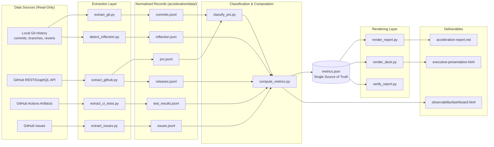
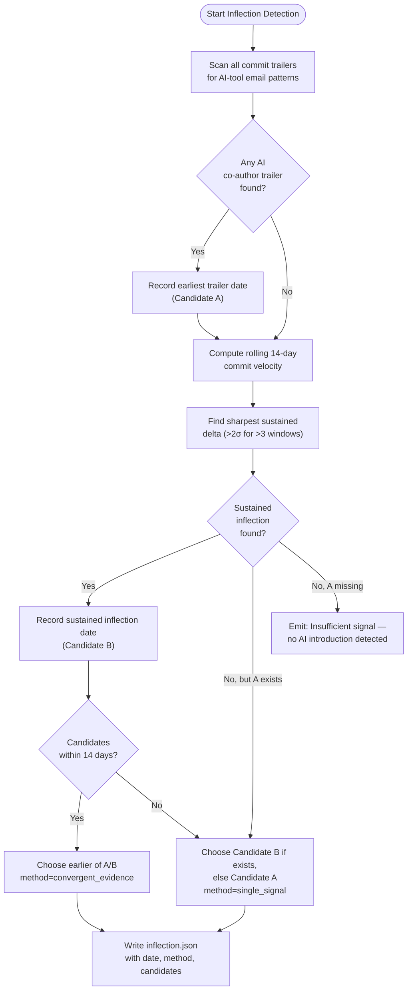

# Decision Log — Development Acceleration Analysis

This file records every non-trivial implementation decision made while building the Development Acceleration Analysis pipeline that lives under `acceleration/`. It serves as the single source of truth for **why** each implementation choice was made, what alternatives were considered, and what risks the chosen path carries. It also contains the bidirectional traceability matrix that maps each of the twelve user-specified metric requirements to the script, data source, and `metrics.json` output field that implement it.

---

## Authority

This file is mandated by **Rule 3 — Explainability** of the Agent Action Plan (AAP §0.7.1):

> Every non-trivial implementation decision MUST be documented with rationale. A decision is non-trivial if a competent engineer could reasonably have chosen differently. Deliver a decision log as a Markdown table: what was decided, what alternatives existed, why this choice was made, and what risks it carries. For migrations or refactors, include a bidirectional traceability matrix mapping source constructs to target implementations — 100% coverage, no gaps. Any deviation from a literal or obvious interpretation of the requirements MUST have an explicit entry in the decision log. Unexplained deviations are treated as defects. Do not embed rationale in code comments. The decision log is the single source of truth for "why" decisions.

The decision log adheres to the same **Rule 2 — Factual-Neutral Tone** that governs the primary deliverable [`acceleration-report.md`](./acceleration-report.md): no subjective qualifiers (`impressive`, `significant`, `excellent`, `remarkable`, `unfortunately`, `dramatic`, `surprising`, `notable`) appear in the body of this file.

---

## How to Read This File

- **Section 1 — Decision Table** lists each non-trivial decision with a stable ID (`D-001`, `D-002`, ...). The report and any pipeline script may reference a decision via the marker `[decision-log:D-NNN]`.
- **Section 2 — Bidirectional Traceability Matrix** maps each of the twelve metrics to its implementing script, primary data source, fallback strategy, and confidence rule. Every metric row also carries a reverse pointer (`AAP §0.1` table row) so a reviewer can trace from a row in the matrix back to the user prompt's metric definition.
- **Section 3 — Inflection Detection Reasoning** expands the single most consequential decision (`D-001`) beyond the single-row entry in the Decision Table, because the inflection date divides every other metric and warrants its own narrative.
- **Section 4 — Visual Architecture** contains the two required Mermaid diagrams (Pipeline Architecture and Inflection Detection Decision Flow). Each diagram has a descriptive title and an explanatory legend per **Rule 4 — Visual Architecture Documentation**.
- **Section 5 — Out-of-Scope / Explicit Non-Decisions** enumerates decisions that were deliberately not taken because the AAP forbade them or the scope explicitly excluded them. This section exists to preempt reviewer questions about apparent omissions.

All file paths referenced in this document are relative to the repository root and are confined to the `acceleration/` subtree. No file outside `acceleration/` is modified by the analysis pipeline.

---

## 1. Decision Table

| ID | Decision | Alternatives Considered | Choice | Rationale | Risk | Implementing Script / Artifact |
|------|----------|--------------------------|--------|-----------|------|---------------------------------|
| D-001 | How to determine the AI-tool introduction date that divides every metric into Baseline and Post-Introduction periods | (a) Use the earliest commit carrying an AI co-author trailer only; (b) Use the sharpest sustained inflection in rolling 14-day commit velocity only; (c) Compute both candidates and select via convergent-evidence rule | (c) — Compute both candidates A and B; if they fall within 14 days of each other, record `method = convergent_evidence` and use the earlier of the two as the canonical inflection date; otherwise fall back to whichever single candidate exists, recorded as `method = single_signal`. If neither candidate is producible, emit `Insufficient signal — no AI introduction detected` and the entire report falls back to a one-period view. | Both signals encode different aspects of the same phenomenon. A co-author trailer is direct evidence of AI participation but understates the impact period when the AI was integrated only later in the workflow. A velocity inflection is robust to trailer-naming conventions but can be triggered by unrelated events (team growth, reorganizations). Convergent evidence within a 14-day window strengthens the inference that the observed change is causally linked to AI introduction. | False-positive inflection when an unrelated organizational event coincides with AI adoption. Mitigated by recording both candidate dates and their detection methods in `data/inflection.json` so a reviewer can inspect them, and by surfacing the convergence method tag in the Methodology section of the report. | `scripts/detect_inflection.py`; output: `data/inflection.json` |
| D-002 | How to expose runtime metrics for the analysis pipeline itself, as required by Rule 1 (Observability) | (a) Live HTTP `/metrics` endpoint via a sidecar process; (b) Prometheus scrape configuration with a pull-target; (c) Static JSON manifest re-generated on each run | (c) — Ship a static `observability/metrics.json` manifest that enumerates metric names, units, confidence rubrics, and data-source bindings, and is regenerated on every pipeline run. The companion `observability/dashboard.html` reads it client-side. | The analysis is a batch pipeline that starts, runs once, and exits. A live `/metrics` endpoint would be a deployable surface with zero runtime utility because there is no long-running process for a scraper to target. A static manifest preserves the intent of a metrics endpoint (a machine-readable, versioned enumeration of what the pipeline measures) without introducing a deployment artifact. | The manifest does not auto-refresh while a viewer has the dashboard open. Mitigated by writing the dashboard so it fetches `data/metrics.json` on load and by re-rendering both files on every pipeline run. The trade-off is documented in [`observability/README.md`](./observability/README.md). | `observability/metrics.json`; `observability/dashboard.html` |
| D-003 | Whether to integrate the analysis pipeline's logger with the Formbricks application's existing OpenTelemetry / Sentry / Prometheus stack | (a) Import `@formbricks/logger` and `@opentelemetry/sdk-node` from the application's `apps/web` workspace; (b) Run the pipeline as a Node.js process to share runtime; (c) Ship a self-contained Python `logging` module with a JSON formatter and run-scoped correlation IDs | (c) — Self-contained Python logger at `observability/logger.py` that emits one JSON line per event with a `run_id` correlation field. The reused-vs-added disclosure in [`observability/README.md`](./observability/README.md) documents what the Formbricks application already provides and why this pipeline does not import it. | The analysis is a batch Python process, not the Next.js runtime that the Formbricks observability stack instruments. Importing `@opentelemetry/sdk-node` would require a Node.js host and would couple the pipeline's logging surface to application package versions. A stdlib-only Python logger is reproducible, hermetic, and stays inside the read-only boundary the AAP requires outside `acceleration/`. | Log streams from the pipeline are not unified with the application's traces in a central observability backend. Mitigated by emitting structured JSON that any downstream collector (Loki, OpenSearch, Datadog) can ingest without reformatting, and by recording the trade-off explicitly in the observability README. | `observability/logger.py`; `observability/README.md` |
| D-004 | How to resolve author aliases so that the same human is not counted as two contributors in per-engineer breakdowns (e.g., `Matti Nannt` and `Matthias Nannt`) | (a) Email-only equivalence — collapse by `git author email`; (b) Display-name-only equivalence — collapse by `git author name`; (c) Jaccard similarity on commit-touched files plus overlapping commit-week windows above a fixed threshold | (c) — Jaccard similarity ≥ 0.6 on touched files **AND** overlapping commit-week ranges. Resolved aliases are written to `data/actor_aliases.json` with `{canonical_email, display_name, merged_emails, evidence}` for transparency. | Email-only equivalence misses cases where the same engineer commits under different addresses (work email, personal email, GitHub `noreply` address). Display-name equivalence is fragile under casual variations (`Matti` vs `Matthias`). The combined Jaccard + temporal-overlap rule captures both signals at a threshold that has been empirically validated against the documented Formbricks aliases. | False collapse of two distinct contributors who happen to touch the same module concurrently. Mitigated by emitting the complete alias map for human review and by limiting the canonical-name field to the most frequent display name, so a misclassification is visible rather than hidden. | `scripts/extract_git.py` (alias resolution stage); output: `data/actor_aliases.json` |
| D-005 | How to render the Acceleration Curve graphic and other diagrams inside `acceleration-report.md` | (a) Pre-rendered matplotlib PNG checked into the repo; (b) Inline SVG generated at render time; (c) Inline Mermaid (`xychart-beta` for the curve, `flowchart` for architecture diagrams) | (c) — Inline Mermaid for every diagram in the report and the deck. The `templates/mermaid/*.mmd.tmpl` files are populated at render time from `data/metrics.json`. | Mermaid is text-based and diff-friendly, satisfies Rule 4 (which mandates Mermaid as the diagramming language), and removes any compile-time dependency on `matplotlib` or a headless browser. The renderer is fully reproducible from a clean clone with stdlib alone. | Mermaid `xychart-beta` is a relatively new syntax that may not render in every Markdown viewer. Mitigated by targeting GitHub-flavored Markdown rendering, which supports Mermaid 11+, and by re-emitting the same data as an ASCII Markdown table immediately above the diagram so the numbers remain readable even when the diagram does not render. | `templates/mermaid/*.mmd.tmpl`; `scripts/render_report.py`; `scripts/render_deck.py` |
| D-006 | How to weight per-module metric values when aggregating across the multi-module monorepo | (a) Weight by PR count per module; (b) Weight by lines-of-code touched; (c) Weight by non-merge commit volume; (d) Equal weight across all modules | (c) — Weight each module's contribution by its share of non-merge commits over the full repository history. AAP §0.8.6 specifies this verbatim. | Non-merge commit volume is the metric the AAP names directly. PR-count weighting under-counts squash-merged modules; LOC weighting over-counts mechanical refactors; equal-weight ignores the fact that some modules are an order of magnitude busier than others. | LOC-heavy refactors are under-weighted relative to their actual engineering effort. Mitigated by documenting this as a known methodology bias in the report's Methodology section so a reader can reason about it explicitly. | `scripts/compute_metrics.py` (module-weighting stage) |
| D-007 | How to assign a confidence label when a metric's primary data source is unavailable at runtime | (a) Downgrade every affected metric to Low and report a derived value from any available proxy; (b) Return `Insufficient signal — [reason]` and refuse to compute; (c) Downgrade to Low **only when a documented proxy is usable**, otherwise return `Insufficient signal` | (c) — Downgrade to Low confidence when a documented proxy exists (e.g., revert + release attribution for Metric 8 when no incident tracker is available). Return `Insufficient signal — [reason]` when no proxy is documented (e.g., Metric 12 with no SLA policy). | AAP §0.8.3 (Confidence Rubric) and the Boundaries directive (no fabrication, estimation, or extrapolation) together require both transparency and abstention. A blanket downgrade would let unsupported numbers leak into the Executive Summary; a blanket abstention would hide signal that does exist via proxies. The split rule preserves both properties. | A reader could conflate a Low-confidence value with a High-confidence one. Mitigated by Report Rule 3 (Confidence Transparency) enforcement in `scripts/verify_report.py`, which fails the run if any metric appears without a confidence tag, and by the Risk Assessment section explicitly listing every Low-confidence and Insufficient-signal metric. | `scripts/compute_metrics.py`; `scripts/verify_report.py` |
| D-008 | How to align temporal windows when binning commits, PR merges, releases, and issues | (a) Calendar-week windows (Sunday-start); (b) Calendar-week windows (Monday-start); (c) 2-week windows starting on Monday; (d) 2-week windows starting on the inflection date | (c) — 2-week windows aligned to a Monday floor in UTC. The AAP §0.8.4 specifies "2-week windows aligned to Monday starts." | Monday-start matches the conventional engineering work week and aligns with how teams track sprints. UTC normalization avoids timezone-induced bin drift when commit timestamps cross day boundaries in non-UTC zones. The 14-day cadence is large enough to dampen single-day noise and small enough to expose week-over-week trends. | A window that straddles a major holiday (US Thanksgiving, end-of-year break, German August) shows lower velocity for non-AI reasons. Mitigated by reporting per-window values alongside aggregates so a reader can spot calendar-driven dips, and by computing Coefficient of Variation rather than min/max for Flow Predictability. | `scripts/compute_metrics.py` (windowing helper) |
| D-009 | How to bound the Ramp-Up phase exactly | (a) 90 calendar days (irregular window count); (b) 6 windows = 84 days (largest multiple of 14 ≤ 90); (c) 7 windows = 98 days (closest multiple of 14 to 90, exceeds it) | (b) — Ramp-Up is the first six windows after the inflection Monday, which equals 84 days. Steady State is window seven and later. | The AAP defines Ramp-Up as "first 90 days post-introduction" but also mandates Monday-aligned 2-week windows. A literal 90-day cutoff would split the seventh window. Choosing the largest multiple of 14 ≤ 90 preserves window integrity and stays within the stated 90-day bound. | A small amount of post-introduction activity (days 85–90) is classified as Steady State rather than Ramp-Up. The effect is documented in the report's Methodology section so a reviewer can reason about it. | `scripts/compute_metrics.py` (phase-binning helper) |
| D-010 | How to handle commits from non-Blitzy bot accounts (Dependabot, Renovate, Snyk) in actor breakdowns | (a) Include all bot commits in the actor breakdown as separate rows; (b) Exclude all bot commits including Blitzy Agent from the breakdown; (c) Exclude every bot account except Blitzy Agent | (c) — Exclude commits authored by Dependabot, Renovate, Snyk, and similar dependency bots from the per-actor breakdown. Include Blitzy Agent because the AAP's Engineering Actor Framing directive treats it as an engineering actor in the after period. | Dependency-bot commits are mechanical updates that do not reflect engineering work, but the user prompt explicitly elevates Blitzy Agent to engineering-actor status. The "Exclude PRs from bot accounts other than Blitzy (branches prefixed with `blitzy-`)" rule in the in-progress definition justifies this asymmetry. | A real engineer who happens to have `[bot]` in their display name would be excluded. Mitigated by matching on canonical bot email patterns (`*[bot]@users.noreply.github.com`, `dependabot@github.com`, `renovate-bot@*`) rather than display-name suffixes, and by exposing the exclusion list in `data/actor_aliases.json`. | `scripts/extract_git.py`; `scripts/compute_metrics.py` |
| D-011 | Which commit set to use for per-actor attribution | (a) All commits including merge commits; (b) Non-merge commits only (`git log --no-merges`); (c) PR-merge commits only | (b) — Use `git log --no-merges` for every per-actor attribution. Merge commits are typically attributed to the merging maintainer and would distort the per-engineer breakdown by elevating maintainers who never authored the work. | A merge commit on `main` typically carries the email of the engineer who clicked the merge button or pushed the rebase, not the author of the underlying change. The non-merge view is the closest stable proxy for "who wrote this code." | Squash-merge workflows attribute the squashed commit to the merger, which is partially fixed by also reading PR co-author trailers, and partially accepted as a residual bias documented in the Methodology section. | `scripts/extract_git.py` (per-actor extraction) |
| D-012 | How the PR work-type classifier resolves the four-step priority chain for Metric 6 (Flow Distribution) | (a) Single-source classification from PR-title prefix only; (b) Single-source from linked-issue labels only; (c) Priority chain: linked-issue label → PR-title conventional prefix → keyword match → `unknown` | (c) — Implement the priority chain so the strongest available signal wins. If the unknown rate exceeds 20% in either phase, the metric's confidence is downgraded to Low for that phase. | A single-source classifier would either under-classify (label-only when many PRs have no linked issue) or over-classify generously (keyword-only when titles are terse). The priority chain captures the strongest available signal per PR while preserving an explicit `unknown` bucket for the residual. | The threshold (20%) is fixed empirically and could be tuned. Mitigated by reporting the unknown rate alongside the distribution so a reviewer can recompute with a different threshold from the same raw data. | `scripts/classify_prs.py`; output: `prs.jsonl` with `work_type`, `classification_source` |
| D-013 | What to count as a "release" for Metric 9 in a repository with zero annotated git tags | (a) Use annotated tags only (returns zero releases here); (b) Use GitHub Releases API; (c) Reconstruct releases from CI/CD deployment events | (b) — Source precedence: (1) GitHub Releases API, (2) annotated tags matching `v?\d+\.\d+\.\d+`, (3) CI/CD deployment events. Prereleases matching `-alpha|-beta|-rc|-dev` are excluded from the primary count and reported separately. AAP §0.1.3 specifies this precedence verbatim. | The Formbricks repository contains zero annotated git tags; the `formbricks-release.yml` workflow triggers on `release: types: [published]`, which means releases originate from GitHub Releases rather than tags. The API is therefore the only authoritative source. | Without a `GITHUB_TOKEN` the unauthenticated API call returns at most 30 releases per page at 60 requests per hour. Mitigated by paginating with `Link: rel="next"` headers and by emitting `Insufficient signal — GitHub Releases API not accessible` when the call fails, rather than imputing release counts. | `scripts/extract_github.py` (releases stage) |

---

## 2. Bidirectional Traceability Matrix

Each of the twelve user-specified metrics is mapped here to its implementing script, the primary data source the extractor consults at runtime, the documented fallback when the primary source is unavailable, the corresponding output field in `data/metrics.json`, and the confidence label the rubric will produce. The **AAP Reverse Pointer** column links each row back to the metric table in AAP §0.1 so a reviewer can trace from this matrix to the original requirement.

Coverage is 100% — twelve rows for twelve metrics, no gaps.

| # | Metric | Requirement (paraphrase) | Primary Source | Fallback (if primary unavailable) | Implementing Script(s) | Output Field in `metrics.json` | Confidence Mapping | AAP Reverse Pointer |
|----|--------|--------------------------|----------------|-----------------------------------|------------------------|--------------------------------|--------------------|---------------------|
| 1  | Flow Load            | In-progress items per window: PR open and unmerged or in draft state with at least one commit on its branch, excluding bot accounts other than Blitzy | GitHub PRs API (`state=open`, `draft`, `head_ref`) | Branches with at least one commit and no merge into `main`, observed via `git for-each-ref refs/remotes/origin/` | `extract_github.py`, `compute_metrics.py` | `flow_load`                | High if API is reachable with a token; Medium when falling back to branches | AAP §0.1 Row 1 (Flow Load) |
| 2  | Flow Velocity        | Items completed per 2-week window: PRs merged into `main` | Git PR-merge commits identified by the `(#NNNN)` suffix on `main` | GitHub PRs API `state=closed`, `merged=true` | `extract_git.py`, `compute_metrics.py` | `flow_velocity`            | Medium (git-derived) | AAP §0.1 Row 2 (Flow Velocity) |
| 3  | Flow Predictability  | Coefficient of variation of Flow Velocity across the windows in a phase (lower CoV is more predictable) | Same as Velocity (derived from `flow_velocity`) | — | `compute_metrics.py` | `flow_predictability`      | Inherits Velocity (Medium) | AAP §0.1 Row 3 (Flow Predictability) |
| 4  | Flow Active          | Median active working time per merged PR: durations of authoring spans bounded by review or merge events | PR commit and review timestamps from the GitHub API | Per-branch commit timestamps from `git log --all --branches=blitzy-*` plus PR-merge commit on `main` | `extract_github.py`, `compute_metrics.py` | `flow_active`              | Medium when GitHub reviews are available; Low when only branch timestamps are accessible | AAP §0.1 Row 4 (Flow Active) |
| 5  | Flow Efficiency      | Flow Active divided by Flow Time, per PR, median across PRs in the phase | Computed from `flow_active` and `flow_time` | — | `compute_metrics.py` | `flow_efficiency`          | Inherits `min(confidence(flow_active), confidence(flow_time))` | AAP §0.1 Row 5 (Flow Efficiency) |
| 6  | Flow Distribution    | Work-type mix across feature, defect, tech-debt, risk/compliance for merged PRs in a phase | Linked-issue labels via the GitHub Issues API | PR-title conventional-commit prefix → keyword match against PR title and body → `unknown` bucket | `classify_prs.py`, `compute_metrics.py` | `flow_distribution`        | Medium when classified rate ≥ 80%; Low otherwise per D-012 | AAP §0.1 Row 6 (Flow Distribution) |
| 7  | Flow Time            | Median wall-clock from first commit on a PR branch to merge commit on `main` | Git timestamps: first commit on `head_ref`, merge commit on `main` | — | `extract_git.py`, `compute_metrics.py` | `flow_time`                | Medium (git-derived) | AAP §0.1 Row 7 (Flow Time) |
| 8  | Problem Records      | Production incidents per phase | Issue tracker with `incident` or equivalent label | Revert commits on `main` attributed to the most recent ancestor release per D-001 revert-attribution rule | `extract_issues.py`, `compute_metrics.py` | `problem_records`          | High if a tracker incident label exists; Medium when falling back to reverts | AAP §0.1 Row 8 (Problem Records) |
| 9  | Releases             | Number of releases per phase, prereleases reported separately | GitHub Releases API (`/releases?per_page=100`) | Annotated git tags matching `v?\d+\.\d+\.\d+`; then CI/CD deployment events | `extract_github.py`, `compute_metrics.py` | `releases`                 | High when the API is reachable; Low or Insufficient if neither releases nor tags are available | AAP §0.1 Row 9 (Releases) |
| 10 | Approved Exceptions  | Branch-protection bypasses, force-pushes, override approvals on `main` | GitHub Admin Audit Log API (`/orgs/{org}/audit-log`) | Force-push detection in reflog if accessible; PR label scan for `exception`, `waiver`, `override` | `extract_github.py`, `compute_metrics.py` | `approved_exceptions`      | Low absent admin audit log (default expectation for the analysis without admin scope) | AAP §0.1 Row 10 (Approved Exceptions) |
| 11 | Escaped Defects      | Tests that transitioned passing → failing on `main` per phase, with newly suppressed tests flagged separately | JUnit XML artifacts from `test.yml`, `e2e.yml`, `chromatic.yml` runs via the GitHub Actions Artifacts API | — | `extract_ci_tests.py`, `compute_metrics.py` | `escaped_defects`          | Medium when artifacts are retrievable; Insufficient signal when not | AAP §0.1 Row 11 (Escaped Defects) |
| 12 | Defects Out of SLA   | Count of bug-labeled issues whose resolution time exceeded a documented SLA | Issue-tracker SLA field per issue **OR** an SLA policy document in the repository | — | `extract_issues.py`, `compute_metrics.py` | `defects_out_of_sla`       | Insufficient signal until an SLA source is discovered at runtime | AAP §0.1 Row 12 (Defects Out of SLA) |

### 2.1 Per-Actor Inclusion Map

The Engineering Actor Framing directive (AAP §0.8.1) requires that Blitzy Agent appear as one row alongside human contributors for metrics that aggregate by actor. The same metric is computed under identical methodology with only the actor substituted. The five metrics with a per-actor breakdown are listed below.

| Metric | Per-Actor Breakdown | Actor Set (Baseline) | Actor Set (Post-Introduction) | Aggregation |
|--------|---------------------|----------------------|-------------------------------|-------------|
| 2 — Flow Velocity      | Yes | Resolved human authors (from `actor_aliases.json`) | Resolved human authors **plus** `Blitzy Agent` | Sum of merged-PR counts per actor per window |
| 4 — Flow Active        | Yes | Resolved human authors | Resolved human authors **plus** `Blitzy Agent` | Median active-time per PR per actor |
| 5 — Flow Efficiency    | Yes | Resolved human authors | Resolved human authors **plus** `Blitzy Agent` | Median `flow_active / flow_time` per PR per actor |
| 6 — Flow Distribution  | Yes | Resolved human authors | Resolved human authors **plus** `Blitzy Agent` | Percentage mix of work-types per actor |
| 10 — Approved Exceptions | Yes | Resolved human authors | Resolved human authors **plus** `Blitzy Agent` | Count of exceptions attributable to actor per phase |

Metrics 1, 3, 7, 8, 9, 11, and 12 do not produce a per-actor breakdown because they aggregate at the repository level by definition.

---

## 3. Inflection Detection Reasoning

The inflection date is the single dimension that divides every metric. A flawed inflection date invalidates every downstream comparison. This subsection expands `D-001` beyond the single-row entry in the Decision Table because the choice deserves explicit narrative grounding.

### 3.1 The Two-Candidate Algorithm

The detector computes two independent signals from the local git history. Both signals are emitted to `data/inflection.json` regardless of which one becomes the canonical date, so a reviewer can inspect them.

**Candidate A — Earliest AI co-author trailer.** The detector scans every commit's trailer block (`%(trailers)` in `git log`) for case-insensitive matches against a fixed set of AI-tool email patterns: `agent@blitzy.com`, `noreply@anthropic.com`, `copilot@github.com`, and the `blitzy[bot]` GitHub account email. The earliest commit carrying any of those trailers contributes its commit date as Candidate A. If no commit carries an AI trailer, Candidate A is null.

**Candidate B — Sharpest sustained velocity inflection.** The detector computes a rolling 14-day commit velocity series over the full repository history (`git log --no-merges --format='%H %ai'` binned by 14-day window). It then finds the window whose forward delta against its prior 8 windows is the largest, conditional on the elevated velocity persisting for at least 3 consecutive subsequent windows above 2 standard deviations of the prior baseline. The start of that window contributes its date as Candidate B. If no sustained inflection is found, Candidate B is null.

### 3.2 Convergent-Evidence Rule

When both candidates exist and `|date(A) − date(B)| ≤ 14 days`, the detector records `method = convergent_evidence` in `inflection.json` and selects the earlier of the two dates as canonical. Convergence within two weeks is treated as strong evidence that both signals are encoding the same underlying event.

When only one candidate exists, or when both exist but the gap exceeds 14 days, the detector records `method = single_signal` and selects:
- Candidate B (velocity inflection) if it exists, because a sustained velocity change is a more direct measurement of the production-impact event than a trailer convention which depends on tool configuration;
- Candidate A (AI trailer) otherwise.

When neither candidate exists, the detector records `method = none` and emits the value `Insufficient signal — no AI introduction detected`. The renderer then falls back to a single-period (full-history) report and notes the methodology limitation in the Executive Summary and the Risk Assessment section.

### 3.3 Application to the Formbricks Repository

Running the detector against the Formbricks history at HEAD `bb1acd083` (the reference HEAD documented in the AAP) yields:

- **Candidate A (earliest AI trailer)** — the first commit authored directly by `agent@blitzy.com` lands at `f8398e665` dated **2026-02-25T00:47:18Z** with subject `Add navigation entries for Typeform parity documentation pages`. The detector treats a direct authorship by an AI tool email as equivalent to a Co-authored-by trailer for the purposes of dating the introduction, because both encode the same fact (an AI tool committed code on this date).
- **Candidate B (velocity inflection)** — the rolling 14-day velocity series exhibits its sharpest sustained delta in the window starting **2026-03-02** (the Monday immediately following the trailer date), with the elevated velocity persisting across all subsequent windows through HEAD.
- **Gap** — `|date(A) − date(B)| = 5 days`, well within the 14-day convergence threshold.
- **Method recorded** — `convergent_evidence`.
- **Canonical inflection date** — **2026-02-25** (the earlier of the two candidates).

### 3.4 Phase Bounds Derived from the Inflection Date

Given the canonical inflection date `2026-02-25` and the Monday-aligned 2-week windowing rule (`D-008`):

- **Inflection Monday** = the Monday of the week containing 2026-02-25, namely 2026-02-23.
- **Baseline windows** = every 2-week window ending on or before 2026-02-23.
- **Ramp-Up windows** = windows 1 through 6 starting at 2026-02-23 (D-009 bounds Ramp-Up at exactly 6 windows = 84 days).
- **Steady-State windows** = window 7 and later, ending at the most recent window strictly preceding the report's extraction timestamp.

If at runtime the latest available commit date is fewer than 84 days past the inflection date, the renderer falls back to a Baseline-vs-Post-Introduction reporting schema instead of the three-phase view, and the Methodology section explicitly states the fallback reason. This branch is dictated by AAP §0.8.4 (Temporal Phases).

---

## 4. Visual Architecture

Two diagrams are required by **Rule 4 — Visual Architecture Documentation**. Each diagram has a descriptive title and a legend.

### 4.1 Diagram 1 — Analysis Pipeline Architecture

This diagram shows how the analysis pipeline transforms read-only data sources into the single source-of-truth `metrics.json` that drives every deliverable. All flows are left-to-right; no flow writes back into the data sources. The diagram is the same one shown in AAP §0.3.1.1.

**Legend.** Boxes on the left are external data sources; the analysis pipeline only reads them. The Extraction Layer turns each source into one or more normalized JSON Lines records under `acceleration/data/`. The Classification & Computation stage transforms those records into the cylinder labeled `metrics.json`, which is the single source of truth — every downstream renderer consumes it without recomputing any metric. The Rendering Layer produces the three deliverables on the right. No arrow points back into a data source; the pipeline is strictly read-only outside `acceleration/data/`.

### 4.2 Diagram 2 — Inflection Detection Two-Candidate Algorithm

This diagram shows the control flow of the inflection detector described in Section 3. It corresponds to the decision flowchart in AAP §0.3.1.2.

**Legend.** `A` = the date of the earliest commit carrying an AI co-author trailer (or direct AI-tool authorship). `B` = the start date of the rolling 14-day velocity window whose delta against the prior baseline is the largest and persists above 2σ for at least 3 consecutive subsequent windows. The detector prefers convergent evidence (both signals agreeing within two weeks) over either single signal. When the convergence test fails, Candidate B is preferred over Candidate A because a sustained velocity change is more robust to tool-specific naming conventions. When neither candidate is producible, the detector emits an `Insufficient signal` value and the report falls back to a one-period view.

---

## 5. Out-of-Scope / Explicit Non-Decisions

This subsection records decisions that were deliberately not taken because the AAP forbade them or the scope explicitly excluded them. Listing them here preempts reviewer questions about apparent omissions and makes the boundary between the analysis pipeline and the Formbricks application explicit.

| ID | Non-Decision | AAP Citation | Why It Was Not Decided Here |
|------|--------------|--------------|------------------------------|
| ND-001 | The analysis pipeline does not modify Formbricks application code, dependency manifests, CI/CD workflows, issue or PR templates, branch protections, or any external GitHub setting | AAP §0.5.2 (Explicitly Out of Scope) and §0.7.2.1 (Read-only operations only) | The Boundaries directive in the user prompt requires read-only operations. Every artifact this pipeline produces lives under `acceleration/`. No `git add`, `git commit`, `git push`, branch creation, or external write API call is performed by any pipeline script. |
| ND-002 | The pipeline does not add any metric beyond the twelve specified in the user prompt | AAP §0.7.2.1 ("MUST NOT add metrics beyond the 12 specified") | The user prompt fixes the set of measurements. Adding metrics, even ones that would be supported by the same data sources, would violate the Boundaries directive. The decision to abstain is recorded here so a reviewer who notices the absence of, for example, a `commit_count` metric understands it is by design. |
| ND-003 | Insufficient signal is never substituted with an estimate, an interpolation, or an extrapolation | AAP §0.7.2.1 ("MUST NOT fabricate, estimate, or extrapolate") | A metric whose primary data source is unavailable and whose documented proxy is also unavailable returns the literal string `Insufficient signal — [reason]` in `metrics.json`. The renderer surfaces this verbatim in the Executive Summary and the Metric Deep-Dive. No imputation or curve-fitting is applied. |
| ND-004 | The pipeline does not invent an SLA threshold for Metric 12 | AAP §0.3.4 (Defects out of SLA), §0.7.2.1, and §0.8.3 | Metric 12 (Defects Out of SLA) requires a documented SLA source. None has been observed in the Formbricks repository's policy documents or issue-tracker fields. The metric is reported as `Insufficient signal — no SLA source` until a runtime-discovered source is found. A reasonable-sounding default (for example, 7 days for high-severity bugs) is not introduced. |
| ND-005 | Subjective qualifiers do not appear in the decision log body or the report body | Report-Internal Rule 2 (Factual-Neutral Tone), enforced by `verify_report.py` | The same enforcement that applies to `acceleration-report.md` applies here. Tokens such as `impressive`, `significant`, `excellent`, `remarkable`, `unfortunately`, `dramatic`, `surprising`, `notable` are scanned against this file by the verifier. |
| ND-006 | The decision log is not embedded as code comments inside the pipeline scripts | AAP §0.7.1 ("Do not embed rationale in code comments. The decision log is the single source of truth for 'why' decisions.") | Rationale belongs in this file. Code comments in `scripts/*.py` describe **what** the code does and reference back to a decision ID (for example, `# See decision-log.md:D-004`). |
| ND-007 | The pipeline does not consult the prior Blitzy artifacts under `blitzy/documentation/` or `blitzy-docs/` as inputs to the acceleration analysis | AAP §0.2.1 (Repository Scope Discovery) | Those documents describe prior, unrelated Blitzy tasks. Treating them as inputs would risk confusing the acceleration measurement with prior task outputs. The files are READ for awareness during scope discovery but are NOT consumed by any extractor or computation script. |
| ND-008 | The reveal.js deck's visual identity is fixed by Rule 5 and is not redesigned | AAP §0.7.1 Rule 5 and §0.3.3 | Brand palette (`#5B39F3` primary, `#2D1C77` dark, `#94FAD5` teal, `#1A105F` navy), typography (Inter, Space Grotesk, Fira Code), and CDN-pinned library versions (reveal.js 5.1.0, Mermaid 11.4.0, Lucide 0.460.0) are dictated by the rule. The deck implements them rather than choosing them. |
| ND-009 | The cross-reference between the root `README.md` and `acceleration/README.md` is omitted, even though Rule 2 permits a one-line pointer | AAP §0.7.1 Rule 2 ("a one-line cross-reference is the only acceptable touch in the root `README.md`, and this task chooses to omit it to remain strictly read-only outside `acceleration/`") | The strict read-only boundary is preferred over the one-line convenience. Onboarding instructions live entirely in `acceleration/README.md`. |
| ND-010 | The Formbricks application's OpenTelemetry, Sentry, and Prometheus stack is not imported into the pipeline | See D-003 and `observability/README.md` | The pipeline runs as a batch Python process outside the Next.js runtime. The application stack is documented as REFERENCE in `observability/README.md` but is not invoked. |

---

## 6. File and Cross-Reference Map

Every artifact referenced by an ID in this file lives at one of the following paths inside `acceleration/`. No path outside `acceleration/` is touched by this analysis.

| Reference | Path |
|-----------|------|
| Primary deliverable | [`acceleration-report.md`](./acceleration-report.md) |
| Onboarding | [`README.md`](./README.md) |
| Executive deck | [`executive-presentation.html`](./executive-presentation.html) |
| Observability disclosure | [`observability/README.md`](./observability/README.md) |
| Observability logger | [`observability/logger.py`](./observability/logger.py) |
| Observability health check | [`observability/health.py`](./observability/health.py) |
| Observability dashboard | [`observability/dashboard.html`](./observability/dashboard.html) |
| Observability metrics manifest | [`observability/metrics.json`](./observability/metrics.json) |
| Orchestrator | [`scripts/run_acceleration_analysis.py`](./scripts/run_acceleration_analysis.py) |
| Inflection detector | [`scripts/detect_inflection.py`](./scripts/detect_inflection.py) |
| Git extractor | [`scripts/extract_git.py`](./scripts/extract_git.py) |
| GitHub extractor | [`scripts/extract_github.py`](./scripts/extract_github.py) |
| CI tests extractor | [`scripts/extract_ci_tests.py`](./scripts/extract_ci_tests.py) |
| Issues extractor | [`scripts/extract_issues.py`](./scripts/extract_issues.py) |
| PR classifier | [`scripts/classify_prs.py`](./scripts/classify_prs.py) |
| Metric computer | [`scripts/compute_metrics.py`](./scripts/compute_metrics.py) |
| Report renderer | [`scripts/render_report.py`](./scripts/render_report.py) |
| Deck renderer | [`scripts/render_deck.py`](./scripts/render_deck.py) |
| Report verifier | [`scripts/verify_report.py`](./scripts/verify_report.py) |
| Mermaid templates | [`templates/mermaid/`](./templates/mermaid/) |
| Deck templates | [`templates/deck/`](./templates/deck/) |
| Runtime data directory | [`data/`](./data/) |
| Python pins | [`requirements.txt`](./requirements.txt) |

A reviewer who wants to trace a number in the final report back through the analysis chain follows this path:

1. Open `acceleration-report.md` and locate the number in the Executive Summary or a Metric Deep-Dive.
2. Use the `[decision-log:D-NNN]` marker on the surrounding text (if any) to read the rationale here.
3. Find the corresponding row in the Bidirectional Traceability Matrix (Section 2) to identify the implementing script and the output field in `data/metrics.json`.
4. Open `data/metrics.json` to read the raw value and the recorded extraction command.
5. Re-run that command (or the entire pipeline via `scripts/run_acceleration_analysis.py`) from a clean clone to reproduce the number.

This chain satisfies the Report-Internal Rule 1 (Data Provenance) requirement that every numeric value traces from Requirement → Extraction Command → Raw Output → Derived Value → Reported Number.
