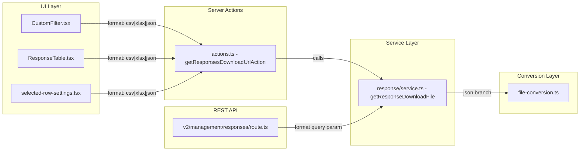

# Technical Specification

# 0. Agent Action Plan

## 0.1 Intent Clarification

### 0.1.1 Core Feature Objective

Based on the prompt, the Blitzy platform understands that the new feature requirement is to **complete Sprint 2 ("Logic & Data")** of the Typeform parity initiative for the Formbricks monorepo. Sprint 2 consists of two parallel epics:

- **Epic 2.1 — Logic Operator Parity**: Verify that every Typeform logic condition type has a functionally equivalent operator in Formbricks. Extend the logic condition system to support `opinionScale` and `payment` element types (added in Sprint 1) as left operands with appropriate operators, verify cyclic detection handles these new types, and ensure comprehensive test coverage.

- **Epic 2.2 — JSON Response Export**: Add `"json"` as a third export format alongside `"csv"` and `"xlsx"` in the response download pipeline. This includes extending the `getResponseDownloadFile` function signature, creating a `convertToJson` function, adding a JSON option to the download UI, exposing JSON export through the REST API, and implementing lossless validation.

The following implicit requirements have been surfaced:

- Both epics are parallel workstreams and can proceed independently.
- Sprint 2 depends on Sprint 1 (new `opinionScale` and `payment` element types must already exist), which has been confirmed as complete in the codebase.
- The AAP constraint requires **100% logic jump coverage** — every Typeform operator must have a Formbricks equivalent.
- The AAP constraint requires **lossless export** — JSON output must preserve every response field without truncation, rounding, or encoding loss.
- All steps in the sprint roadmap are **mandatory deliverables**; nothing in any other doc overrides or defers a step listed in the roadmap.

### 0.1.2 Special Instructions and Constraints

The user has provided explicit classification guidance for roadmap steps:

- If a step uses any of "Add", "Create", "Expose", "Enable", or "Introduce" — default to **CREATE**. Only downgrade to **VERIFY** after reading the relevant file in full and confirming the exact functionality already exists.
- Do not classify a step as VERIFY based on file name or directory path alone. Locate the specific function, route, or class that implements the required behavior.
- When verifying an API endpoint, trace the full call chain — confirm the route calls the required service function, not just that a route file exists in the expected directory.

The user specifies three equally authoritative source-of-truth documents:

- `docs/development/typeform-parity/sprint-roadmap.mdx` — Sprint 2 steps (lines 164–247)
- `docs/development/typeform-parity/logic-parity.mdx` — Epic 2.1 implementation details
- `docs/development/typeform-parity/export-parity.mdx` — Epic 2.2 implementation details
- `docs/development/typeform-parity/question-type-parity.mdx` — Supporting context for `opinionScale` and `payment` types

Architectural requirements identified from the codebase:

- Follow the existing monorepo convention using pnpm workspaces and Turborepo
- Maintain Zod schema patterns for type validation in `packages/types/`
- Follow the existing test patterns using Vitest
- Preserve the block-based logic system architecture
- Maintain the existing export pipeline architecture with cursor-based batching

### 0.1.3 Technical Interpretation

These feature requirements translate to the following technical implementation strategy:

- To **verify logic operator parity**, we will systematically confirm every Typeform operator maps to a Formbricks `ZSurveyLogicConditionsOperator` enum value by cross-referencing the operator catalog in `logic-parity.mdx` against the 32 operators in `packages/types/surveys/logic.ts`.

- To **extend logic support for `opinionScale`**, we will verify the numeric handling in `packages/surveys/src/lib/logic.ts` (lines 110–118) that already treats `OpinionScale` values as numbers, and confirm the operator set (equals, doesNotEqual, isGreaterThan, isLessThan, isGreaterThanOrEqual, isLessThanOrEqual, isSubmitted, isSkipped) is exposed in the logic rule engine at `apps/web/modules/survey/editor/lib/logic-rule-engine.ts`.

- To **extend logic support for `payment`**, we will verify the `isSubmitted`/`isSkipped` operator handling in both `packages/surveys/src/lib/logic.ts` and `apps/web/lib/surveyLogic/utils.ts`, and confirm the operator set is registered in the logic rule engine.

- To **verify cyclic detection**, we will confirm that `findBlocksWithCyclicLogic` in `packages/types/surveys/blocks-validation.ts` operates at the block level and correctly handles blocks containing any element type, including `opinionScale` and `payment`.

- To **add comprehensive test coverage**, we will verify existing test cases in `packages/surveys/src/lib/logic.test.ts` and `apps/web/lib/surveyLogic/utils.test.ts` for `opinionScale` and `payment` element types, and create additional cases if gaps are found.

- To **implement JSON export**, we will modify `apps/web/lib/response/service.ts` to accept `"json"` in the format union, create a `convertToJson` function in `apps/web/lib/utils/file-conversion.ts`, update the download UI in `apps/web/app/(app)/environments/[environmentId]/surveys/[surveyId]/components/CustomFilter.tsx`, extend the server action in the corresponding `actions.ts`, update the browser download utility in `utils.ts`, and add JSON labels to all locale files.

- To **expose JSON export via the REST API**, we will update the v2 management responses route handler at `apps/web/modules/api/v2/management/responses/route.ts` to handle the `format=json` query parameter, and verify the OpenAPI specs at `docs/api-reference/openapi.json` and `docs/api-v2-reference/openapi.yml` already document the JSON option.

- To **validate lossless export**, we will implement field-by-field equivalence checks following the 7 fidelity metrics defined in `export-parity.mdx`.

## 0.2 Repository Scope Discovery

### 0.2.1 Comprehensive File Analysis — Existing Files to Modify

The following files have been identified through exhaustive codebase inspection as requiring modification or verification for Sprint 2.

**Epic 2.1 — Logic Operator Parity (VERIFY-heavy)**

| File | Purpose | Action | Notes |
|------|---------|--------|-------|
| `packages/types/surveys/logic.ts` | Defines `ZSurveyLogicConditionsOperator` (32 operators) | VERIFY | Confirm all 20 Typeform operators are mapped; add new operators only if gaps found |
| `packages/types/surveys/constants.ts` | Defines `TSurveyElementTypeEnum` with `Payment` and `OpinionScale` | VERIFY | Confirmed already has both types |
| `packages/types/surveys/elements.ts` | Defines `ZSurveyOpinionScaleElement` and `ZSurveyPaymentElement` | VERIFY | Confirmed both element schemas exist and are included in `ZSurveyElement` union |
| `packages/types/surveys/blocks-validation.ts` | DFS-based cyclic logic detection (`findBlocksWithCyclicLogic`) | VERIFY | Operates at block level — element types do not affect detection algorithm |
| `packages/types/surveys/validation-rules.ts` | `APPLICABLE_RULES` map per element type | VERIFY | Confirmed `payment: ["minValue", "maxValue"]` and `opinionScale: []` already exist |
| `packages/surveys/src/lib/logic.ts` | Runtime logic evaluation engine | VERIFY | `getLeftOperandValue` already handles `OpinionScale` numeric parsing (lines 110-118); `isSubmitted` handles Payment via generic string check |
| `packages/surveys/src/lib/logic.test.ts` | Logic evaluation test suite (1823 lines) | VERIFY/MODIFY | Already has OpinionScale tests (line 1168+) and Payment mock elements (line 137); add additional test cases if coverage gaps found |
| `apps/web/lib/surveyLogic/utils.ts` | Survey logic utilities for web app | VERIFY | Already handles `opinionScale` numeric conversion (line 536) and `payment` isSubmitted check (line 409) |
| `apps/web/lib/surveyLogic/utils.test.ts` | Logic utils test suite | VERIFY/MODIFY | Already has OpinionScale and Payment tests (line 1379+); add additional cases if gaps found |
| `apps/web/modules/survey/editor/lib/logic-rule-engine.ts` | Logic rule editor — operator mapping by element type | VERIFY | Already maps OpinionScale (line 409) and Payment (line 445) to their valid operators |
| `apps/web/modules/survey/editor/lib/logic-rule-engine.test.ts` | Logic rule engine tests | VERIFY | Already has OpinionScale (line 434) and Payment (line 455) test cases |

**Epic 2.2 — JSON Response Export (CREATE-heavy)**

| File | Purpose | Action | Notes |
|------|---------|--------|-------|
| `apps/web/lib/response/service.ts` | `getResponseDownloadFile` — main export function | MODIFY | Extend format parameter from `"csv" \| "xlsx"` to `"csv" \| "xlsx" \| "json"`; add JSON branch at line ~425 |
| `apps/web/lib/utils/file-conversion.ts` | Format conversion utilities (`convertToCsv`, `convertToXlsxBuffer`) | MODIFY | Add `convertToJson` function |
| `apps/web/app/(app)/environments/[environmentId]/surveys/[surveyId]/components/CustomFilter.tsx` | Download dropdown UI | MODIFY | Add JSON options for "All responses (JSON)" and "Filtered responses (JSON)" |
| `apps/web/app/(app)/environments/[environmentId]/surveys/[surveyId]/actions.ts` | Server action `getResponsesDownloadUrlAction` | MODIFY | Extend format schema `z.union([z.literal("csv"), z.literal("xlsx")])` to include `z.literal("json")` |
| `apps/web/app/(app)/environments/[environmentId]/surveys/[surveyId]/utils.ts` | Browser download utility `downloadResponsesFile` | MODIFY | Add `"json"` file type handling with `application/json` MIME type |
| `apps/web/app/(app)/environments/[environmentId]/surveys/[surveyId]/(analysis)/responses/components/ResponseTable.tsx` | Response table with row-level download | MODIFY | Update format type from `"csv" \| "xlsx"` to include `"json"` |
| `apps/web/modules/ui/components/data-table/components/selected-row-settings.tsx` | Row selection download buttons | MODIFY | Add JSON download option alongside CSV/XLSX |
| `apps/web/modules/ui/components/data-table/components/data-table-toolbar.tsx` | Data table toolbar download integration | VERIFY | Check if `downloadRowsAction` format type needs updating |
| `apps/web/modules/api/v2/management/responses/route.ts` | V2 Management API GET handler | MODIFY | Add format query parameter handling to support JSON/CSV/XLSX export |
| `apps/web/modules/api/v2/management/responses/types/responses.ts` | V2 API response filter types | MODIFY | Add `format` field to `ZGetResponsesFilter` schema |
| `apps/web/modules/api/v2/management/responses/lib/openapi.ts` | V2 API OpenAPI operation definitions | MODIFY | Add format parameter to `getResponsesEndpoint` |
| `docs/api-reference/openapi.json` | V1 API OpenAPI specification | VERIFY | Already includes `format` enum with `["json", "csv", "xlsx"]` |
| `docs/api-v2-reference/openapi.yml` | V2 API OpenAPI specification | VERIFY | Already includes `format` enum with `["json", "csv", "xlsx"]` |
| `apps/web/lib/response/utils.ts` | Response utilities (`getResponsesFileName`, `getResponsesJson`) | VERIFY | `getResponsesFileName` already accepts dynamic extension — will produce `.json` automatically |
| `apps/web/locales/en-US.json` | English locale strings | MODIFY | Add JSON download labels: `all_responses_json`, `filtered_responses_json`, `selected_responses_json` |
| `apps/web/locales/de-DE.json` | German locale strings | MODIFY | Add JSON download labels |
| `apps/web/locales/es-ES.json` | Spanish locale strings | MODIFY | Add JSON download labels |
| `apps/web/locales/fr-FR.json` | French locale strings | MODIFY | Add JSON download labels |
| `apps/web/locales/*.json` | All remaining locale files (10 more) | MODIFY | Add JSON download labels to each locale |

### 0.2.2 Integration Point Discovery

**API Endpoints connecting to the feature:**

- Server action: `getResponsesDownloadUrlAction` in `apps/web/app/(app)/environments/[environmentId]/surveys/[surveyId]/actions.ts` — calls `getResponseDownloadFile` with format parameter
- V2 Management API: `GET /management/responses` at `apps/web/modules/api/v2/management/responses/route.ts` — needs format query parameter integration
- V1 Management API: `GET /api/v1/management/responses` at `apps/web/app/api/v1/management/responses/route.ts` — verify if format parameter is already handled

**Service classes requiring updates:**

- `apps/web/lib/response/service.ts` — `getResponseDownloadFile` format union extension
- `apps/web/modules/api/v2/management/responses/lib/response.ts` — `getResponses` function (verify export format support)

**UI Components impacted:**

- `CustomFilter.tsx` — Download dropdown (all/filtered responses)
- `ResponseTable.tsx` — Row-level download handler
- `selected-row-settings.tsx` — Selected row download buttons
- `data-table-toolbar.tsx` — Toolbar download integration

### 0.2.3 New File Requirements

**New source files to create:**

No entirely new source files are required. Both epics primarily involve modifying existing files. The `convertToJson` function will be added to the existing `apps/web/lib/utils/file-conversion.ts` file.

**New test files to create:**

- `apps/web/lib/utils/file-conversion.test.ts` — Unit tests for the new `convertToJson` function and lossless validation checks (if test file does not already exist)

**New configuration:**

No new configuration files are required. The JSON export uses existing infrastructure and environment settings.

## 0.3 Dependency Inventory

### 0.3.1 Private and Public Packages

The following table lists all key packages relevant to the Sprint 2 feature addition, with exact versions from the repository's dependency manifests.

| Package Registry | Name | Version | Purpose |
|------------------|------|---------|---------|
| pnpm workspace | `@formbricks/types` | `0.0.0` (workspace) | Survey type definitions: `ZSurveyLogicConditionsOperator`, `TSurveyElementTypeEnum`, element schemas, block validation |
| pnpm workspace | `@formbricks/surveys` | `1.0.0` (workspace) | Survey runtime: logic evaluation engine (`evaluateLogic`, `performActions`) |
| pnpm workspace | `@formbricks/web` | workspace | Next.js web app: response service, file conversion, UI components, API routes |
| pnpm workspace | `@formbricks/database` | workspace | Prisma schema and database access layer |
| pnpm workspace | `@formbricks/logger` | workspace | Structured logging for error handling |
| npm | `zod` | `3.24.4` | Schema validation for type definitions, API input validation, and operator enums |
| npm | `zod-openapi` | (workspace-resolved) | OpenAPI schema generation from Zod types |
| npm | `@json2csv/node` | `7.0.6` | CSV export format conversion via `AsyncParser` |
| vendor | `xlsx` | `0.20.3` (vendored: `file:vendor/xlsx-0.20.3.tgz`) | XLSX (Excel) export format conversion via `SheetJS` |
| npm | `next` | `16.1.6` | Next.js framework for server actions and API routes |
| npm | `react` | `19.2.3` | React runtime for UI components |
| npm | `vitest` | `3.1.3` | Test runner for unit and integration tests |
| npm | `turbo` | `2.5.3` | Monorepo build orchestration |
| system | `node` | `>=20.0.0` (`.nvmrc`: `22.1.0`) | Node.js runtime |
| system | `pnpm` | `10.28.2` | Package manager |

### 0.3.2 Dependency Updates

**No new external dependencies** are required for Sprint 2.

- Epic 2.1 (Logic Operator Parity) uses only existing `zod` schemas and runtime logic — no new packages needed.
- Epic 2.2 (JSON Response Export) uses the native `JSON.stringify()` for JSON formatting — no additional libraries required. The existing `@json2csv/node` and `xlsx` packages continue to handle CSV and XLSX respectively.

**Import Updates:**

No import path restructuring is necessary. The changes are additive to existing modules:

- `apps/web/lib/utils/file-conversion.ts` — Add `convertToJson` export alongside existing `convertToCsv` and `convertToXlsxBuffer`
- `apps/web/lib/response/service.ts` — Already imports from `file-conversion.ts`; may need to add `convertToJson` to the import statement
- `apps/web/app/(app)/environments/[environmentId]/surveys/[surveyId]/actions.ts` — No new imports; update the existing `z.union` format schema only

**External Reference Updates:**

- `docs/api-reference/openapi.json` — Already documents `format` query param with `["json", "csv", "xlsx"]` enum; VERIFY only
- `docs/api-v2-reference/openapi.yml` — Already documents `format` query param with `["json", "csv", "xlsx"]` enum; VERIFY only
- `apps/web/locales/*.json` — Add new i18n keys for JSON download labels (14 locale files)

## 0.4 Integration Analysis

### 0.4.1 Existing Code Touchpoints

**Epic 2.1 — Logic Operator Parity Touchpoints**

- **`packages/types/surveys/logic.ts`**: The `ZSurveyLogicConditionsOperator` enum at lines 8–41 defines the complete set of 32 operators. All 20 Typeform operators have been mapped (confirmed via `logic-parity.mdx`). If verification reveals gaps, new operators would be added here as new enum entries.

- **`packages/surveys/src/lib/logic.ts`**: The `getLeftOperandValue` function (lines 84–194) resolves element response values. Lines 110–118 already handle `OpinionScale`, `NPS`, and `Rating` types as numeric values. The `evaluateSingleCondition` function (lines 219–461) evaluates each operator against resolved left/right values.

- **`apps/web/lib/surveyLogic/utils.ts`**: Parallel implementation for the web editor. Lines 536–540 handle `opinionScale` numeric conversion; line 409 handles `payment` type in the `isSubmitted` check.

- **`apps/web/modules/survey/editor/lib/logic-rule-engine.ts`**: The element-to-operator mapping UI configuration. Lines 409–444 define `OpinionScale` with operators: equals, doesNotEqual, isGreaterThan, isLessThan, isGreaterThanOrEqual, isLessThanOrEqual, isSubmitted, isSkipped. Lines 445–458 define `Payment` with operators: isSubmitted, isSkipped.

- **`packages/types/surveys/blocks-validation.ts`**: The `findBlocksWithCyclicLogic` function (lines 3–81) performs DFS traversal on blocks following `jumpToBlock` actions. The algorithm is element-type-agnostic — it processes block-level navigation targets, not element contents.

**Epic 2.2 — JSON Response Export Touchpoints**

- **`apps/web/lib/response/service.ts` (line 342)**: The `getResponseDownloadFile` function signature currently accepts `format: "csv" | "xlsx"`. The conditional branch at lines 425–430 selects between XLSX and CSV conversion. A new `"json"` branch must be inserted here.

- **`apps/web/lib/utils/file-conversion.ts`**: Contains `convertToCsv` (lines 5–20) and `convertToXlsxBuffer` (lines 22–30). The new `convertToJson` function will be added here to maintain the single-responsibility pattern.

- **`apps/web/app/(app)/environments/[environmentId]/surveys/[surveyId]/actions.ts` (line 26)**: The `ZGetResponsesDownloadUrlAction` schema defines `format: z.union([z.literal("csv"), z.literal("xlsx")])`. This must be extended to include `z.literal("json")`.

- **`apps/web/app/(app)/environments/[environmentId]/surveys/[surveyId]/utils.ts`**: The `downloadResponsesFile` function handles browser-side file creation with MIME types for CSV and XLSX. A `"json"` branch must be added with `application/json` MIME type.

- **`apps/web/app/(app)/environments/[environmentId]/surveys/[surveyId]/components/CustomFilter.tsx` (lines 396–428)**: The download `DropdownMenuContent` contains four items (All CSV, All XLSX, Filtered CSV, Filtered XLSX). Two new items are needed for JSON (All JSON, Filtered JSON). The `handleDownloadResponses` function at line 243 accepts `fileType: "csv" | "xlsx"` — this union must be extended to include `"json"`.

- **`apps/web/app/(app)/environments/[environmentId]/surveys/[surveyId]/(analysis)/responses/components/ResponseTable.tsx` (line 208)**: The `downloadSelectedRows` function type `format: "csv" | "xlsx"` must be extended.

- **`apps/web/modules/ui/components/data-table/components/selected-row-settings.tsx` (lines 162–183)**: Download buttons for selected rows (CSV and XLSX). A JSON button must be added.

### 0.4.2 Dependency Injections

No new service registrations or dependency injection changes are required. Both epics extend existing function signatures and add conditional branches within established service patterns.

### 0.4.3 Database/Schema Updates

No database migrations are required for Sprint 2. The logic operator system uses TypeScript enums and Zod schemas at the code level — not database column constraints. The JSON export reuses the existing `getResponsesJson` intermediate data structure which is already generated from database queries.

### 0.4.4 API Integration Points

The following API integration points require attention:

The full call chain for the JSON export flows from UI → Server Action → Response Service → File Conversion, with the V2 Management API providing an alternative entry point through the REST API route handler.

## 0.5 Technical Implementation

### 0.5.1 File-by-File Execution Plan

**Group 1 — Epic 2.1: Logic Operator Parity (Verification and Gap Filling)**

- **VERIFY: `packages/types/surveys/logic.ts`** — Confirm all 32 operators in `ZSurveyLogicConditionsOperator` cover the 20 Typeform operators documented in `logic-parity.mdx`. The existing mapping shows 100% coverage with 15 additional Formbricks-exclusive operators. Add new operators only if verification reveals undocumented gaps.

- **VERIFY: `packages/types/surveys/constants.ts`** — Confirm `TSurveyElementTypeEnum` includes `Payment = "payment"` and `OpinionScale = "opinionScale"`. Status: already present at lines 18–19.

- **VERIFY: `packages/types/surveys/elements.ts`** — Confirm `ZSurveyOpinionScaleElement` (lines 354–361) and `ZSurveyPaymentElement` (lines 366–376) exist and are included in the `ZSurveyElement` union (lines 379–397). Status: both confirmed present.

- **VERIFY: `packages/surveys/src/lib/logic.ts`** — Confirm `getLeftOperandValue` handles `opinionScale` numeric resolution (lines 110–118) and that `payment` type works correctly through the generic `isSubmitted`/`isSkipped` handlers. Confirm all operator cases in `evaluateSingleCondition` process `opinionScale` numeric values correctly (equals, doesNotEqual, isGreaterThan, isLessThan, isGreaterThanOrEqual, isLessThanOrEqual comparisons use `Number()` casting).

- **VERIFY: `apps/web/lib/surveyLogic/utils.ts`** — Confirm web-side logic evaluation handles `opinionScale` numeric conversion (line 536) and `payment` isSubmitted/isSkipped behavior (line 409).

- **VERIFY: `apps/web/modules/survey/editor/lib/logic-rule-engine.ts`** — Confirm the operator configuration for `OpinionScale` (line 409) includes: equals, doesNotEqual, isGreaterThan, isLessThan, isGreaterThanOrEqual, isLessThanOrEqual, isSubmitted, isSkipped. Confirm `Payment` (line 445) includes: isSubmitted, isSkipped.

- **VERIFY: `packages/types/surveys/blocks-validation.ts`** — Confirm `findBlocksWithCyclicLogic` operates at the block level and is agnostic to element types. The function traverses `jumpToBlock` actions and `logicFallback` references, not element contents.

- **VERIFY/MODIFY: `packages/surveys/src/lib/logic.test.ts`** — Verify existing test cases cover: (a) OpinionScale numeric comparison operators (equals, doesNotEqual, isGreaterThan, isLessThan, isGreaterThanOrEqual, isLessThanOrEqual) — confirmed at line 1168+; (b) OpinionScale isSubmitted/isSkipped; (c) Payment isSubmitted/isSkipped. Add any missing test cases.

- **VERIFY/MODIFY: `apps/web/lib/surveyLogic/utils.test.ts`** — Verify existing test cases at line 1379+ cover OpinionScale and Payment element type logic evaluation. Add any missing coverage.

- **VERIFY/MODIFY: `apps/web/modules/survey/editor/lib/logic-rule-engine.test.ts`** — Verify existing test cases at line 434 (OpinionScale) and line 455 (Payment) confirm correct operator configuration. Add any missing coverage.

**Group 2 — Epic 2.2: JSON Response Export (Core Implementation)**

- **MODIFY: `apps/web/lib/response/service.ts`** — Extend the `getResponseDownloadFile` function signature from `format: "csv" | "xlsx"` to `format: "csv" | "xlsx" | "json"`. Add a JSON branch in the format conditional (after line 424) that calls `JSON.stringify(jsonData, null, 2)` to produce pretty-printed JSON output.

- **MODIFY: `apps/web/lib/utils/file-conversion.ts`** — Add `convertToJson` function that accepts `fields` and `jsonData` parameters (matching existing converter signatures) and returns a formatted JSON string. Implementation uses `JSON.stringify(jsonData, null, 2)`.

- **MODIFY: `apps/web/app/(app)/environments/[environmentId]/surveys/[surveyId]/actions.ts`** — Extend the `ZGetResponsesDownloadUrlAction` format field from `z.union([z.literal("csv"), z.literal("xlsx")])` to include `z.literal("json")`.

- **MODIFY: `apps/web/app/(app)/environments/[environmentId]/surveys/[surveyId]/utils.ts`** — Add `"json"` branch in `downloadResponsesFile` for browser-side download with MIME type `application/json; charset=utf-8`.

**Group 3 — Epic 2.2: JSON Response Export (UI Updates)**

- **MODIFY: `apps/web/app/(app)/environments/[environmentId]/surveys/[surveyId]/components/CustomFilter.tsx`** — Add two new `DropdownMenuItem` entries: "All responses (JSON)" and "Filtered responses (JSON)". Update the `handleDownloadResponses` function parameter type to include `"json"`.

- **MODIFY: `apps/web/app/(app)/environments/[environmentId]/surveys/[surveyId]/(analysis)/responses/components/ResponseTable.tsx`** — Update the `downloadSelectedRows` function type to accept `"json"` in the format union.

- **MODIFY: `apps/web/modules/ui/components/data-table/components/selected-row-settings.tsx`** — Add a JSON download `DropdownMenuItem` alongside existing CSV and XLSX options in the selected rows download menu.

- **MODIFY: `apps/web/modules/ui/components/data-table/components/data-table-toolbar.tsx`** — Verify the `downloadRowsAction` type propagates the extended format union correctly.

**Group 4 — Epic 2.2: JSON Response Export (API Integration)**

- **MODIFY: `apps/web/modules/api/v2/management/responses/types/responses.ts`** — Add optional `format` field to `ZGetResponsesFilter` schema to accept `"json" | "csv" | "xlsx"` query parameter values.

- **MODIFY: `apps/web/modules/api/v2/management/responses/route.ts`** — Update the GET handler to check for `format` query parameter and route to `getResponseDownloadFile` when an export format is specified, returning file contents with appropriate Content-Type headers.

- **MODIFY: `apps/web/modules/api/v2/management/responses/lib/openapi.ts`** — Add `format` query parameter to the `getResponsesEndpoint` OpenAPI operation definition.

- **VERIFY: `docs/api-reference/openapi.json`** — Confirmed that the `format` query parameter with enum `["json", "csv", "xlsx"]` already exists at line 4669.

- **VERIFY: `docs/api-v2-reference/openapi.yml`** — Confirmed that the `format` query parameter with enum values including `json`, `csv`, and `xlsx` already exists at line 590.

**Group 5 — Localization and Documentation**

- **MODIFY: `apps/web/locales/en-US.json`** — Add i18n keys: `environments.surveys.summary.all_responses_json`, `environments.surveys.summary.filtered_responses_json`, `environments.surveys.summary.selected_responses_json`.

- **MODIFY: `apps/web/locales/*.json`** (all 14 locale files) — Add corresponding translated JSON download labels to each locale file: `de-DE.json`, `es-ES.json`, `fr-FR.json`, `hu-HU.json`, `ja-JP.json`, `nl-NL.json`, `pt-BR.json`, `pt-PT.json`, `ro-RO.json`, `ru-RU.json`, `sv-SE.json`, `zh-Hans-CN.json`, `zh-Hant-TW.json`.

**Group 6 — Testing**

- **CREATE/MODIFY: `apps/web/lib/utils/file-conversion.test.ts`** — Add unit tests for `convertToJson`: verify output structure, UTF-8 encoding, special character handling, empty data sets, and large response arrays.

- **VERIFY/MODIFY: `apps/web/lib/response/utils.test.ts`** — Add test cases verifying `getResponsesFileName` generates correct `.json` extension when called with `"json"` format parameter.

### 0.5.2 Implementation Approach per File

The implementation follows a bottom-up approach:

- **Establish the conversion foundation** by adding `convertToJson` to `file-conversion.ts` — this is the simplest change with zero external dependencies.
- **Extend the service layer** by modifying `getResponseDownloadFile` to accept `"json"` and route to the new converter.
- **Update the action layer** by extending the Zod schema in `actions.ts` to validate `"json"` format input.
- **Propagate to the UI** by adding JSON download options in `CustomFilter.tsx`, `ResponseTable.tsx`, and `selected-row-settings.tsx`.
- **Wire the API** by extending the V2 management responses route to handle format-based export requests.
- **Verify logic parity** by systematically reading each logic-related file and confirming the exact functionality exists per the sprint roadmap classification rules.
- **Ensure quality** by adding comprehensive tests for both new JSON export and logic operator verification.

## 0.6 Scope Boundaries

### 0.6.1 Exhaustively In Scope

**Epic 2.1 — Logic Operator Parity:**

- Logic operator type definitions: `packages/types/surveys/logic.ts`
- Element type enum and schemas: `packages/types/surveys/constants.ts`, `packages/types/surveys/elements.ts`
- Validation rules: `packages/types/surveys/validation-rules.ts`
- Cyclic detection: `packages/types/surveys/blocks-validation.ts`
- Runtime logic evaluation: `packages/surveys/src/lib/logic.ts`
- Web logic evaluation: `apps/web/lib/surveyLogic/utils.ts`
- Logic rule engine: `apps/web/modules/survey/editor/lib/logic-rule-engine.ts`
- Logic tests: `packages/surveys/src/lib/logic.test.ts`
- Web logic tests: `apps/web/lib/surveyLogic/utils.test.ts`
- Rule engine tests: `apps/web/modules/survey/editor/lib/logic-rule-engine.test.ts`

**Epic 2.2 — JSON Response Export:**

- Response service: `apps/web/lib/response/service.ts`
- File conversion utilities: `apps/web/lib/utils/file-conversion.ts`
- Response utilities: `apps/web/lib/response/utils.ts`
- Server action: `apps/web/app/(app)/environments/[environmentId]/surveys/[surveyId]/actions.ts`
- Browser download utility: `apps/web/app/(app)/environments/[environmentId]/surveys/[surveyId]/utils.ts`
- Download UI: `apps/web/app/(app)/environments/[environmentId]/surveys/[surveyId]/components/CustomFilter.tsx`
- Response table: `apps/web/app/(app)/environments/[environmentId]/surveys/[surveyId]/(analysis)/responses/components/ResponseTable.tsx`
- Data table selected-row settings: `apps/web/modules/ui/components/data-table/components/selected-row-settings.tsx`
- Data table toolbar: `apps/web/modules/ui/components/data-table/components/data-table-toolbar.tsx`
- V2 API responses route: `apps/web/modules/api/v2/management/responses/route.ts`
- V2 API response types: `apps/web/modules/api/v2/management/responses/types/responses.ts`
- V2 API OpenAPI definitions: `apps/web/modules/api/v2/management/responses/lib/openapi.ts`
- V1 OpenAPI spec: `docs/api-reference/openapi.json`
- V2 OpenAPI spec: `docs/api-v2-reference/openapi.yml`
- All locale files: `apps/web/locales/*.json` (14 files)
- File conversion tests: `apps/web/lib/utils/file-conversion.test.ts`
- Response utility tests: `apps/web/lib/response/utils.test.ts`

**Source-of-truth documentation (read-only reference):**

- `docs/development/typeform-parity/sprint-roadmap.mdx`
- `docs/development/typeform-parity/logic-parity.mdx`
- `docs/development/typeform-parity/export-parity.mdx`
- `docs/development/typeform-parity/question-type-parity.mdx`

### 0.6.2 Explicitly Out of Scope

- **Sprint 1 deliverables** — The `payment` and `opinionScale` element type schemas, enum entries, and base implementations are already complete and not to be recreated.
- **Sprint 3–5 features** — Hidden fields, answer piping, partial submissions, webhooks, embed/share flows, and workspace governance are all future sprints.
- **Structured JSON export** — The export-parity document recommends implementing flat JSON first (matching CSV/XLSX tabular structure) using existing `getResponsesJson` output. A structured nested JSON API endpoint with typed answer objects is explicitly deferred as a future enhancement.
- **Performance optimizations** — No changes to the cursor-based batch streaming architecture, pagination strategy, or database query optimization beyond what is needed for JSON export.
- **Refactoring existing code** — No restructuring of the existing CSV/XLSX export pipeline or logic evaluation engine.
- **Database migrations** — No Prisma schema changes or migrations are required.
- **UI/design system changes** — No visual design changes beyond adding JSON as a dropdown option in existing menus.
- **Webhook payloads** — Webhook structural parity with Typeform is a separate capability area (Sprint 4).
- **V1 API format parameter implementation** — The V1 management API route handler does not currently implement format-based export; this is out of scope unless the sprint roadmap specifically requires it. The V1 OpenAPI spec already documents the format parameter, so it may be a candidate for future parity.

## 0.7 Rules for Feature Addition

### 0.7.1 Classification Rules

The user has established explicit classification criteria that must govern every step in the Sprint 2 roadmap:

- **CREATE default**: If a step uses any of "Add", "Create", "Expose", "Enable", or "Introduce" — default to CREATE. Only downgrade to VERIFY after reading the relevant file **in full** and confirming the **exact functionality** already exists.
- **No superficial verification**: Do not classify a step as VERIFY based on file name or directory path alone. Locate the specific function, route, or class that implements the required behavior.
- **Full call chain tracing**: When verifying an API endpoint, trace the full call chain — confirm the route calls the required service function, not just that a route file exists in the expected directory.

### 0.7.2 Sprint Roadmap Compliance

All steps defined in the sprint roadmap (lines 164–247 of `sprint-roadmap.mdx`) are **required deliverables**. Nothing in any other document overrides or defers a step listed in the roadmap.

**Epic 2.1 Step Classification Summary:**

| Step | Roadmap Verb | Default | Verified Status | Final Classification |
|------|-------------|---------|-----------------|---------------------|
| Map all Typeform operators | "Complete", "Confirm" | VERIFY | 20/20 operators mapped in `logic-parity.mdx`; all 32 present in `logic.ts` | VERIFY |
| Implement missing operators | "Add" (if gaps found) | CREATE | Verification shows 0 gaps; all operators exist | VERIFY |
| Add logic support for new element types | "Extend", "Define" | CREATE | `logic.ts` lines 110–118 handle OpinionScale; `utils.ts` lines 409, 536 handle Payment/OpinionScale; `logic-rule-engine.ts` lines 409–458 map operators | VERIFY |
| Update cyclic detection | "Verify" | VERIFY | Algorithm is element-type-agnostic at block level | VERIFY |
| Comprehensive test coverage | "Add" | CREATE | Tests exist in `logic.test.ts` (line 1168+), `utils.test.ts` (line 1379+), and `logic-rule-engine.test.ts` (line 434+) | VERIFY with potential additions |

**Epic 2.2 Step Classification Summary:**

| Step | Roadmap Verb | Default | Verified Status | Final Classification |
|------|-------------|---------|-----------------|---------------------|
| Extend format parameter | "Update" | CREATE | `getResponseDownloadFile` only accepts `"csv" \| "xlsx"` | CREATE |
| Implement JSON conversion | "Create" | CREATE | No `convertToJson` function exists | CREATE |
| Update download UI | "Add" | CREATE | Only CSV/XLSX options exist in `CustomFilter.tsx` | CREATE |
| Add API endpoint | "Expose" | CREATE | V2 route handler does not handle format-based export | CREATE |
| Lossless validation | "Implement" | CREATE | No validation tests for JSON export exist | CREATE |

### 0.7.3 Lossless Export Constraint

The AAP constraint mandates that response export must be lossless:

- Every response field present in the database must appear in the JSON export
- Exported values must exactly match stored values (no truncation, rounding, or encoding loss)
- All metadata fields, hidden fields, and file references must be preserved
- Unicode content must survive export without corruption
- Documented date formatting transformation is the only acceptable lossy operation

### 0.7.4 Logic Coverage Constraint

The AAP constraint mandates 100% logic jump feature equivalence:

- Every Typeform logic condition type must map to a Formbricks equivalent
- The current 32-operator set (20 Typeform-equivalent + 12 Formbricks-exclusive) must be confirmed complete
- New element types (`opinionScale`, `payment`) must have their valid operator sets defined and tested
- Cyclic detection must correctly handle all block/element type combinations

### 0.7.5 Backward Compatibility

- Existing surveys with the current 15+2 element types must continue to parse correctly
- The CSV and XLSX export paths must remain unchanged — JSON is purely additive
- The `getResponsesFileName` utility already accepts a dynamic extension parameter and requires no modification
- The `getResponsesJson` intermediate data structure is reused without modification for JSON export

## 0.8 References

### 0.8.1 Files and Folders Searched

The following files and folders were comprehensively inspected to derive conclusions for this Agent Action Plan:

**Source-of-truth documentation (read in full):**

| File Path | Summary |
|-----------|---------|
| `docs/development/typeform-parity/sprint-roadmap.mdx` (lines 164–247) | Sprint 2 definition: 2 epics (Logic Operator Parity + JSON Response Export), 10 steps, module-affected tables, AAP constraints |
| `docs/development/typeform-parity/logic-parity.mdx` | Exhaustive operator-to-operator mapping between Typeform (20 operators) and Formbricks (32 operators); confirms 100% coverage; documents condition groups, actions, cyclic detection, and variable calculations |
| `docs/development/typeform-parity/export-parity.mdx` | Export format comparison (CSV, XLSX, proposed JSON); documents `getResponseDownloadFile` architecture, cursor-based batching, header generation, format converters, and 7 lossless fidelity metrics |
| `docs/development/typeform-parity/question-type-parity.mdx` | Supporting context for `opinionScale` and `payment` element types added in Sprint 1; documents Zod schemas, enum extensions, and validation rules |

**Logic operator type system:**

| File Path | Summary |
|-----------|---------|
| `packages/types/surveys/logic.ts` | 32-operator `ZSurveyLogicConditionsOperator` enum, condition group schemas, variable calculate operators, left/right operand definitions |
| `packages/types/surveys/constants.ts` | `TSurveyElementTypeEnum` with 17 element types including Payment and OpinionScale |
| `packages/types/surveys/elements.ts` | Zod schemas for all 17 element types; `ZSurveyElement` union; `ZSurveyOpinionScaleElement` and `ZSurveyPaymentElement` definitions |
| `packages/types/surveys/blocks-validation.ts` | DFS-based `findBlocksWithCyclicLogic` algorithm (87 lines) |
| `packages/types/surveys/validation-rules.ts` | `APPLICABLE_RULES` map confirming `payment` and `opinionScale` entries |

**Logic runtime and evaluation:**

| File Path | Summary |
|-----------|---------|
| `packages/surveys/src/lib/logic.ts` | Runtime logic evaluation engine (531 lines): `evaluateLogic`, `performActions`, `getLeftOperandValue`, `evaluateSingleCondition`, `performCalculation` |
| `packages/surveys/src/lib/logic.test.ts` | Comprehensive test suite (1823 lines) covering all operators, element types including OpinionScale and Payment |
| `apps/web/lib/surveyLogic/utils.ts` | Web-side logic evaluation with OpinionScale numeric handling and Payment isSubmitted check |
| `apps/web/lib/surveyLogic/utils.test.ts` | Web logic tests including OpinionScale and Payment element type evaluation |
| `apps/web/modules/survey/editor/lib/logic-rule-engine.ts` | Logic editor operator-to-element-type mapping configuration |
| `apps/web/modules/survey/editor/lib/logic-rule-engine.test.ts` | Logic rule engine tests for OpinionScale and Payment operator sets |

**Export pipeline:**

| File Path | Summary |
|-----------|---------|
| `apps/web/lib/response/service.ts` (lines 330–443) | `getResponseDownloadFile` function: cursor-based batching, header generation, format conversion branch |
| `apps/web/lib/utils/file-conversion.ts` | `convertToCsv` (using `@json2csv/node`) and `convertToXlsxBuffer` (using `xlsx` / SheetJS) |
| `apps/web/lib/response/utils.ts` | `getResponsesFileName` (dynamic extension), `getResponsesJson` (intermediate data transformation) |

**UI and server actions:**

| File Path | Summary |
|-----------|---------|
| `apps/web/app/(app)/environments/[environmentId]/surveys/[surveyId]/actions.ts` | `getResponsesDownloadUrlAction` server action with format validation schema |
| `apps/web/app/(app)/environments/[environmentId]/surveys/[surveyId]/utils.ts` | `downloadResponsesFile` browser download utility (CSV/XLSX MIME handling) |
| `apps/web/app/(app)/environments/[environmentId]/surveys/[surveyId]/components/CustomFilter.tsx` | Download dropdown with CSV/XLSX options (lines 396–428) |
| `apps/web/app/(app)/environments/[environmentId]/surveys/[surveyId]/(analysis)/responses/components/ResponseTable.tsx` | Response table with row-level download (format: csv/xlsx) |
| `apps/web/modules/ui/components/data-table/components/selected-row-settings.tsx` | Selected row download buttons (CSV/XLSX) |
| `apps/web/modules/ui/components/data-table/components/data-table-toolbar.tsx` | Toolbar with `downloadRowsAction` prop |

**API layer:**

| File Path | Summary |
|-----------|---------|
| `apps/web/modules/api/v2/management/responses/route.ts` | V2 Management API GET handler — currently returns JSON API response without format-based export |
| `apps/web/modules/api/v2/management/responses/types/responses.ts` | `ZGetResponsesFilter` schema (no format field currently) |
| `apps/web/modules/api/v2/management/responses/lib/openapi.ts` | V2 OpenAPI operation definitions for responses endpoint |
| `apps/web/modules/api/v2/types/api-filter.ts` | Base `ZGetFilter` schema with pagination and sorting |
| `docs/api-reference/openapi.json` | V1 OpenAPI spec — already includes format enum with json/csv/xlsx |
| `docs/api-v2-reference/openapi.yml` | V2 OpenAPI spec — already includes format enum with json/csv/xlsx |

**Localization:**

| File Path | Summary |
|-----------|---------|
| `apps/web/locales/en-US.json` | English locale — contains `all_responses_csv`, `all_responses_excel`, `filtered_responses_csv`, `filtered_responses_excel` at lines 1938–1959 |
| `apps/web/locales/*.json` (14 files total) | All locale files requiring new JSON download label translations |

**Root configuration:**

| File Path | Summary |
|-----------|---------|
| `package.json` | Root monorepo config: Node >=20.0.0, pnpm 10.28.2, React 19.2.3, Next.js 16.1.6, Turbo 2.5.3 |
| `.nvmrc` | Node.js version pinned to 22.1.0 |
| `apps/web/package.json` | Web app dependencies: zod 3.24.4, @json2csv/node 7.0.6, xlsx 0.20.3, vitest 3.1.3 |
| `packages/types/package.json` | Types package: zod 3.24.4 |

### 0.8.2 Attachments

No attachments were provided by the user. No Figma screens or external design assets are referenced.

### 0.8.3 External References

No external URLs or Figma links were provided. All source-of-truth documents reside within the repository at `docs/development/typeform-parity/`.