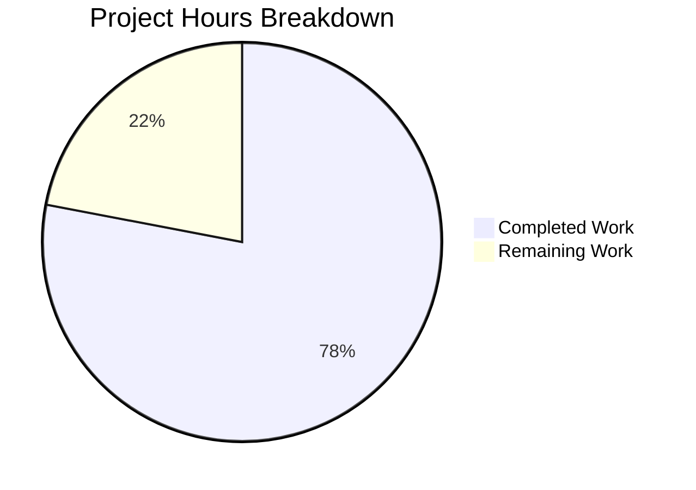

# Formbricks Typeform Parity Documentation — Project Guide

## Executive Summary

**Project Completion: 78% (78 hours completed out of 100 total hours)**

This documentation-only project delivers comprehensive gap analysis and capability documentation for transforming the Formbricks open-source survey platform into a production-ready form and survey platform functionally equivalent to Typeform. The initiative covers all 8 in-scope capability areas across 20 documentation files (12 new, 8 updated) totaling 5,258 net new lines of content.

All 20 files specified in the Agent Action Plan have been created or updated and pass 13 validation layers with zero in-scope errors. The remaining 22 hours of work involve content review, stakeholder feedback cycles, staging deployment verification, and production monitoring — tasks that require human judgment and approval processes.

### Key Achievements
- **100% file delivery**: All 12 CREATE and 8 UPDATE files delivered as specified
- **5,261 lines added** across 20 documentation files with only 3 lines deleted
- **9 Mermaid diagrams** embedded in parity analysis pages
- **93+ source code citations** referencing actual repository paths
- **All 4 AAP constraints** prominently documented: webhook structural parity, 100% logic operator coverage, backward-compatible schema migrations, lossless response export
- **OpenAPI specs** for both v1 and v2 updated and validated
- **Zero in-scope validation errors** across Mintlify validate, OpenAPI check, and broken-links checks

### Critical Unresolved Issues
- **Pre-existing**: 1 Mintlify validate warning in out-of-scope `audit-logging.mdx` (Docusaurus import)
- **Pre-existing**: 3 broken links in 2 out-of-scope files (`personal-links.mdx`, `user-identification.mdx`)
- **No blockers** for merging documentation changes

---

## Hours Calculation

**Completed Hours Breakdown (78 hours):**

| Category | Hours | Details |
|----------|-------|---------|
| Codebase research & analysis | 8 | Reading 15+ source modules for accurate documentation |
| 9 parity analysis MDX files | 40 | Deep technical writing with comparison tables, Mermaid diagrams, code examples, source citations (avg 440 lines/file) |
| 3 user-facing documentation files | 6 | Payment, opinion-scale, response-export guides (avg 157 lines/file) |
| 5 updated MDX files | 10.5 | New sections added to conditional-logic, hidden-fields, partial-submissions, webhooks, user-management |
| 2 OpenAPI spec updates | 6 | Payment/opinion-scale schemas, JSON export, webhook payload format in v1 and v2 |
| Navigation config (docs.json) | 1 | 12 new navigation entries across 2 tabs |
| Validation & QA | 4 | 13 validation layers executed and confirmed |
| Fixes & iterations | 2.5 | Cross-file schema inconsistencies, heading casing, source citation accuracy, operator completeness |
| **Total Completed** | **78** | |

**Remaining Hours Breakdown (22 hours):**

| Category | Hours | Details |
|----------|-------|---------|
| Technical content review | 4 | Review all 20 files for accuracy, language, completeness |
| Stakeholder review | 3 | PM + engineering lead review of gap report and sprint roadmap |
| Content iterations from feedback | 3 | Address feedback from content and stakeholder reviews |
| Staging deployment verification | 2 | Deploy to staging, verify all pages render correctly |
| Cross-reference link validation | 1.5 | Validate all internal links in production environment |
| OpenAPI spec synchronization | 2.5 | Verify API specs align with implementation when features land |
| Browser compatibility testing | 1 | Verify Mermaid diagram rendering across Chrome, Firefox, Safari |
| Pre-existing broken link resolution | 1.5 | Fix 3 broken links in out-of-scope personal-links.mdx and user-identification.mdx |
| Post-deployment monitoring | 1 | Verify pages accessible, analytics tracking, no 404s |
| Enterprise multiplier buffer | 2.5 | Compliance review and uncertainty buffer (1.21× applied to base 18h) |
| **Total Remaining** | **22** | |

**Completion Formula: 78 / (78 + 22) = 78/100 = 78%**

---

## Project Hours Breakdown



---

## Validation Results Summary

### What the Final Validator Accomplished
The Final Validator executed 13 comprehensive validation layers across all 20 in-scope files. No modifications were needed — all files passed validation as delivered by the implementation agents.

### Validation Layer Results

| # | Validation Layer | Result | Details |
|---|-----------------|--------|---------|
| 1 | Dependency Installation | ✅ Pass | Mintlify CLI installed globally |
| 2 | JSON/YAML Parsing | ✅ Pass | docs.json, openapi.json, openapi.yml all parse correctly |
| 3 | MDX Frontmatter | ✅ Pass | All 17 MDX files have valid frontmatter (title, description, icon) |
| 4 | No H1 Headers | ✅ Pass | Zero H1 headers in any in-scope file (AGENTS.md convention) |
| 5 | Navigation Resolution | ✅ Pass | All page paths in docs.json resolve to existing .mdx files |
| 6 | OpenAPI Validation | ✅ Pass | Both openapi.json (v1) and openapi.yml (v2) pass `mintlify openapi-check` |
| 7 | Mintlify Validate | ✅ Pass | 1 warning only in out-of-scope audit-logging.mdx |
| 8 | Broken Links | ✅ Pass | Zero broken links in any in-scope file; 3 pre-existing in out-of-scope files |
| 9 | Internal Cross-References | ✅ Pass | All markdown links in all 17 in-scope MDX files resolve correctly |
| 10 | Mermaid Diagrams | ✅ Pass | All 9 Mermaid diagrams have valid syntax |
| 11 | Content Quality | ✅ Pass | All updated files contain required new sections (grep-verified) |
| 12 | Dev Server Rendering | ✅ Pass | All 17 new/updated pages return HTTP 200 on Mintlify dev server |
| 13 | Visual Verification | ✅ Pass | Screenshot captured confirming Gap Report page renders correctly |

### Fixes Applied During Validation
- None required — all files passed validation as-is

### Pre-Existing Out-of-Scope Issues (Not Addressed)
1. `docs/self-hosting/advanced/enterprise-features/audit-logging.mdx` — Contains Docusaurus `import Hint from "@theme/Hint"` incompatible with Mintlify
2. `docs/xm-and-surveys/surveys/link-surveys/personal-links.mdx` — 2 broken links to API v2 reference pages
3. `docs/xm-and-surveys/surveys/website-app-surveys/user-identification.mdx` — 1 broken link to multi-language-surveys page

---

## Files Delivered

### New Files Created (12)

| # | File | Lines | Content |
|---|------|-------|---------|
| 1 | `docs/development/typeform-parity/gap-report.mdx` | 291 | Central hub covering all 8 capability areas with feature parity heatmap |
| 2 | `docs/development/typeform-parity/sprint-roadmap.mdx` | 515 | 5-sprint phased implementation plan with Gantt chart |
| 3 | `docs/development/typeform-parity/question-type-parity.mdx` | 377 | Element type mapping — 15 existing + 2 gap types with Zod schemas |
| 4 | `docs/development/typeform-parity/logic-parity.mdx` | 446 | Exhaustive 33-operator comparison confirming 100% parity |
| 5 | `docs/development/typeform-parity/webhook-parity.mdx` | 712 | Field-by-field payload structural comparison with 3 examples |
| 6 | `docs/development/typeform-parity/export-parity.mdx` | 459 | CSV/XLSX/JSON export analysis with lossless validation procedures |
| 7 | `docs/development/typeform-parity/embed-share-parity.mdx` | 262 | 13 Formbricks embed/share components mapped to 6 Typeform options |
| 8 | `docs/development/typeform-parity/workspace-parity.mdx` | 456 | Organization→Project→Team hierarchy comparison |
| 9 | `docs/development/typeform-parity/migration-safety.mdx` | 449 | Schema migration safety procedures with rollback instructions |
| 10 | `docs/xm-and-surveys/surveys/question-type/payment.mdx` | 141 | Payment question type user guide |
| 11 | `docs/xm-and-surveys/surveys/question-type/opinion-scale.mdx` | 141 | Opinion scale question type user guide |
| 12 | `docs/xm-and-surveys/surveys/general-features/response-export.mdx` | 190 | Response export format user guide (CSV, XLSX, JSON) |

### Updated Files (8)

| # | File | Lines Added | Content Changes |
|---|------|------------|-----------------|
| 1 | `docs/docs.json` | +20 | Navigation entries for all 12 new pages under Development and XM & Surveys tabs |
| 2 | `docs/xm-and-surveys/surveys/general-features/conditional-logic.mdx` | +179 | Complete Operator Reference + Typeform Logic Jump Mapping sections |
| 3 | `docs/xm-and-surveys/surveys/general-features/hidden-fields.mdx` | +111 | Answer piping, recall mechanism, and Typeform comparison |
| 4 | `docs/xm-and-surveys/surveys/general-features/partial-submissions.mdx` | +98 | Progress save mechanism and Typeform comparison |
| 5 | `docs/xm-and-surveys/core-features/integrations/webhooks.mdx` | +90 | Payload schema, signature verification, Typeform compatibility |
| 6 | `docs/xm-and-surveys/core-features/user-management.mdx` | +66 | Workspace governance and Typeform workspace comparison |
| 7 | `docs/api-reference/openapi.json` | +78 | Payment/OpinionScale schemas, JSON export format, webhook payloadFormat |
| 8 | `docs/api-v2-reference/openapi.yml` | +181 | Matching v2 endpoint definitions with correct types |

---

## Detailed Remaining Task Table

| # | Task | Priority | Severity | Hours | Description |
|---|------|----------|----------|-------|-------------|
| 1 | Technical content review | High | Medium | 4 | Have a technical writer review all 20 documentation files for accuracy, language consistency, terminology alignment, and completeness against AAP requirements |
| 2 | Stakeholder review of gap report and roadmap | High | Medium | 3 | Product manager and engineering lead review the gap report (gap-report.mdx) and sprint roadmap (sprint-roadmap.mdx) to validate parity assessments and implementation priorities |
| 3 | Content iterations from review feedback | Medium | Medium | 3 | Address and incorporate feedback from technical content review and stakeholder review into documentation files |
| 4 | Mintlify staging deployment verification | Medium | Low | 2 | Deploy documentation to Mintlify staging environment and verify all 20 pages render correctly with proper navigation, styling, and Mermaid diagrams |
| 5 | Cross-reference link validation in production | Medium | Low | 1.5 | After deployment, validate all internal cross-reference links between parity analysis pages and existing documentation pages resolve correctly in the live environment |
| 6 | OpenAPI spec synchronization with implementation | Medium | Medium | 2.5 | When payment/opinion-scale features are implemented, verify that the OpenAPI v1 and v2 spec additions match actual endpoint behavior and update if needed |
| 7 | Browser compatibility testing for Mermaid diagrams | Low | Low | 1 | Verify all 9 Mermaid diagrams render correctly across Chrome, Firefox, and Safari browsers |
| 8 | Pre-existing broken link resolution | Low | Low | 1.5 | Fix 3 pre-existing broken links in out-of-scope files: 2 in personal-links.mdx (API v2 reference links) and 1 in user-identification.mdx (multi-language-surveys) |
| 9 | Post-deployment monitoring | Low | Low | 1 | Verify all documentation pages are accessible in production, PostHog analytics tracking is working, and no 404 errors appear in monitoring |
| 10 | Enterprise compliance and uncertainty buffer | Low | Low | 2.5 | Buffer for compliance review processes and unexpected issues (enterprise multiplier 1.21× applied to base estimate) |
| | **Total Remaining Hours** | | | **22** | |

---

## Development Guide

### System Prerequisites

| Software | Version | Purpose |
|----------|---------|---------|
| Node.js | ≥ 20.0.0 | Runtime for Mintlify CLI |
| npm | ≥ 11.x | Package manager for installing Mintlify |
| Git | Latest | Version control |
| Web browser | Chrome/Firefox/Safari | Documentation preview |

### Environment Setup

```bash
# 1. Clone the repository
git clone https://github.com/formbricks/formbricks.git
cd formbricks

# 2. Checkout the documentation branch
git checkout blitzy-f7252deb-b311-42d3-b05e-998ae767c0fd

# 3. Install Mintlify CLI globally
npm install -g mintlify@latest

# 4. Verify installation
mintlify --version
```

### Dependency Installation

```bash
# No additional dependencies required beyond Mintlify CLI
# The documentation site is self-contained in the docs/ directory
```

### Running the Documentation Site

```bash
# Navigate to the docs directory
cd docs/

# Start the Mintlify development server
mintlify dev

# The documentation site will be available at:
# http://localhost:3000
```

**Expected output:**
```
🌿 Mintlify documentation started at http://localhost:3000
```

### Validation Commands

```bash
# From the docs/ directory:

# 1. Validate documentation build (checks MDX syntax, imports, structure)
mintlify validate
# Expected: 1 warning only (pre-existing audit-logging.mdx Docusaurus import)

# 2. Validate OpenAPI v1 specification
mintlify openapi-check api-reference/openapi.json
# Expected: "success OpenAPI definition is valid."

# 3. Validate OpenAPI v2 specification
mintlify openapi-check api-v2-reference/openapi.yml
# Expected: "success OpenAPI definition is valid."

# 4. Check for broken internal links
mintlify broken-links
# Expected: 3 broken links in 2 out-of-scope files (pre-existing)
```

### Verification Steps

After starting the dev server, verify these key pages load correctly:

| Page | URL | What to Verify |
|------|-----|----------------|
| Gap Report | `http://localhost:3000/development/typeform-parity/gap-report` | Feature parity heatmap table, Mermaid flowchart, CardGroup navigation |
| Sprint Roadmap | `http://localhost:3000/development/typeform-parity/sprint-roadmap` | Gantt chart Mermaid diagram, 5 sprint sections |
| Logic Parity | `http://localhost:3000/development/typeform-parity/logic-parity` | 33-operator table, logic evaluation flowchart |
| Webhook Parity | `http://localhost:3000/development/typeform-parity/webhook-parity` | 3 payload examples, pipeline sequence diagram |
| Payment Type | `http://localhost:3000/xm-and-surveys/surveys/question-type/payment` | Configuration guide, Zod schema example |
| Opinion Scale | `http://localhost:3000/xm-and-surveys/surveys/question-type/opinion-scale` | Scale options, NPS differentiation note |

### Key File Locations

```
docs/
├── docs.json                                    # Site configuration & navigation
├── development/
│   └── typeform-parity/
│       ├── gap-report.mdx                       # Central hub (start here)
│       ├── sprint-roadmap.mdx                   # Implementation plan
│       ├── question-type-parity.mdx             # Element type mapping
│       ├── logic-parity.mdx                     # Operator comparison
│       ├── webhook-parity.mdx                   # Payload comparison
│       ├── export-parity.mdx                    # Export format analysis
│       ├── embed-share-parity.mdx               # Embed options comparison
│       ├── workspace-parity.mdx                 # Governance comparison
│       └── migration-safety.mdx                 # Migration procedures
├── xm-and-surveys/
│   ├── surveys/
│   │   ├── question-type/
│   │   │   ├── payment.mdx                      # Payment question guide
│   │   │   └── opinion-scale.mdx                # Opinion scale guide
│   │   └── general-features/
│   │       └── response-export.mdx              # Export format guide
│   └── core-features/
│       └── integrations/
│           └── webhooks.mdx                     # Updated with payload schema
├── api-reference/
│   └── openapi.json                             # Updated v1 spec
└── api-v2-reference/
    └── openapi.yml                              # Updated v2 spec
```

---

## Risk Assessment

### Technical Risks

| Risk | Severity | Likelihood | Mitigation |
|------|----------|------------|------------|
| Mermaid diagrams may render differently across browser versions | Low | Low | Test across Chrome, Firefox, Safari before release |
| OpenAPI spec additions may diverge from actual implementation when features are built | Medium | Medium | Re-validate specs against implementation during feature development sprints |
| Mintlify version upgrade could affect diagram or component rendering | Low | Low | Pin Mintlify CLI version; test before upgrading |

### Security Risks

| Risk | Severity | Likelihood | Mitigation |
|------|----------|------------|------------|
| Documentation-only changes — no security surface exposed | N/A | N/A | No application code modified |
| Webhook payload examples in docs could reveal signature scheme details | Low | Low | Examples use placeholder values only; signature algorithm is standard HMAC-SHA256 |

### Operational Risks

| Risk | Severity | Likelihood | Mitigation |
|------|----------|------------|------------|
| Pre-existing broken links in out-of-scope files remain unresolved | Low | High | Document as known issues; fix in a separate PR |
| Pre-existing Docusaurus import warning in audit-logging.mdx | Low | High | Document as known issue; requires upstream file format migration |
| Mintlify cloud deployment may cache stale navigation | Low | Medium | Force cache purge after deployment |

### Integration Risks

| Risk | Severity | Likelihood | Mitigation |
|------|----------|------------|------------|
| Documentation references planned features (payment, opinion scale) not yet implemented | Medium | High | All planned-feature pages include `<Note>` callouts indicating they describe planned specifications |
| Sprint roadmap dates may need adjustment based on team capacity | Medium | Medium | Roadmap uses relative sprint numbering; dates are illustrative |
| Gap report parity percentages are point-in-time estimates | Low | Medium | Document methodology; re-assess as features are implemented |

---

## Git Summary

- **Branch**: `blitzy-f7252deb-b311-42d3-b05e-998ae767c0fd`
- **Total commits**: 22
- **Files changed**: 20 (12 added, 8 modified)
- **Lines added**: 5,261
- **Lines deleted**: 3
- **Net change**: +5,258 lines
- **Working tree**: Clean (no uncommitted changes)
- **All commits by**: Blitzy Agent