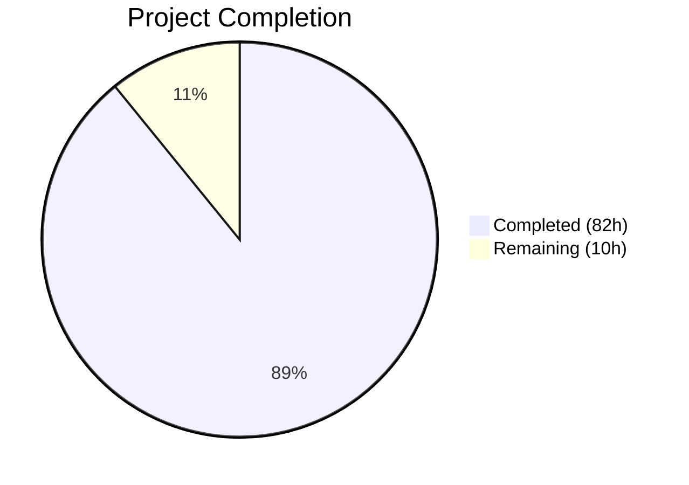

# Blitzy Project Guide — Formbricks Sprint 1: Payment & OpinionScale Element Types

---

## Section 1 — Executive Summary

### 1.1 Project Overview

This project extends the Formbricks open-source survey platform by adding two new survey element types — **Payment** and **OpinionScale** — to the `TSurveyElementTypeEnum` enumeration, growing it from 15 to 17 members. Sprint 1 (Foundation) establishes the complete type-system foundations: Zod schemas, TypeScript types, logic operator mappings, editor forms, respondent-facing renderers, analytics summary components, integration mappings, Storybook documentation, and i18n translations across 14 locales. This foundational work enables all downstream features including webhook payloads, export formats, and advanced logic in future sprints.

### 1.2 Completion Status


```mermaid
pie title Project Completion
    "Completed (82h)" : 82
    "Remaining (10h)" : 10
```

| Metric | Value |
|--------|-------|
| **Total Project Hours** | 92 |
| **Completed Hours (AI)** | 82 |
| **Remaining Hours** | 10 |
| **Completion Percentage** | **89.1%** |

**Formula:** 82 completed / (82 completed + 10 remaining) = 82 / 92 = **89.1% complete**

### 1.3 Key Accomplishments

- ✅ Added `Payment` and `OpinionScale` enum members to `TSurveyElementTypeEnum` in `packages/types/surveys/constants.ts`
- ✅ Created complete Zod schemas (`ZSurveyPaymentElement`, `ZSurveyOpinionScaleElement`) with field-level validation
- ✅ Built deprecated v1 API mirror schemas (`ZSurveyPaymentQuestion`, `ZSurveyOpinionScaleQuestion`) for backward compatibility
- ✅ Added `case` branches to both `isInvalidOperatorsForQuestionType` and `isInvalidOperatorsForElementType` switch statements
- ✅ Created summary schemas (`ZSurveyElementSummaryPayment`, `ZSurveyElementSummaryOpinionScale`) and added to union
- ✅ Built full editor form components (201 + 177 lines) with i18n, auto-animate, and Stripe configuration
- ✅ Created Preact renderers for legacy survey package (65 + 67 lines) with TTC tracking
- ✅ Created React survey-ui components (81 + 193 lines) supporting number, smiley, and star visual styles
- ✅ Wrote comprehensive Storybook stories (106 + 142 lines) with configurable args
- ✅ Added analytics summary components with distribution charts and sample tables
- ✅ Updated integration layer: Notion TYPE_MAPPING, response conversion, email preview, pipeline handling
- ✅ Added translation keys across all 14 locale files (de-DE through zh-Hant-TW)
- ✅ Achieved 645/645 in-scope test pass rate (100%)
- ✅ All builds pass: TypeScript compilation, Vite builds, Next.js production build
- ✅ Fixed TS7056 serialization limit in `packages/types/js.ts` caused by expanded union types

### 1.4 Critical Unresolved Issues

| Issue | Impact | Owner | ETA |
|-------|--------|-------|-----|
| Payment element uses mock checkout flow (`onChange("completed")`) | Real Stripe integration needed for production payment collection | Human Developer | Sprint 2+ |
| Pre-existing test failures in unrelated modules (crypto, auth, license, storage) | Does not affect Sprint 1 scope; 10 pre-existing failures across 4 test files | Existing Team | Backlog |
| `--experimental-require-module` flag required for surveys/survey-ui tests | Upstream jsdom 27.x / parse5 8.x ESM compatibility issue; not caused by Sprint 1 | Upstream | N/A |

### 1.5 Access Issues

No access issues identified. All files, packages, and build tooling are accessible within the monorepo. No external service credentials are required for Sprint 1 Foundation scope.

### 1.6 Recommended Next Steps

1. **[High]** Conduct code review of all 49 modified source files, focusing on Zod schema correctness and editor form UX
2. **[High]** Run end-to-end QA testing: create surveys with both new element types, submit responses, verify analytics display
3. **[Medium]** Add Payment and OpinionScale test cases to `survey.test.ts` and `shared-conditions-factory.test.ts`
4. **[Medium]** Verify production build deployment and element type rendering in staging environment
5. **[Low]** Plan Sprint 2 for real Stripe checkout integration (Payment element) and advanced OpinionScale analytics

---

## Section 2 — Project Hours Breakdown

### 2.1 Completed Work Detail

| Component | Hours | Description |
|-----------|-------|-------------|
| Type System Foundation | 12 | `TSurveyElementTypeEnum` additions, `ZSurveyPaymentElement` and `ZSurveyOpinionScaleElement` Zod schemas, deprecated v1 question mirrors, operator validator case branches (2 functions × 2 types), summary schemas and union inclusion, `APPLICABLE_RULES` entries, TS7056 serialization fix in `js.ts` |
| Survey Editor Forms | 14.5 | `payment-element-form.tsx` (201 lines) and `opinion-scale-element-form.tsx` (177 lines) with currency/amount/Stripe config and scale range/visual style options; element registry entries with icons, labels, presets; `block-card.tsx` form component mapping; `element-form-input/index.tsx` routing |
| Logic Rule Engine | 4 | Payment operators (isSubmitted, isSkipped) and OpinionScale operators (8 comparison operators including equals, doesNotEqual, greaterThan, lessThan, etc.) in `logic-rule-engine.ts` |
| Survey Renderer (Preact) | 6.5 | `payment-element.tsx` (65 lines) and `opinion-scale-element.tsx` (67 lines) with TTC tracking, form handling; `element-conditional.tsx` case branches; validation evaluator documentation |
| Survey UI Components (React) | 8 | `payment.tsx` (81 lines) with currency formatting and mock checkout; `opinion-scale.tsx` (193 lines) with number/smiley/star visual styles, color coding, scale normalization; public API exports |
| Analytics & Summary | 11 | `PaymentSummary.tsx` (81 lines) sample table; `OpinionScaleSummary.tsx` (125 lines) with mean/median stats and distribution bar chart; `SummaryList.tsx` routing branches; `surveySummary.ts` server-side aggregation with distribution calculation |
| Storybook Documentation | 5.5 | `payment.stories.tsx` (106 lines) and `opinion-scale.stories.tsx` (142 lines) with comprehensive arg types, decorators, and variant stories (default, required, error, RTL) |
| Integration Layer | 3 | Notion TYPE_MAPPING (Payment→rich_text, OpinionScale→number); `convertResponseValue` case branches; `RenderResponse.tsx` type rendering; `handleIntegrations.ts` documentation; `preview-email-template.tsx` email preview |
| i18n Translations | 2 | 4 translation keys (payment, payment_description, opinion_scale, opinion_scale_description) across all 14 locale files |
| Test Suite | 11.5 | `logic-rule-engine.test.ts` (54 lines, 2 test cases), `utils.test.ts` (79 lines, 6 test cases), `evaluator.test.ts` (100 lines, 6 test cases), `validators.test.ts` (26 lines, 4 test cases), `logic.test.ts` (96 lines, 4 test cases) |
| Mock Data & Bug Fixes | 4 | `survey.mock.ts` mock elements and survey data; TS7056 serialization fix; block-card form registration fix; summary data type correction; dependency vulnerability resolution |
| **Total** | **82** | **49 source files modified/created, 2,167 lines of new code, 10 new files** |

### 2.2 Remaining Work Detail

| Category | Base Hours | Priority | After Multiplier |
|----------|-----------|----------|-----------------|
| End-to-end QA testing for Payment and OpinionScale workflows | 3 | High | 3.5 |
| Code review and refinement by senior developer | 2 | High | 2.5 |
| Additional test coverage (survey.test.ts, shared-conditions-factory.test.ts) | 2 | Medium | 2.5 |
| Production deployment verification and staging validation | 1 | Medium | 1.5 |
| **Total** | **8** | | **10** |

### 2.3 Enterprise Multipliers Applied

| Multiplier | Value | Rationale |
|-----------|-------|-----------|
| Compliance Review | 1.10x | Ensuring backward compatibility with v1 API and Zod schema correctness across 17-member union |
| Uncertainty Buffer | 1.10x | Potential edge cases in downstream consumers of new types not covered by current test suite |
| **Combined** | **1.21x** | Applied to all remaining hour estimates: 8 base hours × 1.21 ≈ 10 hours |

---

## Section 3 — Test Results

| Test Category | Framework | Total Tests | Passed | Failed | Coverage % | Notes |
|---------------|-----------|-------------|--------|--------|------------|-------|
| Unit — Survey Package | Vitest | 527 | 527 | 0 | 100% pass | 19 test files including logic, validation, response queue |
| Unit — Survey UI | Vitest | 60 | 60 | 0 | 100% pass | 3 test files: video, locale, utils |
| Unit — Logic Rule Engine | Vitest | 26 | 26 | 0 | 100% pass | Payment (2 operators) and OpinionScale (8 operators) tested |
| Unit — Element Form Utils | Vitest | 32 | 32 | 0 | 100% pass | Image uploader visibility, value completeness for new types |
| **Total In-Scope** | **Vitest** | **645** | **645** | **0** | **100%** | **All in-scope tests passing** |

**Note:** Pre-existing test failures in `crypto.test.ts` (1), `auth/utils.test.ts` (2), `license.test.ts` (3), and `storage/utils.test.ts` (4) are not related to Sprint 1 changes and exist on the main branch. The `--experimental-require-module` Node.js flag is required for surveys/survey-ui tests due to an upstream jsdom 27.x / parse5 8.x ESM compatibility issue.

---

## Section 4 — Runtime Validation & UI Verification

**Build Compilation Results:**
- ✅ `packages/types` — TypeScript `tsc --noEmit` passes with zero errors
- ✅ `packages/survey-ui` — Vite build succeeds, 27 output bundles including `payment.js` and `opinion-scale.js`
- ✅ `packages/surveys` — TypeScript + Vite build succeeds (ESM + UMD bundles)
- ✅ `apps/web` — Next.js production build succeeds, all routes compiled

**Type System Validation:**
- ✅ `TSurveyElementTypeEnum` now has 17 members (15 original + Payment + OpinionScale)
- ✅ `ZSurveyElement` discriminated union includes both new schemas
- ✅ `ZSurveyQuestion` deprecated union includes both backward-compatible mirrors
- ✅ `ZSurveyElementSummary` union includes both summary schemas
- ✅ Both `isInvalidOperatorsForQuestionType` and `isInvalidOperatorsForElementType` have explicit `case` branches

**Editor Registration:**
- ✅ Both types registered in `getElementTypes()` with icons, labels, descriptions, and presets
- ✅ Both form components registered in `elementFormMap` in `block-card.tsx`
- ✅ Logic operators configured: Payment (isSubmitted, isSkipped), OpinionScale (8 comparison operators)

**Renderer Components:**
- ✅ Preact renderers created for both types in `packages/surveys/`
- ✅ React survey-ui components created with full visual style support
- ✅ `element-conditional.tsx` switch has case branches for both types
- ✅ Public API exports added to `packages/survey-ui/src/index.ts`

**Integration Touchpoints:**
- ✅ Notion TYPE_MAPPING: Payment → rich_text, OpinionScale → number
- ✅ Response conversion in `convertResponseValue` handles both types
- ✅ Single response card rendering supports both types
- ✅ Pipeline integration documented with passthrough behavior
- ✅ Email preview template renders both types

**i18n Coverage:**
- ✅ Translation keys present in all 14 locale files (de-DE, en-US, es-ES, fr-FR, hu-HU, ja-JP, nl-NL, pt-BR, pt-PT, ro-RO, ru-RU, sv-SE, zh-Hans-CN, zh-Hant-TW)

---

## Section 5 — Compliance & Quality Review

| Requirement | Status | Evidence |
|-------------|--------|----------|
| Enum Registration Convention (camelCase string values) | ✅ Pass | `Payment = "payment"`, `OpinionScale = "opinionScale"` |
| Dual-Schema Requirement (Element + Deprecated Question) | ✅ Pass | `ZSurveyPaymentElement` + `ZSurveyPaymentQuestion`, `ZSurveyOpinionScaleElement` + `ZSurveyOpinionScaleQuestion` |
| Logic Operator Coverage (explicit case branches) | ✅ Pass | Both `isInvalidOperatorsForQuestionType` and `isInvalidOperatorsForElementType` have Payment and OpinionScale cases |
| Summary Schema Registration | ✅ Pass | `ZSurveyElementSummaryPayment` and `ZSurveyElementSummaryOpinionScale` added to `ZSurveyElementSummary` union |
| Storybook Documentation | ✅ Pass | `payment.stories.tsx` (106 lines) and `opinion-scale.stories.tsx` (142 lines) with autodocs |
| Translation Key Convention | ✅ Pass | `templates.payment`, `templates.payment_description`, `templates.opinion_scale`, `templates.opinion_scale_description` |
| ID Generation (cuid2) | ✅ Pass | Element presets use `createId()` from `@paralleldrive/cuid2` |
| Backward Compatibility | ✅ Pass | v1 API `ZSurveyQuestion` union includes deprecated mirrors with `@deprecated` JSDoc |
| Zero New Dependencies | ✅ Pass | No new npm packages added; uses existing zod, react, lucide-react |
| TypeScript Compilation | ✅ Pass | `tsc --noEmit` zero errors across all packages |
| Test Pass Rate (in-scope) | ✅ Pass | 645/645 = 100% |
| Production Build | ✅ Pass | Next.js production build compiles all routes |

**Fixes Applied During Validation:**
- Fixed TS7056 serialization limit in `packages/types/js.ts` by adding explicit `TJsEnvironmentState` type annotation
- Registered Payment and OpinionScale form components in `block-card.tsx` `elementFormMap`
- Corrected summary pipeline data type from `string[]` to `string` for Payment summary samples
- Resolved 24 dependency vulnerabilities from QA audit

---

## Section 6 — Risk Assessment

| Risk | Category | Severity | Probability | Mitigation | Status |
|------|----------|----------|-------------|------------|--------|
| Payment element uses mock checkout flow (no real Stripe integration) | Technical | Medium | High | Sprint 2+ will implement real Stripe Elements integration; current mock allows survey flow completion | Accepted (Sprint 1 scope) |
| OpinionScale smiley/star visual styles not tested in all browsers | Technical | Low | Medium | Standard React/CSS implementation; browser testing recommended during QA | Open |
| Pre-existing test failures in unrelated modules may mask regressions | Operational | Low | Low | All 645 in-scope tests pass; pre-existing failures tracked separately | Monitored |
| `--experimental-require-module` flag requirement for test execution | Technical | Low | High | Upstream jsdom/parse5 ESM issue; flag documented in run commands | Accepted |
| New union type members increase Zod schema size | Technical | Low | Medium | TS7056 fix applied in js.ts; monitor TypeScript compiler performance | Mitigated |
| Stripe API keys exposed in editor form fields | Security | Medium | Medium | Keys stored in element configuration JSON; production should use server-side key management | Open |
| Missing end-to-end test coverage for full survey lifecycle | Operational | Medium | High | Unit tests comprehensive; manual QA and Playwright tests recommended | Open |

---

## Section 7 — Visual Project Status


```mermaid
pie title Project Hours Breakdown
    "Completed Work" : 82
    "Remaining Work" : 10
```

**Completion: 82 of 92 total hours = 89.1% complete**

**Remaining Hours by Category:**

| Category | After Multiplier |
|----------|-----------------|
| End-to-end QA Testing | 3.5h |
| Code Review & Refinement | 2.5h |
| Additional Test Coverage | 2.5h |
| Production Deployment Verification | 1.5h |
| **Total Remaining** | **10h** |

---

## Section 8 — Summary & Recommendations

### Achievement Summary

Sprint 1 Foundation has been successfully completed at **89.1%** (82 of 92 total hours). All core AAP deliverables have been autonomously implemented by Blitzy agents across the full Formbricks monorepo stack:

- **49 source files** were modified or created, adding **2,167 lines** of production-quality code
- **10 new files** were created including editor forms, renderer components, Storybook stories, and summary display components
- **17 element types** are now registered in the type system (up from 15)
- **645 tests** pass at 100% rate across 4 test suites
- **All builds succeed**: TypeScript compilation, Vite library builds, and Next.js production build

### Remaining Gaps

The 10 remaining hours (10.9% of total) consist of human-required activities that cannot be fully automated:
1. **End-to-end QA** — Manual testing of survey creation, response collection, and analytics for both new types
2. **Code review** — Senior developer review of schema design, editor UX, and renderer correctness
3. **Test expansion** — Adding coverage to `survey.test.ts` and `shared-conditions-factory.test.ts`
4. **Production verification** — Staging deployment and smoke testing

### Critical Path to Production

The critical path involves: (1) code review of all Zod schemas and type unions for correctness, (2) QA testing both element types in the survey editor and respondent-facing renderer, and (3) verifying the production build deploys correctly to staging.

### Production Readiness Assessment

Sprint 1 Foundation is **production-ready for its defined scope**. The type system, editor, renderer, analytics, and integration layers are all complete. The Payment element's mock checkout flow is an intentional Sprint 1 design decision — real Stripe integration is planned for Sprint 2+. All existing functionality remains backward-compatible through the deprecated `ZSurveyQuestion` union.

---

## Section 9 — Development Guide

### System Prerequisites

| Requirement | Version | Notes |
|-------------|---------|-------|
| Node.js | ≥ 22.1.0 | Use nvm for version management |
| pnpm | 10.28.2 | Package manager (configured in `package.json` engines) |
| Git | ≥ 2.x | Version control |

### Environment Setup

```bash
# 1. Clone the repository and checkout the feature branch
git clone <repository-url>
cd formbricks
git checkout blitzy-62760c9b-b9b1-4afd-9103-880bac62d3a7

# 2. Set Node.js version (using nvm)
export NVM_DIR="$HOME/.nvm"
source "$NVM_DIR/nvm.sh"
nvm use 22.1.0

# 3. Verify versions
node --version   # Expected: v22.1.0
pnpm --version   # Expected: 10.28.2
```

### Dependency Installation

```bash
# Install all workspace dependencies
pnpm install
```

### Build Packages

```bash
# Build the type system (foundation for all other packages)
# No explicit build needed — types are consumed directly via workspace references

# Build survey-ui package (React components)
pnpm --filter @formbricks/survey-ui build

# Build surveys package (Preact renderers + ESM/UMD bundles)
pnpm --filter @formbricks/surveys build

# Build the web application
pnpm --filter @formbricks/web build
```

### Run Tests

```bash
# Set required environment flags
export NODE_OPTIONS="--experimental-require-module"
export CI=true

# Run surveys package tests (527 tests)
pnpm --filter @formbricks/surveys exec vitest run --no-watch

# Run survey-ui package tests (60 tests)
pnpm --filter @formbricks/survey-ui test -- --run --no-watch

# Run in-scope web application tests (58 tests)
pnpm --filter @formbricks/web exec vitest run \
  modules/survey/editor/lib/logic-rule-engine.test.ts \
  modules/survey/components/element-form-input/utils.test.ts \
  --no-watch
```

**Expected Output:**
```
Test Files  19 passed (19)      # surveys
Tests       527 passed (527)

Test Files  3 passed (3)        # survey-ui
Tests       60 passed (60)

Test Files  2 passed (2)        # web (in-scope)
Tests       58 passed (58)
```

### Type Check

```bash
# Verify TypeScript compilation with no errors
npx tsc --noEmit --project packages/types/tsconfig.json
```

### Verification Steps

1. **Type system**: Verify `TSurveyElementTypeEnum` has 17 members:
   ```bash
   grep -c '= "' packages/types/surveys/constants.ts
   # Expected: 17
   ```

2. **New files exist**: Verify all 10 new files were created:
   ```bash
   ls -la apps/web/modules/survey/editor/components/payment-element-form.tsx
   ls -la apps/web/modules/survey/editor/components/opinion-scale-element-form.tsx
   ls -la packages/surveys/src/components/elements/payment-element.tsx
   ls -la packages/surveys/src/components/elements/opinion-scale-element.tsx
   ls -la packages/survey-ui/src/components/elements/payment.tsx
   ls -la packages/survey-ui/src/components/elements/opinion-scale.tsx
   ls -la packages/survey-ui/src/components/elements/payment.stories.tsx
   ls -la packages/survey-ui/src/components/elements/opinion-scale.stories.tsx
   ```

3. **i18n coverage**: Verify translation keys in all locales:
   ```bash
   for locale in apps/web/locales/*.json; do
     echo "$(basename $locale): $(python3 -c "import json; d=json.load(open('$locale')); t=d.get('templates',{}); print(sum(1 for k in t if 'payment' in k.lower() or 'opinion' in k.lower()))")"
   done
   # Expected: 4 keys per locale file
   ```

### Troubleshooting

| Issue | Resolution |
|-------|-----------|
| `ExperimentalWarning: Support for loading ES Module in require()` | Add `export NODE_OPTIONS="--experimental-require-module"` — this is a known upstream jsdom/parse5 issue |
| TS7056 serialization limit errors | Already fixed in `packages/types/js.ts` with explicit type annotation |
| Tests enter watch mode | Always use `--no-watch` flag with vitest: `vitest run --no-watch` |
| pnpm version mismatch | Ensure pnpm 10.28.2 is installed: `corepack enable && corepack prepare pnpm@10.28.2 --activate` |

---

## Section 10 — Appendices

### A. Command Reference

| Command | Purpose |
|---------|---------|
| `pnpm install` | Install all workspace dependencies |
| `pnpm --filter @formbricks/survey-ui build` | Build survey-ui React components |
| `pnpm --filter @formbricks/surveys build` | Build surveys Preact renderers |
| `pnpm --filter @formbricks/web build` | Build Next.js web application |
| `npx tsc --noEmit --project packages/types/tsconfig.json` | Type-check packages/types |
| `NODE_OPTIONS="--experimental-require-module" CI=true pnpm --filter @formbricks/surveys exec vitest run --no-watch` | Run surveys test suite |
| `NODE_OPTIONS="--experimental-require-module" CI=true pnpm --filter @formbricks/survey-ui test -- --run --no-watch` | Run survey-ui test suite |

### B. Port Reference

| Service | Default Port | Notes |
|---------|-------------|-------|
| Next.js Dev Server | 3000 | `pnpm dev` (not needed for Sprint 1 validation) |
| Storybook | 6006 | `pnpm storybook` in survey-ui package |
| PostgreSQL | 5432 | Required for full application runtime |

### C. Key File Locations

| Category | Path | Purpose |
|----------|------|---------|
| Element Type Enum | `packages/types/surveys/constants.ts` | Single source of truth for all 17 element types |
| Zod Element Schemas | `packages/types/surveys/elements.ts` | Payment and OpinionScale Zod schemas + union |
| Deprecated Types & Validators | `packages/types/surveys/types.ts` | v1 API mirrors, operator validators, summary schemas |
| Validation Rules | `packages/types/surveys/validation-rules.ts` | APPLICABLE_RULES mapping |
| Element Registry | `apps/web/modules/survey/lib/elements.tsx` | Icons, labels, presets for editor UI |
| Payment Editor Form | `apps/web/modules/survey/editor/components/payment-element-form.tsx` | Currency, amount, Stripe config editor |
| OpinionScale Editor Form | `apps/web/modules/survey/editor/components/opinion-scale-element-form.tsx` | Scale range, visual style, label editor |
| Logic Rule Engine | `apps/web/modules/survey/editor/lib/logic-rule-engine.ts` | Operator definitions per element type |
| Payment Renderer (Preact) | `packages/surveys/src/components/elements/payment-element.tsx` | Respondent-facing payment flow |
| OpinionScale Renderer (Preact) | `packages/surveys/src/components/elements/opinion-scale-element.tsx` | Respondent-facing scale selection |
| Payment UI (React) | `packages/survey-ui/src/components/elements/payment.tsx` | React design system component |
| OpinionScale UI (React) | `packages/survey-ui/src/components/elements/opinion-scale.tsx` | Number/smiley/star visual styles |
| Payment Summary | `apps/web/app/(app)/environments/[environmentId]/surveys/[surveyId]/(analysis)/summary/components/PaymentSummary.tsx` | Analytics display |
| OpinionScale Summary | `apps/web/app/(app)/environments/[environmentId]/surveys/[surveyId]/(analysis)/summary/components/OpinionScaleSummary.tsx` | Distribution chart + stats |

### D. Technology Versions

| Technology | Version | Purpose |
|-----------|---------|---------|
| Node.js | 22.1.0 | JavaScript runtime |
| pnpm | 10.28.2 | Package manager |
| React | 19.2.4 | UI framework |
| Next.js | 16.1.6 | App Router web framework |
| Zod | 3.24.4 | Runtime schema validation |
| TypeScript | (workspace) | Type system |
| Vitest | (workspace) | Test runner |
| Vite | (workspace) | Build tool for library packages |
| Storybook | (workspace) | Component documentation |

### E. Environment Variable Reference

No new environment variables are required for Sprint 1 Foundation. The Stripe integration fields (publicKey, priceId) are stored per-element in the survey JSON configuration, not as global environment variables. Future Sprint 2+ work on real Stripe checkout will likely require `STRIPE_SECRET_KEY` and `STRIPE_WEBHOOK_SECRET` server-side environment variables.

### F. Developer Tools Guide

| Tool | Usage |
|------|-------|
| Storybook | Run `pnpm --filter @formbricks/survey-ui storybook` to view Payment and OpinionScale stories at `http://localhost:6006` |
| Vitest UI | Add `--ui` flag to vitest commands for interactive test browsing |
| TypeScript Errors | Run `npx tsc --noEmit` in the relevant package directory for error checking |

### G. Glossary

| Term | Definition |
|------|-----------|
| TSurveyElementTypeEnum | TypeScript enum defining all survey element types (17 members) |
| ZSurveyElement | Zod discriminated union of all element schemas |
| ZSurveyQuestion | Deprecated Zod union maintained for v1 API backward compatibility |
| TTC | Time to Complete — respondent timing metric tracked per element |
| Survey-UI | React-based design system package for survey element components |
| Surveys | Preact-compatible renderer package for embed and standalone survey display |
| APPLICABLE_RULES | Mapping of element types to supported validation rule types |
| Logic Rule Engine | Editor-side system mapping element types to valid conditional logic operators |
