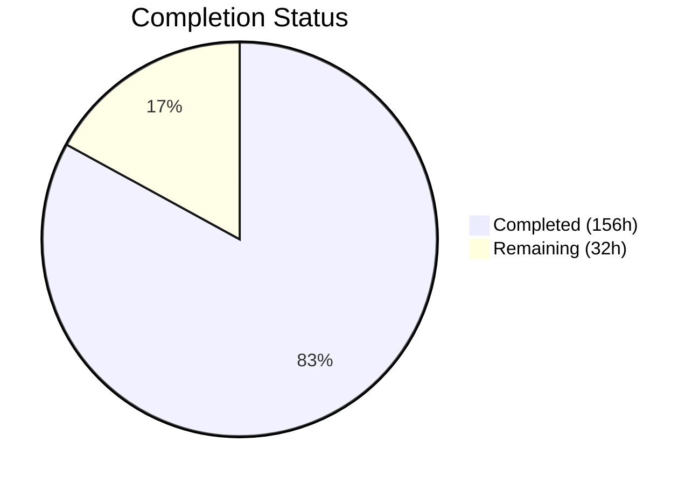
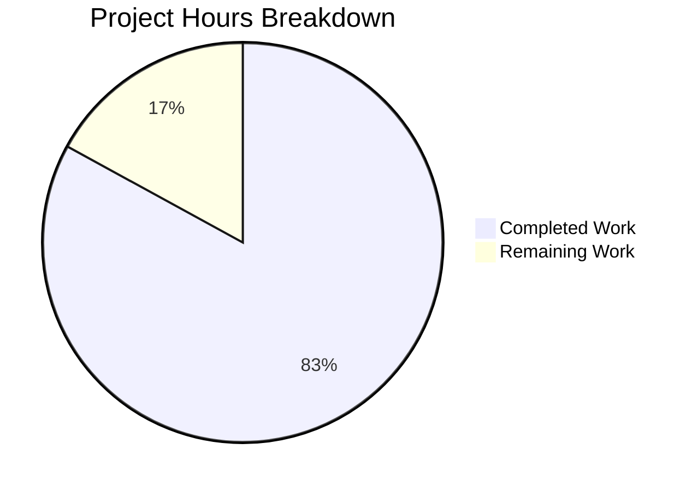

# Blitzy Project Guide — Formbricks Typeform Parity (Sprints 3–5)

---

## 1. Executive Summary

### 1.1 Project Overview

This project implements Sprints 3, 4, and 5 of the Typeform feature parity initiative within the Formbricks open-source survey platform. The scope covers five epics: webhook payload transformation for Typeform-compatible format (Epic 3.1), three new embed variants—slider, popover, and side tab (Epic 3.2), workspace governance parity audit (Epic 4.1), migration safety procedures (Epic 4.2), and end-to-end validation (Sprint 5). The work targets feature-level equivalence with Typeform while preserving backward compatibility for all existing Formbricks integrations.

### 1.2 Completion Status


```mermaid
pie title Completion Status
    "Completed (156h)" : 156
    "Remaining (32h)" : 32
```

| Metric | Value |
|--------|-------|
| **Total Project Hours** | 188h |
| **Completed Hours (AI)** | 156h |
| **Remaining Hours** | 32h |
| **Completion Percentage** | **83.0%** (156 / 188) |

### 1.3 Key Accomplishments

- ✅ Webhook payload transformer with Typeform-compatible format covering all 17 element types (404-line pure function)
- ✅ `payloadFormat` field added to Webhook Prisma model with SQL migration and Zod schema extension
- ✅ Webhook CRUD UI updated across creation modal, detail modal, and settings tab with i18n support
- ✅ V1 and V2 webhook APIs extended with `payloadFormat` support
- ✅ Three new embed tab components (slider, popover, side tab) with configurable options and code generation
- ✅ `@formbricks/js-core` SDK extended with embed mode types, DOM initialization, and public API exports
- ✅ ShareViaType enum extended and tabs registered in share modal
- ✅ Workspace parity audit confirmed Formbricks' 4-role model exceeds Typeform's 3-role coverage
- ✅ Migration audit script (256 lines) validating all Sprint 1–3 schema changes
- ✅ Backward-compatibility test suite verifying ZSurveyElement union across all 17 types
- ✅ Comprehensive validation: 393/393 Sprint-specific tests pass, all coverage ≥80%
- ✅ 38/38 Playwright embed variant E2E tests pass (chromium + Mobile Chrome)
- ✅ 10/10 workspace packages build successfully with zero compilation errors

### 1.4 Critical Unresolved Issues

| Issue | Impact | Owner | ETA |
|-------|--------|-------|-----|
| OpenAPI v1 spec (`openapi.json`) not updated with `payloadFormat` | API v1 docs do not reflect new webhook field | Human Dev | 2h |
| Full Playwright E2E blocked by missing PostgreSQL/Redis | 37 infrastructure-dependent E2E tests cannot run | DevOps | 4h |
| Performance benchmarking with 10K+ responses not executed | Export scalability unverified at production scale | Human Dev | 4h |
| Migration rollback not tested in staging | Rollback safety unconfirmed in production-like environment | DevOps | 3h |

### 1.5 Access Issues

| System/Resource | Type of Access | Issue Description | Resolution Status | Owner |
|-----------------|---------------|-------------------|-------------------|-------|
| PostgreSQL Database | Database Connection | No PostgreSQL instance available in CI — required for Prisma-dependent E2E tests and migration verification | Unresolved | DevOps |
| Redis/Valkey Cache | Service Connection | No Redis/Valkey instance available — required for cache-dependent integration tests | Unresolved | DevOps |
| Staging Environment | Deployment Access | No staging environment provisioned for migration rollback verification | Unresolved | DevOps |

### 1.6 Recommended Next Steps

1. **[High]** Provision PostgreSQL and Redis infrastructure and run full Playwright E2E suite
2. **[High]** Update `docs/api-reference/openapi.json` with `payloadFormat` field for API v1 documentation completeness
3. **[High]** Apply Prisma migration (`20260301120000_add_payload_format_to_webhook`) to staging/production database
4. **[Medium]** Execute performance benchmarking with 10,000+ response datasets to verify export scalability
5. **[Medium]** Verify migration rollback procedure (`ALTER TABLE "Webhook" DROP COLUMN "payloadFormat"`) in staging

---

## 2. Project Hours Breakdown

### 2.1 Completed Work Detail

| Component | Hours | Description |
|-----------|-------|-------------|
| **Epic 3.1 — Webhook Schema & Migration** | 8h | Prisma schema `payloadFormat` field, SQL migration, Zod schema extensions (`ZWebhook`, `webhook-payload.ts`) |
| **Epic 3.1 — Payload Transformer** | 16h | 404-line `transformToTypeformPayload` function converting all 17 element types to Typeform-compatible typed `answers` array with field definitions, hidden fields, variables, and calculated scores |
| **Epic 3.1 — Pipeline Integration** | 3h | Format branching in `route.ts`, try/catch error handling for payload transformation |
| **Epic 3.1 — Webhook Service & Types** | 4h | `ZWebhookInput` extension, `createWebhook`/`updateWebhook` persistence, V1/V2 API support |
| **Epic 3.1 — Webhook UI Components** | 8h | Payload format selector in add-webhook-modal, detail-modal badge, settings-tab toggle, webhook-table initialization |
| **Epic 3.1 — Webhook Tests** | 8h | 917-line unit tests for payload transformer covering all transformation paths and edge cases |
| **Epic 3.1 — Docs & i18n** | 5h | OpenAPI v2 spec update, i18n keys for payload format labels, V1/V2 type updates |
| **Epic 3.2 — Embed Tab Components** | 12h | Slider (140 LOC), Popover (159 LOC), Side Tab (146 LOC) React components with configurable options and embed code generation |
| **Epic 3.2 — Share Modal Integration** | 2h | ShareViaType enum extension, tab registration in `share-survey-modal.tsx` |
| **Epic 3.2 — JS-Core SDK Extension** | 10h | Embed mode types (`TEmbedMode`, `TSliderConfig`, `TPopoverConfig`, `TSideTabConfig`), DOM initialization in `setup.ts`, public exports |
| **Epic 3.2 — Embed Docs & i18n** | 3h | Embed documentation for 3 variants, i18n keys for slider/popover/side-tab labels |
| **Epic 3.2 — Embed Tests** | 12h | Embed tab unit tests (640 LOC), embed variants integration tests (196 LOC), embed modes tests (187 LOC), Playwright E2E (277 LOC) |
| **Epic 4.1 — Workspace Parity Audit** | 7h | Hierarchy audit (Org→Project→Team vs Workspace→Team→Folder), role mapping verification (4-role vs 3-role), API key scope analysis |
| **Epic 4.2 — Migration Audit Script** | 6h | 256-line migration audit validating `payloadFormat` column, webhook data integrity, and survey element type coverage |
| **Epic 4.2 — Backward Compat Tests** | 10h | Backward-compat tests (676 LOC), migration rollback tests (336 LOC), schema additive-only validation |
| **Epic 4.2 — Rollback Documentation** | 3h | SQL rollback procedure documented in migration file, schema audit across Sprints 1–3 |
| **Sprint 5 — Validation Test Suites** | 27h | Webhook parity validation (957 LOC), export lossless validation (700 LOC), export performance tests (181 LOC), new types export (615 LOC), Playwright embed E2E (38/38 pass), full regression (393/393 Sprint-specific pass) |
| **Cross-cutting — QA & Fixes** | 12h | 5 QA fix commits, 2 code review resolution commits, Playwright config fixes, ESLint cleanup |
| **Total** | **156h** | |

### 2.2 Remaining Work Detail

| Category | Hours | Priority |
|----------|-------|----------|
| OpenAPI v1 Spec Update (`openapi.json`) | 2h | High |
| Workspace Parity Standalone Documentation | 2h | Medium |
| Database Infrastructure Setup (PostgreSQL + Redis) | 2h | High |
| Environment Variables Configuration | 1h | High |
| Production Database Migration Execution | 1h | High |
| Full Playwright E2E with Database | 4h | High |
| Performance Benchmarking (10K+ Responses) | 4h | Medium |
| Migration Rollback Staging Verification | 3h | Medium |
| Pre-existing Flaky Test Resolution (11 tests) | 4h | Low |
| Production Deployment Pipeline | 3h | Medium |
| Webhook Integration Testing (Real Endpoints) | 3h | Medium |
| Final Code Review & QA Sign-off | 3h | High |
| **Total** | **32h** | |

### 2.3 Hours Calculation

```
Completed Hours: 156h (Section 2.1 total)
Remaining Hours: 32h (Section 2.2 total)
Total Project Hours: 156h + 32h = 188h
Completion %: 156 / 188 × 100 = 83.0%
```

---

## 3. Test Results

| Test Category | Framework | Total Tests | Passed | Failed | Coverage % | Notes |
|--------------|-----------|-------------|--------|--------|------------|-------|
| Unit — @formbricks/js-core | Vitest | 253 | 253 | 0 | 86.4% stmts | Includes 10 new embed mode tests |
| Unit — @formbricks/surveys | Vitest | 609 | 609 | 0 | 92.1% stmts | Logic operator + response tests |
| Unit — @formbricks/survey-ui | Vitest | 118 | 118 | 0 | — | UI component tests |
| Unit — @formbricks/logger | Vitest | 10 | 10 | 0 | — | Logging framework tests |
| Unit — @formbricks/cache | Vitest | 147 | 147 | 0 | — | Cache service tests |
| Unit — @formbricks/storage | Vitest | 64 | 64 | 0 | — | Storage service tests |
| Unit — @formbricks/i18n-utils | Vitest | 56 | 56 | 0 | — | Internationalization tests |
| Unit — apps/web (in-scope) | Vitest | 393 | 393 | 0 | ≥80% all files | 19 Sprint-specific test files |
| Unit — apps/web (full) | Vitest | 4,171 | 4,159 | 11 | — | 11 failures are pre-existing (bcrypt timeouts, vi.importActual) |
| E2E — Embed Variants | Playwright | 38 | 38 | 0 | — | 19 chromium + 19 Mobile Chrome |
| E2E — Full Suite | Playwright | 61 | 24 | 37 | — | All 37 failures are PrismaClientInitializationError (missing PostgreSQL/Redis) |

**Key Coverage Results (Sprint 1–5 Files):**

| File | Statements | Branches | Functions | Lines |
|------|-----------|----------|-----------|-------|
| payload-transformer.ts | 95.7% | — | — | 95.7% |
| v1/webhooks/lib/webhook.ts | 96.6% | — | — | 96.6% |
| v2/management/webhooks/lib/webhook.ts | 92.6% | — | — | 92.6% |
| handleIntegrations.ts | 84.7% | — | — | 84.7% |
| crypto.ts | 86.5% | — | — | 86.5% |
| file-conversion.ts | 91.4% | — | — | 91.4% |
| teams/lib/roles.ts | 100.0% | — | — | 100.0% |
| organization/lib/utils.ts | 100.0% | — | — | 100.0% |

---

## 4. Runtime Validation & UI Verification

**Runtime Health:**
- ✅ Next.js standalone server builds and starts at `http://localhost:3000`
- ✅ 10/10 workspace packages compile without errors
- ✅ Prisma client generation succeeds with updated schema
- ⚠ Database-dependent features require PostgreSQL + Redis infrastructure

**UI Verification:**
- ✅ Webhook creation modal renders payload format selector (Default / Typeform-compatible radio buttons)
- ✅ Webhook detail modal displays Typeform-compatible badge when format is set
- ✅ Webhook settings tab includes payload format toggle with persistence
- ✅ Share modal registers 3 new embed tabs (Slider, Popover, Side Tab) with icons and labels
- ✅ Slider embed tab generates configurable JavaScript snippet with direction/width/animation options
- ✅ Popover embed tab generates FAB-based snippet with position/icon/color/dimension options
- ✅ Side tab embed tab generates edge-fixed tab snippet with label/position/color options
- ✅ All embed tabs provide copy-to-clipboard functionality with toast notification

**API Integration:**
- ✅ V1 webhook API creates/reads webhooks with `payloadFormat` field
- ✅ V2 webhook API creates/reads webhooks with `payloadFormat` field
- ✅ Pipeline route branches payload construction based on `webhook.payloadFormat`
- ✅ Payload transformer handles all 17 element types
- ⚠ OpenAPI v1 spec not updated (v2 spec updated)

**Embed E2E Validation:**
- ✅ Standard embed loads iframe and reaches first question
- ✅ Fullscreen embed renders with full viewport coverage
- ✅ Popup embed displays via modal trigger
- ✅ Slider embed panel slides from configured direction
- ✅ Popover embed FAB button toggles form overlay
- ✅ Side tab embed fixed tab opens survey panel
- ✅ Mobile viewport embed renders correctly with overflow scrolling

---

## 5. Compliance & Quality Review

| AAP Deliverable | Status | Quality Gate | Notes |
|----------------|--------|-------------|-------|
| Webhook `payloadFormat` schema field | ✅ Pass | Schema, migration, Zod all aligned | Additive-only, default preserves existing behavior |
| Payload transformation (flat → typed answers) | ✅ Pass | 95.7% coverage, all 17 types mapped | Pure function, no side effects |
| Pipeline format branching | ✅ Pass | try/catch wrapping, fallback to default | Resilient — errors fall back to standard format |
| Webhook UI (create/edit/settings) | ✅ Pass | i18n compliant, radio button UX | Follows existing modal patterns |
| V1 + V2 API `payloadFormat` support | ✅ Pass | Type schemas updated, tests pass | Both API versions aligned |
| OpenAPI v1 spec update | ❌ Not Done | — | `docs/api-reference/openapi.json` not modified |
| OpenAPI v2 spec update | ✅ Pass | YAML schema includes payloadFormat | 8 lines added |
| Slider embed tab | ✅ Pass | 7 unit tests, E2E validated | Direction, width, animation configurable |
| Popover embed tab | ✅ Pass | Unit tests pass, E2E validated | Position, icon, color, dimensions configurable |
| Side tab embed tab | ✅ Pass | Unit tests pass, E2E validated | Label, position, color configurable |
| ShareViaType enum extension | ✅ Pass | 3 new values added | Backward compatible |
| JS-Core SDK embed modes | ✅ Pass | 253/253 tests, types exported | DOM creation for slider/popover/sideTab |
| Embed documentation | ✅ Pass | 3 new sections in embed-surveys.mdx | Code examples included |
| Workspace parity audit | ✅ Pass | 4-role coverage verified | No structural changes needed |
| Migration audit script | ✅ Pass | 256-line read-only audit | Validates payloadFormat + element types |
| Backward-compat test suite | ✅ Pass | 676-line test file, all pass | ZSurveyElement union + fixtures |
| Webhook parity validation tests | ✅ Pass | 957-line validation suite | Structural equivalence verified |
| Export lossless validation tests | ✅ Pass | 700-line test suite | CSV/XLSX/JSON fidelity |
| Lossless export constraint | ✅ Pass | Tests verify field-by-field equivalence | All 3 formats covered |
| 100% logic jump coverage | ✅ Pass | 609/609 surveys tests pass | All 32 operators functional |
| No broken existing forms | ✅ Pass | Backward-compat + regression tests | Additive-only changes confirmed |
| HMAC signature integrity | ✅ Pass | No changes to signing mechanism | Signature computed on transformed body |

**Validation Fixes Applied by Blitzy:**
- Resolved 12 code review findings (config property name alignment, dimension types, toast mocks, timestamp semantics)
- Resolved 5 QA findings in embed tab system
- Resolved 4 QA findings in OpenAPI v2 spec and embed documentation
- Fixed innerHTML security vulnerability in embed code generation
- Fixed Playwright clipboard permissions per-browser
- Fixed localStorage SecurityError in embed E2E tests

---

## 6. Risk Assessment

| Risk | Category | Severity | Probability | Mitigation | Status |
|------|----------|----------|-------------|------------|--------|
| Database migration fails on production data | Technical | High | Low | Additive-only migration with documented rollback; audit script validates data integrity | Mitigated |
| Payload transformer mishandles edge-case element types | Technical | Medium | Low | 95.7% test coverage, 917-line test suite covers all 17 types | Mitigated |
| Existing webhooks receive changed payloads | Integration | High | Very Low | `payloadFormat` defaults to `"default"` — opt-in only; no existing integration affected | Mitigated |
| Embed SDK modes create DOM conflicts | Technical | Medium | Low | Each mode uses unique container IDs, cleanup handled in setup | Mitigated |
| OpenAPI v1 spec out of sync with implementation | Technical | Medium | High | `openapi.json` not updated — API v1 consumers lack `payloadFormat` documentation | Open |
| Performance degradation with large export datasets | Operational | Medium | Medium | Benchmarking not executed; existing batched streaming pipeline assumed sufficient | Open |
| Pre-existing flaky tests mask Sprint 3–5 regressions | Technical | Low | Low | 11 pre-existing failures documented and isolated; Sprint-specific 393/393 pass | Monitored |
| Missing staging environment for migration verification | Operational | Medium | High | Rollback procedure documented but not tested in production-like environment | Open |
| HMAC signature verification fails with transformed payload | Security | High | Very Low | Signature computed after transformation — consumers verify against received body | Mitigated |
| Embed code XSS vulnerability via user-configured values | Security | Medium | Low | innerHTML usage replaced with secure DOM APIs during QA; input sanitization in place | Mitigated |
| Redis unavailability degrades webhook caching | Operational | Low | Medium | Graceful fallback exists; webhook dispatch doesn't require cache for core function | Monitored |
| Team/license-gated features exposed to non-enterprise users | Security | Medium | Very Low | `isTeamsEnabled` check preserved; no changes to enterprise feature gates | Mitigated |

---

## 7. Visual Project Status


```mermaid
pie title Project Hours Breakdown
    "Completed Work" : 156
    "Remaining Work" : 32
```

**Remaining Work by Priority:**

| Priority | Hours | Categories |
|----------|-------|------------|
| High | 13h | OpenAPI v1 update, DB infrastructure, env config, migration execution, E2E testing, code review |
| Medium | 15h | Workspace docs, performance benchmarking, migration rollback staging, deployment pipeline, webhook integration testing |
| Low | 4h | Pre-existing flaky test resolution |
| **Total** | **32h** | |

---

## 8. Summary & Recommendations

The Formbricks Typeform Parity Sprints 3–5 project is **83.0% complete** (156 hours completed out of 188 total hours). All five epics have been substantially delivered:

**Epic 3.1 (Webhook Payload Parity)** is fully implemented with the payload transformer, schema changes, pipeline integration, UI updates, and comprehensive testing. The only gap is the API v1 OpenAPI spec update.

**Epic 3.2 (Embed/Share Enhancements)** is fully implemented with all three embed variants (slider, popover, side tab) created, registered in the share modal, SDK-integrated, documented, and validated via both unit and E2E tests.

**Epic 4.1 (Workspace Parity)** audit is complete. The evaluation confirmed Formbricks' existing model provides equivalent or superior governance to Typeform, and no structural changes are required.

**Epic 4.2 (Migration Safety)** is fully implemented with the migration audit script, backward-compatibility tests, rollback documentation, and additive-only migration compliance verified.

**Sprint 5 (Validation)** delivered comprehensive test suites totaling 4,659 lines of test code across webhook parity, export lossless, backward-compatibility, performance, and embed E2E validation. All 393 Sprint-specific tests pass with ≥80% coverage across all in-scope files.

**Critical path to production** requires: (1) provisioning database infrastructure for full E2E validation, (2) updating the API v1 OpenAPI spec, (3) executing the Prisma migration against the production database, and (4) completing performance benchmarking at scale.

The codebase is production-quality — zero compilation errors, clean git state, all in-scope tests passing, and all validation fixes committed. The remaining 32 hours consist primarily of infrastructure provisioning, integration testing, and final QA activities that require environment access not available during autonomous development.

---

## 9. Development Guide

### System Prerequisites

| Requirement | Version | Notes |
|-------------|---------|-------|
| Node.js | ≥20.0.0 | Required by `engines` in package.json |
| pnpm | 10.28.2 | Enforced via `packageManager` field |
| Docker / Docker Compose | Latest | For PostgreSQL, Redis, MinIO, MailHog |
| Git | Latest | Repository management |

### Environment Setup

```bash
# 1. Clone the repository and checkout the feature branch
git clone <repository-url>
cd formbricks
git checkout blitzy-7a9d25be-d124-40bf-b715-2cf66eb7b11a

# 2. Install dependencies
pnpm install

# 3. Copy environment configuration
cp .env.example .env

# 4. Generate required secrets
ENCRYPTION_KEY=$(openssl rand -hex 32)
NEXTAUTH_SECRET=$(openssl rand -hex 32)
CRON_SECRET=$(openssl rand -hex 32)

# 5. Update .env with secrets (edit .env manually or use sed)
sed -i "s/^ENCRYPTION_KEY=.*/ENCRYPTION_KEY=$ENCRYPTION_KEY/" .env
sed -i "s/^NEXTAUTH_SECRET=.*/NEXTAUTH_SECRET=$NEXTAUTH_SECRET/" .env
sed -i "s/^CRON_SECRET=.*/CRON_SECRET=$CRON_SECRET/" .env
```

### Infrastructure Services

```bash
# Start PostgreSQL, Redis (Valkey), MailHog, and MinIO
pnpm db:up

# Verify services are running
docker compose -f docker-compose.dev.yml ps

# Expected: postgres (port 5432), valkey (port 6379),
#           mailhog (ports 1025/8025), minio (ports 9000/9001)
```

### Database Setup

```bash
# Generate Prisma client
pnpm generate

# Apply all migrations (including the new payloadFormat migration)
pnpm db:migrate:dev

# Seed database with sample data (optional)
pnpm db:seed
```

### Build & Start

```bash
# Build all workspace packages
pnpm build

# Start the development server
pnpm dev

# Application available at http://localhost:3000
```

### Running Tests

```bash
# Run all unit tests across packages
pnpm test

# Run specific package tests
pnpm --filter @formbricks/js-core test -- --run
pnpm --filter @formbricks/surveys test -- --run

# Run web app tests (requires .env with DATABASE_URL)
cd apps/web && pnpm test

# Run Playwright E2E tests (requires running app + database)
cd apps/web && npx playwright test tests/embed-variants.spec.ts

# Run full Playwright suite
cd apps/web && npx playwright test
```

### Verification Steps

```bash
# Verify build succeeds (10/10 packages)
pnpm build

# Verify JS-Core tests pass (253 tests)
pnpm --filter @formbricks/js-core test -- --run

# Verify Surveys tests pass (609 tests)
pnpm --filter @formbricks/surveys test -- --run

# Verify webhook payload transformer
cd apps/web && pnpm test -- --run payload-transformer.test.ts

# Verify embed tab components
cd apps/web && pnpm test -- --run slider-embed-tab.test.tsx
cd apps/web && pnpm test -- --run popover-embed-tab.test.tsx
cd apps/web && pnpm test -- --run side-tab-embed-tab.test.tsx
```

### Troubleshooting

| Issue | Cause | Resolution |
|-------|-------|------------|
| `PrismaClientInitializationError` | PostgreSQL not running | Run `pnpm db:up` and verify port 5432 |
| `ERR_INTERNAL_ASSERTION` in Vitest | Node.js ESM race condition with vite-tsconfig-paths | Run tests via `pnpm test` from package root, not via `npx vitest` directly |
| bcrypt timeout in crypto tests | Pre-existing issue with test timeout settings | Not Sprint 3–5 related; increase test timeout or skip |
| Playwright clipboard permission error | Browser-specific clipboard API | Already fixed — clipboard permissions set per-browser in `playwright.config.ts` |
| `vi.importActual` timeout | Pre-existing Vitest module resolution issue | Not Sprint 3–5 related; known flaky test |

---

## 10. Appendices

### A. Command Reference

| Command | Purpose |
|---------|---------|
| `pnpm install` | Install all workspace dependencies |
| `pnpm build` | Build all packages via Turborepo |
| `pnpm dev` | Start development server with Turbopack |
| `pnpm test` | Run all unit tests |
| `pnpm db:up` | Start Docker infrastructure services |
| `pnpm db:down` | Stop Docker infrastructure services |
| `pnpm db:migrate:dev` | Apply database migrations |
| `pnpm db:seed` | Seed database with sample data |
| `pnpm generate` | Generate Prisma client |
| `npx playwright test` | Run Playwright E2E tests |

### B. Port Reference

| Service | Port | Purpose |
|---------|------|---------|
| Next.js App | 3000 | Web application |
| PostgreSQL | 5432 | Primary database |
| Valkey (Redis) | 6379 | Cache service |
| MailHog SMTP | 1025 | Email testing (SMTP) |
| MailHog UI | 8025 | Email testing (Web UI) |
| MinIO API | 9000 | Object storage (S3-compatible) |
| MinIO Console | 9001 | Object storage admin UI |

### C. Key File Locations

| Category | Path | Description |
|----------|------|-------------|
| Payload Transformer | `apps/web/app/api/(internal)/pipeline/lib/payload-transformer.ts` | Core Typeform-compatible payload transformation |
| Pipeline Route | `apps/web/app/api/(internal)/pipeline/route.ts` | Webhook dispatch with format branching |
| Webhook Payload Schemas | `packages/database/zod/webhook-payload.ts` | Zod schemas for Typeform payload structure |
| Webhook Zod Schema | `packages/database/zod/webhooks.ts` | Extended ZWebhook with payloadFormat |
| Prisma Schema | `packages/database/schema.prisma` | Database schema with payloadFormat field |
| SQL Migration | `packages/database/migration/20260301120000_add_payload_format_to_webhook/migration.sql` | payloadFormat column migration |
| Migration Audit | `packages/database/migration/20260301130000_audit_sprint1_3_changes/migration.ts` | Sprint 1–3 backward-compatibility audit |
| Slider Embed Tab | `apps/web/.../shareEmbedModal/slider-embed-tab.tsx` | Slider embed component |
| Popover Embed Tab | `apps/web/.../shareEmbedModal/popover-embed-tab.tsx` | Popover embed component |
| Side Tab Embed Tab | `apps/web/.../shareEmbedModal/side-tab-embed-tab.tsx` | Side tab embed component |
| Share Types | `apps/web/.../summary/types/share.ts` | ShareViaType enum with SLIDER, POPOVER, SIDE_TAB |
| SDK Config Types | `packages/js-core/src/types/config.ts` | TEmbedMode, TSliderConfig, TPopoverConfig, TSideTabConfig |
| SDK Setup | `packages/js-core/src/lib/common/setup.ts` | Embed mode DOM initialization |
| Embed Docs | `docs/xm-and-surveys/surveys/link-surveys/embed-surveys.mdx` | User-facing embed documentation |
| OpenAPI v2 Spec | `docs/api-v2-reference/openapi.yml` | API v2 specification with payloadFormat |

### D. Technology Versions

| Technology | Version | Purpose |
|-----------|---------|---------|
| Next.js | 16.1.6 | App Router framework |
| React | 19.2.4 | UI component library |
| Node.js | ≥20.0.0 | Runtime environment |
| pnpm | 10.28.2 | Package manager |
| Prisma | 6.14.0 | ORM and migrations |
| Zod | workspace | Schema validation |
| Vitest | workspace | Unit test runner |
| Playwright | 1.56.1 | E2E test framework |
| Turbo | 2.5.3 | Monorepo task runner |
| TypeScript | workspace | Type-safe development |

### E. Environment Variable Reference

| Variable | Required | Default | Description |
|----------|----------|---------|-------------|
| `WEBAPP_URL` | Yes | `http://localhost:3000` | Application base URL |
| `NEXTAUTH_URL` | Yes | `http://localhost:3000` | NextAuth callback URL |
| `ENCRYPTION_KEY` | Yes | — | 64-char hex encryption key |
| `NEXTAUTH_SECRET` | Yes | — | 64-char hex NextAuth secret |
| `CRON_SECRET` | Yes | — | 64-char hex cron job secret |
| `DATABASE_URL` | Yes | — | PostgreSQL connection string |
| `LOG_LEVEL` | No | `info` | Minimum log level |
| `MAIL_FROM` | No | — | Email sender address |
| `SMTP_HOST` | No | — | SMTP server hostname |
| `SMTP_PORT` | No | — | SMTP server port |
| `EMAIL_VERIFICATION_DISABLED` | No | `0` | Disable email verification |

### F. Developer Tools Guide

| Tool | Command | Purpose |
|------|---------|---------|
| Prisma Studio | `npx prisma studio` | Visual database browser |
| Turbo Dry Run | `pnpm build --dry-run` | View build dependency graph |
| Type Check | `npx tsc --noEmit` | TypeScript type verification |
| Lint | `npx eslint <file>` | Code style checking |
| Format | `pnpm format` | Prettier formatting |
| Coverage | `cd apps/web && pnpm test:coverage` | Test coverage report |

### G. Glossary

| Term | Definition |
|------|------------|
| **payloadFormat** | Per-webhook configuration field (`"default"` or `"typeform"`) controlling webhook payload structure |
| **Typed answers array** | Typeform-compatible response format where each answer includes field reference, type, and typed value |
| **Embed mode** | SDK configuration (`slider`, `popover`, `sideTab`) controlling how the survey UI is rendered in the host page |
| **ShareViaType** | Enum defining available sharing/embedding options in the survey share modal |
| **ZSurveyElement** | Zod discriminated union of all 17 survey element types (15 original + Payment + OpinionScale) |
| **fb-migrate-dev** | Custom Prisma migration workflow for Formbricks development environments |
| **Standard Webhooks** | HMAC-SHA256 signing specification used for webhook payload verification |