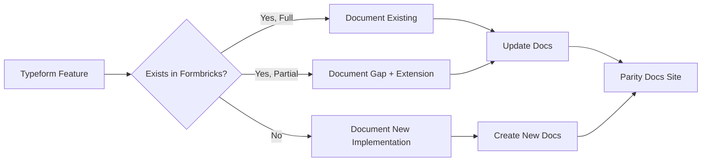

# Technical Specification

# 0. Agent Action Plan

## 0.1 Intent Clarification


### 0.1.1 Core Documentation Objective

Based on the provided requirements, the Blitzy platform understands that the documentation objective is to **create comprehensive gap analysis and capability documentation** for transforming the Formbricks open-source survey platform into a production-ready form and survey platform functionally equivalent to Typeform. This documentation must serve as the authoritative reference for a multi-phase autonomous implementation effort, covering capability mapping, sprint roadmap, and parity validation.

**Documentation Category:** Create new documentation | Update existing documentation | Fix documentation gaps

**Documentation Types Required:**
- Gap Report documentation (Typeform vs. Formbricks capability comparison)
- Architecture documentation for new feature implementations
- API reference updates for new question types, webhook payload formats, and export endpoints
- User guides for new features (payment questions, opinion scale, enhanced logic jumps)
- Migration guides ensuring existing Formbricks forms remain intact
- Technical specification documents for each capability gap
- Sprint roadmap documentation for phased implementation

**Requirement Inventory with Enhanced Clarity:**

| # | Requirement | Documentation Need |
|---|---|---|
| 1 | All Typeform question types (statement, rating, opinion scale, file upload, date, payment) | Gap analysis documenting which of the 15 existing Formbricks element types (`TSurveyElementTypeEnum`) cover Typeform parity and which require new implementations — specifically `payment` and `opinionScale` types not present in `packages/types/surveys/constants.ts` |
| 2 | Conditional logic and branching | Documentation of existing block-based logic system (`jumpToBlock`, `calculate`, `requireAnswer` actions in `packages/types/surveys/blocks.ts`) vs. Typeform's logic jump feature, with gap analysis for 100% equivalence |
| 3 | Hidden fields and answer piping | Documentation of existing `hiddenFields` implementation and `recall` mechanism (`replaceHeadlineRecall`, `parseRecallInfo`) vs. Typeform's answer piping model |
| 4 | Partial submission and progress save | Documentation of existing `finished: false` partial response capture in `apps/web/lib/response/service.ts` vs. Typeform's progress persistence model |
| 5 | Webhook payload parity with Typeform | Structural comparison documentation of Formbricks webhook payload format (`PipelineTriggers` enum: `responseCreated`, `responseUpdated`, `responseFinished`) against Typeform's webhook schema |
| 6 | Response analytics and export (CSV, JSON, XLSX) | Documentation of existing CSV/XLSX export via `getResponsesDownloadUrlAction` and gap analysis for JSON export and advanced analytics features |
| 7 | Embed and share flows | Documentation of existing `ShareEmbedModal` components (anonymous links, personal links, dynamic popup) vs. Typeform's embed options |
| 8 | Workspace and multi-user governance | Documentation of existing Organization/Project/Team model in `apps/web/modules/organization/` and `apps/web/modules/ee/teams/` vs. Typeform's workspace model |

**Implicit Documentation Needs Surfaced:**
- Schema migration safety documentation (constraint: "Existing Formbricks forms must not be broken by any schema migration")
- Webhook signature verification documentation (existing `generateStandardWebhookSignature` in pipeline route)
- Lossless export validation documentation (constraint: "Response export must be lossless")
- New Prisma migration documentation for any new question types added to `packages/database/schema.prisma`
- OpenAPI specification updates for both v1 (`docs/api-reference/openapi.json`) and v2 (`docs/api-v2-reference/openapi.yml`)

### 0.1.2 Special Instructions and Constraints

**Critical Directives:**
- Webhook payloads must maintain structural parity with Typeform format — documentation must provide a field-by-field mapping between Typeform and Formbricks webhook schemas
- Logic jump coverage must be 100% feature-equivalent — documentation must enumerate every Typeform logic condition type and map to Formbricks equivalents in `packages/types/surveys/logic.ts`
- Existing Formbricks forms must not be broken by any schema migration — documentation must include backward-compatibility validation criteria for every Prisma migration
- Response export must be lossless — documentation must define data fidelity metrics and validation procedures

**Documentation Style Preferences:**
- Follow existing Mintlify documentation conventions as defined in `docs/docs.json` and `AGENTS.md`
- Use MDX frontmatter with `title`, `description`, and `icon` fields
- Do not start pages with an H1; use Camel Case headings
- Use Mintlify components for steps and callouts
- Include Mermaid diagrams for architecture and data flow documentation
- Enterprise-only features must include the Enterprise note block

**Template Requirements:**
- Match existing documentation patterns found in `docs/` structure (Overview, XM & Surveys, Self Hosting, Development, API Reference tabs)
- Follow the navigation hierarchy defined in `docs/docs.json`

### 0.1.3 Technical Interpretation

These documentation requirements translate to the following technical documentation strategy:

- To **document the gap analysis**, we will **create** `docs/development/typeform-parity/gap-report.mdx` mapping all 8 in-scope capability areas against existing Formbricks implementations, referencing source code in `packages/types/surveys/constants.ts`, `apps/web/modules/survey/`, and `apps/web/modules/integrations/webhooks/`
- To **document new question types**, we will **create** MDX pages under `docs/xm-and-surveys/surveys/question-type/` for `payment` and `opinion-scale` types, following the structure of existing pages like `date.mdx` and `rating.mdx`
- To **document webhook parity**, we will **update** `docs/xm-and-surveys/core-features/integrations/webhooks.mdx` and **create** `docs/development/typeform-parity/webhook-parity.mdx` with structural payload comparisons
- To **document export capabilities**, we will **create** `docs/xm-and-surveys/surveys/general-features/response-export.mdx` covering CSV, JSON, and XLSX formats with data fidelity guarantees
- To **document logic branching parity**, we will **update** `docs/xm-and-surveys/surveys/general-features/conditional-logic.mdx` and **create** `docs/development/typeform-parity/logic-parity.mdx` with a complete operator-to-operator mapping
- To **document schema migration safety**, we will **create** `docs/development/typeform-parity/migration-safety.mdx` with backward-compatibility procedures referencing `packages/database/migration/`
- To **document workspace governance**, we will **update** `docs/xm-and-surveys/core-features/user-management.mdx` and create a parity comparison document

### 0.1.4 Inferred Documentation Needs

Based on codebase analysis:
- **Module `packages/types/surveys/constants.ts`** defines 15 element types but lacks `payment` and `opinionScale` — documentation must specify these as new implementations
- **Module `apps/web/lib/response/service.ts`** implements `getResponseDownloadFile` with CSV and XLSX export but no direct JSON export endpoint — documentation must specify JSON export as a gap
- **Module `apps/web/app/api/(internal)/pipeline/route.ts`** implements webhook fan-out with `generateStandardWebhookSignature` — documentation must detail the signature scheme and compare payload structure with Typeform
- **Module `packages/types/surveys/logic.ts`** defines comprehensive conditional operators (equals, contains, isAfter, isBefore, includesAllOf, etc.) — documentation must map these against Typeform's logic jump operators to verify 100% equivalence
- **Module `apps/web/modules/survey/editor/components/hidden-fields-card.tsx`** implements hidden fields with validation — documentation must compare Formbricks' recall/piping mechanism with Typeform's answer piping
- **Module `apps/web/modules/analysis/`** implements share links and response cards — documentation must compare with Typeform's analytics capabilities and identify gaps in aggregation and visualization


## 0.2 Documentation Discovery and Analysis


### 0.2.1 Existing Documentation Infrastructure Assessment

Repository analysis reveals a **Mintlify-powered documentation site** located at `docs/` with comprehensive coverage of current platform features but no Typeform-parity documentation.

**Documentation Framework:**
- **Generator:** Mintlify (CLI-based, `npm i -g mintlify`)
- **Configuration:** `docs/docs.json` (Mintlify schema v2, `mint` theme)
- **Theme:** Mint with teal-based brand colors (`#00C4B8`)
- **Analytics:** PostHog EU integration (`phc_zJO1n3rjHlhqKiJ0gqLDwT4qvfWF1wzHDq2gfl0moQm`)
- **Local Development:** `mintlify dev` → `http://localhost:3000`

**Documentation Structure (from `docs/docs.json` navigation):**

| Tab | Sections | Page Count |
|-----|----------|------------|
| Overview | Introduction, What is Formbricks, Open Source | 3 |
| XM & Surveys | Surveys (General Features, Link Surveys, Website/App Surveys, Question Types), Platform Features (Integrations, User Management), Best Practices | ~50+ |
| Self Hosting | Setup (One-click, Docker, Monitoring, Cluster, K8s), Configuration (SSL, Env Vars, SMTP, Uploads, Auth/SSO, Integrations), Advanced (Migration, License, Rate Limiting, Enterprise) | ~25+ |
| Development | Local Setup (Linux, Mac, Windows, Gitpod, Codespaces), Technical Handbook, Standards (Code Organization, Practices, Technical, QA), Contributions, Guides, Support | ~20+ |
| API v1 Reference | REST API, Generate Key, Test Key + OpenAPI auto-generated pages | 3 + auto |
| API v2 Reference (Beta) | Introduction + OpenAPI auto-generated pages | 1 + auto |

**API Documentation Tools:**
- OpenAPI 3.0 specification at `docs/api-reference/openapi.json` (v1)
- OpenAPI 3.1.0 specification at `docs/api-v2-reference/openapi.yml` (v2)
- Auto-generated API pages via Mintlify OpenAPI integration
- Zod schemas with `zod-openapi` decorators in `packages/database/zod/` and `packages/types/`

**Diagram Tools Detected:**
- Mermaid support via Mintlify's built-in rendering
- SVG brand assets in `docs/images/` (favicon, logo-dark, logo-light)

**Documentation Hosting:**
- Mintlify cloud deployment with redirects configured in `docs/docs.json`
- 50+ URL redirects maintaining backward compatibility from legacy paths

### 0.2.2 Repository Code Analysis for Documentation

**Search Patterns Used for Code to Document:**

| Pattern | Location | Findings |
|---------|----------|----------|
| Survey element type definitions | `packages/types/surveys/constants.ts` | 15 element types defined in `TSurveyElementTypeEnum`: FileUpload, OpenText, MultipleChoiceSingle/Multi, NPS, CTA, Rating, Consent, PictureSelection, Cal, Date, Matrix, Address, Ranking, ContactInfo |
| Conditional logic implementation | `packages/types/surveys/blocks.ts`, `packages/surveys/src/lib/logic.ts`, `apps/web/lib/surveyLogic/utils.ts` | Block-based logic with jumpToBlock, calculate, requireAnswer actions; comprehensive operators (equals, contains, isAfter, isBefore, includesAllOf, etc.) |
| Hidden fields implementation | `apps/web/modules/survey/editor/components/hidden-fields-card.tsx`, `packages/types/surveys/types.ts` | `TSurveyHiddenFields` with `enabled` flag and `fieldIds` array; recall/piping via `replaceHeadlineRecall` |
| Answer piping / recall | `apps/web/modules/survey/link/components/survey-client-wrapper.tsx`, `apps/web/lib/survey-builder.ts` | `parseRecallInfo` for dynamic content substitution; `recall:<id>` token system |
| Partial submissions | `apps/web/lib/response/service.ts` | `finished: false` response capture; `updateResponse` with transaction client support |
| Webhook implementation | `apps/web/modules/integrations/webhooks/`, `apps/web/app/api/(internal)/pipeline/route.ts` | CRUD with HTTPS enforcement, Discord detection; pipeline fan-out with signature verification |
| Response export | `apps/web/lib/response/service.ts`, `apps/web/app/(app)/.../CustomFilter.tsx` | `getResponseDownloadFile` supporting CSV and XLSX; batched 3,000-response streaming; `convertToCsv`/`convertToXlsxBuffer` |
| Embed/share flows | `apps/web/app/(app)/.../shareEmbedModal/` | Anonymous links, personal links, dynamic popup, disable-link modal, share-view components |
| Workspace governance | `apps/web/modules/organization/`, `apps/web/modules/ee/teams/`, `apps/web/modules/projects/` | Organization → Project → Team hierarchy; Owner/Manager roles; API key management; billing-enforced limits |

**Key Directories Examined:**
- `docs/` — Complete documentation site with Mintlify config and OpenAPI specs
- `packages/types/surveys/` — 9 files defining the complete survey DSL
- `packages/database/` — Prisma schema, migration catalog, Zod validators
- `apps/web/modules/survey/` — Survey editor, link, list, templates, follow-ups
- `apps/web/modules/integrations/webhooks/` — Full webhook management stack
- `apps/web/modules/analysis/` — Analytics components and utilities
- `apps/web/lib/response/` — Response service with export capabilities
- `apps/web/modules/organization/` — Organization management
- `apps/web/modules/ee/` — Enterprise features (teams, contacts, billing, quotas)

### 0.2.3 Web Search Research Conducted

- Mintlify documentation platform capabilities and best practices for API documentation
- Typeform question type catalog for parity comparison baseline
- Documentation best practices for gap analysis reports and migration guides

**Key Findings:**
- Mintlify provides native OpenAPI rendering, Mermaid diagram support, and MDX component system — ideal for the documentation scope
- Existing Formbricks documentation follows established Mintlify patterns with consistent frontmatter, navigation configuration, and redirect management
- The `AGENTS.md` file at the repository root provides explicit documentation standards: MDX frontmatter requirements, heading conventions (Camel Case, no H1), Mintlify component usage, and Enterprise note blocks


## 0.3 Documentation Scope Analysis


### 0.3.1 Code-to-Documentation Mapping

**Modules Requiring Documentation:**

- **Module: `packages/types/surveys/constants.ts`**
  - Public APIs: `TSurveyElementTypeEnum` (15 element types)
  - Current documentation: Exists for all 15 types under `docs/xm-and-surveys/surveys/question-type/`
  - Documentation needed: Gap analysis for missing Typeform-equivalent types (payment, opinion scale); updated enum documentation when new types are added

- **Module: `packages/types/surveys/blocks.ts`**
  - Public APIs: `ZSurveyBlock`, `ZSurveyBlockLogicAction`, `ZSurveyBlocks`
  - Current documentation: Partial (conditional logic page exists at `docs/xm-and-surveys/surveys/general-features/conditional-logic`)
  - Documentation needed: Complete logic operator mapping against Typeform's logic jumps; new documentation for any extended operators

- **Module: `packages/types/surveys/logic.ts`**
  - Public APIs: Conditional operators (equals, doesNotEqual, contains, isAfter, isBefore, includesAllOf, includesOneOf, isSubmitted, isSkipped, isBooked, isClicked, isEmpty, isNotEmpty, isAnyOf)
  - Current documentation: Partial
  - Documentation needed: Exhaustive operator catalog with Typeform parity mapping

- **Module: `packages/types/surveys/types.ts`**
  - Public APIs: `ZSurvey`, `TSurveyHiddenFields`, welcome/ending cards, variables
  - Current documentation: Exists for hidden fields and recall
  - Documentation needed: Updated documentation for any new fields (payment configuration, opinion scale parameters)

- **Module: `apps/web/modules/integrations/webhooks/`**
  - Endpoints: CRUD operations (create, update, delete, test)
  - Current documentation: Exists at `docs/xm-and-surveys/core-features/integrations/webhooks`
  - Documentation needed: Payload structure comparison with Typeform; signature verification documentation

- **Module: `apps/web/lib/response/service.ts`**
  - Public APIs: `getResponseDownloadFile`, `getResponses`, `updateResponse`, `deleteResponse`
  - Current documentation: Missing dedicated export documentation
  - Documentation needed: Complete export format documentation (CSV, XLSX, JSON); lossless export validation

- **Module: `apps/web/app/api/(internal)/pipeline/route.ts`**
  - Endpoints: POST handler for webhook fan-out
  - Current documentation: Partial (webhook triggers documented)
  - Documentation needed: Complete webhook payload schema documentation; Typeform structural parity analysis

- **Module: `apps/web/modules/organization/` and `apps/web/modules/ee/teams/`**
  - Public APIs: Organization CRUD, membership management, team structures
  - Current documentation: Exists at `docs/xm-and-surveys/core-features/user-management/`
  - Documentation needed: Workspace governance comparison with Typeform's model

- **Module: `apps/web/modules/survey/link/` and `shareEmbedModal/`**
  - Components: Anonymous links, personal links, dynamic popup, share-view
  - Current documentation: Exists at `docs/xm-and-surveys/surveys/link-surveys/embed-surveys`
  - Documentation needed: Comprehensive embed options comparison with Typeform

**Configuration Options Requiring Documentation:**
- `PipelineTriggers` enum: `responseCreated`, `responseUpdated`, `responseFinished`
- `WebhookSource` enum: `user`, `zapier`, `make`, `n8n`, `activepieces`
- Billing plan limits: Free (1,500 responses/2,000 MIU), Startup (5,000/7,500), Custom (unlimited)
- Storage upload limits: Client 5MB, Server 10MB, Big file 1GB

### 0.3.2 Documentation Gap Analysis

Given the requirements and repository analysis, documentation gaps include:

**Undocumented Capabilities (Gaps in Existing Docs):**

| Gap Area | Current State | Required Documentation |
|----------|---------------|----------------------|
| Payment question type | Not implemented (`TSurveyElementTypeEnum` has no `Payment` entry) | New question type specification, Stripe integration guide, implementation design doc |
| Opinion scale question type | Not implemented as separate type (NPS covers 0–10 range) | New question type specification differentiating from NPS, customizable scale parameters |
| Response JSON export | Only CSV and XLSX exist in `getResponseDownloadFile` | JSON export endpoint specification, data format documentation |
| Typeform webhook payload parity | Formbricks uses its own payload format | Field-by-field structural mapping document |
| Complete logic operator parity | Extensive operators exist but no parity verification | Exhaustive operator comparison matrix |
| Answer piping documentation | Recall mechanism exists but incompletely documented | Complete answer piping user guide with examples |
| Progress save UX | Partial submissions captured server-side | User-facing progress indicator documentation |

**Missing User Guides:**
- Gap report overview and methodology
- Sprint roadmap for phased implementation
- Payment question setup and configuration
- Opinion scale question customization
- Advanced logic branching (100% Typeform parity)
- Webhook payload format migration guide
- Lossless response export verification procedures

**Incomplete Architecture Documentation:**
- No data flow documentation for the webhook pipeline (`apps/web/app/api/(internal)/pipeline/route.ts` → integrations → follow-ups → emails)
- No comparison architecture between Typeform's workspace model and Formbricks' Organization → Project → Team hierarchy
- No schema migration safety procedures documented for extending `TSurveyElementTypeEnum`

**Outdated Documentation Requiring Updates:**
- `docs/xm-and-surveys/surveys/general-features/conditional-logic` — needs logic parity extensions
- `docs/xm-and-surveys/core-features/integrations/webhooks` — needs payload format updates
- `docs/api-reference/openapi.json` — needs new endpoint definitions for added capabilities
- `docs/api-v2-reference/openapi.yml` — needs new endpoint definitions for added capabilities


## 0.4 Documentation Implementation Design


### 0.4.1 Documentation Structure Planning

The documentation for Typeform parity will be organized within the existing Mintlify hierarchy, adding a new `typeform-parity` section under the Development tab while extending existing XM & Surveys sections:

```
docs/
├── docs.json (UPDATE - add navigation entries for new pages)
├── development/
│   └── typeform-parity/
│       ├── gap-report.mdx (CREATE - comprehensive gap analysis)
│       ├── sprint-roadmap.mdx (CREATE - phased implementation plan)
│       ├── question-type-parity.mdx (CREATE - element type mapping)
│       ├── logic-parity.mdx (CREATE - conditional logic comparison)
│       ├── webhook-parity.mdx (CREATE - payload structure comparison)
│       ├── export-parity.mdx (CREATE - response export comparison)
│       ├── embed-share-parity.mdx (CREATE - embed/share comparison)
│       ├── workspace-parity.mdx (CREATE - governance comparison)
│       └── migration-safety.mdx (CREATE - schema migration guide)
├── xm-and-surveys/
│   └── surveys/
│       ├── general-features/
│       │   ├── conditional-logic.mdx (UPDATE - extend with parity info)
│       │   ├── hidden-fields.mdx (UPDATE - add piping comparison)
│       │   ├── partial-submissions.mdx (UPDATE - add progress save)
│       │   └── response-export.mdx (CREATE - export format guide)
│       └── question-type/
│           ├── payment.mdx (CREATE - payment question docs)
│           └── opinion-scale.mdx (CREATE - opinion scale docs)
├── api-reference/
│   └── openapi.json (UPDATE - add new endpoints)
└── api-v2-reference/
    └── openapi.yml (UPDATE - add new endpoints)
```

### 0.4.2 Content Generation Strategy

**Information Extraction Approach:**
- Extract current question type definitions from `packages/types/surveys/constants.ts` and element schemas from `packages/types/surveys/elements.ts`
- Extract webhook payload structures from `apps/web/app/api/(internal)/pipeline/route.ts` and `packages/database/zod/webhooks.ts`
- Extract response export logic from `apps/web/lib/response/service.ts` (functions: `getResponseDownloadFile`, `convertToCsv`, `convertToXlsxBuffer`)
- Extract conditional logic operators from `packages/types/surveys/logic.ts` and runtime evaluation from `packages/surveys/src/lib/logic.ts`
- Extract embed/share components from `apps/web/app/(app)/.../shareEmbedModal/` directory
- Generate examples by analyzing test files: `packages/surveys/src/lib/logic.test.ts`, `apps/web/lib/surveyLogic/utils.test.ts`

**Documentation Standards:**
- Markdown/MDX formatting with Mintlify frontmatter (`title`, `description`, `icon`)
- Mermaid diagram integration using fenced code blocks
- Code examples using TypeScript/JSON syntax highlighting
- Source citations as inline references: `Source: /path/to/file.ts:LineNumber`
- Tables for parameter descriptions, operator comparisons, and payload mappings
- Consistent terminology following existing Formbricks glossary
- Camel Case headings (only capitalize feature names), no H1 headers
- Mintlify components for steps, callouts, and accordion elements

### 0.4.3 Diagram and Visual Strategy

**Mermaid Diagrams to Create:**

- **Gap Analysis Overview** — Flowchart showing Typeform features mapped to Formbricks capability status (implemented/partial/missing)
- **Webhook Pipeline Data Flow** — Sequence diagram showing `pipeline/route.ts` → webhook dispatch → integration handlers → follow-up emails
- **Question Type Hierarchy** — Class diagram showing `TSurveyElementTypeEnum` with existing and new types
- **Logic Operator Comparison** — Matrix diagram mapping Typeform operators to Formbricks operators
- **Export Pipeline** — Sequence diagram showing `getResponseDownloadFile` → batch streaming → format conversion
- **Workspace Governance Model** — Entity-relationship diagram comparing Typeform workspace to Formbricks Organization → Project → Team hierarchy
- **Schema Migration Flow** — Flowchart for safe migration procedures with rollback steps




## 0.5 Documentation File Transformation Mapping


### 0.5.1 File-by-File Documentation Plan

| Target Documentation File | Transformation | Source Code/Docs | Content/Changes |
|---------------------------|----------------|------------------|-----------------|
| `docs/development/typeform-parity/gap-report.mdx` | CREATE | `packages/types/surveys/constants.ts`, `packages/types/surveys/elements.ts`, `packages/types/surveys/logic.ts`, `apps/web/modules/integrations/webhooks/`, `apps/web/lib/response/service.ts` | Comprehensive gap analysis covering all 8 in-scope capability areas: question types, conditional logic, hidden fields/piping, partial submissions, webhooks, export, embed/share, and workspace governance. Feature-by-feature comparison matrix with status indicators (full/partial/missing) |
| `docs/development/typeform-parity/sprint-roadmap.mdx` | CREATE | Gap report analysis, feature dependency graph | Sprint-by-sprint implementation roadmap organized by feature priority, dependency chains, and parity validation milestones. Maps each epic to specific Formbricks modules and packages |
| `docs/development/typeform-parity/question-type-parity.mdx` | CREATE | `packages/types/surveys/constants.ts`, `packages/types/surveys/elements.ts` | Detailed mapping of all Typeform question types to Formbricks element types. Identifies exact coverage for: statement→CTA, rating→Rating, opinion scale→new type needed, file upload→FileUpload, date→Date, payment→new type needed. Includes Zod schema specifications for new types |
| `docs/development/typeform-parity/logic-parity.mdx` | CREATE | `packages/types/surveys/logic.ts`, `packages/types/surveys/blocks.ts`, `packages/surveys/src/lib/logic.ts`, `apps/web/lib/surveyLogic/utils.ts` | Exhaustive operator-to-operator mapping between Typeform logic jumps and Formbricks conditional logic. Covers all operators: equals, doesNotEqual, contains, beginsWith, endsWith, greaterThan, lowerThan, isAfter, isBefore, isEmpty, isSubmitted, isSkipped, includesAllOf, includesOneOf, isAnyOf. Gap analysis for any missing operators |
| `docs/development/typeform-parity/webhook-parity.mdx` | CREATE | `apps/web/app/api/(internal)/pipeline/route.ts`, `packages/database/zod/webhooks.ts`, `apps/web/modules/integrations/webhooks/lib/webhook.ts` | Field-by-field structural comparison of Formbricks webhook payloads (response data, survey metadata, signature headers) against Typeform webhook schema. Documents trigger mapping, payload transformation requirements, and signature verification |
| `docs/development/typeform-parity/export-parity.mdx` | CREATE | `apps/web/lib/response/service.ts`, `apps/web/app/(app)/.../CustomFilter.tsx` | Response export format comparison covering CSV, XLSX, and JSON. Documents existing `getResponseDownloadFile` batched streaming (3,000 per batch), header generation, and format conversion. Identifies JSON export gap and lossless export validation procedures |
| `docs/development/typeform-parity/embed-share-parity.mdx` | CREATE | `apps/web/app/(app)/.../shareEmbedModal/`, `apps/web/modules/survey/link/` | Embed and share flow comparison: anonymous links, personal links, single-use links, dynamic popup, iframe embed, and widget embed. Maps Typeform's embed options (standard, full-page, popup, slider, popover, side tab) to Formbricks equivalents |
| `docs/development/typeform-parity/workspace-parity.mdx` | CREATE | `apps/web/modules/organization/`, `apps/web/modules/ee/teams/`, `apps/web/modules/projects/` | Workspace governance comparison documenting Formbricks Organization→Project→Team→Role hierarchy vs. Typeform's Workspace→Team→Folder model. Role permissions mapping and multi-user collaboration capabilities |
| `docs/development/typeform-parity/migration-safety.mdx` | CREATE | `packages/database/schema.prisma`, `packages/database/migration/`, `packages/database/README.md` | Schema migration safety procedures for adding new question types and extending the survey model. Backward-compatibility validation, migration rollback procedures, data integrity verification, and the custom `fb-migrate-dev` workflow |
| `docs/xm-and-surveys/surveys/question-type/payment.mdx` | CREATE | `packages/types/surveys/elements.ts` (to be extended), `docs/xm-and-surveys/surveys/question-type/rating.mdx` (style reference) | Payment question type user documentation: configuration, Stripe integration, currency support, amount settings, receipt handling. Follows existing question type documentation structure |
| `docs/xm-and-surveys/surveys/question-type/opinion-scale.mdx` | CREATE | `packages/types/surveys/elements.ts` (to be extended), `docs/xm-and-surveys/surveys/question-type/net-promoter-score.mdx` (style reference) | Opinion scale question type user documentation: customizable range (1–5, 1–7, 1–10), label configuration, visual style options. Follows existing question type documentation structure |
| `docs/xm-and-surveys/surveys/general-features/response-export.mdx` | CREATE | `apps/web/lib/response/service.ts`, `apps/web/app/(app)/.../CustomFilter.tsx` | Dedicated response export user guide covering CSV, XLSX, and JSON formats. Filter-based export, date range selection, data format specifications, and lossless export guarantees |
| `docs/xm-and-surveys/surveys/general-features/conditional-logic.mdx` | UPDATE | `packages/types/surveys/logic.ts`, `packages/types/surveys/blocks.ts` | Extend existing conditional logic page with complete operator reference table, Typeform parity notes, and examples for all branching scenarios |
| `docs/xm-and-surveys/surveys/general-features/hidden-fields.mdx` | UPDATE | `apps/web/modules/survey/editor/components/hidden-fields-card.tsx`, `packages/types/surveys/types.ts` | Add answer piping section documenting the recall mechanism, `recall:<id>` token syntax, and comparison with Typeform's piping model |
| `docs/xm-and-surveys/surveys/general-features/partial-submissions.mdx` | UPDATE | `apps/web/lib/response/service.ts` | Add progress save documentation explaining the `finished: false` capture mechanism, resume behavior, and comparison with Typeform's progress persistence |
| `docs/xm-and-surveys/core-features/integrations/webhooks.mdx` | UPDATE | `apps/web/modules/integrations/webhooks/`, `apps/web/app/api/(internal)/pipeline/route.ts` | Add webhook payload format section with schema documentation, signature verification guide, and Typeform payload comparison reference |
| `docs/xm-and-surveys/core-features/user-management.mdx` | UPDATE | `apps/web/modules/organization/`, `apps/web/modules/ee/teams/` | Add workspace governance section comparing with Typeform's model, documenting Organization→Project→Team hierarchy, role permissions, and multi-user collaboration |
| `docs/docs.json` | UPDATE | `docs/docs.json` | Add navigation entries for all new pages under Development tab (typeform-parity group) and XM & Surveys tab (new question types, response-export) |
| `docs/api-reference/openapi.json` | UPDATE | `apps/web/scripts/generate-openapi.ts` | Add endpoint definitions for new payment question type, opinion scale type, JSON export endpoint, and any new webhook configuration options |
| `docs/api-v2-reference/openapi.yml` | UPDATE | `apps/web/scripts/generate-openapi.ts` | Add v2 endpoint definitions matching v1 updates for new capabilities, following OpenAPI 3.1.0 specification |

### 0.5.2 New Documentation Files Detail

**File: `docs/development/typeform-parity/gap-report.mdx`**
- Type: Gap Analysis Report
- Source Code: `packages/types/surveys/`, `apps/web/modules/survey/`, `apps/web/modules/integrations/`, `apps/web/lib/response/`
- Sections:
  - Overview (purpose, methodology, scope boundaries)
  - Question Type Parity Matrix (15 existing + 2 new vs. Typeform catalog)
  - Conditional Logic Parity Analysis (operator mapping, gap identification)
  - Data Collection Features (hidden fields, answer piping, partial submissions)
  - Webhook Integration Parity (payload comparison, trigger mapping)
  - Export Capabilities Analysis (CSV, XLSX, JSON comparison)
  - Embed and Share Analysis (deployment options comparison)
  - Workspace Governance Analysis (organizational model comparison)
  - Priority Ranking and Implementation Roadmap Summary
- Diagrams:
  - Gap analysis overview flowchart
  - Feature parity heatmap table
- Key Citations: `packages/types/surveys/constants.ts`, `apps/web/app/api/(internal)/pipeline/route.ts`, `apps/web/lib/response/service.ts`

**File: `docs/development/typeform-parity/question-type-parity.mdx`**
- Type: Technical Specification
- Source Code: `packages/types/surveys/constants.ts`, `packages/types/surveys/elements.ts`, `packages/types/surveys/validation-rules.ts`
- Sections:
  - Typeform Question Type Catalog (complete list with semantics)
  - Formbricks Element Type Mapping (TSurveyElementTypeEnum alignment)
  - Covered Types (statement→CTA, rating→Rating, file upload→FileUpload, date→Date)
  - Gap Types (payment: new Zod schema + Stripe integration, opinion scale: new Zod schema + configurable range)
  - Schema Extension Specifications (Zod schema definitions for new types)
  - Validation Rule Additions (per-type validation rules from `validation-rules.ts`)
- Diagrams:
  - Element type hierarchy class diagram
- Key Citations: `packages/types/surveys/constants.ts`, `packages/types/surveys/elements.ts`

**File: `docs/development/typeform-parity/webhook-parity.mdx`**
- Type: Integration Specification
- Source Code: `apps/web/app/api/(internal)/pipeline/route.ts`, `packages/database/zod/webhooks.ts`, `apps/web/modules/integrations/webhooks/lib/webhook.ts`
- Sections:
  - Typeform Webhook Payload Schema Reference
  - Formbricks Webhook Payload Current Structure
  - Field-by-Field Structural Comparison
  - Trigger Mapping (responseCreated/Updated/Finished ↔ Typeform events)
  - Signature Verification Comparison
  - Payload Transformation Requirements
  - Backward Compatibility Guarantees
- Diagrams:
  - Webhook pipeline sequence diagram
  - Payload structure comparison table
- Key Citations: `apps/web/app/api/(internal)/pipeline/route.ts`, `packages/database/zod/webhooks.ts`

### 0.5.3 Documentation Files to Update Detail

- **`docs/xm-and-surveys/surveys/general-features/conditional-logic.mdx`** — Add Typeform logic parity section
  - New sections: Complete Operator Reference Table, Typeform Logic Jump Mapping, Advanced Branching Examples
  - New diagrams: Operator comparison matrix
  - Source citations: `packages/types/surveys/logic.ts`, `packages/surveys/src/lib/logic.ts`

- **`docs/xm-and-surveys/core-features/integrations/webhooks.mdx`** — Add payload format documentation
  - New sections: Webhook Payload Schema, Signature Verification, Typeform Compatibility
  - Updated examples: Complete payload JSON examples for each trigger type
  - Source citations: `apps/web/app/api/(internal)/pipeline/route.ts`

- **`docs/docs.json`** — Add navigation for new documentation pages
  - Add `typeform-parity` group under Development tab
  - Add `response-export`, `payment`, `opinion-scale` pages to appropriate groups
  - Update sidebar configuration with new page paths

### 0.5.4 Documentation Configuration Updates

- **`docs/docs.json`:** Add new navigation group under Development tab for Typeform Parity documentation; add new question type pages under Question Types group; add response-export page under General Features group
- No `.readthedocs.yml` or `docusaurus.config.js` changes required (Mintlify-only docs)

### 0.5.5 Cross-Documentation Dependencies

- **Shared content references:** Gap report links to all individual parity analysis pages
- **Navigation links:** All new typeform-parity pages cross-reference each other and existing feature documentation
- **Table of contents:** `docs/docs.json` navigation must be updated to include all new pages
- **OpenAPI specs:** Both `openapi.json` (v1) and `openapi.yml` (v2) must reflect new endpoints
- **Index/glossary:** New terms (opinion scale, payment question, webhook parity) should be added to existing glossary if present


## 0.6 Dependency Inventory


### 0.6.1 Documentation Dependencies

| Registry | Package Name | Version | Purpose |
|----------|--------------|---------|---------|
| npm | mintlify | latest (CLI) | Documentation site generator — Mintlify CLI for local preview and development (`npm i -g mintlify`) |
| npm | next | 16.1.6 | Primary web framework — documentation references Next.js App Router patterns |
| npm | react | 19.2.3 | UI framework — documentation references React component patterns |
| npm | zod | 3.24.4 | Schema validation — documentation references Zod schema definitions for new types |
| npm | zod-openapi | 4.2.4 | OpenAPI decorators — documentation references Zod-OpenAPI metadata for API docs |
| npm | @prisma/client | 6.14.0 | Database ORM — documentation references Prisma schema and migration patterns |
| npm | pnpm | 10.28.2 | Package manager — documentation references monorepo workspace commands |
| npm | turbo | 2.5.3 | Build orchestration — documentation references Turborepo task graph |
| npm | typescript | (workspace) | Language — documentation references TypeScript type definitions |
| npm | @playwright/test | 1.56.1 | E2E testing — documentation references Playwright test patterns |
| npm | vitest | (workspace) | Unit testing — documentation references Vitest test patterns |

### 0.6.2 Documentation Reference Updates

**Documentation files requiring link updates upon creation of new pages:**

| File Pattern | Link Update Required |
|---|---|
| `docs/docs.json` | Add navigation entries for all 9 new typeform-parity pages, 2 new question type pages, and 1 new general feature page |
| `docs/xm-and-surveys/surveys/general-features/conditional-logic.mdx` | Add cross-reference link to `docs/development/typeform-parity/logic-parity.mdx` |
| `docs/xm-and-surveys/core-features/integrations/webhooks.mdx` | Add cross-reference link to `docs/development/typeform-parity/webhook-parity.mdx` |
| `docs/xm-and-surveys/surveys/general-features/hidden-fields.mdx` | Add cross-reference link to answer piping documentation |
| `docs/xm-and-surveys/surveys/general-features/partial-submissions.mdx` | Add cross-reference link to progress save documentation |
| `docs/development/typeform-parity/gap-report.mdx` | Central hub linking to all individual parity analysis pages |

**Link Transformation Rules:**
- New pages follow existing path convention: `development/typeform-parity/[slug]`
- Question type pages follow: `xm-and-surveys/surveys/question-type/[slug]`
- General features follow: `xm-and-surveys/surveys/general-features/[slug]`
- All internal links use relative MDX references per Mintlify conventions


## 0.7 Coverage and Quality Targets


### 0.7.1 Documentation Coverage Metrics

**Current Coverage Analysis:**

| Coverage Area | Documented | Total | Percentage | Target |
|---|---|---|---|---|
| Existing question types (user-facing docs) | 15/15 | 15 | 100% | 100% |
| Typeform-parity question types | 0/2 | 2 | 0% | 100% |
| Conditional logic operators | ~60% | full set | ~60% | 100% |
| Webhook payload schema | partial | full schema | ~30% | 100% |
| Response export formats | 0/3 (no dedicated page) | 3 (CSV, XLSX, JSON) | 0% | 100% |
| Embed/share options | partial | full comparison | ~50% | 100% |
| Workspace governance model | partial | full comparison | ~40% | 100% |
| Migration safety procedures | 0/1 | 1 | 0% | 100% |
| Gap report documentation | 0/1 | 1 | 0% | 100% |
| Sprint roadmap documentation | 0/1 | 1 | 0% | 100% |

**Target Coverage:** 100% documentation coverage for all Typeform-parity capability areas across the 8 in-scope domains.

**Coverage Gaps to Address:**

| Module | Current Coverage | Target | Focus Areas |
|---|---|---|---|
| Question types | 100% for existing, 0% for new | 100% | Payment type, Opinion Scale type specifications |
| Conditional logic | ~60% | 100% | Exhaustive operator catalog with parity mapping |
| Webhook integration | ~30% | 100% | Payload schema, signature verification, Typeform comparison |
| Response export | 0% | 100% | Dedicated export guide with all format specifications |
| Embed/share | ~50% | 100% | Full Typeform comparison with all embed variants |
| Workspace governance | ~40% | 100% | Complete Typeform workspace model comparison |

### 0.7.2 Documentation Quality Criteria

**Completeness Requirements:**
- Every new question type (payment, opinion scale) has configuration guide, Zod schema reference, validation rules, and usage examples
- Every parity analysis page includes side-by-side comparison tables with clear gap indicators
- The gap report covers all 8 in-scope capability areas with quantified parity percentages
- The sprint roadmap maps every identified gap to an actionable implementation plan
- Migration safety documentation includes step-by-step procedures with rollback instructions

**Accuracy Validation:**
- All element type references verified against `packages/types/surveys/constants.ts` (15 types: FileUpload, OpenText, MultipleChoiceSingle, MultipleChoiceMulti, NPS, CTA, Rating, Consent, PictureSelection, Cal, Date, Matrix, Address, Ranking, ContactInfo)
- All operator references verified against `packages/types/surveys/logic.ts` (equals, doesNotEqual, contains, doesNotContain, startsWith, endsWith, greaterThan, lowerThan, isAfter, isBefore, isEmpty, isNotEmpty, isSubmitted, isSkipped, isBooked, isClicked, includesAllOf, includesOneOf, isAnyOf)
- Webhook trigger references verified against `PipelineTriggers` enum in `packages/database/schema.prisma` (responseCreated, responseUpdated, responseFinished)
- Export format references verified against `getResponseDownloadFile` in `apps/web/lib/response/service.ts` (CSV via `convertToCsv`, XLSX via `convertToXlsxBuffer`)
- Workspace model references verified against `apps/web/modules/organization/` structure

**Clarity Standards:**
- Technical accuracy with accessible language suitable for both developers and product managers
- Progressive disclosure: overview → detailed comparison → implementation specifications
- Consistent terminology using Formbricks naming conventions (element types, blocks, logic actions)
- Every page includes source code citations for traceability

**Maintainability:**
- All documentation pages include source citations as inline references
- New pages follow existing Mintlify MDX patterns for template consistency
- Navigation configuration in `docs/docs.json` enables easy reorganization
- Cross-references between related pages enable navigation without duplication

### 0.7.3 Example and Diagram Requirements

| Requirement | Minimum Count | Types |
|---|---|---|
| Mermaid diagrams per parity analysis page | 1 | Flowcharts, sequence diagrams, ER diagrams |
| Comparison tables per feature area | 1 | Feature mapping tables with status columns |
| Code examples per new question type | 2 | Zod schema snippet, API request/response example |
| Payload examples for webhook parity | 3 | Formbricks payload, Typeform payload, mapping table |
| Export format examples | 3 | CSV sample, XLSX description, JSON sample |


## 0.8 Scope Boundaries


### 0.8.1 Exhaustively In Scope

**New Documentation Files:**
- `docs/development/typeform-parity/**/*.mdx` — All Typeform parity analysis documentation (gap report, sprint roadmap, question type parity, logic parity, webhook parity, export parity, embed/share parity, workspace parity, migration safety)
- `docs/xm-and-surveys/surveys/question-type/payment.mdx` — Payment question type user documentation
- `docs/xm-and-surveys/surveys/question-type/opinion-scale.mdx` — Opinion scale question type user documentation
- `docs/xm-and-surveys/surveys/general-features/response-export.mdx` — Dedicated response export user guide

**Documentation File Updates:**
- `docs/docs.json` — Navigation configuration for all new pages
- `docs/xm-and-surveys/surveys/general-features/conditional-logic.mdx` — Extended operator reference and parity notes
- `docs/xm-and-surveys/surveys/general-features/hidden-fields.mdx` — Answer piping documentation additions
- `docs/xm-and-surveys/surveys/general-features/partial-submissions.mdx` — Progress save documentation
- `docs/xm-and-surveys/core-features/integrations/webhooks.mdx` — Payload schema and parity documentation
- `docs/xm-and-surveys/core-features/user-management.mdx` — Workspace governance parity section
- `docs/api-reference/openapi.json` — New endpoint definitions for added capabilities
- `docs/api-v2-reference/openapi.yml` — V2 endpoint definitions for added capabilities

**Documentation Configuration:**
- `docs/docs.json` — Navigation entries, tab structure, group organization for new content

**Documentation Assets:**
- Mermaid diagrams embedded within MDX pages (no separate image files required — Mintlify renders Mermaid natively)
- Comparison tables and code examples embedded within documentation pages

**Source Code Analysis (read-only for documentation purposes):**
- `packages/types/surveys/**` — All survey type definitions for accurate documentation
- `packages/database/schema.prisma` — Database model for schema migration documentation
- `packages/database/migration/` — Migration patterns for migration safety documentation
- `packages/database/zod/` — Zod validators for API documentation accuracy
- `apps/web/modules/survey/` — Survey module for feature documentation
- `apps/web/modules/integrations/webhooks/` — Webhook module for integration documentation
- `apps/web/modules/analysis/` — Analysis module for export/analytics documentation
- `apps/web/modules/organization/` — Organization module for governance documentation
- `apps/web/modules/ee/teams/` — Teams module for governance documentation
- `apps/web/lib/response/service.ts` — Response service for export documentation
- `apps/web/app/api/(internal)/pipeline/route.ts` — Pipeline for webhook documentation

### 0.8.2 Explicitly Out of Scope

- **Source code modifications** — No changes to TypeScript files, Prisma schema, or application code unless explicitly adding documentation comments/docstrings
- **Test file modifications** — No changes to `.test.ts` files or Playwright specs
- **Feature implementation** — No actual implementation of payment question type, opinion scale, JSON export, or any other feature; documentation only
- **Deployment configuration changes** — No modifications to Docker, Helm, Vercel, or CI/CD configurations
- **Unrelated documentation** — No updates to Self Hosting, Local Setup, Storybook, or other documentation not directly related to Typeform parity
- **Typeform video questions** — Explicitly excluded per user scope (Phase 1 exclusion)
- **Salesforce/HubSpot native integrations** — Explicitly excluded per user scope (Phase 1 exclusion)
- **Internationalization of new documentation** — New MDX pages created in English (en-US) only; translation to other locales is out of scope
- **Design system or UI changes** — No modifications to `apps/web/modules/ui/` or `packages/survey-ui/`
- **Package dependency additions** — No new npm packages added to `package.json` files


## 0.9 Execution Parameters


### 0.9.1 Documentation-Specific Instructions

| Parameter | Value |
|---|---|
| **Documentation build command** | `mintlify dev` (from `docs/` directory) |
| **Documentation preview command** | `mintlify dev` → `http://localhost:3000` |
| **Diagram generation** | Mermaid diagrams rendered natively by Mintlify (no external generation needed) |
| **Documentation deployment** | Mintlify cloud deployment (automatic on push to main branch) |
| **Default format** | MDX with Mintlify frontmatter, Mermaid diagrams, and Mintlify components |
| **Citation requirement** | Every technical section must reference source file paths |
| **Style guide** | Follow `AGENTS.md` Documentation section: MDX frontmatter with `title`, `description`, `icon`; no H1 headers; Camel Case headings; Mintlify components for steps and callouts; Enterprise note blocks for EE features |
| **OpenAPI spec generation** | `pnpm --filter @formbricks/web openapi:generate` (from root) |

### 0.9.2 Documentation Validation Procedures

**Pre-merge Validation Checklist:**
- All MDX files include valid frontmatter (`title`, `description`, `icon`)
- All internal links resolve to existing pages
- All Mermaid diagrams render correctly in Mintlify preview
- All code examples use proper syntax highlighting
- Navigation in `docs/docs.json` includes entries for all new pages
- No broken cross-references between parity analysis pages
- Source code citations reference actual file paths that exist in the repository

**Mintlify-specific Validation:**
- `docs/docs.json` validates against `https://mintlify.com/docs.json` schema
- All page paths in navigation resolve to actual `.mdx` files
- Redirects maintain backward compatibility (no broken existing URLs)
- OpenAPI specifications validate against their respective standard versions (3.0 and 3.1.0)


## 0.10 Rules for Documentation


### 0.10.1 Documentation-Specific Rules

The following rules govern all documentation created and updated within this scope:

- **Follow existing Mintlify documentation style and structure** — All new pages must match the conventions established in the existing `docs/` directory, including frontmatter format, heading hierarchy, and component usage
- **Follow AGENTS.md documentation standards** — MDX frontmatter with `title`, `description`, and `icon`; no H1 headers; Camel Case headings (only capitalize feature names); Mintlify components for steps and callouts; Enterprise note blocks for EE-only features
- **Include Mermaid diagrams for all architecture and workflow documentation** — Every parity analysis page must include at least one Mermaid diagram illustrating the data flow or structural comparison
- **Provide working JSON/TypeScript examples for all API and schema documentation** — Every new question type and webhook payload must include example payloads that validate against the described Zod schemas
- **Maintain structural parity constraint documentation** — Webhook payload documentation must explicitly document that payloads must maintain structural parity with Typeform format, per user constraint
- **Maintain 100% logic jump coverage documentation** — Logic parity documentation must enumerate every Typeform logic condition type and explicitly confirm coverage or identify gaps
- **Document backward-compatibility guarantees** — All schema migration documentation must explicitly state that existing Formbricks forms must not be broken, per user constraint
- **Document lossless export guarantees** — Response export documentation must define data fidelity metrics and verification procedures, per user constraint
- **Add source code citations for all technical details** — Every technical claim must reference a specific file path in the repository
- **Use consistent terminology from existing Formbricks conventions** — Use "element types" (not "question types" in technical contexts), "blocks" (not "pages"), "logic actions" (not "rules"), per established codebase naming
- **Keep documentation synchronized with source code** — All type definitions, operator lists, and API schemas must be verified against current source code before publication
- **No source code changes** — This is a documentation-only scope; no modifications to application code, tests, or deployment configurations
- **Phase 1 exclusions must be explicitly documented** — Video questions and Salesforce/HubSpot integrations must be called out as Phase 1 exclusions in the gap report and roadmap


## 0.11 References


### 0.11.1 Repository Files and Folders Searched

**Root-Level Files Examined:**
- `package.json` — Monorepo workspace configuration, pnpm 10.28.2, dependency versions (React 19.2.3, Next 16.1.6)
- `AGENTS.md` — Repository guidelines including documentation standards (Mintlify conventions, MDX frontmatter, heading rules)
- `openapi.yml` — Root API definition for Formbricks REST API (OpenAPI 3.1.0, v2.0.0)
- `turbo.json` — Turborepo task graph and build configuration
- `pnpm-workspace.yaml` — Workspace glob definitions (`apps/*`, `packages/*`)

**Documentation Directory (`docs/`):**
- `docs/docs.json` — Mintlify site configuration (theme, navigation, redirects, analytics, branding)
- `docs/README.md` — Documentation contributor guide (Mintlify CLI setup, local development)
- `docs/api-reference/openapi.json` — OpenAPI 3.0 specification for API v1
- `docs/api-v2-reference/openapi.yml` — OpenAPI 3.1.0 specification for API v2
- `docs/images/` — Brand SVG assets (favicon, logo-dark, logo-light)

**Survey Type System (`packages/types/surveys/`):**
- `packages/types/surveys/constants.ts` — `TSurveyElementTypeEnum` with 15 element types
- `packages/types/surveys/elements.ts` — Per-element Zod schemas with validation refinements
- `packages/types/surveys/blocks.ts` — Block, logic row, and logic action schemas
- `packages/types/surveys/logic.ts` — Conditional operator literals and condition group validation
- `packages/types/surveys/types.ts` — Comprehensive `ZSurvey` schema with super refinements
- `packages/types/surveys/validation-rules.ts` — Per-element validation rule type definitions
- `packages/types/surveys/blocks-validation.ts` — DFS-based cyclic logic detection
- `packages/types/surveys/validation.ts` — Multilingual validation utilities
- `packages/types/surveys/elements-validation.ts` — Element label validation

**Database Package (`packages/database/`):**
- `packages/database/schema.prisma` — Prisma schema (PostgreSQL, Webhook model, PipelineTriggers enum, WebhookSource enum)
- `packages/database/README.md` — Database package documentation (migration workflow, seed scripts)
- `packages/database/zod/webhooks.ts` — Webhook Zod schema with OpenAPI decorators

**Web Application Modules:**
- `apps/web/modules/survey/` — Survey engine (editor, link, list, templates, follow-ups, components, hooks, lib)
- `apps/web/modules/survey/editor/` — Survey editor server actions, components, logic builders
- `apps/web/modules/survey/link/` — Link survey experience (PIN validation, metadata, components)
- `apps/web/modules/integrations/webhooks/` — Webhook CRUD, validation, testing, audit logging
- `apps/web/modules/analysis/` — Share links, response cards, rating smiley, export utilities
- `apps/web/modules/organization/` — Organization management, settings, API keys, teams
- `apps/web/modules/ee/teams/` — Enterprise team structures and role management
- `apps/web/modules/projects/` — Project management, tags, settings, billing limits

**Web Application Libraries:**
- `apps/web/lib/response/service.ts` — Response CRUD, export (`getResponseDownloadFile`, CSV/XLSX), batch streaming
- `apps/web/lib/surveyLogic/utils.ts` — Logic evaluation, action execution, condition tree manipulation
- `apps/web/lib/survey-builder.ts` — Survey template builder, logic constructors, hidden field defaults
- `apps/web/app/api/(internal)/pipeline/route.ts` — Webhook pipeline fan-out, integration dispatch, signature generation
- `apps/web/app/lib/types/pipelines.ts` — Pipeline payload type definition

**Web Application Components:**
- `apps/web/app/(app)/.../CustomFilter.tsx` — Response filter and CSV/XLSX download orchestration
- `apps/web/app/(app)/.../shareEmbedModal/` — Anonymous links, personal links, dynamic popup, share-view
- `apps/web/modules/survey/editor/components/hidden-fields-card.tsx` — Hidden fields management card
- `apps/web/modules/survey/editor/components/logic-editor.tsx` — Logic editor conditions/actions UI
- `apps/web/modules/survey/editor/components/conditional-logic.tsx` — Conditional logic editing subtree
- `apps/web/modules/survey/link/components/survey-client-wrapper.tsx` — Link survey wrapper with hidden fields and embed support
- `apps/web/modules/analysis/components/SingleResponseCard/` — Response detail rendering

**Test Files Referenced (read-only for documentation accuracy):**
- `packages/surveys/src/lib/logic.test.ts` — Comprehensive logic evaluation test suite
- `apps/web/lib/surveyLogic/utils.test.ts` — Survey logic utility test coverage
- `apps/web/lib/response/tests/response.test.ts` — Response service test coverage

**Technical Specification Sections Retrieved:**
- Section 1.1: Executive Summary — Project overview, business context, stakeholders
- Section 1.3: Scope — In-scope features, out-of-scope items, deployment coverage
- Section 2.1: Feature Catalog — 26 features (16 core + 10 enterprise), element types, integrations
- Section 2.2: Functional Requirements — Survey engine, distribution, data management, API, auth, admin requirements
- Section 3.1: Programming Languages — TypeScript primary, Node.js ≥20.0.0, Docker Node.js 24

### 0.11.2 External Resources

- Mintlify documentation platform — `https://mintlify.com/docs` (documentation generator used by Formbricks)
- Formbricks GitHub repository — `https://github.com/formbricks/formbricks`
- Formbricks documentation site — configured via `docs/docs.json` with PostHog EU analytics

### 0.11.3 Attachments

No attachments were provided for this project. No Figma designs were referenced or required.


