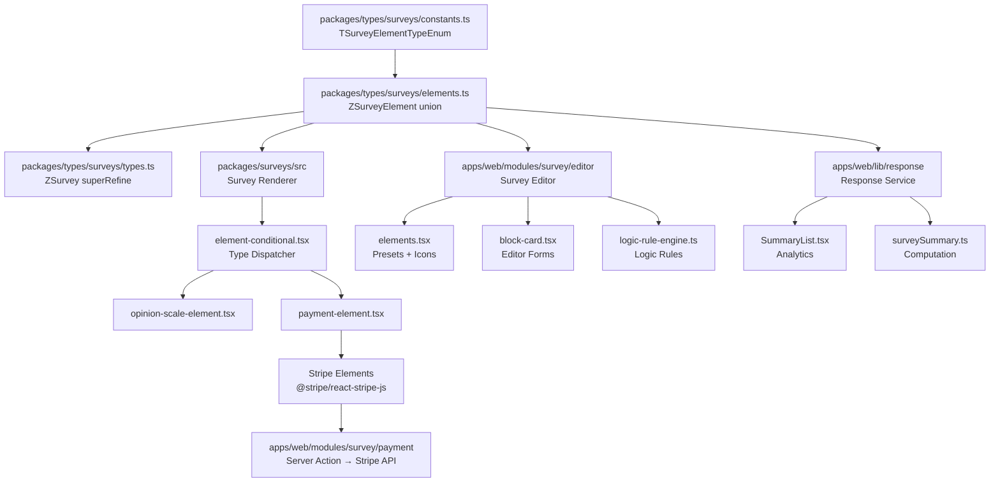

# Technical Specification

# 0. Agent Action Plan

## 0.1 Intent Clarification

### 0.1.1 Core Feature Objective

Based on the prompt, the Blitzy platform understands that the new feature requirement is to **complete Sprint 1: Foundation (Question Types)** of the Typeform Parity initiative by adding two new survey element types to the Formbricks platform — **Opinion Scale** and **Payment** — as defined precisely in the project's source-of-truth documentation.

- **Add `OpinionScale` element type** — A configurable numeric scale question (1–5, 1–7, or 1–10) with customizable endpoint labels and multiple visual styles (number, smiley, star), differentiated from the existing fixed 0–10 NPS element
- **Add `Payment` element type** — A Stripe-integrated payment collection question that enables survey creators to accept payments (USD, EUR, GBP) inline during survey flows, using Stripe Elements for PCI-compliant card input
- **Extend the `TSurveyElementTypeEnum`** from 15 to 17 members by appending `OpinionScale = "opinionScale"` and `Payment = "payment"`
- **Create Zod schemas** (`ZSurveyOpinionScaleElement` and `ZSurveyPaymentElement`) extending `ZSurveyElementBase` and add them to the `ZSurveyElement` union
- **Implement survey editor UI** for both new types within `apps/web/modules/survey/editor/components/`
- **Implement survey renderer components** in both `packages/surveys/src/components/elements/` (Preact runtime) and `packages/survey-ui/src/components/elements/` (React UI kit)
- **Register validation rules** in `APPLICABLE_RULES` for both new element types
- **Maintain 100% backward compatibility** with all 15 existing element types — no existing survey data may break

Implicit requirements detected:
- The `element-conditional.tsx` dispatcher in the survey renderer must add `case` branches for both new types
- The `logic-rule-engine.ts` in the editor must register logic rule entries for `opinionScale` and `payment`
- Element presets, icon mappings, and name maps in `apps/web/modules/survey/lib/elements.tsx` must be extended
- Response analytics summary components need handling for the new types
- The `@stripe/stripe-js` and `@stripe/react-stripe-js` client-side packages must be added to `packages/surveys/package.json` for PCI-compliant Stripe Elements rendering
- Server-side Stripe Payment Intent creation requires a new server action in `apps/web/modules/survey/`

### 0.1.2 Special Instructions and Constraints

The user mandates strict adherence to three source-of-truth documents:

- **`docs/development/typeform-parity/sprint-roadmap.mdx`** — Defines Sprint 1 scope (Epics 1.1 and 1.2), affected modules, and validation milestones
- **`docs/development/typeform-parity/question-type-parity.mdx`** — Provides exact Zod schema proposals, enum values, validation rules, and the full Typeform-to-Formbricks element mapping
- **`docs/development/typeform-parity/migration-safety.mdx`** — Specifies backward-compatibility validation criteria, migration procedures, and rollback procedures

Critical constraints from the documentation:

- **No broken existing forms** — All 15 existing element types must parse and render unchanged after the schema extension. Additive changes only.
- **No SQL migration required** — `TSurveyElementTypeEnum` is a TypeScript enum; survey data is stored as JSON in `Survey.questions` and `Survey.blocks` columns. The change is purely at the TypeScript/Zod layer.
- **Zod union ordering** — New schemas must be appended after existing schemas in `ZSurveyElement` to avoid unintended early matches.
- **Enum string immutability** — Once assigned, `"payment"` and `"opinionScale"` string values must never change, as they are stored in survey JSON data.
- **Follow Formbricks custom migration system** — Use `pnpm fb-migrate-dev` workflow for any database-level changes; use `packages/database/migration/` directory structure.

Architectural requirements:
- Follow existing element editor patterns (e.g., `rating-element-form.tsx` for Opinion Scale, `consent-element-form.tsx` for Payment)
- Use `ZSurveyElementBase.extend({...})` pattern consistent with all 15 existing schemas
- Maintain i18n support via `ZI18nString` for all user-facing labels
- Follow the `packages/surveys` Preact renderer pattern with TTC tracking, localization, and validation messaging

### 0.1.3 Technical Interpretation

These feature requirements translate to the following technical implementation strategy:

- To **define the new element type constants**, we will modify `packages/types/surveys/constants.ts` to add `Payment = "payment"` and `OpinionScale = "opinionScale"` entries to `TSurveyElementTypeEnum`
- To **create the type schemas**, we will add `ZSurveyPaymentElement` and `ZSurveyOpinionScaleElement` to `packages/types/surveys/elements.ts`, extending `ZSurveyElementBase` with type-specific fields (currency/amount/stripeIntegration for Payment; scaleRange/lowerLabel/upperLabel/visualStyle/isColorCodingEnabled for Opinion Scale) and append both to the `ZSurveyElement` union
- To **register validation rules**, we will update `APPLICABLE_RULES` in `packages/types/surveys/validation-rules.ts` with `payment: ["minValue", "maxValue"]` and `opinionScale: []`
- To **implement editor UIs**, we will create `opinion-scale-element-form.tsx` and `payment-element-form.tsx` in `apps/web/modules/survey/editor/components/`, following existing Rating/NPS editor patterns
- To **implement survey rendering**, we will create `opinion-scale-element.tsx` and `payment-element.tsx` in `packages/surveys/src/components/elements/` and corresponding UI primitives in `packages/survey-ui/src/components/elements/`
- To **wire the renderer dispatcher**, we will add switch cases in `packages/surveys/src/components/general/element-conditional.tsx`
- To **register element presets**, we will extend `getElementTypes()` in `apps/web/modules/survey/lib/elements.tsx` with preset configurations and icon mappings for both new types
- To **support Stripe integration**, we will create a server action for Payment Intent creation in `apps/web/modules/survey/` and integrate `@stripe/stripe-js` / `@stripe/react-stripe-js` into the renderer
- To **add logic rule support**, we will extend `apps/web/modules/survey/editor/lib/logic-rule-engine.ts` with entries for `opinionScale` and `payment`
- To **add analytics support**, we will create summary components for the new types in `apps/web/app/(app)/environments/[environmentId]/surveys/[surveyId]/(analysis)/summary/components/`
- To **validate backward compatibility**, we will run the existing test suite and verify all 6 migration safety criteria per the migration-safety document

## 0.2 Repository Scope Discovery

### 0.2.1 Comprehensive File Analysis

A systematic search across the entire repository for all files referencing `TSurveyElementTypeEnum` and related survey element infrastructure reveals **80+ files** that interact with the element type system. The following is the exhaustive inventory of files requiring modification or creation, organized by module.

**Type System — `packages/types/surveys/`**

| File | Change | Purpose |
|------|--------|---------|
| `packages/types/surveys/constants.ts` | MODIFY | Add `Payment = "payment"` and `OpinionScale = "opinionScale"` to `TSurveyElementTypeEnum` |
| `packages/types/surveys/elements.ts` | MODIFY | Define `ZSurveyPaymentElement` and `ZSurveyOpinionScaleElement` Zod schemas; append to `ZSurveyElement` union (lines 354–370) |
| `packages/types/surveys/validation-rules.ts` | MODIFY | Add `payment` and `opinionScale` entries to `APPLICABLE_RULES` (lines 289–299) |
| `packages/types/surveys/elements-validation.ts` | MODIFY | Add label fields for new types to `ELEMENT_FIELD_TO_LABEL_MAP` |
| `packages/types/surveys/types.ts` | MODIFY | Update `ZSurvey` superRefine logic to handle `opinionScale` and `payment` element type-specific validation (consent, CTA-style checks pattern) |

**Survey Editor — `apps/web/modules/survey/`**

| File | Change | Purpose |
|------|--------|---------|
| `apps/web/modules/survey/lib/elements.tsx` | MODIFY | Add Opinion Scale and Payment entries to `getElementTypes()` with presets, icons, and descriptions |
| `apps/web/modules/survey/editor/components/opinion-scale-element-form.tsx` | CREATE | Editor card for Opinion Scale configuration (range selector, label inputs, visual style dropdown, color coding toggle) |
| `apps/web/modules/survey/editor/components/payment-element-form.tsx` | CREATE | Editor card for Payment configuration (currency selector, amount input, Stripe account connection) |
| `apps/web/modules/survey/editor/lib/logic-rule-engine.ts` | MODIFY | Add logic rule entries for `opinionScale` (equals, isGreaterThan, isLessThan, etc.) and `payment` (isSubmitted, isSkipped) |
| `apps/web/modules/survey/editor/lib/utils.tsx` | MODIFY | Update element-type-dependent utility logic for new types |
| `apps/web/modules/survey/editor/lib/validation-rules-utils.ts` | MODIFY | Add rule type handling for new element types |
| `apps/web/modules/survey/editor/components/block-card.tsx` | MODIFY | Register new form components in the element type-to-component switch mapping |
| `apps/web/modules/survey/editor/components/editor-card-menu.tsx` | MODIFY | Include new element types in element creation menu |
| `apps/web/modules/survey/editor/components/advanced-settings.tsx` | MODIFY | Support advanced settings for Opinion Scale and Payment if applicable |
| `apps/web/modules/survey/editor/components/validation-rules-editor.tsx` | MODIFY | Wire validation rules support for the new types |
| `apps/web/modules/survey/editor/lib/shared-conditions-factory.ts` | MODIFY | Register condition configurations for new types |

**Survey Renderer — `packages/surveys/src/`**

| File | Change | Purpose |
|------|--------|---------|
| `packages/surveys/src/components/elements/opinion-scale-element.tsx` | CREATE | Preact respondent-facing Opinion Scale component with TTC tracking, localization, and validation |
| `packages/surveys/src/components/elements/payment-element.tsx` | CREATE | Preact respondent-facing Payment component with Stripe Elements, TTC tracking |
| `packages/surveys/src/components/general/element-conditional.tsx` | MODIFY | Add `case TSurveyElementTypeEnum.OpinionScale` and `case TSurveyElementTypeEnum.Payment` branches |
| `packages/surveys/src/lib/logic.ts` | MODIFY | Add logic evaluation handling for new element types |
| `packages/surveys/src/lib/recall.ts` | MODIFY | Handle recall value formatting for new element types |
| `packages/surveys/src/lib/validation/evaluator.ts` | MODIFY | Add validation evaluation for payment and opinion scale rules |

**Survey UI Kit — `packages/survey-ui/src/components/elements/`**

| File | Change | Purpose |
|------|--------|---------|
| `packages/survey-ui/src/components/elements/opinion-scale.tsx` | CREATE | React Opinion Scale UI component with numeric/smiley/star visual styles |
| `packages/survey-ui/src/components/elements/opinion-scale.stories.tsx` | CREATE | Storybook stories for Opinion Scale component |
| `packages/survey-ui/src/components/elements/payment.tsx` | CREATE | React Payment UI component wrapping Stripe Elements |
| `packages/survey-ui/src/components/elements/payment.stories.tsx` | CREATE | Storybook stories for Payment component |

**Analytics & Summary — `apps/web/app/(app)/environments/[environmentId]/surveys/[surveyId]/(analysis)/summary/`**

| File | Change | Purpose |
|------|--------|---------|
| `apps/web/.../summary/components/SummaryList.tsx` | MODIFY | Add rendering cases for Opinion Scale and Payment summary components |
| `apps/web/.../summary/lib/surveySummary.ts` | MODIFY | Add summary computation logic for new element types |
| `apps/web/.../summary/lib/utils.ts` | MODIFY | Update utility functions for new types |
| `apps/web/.../summary/components/OpinionScaleSummary.tsx` | CREATE | Summary analytics component for Opinion Scale responses (mean, median, distribution) |
| `apps/web/.../summary/components/PaymentSummary.tsx` | CREATE | Summary analytics component for Payment responses (total collected, transaction list) |

**Response Handling — `apps/web/lib/`**

| File | Change | Purpose |
|------|--------|---------|
| `apps/web/lib/response/service.ts` | MODIFY | Handle response export formatting for new element types |
| `apps/web/lib/responses.ts` | MODIFY | Update response data processing for new types |
| `apps/web/lib/survey/utils.ts` | MODIFY | Update survey utility functions for new types |
| `apps/web/lib/surveyLogic/utils.ts` | MODIFY | Add logic evaluation utilities for new types |

**API Layer — `apps/web/modules/api/`**

| File | Change | Purpose |
|------|--------|---------|
| `apps/web/modules/api/v2/lib/element.ts` | MODIFY | Handle new element types in API v2 response formatting |

**Analysis Components — `apps/web/modules/analysis/`**

| File | Change | Purpose |
|------|--------|---------|
| `apps/web/modules/analysis/components/SingleResponseCard/components/RenderResponse.tsx` | MODIFY | Add rendering for Opinion Scale and Payment responses in single-response view |
| `apps/web/modules/analysis/components/SingleResponseCard/components/SingleResponseCardBody.tsx` | MODIFY | Support new types in response card body |

**Integration Pipeline — `apps/web/app/api/(internal)/pipeline/`**

| File | Change | Purpose |
|------|--------|---------|
| `apps/web/app/api/(internal)/pipeline/lib/handleIntegrations.ts` | MODIFY | Handle new element types in integration payloads |

**Email — `packages/email/`**

| File | Change | Purpose |
|------|--------|---------|
| `packages/email/src/lib/email-utils.tsx` | MODIFY | Format new element types in email notifications |
| `packages/email/src/lib/example-data.ts` | MODIFY | Add example data for new element types |
| `packages/email/src/types/follow-up.ts` | MODIFY | Add type references for follow-up emails |

**Prefill System — `apps/web/modules/survey/link/lib/prefill/`**

| File | Change | Purpose |
|------|--------|---------|
| `apps/web/modules/survey/link/lib/prefill/transformers.ts` | MODIFY | Add prefill data transformers for new types |
| `apps/web/modules/survey/link/lib/prefill/types.ts` | MODIFY | Add prefill type definitions for new types |
| `apps/web/modules/survey/link/lib/prefill/validators.ts` | MODIFY | Add prefill validation for new types |

**Stripe Payment (New Server Action)**

| File | Change | Purpose |
|------|--------|---------|
| `apps/web/modules/survey/payment/actions.ts` | CREATE | Server action for creating Stripe Payment Intents |
| `apps/web/modules/survey/payment/lib/stripe.ts` | CREATE | Stripe API helper functions for payment processing |

**Notion Integration**

| File | Change | Purpose |
|------|--------|---------|
| `apps/web/app/(app)/environments/[environmentId]/workspace/integrations/notion/constants.ts` | MODIFY | Add new element types to Notion field mapping |

**Survey Block Builder**

| File | Change | Purpose |
|------|--------|---------|
| `apps/web/app/lib/survey-block-builder.ts` | MODIFY | Handle new element types in block builder logic |
| `apps/web/app/lib/surveys/surveys.ts` | MODIFY | Update survey processing for new types |

### 0.2.2 Web Search Research Conducted

The following topics were researched to inform implementation decisions:
- Stripe Elements best practices for embedding in Preact/React survey flows
- Opinion Scale UX patterns differentiating from NPS in form builders
- Zod discriminated union vs regular union ordering considerations for additive schema changes

### 0.2.3 New File Requirements

**New source files to create:**
- `apps/web/modules/survey/editor/components/opinion-scale-element-form.tsx` — Editor card for configuring Opinion Scale range, labels, visual style, and color coding
- `apps/web/modules/survey/editor/components/payment-element-form.tsx` — Editor card for configuring Payment currency, amount, Stripe account connection
- `packages/surveys/src/components/elements/opinion-scale-element.tsx` — Preact respondent-facing Opinion Scale renderer
- `packages/surveys/src/components/elements/payment-element.tsx` — Preact respondent-facing Payment renderer with Stripe Elements
- `packages/survey-ui/src/components/elements/opinion-scale.tsx` — React Opinion Scale UI primitive
- `packages/survey-ui/src/components/elements/opinion-scale.stories.tsx` — Storybook documentation for Opinion Scale
- `packages/survey-ui/src/components/elements/payment.tsx` — React Payment UI primitive
- `packages/survey-ui/src/components/elements/payment.stories.tsx` — Storybook documentation for Payment
- `apps/web/.../summary/components/OpinionScaleSummary.tsx` — Analytics summary for Opinion Scale
- `apps/web/.../summary/components/PaymentSummary.tsx` — Analytics summary for Payment
- `apps/web/modules/survey/payment/actions.ts` — Server action for Stripe Payment Intent creation
- `apps/web/modules/survey/payment/lib/stripe.ts` — Stripe API helper functions

**New test files to create:**
- `packages/surveys/src/components/elements/__tests__/opinion-scale-element.test.tsx` — Unit tests for Opinion Scale renderer
- `packages/surveys/src/components/elements/__tests__/payment-element.test.tsx` — Unit tests for Payment renderer
- `packages/survey-ui/src/components/elements/__tests__/opinion-scale.test.tsx` — Unit tests for Opinion Scale UI
- `packages/survey-ui/src/components/elements/__tests__/payment.test.tsx` — Unit tests for Payment UI
- `apps/web/modules/survey/payment/__tests__/actions.test.ts` — Unit tests for Stripe server actions

**New configuration:**
- No new configuration files needed — new element types are purely additive TypeScript/Zod changes with no SQL migration or configuration file additions

## 0.3 Dependency Inventory

### 0.3.1 Existing Dependencies (Relevant to Feature)

The following packages are already installed and directly relevant to the Opinion Scale and Payment element type implementation:

| Package Registry | Package Name | Version | Location | Purpose |
|------------------|-------------|---------|----------|---------|
| npm | `zod` | 3.24.4 | `packages/types` | Zod schema definitions for `ZSurveyPaymentElement` and `ZSurveyOpinionScaleElement` |
| npm | `@prisma/client` | 6.14.0 | `apps/web`, `packages/types` | Database access (no schema migration needed for JSON columns) |
| npm | `stripe` | 16.12.0 | `apps/web` | Server-side Stripe API for Payment Intent creation |
| npm | `react` | 19.2.3 | root | React runtime for editor components |
| npm | `next` | 16.1.6 | root | Next.js framework for server actions and app routes |
| npm | `preact` | 10.28.2 | `packages/surveys` | Preact runtime for respondent-facing survey renderer |
| npm | `react-i18next` | 15.7.3 | `packages/surveys` | Internationalization for survey renderer components |
| npm | `i18next` | 25.5.2 | `apps/web`, `packages/surveys` | i18n translation framework |
| npm | `lucide-react` | 0.507.0 | `packages/survey-ui` | Icon library for element type icons in editor |
| npm | `@radix-ui/react-radio-group` | 1.3.6 | `apps/web`, `packages/survey-ui` | Radio group primitives for Opinion Scale UI |
| npm | `@radix-ui/react-select` | 2.2.4 | `apps/web` | Select primitives for currency/range selectors |
| npm | `@radix-ui/react-slider` | 1.3.4 | `apps/web` | Slider primitive potentially used for Opinion Scale |
| npm | `tailwindcss` | 4.1.17 | `packages/surveys`, `packages/survey-ui` | CSS utility framework |
| npm | `class-variance-authority` | 0.7.1 | `packages/survey-ui` | Component variant styling |
| npm | `isomorphic-dompurify` | 2.33.0 | `packages/surveys`, `packages/survey-ui` | HTML sanitization for label rendering |
| npm | `@formkit/auto-animate` | 0.8.2 | `packages/survey-ui` | Animation support for element transitions |
| npm | `vitest` | (workspace) | `packages/surveys`, `apps/web` | Test runner for unit tests |
| npm | `@storybook/react` | 8.5.4 | `packages/survey-ui` | Storybook for component documentation |
| workspace | `@formbricks/types` | workspace:* | all packages | Shared type definitions |
| workspace | `@formbricks/survey-ui` | workspace:* | `packages/surveys` | Shared survey UI components |

### 0.3.2 New Dependencies Required

The Payment element type requires Stripe client-side libraries for PCI-compliant payment collection:

| Package Registry | Package Name | Version | Target Location | Purpose |
|------------------|-------------|---------|-----------------|---------|
| npm | `@stripe/stripe-js` | ^7.0.0 | `packages/surveys` | Stripe.js loader for client-side Elements |
| npm | `@stripe/react-stripe-js` | ^3.0.0 | `packages/surveys` | React/Preact Stripe Elements components (CardElement, etc.) |

These packages are required because:
- The Payment element must collect card details client-side using Stripe Elements for PCI compliance
- The existing `stripe` v16.12.0 package in `apps/web` is server-side only (Node.js SDK)
- `@stripe/stripe-js` provides the browser-side `loadStripe()` function
- `@stripe/react-stripe-js` provides React-compatible `<Elements>` and `<CardElement>` components

### 0.3.3 Import Updates

Files requiring new import additions follow these patterns:

- `packages/types/surveys/elements.ts` — Add imports for new Zod schema types from `./constants`
- `packages/surveys/src/components/elements/` — New files will import from `@formbricks/types/surveys/elements` and `@formbricks/survey-ui`
- `packages/surveys/src/components/general/element-conditional.tsx` — Add imports for `OpinionScaleElement` and `PaymentElement` from `../elements/`
- `apps/web/modules/survey/lib/elements.tsx` — Add icon imports from `lucide-react` (e.g., `SlidersHorizontalIcon`, `CreditCardIcon`)
- `apps/web/modules/survey/editor/components/block-card.tsx` — Add imports for new editor form components
- `apps/web/modules/survey/payment/actions.ts` — Import `stripe` from the existing server-side SDK

### 0.3.4 External Reference Updates

| File Pattern | Update Type | Detail |
|-------------|------------|--------|
| `packages/surveys/package.json` | Add dependencies | `@stripe/stripe-js`, `@stripe/react-stripe-js` |
| `docs/api-reference/openapi.json` | Schema update | Add `opinionScale` and `payment` to element type enum in OpenAPI spec |
| `docs/api-v2-reference/openapi.yml` | Schema update | Add `opinionScale` and `payment` to element type enum in v2 OpenAPI spec |
| `openapi.yml` (root) | Schema update | Add new element types to root OpenAPI specification |

## 0.4 Integration Analysis

### 0.4.1 Existing Code Touchpoints

**Direct modifications required:**

- **`packages/types/surveys/constants.ts` (line 2–18):** Append two new entries to `TSurveyElementTypeEnum` — `Payment = "payment"` and `OpinionScale = "opinionScale"` — after the existing `ContactInfo` entry. This is the single source of truth for all element types across the monorepo.

- **`packages/types/surveys/elements.ts` (lines 354–370):** Append `ZSurveyPaymentElement` and `ZSurveyOpinionScaleElement` to the `ZSurveyElement` union array. New schemas must be placed after the existing 15 members to preserve Zod union evaluation order.

- **`packages/types/surveys/validation-rules.ts` (lines 289–299):** Add `payment: ["minValue", "maxValue"]` and `opinionScale: []` to the `APPLICABLE_RULES` record.

- **`packages/types/surveys/types.ts` (lines ~1366–1649):** The `ZSurvey` superRefine function contains element-type-specific validation logic (consent label checks, CTA button URL validation, matrix row/column validation, etc.). Add type-specific validation for `opinionScale` (range boundary enforcement) and `payment` (Stripe configuration validation).

- **`packages/surveys/src/components/general/element-conditional.tsx` (lines 115–334):** Add two new `case` branches in the element type switch statement for `TSurveyElementTypeEnum.OpinionScale` and `TSurveyElementTypeEnum.Payment`, routing to the corresponding element components.

- **`apps/web/modules/survey/lib/elements.tsx` (lines 35–246):** Add entries for Opinion Scale and Payment to the `getElementTypes()` array with preset configurations, icon assignments (e.g., `SlidersHorizontalIcon` for Opinion Scale, `CreditCardIcon` for Payment), labels, descriptions, and default preset values.

- **`apps/web/modules/survey/editor/lib/logic-rule-engine.ts` (lines 8–397):** Register logic rule configurations for `opinionScale` (supporting `equals`, `doesNotEqual`, `isGreaterThan`, `isLessThan`, `isGreaterThanOrEqual`, `isLessThanOrEqual`, `isSubmitted`, `isSkipped`) and `payment` (supporting `isSubmitted`, `isSkipped`).

- **`apps/web/.../summary/components/SummaryList.tsx`:** Add rendering switch cases to delegate Opinion Scale responses to `OpinionScaleSummary` and Payment responses to `PaymentSummary`.

- **`apps/web/.../summary/lib/surveySummary.ts`:** Add summary computation logic (mean/median/distribution for Opinion Scale, total collected/count for Payment).

### 0.4.2 Dependency Injections

- **`apps/web/modules/survey/editor/components/block-card.tsx`:** The block card component dispatches to element-specific form editors based on element type. New imports and switch cases must be added for `OpinionScaleElementForm` and `PaymentElementForm`.

- **`apps/web/modules/survey/editor/components/editor-card-menu.tsx`:** The element creation menu uses `getElementTypes()` and `getElementDefaults()` to populate the element picker. Since these functions are being extended in `elements.tsx`, the menu will automatically include the new types without direct code changes.

- **`apps/web/modules/survey/editor/lib/shared-conditions-factory.ts`:** The conditions factory creates logic condition configurations per element type. New entries are needed for `opinionScale` and `payment`.

- **`apps/web/modules/survey/components/element-form-input/components/recall-item-select.tsx`:** The recall item selector filters element types to determine which are valid recall sources. New types need to be included or excluded from recall eligibility based on their data characteristics (Opinion Scale values can be piped; Payment status can be piped).

### 0.4.3 Database/Schema Updates

Per the migration-safety documentation, **no SQL migration is required** for Sprint 1:

- `TSurveyElementTypeEnum` is a TypeScript enum, not a database enum
- `Survey.questions` is stored as `Json` (untyped JSON column) in `packages/database/schema.prisma`
- `Survey.blocks` is stored as `Json[]` (untyped JSON array) in `packages/database/schema.prisma`
- Adding new element types is purely additive at the TypeScript/Zod validation layer
- Existing survey data continues to parse unchanged through the extended `ZSurveyElement` union

The `DataMigration` tracking table is not affected since no data transformation is needed — new types only apply to newly created surveys.

### 0.4.4 Stripe Payment Integration Points

The Payment element type requires a server-client architecture:

- **Server side (`apps/web/modules/survey/payment/actions.ts`):** A new server action `createPaymentIntentAction` that authenticates via `authenticatedActionClient`, validates payment parameters (currency, amount, Stripe account ID), and calls `stripe.paymentIntents.create()` using the existing `stripe` v16.12.0 SDK already installed in `apps/web`
- **Client side (`packages/surveys/src/components/elements/payment-element.tsx`):** The Preact renderer wraps `@stripe/react-stripe-js` `<Elements>` provider and `<CardElement>` for PCI-compliant card input, calling the server action to create a PaymentIntent and then confirming payment client-side
- **Billing gateway (`apps/web/modules/ee/billing/`):** The existing Stripe billing module is for subscription management — the Payment element type is distinct and does not reuse billing infrastructure. It operates on connected Stripe accounts specified per survey element.

### 0.4.5 Cross-Package Data Flow

```mermaid
graph TD
    A[packages/types/surveys/constants.ts<br/>TSurveyElementTypeEnum] --> B[packages/types/surveys/elements.ts<br/>ZSurveyElement union]
    B --> C[packages/types/surveys/types.ts<br/>ZSurvey superRefine]
    B --> D[packages/surveys/src<br/>Survey Renderer]
    B --> E[apps/web/modules/survey/editor<br/>Survey Editor]
    B --> F[apps/web/lib/response<br/>Response Service]
    
    D --> D1[element-conditional.tsx<br/>Type Dispatcher]
    D1 --> D2[opinion-scale-element.tsx]
    D1 --> D3[payment-element.tsx]
    
    E --> E1[elements.tsx<br/>Presets + Icons]
    E --> E2[block-card.tsx<br/>Editor Forms]
    E --> E3[logic-rule-engine.ts<br/>Logic Rules]
    
    F --> F1[SummaryList.tsx<br/>Analytics]
    F --> F2[surveySummary.ts<br/>Computation]
    
    D3 --> G[Stripe Elements<br/>@stripe/react-stripe-js]
    G --> H[apps/web/modules/survey/payment<br/>Server Action → Stripe API]
```

## 0.5 Technical Implementation

### 0.5.1 File-by-File Execution Plan

Every file listed below MUST be created or modified. Files are organized into execution groups based on dependency order.

**Group 1 — Type System Foundation (packages/types/surveys/)**

- **MODIFY: `packages/types/surveys/constants.ts`** — Append `Payment = "payment"` and `OpinionScale = "opinionScale"` entries to `TSurveyElementTypeEnum` after the existing `ContactInfo` entry
- **MODIFY: `packages/types/surveys/elements.ts`** — Define `ZSurveyOpinionScaleElement` extending `ZSurveyElementBase` with `type: z.literal("opinionScale")`, `scaleRange`, `lowerLabel`, `upperLabel`, `visualStyle`, `isColorCodingEnabled`; define `ZSurveyPaymentElement` extending `ZSurveyElementBase` with `type: z.literal("payment")`, `currency`, `amount`, `stripeIntegration`, `buttonLabel`; append both to `ZSurveyElement` union after existing 15 schemas
- **MODIFY: `packages/types/surveys/validation-rules.ts`** — Add `payment: ["minValue", "maxValue"]` and `opinionScale: []` to `APPLICABLE_RULES` record
- **MODIFY: `packages/types/surveys/elements-validation.ts`** — Add label field mappings for `opinionScale` (lowerLabel, upperLabel) and `payment` (buttonLabel, description) to `ELEMENT_FIELD_TO_LABEL_MAP`
- **MODIFY: `packages/types/surveys/types.ts`** — Add type-specific validation in `ZSurvey` superRefine for payment (require stripeIntegration fields) and opinion scale (enforce scaleRange boundaries)

**Group 2 — Survey UI Primitives (packages/survey-ui/)**

- **CREATE: `packages/survey-ui/src/components/elements/opinion-scale.tsx`** — React UI component rendering a clickable numeric scale (1–N) with support for number/smiley/star visual styles, lower/upper labels, color coding, and standard ElementHeader/ElementError integration
- **CREATE: `packages/survey-ui/src/components/elements/opinion-scale.stories.tsx`** — Storybook stories covering default, 5-point, 7-point, 10-point ranges, smiley and star visual styles, RTL, disabled, and styling playground scenarios
- **CREATE: `packages/survey-ui/src/components/elements/payment.tsx`** — React UI component wrapping Stripe Elements `<CardElement>` with currency display, amount formatting, button label, and standard ElementHeader/ElementError integration
- **CREATE: `packages/survey-ui/src/components/elements/payment.stories.tsx`** — Storybook stories for Payment component

**Group 3 — Survey Renderer (packages/surveys/)**

- **CREATE: `packages/surveys/src/components/elements/opinion-scale-element.tsx`** — Preact respondent-facing component binding TTC tracking (`getUpdatedTtc`/`useTtc`), localization (`getLocalizedValue`/`useTranslation`), validation messaging, and the survey-ui `OpinionScale` primitive
- **CREATE: `packages/surveys/src/components/elements/payment-element.tsx`** — Preact respondent-facing component integrating `@stripe/react-stripe-js` `<Elements>` provider and `<CardElement>`, managing payment state (idle/processing/success/error), calling server action for PaymentIntent creation, and handling TTC tracking
- **MODIFY: `packages/surveys/src/components/general/element-conditional.tsx`** — Add `case TSurveyElementTypeEnum.OpinionScale:` and `case TSurveyElementTypeEnum.Payment:` with appropriate prop forwarding to new element components
- **MODIFY: `packages/surveys/src/lib/logic.ts`** — Add logic evaluation branches for `opinionScale` (numeric comparison operators) and `payment` (submission state operators)
- **MODIFY: `packages/surveys/src/lib/recall.ts`** — Add recall value formatting for opinion scale (numeric) and payment (currency amount)
- **MODIFY: `packages/surveys/src/lib/validation/evaluator.ts`** — Add validation evaluation for payment amount constraints and opinion scale range constraints
- **MODIFY: `packages/surveys/package.json`** — Add `@stripe/stripe-js` and `@stripe/react-stripe-js` to dependencies

**Group 4 — Survey Editor (apps/web/modules/survey/)**

- **MODIFY: `apps/web/modules/survey/lib/elements.tsx`** — Add Opinion Scale entry (icon: `SlidersHorizontalIcon`, preset: `scaleRange: 5, lowerLabel, upperLabel, visualStyle: "number"`) and Payment entry (icon: `CreditCardIcon`, preset: `currency: "usd", amount: 0, stripeIntegration: { publicKey: "", priceId: "" }`) to `getElementTypes()`
- **CREATE: `apps/web/modules/survey/editor/components/opinion-scale-element-form.tsx`** — Editor card following Rating element pattern with range selector (5/7/10 dropdown), visual style selector (number/smiley/star), lower/upper label inputs via `ElementFormInput`, and color coding toggle
- **CREATE: `apps/web/modules/survey/editor/components/payment-element-form.tsx`** — Editor card with currency selector (USD/EUR/GBP dropdown), amount input, Stripe publishable key input, Stripe price ID input, and button label via `ElementFormInput`
- **MODIFY: `apps/web/modules/survey/editor/components/block-card.tsx`** — Import and register `OpinionScaleElementForm` and `PaymentElementForm` in the element type-to-editor mapping
- **MODIFY: `apps/web/modules/survey/editor/lib/logic-rule-engine.ts`** — Add `TSurveyElementTypeEnum.OpinionScale` entry with numeric comparison operators and `TSurveyElementTypeEnum.Payment` entry with submission-state operators
- **MODIFY: `apps/web/modules/survey/editor/lib/shared-conditions-factory.ts`** — Add condition configurations for the new element types
- **MODIFY: `apps/web/modules/survey/editor/lib/validation-rules-utils.ts`** — Update getAvailableRuleTypes to handle the new element types

**Group 5 — Payment Server Action**

- **CREATE: `apps/web/modules/survey/payment/actions.ts`** — Server action `createPaymentIntentAction` using `authenticatedActionClient.schema(ZCreatePaymentIntent).action(...)` pattern, invoking `stripe.paymentIntents.create({ amount, currency, payment_method_types: ["card"] })` via the existing Stripe SDK
- **CREATE: `apps/web/modules/survey/payment/lib/stripe.ts`** — Helper module exposing `createPaymentIntent()` and `confirmPaymentStatus()` functions wrapping Stripe SDK calls

**Group 6 — Analytics & Response Handling**

- **CREATE: `apps/web/.../summary/components/OpinionScaleSummary.tsx`** — Summary component displaying mean score, median, and response distribution histogram following the RatingSummary pattern
- **CREATE: `apps/web/.../summary/components/PaymentSummary.tsx`** — Summary component displaying total collected, transaction count, and payment status breakdown
- **MODIFY: `apps/web/.../summary/components/SummaryList.tsx`** — Add switch cases to render `OpinionScaleSummary` and `PaymentSummary` for the new element types
- **MODIFY: `apps/web/.../summary/lib/surveySummary.ts`** — Add summary computation functions for opinion scale (distribution, mean, median) and payment (total, count)
- **MODIFY: `apps/web/.../summary/lib/utils.ts`** — Add utility functions for new type data extraction
- **MODIFY: `apps/web/lib/response/service.ts`** — Handle new element types in response export column generation and data formatting
- **MODIFY: `apps/web/lib/responses.ts`** — Add response data processing for opinion scale values and payment records
- **MODIFY: `apps/web/modules/analysis/components/SingleResponseCard/components/RenderResponse.tsx`** — Render opinion scale and payment responses in single-response view
- **MODIFY: `apps/web/modules/analysis/components/SingleResponseCard/components/SingleResponseCardBody.tsx`** — Support new types in response card

**Group 7 — Integration & Auxiliary Updates**

- **MODIFY: `apps/web/modules/api/v2/lib/element.ts`** — Handle new element types in API v2 response formatting
- **MODIFY: `apps/web/app/api/(internal)/pipeline/lib/handleIntegrations.ts`** — Handle new element types in integration payloads (Airtable, Google Sheets, Notion, Slack)
- **MODIFY: `apps/web/app/(app)/environments/[environmentId]/workspace/integrations/notion/constants.ts`** — Add field type mappings for opinion scale and payment
- **MODIFY: `apps/web/modules/survey/link/lib/prefill/transformers.ts`** — Add prefill data transformers for new types
- **MODIFY: `apps/web/modules/survey/link/lib/prefill/types.ts`** — Add prefill type definitions
- **MODIFY: `apps/web/modules/survey/link/lib/prefill/validators.ts`** — Add prefill validation rules
- **MODIFY: `apps/web/modules/email/index.tsx`** — Handle new element types in email rendering
- **MODIFY: `packages/email/src/lib/email-utils.tsx`** — Format new element types in email templates
- **MODIFY: `apps/web/app/lib/survey-block-builder.ts`** — Handle new types in block builder
- **MODIFY: `apps/web/app/lib/surveys/surveys.ts`** — Update survey processing for new types
- **MODIFY: `apps/web/lib/survey/utils.ts`** — Update survey utility functions
- **MODIFY: `apps/web/lib/surveyLogic/utils.ts`** — Add logic evaluation utilities for new types

**Group 8 — Tests & Documentation**

- **CREATE: `packages/surveys/src/components/elements/__tests__/opinion-scale-element.test.tsx`** — Unit tests for Opinion Scale renderer
- **CREATE: `packages/surveys/src/components/elements/__tests__/payment-element.test.tsx`** — Unit tests for Payment renderer
- **CREATE: `apps/web/modules/survey/payment/__tests__/actions.test.ts`** — Unit tests for Stripe server actions
- **MODIFY: `packages/surveys/src/lib/logic.test.ts`** — Add test cases for opinion scale and payment logic evaluation
- **MODIFY: `apps/web/lib/surveyLogic/utils.test.ts`** — Add test cases for new element types
- **MODIFY: `apps/web/modules/survey/editor/lib/logic-rule-engine.test.ts`** — Add test cases for new logic rules
- **MODIFY: `apps/web/.../summary/lib/surveySummary.test.ts`** — Add test cases for new summary computations

### 0.5.2 Implementation Approach per File

The implementation follows the dependency order: type system → UI primitives → renderer → editor → server actions → analytics → integrations → tests.

- **Establish feature foundation** by defining the type constants and Zod schemas first, as all downstream modules import from `@formbricks/types`
- **Build UI primitives** in `packages/survey-ui` as standalone, testable React components documented in Storybook
- **Wire the survey renderer** by creating Preact element components that wrap the UI primitives with TTC tracking, localization, and validation — then register them in the `element-conditional.tsx` dispatcher
- **Extend the editor** by following existing patterns (Rating element form for Opinion Scale, Consent form for Payment) and registering presets, icons, and logic rules
- **Implement Stripe integration** as a dedicated server action module, isolated from the existing billing infrastructure
- **Complete analytics** by creating summary components that follow the RatingSummary and NPSSummary patterns
- **Update all integration touchpoints** (API, pipeline, email, prefill, Notion) to handle the two new element types
- **Validate backward compatibility** by running the full test suite per the migration-safety procedures

### 0.5.3 User Interface Design

**Opinion Scale Editor:**
- Range selector dropdown with options: 5, 7, 10 (mirroring Rating element's range selector pattern)
- Visual style selector: Number / Smiley / Star (matching Rating element's scale type selector)
- Lower label and upper label text inputs (using `ElementFormInput` with i18n support)
- Color coding toggle switch (boolean, same pattern as NPS element)

**Opinion Scale Respondent View:**
- Horizontal row of clickable scale values from 1 to N (where N = scaleRange)
- Lower label positioned at the left end, upper label at the right end
- Visual style renders as numbers, emoji smileys, or star icons based on `visualStyle` property
- Color coding transitions from red (low) through yellow (mid) to green (high) when enabled

**Payment Editor:**
- Currency selector dropdown: USD / EUR / GBP
- Amount input with smallest-unit formatting (e.g., entering 1000 displays as $10.00)
- Stripe publishable key text input
- Stripe price ID text input
- Button label text input (using `ElementFormInput` with i18n support)

**Payment Respondent View:**
- Amount display with currency symbol formatting
- Stripe `<CardElement>` for PCI-compliant card number, expiry, and CVC input
- Submit button with processing spinner state
- Success/error state messaging

## 0.6 Scope Boundaries

### 0.6.1 Exhaustively In Scope

**Type system files:**
- `packages/types/surveys/constants.ts` — Enum extension
- `packages/types/surveys/elements.ts` — New Zod schemas and union extension
- `packages/types/surveys/validation-rules.ts` — APPLICABLE_RULES updates
- `packages/types/surveys/elements-validation.ts` — Label field map updates
- `packages/types/surveys/types.ts` — ZSurvey superRefine validation updates

**Survey UI primitives (new files):**
- `packages/survey-ui/src/components/elements/opinion-scale.tsx`
- `packages/survey-ui/src/components/elements/opinion-scale.stories.tsx`
- `packages/survey-ui/src/components/elements/payment.tsx`
- `packages/survey-ui/src/components/elements/payment.stories.tsx`

**Survey renderer:**
- `packages/surveys/src/components/elements/opinion-scale-element.tsx` (new)
- `packages/surveys/src/components/elements/payment-element.tsx` (new)
- `packages/surveys/src/components/general/element-conditional.tsx` — Add switch cases
- `packages/surveys/src/lib/logic.ts` — Logic evaluation for new types
- `packages/surveys/src/lib/recall.ts` — Recall value formatting
- `packages/surveys/src/lib/validation/evaluator.ts` — Validation evaluation
- `packages/surveys/package.json` — Add Stripe client-side dependencies

**Survey editor:**
- `apps/web/modules/survey/lib/elements.tsx` — Presets, icons, name maps
- `apps/web/modules/survey/editor/components/opinion-scale-element-form.tsx` (new)
- `apps/web/modules/survey/editor/components/payment-element-form.tsx` (new)
- `apps/web/modules/survey/editor/components/block-card.tsx` — Register new forms
- `apps/web/modules/survey/editor/lib/logic-rule-engine.ts` — Logic rules
- `apps/web/modules/survey/editor/lib/shared-conditions-factory.ts` — Conditions
- `apps/web/modules/survey/editor/lib/validation-rules-utils.ts` — Validation handling
- `apps/web/modules/survey/editor/lib/utils.tsx` — Utility updates
- `apps/web/modules/survey/editor/components/advanced-settings.tsx` — Settings support
- `apps/web/modules/survey/editor/components/validation-rules-editor.tsx` — Validation editor

**Payment server actions (new):**
- `apps/web/modules/survey/payment/actions.ts`
- `apps/web/modules/survey/payment/lib/stripe.ts`

**Analytics and summary:**
- `apps/web/app/(app)/environments/[environmentId]/surveys/[surveyId]/(analysis)/summary/components/OpinionScaleSummary.tsx` (new)
- `apps/web/app/(app)/environments/[environmentId]/surveys/[surveyId]/(analysis)/summary/components/PaymentSummary.tsx` (new)
- `apps/web/.../summary/components/SummaryList.tsx`
- `apps/web/.../summary/lib/surveySummary.ts`
- `apps/web/.../summary/lib/utils.ts`

**Response handling:**
- `apps/web/lib/response/service.ts`
- `apps/web/lib/responses.ts`
- `apps/web/lib/survey/utils.ts`
- `apps/web/lib/surveyLogic/utils.ts`
- `apps/web/modules/analysis/components/SingleResponseCard/components/RenderResponse.tsx`
- `apps/web/modules/analysis/components/SingleResponseCard/components/SingleResponseCardBody.tsx`

**API and integrations:**
- `apps/web/modules/api/v2/lib/element.ts`
- `apps/web/app/api/(internal)/pipeline/lib/handleIntegrations.ts`
- `apps/web/app/(app)/environments/[environmentId]/workspace/integrations/notion/constants.ts`
- `apps/web/modules/email/index.tsx`
- `packages/email/src/lib/email-utils.tsx`
- `packages/email/src/lib/example-data.ts`

**Prefill system:**
- `apps/web/modules/survey/link/lib/prefill/transformers.ts`
- `apps/web/modules/survey/link/lib/prefill/types.ts`
- `apps/web/modules/survey/link/lib/prefill/validators.ts`

**Block builder and surveys:**
- `apps/web/app/lib/survey-block-builder.ts`
- `apps/web/app/lib/surveys/surveys.ts`

**Tests:**
- `packages/surveys/src/components/elements/__tests__/opinion-scale-element.test.tsx` (new)
- `packages/surveys/src/components/elements/__tests__/payment-element.test.tsx` (new)
- `apps/web/modules/survey/payment/__tests__/actions.test.ts` (new)
- `packages/surveys/src/lib/logic.test.ts`
- `apps/web/lib/surveyLogic/utils.test.ts`
- `apps/web/.../summary/lib/surveySummary.test.ts`
- `apps/web/.../summary/lib/utils.test.ts`
- `apps/web/lib/response/utils.test.ts`
- `apps/web/lib/responses.test.ts`
- `apps/web/lib/survey/utils.test.ts`
- `apps/web/modules/survey/editor/lib/logic-rule-engine.test.ts`
- `apps/web/modules/survey/editor/lib/validation-rules-utils.test.ts`
- `apps/web/modules/survey/editor/lib/validation-rules-helpers.test.ts`
- `apps/web/modules/survey/link/lib/prefill/index.test.ts`
- `apps/web/modules/survey/link/lib/utils.test.ts`
- `apps/web/app/lib/survey-block-builder.test.ts`
- `apps/web/app/lib/surveys/surveys.test.ts`
- `packages/surveys/src/lib/validation/evaluator.test.ts`
- `packages/surveys/src/lib/validation/validators.test.ts`
- `packages/surveys/src/lib/recall.test.ts`
- `packages/surveys/src/lib/utils.test.ts`

**OpenAPI specifications:**
- `docs/api-reference/openapi.json`
- `docs/api-v2-reference/openapi.yml`
- `openapi.yml` (root)

### 0.6.2 Explicitly Out of Scope

- **Sprint 2 through Sprint 5 features** — Logic operator parity, JSON export, webhook payload parity, embed/share enhancements, workspace governance, and end-to-end validation are not part of Sprint 1
- **Video question type** — Explicitly excluded from Phase 1 per the gap report
- **Salesforce/HubSpot native integrations** — Explicitly excluded from Phase 1 per the gap report
- **SQL database migrations** — Not required for Sprint 1 (element types are stored as JSON, not database enums)
- **Performance optimization** beyond what is necessary for the two new element types
- **Refactoring of existing element types** — No modifications to the existing 15 element schemas
- **Variable payment amounts** — The initial Payment implementation uses a fixed amount per the schema; variable/donor-choice amounts are a potential enhancement beyond Sprint 1
- **Additional currency support** — Sprint 1 supports USD, EUR, GBP per the schema; additional currencies are future scope
- **Stripe Connect onboarding flow** — The Payment element assumes a pre-configured `stripeAccountId`; the full Connect onboarding UI is outside Sprint 1 scope
- **E2E Playwright tests** — While unit and integration tests are in scope, new Playwright E2E scenarios for the new element types are Sprint 5 validation scope

## 0.7 Rules for Feature Addition

### 0.7.1 Migration Safety Rules

- **Additive changes only** — New enum values, new Zod schema members, and expanded unions. No removal or renaming of existing entries.
- **No broken existing forms** — All 15 current element types must parse, render, and export identically after the schema extension. This is the non-negotiable AAP constraint from the migration-safety document.
- **No SQL migration for type enum** — `TSurveyElementTypeEnum` is a TypeScript construct; `Survey.questions` and `Survey.blocks` are untyped JSON columns. No Prisma migration is needed.
- **Zod union evaluation order** — Append new schemas after existing 15 members in `ZSurveyElement` to prevent unintended early matches.
- **Enum string immutability** — Once `"payment"` and `"opinionScale"` values are assigned and surveys are created with them, these strings must never be changed.
- **Follow the custom migration system** — Use `pnpm fb-migrate-dev` for any database-level changes; data migrations follow the `packages/database/migration/` directory structure with timestamp-based naming.
- **All 6 backward-compatibility criteria must pass** before deployment: existing survey loading, Zod schema compatibility, API response compatibility, frontend rendering, export compatibility, and webhook payload compatibility.

### 0.7.2 Architecture and Pattern Rules

- **Follow existing element patterns** — New element schemas must extend `ZSurveyElementBase` with a `type: z.literal(...)` discriminant, matching the established pattern across all 15 existing element schemas in `elements.ts`.
- **Use `ZI18nString` for all user-facing labels** — `lowerLabel`, `upperLabel`, `buttonLabel`, and `description` must use the internationalized string type to maintain multi-language survey support.
- **Editor form components follow existing conventions** — New editor forms must use `ElementFormInput` for text inputs, Radix UI primitives for selectors, and the `updateElement` callback pattern for persisting changes.
- **Renderer components follow TTC tracking pattern** — All new respondent-facing components must integrate `getUpdatedTtc`/`useTtc` hooks, `getLocalizedValue` for label resolution, and `useTranslation` for static strings.
- **Storybook coverage required** — Every new `packages/survey-ui` component must have corresponding `.stories.tsx` with baseline, variant, RTL, and disabled scenarios.

### 0.7.3 Stripe Integration Rules

- **PCI compliance** — Card details must never touch the Formbricks server. Use `@stripe/react-stripe-js` `<CardElement>` for client-side tokenization exclusively.
- **Server-side only secret keys** — The Stripe secret key (`stripe` v16.12.0 SDK) is used only in server actions within `apps/web/modules/survey/payment/`. The publishable key is the only key exposed to the client.
- **Separate from billing** — The Payment element type operates on connected Stripe accounts specified per survey element. It does not reuse the existing `apps/web/modules/ee/billing/` Stripe integration, which manages platform subscription billing.
- **Error handling** — Payment failures must surface user-friendly error messages without exposing Stripe API internals. The component must handle `card_declined`, `insufficient_funds`, `expired_card`, and generic error states.

### 0.7.4 Testing Rules

- **Run full test suite before and after** — Execute `pnpm test` from the repository root and verify zero regressions.
- **Type-check validation** — Run `pnpm build --filter=@formbricks/types` to confirm the TypeScript project compiles without errors after schema changes.
- **Backward-compatibility tests** — Parse representative survey JSON fixtures through the updated `ZSurvey` schema and verify zero validation errors.
- **New element test coverage** — Every new renderer component and server action must have unit tests.
- **Logic test coverage** — New logic rule entries must have corresponding test cases in `logic.test.ts`.

## 0.8 References

### 0.8.1 Source-of-Truth Documents

| Document | Path | Summary |
|----------|------|---------|
| Sprint Roadmap | `docs/development/typeform-parity/sprint-roadmap.mdx` | Phased sprint plan defining Sprint 1 scope (Epics 1.1 and 1.2), affected modules, validation milestones, and the full 5-sprint sequence for Typeform parity |
| Question Type Parity | `docs/development/typeform-parity/question-type-parity.mdx` | Complete type-by-type mapping of 20 Typeform question types to Formbricks elements, identifying Payment and Opinion Scale as gaps, with exact Zod schema proposals |
| Migration Safety | `docs/development/typeform-parity/migration-safety.mdx` | Schema migration procedures with 6 backward-compatibility criteria, rollback procedures, data integrity verification, and the migration safety flowchart |
| Gap Report | `docs/development/typeform-parity/gap-report.mdx` | Central hub for the Typeform parity initiative analyzing all 8 capability areas with parity percentages and priority rankings |

### 0.8.2 Repository Files Searched

The following files and folders were directly retrieved and analyzed to derive the conclusions in this Agent Action Plan:

**Root configuration:**
- `package.json` — Monorepo scripts, dependency versions (React 19.2.3, Next 16.1.6, Node >=20), pnpm workspace configuration
- `pnpm-workspace.yaml` — Workspace glob patterns
- `.nvmrc` — Node.js version (22.1.0)

**Type system (`packages/types/surveys/`):**
- `constants.ts` — Current 15-member `TSurveyElementTypeEnum` definition (lines 1–18)
- `elements.ts` — All existing Zod element schemas and the `ZSurveyElement` union (lines 1–376)
- `validation-rules.ts` — `APPLICABLE_RULES` record and validation type definitions (lines 230–345)
- `elements-validation.ts` — `ELEMENT_FIELD_TO_LABEL_MAP` and validation helpers
- `types.ts` — `ZSurvey` superRefine with element-type-specific validation

**Package manifests:**
- `packages/types/package.json` — zod 3.24.4, @prisma/client 6.14.0
- `packages/surveys/package.json` — preact 10.28.2, react-i18next 15.7.3, i18next 25.5.2
- `packages/survey-ui/package.json` — react 19.2.1, lucide-react 0.507.0, @radix-ui/* components
- `apps/web/package.json` — stripe 16.12.0, @radix-ui/react-select 2.2.4, @radix-ui/react-slider 1.3.4

**Survey editor:**
- `apps/web/modules/survey/lib/elements.tsx` — `getElementTypes()` with all 15 preset definitions, icon map, and name map (lines 1–310)
- `apps/web/modules/survey/editor/components/` — Directory listing of 60 editor component files
- `apps/web/modules/survey/editor/lib/logic-rule-engine.ts` — Logic rule entries for all 15 element types

**Survey renderer:**
- `packages/surveys/src/components/elements/` — Directory listing of 15 element renderer files
- `packages/surveys/src/components/general/element-conditional.tsx` — Switch statement dispatching to element renderers (15 cases)
- `packages/survey-ui/src/components/elements/` — Directory listing of 13 UI component files

**Analytics:**
- `apps/web/app/(app)/environments/[environmentId]/surveys/[surveyId]/(analysis)/summary/` — Summary components (SummaryList, RatingSummary, NPSSummary pattern)

**Integration points:**
- `apps/web/app/api/(internal)/pipeline/lib/handleIntegrations.ts` — Integration payload handling
- `apps/web/modules/api/v2/lib/element.ts` — API v2 element handling
- `apps/web/modules/ee/billing/` — Existing Stripe billing integration (separate from Payment element)

**Full TSurveyElementTypeEnum reference scan:**
- 80+ files across `apps/web/` and `packages/` referencing `TSurveyElementTypeEnum` were identified via grep to ensure exhaustive scope coverage

### 0.8.3 Additional Referenced Documents

The source-of-truth documents reference additional parity analysis documents that were consulted for full context:

| Document | Path | Relevance to Sprint 1 |
|----------|------|----------------------|
| Logic Parity | `docs/development/typeform-parity/logic-parity.mdx` | Referenced for logic operator handling of new element types (Sprint 2 scope, but informs Sprint 1 type design) |
| Export Parity | `docs/development/typeform-parity/export-parity.mdx` | Referenced for export compatibility validation criteria |
| Webhook Parity | `docs/development/typeform-parity/webhook-parity.mdx` | Referenced for webhook payload backward-compatibility requirements |
| Embed/Share Parity | `docs/development/typeform-parity/embed-share-parity.mdx` | Sprint 3 scope — not directly relevant to Sprint 1 |
| Workspace Parity | `docs/development/typeform-parity/workspace-parity.mdx` | Sprint 4 scope — not directly relevant to Sprint 1 |

### 0.8.4 Attachments

No attachments were provided by the user for this project. No Figma URLs were specified.

