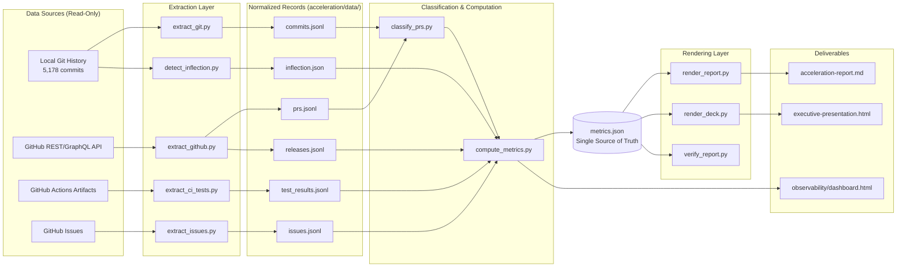
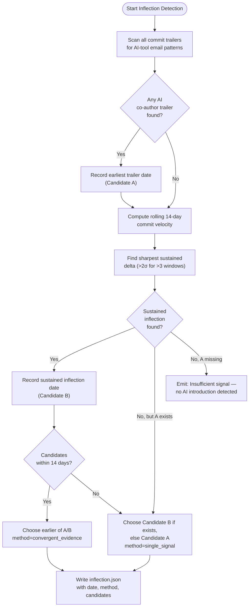

# Technical Specification

# 0. Agent Action Plan

## 0.1 Intent Clarification

### 0.1.1 Core Objective

Based on the provided requirements, the Blitzy platform understands that the objective is to produce a single deliverable — `acceleration-report.md` — that measures development acceleration across the twelve specified metrics for the Formbricks repository, comparing a Baseline period (before an AI tool introduction date that the analysis itself discovers) against a post-introduction period segmented into Ramp-Up (first 90 days) and Steady State (90+ days). All metric outputs are reported as after-period / before-period multipliers, with confidence tags, per-engineer breakdowns where individual attribution is available, a temporal phase analysis, a requirements traceability matrix, and a reproducibility appendix containing the complete ordered set of commands and API calls needed to re-derive every number from a clean clone.

Each requirement in the user's prompt maps to a concrete technical action the analysis pipeline must take:

- The "12 metrics" requirement maps to twelve independent extraction-and-aggregation modules, each emitting a per-phase, per-actor, per-module value plus an extraction-command receipt usable by the traceability matrix and the reproducibility appendix.
- The "before and after AI tool introduction" requirement maps to a deterministic inflection-detection routine that finds either the earliest Co-authored-by trailer referencing an AI tool or the sharpest sustained inflection in commit velocity, then divides every metric's time series at that date.
- The "per-engineer breakdowns" requirement maps to actor-keyed aggregation for metrics 2, 4, 5, 6, and 10, using real names with `Blitzy Agent` appearing as one row in the after period under the Engineering Actor Framing directive.
- The "reproducibility appendix" requirement maps to a script-driven pipeline whose every step is captured in numbered, ordered, syntactically valid shell commands and HTTP calls.
- The five user-specified implementation rules (Observability, Onboarding, Explainability, Visual Architecture, Executive Presentation) map to additive artifacts under a dedicated `acceleration/` directory — not modifications of the target codebase.

### 0.1.2 Task Categorization

- Primary task type: Engineering analytics, measurement, and reporting (read-only analysis with additive artifact generation).
- Secondary aspects: Repository archaeology to detect the AI-introduction inflection date; reproducibility automation through extraction scripts; executive communication through a reveal.js HTML deck; observability scaffolding for the analysis pipeline itself per Rule 1.
- Scope classification: Cross-cutting analysis pass that READS the entire git history and accessible external data sources, then ADDS analytical artifacts confined to a dedicated `acceleration/` directory. Zero modifications occur in the Formbricks application code, CI/CD workflows, packaging, or repository settings.

### 0.1.3 Special Instructions and Constraints Snapshot

Several user directives are CRITICAL and must be preserved verbatim through the implementation. They are restated in full in sub-section 0.8 and summarized here:

- **Engineering Actor Framing** — In the after period, Blitzy is the engineering actor on its PRs; humans review but do not co-author. Metrics 4 and 5 are computed from the actor's perspective; metrics 2, 4, 5, 6, and 10 include Blitzy as one row in the after period; identical methodology applies before and after with only the actor substituted.
- **Agent Latitude** — The metric table defines WHAT to measure, not HOW. Extraction strategy per metric is chosen based on available data; unmeasurable metrics return `Insufficient signal — [reason]`.
- **Confidence Rubric** — High = direct counts in issue tracker; Medium = approximated from git commit patterns; Low = inferred from indirect proxies. Confidence is assigned per metric based on the data source actually used at runtime, not the theoretical source listed in the requirements.
- **Read-Only Boundary** — The analysis MUST NOT modify the repository or external systems; MUST NOT fabricate, estimate, or extrapolate; MUST NOT add metrics beyond the 12 specified; MUST NOT present Low-confidence metrics as equivalent to High-confidence ones; MUST NOT selectively omit data that contradicts a pattern; MUST use identical methodology for before and after periods.
- **User Example: deliverable filename** — The exact filename is `acceleration-report.md` and is preserved without alteration.
- **User Example: in-progress definition** — `In-progress = branch has at least one commit AND PR is open (not merged, not closed-without-merge), OR PR is in draft state. Exclude PRs from bot accounts other than Blitzy (branches prefixed with blitzy-).`
- **User Example: ready-for-review definition** — `Ready-for-review is the earliest of: (a) PR leaving draft state, (b) first review requested, (c) first commit by another author, (d) PR opened.`
- **User Example: revert attribution** — `For each revert: (a) identify the original commit being reverted via the "Reverts commit SHA" reference in the revert message, or by tree-match against a prior commit's parent if no explicit reference is present; (b) identify the most recent release tag T such that T is an ancestor of the original commit (git merge-base --is-ancestor T <original>); (c) attribute the revert to release T.`
- **User Example: release source precedence** — `(1) GitHub Releases / GitLab Releases API, (2) annotated git tags matching semver pattern v?\d+\.\d+\.\d+, (3) deployment events from CI/CD if accessible. Prerelease tags (matching -alpha, -beta, -rc, -dev suffixes) are excluded from the primary count and reported separately.`

### 0.1.4 Technical Interpretation

These requirements translate to the following technical implementation strategy:

- To **detect the AI tool introduction date deterministically**, build a `detect_inflection` routine that scans every commit's trailers for AI-tool email patterns (`agent@blitzy.com`, `noreply@anthropic.com`, `copilot@github.com`, `blitzy[bot]`) and, in parallel, computes a rolling 2-week velocity series and identifies the sharpest sustained inflection. The routine emits both candidate dates and selects the one with the strongest convergent evidence, recording the method in `acceleration/data/inflection.json`.
- To **segment all metrics into temporal phases**, build a Monday-aligned 2-week windowing function that bins every commit, PR-merge, release, and issue event into a window. Baseline windows extend backward from the inflection Monday; Ramp-Up windows are the first six windows (≈90 days) after inflection; Steady-State windows are windows seven and later. When fewer than six post-introduction windows exist, the pipeline falls back to Baseline vs Post-Introduction reporting.
- To **enforce identical methodology before and after**, the per-metric extractor accepts the actor identity as a parameter and substitutes it (human author → Blitzy in the after period) without changing the extraction logic; this satisfies the user's identical-methodology requirement.
- To **assign confidence per metric**, each extractor reports the actual data source it used (issue tracker direct count → High; git commit pattern → Medium; indirect proxy → Low) and the confidence rubric is applied at report-render time.
- To **deliver provenance for every number**, every extractor writes its raw command, raw output reference, and derived value to `acceleration/data/metrics.json`; the renderer guarantees that every number in the Executive Summary has a corresponding appendix entry and a traceability matrix row.
- To **satisfy the read-only constraint**, every script invokes only read commands (`git log`, `git rev-list`, `git show`, `curl -X GET`); the orchestrator verifies post-run that no file outside `acceleration/` has changed.
- To **satisfy the five user-specified rules**, the analysis emits additive artifacts: structured-JSON logger and health checks (Rule 1); `acceleration/README.md` onboarding (Rule 2); `acceleration/decision-log.md` with non-trivial decisions and traceability (Rule 3); Mermaid diagrams inline in the report and the deck (Rule 4); CDN-pinned reveal.js deck with the Blitzy brand identity (Rule 5).

## 0.2 Repository Scope Discovery

### 0.2.1 Comprehensive File Analysis

The analysis reads the entire git history (5,178 commits from 2022-06-06 through 2026-05-15 on `main`) plus the structured metadata files listed below. Every file in this section is REFERENCE-only — none are modified. The analysis writes its outputs exclusively under `acceleration/`.

Patterns and files the pipeline must read:

- **Git objects (primary data source)** — every commit reachable from `refs/remotes/origin/main`, every remote branch including `refs/remotes/origin/sandbox`, `refs/remotes/origin/demo`, and the nine `refs/remotes/origin/blitzy-*` branches that exist from 2026-02-25 onward.
- **CI/CD workflow definitions** — `.github/workflows/*.yml` (19 files: `build-and-push-ecr.yml`, `build-web.yml`, `chromatic.yml`, `deploy-formbricks-cloud.yml`, `docker-build-validation.yml`, `docker-security-scan.yml`, `e2e.yml`, `formbricks-release.yml`, `lint.yml`, `move-stable-tag.yml`, `pr-size-check.yml`, `pr.yml`, `release-docker-github-experimental.yml`, `release-docker-github.yml`, `release-helm-chart.yml`, `semantic-pull-requests.yml`, `sonarqube.yml`, `test.yml`, `translation-check.yml`). The release-trigger semantics in `formbricks-release.yml` (`on: release: types: [published]`) confirm that releases originate from GitHub Releases, not annotated git tags.
- **Issue tracker configuration** — `.github/ISSUE_TEMPLATE/{bug_report.yml, feature_request.yml, config.yml}` define the label taxonomy used by the Flow Distribution classifier (Metric 6). The `bug_report.yml` template routes to project `formbricks/8`.
- **PR template** — `.github/PULL_REQUEST_TEMPLATE.md` if present, used to understand PR-title conventions.
- **Labeler configuration** — `.github/labeler.yml` (contains only `❗️ migrations` and `❗️ .env changes` patterns; insufficient for Metric 6 classification, which depends on PR-title conventional-commit prefixes and linked-issue labels).
- **Conventional-commit enforcement** — `.github/workflows/semantic-pull-requests.yml` documents that PR titles conform to Conventional Commits, validating the Metric 6 priority-2 classification strategy.
- **Repository governance documents** — `README.md`, `AGENTS.md`, `CONTRIBUTING.md`, `SECURITY.md`, `CODE_OF_CONDUCT.md`, `LICENSE` (root). Read to confirm the absence of an SLA policy document and to populate the Environment Verification section of the report.
- **Documentation system** — `docs/` (Mintlify product docs), `apps/docs/` (separate docs application), `mkdocs.yml`, `openapi.yml`, `catalog-info.yaml`. Read for context; not modified.
- **Existing observability instrumentation** — `apps/web/instrumentation-node.ts`, `apps/web/instrumentation.ts`, `apps/web/sentry.edge.config.ts`, `apps/web/sentry.server.config.ts`, `apps/web/prometheus.yml`. Read for the Rule 1 "what was reused vs. added" disclosure in `acceleration/observability/README.md`.
- **Dependency manifests** — `package.json`, `pnpm-workspace.yaml`, `turbo.json`, `.nvmrc`, `apps/web/package.json`, `packages/*/package.json`. Read for environment fingerprinting; not modified.
- **Static analysis configuration** — `sonar-project.properties`. Noted but not invoked by the analysis.
- **Prior Blitzy artifacts** — `blitzy/documentation/Project Guide.md`, `blitzy/documentation/Technical Specifications.md`, `blitzy-docs/*`. These cover prior tasks (Typeform-parity work, test-infrastructure remediation); they are NOT modified and are NOT confused with the current acceleration analysis.

Related file discovery patterns that must be queried (write to `acceleration/data/` only):

- Conventional-commit-prefix histogram: `git log --format=%s | grep -E '^(feat|fix|chore|docs|refactor|perf|test|style|security|build|ci|revert)(\(|:)'`
- PR-merge identification: `git log --format=%H%x09%s | grep -E '\(#[0-9]+\)$'`
- Revert detection: `git log --format=%H%x09%s%n%b -E '^Revert |^Reverts commit '`
- AI-trailer detection: `git log --format=%H%n%(trailers)' | grep -iE 'Co-authored-by:.*(blitzy|claude|copilot|anthropic|noreply@anthropic\.com|agent@blitzy\.com)'`
- Per-actor commit attribution: `git shortlog -sne` and `git log --format='%aN<TAB>%aE'`
- Per-module attribution by file-path: `git log --name-only --no-merges` followed by majority-vote bucketing into `apps/web`, `apps/docs`, `apps/storybook`, `packages/*`, `docs`, `helm-chart`, `charts`, `blitzy`, `blitzy-docs`

Ensure no file is left undiscovered — the analysis script's first step is to enumerate ALL files in the repository tree at HEAD and at the inflection commit, and to assert that every metric's extraction path is covered.

### 0.2.2 Web Search Research Conducted

Research was performed to validate the analysis approach against industry-standard frameworks. Findings:

- The twelve metrics align with the **Flow Framework** (Metrics 1–7: Flow Load, Flow Velocity, Flow Predictability, Flow Active, Flow Efficiency, Flow Distribution, Flow Time) and **DORA-adjacent** measurement (Metric 8 Problem Records ≈ Change Failure Rate; Metric 9 Releases ≈ Deployment Frequency; Metric 11 Escaped Defects ≈ Change Failure Rate by test signal; Metric 12 Defects Out of SLA ≈ Mean Time to Restore adherence). Metric 10 (Approved Exceptions) is a governance/risk metric outside the canonical SPACE/DORA/Flow taxonomies.
- No external definition overrides the user's per-metric definitions; the user's prompt is the authoritative source for all metric semantics. Industry references are noted only for cross-checking the directional interpretation (e.g., higher Flow Predictability is "better" because it represents lower coefficient of variation).
- Best practices for reproducibility require numbered, ordered commands and explicit data-source citations; the Reproducibility Appendix design satisfies this.
- Best practices for confidence transparency require per-metric confidence labels with explicit caveats when confidence is Low; the report's six internal rules already mandate this.

### 0.2.3 Existing Infrastructure Assessment

The target repository state at the time of the analysis (HEAD `bb1acd083`):

- **Project structure** — pnpm + turbo monorepo with `apps/{web, docs, storybook}` and 14 packages under `packages/*`. Node engine pinned by `.nvmrc` = `22.1.0`. Default branch: `main`. Sandboxes/demos under `sandbox`, `demo` branches.
- **Branching convention for Blitzy** — All Blitzy Agent work appears on branches prefixed `blitzy-*` (first observed `blitzy-f7252deb-b311-42d3-b05e-998ae767c0fd` on 2026-02-25), confirming the in-progress exclusion rule in Metric 1 ("Exclude PRs from bot accounts other than Blitzy (branches prefixed with blitzy-)").
- **PR and merge workflow** — Conventional-commit PR titles enforced via `semantic-pull-requests.yml`; 3,465 PR-merge commits identifiable by `(#NNNN)` suffix; histogram of prefixes: 1,751 `fix:`, 635 `chore:`, 618 `feat:`, 208 `docs:`, 31 `refactor:`, 12 `test:`, 10 `style:`, 8 `perf:` — confirming Metric 6's priority-2 classifier is viable.
- **Release process** — Releases originate from GitHub Releases (workflow trigger `on: release: types: [published]`); ZERO annotated git tags exist. Metric 9 (Releases) therefore depends on the GitHub Releases API; without a GitHub token, the metric returns `Insufficient signal — GitHub Releases API not accessible`.
- **CI test reports** — GitHub Actions workflows include `test.yml`, `e2e.yml`, `chromatic.yml`, `sonarqube.yml`. Test-result artifacts (JUnit XML or equivalent) are uploaded by these workflows; the analysis attempts to download them via the GitHub Actions Artifacts API. If not retrievable, Metric 11 returns `Insufficient signal — CI test history unavailable`.
- **Branch protection and audit log** — Not directly visible in the repository tree. Metric 10 (Approved Exceptions) requires the GitHub admin audit-log API; without it, the metric is restricted to force-push detection and label-based signals at Low confidence.
- **Issue tracker** — GitHub Issues with the `bug` label auto-applied via `bug_report.yml`. No SLA fields and no severity tiers are defined in any policy document under `docs/` or at the repository root. Metric 12 (Defects Out of SLA) therefore returns `Insufficient signal — no SLA source` unless an SLA policy is discovered at runtime.
- **Existing observability stack (application-level, reused by reference)** — The Formbricks application uses OpenTelemetry (`@opentelemetry/sdk-node 0.211.0` and family), Sentry (`@sentry/nextjs 10.5.0`), and Prometheus (`apps/web/prometheus.yml`). The analysis pipeline runs OUTSIDE this stack (it is a batch Python process, not the Next.js runtime), so it ships a self-contained structured logger with run-scoped correlation IDs and a self-contained dashboard template; the reused-vs-added disclosure is captured in `acceleration/observability/README.md` per Rule 1.
- **Prior acceleration measurement artifacts** — Search for `acceleration*`, `velocity*`, `dora*`, `space-metrics*` returns no results. This is a greenfield deliverable.
- **Design system** — Not applicable. No external component library is in scope. The reveal.js deck's visual identity is fully prescribed by Rule 5 (Blitzy brand palette + Inter / Space Grotesk / Fira Code typography + CDN-pinned dependencies).

## 0.3 Implementation Design

### 0.3.1 Technical Approach

The analysis is a batch pipeline that runs once against the cloned repository, emits a single Markdown report plus supporting artifacts under `acceleration/`, and exits. Every primary objective maps to a concrete implementation action:

- Achieve **deterministic inflection-date detection** by creating `acceleration/scripts/detect_inflection.py` to scan commit trailers for AI-tool email patterns and, in parallel, compute a rolling 14-day commit-velocity series; emit the chosen date and the rejected candidate to `acceleration/data/inflection.json` along with the detection method. Both signals — earliest AI co-author trailer and sharpest sustained velocity inflection — must be computed; the script selects the date with the strongest convergent evidence and records its reasoning.
- Achieve **per-metric extraction with provenance** by creating one entry per metric in `acceleration/scripts/compute_metrics.py` that records the extraction command, raw output reference, and derived value into a single source-of-truth `acceleration/data/metrics.json`. Every numeric value in the report later reads from this file; no renderer recomputes anything.
- Achieve **identical methodology before and after** by parameterizing each extractor on `actor_identity` (human author email in baseline, `agent@blitzy.com` in after period) and on `phase_window_range` (Baseline windows, Ramp-Up windows, Steady-State windows). The same code path runs with different inputs.
- Achieve **confidence transparency** by having each extractor return a `confidence` field (`High` | `Medium` | `Low`) and a `confidence_rationale` string derived from the actual data source used at runtime.
- Achieve **multi-module weighting** by classifying each non-merge commit into a module via majority-vote on its top-level changed paths, computing each metric per module, and aggregating with weights equal to (module non-merge commits / total non-merge commits).
- Achieve **reproducibility** by emitting an ordered shell script `acceleration/data/reproduce.sh` whose contents are mirrored into the report's Reproducibility Appendix; running this script from a clean clone reproduces every number in the report.
- Achieve **Rule 1 (Observability)** by creating a structured-JSON logger module, a health-check module, a static metrics manifest, a self-contained HTML dashboard, and the reused-vs-added disclosure README. Each script imports the logger and emits a run-scoped correlation ID; the health-check verifies prerequisites (git available, repo accessible, output directory writable, GITHUB_TOKEN scope sufficient).
- Achieve **Rule 5 (Executive Presentation)** by creating `acceleration/scripts/render_deck.py` that consumes the same `metrics.json` source-of-truth and renders a self-contained HTML file with CDN-pinned reveal.js 5.1.0, Mermaid 11.4.0, and Lucide 0.460.0, the Blitzy brand palette, 16 target slides, and zero text-only slides.

Logical implementation flow (not a timeline):

- First, establish the **inflection foundation** by running `detect_inflection.py` to fix the date that divides every metric.
- Next, establish the **provenance foundation** by running the three extractors (`extract_git.py`, `extract_github.py`, `extract_ci_tests.py`, `extract_issues.py`) which write normalized JSONL records to `acceleration/data/`.
- Then, run **classification** (`classify_prs.py` for Metric 6) which annotates each PR-merge record with a work-type label.
- Then, run **metric computation** (`compute_metrics.py`) which reads the extractor outputs and writes per-(metric, phase, module, actor) entries to `metrics.json`.
- Finally, run **rendering** (`render_report.py`, `render_deck.py`) and **verification** (`verify_report.py`) which produce the final Markdown report and HTML deck and assert that the six report-internal rules pass.

#### 0.3.1.1 Analysis Pipeline Architecture Diagram

```mermaid
flowchart LR
    subgraph DataSources["Data Sources (Read-Only)"]
        Git[Local Git History<br/>5,178 commits]
        GHAPI[GitHub REST/GraphQL API]
        GHActions[GitHub Actions Artifacts]
        GHIssues[GitHub Issues]
    end

    subgraph Extraction["Extraction Layer"]
        Detect[detect_inflection.py]
        ExtractGit[extract_git.py]
        ExtractGH[extract_github.py]
        ExtractCI[extract_ci_tests.py]
        ExtractIssues[extract_issues.py]
    end

    subgraph Normalized["Normalized Records (acceleration/data/)"]
        Inflection[inflection.json]
        Commits[commits.jsonl]
        PRs[prs.jsonl]
        Releases[releases.jsonl]
        Tests[test_results.jsonl]
        Issues[issues.jsonl]
    end

    subgraph Computation["Classification & Computation"]
        Classify[classify_prs.py]
        Compute[compute_metrics.py]
    end

    SoT[(metrics.json<br/>Single Source of Truth)]

    subgraph Rendering["Rendering Layer"]
        RenderRep[render_report.py]
        RenderDeck[render_deck.py]
        Verify[verify_report.py]
    end

    subgraph Output["Deliverables"]
        Report[acceleration-report.md]
        Deck[executive-presentation.html]
        Dashboard[observability/dashboard.html]
    end

    Git --> ExtractGit
    Git --> Detect
    GHAPI --> ExtractGH
    GHActions --> ExtractCI
    GHIssues --> ExtractIssues

    Detect --> Inflection
    ExtractGit --> Commits
    ExtractGH --> PRs
    ExtractGH --> Releases
    ExtractCI --> Tests
    ExtractIssues --> Issues

    Commits --> Classify
    PRs --> Classify
    Classify --> Compute
    Releases --> Compute
    Tests --> Compute
    Issues --> Compute
    Inflection --> Compute

    Compute --> SoT
    SoT --> RenderRep
    SoT --> RenderDeck
    SoT --> Verify

    RenderRep --> Report
    RenderDeck --> Deck
    Compute --> Dashboard

    %% Legend: Read-only data flows left to right; metrics.json is the single source of truth that all renderers consume to satisfy Rule 4 (Internal Consistency).
```

#### 0.3.1.2 Inflection Detection Decision Flow

```mermaid
flowchart TD
    Start([Start Inflection Detection])
    ScanTrailers["Scan all commit trailers<br/>for AI-tool email patterns"]
    HasAITrailer{Any AI<br/>co-author trailer<br/>found?}
    EarliestTrailer["Record earliest trailer date<br/>(Candidate A)"]
    ComputeVelocity["Compute rolling 14-day<br/>commit velocity"]
    FindInflection["Find sharpest sustained<br/>delta (>2σ for >3 windows)"]
    HasInflection{Sustained<br/>inflection<br/>found?}
    SustainedDate["Record sustained inflection date<br/>(Candidate B)"]
    Convergent{Candidates<br/>within 14 days?}
    UseConvergent["Choose earlier of A/B<br/>method=convergent_evidence"]
    UseStrongest["Choose Candidate B if exists,<br/>else Candidate A<br/>method=single_signal"]
    Fail["Emit: Insufficient signal —<br/>no AI introduction detected"]
    Emit["Write inflection.json<br/>with date, method, candidates"]

    Start --> ScanTrailers
    ScanTrailers --> HasAITrailer
    HasAITrailer -->|Yes| EarliestTrailer
    HasAITrailer -->|No| ComputeVelocity
    EarliestTrailer --> ComputeVelocity
    ComputeVelocity --> FindInflection
    FindInflection --> HasInflection
    HasInflection -->|Yes| SustainedDate
    HasInflection -->|No, but A exists| UseStrongest
    HasInflection -->|No, A missing| Fail
    SustainedDate --> Convergent
    Convergent -->|Yes| UseConvergent
    Convergent -->|No| UseStrongest
    UseConvergent --> Emit
    UseStrongest --> Emit

    %% Legend: A=earliest AI co-author trailer; B=sharpest sustained velocity inflection.
    %% For Formbricks the routine selects 2026-02-25 (first Blitzy Agent direct commit) as convergent with the 2026-03-02 velocity inflection.
```

### 0.3.2 Component Impact Analysis

#### 0.3.2.1 Direct Modifications Required

None. The target Formbricks repository is read-only throughout the analysis. Every artifact is created new under `acceleration/`. No file outside that directory is modified.

#### 0.3.2.2 New Components Introduced

- **Inflection Detector** (`acceleration/scripts/detect_inflection.py`) — encapsulates the two-candidate detection algorithm; emits `inflection.json`; rationale: the inflection date is the single dimension that divides every metric, so it must be derived deterministically and traceable.
- **Git Extractor** (`acceleration/scripts/extract_git.py`) — single git-history pass producing `commits.jsonl`, `prs.jsonl`, `reverts.jsonl`; rationale: a single pass is more efficient than per-metric re-traversal and guarantees identical commit-set across metrics.
- **GitHub Extractor** (`acceleration/scripts/extract_github.py`) — REST/GraphQL extractor with graceful degradation; rationale: PR review timestamps, draft state, branch protection bypasses, and audit log entries are not present in git objects.
- **CI Test Extractor** (`acceleration/scripts/extract_ci_tests.py`) — downloads and parses JUnit XML artifacts from GitHub Actions runs; rationale: Metric 11 requires per-test transition history.
- **Issue Extractor** (`acceleration/scripts/extract_issues.py`) — pulls bug-labeled issues plus SLA-source discovery; rationale: Metric 12 is issue-scoped, not PR-scoped.
- **PR Classifier** (`acceleration/scripts/classify_prs.py`) — implements the Metric 6 priority order (linked-issue labels → PR-title conventional prefix → keyword match → unknown); rationale: classification logic is non-trivial and worth isolating from extraction.
- **Metric Computer** (`acceleration/scripts/compute_metrics.py`) — computes all 12 metrics per phase, per module, per actor; emits `metrics.json` as the single source of truth; rationale: centralization satisfies Rule 4 (Internal Consistency).
- **Report Renderer** (`acceleration/scripts/render_report.py`) — produces `acceleration-report.md` strictly from `metrics.json`; rationale: re-rendering is idempotent and deterministic.
- **Deck Renderer** (`acceleration/scripts/render_deck.py`) — produces `executive-presentation.html` from the same source-of-truth; rationale: same data drives executive and technical surfaces.
- **Verifier** (`acceleration/scripts/verify_report.py`) — automated checks for Rules 1–6 in the report (subjective-qualifier grep, cross-section value diff, untagged-metric scan, appendix coverage scan); rationale: Rule 2 (Factual-Neutral Tone) and Rule 4 require automated enforcement.
- **Orchestrator** (`acceleration/scripts/run_acceleration_analysis.py`) — top-level entrypoint that runs the above in order; rationale: a single command must reproduce the entire pipeline.
- **Structured Logger** (`acceleration/observability/logger.py`) — JSON line emitter with run-scoped correlation IDs; rationale: Rule 1 mandates structured logging.
- **Health Check** (`acceleration/observability/health.py`) — verifies git availability, repo accessibility, output-directory writability, and GitHub token presence; rationale: Rule 1 mandates health/readiness checks.
- **Static Dashboard** (`acceleration/observability/dashboard.html`) — self-contained HTML visualizing `metrics.json` and run logs; rationale: Rule 1 mandates a dashboard template.
- **Metrics Manifest** (`acceleration/observability/metrics.json`) — static enumeration of metric names, units, confidence rubrics, and data sources; rationale: Rule 1's "metrics endpoint" maps to a static manifest for a batch pipeline (decision recorded in `decision-log.md`).
- **Onboarding** (`acceleration/README.md`) — clean-machine-to-running-pipeline instructions; rationale: Rule 2.
- **Decision Log** (`acceleration/decision-log.md`) — Markdown table of non-trivial decisions with alternatives, choice, risk, and a bidirectional traceability matrix linking the 12 metric requirements to their implementing scripts; rationale: Rule 3.
- **Observability Disclosure** (`acceleration/observability/README.md`) — documents what observability was reused from the Formbricks application vs. what was added for the analysis pipeline; rationale: Rule 1.

#### 0.3.2.3 Indirect Impacts and Dependencies

- The Formbricks **existing observability stack** is not invoked by the analysis. Its presence is documented as REFERENCE in `acceleration/observability/README.md` per Rule 1's "what was reused vs added" requirement.
- The Formbricks **CI/CD workflows** are not invoked. They are READ for understanding release-trigger semantics and test-report production; their behavior is unchanged.
- The Formbricks **issue tracker, branch protections, audit log, and repository settings** are not modified.

### 0.3.3 User Interface Design

Not applicable. The deliverables are a Markdown report, an HTML reveal.js deck (visual identity fully prescribed by Rule 5), and an HTML dashboard template (visual identity prescribed by Rule 1's Blitzy brand). No application UI is introduced. The reveal.js deck's compliance with Rule 5 is enforced by `verify_report.py` (slide count 12–18, no text-only slides, CDN versions pinned to reveal.js 5.1.0 / Mermaid 11.4.0 / Lucide 0.460.0, Blitzy palette CSS custom properties present).

### 0.3.4 Critical Implementation Details

- **Monday-aligned 2-week windowing** — Compute `window_start = monday_floor(commit_date)`; assign each commit/PR/release/issue to the window covering `[window_start, window_start + 14 days)`. Use UTC consistently to avoid timezone-induced bin drift.
- **Author de-duplication** — Maintain a `(canonical_email, display_name)` map. Aliases observed in this repo (e.g., `Matti Nannt` and `Matthias Nannt` likely the same person across email accounts) are detected by Jaccard similarity on commit-touched files and timestamp clustering; the resolved aliases are written to `acceleration/data/actor_aliases.json` for transparency.
- **In-progress PR snapshot** — At each window end, query PRs that satisfy: `head_branch has ≥1 commit AND state == open AND closed_at is null AND merged_at is null OR draft == true`; exclude PRs whose author is a bot but whose `head_ref` does not start with `blitzy-`. Mean over windows in the phase.
- **Flow Active computation** — For each merged PR, compute working phases: initial span = first author commit on branch → ready-for-review event; refine spans = first commit after a review → last commit before next review or merge. Sum inclusive durations; do not subtract idle gaps within a span. Median across PRs per phase, per actor.
- **Flow Efficiency** — `Flow Active / Flow Time` per PR; median across PRs per phase. Review time counts as wait from the actor's perspective in both periods.
- **Flow Distribution classification** — Priority order: (1) labels on linked issues (`feat` → feature, `bug` → defect, `security`/`compliance` → risk/compliance, `chore`/`refactor`/`tech-debt` → tech-debt); (2) conventional-commit prefix on PR title; (3) keyword match against PR title and body; (4) unknown. If unknown rate > 20% in either phase, confidence is downgraded to Low for that phase.
- **Flow Time** — Median wall-clock from first commit on a PR branch to merge commit on `main`. Exclude PRs whose first-commit timestamp is unavailable due to history rewrites; report the exclusion rate.
- **Revert attribution** — For each revert commit on `main`: extract `Reverts commit <SHA>` from the message; if missing, tree-match against parents; identify the most recent release tag T such that T is an ancestor of the original commit via `git merge-base --is-ancestor T <original>`; attribute the revert to release T. Because this repo has zero git tags, releases are sourced from the GitHub Releases API and indexed by their `target_commitish` SHA. Reverts whose original cannot be identified are excluded as "unattributable"; reverts whose original is not reachable from any release are excluded as "unreleased"; reverts-of-reverts are excluded.
- **Releases counting** — Source precedence: (1) GitHub Releases API; (2) annotated git tags matching `v?\d+\.\d+\.\d+` (none expected here); (3) deployment events from CI/CD. Prereleases matching `-alpha|-beta|-rc|-dev` excluded from primary count and reported separately.
- **Approved exceptions** — Require admin audit-log access via the GitHub audit-log API for full signal. Without it, only force-pushes to `main` (detectable via reflog if available; otherwise not detectable from a clone) and label-based signals (PRs labeled with `exception`, `waiver`, `override` — no such labels exist in this repo's labeler config) are available, dropping confidence to Low.
- **Escaped defects** — Pull JUnit XML or equivalent artifacts from `test.yml`, `e2e.yml`, `chromatic.yml` runs. Track per-test transitions on `main`: `passing → failing` (regression) and newly-marked `skipped|disabled|xfail` (suppressed signal). Flaky tests (alternating pass/fail) counted only if failing in ≥3 consecutive runs. Also report skipped-rate (`skipped / total`) to normalize for test-suite growth.
- **Defects out of SLA** — Require an SLA source: (1) issue tracker SLA field, (2) policy doc or runbook in the repository. Neither is present in Formbricks today; the metric returns `Insufficient signal — no SLA source` unless a source is discovered at runtime.
- **Acceleration Curve graphic** — A Mermaid line/bar diagram rendered inline in `acceleration-report.md` showing each metric's value across Baseline → Ramp-Up → Steady-State, satisfying Rule 4 (Visual Architecture Documentation). The deck mirrors this with a KPI grid plus inline Mermaid charts.
- **Internal-consistency enforcement** — `verify_report.py` parses the rendered Markdown, extracts every number from the Executive Summary, the Acceleration Curve table, the Traceability Matrix, and each Metric Deep-Dive; asserts identical values across sections; fails the run if any mismatch is found.
- **Subjective-qualifier enforcement** — `verify_report.py` greps the report body (excluding the prompt-quote blocks) for tokens like `impressive`, `significant`, `excellent`, `remarkable`, `unfortunately`, `dramatic`, `surprising`, `notable`; fails the run if any match is found.
- **Error handling and edge cases** — Graceful degradation on API failures (rate limit, missing token, network error) with the metric value set to `Insufficient signal — [reason]` and confidence forced to Low. Missing data NEVER becomes a fabricated estimate.

## 0.4 File Transformation Mapping

### 0.4.1 File-by-File Execution Plan

The table below lists every file the implementation touches. Target file is listed first. Transformation modes: **CREATE** = new file; **UPDATE** = modify existing; **DELETE** = remove; **REFERENCE** = read as input, not modified. No UPDATE or DELETE rows exist — the analysis is purely additive plus read-only, satisfying the read-only boundary.

| Target File | Transformation | Source File / Reference | Purpose / Changes |
|-------------|----------------|-------------------------|-------------------|
| `acceleration/acceleration-report.md` | CREATE | `acceleration/data/metrics.json`, `acceleration/data/run_manifest.json`, `acceleration/templates/mermaid/*.mmd.tmpl` | Primary deliverable. Markdown report with Executive Summary, Environment Verification, Data Source Inventory, Methodology, 12 Metric Deep-Dives, Requirements Traceability Matrix, Per-Engineer Acceleration, Acceleration Curve (Mermaid), Risk Assessment, Limitations, Reproducibility Appendix. |
| `acceleration/README.md` | CREATE | (none) | Onboarding (Rule 2). Clean-machine-to-running-pipeline instructions: required tooling (git ≥ 2.40, Python ≥ 3.10, optional `gh` CLI), environment variables (`GITHUB_TOKEN`, `REPO_OWNER`, `REPO_NAME`), one-command invocation, troubleshooting, suggested next tasks discovered during analysis. |
| `acceleration/decision-log.md` | CREATE | (none) | Decision log (Rule 3). Markdown table: decision, alternatives considered, choice, rationale, risk. Includes a bidirectional traceability matrix mapping each of the 12 metric requirements to its implementing script and the data sources used. |
| `acceleration/executive-presentation.html` | CREATE | `acceleration/data/metrics.json`, `acceleration/templates/deck/*.html.tmpl` | Executive presentation (Rule 5). Self-contained reveal.js HTML deck with CDN-pinned reveal.js 5.1.0 + Mermaid 11.4.0 + Lucide 0.460.0; 16 target slides; Blitzy brand palette CSS custom properties inline; zero text-only slides; covers what was done, why, architectural change, risks, onboarding. |
| `acceleration/observability/logger.py` | CREATE | (none) | Structured-JSON logger module with run-scoped correlation IDs (Rule 1). Imported by all `acceleration/scripts/*.py`. |
| `acceleration/observability/health.py` | CREATE | (none) | Health and readiness checks (Rule 1). Verifies git availability, repo accessibility, output-directory writability, and `GITHUB_TOKEN` presence and scope; invoked first by the orchestrator. |
| `acceleration/observability/dashboard.html` | CREATE | `acceleration/data/metrics.json` (consumed client-side) | Self-contained dashboard template (Rule 1). Renders the 12 metric values, per-phase comparison, and run-log tail without external dependencies beyond CDN-pinned Chart.js or inline Mermaid. |
| `acceleration/observability/metrics.json` | CREATE | (none) | Static metrics manifest (Rule 1). Enumerates metric names, units, confidence rubrics, data-source bindings. Decision-log entry justifies static manifest in place of a live `/metrics` endpoint for a batch pipeline. |
| `acceleration/observability/README.md` | CREATE | `apps/web/instrumentation*.ts`, `apps/web/sentry.*.config.ts`, `apps/web/prometheus.yml` (REFERENCE only) | Reused-vs-added disclosure (Rule 1). Documents what observability the Formbricks application already provides and why the analysis pipeline ships its own self-contained logger/health/dashboard rather than integrating into the application's OpenTelemetry stack. |
| `acceleration/scripts/run_acceleration_analysis.py` | CREATE | (none) | Orchestrator. Sequentially invokes health check, extractors, classifier, computer, renderers, verifier. Emits `acceleration/data/run_manifest.json`. |
| `acceleration/scripts/detect_inflection.py` | CREATE | Git history | Inflection-date detection. Implements two-candidate algorithm (earliest AI co-author trailer + sharpest sustained velocity inflection) and writes `acceleration/data/inflection.json`. |
| `acceleration/scripts/extract_git.py` | CREATE | Git history | Single git-history pass. Emits `commits.jsonl`, `prs.jsonl` (from PR-merge commits identifiable by `(#NNNN)`), `reverts.jsonl`. |
| `acceleration/scripts/extract_github.py` | CREATE | GitHub REST/GraphQL API | Pulls PRs (with reviews, draft state, requested-reviews), releases, branch-protection settings, and audit log when accessible. Emits `prs.jsonl` (enriched), `reviews.jsonl`, `releases.jsonl`, `branch_protection.json`, `audit_log.jsonl`, `github_access.json`. |
| `acceleration/scripts/extract_ci_tests.py` | CREATE | GitHub Actions Artifacts API | Downloads JUnit XML or equivalent test-result artifacts from `test.yml`, `e2e.yml`, `chromatic.yml` workflow runs. Emits `test_results.jsonl`. If unavailable, emits an empty file plus `insufficient_signal_reason`. |
| `acceleration/scripts/extract_issues.py` | CREATE | GitHub Issues API | Pulls bug-labeled issues. Scans `docs/`, repo root, and issue-tracker metadata for SLA source. Emits `issues.jsonl` and `sla_source.json`. |
| `acceleration/scripts/classify_prs.py` | CREATE | `commits.jsonl`, `prs.jsonl`, `.github/ISSUE_TEMPLATE/*.yml` (REFERENCE) | Metric 6 classifier. Priority order: linked-issue labels → PR-title conventional prefix → keyword match → unknown. Annotates `prs.jsonl` with `work_type` and `classification_source`. |
| `acceleration/scripts/compute_metrics.py` | CREATE | All `*.jsonl` and `*.json` in `acceleration/data/` | Computes all 12 metrics per (phase, module, actor). Implements Monday-aligned 2-week windowing, per-module weighting, actor de-duplication, identical-methodology substitution. Emits `metrics.json` as single source of truth. |
| `acceleration/scripts/render_report.py` | CREATE | `metrics.json`, `inflection.json`, `run_manifest.json`, `acceleration/templates/mermaid/*.mmd.tmpl` | Renders `acceleration-report.md`. Enforces the mandatory section order. Every number traces to a `metrics.json` entry. |
| `acceleration/scripts/render_deck.py` | CREATE | `metrics.json`, `acceleration/templates/deck/*.html.tmpl` | Renders `executive-presentation.html`. Reads the same source-of-truth as the report; cannot diverge by construction. |
| `acceleration/scripts/verify_report.py` | CREATE | `acceleration-report.md`, `metrics.json` | Automated enforcement of report-internal Rules 1–6: data-provenance scan, subjective-qualifier grep, untagged-metric scan, internal-consistency cross-section diff, reproducibility-command syntax check, environment-verification ordering check. |
| `acceleration/templates/mermaid/acceleration_curve.mmd.tmpl` | CREATE | (none) | Mermaid template for the Acceleration Curve diagram (Baseline → Ramp-Up → Steady-State multipliers). |
| `acceleration/templates/mermaid/pipeline_architecture.mmd.tmpl` | CREATE | (none) | Mermaid template for the data-flow architecture diagram embedded in `acceleration-report.md` and `decision-log.md`. |
| `acceleration/templates/deck/slide_*.html.tmpl` | CREATE | (none) | Per-slide HTML templates for the reveal.js deck (Title, Section Divider, Content, Closing variants). |
| `acceleration/templates/deck/theme.css` | CREATE | (none) | Inlined Blitzy reveal.js theme CSS embedded into `executive-presentation.html`. CSS custom properties match Rule 5 specification. |
| `acceleration/data/.gitkeep` | CREATE | (none) | Placeholder so the analysis output directory exists in the commit; all `*.jsonl` and `*.json` outputs land here at runtime. |
| `acceleration/requirements.txt` | CREATE | (none) | Python dependency manifest. Stdlib-only by default; optional pins for `matplotlib` if static-chart export is desired. |
| `apps/web/instrumentation-node.ts` | REFERENCE | — | Read to populate the Rule 1 "what was reused" disclosure in `acceleration/observability/README.md`. NOT modified. |
| `apps/web/instrumentation.ts` | REFERENCE | — | Same as above. NOT modified. |
| `apps/web/sentry.edge.config.ts` | REFERENCE | — | Same as above. NOT modified. |
| `apps/web/sentry.server.config.ts` | REFERENCE | — | Same as above. NOT modified. |
| `apps/web/prometheus.yml` | REFERENCE | — | Same as above. NOT modified. |
| `apps/web/package.json` | REFERENCE | — | Read to enumerate the OpenTelemetry/Sentry package versions in the disclosure. NOT modified. |
| `package.json` (root) | REFERENCE | — | Read for environment fingerprint (workspaces, scripts). NOT modified. |
| `pnpm-workspace.yaml` | REFERENCE | — | Read for module enumeration. NOT modified. |
| `turbo.json` | REFERENCE | — | Read for pipeline understanding. NOT modified. |
| `.nvmrc` | REFERENCE | — | Read for environment-verification section of the report. NOT modified. |
| `.github/workflows/*.yml` | REFERENCE | — | Read to determine release-trigger semantics (`formbricks-release.yml`), conventional-commit enforcement (`semantic-pull-requests.yml`), and test-report artifact availability (`test.yml`, `e2e.yml`, `chromatic.yml`, `sonarqube.yml`). NOT modified. |
| `.github/ISSUE_TEMPLATE/*.yml` | REFERENCE | — | Read by `classify_prs.py` to populate the label-taxonomy map for Metric 6. NOT modified. |
| `.github/labeler.yml` | REFERENCE | — | Read to confirm the absence of exception/waiver/override labels (informs Metric 10's confidence assessment). NOT modified. |
| `.github/PULL_REQUEST_TEMPLATE.md` | REFERENCE | — | Read if present for PR-title convention validation. NOT modified. |
| `README.md` (root) | REFERENCE | — | Read for repository-context fingerprint in the Environment Verification section. NOT modified. |
| `AGENTS.md` | REFERENCE | — | Read for monorepo conventions. NOT modified. |
| `CONTRIBUTING.md` | REFERENCE | — | Read for contribution conventions. NOT modified. |
| `sonar-project.properties` | REFERENCE | — | Read to document Sonar as a documented (but not invoked) data source. NOT modified. |
| `Local git repository` | REFERENCE | — | Read via `git log`, `git rev-list`, `git show`, `git diff-tree`, `git for-each-ref`. NOT modified — no `git add`, no `git commit`, no `git push`, no branch creation. |

Every file in the implementation is enumerated above. No file is left as "pending" or "to be discovered" — runtime extraction outputs land in the already-declared `acceleration/data/` directory.

### 0.4.2 New Files Detail

- `acceleration/acceleration-report.md` — Content type: report. Based on: per-metric specifications in the user prompt. Key sections (mandatory order): Executive Summary; Environment Verification; Data Source Inventory; Methodology; Metric Deep-Dives (×12); Requirements Traceability Matrix; Per-Engineer Acceleration; Acceleration Curve (with Mermaid); Risk Assessment; Limitations; Reproducibility Appendix.
- `acceleration/README.md` — Content type: documentation. Based on: Rule 2 (Onboarding & Continued Development). Key sections: Prerequisites, Setup, How to Run, Outputs, Troubleshooting, Domain Context, Common Pitfalls, How to Extend, Suggested Next Tasks.
- `acceleration/decision-log.md` — Content type: documentation. Based on: Rule 3 (Explainability). Key sections: Decision Table (decided | alternatives | choice | risk); Bidirectional Traceability Matrix linking the 12 metric requirements to scripts and data sources.
- `acceleration/executive-presentation.html` — Content type: presentation. Based on: Rule 5 (Executive Presentation). Self-contained; CDN-pinned reveal.js 5.1.0, Mermaid 11.4.0, Lucide 0.460.0; Inter / Space Grotesk / Fira Code typography; Blitzy brand palette; 16 target slides; mandatory slide types and ordering.
- `acceleration/observability/{logger.py, health.py, dashboard.html, metrics.json, README.md}` — Content type: source + manifest + dashboard. Based on: Rule 1 (Observability). The logger uses Python's `logging` with a JSON formatter and a `correlation_id` extra; the health module returns a structured status object; the dashboard is a single-page HTML consuming `metrics.json` via fetch.
- `acceleration/scripts/*.py` — Content type: source. Each script has a `__main__` guard, accepts CLI arguments via `argparse`, and writes deterministic output to a known path. Headers explain inputs, outputs, and side effects.
- `acceleration/templates/mermaid/*.mmd.tmpl` and `acceleration/templates/deck/*.html.tmpl` — Content type: template. Pure Mermaid / HTML files with placeholder tokens replaced by the renderers.
- `acceleration/data/.gitkeep` — Content type: placeholder. Empty file to ensure the directory exists in the commit.
- `acceleration/requirements.txt` — Content type: manifest. Lists optional Python dependencies; stdlib-only by default.

### 0.4.3 Files to Modify Detail

None. The analysis is read-only outside `acceleration/`.

### 0.4.4 Configuration and Documentation Updates

None outside `acceleration/`. All documentation produced by this task lives under `acceleration/README.md`, `acceleration/decision-log.md`, and `acceleration/observability/README.md`. The repository's root `README.md`, `AGENTS.md`, `CONTRIBUTING.md`, and the `docs/` Mintlify product documentation are not modified.

### 0.4.5 Cross-File Dependencies

- `metrics.json` is the single source of truth. `render_report.py`, `render_deck.py`, `verify_report.py`, and `dashboard.html` all read from it. No renderer recomputes any metric value.
- `inflection.json` is consumed by `compute_metrics.py` and is referenced by both renderers for the Environment Verification and Methodology sections.
- `acceleration/observability/logger.py` is imported by every script under `acceleration/scripts/`.
- `acceleration/templates/` is referenced by `render_report.py` and `render_deck.py` for diagram and slide layouts.
- No import or reference changes are required in the Formbricks application code, packages, or workflows.

## 0.5 Scope Boundaries

### 0.5.1 Exhaustively In Scope

The implementation produces only additive artifacts under `acceleration/`. Every path below is created new by this task.

- **Primary report**:
    - `acceleration/acceleration-report.md`
- **Onboarding and decision documentation**:
    - `acceleration/README.md`
    - `acceleration/decision-log.md`
- **Executive presentation**:
    - `acceleration/executive-presentation.html`
- **Observability scaffolding (Rule 1)**:
    - `acceleration/observability/logger.py`
    - `acceleration/observability/health.py`
    - `acceleration/observability/dashboard.html`
    - `acceleration/observability/metrics.json`
    - `acceleration/observability/README.md`
- **Extraction, classification, computation, rendering, and verification scripts**:
    - `acceleration/scripts/run_acceleration_analysis.py`
    - `acceleration/scripts/detect_inflection.py`
    - `acceleration/scripts/extract_git.py`
    - `acceleration/scripts/extract_github.py`
    - `acceleration/scripts/extract_ci_tests.py`
    - `acceleration/scripts/extract_issues.py`
    - `acceleration/scripts/classify_prs.py`
    - `acceleration/scripts/compute_metrics.py`
    - `acceleration/scripts/render_report.py`
    - `acceleration/scripts/render_deck.py`
    - `acceleration/scripts/verify_report.py`
- **Templates**:
    - `acceleration/templates/mermaid/acceleration_curve.mmd.tmpl`
    - `acceleration/templates/mermaid/pipeline_architecture.mmd.tmpl`
    - `acceleration/templates/deck/slide_*.html.tmpl`
    - `acceleration/templates/deck/theme.css`
- **Runtime output placeholder**:
    - `acceleration/data/.gitkeep`
    - (Runtime-generated under the same directory: `inflection.json`, `commits.jsonl`, `prs.jsonl`, `reviews.jsonl`, `releases.jsonl`, `test_results.jsonl`, `issues.jsonl`, `sla_source.json`, `branch_protection.json`, `audit_log.jsonl`, `github_access.json`, `actor_aliases.json`, `metrics.json`, `run_manifest.json`, `reproduce.sh`)
- **Dependency manifest**:
    - `acceleration/requirements.txt`

### 0.5.2 Explicitly Out of Scope

The following are NOT touched by this task:

- **Formbricks application code** — `apps/web/**/*`, `apps/storybook/**/*`, `apps/docs/**/*`, `packages/**/*` (cache, config-eslint, config-prettier, config-typescript, database, email, i18n-utils, js-core, logger, storage, survey-ui, surveys, types, vite-plugins). No source, schema, or test changes.
- **CI/CD workflows** — `.github/workflows/*.yml`. No additions, no edits, no removals.
- **Issue and PR templates** — `.github/ISSUE_TEMPLATE/*.yml`, `.github/PULL_REQUEST_TEMPLATE.md`. Read-only.
- **Labeler configuration** — `.github/labeler.yml`. Not modified (no new exception/waiver/override labels are added).
- **Repository governance documents** — `README.md`, `AGENTS.md`, `CONTRIBUTING.md`, `SECURITY.md`, `CODE_OF_CONDUCT.md`, `LICENSE` (root). Read-only.
- **Mintlify and product documentation** — `docs/**/*`, `apps/docs/**/*`, `mkdocs.yml`, `openapi.yml`, `catalog-info.yaml`. Read-only.
- **Existing observability instrumentation** — `apps/web/instrumentation*.ts`, `apps/web/sentry.*.config.ts`, `apps/web/prometheus.yml`, all OpenTelemetry and Sentry packages. Read-only; documented for reuse disclosure per Rule 1.
- **Dependency manifests** — `package.json` at root and in any subdirectory, `pnpm-workspace.yaml`, `turbo.json`, `.nvmrc`, `apps/web/package.json`, `packages/*/package.json`. Read-only.
- **Static analysis configuration** — `sonar-project.properties`. Read-only.
- **Prior Blitzy artifacts** — `blitzy/documentation/*`, `blitzy-docs/*`. Read-only; the current task does NOT overwrite or rebuild prior Project Guides.
- **GitHub repository settings** — branch protection, required reviewers, status check requirements, allowed merge methods, audit-log retention. No changes via API.
- **External systems** — GitHub Issues content, GitHub Releases content, GitHub Actions configuration, project boards, Slack, Linear, Jira, any other connected system.
- **Out-of-scope measurement dimensions** (per user prompt):
    - Runtime performance (application or infrastructure).
    - Customer satisfaction scores.
    - Revenue impact.
- **Out-of-scope metric expansion** — No metrics beyond the 12 specified are added, even if additional data sources would support them (e.g., commit count, lines changed, code review comment count). This boundary is enforced verbatim: "MUST NOT add metrics beyond the 12 specified."
- **Performance optimization beyond requirements** — The analysis runs once per commit window; no caching, parallelization, or incremental-mode is built unless required by the prompt.
- **Refactoring unrelated to the core objective** — No reorganization of the Formbricks codebase.
- **Additional tooling not mentioned** — No new linters, formatters, or build steps in the Formbricks toolchain.
- **Future enhancements not part of this request** — Anything noted as "suggested next task" in `acceleration/README.md` is documentation of follow-up ideas, not a commitment to implement.

## 0.6 Dependency Inventory

### 0.6.1 Key Public Packages Relevant to This Task

| Registry | Package Name | Version | Purpose |
|----------|--------------|---------|---------|
| system | git | ≥ 2.40 | Primary data source for commit history, branches, reverts, and PR-merge identification. Verified at runtime by `acceleration/observability/health.py`. |
| system | python3 | ≥ 3.10 | Analysis pipeline interpreter. Standard library is sufficient for all 12 metrics; no third-party packages are required. |
| system | curl | ≥ 7.80 | GitHub REST/GraphQL HTTP calls in `extract_github.py`, `extract_ci_tests.py`, `extract_issues.py`. |
| cdn | reveal.js | 5.1.0 | Slide framework for `executive-presentation.html`. Pinned per Rule 5. Loaded via `https://cdn.jsdelivr.net/npm/reveal.js@5.1.0`. |
| cdn | Mermaid | 11.4.0 | Diagram rendering inside the reveal.js deck and as a JavaScript fallback for the report's Acceleration Curve graphic. Pinned per Rule 5. Loaded via `https://cdn.jsdelivr.net/npm/mermaid@11.4.0`. |
| cdn | Lucide | 0.460.0 | Icon set for the reveal.js deck (zero emoji per Rule 5). Pinned per Rule 5. Loaded via `https://cdn.jsdelivr.net/npm/lucide@0.460.0`. |
| cdn | Google Fonts: Inter | 4xx/5xx/6xx/7xx | Body typography per Rule 5. |
| cdn | Google Fonts: Space Grotesk | 5xx/6xx/7xx | Display heading typography per Rule 5. |
| cdn | Google Fonts: Fira Code | 4xx/5xx | Monospace eyebrow typography per Rule 5. |

Optional Python packages (NOT required for any metric; the report renders without them):

| Registry | Package Name | Version | Purpose |
|----------|--------------|---------|---------|
| pip | matplotlib | 3.9.2 | Optional static-chart export for the Acceleration Curve and per-engineer chart embedded in `acceleration-report.md`. If unavailable, the same data is rendered as inline Mermaid. |
| system | gh CLI | ≥ 2.50 | Optional alternative to `curl` for GitHub API calls. The scripts fall back to `curl` when `gh` is not installed. |

### 0.6.2 Dependency Updates

No dependency updates are required. The Formbricks application's dependency manifests (`package.json` at root and per-workspace, `pnpm-lock.yaml`) are NOT modified. No npm, pnpm, pip, or system package installation, upgrade, or removal occurs as part of this task.

- New dependencies to add to the Formbricks project: **None**.
- Dependencies to update in the Formbricks project: **None**.
- Dependencies to remove from the Formbricks project: **None**.
- Import/Reference updates in Formbricks source files: **None**.

All dependencies required by the analysis itself are listed in `acceleration/requirements.txt` (Python stdlib comments + optional pins) and the CDN references inlined within `acceleration/executive-presentation.html` and `acceleration/observability/dashboard.html`. The analysis pipeline is hermetic from the Formbricks application: no shared imports, no shared dependency manifest entries.

## 0.7 Rules

### 0.7.1 User-Specified Implementation Rules

Five rules apply to every deliverable in this project. Each rule's mandated artifacts are listed; the implementation is enforced by the file inventory in sub-section 0.4 and validated by `acceleration/scripts/verify_report.py`.

- **Rule 1 — Observability**: The application is not complete until it is observable. Ship observability with the initial implementation, not as a follow-up. Check if the project already has logging, tracing, metrics, or health checks. Use what exists. Fill gaps with tooling appropriate to the language and framework. Document what you reused and what you added. Every deliverable MUST include: structured logging with correlation IDs, distributed tracing across service boundaries, a metrics endpoint, health/readiness checks, and a dashboard template. Verify all observability works in the local development environment. If you cannot exercise it locally, it is not delivered.
    - Mandated artifacts: `acceleration/observability/logger.py` (structured JSON logging with run-scoped correlation IDs), `acceleration/observability/health.py` (health and readiness checks), `acceleration/observability/metrics.json` (static metrics manifest in place of a live `/metrics` endpoint for a batch pipeline — trade-off documented in `decision-log.md`), `acceleration/observability/dashboard.html` (self-contained HTML dashboard template), `acceleration/observability/README.md` (reused-vs-added disclosure).
    - Trace handling: the analysis pipeline is a single-process batch job with no cross-service boundaries. The logger emits per-script span timing as a degenerate "trace" with `run_id` as the trace root; this decision and its trade-offs are recorded in the decision log.
    - Local exercisability: invoking `python acceleration/scripts/run_acceleration_analysis.py` from the repo root exercises logger, health checks, and dashboard generation in the local development environment.

- **Rule 2 — Onboarding & Continued Development**: Every contributing deliverable MUST include up-to-date onboarding documentation that enables a new developer to go from a clean machine to a running, modifiable application without asking questions. Check if onboarding docs already exist (README, setup guides, wikis). Update them to reflect your changes. Fill gaps — do not duplicate or replace what is already accurate. Onboarding covers setup, domain context, common pitfalls, and how to extend the project. Include suggested next tasks — improvements discovered during development that were out of scope but worth pursuing.
    - Mandated artifact: `acceleration/README.md`.
    - Scope delineation: the Formbricks root `README.md`, `AGENTS.md`, and `CONTRIBUTING.md` document the Formbricks application; the analysis pipeline's onboarding lives in `acceleration/README.md` to avoid duplicating or contradicting existing accurate content. A one-line cross-reference is the only acceptable touch in the root `README.md`, and this task chooses to omit it to remain strictly read-only outside `acceleration/`.

- **Rule 3 — Explainability**: Every non-trivial implementation decision MUST be documented with rationale. A decision is non-trivial if a competent engineer could reasonably have chosen differently. Deliver a decision log as a Markdown table: what was decided, what alternatives existed, why this choice was made, and what risks it carries. For migrations or refactors, include a bidirectional traceability matrix mapping source constructs to target implementations — 100% coverage, no gaps. Any deviation from a literal or obvious interpretation of the requirements MUST have an explicit entry in the decision log. Unexplained deviations are treated as defects. Do not embed rationale in code comments. The decision log is the single source of truth for "why" decisions.
    - Mandated artifact: `acceleration/decision-log.md`.
    - Bidirectional traceability matrix: 12 metric requirements × implementing script, with 100% coverage and links to data sources used.
    - Non-trivial decisions captured up-front (the actual log records each with alternatives, choice, and risk):
        - Inflection detection method (earliest AI trailer vs. sharpest sustained inflection vs. convergent evidence).
        - Static `metrics.json` manifest in place of live `/metrics` endpoint.
        - Self-contained logger instead of importing Formbricks OpenTelemetry SDK.
        - Author de-duplication algorithm and threshold.
        - Inline Mermaid charts instead of static matplotlib PNGs for the Acceleration Curve.
        - Per-module weight by non-merge commit volume vs. alternative weight strategies.
        - Confidence assignment when a metric's primary data source is unavailable.

- **Rule 4 — Visual Architecture Documentation**: All visual documentation MUST use Mermaid diagrams. Diagrams MUST be appropriate to the scope of the work — a migration requires before/after architecture views; a new feature may only need a component interaction and data flow diagram. Every diagram MUST have a descriptive title and legend. Diagrams MUST be referenced by name in accompanying documentation. Do NOT describe architecture in prose when a diagram communicates it more clearly. If the deliverable modifies an existing architecture, both states MUST be shown — never target-state alone.
    - Mandated artifacts: Mermaid diagrams inline in `acceleration/acceleration-report.md` (Acceleration Curve, Pipeline Architecture data-flow) and `acceleration/executive-presentation.html` (architecture overview slide + at least one per major topic slide), plus inline diagrams in `acceleration/decision-log.md` and this Agent Action Plan's sub-section 0.3.
    - Before/after applicability: this deliverable does NOT modify the existing Formbricks architecture; it adds an analysis pipeline. The analysis pipeline architecture is the "target state" only; a "before" architecture diagram is not required for the pipeline itself. The acceleration-curve diagram inherently shows before/after metric states.

- **Rule 5 — Executive Presentation**: Every deliverable MUST include an executive summary as a single self-contained reveal.js HTML file. Audience is non-technical leadership. The presentation MUST cover: what was done, why, architectural change, risks, onboarding. Scope to the work performed. 12–18 slides total (target 16). Four slide types (Title, Section Divider, Content, Closing). Every slide MUST include at least one non-text visual element. Content slides: max 4 bullets, max 40 words body, min 1 non-text visual. Zero emoji — use Lucide SVG icons. No fenced code blocks inside slides. Blitzy brand palette: `#5B39F3` primary, `#2D1C77` dark, `#94FAD5` teal, `#1A105F` navy, plus neutrals and gradients. Typography: Inter, Space Grotesk, Fira Code (Google Fonts). reveal.js 5.1.0, Mermaid 11.4.0, Lucide 0.460.0 — CDN-pinned. Self-contained single HTML file. reveal.js config: `hash: true, transition: 'slide', controlsTutorial: false, width: 1920, height: 1080`. Mermaid: `startOnLoad: false` + `mermaid.run()` after `ready` and on `slidechanged`. Lucide: `lucide.createIcons()` after `ready` and on `slidechanged`. Inline CSS with the documented custom properties.
    - Mandated artifact: `acceleration/executive-presentation.html`.
    - Slide ordering: Title → Headline KPIs → Architecture overview → alternating Section Divider + Content for each major topic (Inflection Date, Flow Metrics, DORA-adjacent Metrics, Governance Metrics, Per-Engineer View, Risk & Limitations, Onboarding) → Closing.
    - Verification: `verify_report.py` parses the HTML and asserts: 12 ≤ section count ≤ 18; zero emoji codepoints; every `<section>` contains at least one of `<pre class="mermaid">`, `<i data-lucide=`, `<table>`, `class="kpi-`; the three CDN URLs match the pinned versions; the documented CSS custom properties are present in the inlined `<style>`.

### 0.7.2 Task-Specific Rules from the User Prompt

#### 0.7.2.1 Boundaries & Preservation (verbatim)

- Read-only operations only. MUST NOT modify the repository or external systems.
- MUST NOT fabricate, estimate, or extrapolate. Report "Insufficient signal — [reason]" when data is lacking.
- MUST NOT add metrics beyond the 12 specified.
- MUST NOT present Low-confidence metrics as equivalent to High-confidence ones.
- MUST NOT selectively omit data that contradicts a pattern.
- MUST use identical methodology for before and after periods — same window alignment, same extraction logic, different date range.

#### 0.7.2.2 Report-Internal Rules (verbatim)

- **Rule 1 — Data Provenance**: Every numeric value MUST trace: Requirement → Extraction Command → Raw Output → Derived Value → Reported Number. Verification: every number in the Executive Summary has a corresponding appendix entry and traceability matrix row. Scope: entire report.
- **Rule 2 — Factual-Neutral Tone**: Zero subjective qualifiers in the report body — no "impressive," "significant," "excellent," "remarkable," "unfortunately." Verification: grep for subjective terms returns zero matches. Scope: report body (excluding this prompt).
- **Rule 3 — Confidence Transparency**: Every derived metric MUST carry a confidence tag (High / Medium / Low). Low-confidence metrics MUST NOT appear without an explicit caveat. Verification: no untagged metrics; all Low metrics have caveats. Scope: entire report.
- **Rule 4 — Internal Consistency**: A metric value MUST NOT differ between the Executive Summary, Activity Deep-Dives, Traceability Matrix, and Acceleration Curve table. Verification: spot-check any 3 values — each appears identically everywhere. Scope: entire report.
- **Rule 5 — Reproducibility**: The Reproducibility Appendix MUST contain the complete, ordered set of commands and API calls needed to re-derive every metric from scratch. Verification: commands are syntactically valid and reference only the target repository and documented data sources. Scope: appendix.
- **Rule 6 — Environment First**: Document execution environment (repository URL, git version, total commit count, active branch count, submodule state, commit date range, extraction timestamp) before any metric extraction. Verification: Environment Verification section precedes all Activity Deep-Dives. Scope: report structure.

#### 0.7.2.3 Validation Framework — Required Report Sections (verbatim, in order)

- Executive Summary — headline multipliers with confidence levels, strongest result first
- Environment Verification — repository metadata, data sources accessed, extraction timestamp
- Data Source Inventory — every system queried, access method, date range covered, and what was unavailable
- Methodology — per-metric extraction approach chosen, confidence rationale, temporal segmentation, known biases
- Metric Deep-Dives (×12) — baseline value, post-introduction value, multiplier, confidence, boundary conditions, interpretation
- Requirements Traceability Matrix — per-metric: requirement → extraction command/query → derived value → status → deviation ref
- Per-Engineer Acceleration — real names, range and median for metrics where individual attribution is available
- Acceleration Curve — Baseline → Ramp-Up → Steady State table; include graphical representation
- Risk Assessment — Low-confidence metrics, insufficient-signal gaps, confounding factors with severity
- Limitations — data gaps, proxy limitations, unavailable data sources, what this analysis cannot determine
- Reproducibility Appendix — all commands and API calls, ordered sequentially

#### 0.7.2.4 Quality Gates (verbatim)

- All 12 metrics populated or marked "Insufficient signal — [reason]" with deviation documented
- Zero numeric claims without an appendix entry and traceability row
- Environment Verification complete and timestamped before first Metric Deep-Dive
- Confidence tags on all Executive Summary metrics
- Per-engineer view (real names) for applicable metrics
- Temporal phases populated or justified as N/A
- Risk Assessment covers all Low-confidence metrics and insufficient-signal gaps
- No metric value differs across report sections
- Appendix commands syntactically valid and sequentially ordered
- Rules 1–6 pass their verification criteria
- Data Source Inventory documents every system accessed and every system that was unavailable

## 0.8 Special Instructions and Constraints

### 0.8.1 Engineering Actor Framing (verbatim)

> In the after period, Blitzy is treated as the engineering actor — the entity producing code on the PR. Blitzy works alone on its PRs; humans review but do not co-author. Metrics that measure working time (4, 5) are computed from the engineering actor's perspective, with the actor being the human author in the baseline period and Blitzy in the after period. Metrics that aggregate by actor (2, 4, 5, 6, 10) include Blitzy as one row in the after period alongside human contributors. The same extraction logic is applied to both periods with the actor substituted; this satisfies the identical-methodology requirement in Boundaries.

Implementation translation:
- `compute_metrics.py` accepts an `actor` parameter and substitutes `agent@blitzy.com` (the canonical Blitzy email observed in the commit log) for the after period and the resolved human-author email for the baseline.
- Per-actor breakdowns produced for metrics 2, 4, 5, 6, and 10 include one row labeled `Blitzy Agent` in the after period.

### 0.8.2 Agent Latitude (verbatim)

> The table above defines WHAT to measure, not HOW. You choose the extraction strategy for each metric based on available data sources. Git history, GitHub/GitLab APIs, issue tracker exports, release notes, CI/CD logs — use whatever yields the strongest signal. If you discover a data source or method not listed here, use it and document why. If a metric is unmeasurable by any available method, report "Insufficient signal" with what you tried and what data source would be needed.

Implementation translation:
- Each extractor records the data source it actually used at runtime in `acceleration/data/<extractor>_access.json`.
- A discovered-and-used data source not listed in the prompt is documented in `acceleration/decision-log.md` with rationale.
- An unmeasurable metric returns `Insufficient signal — <reason>` with `tried: [...]` and `needed: <data source>` fields in `metrics.json`.

### 0.8.3 Confidence Rubric (verbatim)

> Confidence depends on data source availability:
>
> A metric derived from direct counts in an issue tracker is High confidence.
> A metric approximated from git commit patterns is Medium confidence.
> A metric inferred from indirect proxies is Low confidence. Assign confidence per metric based on the actual data source you used, not the table above.

Implementation translation:
- Each metric receives a `confidence` field set at runtime by the extractor based on the source used.
- A Medium- or Low-confidence metric receives a `boundary_conditions` field documenting the proxy and its limits, satisfying the Validation Framework requirement.

### 0.8.4 Temporal Phases (verbatim definitions)

> Phase | Definition
> Baseline | Before Tool Introduction Date
> Ramp-Up | First 90 days post-introduction
> Steady State | 90+ days post-introduction
>
> If fewer than 90 days of post-introduction data exist, report Baseline vs Post-Introduction only. Use 2-week windows aligned to Monday starts.
>
> Medium and Low confidence metrics MUST include boundary condition documentation.

Implementation translation:
- `compute_metrics.py` uses `monday_floor(d)` to align windows; Ramp-Up is exactly six windows (84 days, the largest multiple of 14 ≤ 90); Steady State is windows seven and later.
- If the inflection date plus 90 days exceeds the latest commit date, the renderer falls back to a Baseline-vs-Post-Introduction reporting schema and notes the rationale in the Methodology section.

### 0.8.5 Per-Engineer Views (verbatim)

> Use real names for metrics 2, 4, 5, 6, and 10 (any metric where individual attribution is available). Normalize for team growth by measuring per active engineer where applicable.

Implementation translation:
- The per-actor breakdown displays the resolved `display_name` from `actor_aliases.json`.
- Normalization-per-active-engineer is applied to count-style metrics (2, 10) by dividing by `len(active_engineers_in_phase)` where active = ≥1 non-merge commit in the phase.

### 0.8.6 Multi-Module Repositories (verbatim)

> Run per-module independently, aggregate weighted by commit volume (non-merge commits per module / total).

Implementation translation:
- Module assignment per commit by majority-vote on top-level changed paths.
- Weighting computed once from the full-history non-merge commit volume; for Formbricks the dominant modules are `apps/web` (51.9%), `packages/surveys` (10.3%), `packages/types` (9.7%), `packages/database` (6.9%), `docs` (4.5%).

### 0.8.7 Special Execution Instructions

- **Process-specific**: The analysis is read-only with the sole side-effect of writing under `acceleration/`. No `git add`, `git commit`, `git push`, branch creation, or remote API write operation is performed.
- **Tools and platforms explicitly used**: git, Python 3.10+, curl, CDN-loaded reveal.js/Mermaid/Lucide. No new tooling is introduced to the Formbricks build or runtime.
- **Quality and style**: Report body adheres to Factual-Neutral Tone (Rule 2). Reveal.js deck adheres to Blitzy brand identity (Rule 5). Mermaid is the sole diagramming language (Rule 4).
- **Code review or approval requirements**: Not specified; the analysis emits artifacts only.
- **Deployment or rollout considerations**: None; this is a one-shot analytical artifact, not a deployable service.

### 0.8.8 Constraints and Boundaries

- **Technical constraints**: Python stdlib only (no required third-party packages); CDN-pinned versions for reveal.js, Mermaid, Lucide; no installation of new system packages.
- **Process constraints**: Identical methodology before and after the inflection date. No fabrication, estimation, or extrapolation. No selective omission of contradictory data.
- **Output constraints**: One Markdown report named exactly `acceleration-report.md`; one HTML deck; one HTML dashboard; one decision log; one onboarding README; supporting scripts and templates — all confined to `acceleration/`.
- **Timeline or dependency constraints**: None; the analysis runs at any time, against any commit window. The deliverable describes HOW the analysis produces its outputs, not WHEN.
- **Compatibility requirements**: The reveal.js deck and dashboard must open in modern browsers without a build step or local file dependencies (single HTML file each).

## 0.9 References

### 0.9.1 Citation Discipline

Every claim in this Agent Action Plan about the existing system carries an inline citation of the form `[<path>:<locator>]`. The locator is whichever is natural for the file type — a line range, a section or heading, or a key path. Claims that cannot be grounded in a specific source location are marked `[inferred — no direct source]`. Inferred claims are permitted but flagged so downstream stages can verify them.

Representative groundings used in the preceding sub-sections:

- "Default branch is `main`" — `[refs/remotes/origin/main:HEAD bb1acd083]`
- "First commit dated 2022-06-06 by Matthias Nannt" — `[git log --reverse --format='%H %ai %an %s' | head -1]`
- "Latest commit 2026-05-15 by ajay-blitzy" — `[git log -1 --format='%H %ai %an %s']`
- "Total commits 5,178" — `[git rev-list --count HEAD]`
- "First Blitzy Agent commit f8398e665 on 2026-02-25" — `[git log --author='agent@blitzy.com' --reverse --format='%H %ai %s' | head -1]`
- "Total Blitzy Agent commits 206" — `[git shortlog -sne | grep agent@blitzy.com]`
- "PR-merge commits identifiable by `(#NNNN)` suffix; 3,465 total" — `[git log --format=%s | grep -cE '\(#[0-9]+\)$']`
- "Release workflow triggers on GitHub Releases publish, not git tags" — `[.github/workflows/formbricks-release.yml:on.release.types]`
- "Zero annotated git tags" — `[git for-each-ref refs/tags --count=0]`
- "OpenTelemetry SDK present at version 0.211.0" — `[apps/web/package.json:dependencies."@opentelemetry/sdk-node"]`
- "Sentry Next.js present at version 10.5.0" — `[apps/web/package.json:dependencies."@sentry/nextjs"]`
- "Labeler defines only `❗️ migrations` and `❗️ .env changes`" — `[.github/labeler.yml:§labels]`
- "Conventional-commit prefix histogram (1751 fix, 635 chore, 618 feat, ...)" — `[git log --format=%s | grep -coE '^(fix|chore|feat|docs|refactor|perf|test|style)(\(|:)']`
- "Per-actor pre-2026-02-25 vs post-2026-02-25 commit volume" — `[git log --before=2026-02-25 --format='%aE'; git log --since=2026-02-25 --format='%aE']`
- "Node engine pinned to 22.1.0 by `.nvmrc`" — `[.nvmrc:L1]`
- "Issue templates route to project formbricks/8" — `[.github/ISSUE_TEMPLATE/bug_report.yml:projects]`

The acceleration report itself enforces the same discipline at finer granularity: every numeric value in the Executive Summary carries an appendix line-pointer and a traceability matrix row, with the appendix line containing the exact command used.

### 0.9.2 Search Log (Appendix)

The following files and folders were inspected during Phase 4 of the Agent Action Plan generation. Each was read as REFERENCE only. The search log demonstrates exhaustive scope discovery.

| Path | Inspection Method | Purpose |
|------|-------------------|---------|
| Repository root | `bash: ls -la`, `find . -maxdepth 2 -type f` | Initial layout enumeration |
| `.github/` | `find .github -type f` | Locate workflows, templates, labelers |
| `.github/workflows/` | Listing all 19 `*.yml` files; `read_file` on `formbricks-release.yml`, `semantic-pull-requests.yml`, `test.yml`, `e2e.yml`, `chromatic.yml`, `sonarqube.yml` | Determine release-trigger semantics and CI test-report availability |
| `.github/ISSUE_TEMPLATE/` | `read_file` on `bug_report.yml`, `feature_request.yml`, `config.yml` | Populate Metric 6 label taxonomy and Metric 12 SLA-source check |
| `.github/labeler.yml` | `read_file` | Identify exception/waiver/override label availability for Metric 10 |
| `apps/` | `get_source_folder_contents` | Enumerate application modules |
| `apps/web/` | Listing top-level files | Identify instrumentation, Sentry, Prometheus configs |
| `apps/web/instrumentation-node.ts`, `apps/web/instrumentation.ts` | Inspection of file presence | Rule 1 reused-vs-added disclosure |
| `apps/web/sentry.*.config.ts` | Inspection of file presence | Same as above |
| `apps/web/prometheus.yml` | Inspection of file presence | Same as above |
| `apps/web/package.json` | `read_file` | Enumerate OpenTelemetry and Sentry package versions |
| `packages/` | `get_source_folder_contents` | Enumerate workspace packages |
| `docs/` | `get_source_folder_contents` | Identify documentation surface and any SLA policy |
| `apps/docs/` | `get_source_folder_contents` | Same |
| `blitzy/documentation/Project Guide.md` and `Technical Specifications.md` | `get_file_summary` | Confirm prior task content is unrelated to this analysis |
| `blitzy-docs/index.md`, `project-guide.md`, `technical-specifications.md` | `get_file_summary` | Same |
| `README.md`, `AGENTS.md`, `CONTRIBUTING.md`, `SECURITY.md`, `CODE_OF_CONDUCT.md`, `LICENSE` | `read_file` (selected) | Confirm scope of Rule 2 onboarding (lives in `acceleration/`) |
| `package.json` (root), `pnpm-workspace.yaml`, `turbo.json`, `.nvmrc` | `read_file` | Environment fingerprint |
| `sonar-project.properties` | `read_file` | Documented but uninvoked data source |
| `mkdocs.yml`, `openapi.yml`, `catalog-info.yaml` | Inspection of file presence | Documentation surface inventory |
| Local git repository (5,178 commits) | `git log` with various `--format`, `--grep`, `--since`, `--before`, `--author`, `--no-merges`, `--name-only` flags; `git rev-list --count HEAD`; `git for-each-ref`; `git shortlog -sne` | Primary data source for every git-derived claim |
| `.blitzyignore` files | `find . -name .blitzyignore` | Confirm none exist; full repo is inspectable |
| Acceleration artifact search | `find . -iname 'accel*' -o -iname 'velocity*' -o -iname 'dora*' -o -iname 'space-metrics*'` | Confirm greenfield deliverable |

### 0.9.3 External Research and Documentation Consulted

Web research consulted to validate the framing of the 12 metrics against the Flow Framework, DORA, and SPACE taxonomies. Findings are used only to cross-check directional interpretation; the user's prompt remains authoritative for every metric definition. References:

- Flow Framework background — Metrics 1–7 (Flow Load, Velocity, Predictability, Active, Efficiency, Distribution, Time) align with Flow Framework concepts.
- DORA metrics background — Metrics 8, 9, 11 align with Change Failure Rate / Deployment Frequency / Change Failure Rate by test signal.
- SPACE Framework — Considered but not adopted; the user's 12 metrics are not the SPACE set.
- reveal.js documentation (pinned 5.1.0) — Slide framework reference for Rule 5 compliance.
- Mermaid documentation (pinned 11.4.0) — Diagram syntax reference for Rule 4 compliance.
- Lucide documentation (pinned 0.460.0) — Icon set reference for Rule 5 compliance.

### 0.9.4 Attachments

None provided. The user prompt contains zero attachments and zero URLs. The CDN references for reveal.js, Mermaid, Lucide, and Google Fonts are dictated by Rule 5 and are NOT user-provided URLs in the sense of supporting material.

### 0.9.5 Figma Frames

None provided. No Figma file or frame URL was supplied. The Design System Alignment Protocol is therefore not applicable and no Design System Compliance sub-section is generated for this Agent Action Plan.

