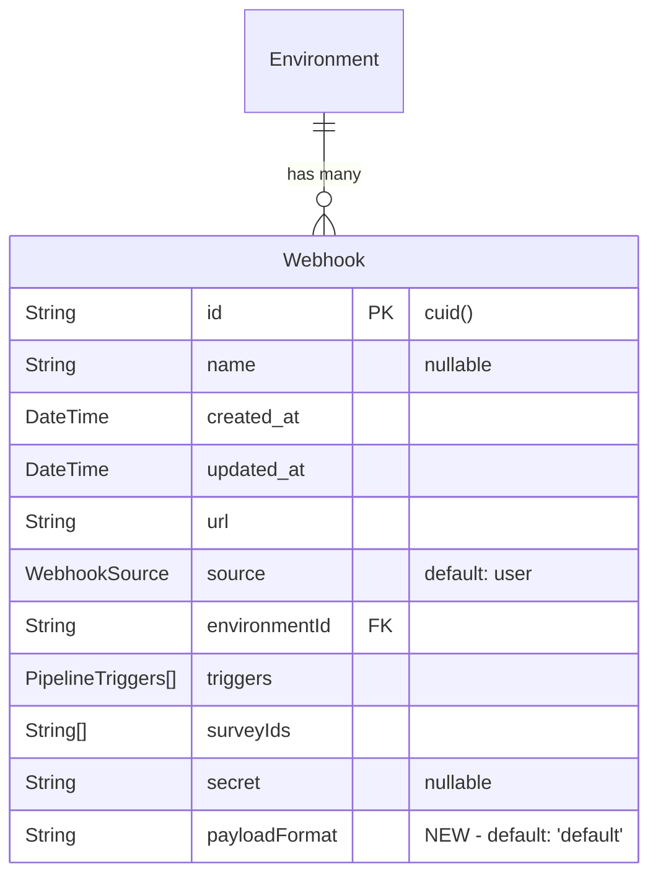
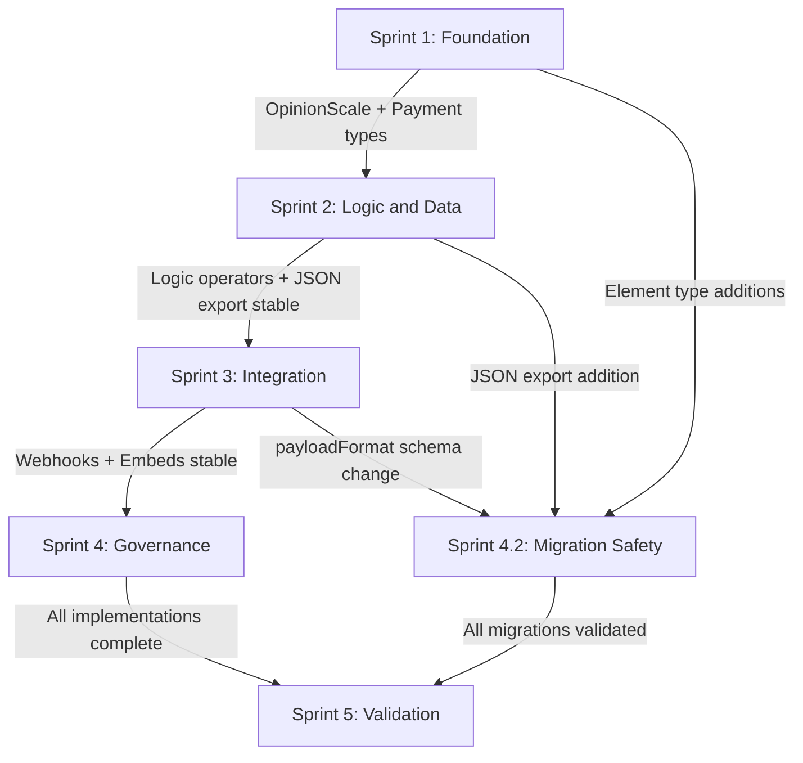

# Technical Specification

# 0. Agent Action Plan

## 0.1 Intent Clarification

### 0.1.1 Core Feature Objective

Based on the prompt, the Blitzy platform understands that the new feature requirement is to **complete Sprints 3, 4, and 5 of the Typeform feature parity initiative** within the Formbricks open-source survey platform. The sprint roadmap defined in `docs/development/typeform-parity/sprint-roadmap.mdx` is the governing source of truth, and all steps listed under each sprint are mandatory deliverables. No other document may defer or override a step listed in the roadmap.

The feature requirements decompose into five epics across three sprints:

- **Sprint 3 — Integration (Epic 3.1): Webhook Payload Parity** — Transform the Formbricks webhook payload structure to achieve field-by-field structural equivalence with the Typeform webhook schema. This includes restructuring the flat `data.data` key-value answer format into a typed `answers` array with field metadata, adding form definitions to payloads, separating hidden fields, restructuring variables into typed arrays, adding calculated score fields, and implementing a per-webhook backward-compatibility toggle (`payloadFormat` flag) to avoid disrupting existing integrations.

- **Sprint 3 — Integration (Epic 3.2): Embed and Share Enhancements** — Implement the three missing Typeform embed variants (slider, popover, and side tab) as new components in the share modal system. Extend the `@formbricks/js-core` SDK to support these new embed modes. Generate copy-ready HTML/JavaScript embed code snippets for each variant.

- **Sprint 4 — Governance (Epic 4.1): Workspace Parity** — Evaluate structural alignment between the Formbricks `Organization → Project → Team → Role` hierarchy and Typeform's `Workspace → Team → Folder` model. Audit role permissions to verify that Formbricks' 4-role system (`owner`, `manager`, `member`, `billing`) provides equivalent or superior access control to Typeform's 3-role system. Verify API key scope alignment. Implement optional folder-like project grouping if the evaluation determines it is required for parity.

- **Sprint 4 — Governance (Epic 4.2): Migration Safety Procedures** — Audit all schema changes introduced across Sprints 1–3 (including the `opinionScale` and `payment` element type additions to `TSurveyElementTypeEnum`). Write migration scripts following the timestamp-based naming convention in `packages/database/migration/`. Implement rollback procedures. Run backward-compatibility tests to verify that existing surveys parse, render, and export correctly with the expanded Zod discriminated union.

- **Sprint 5 — Validation: End-to-End Parity Validation** — Execute comprehensive validation across all 8 capability areas defined in the gap report: question types, conditional logic, hidden fields and answer piping, partial submissions, webhooks, response export, embed/share flows, and workspace governance. Perform regression testing, performance benchmarking, and migration safety confirmation.

Implicit requirements detected:

- All webhook payload transformations must preserve the existing `generateStandardWebhookSignature` HMAC-SHA256 signing mechanism — the signature is computed over the full body, so only the body content changes
- The three new embed variants must follow the tab-based architecture established by the existing `shareEmbedModal/` component system, using the `ShareView` sidebar navigation pattern
- Migration safety work must use the custom `fb-migrate-dev` workflow and follow the `packages/database/migration/` directory conventions (one file per subdirectory, timestamp-based naming)
- Sprint 5 validation is verification-only — no new features are implemented during validation

### 0.1.2 Special Instructions and Constraints

The following mandatory constraints govern all implementation work, as documented in the sprint roadmap and gap report:

- **Webhook structural parity** — Payloads must maintain structural parity with Typeform format when the `payloadFormat: "typeform"` option is enabled
- **100% logic jump coverage** — Logic jump feature equivalence must remain at 100% throughout all changes
- **No broken existing forms** — Existing Formbricks forms must not be broken by any schema migration; all migrations must be additive
- **Lossless export** — Response export must be lossless with complete data fidelity across CSV, XLSX, and JSON formats

Architectural directives:

- Follow the existing pipeline route pattern in `apps/web/app/api/(internal)/pipeline/route.ts` when implementing the webhook transformation layer
- Use Zod for all new schema definitions, consistent with the existing `@formbricks/types` and `@formbricks/database/zod/` conventions
- Extend the existing `ShareViaType` enum in `apps/web/app/(app)/environments/[environmentId]/surveys/[surveyId]/(analysis)/summary/types/share.ts` for new embed tab types
- Use the existing Prisma migration system (`packages/database/migration/`) with the `fb-migrate-dev` command for database schema changes
- Enterprise features (teams, project-level permissions) remain gated behind the `isTeamsEnabled` license check

Source hierarchy: All documents referenced in the user instructions are equally authoritative. The epic-specific documents (`webhook-parity.mdx`, `embed-share-parity.mdx`, `workspace-parity.mdx`, `migration-safety.mdx`, `gap-report.mdx`) provide implementation details. The sprint roadmap (`sprint-roadmap.mdx`) defines mandatory deliverables.

### 0.1.3 Technical Interpretation

These feature requirements translate to the following technical implementation strategy:

- To **achieve webhook payload parity**, we will extend the `Webhook` Prisma model with an optional `payloadFormat` field, create a payload transformation function that converts the flat Formbricks response format to Typeform's typed `answers` array structure, add form field definitions to the payload, branch payload construction in the pipeline route based on the `payloadFormat` setting, and build a webhook settings UI for format selection.

- To **implement embed/share enhancements**, we will create three new React tab components (`slider-embed-tab.tsx`, `popover-embed-tab.tsx`, `side-tab-embed-tab.tsx`) in the `shareEmbedModal/` directory, extend the `ShareViaType` enum with `SLIDER`, `POPOVER`, and `SIDE_TAB` values, register the new tabs in `share-survey-modal.tsx`, extend the `@formbricks/js-core` SDK configuration to support slider, popover, and side-tab embed modes, and update the embed documentation.

- To **verify workspace parity**, we will audit the existing `Organization → Project → Team` hierarchy against Typeform's model, verify role permissions coverage (4 roles vs. 3), confirm API key scoping granularity, and implement optional folder-like project grouping within the Formbricks Project model if the evaluation reveals it is necessary.

- To **establish migration safety**, we will audit all TypeScript/Zod changes across Sprints 1–3, create Prisma migration files for any SQL schema changes (such as the `payloadFormat` field addition), implement documented rollback procedures, validate the expanded `ZSurveyElement` discriminated union against existing survey fixtures, and run the full test suite to confirm zero regressions.

- To **complete end-to-end validation**, we will execute the exhaustive validation checklist from the gap report across all 8 capability areas, run regression tests (`packages/surveys/src/lib/logic.test.ts`, `apps/web/lib/surveyLogic/utils.test.ts`, `apps/web/lib/response/tests/response.test.ts`), benchmark export performance with large datasets, and verify migration rollback in staging.

## 0.2 Repository Scope Discovery

### 0.2.1 Comprehensive File Analysis

The Formbricks repository is a pnpm/Turborepo monorepo with two primary workspace roots: `apps/` (containing the production Next.js 16 web application and a Storybook workspace) and `packages/` (containing shared libraries, SDKs, type definitions, and infrastructure modules). The following analysis maps every existing file and module affected by Sprints 3, 4, and 5.

**Epic 3.1 — Webhook Payload Parity: Existing Files to Modify**

| File Path | Current Purpose | Required Change |
|---|---|---|
| `packages/database/schema.prisma` (lines 19–57) | Defines `PipelineTriggers` enum, `WebhookSource` enum, and `Webhook` model | Add optional `payloadFormat` field (`String? @default("default")`) to the `Webhook` model |
| `packages/database/zod/webhooks.ts` | `ZWebhook` Zod schema validating webhook records | Extend with `payloadFormat: z.enum(["default", "typeform"]).default("default")` field |
| `apps/web/app/api/(internal)/pipeline/route.ts` (lines 101–145) | Webhook dispatch logic — constructs payload body, generates headers, sends HTTP requests | Add payload format branching: check `webhook.payloadFormat` and apply Typeform transformation when set to `"typeform"` |
| `apps/web/app/api/(internal)/pipeline/types/pipelines.ts` | `ZPipelineInput` Zod schema for pipeline request validation | No change needed — pipeline input remains event-agnostic |
| `apps/web/modules/integrations/webhooks/types/webhooks.ts` | `ZWebhookInput` schema for webhook creation/update | Add `payloadFormat` to the pick/partial shape |
| `apps/web/modules/integrations/webhooks/lib/webhook.ts` | `createWebhook`, `updateWebhook`, `deleteWebhook` service functions | Update `createWebhook` and `updateWebhook` to persist `payloadFormat` |
| `apps/web/modules/integrations/webhooks/actions.ts` | Server actions for webhook CRUD with audit logging | Pass `payloadFormat` through the action schemas |
| `apps/web/modules/integrations/webhooks/components/add-webhook-modal.tsx` | Webhook creation UI with trigger/survey selection | Add payload format selector (radio group or dropdown for "Default" vs "Typeform-compatible") |
| `apps/web/modules/integrations/webhooks/components/webhook-detail-modal.tsx` | Webhook detail/edit UI | Add payload format display and edit control |
| `apps/web/modules/integrations/webhooks/components/webhook-settings-tab.tsx` | Webhook settings panel | Include format toggle in settings |
| `apps/web/lib/crypto.ts` (lines 184–194) | `generateStandardWebhookSignature` — HMAC-SHA256 signing | No change — signature mechanism remains unchanged regardless of payload format |
| `docs/api-reference/openapi.json` | API v1 OpenAPI specification | Update webhook object schema to include `payloadFormat` field |
| `docs/api-v2-reference/openapi.yml` | API v2 OpenAPI specification | Update webhook object schema to include `payloadFormat` field |

**Epic 3.2 — Embed and Share Enhancements: Existing Files to Modify**

| File Path | Current Purpose | Required Change |
|---|---|---|
| `apps/web/app/(app)/environments/[environmentId]/surveys/[surveyId]/(analysis)/summary/types/share.ts` | `ShareViaType`, `ShareSettingsType`, `LinkTabsType` enums | Add `SLIDER`, `POPOVER`, `SIDE_TAB` values to `ShareViaType` |
| `apps/web/app/(app)/environments/[environmentId]/surveys/[surveyId]/(analysis)/summary/components/share-survey-modal.tsx` | Main share modal orchestrating all tabs via `useMemo` array | Register three new tab entries (slider, popover, side tab) with icons, labels, and component references |
| `apps/web/app/(app)/environments/[environmentId]/surveys/[surveyId]/(analysis)/summary/components/shareEmbedModal/share-view.tsx` | Sidebar navigation rendering for share tabs | No structural change — new tabs auto-render via the `tabs` prop array |
| `packages/js-core/src/lib/common/config.ts` | SDK configuration types and defaults | Extend configuration interface with new embed mode options (`slider`, `popover`, `sideTab`) |
| `packages/js-core/src/lib/common/setup.ts` | SDK initialization and setup logic | Handle new embed mode values during SDK initialization |
| `packages/js-core/src/index.ts` | SDK public API exports | Export new embed mode type definitions |
| `docs/xm-and-surveys/surveys/link-surveys/embed-surveys.mdx` | User-facing embed documentation | Add sections documenting slider, popover, and side tab embed options |

**Epic 4.1 — Workspace Parity: Files to Audit and Potentially Modify**

| File Path | Current Purpose | Required Change |
|---|---|---|
| `apps/web/modules/organization/actions.ts` | Organization CRUD actions including `createOrganizationAction` | Audit for workspace model alignment; potential updates for folder-like grouping |
| `apps/web/modules/organization/lib/utils.ts` | Authorization helper computing `isOwner`, `isManager`, `isBillingAdmin` flags | Verify role permission coverage against Typeform's 3-role model |
| `apps/web/modules/ee/teams/lib/roles.ts` | Team-level permission resolution via `getProjectPermissionByUserId` | Verify team role mapping equivalence |
| `apps/web/modules/ee/teams/project-teams/` | Project-team assignment UI and logic | Verify project-level permission model (`read`, `readWrite`, `manage`) |
| `apps/web/modules/projects/` | Project management module | Potential addition of folder-like grouping layer |
| `packages/database/schema.prisma` (lines 627–760, 946–1010) | Organization, Membership, Project, Team, Invite, ApiKey models | Potential schema additions if folder grouping is required |
| `apps/web/modules/organization/settings/api-keys/` | API key management with environment-scoped permissions | Verify API key scope alignment with Typeform's personal access token model |

**Epic 4.2 — Migration Safety: Files to Audit and Modify**

| File Path | Current Purpose | Required Change |
|---|---|---|
| `packages/database/migration/` | Custom migration directory (timestamp-ordered subdirectories) | Add new migration directories for Sprint 3 schema changes |
| `packages/database/schema.prisma` | Complete Prisma schema | Audit all changes from Sprints 1–3 for additive-only compliance |
| `packages/types/surveys/constants.ts` | `TSurveyElementTypeEnum` — now includes `Payment` and `OpinionScale` | Verify additions are additive and backward-compatible |
| `packages/types/surveys/elements.ts` (lines 354–402) | `ZSurveyOpinionScaleElement`, `ZSurveyPaymentElement`, `ZSurveyElement` union | Verify union expansion accepts both legacy and new types |
| `packages/types/surveys/validation-rules.ts` | Validation rules per element type | Verify rules for `payment` and `opinionScale` are properly defined |
| `packages/database/README.md` | Migration system documentation | Verify documentation reflects current migration procedures |

**Sprint 5 — Validation: Test Files to Execute**

| File Path | Purpose |
|---|---|
| `packages/surveys/src/lib/logic.test.ts` | Logic operator evaluation tests |
| `apps/web/lib/surveyLogic/utils.test.ts` | Survey logic utility tests |
| `apps/web/lib/response/tests/response.test.ts` | Response service tests |
| `apps/web/lib/response/service.test.ts` | Response download/export tests |
| `apps/web/app/api/(internal)/pipeline/lib/handleIntegrations.test.ts` | Integration handler tests |
| `apps/web/app/api/(internal)/pipeline/lib/telemetry.test.ts` | Telemetry tests |
| `apps/web/app/(app)/environments/[environmentId]/workspace/integrations/lib/webhook.test.ts` | Webhook integration tests |
| `apps/web/app/api/v1/webhooks/lib/webhook.test.ts` | Webhook API v1 tests |
| `apps/web/app/api/v1/webhooks/[webhookId]/lib/webhook.test.ts` | Webhook detail API tests |
| `apps/web/lib/crypto.test.ts` | Crypto/signature tests |
| `apps/web/modules/ee/teams/lib/roles.test.ts` | Team roles permission tests |
| `apps/web/modules/organization/lib/utils.test.ts` | Organization utility tests |
| `apps/web/playwright/api/management/webhook.spec.ts` | Playwright E2E webhook API tests |
| `apps/web/playwright/api/organization/team.spec.ts` | Playwright E2E team API tests |
| `apps/web/playwright/api/organization/project-team.spec.ts` | Playwright E2E project-team tests |

### 0.2.2 New File Requirements

**Epic 3.1 — Webhook Payload Parity: New Files**

| File Path | Purpose |
|---|---|
| `apps/web/app/api/(internal)/pipeline/lib/payload-transformer.ts` | Typeform-compatible payload transformation function that converts flat `data.data` to typed `answers` array, adds `definition.fields`, separates hidden fields, restructures variables, and adds `calculated.score` |
| `apps/web/app/api/(internal)/pipeline/lib/payload-transformer.test.ts` | Unit tests for payload transformation covering all element types, edge cases, and backward compatibility |
| `packages/database/zod/webhook-payload.ts` | Zod schemas for the Typeform-compatible payload format (`ZTypeformCompatiblePayload`, `ZTypeformAnswer`, `ZTypeformFieldDefinition`) |
| `packages/database/migration/[timestamp]_add_payload_format_to_webhook/migration.sql` | SQL migration adding `payloadFormat` column to the `Webhook` table with `DEFAULT 'default'` |

**Epic 3.2 — Embed and Share Enhancements: New Files**

| File Path | Purpose |
|---|---|
| `apps/web/app/(app)/environments/[environmentId]/surveys/[surveyId]/(analysis)/summary/components/shareEmbedModal/slider-embed-tab.tsx` | Slider embed tab component — generates JavaScript snippet for a side-sliding panel with configurable direction (left/right), width, and animation |
| `apps/web/app/(app)/environments/[environmentId]/surveys/[surveyId]/(analysis)/summary/components/shareEmbedModal/popover-embed-tab.tsx` | Popover embed tab component — generates JavaScript snippet for a floating action button that expands into the survey form with configurable position, icon, and color |
| `apps/web/app/(app)/environments/[environmentId]/surveys/[surveyId]/(analysis)/summary/components/shareEmbedModal/side-tab-embed-tab.tsx` | Side tab embed tab component — generates JavaScript snippet for a fixed vertical tab on the page edge with configurable label, position, and color |
| `apps/web/app/(app)/environments/[environmentId]/surveys/[surveyId]/(analysis)/summary/components/shareEmbedModal/slider-embed-tab.test.tsx` | Unit tests for slider embed tab |
| `apps/web/app/(app)/environments/[environmentId]/surveys/[surveyId]/(analysis)/summary/components/shareEmbedModal/popover-embed-tab.test.tsx` | Unit tests for popover embed tab |
| `apps/web/app/(app)/environments/[environmentId]/surveys/[surveyId]/(analysis)/summary/components/shareEmbedModal/side-tab-embed-tab.test.tsx` | Unit tests for side tab embed tab |

**Epic 4.2 — Migration Safety: New Files**

| File Path | Purpose |
|---|---|
| `packages/database/migration/[timestamp]_audit_sprint1_3_changes/migration.ts` | Data migration script auditing all Sprint 1–3 schema changes for backward-compatibility validation |
| `apps/web/lib/response/tests/backward-compat.test.ts` | Backward-compatibility test suite verifying existing survey fixtures parse correctly through updated `ZSurvey` schema |

**Sprint 5 — Validation: New Files**

| File Path | Purpose |
|---|---|
| `apps/web/app/api/(internal)/pipeline/lib/webhook-parity-validation.test.ts` | Webhook parity validation test — sends test payloads in Typeform-compatible format and verifies field-by-field structural equivalence |
| `apps/web/lib/response/tests/export-lossless-validation.test.ts` | Export lossless validation test — exports responses in CSV, XLSX, and JSON formats and compares field-by-field against database records |

### 0.2.3 Web Search Research Conducted

No external web search was required for this scope. All implementation details, patterns, library references, and best practices are comprehensively documented within the referenced parity analysis documents (`webhook-parity.mdx`, `embed-share-parity.mdx`, `workspace-parity.mdx`, `migration-safety.mdx`, `gap-report.mdx`) and the existing codebase patterns. The repository uses well-established frameworks (Next.js 16, Prisma, Zod, React 19) with existing usage patterns throughout the codebase.

## 0.3 Dependency Inventory

### 0.3.1 Private and Public Packages

The following packages are key to the Sprints 3, 4, and 5 feature addition scope. Versions are drawn directly from the root `package.json`, `apps/web/package.json`, and `packages/database/package.json` dependency manifests.

**Core Runtime Dependencies**

| Registry | Package | Version | Purpose |
|---|---|---|---|
| npm | `next` | `16.1.6` | Next.js App Router framework — hosts the pipeline route and all web UI components |
| npm | `react` | `19.2.4` | React runtime for UI component rendering (share modal tabs, webhook settings) |
| npm | `react-dom` | `19.2.4` | React DOM renderer |
| npm | `zod` | (workspace) | Schema validation — used for `ZWebhook`, `ZPipelineInput`, new payload schemas |
| npm | `zod-openapi` | (workspace) | OpenAPI schema generation from Zod definitions |
| npm | `@prisma/client` | `6.14.0` | Prisma ORM client — database queries for webhooks, surveys, organizations |
| npm | `uuid` | `11.1.0` | UUID v7 generation for webhook message IDs |

**Workspace (Internal) Packages**

| Registry | Package | Version | Purpose |
|---|---|---|---|
| workspace | `@formbricks/database` | `workspace:*` | Prisma schema, Zod webhook schemas, migration system |
| workspace | `@formbricks/types` | `workspace:*` | Canonical shared type definitions (`TSurveyElementTypeEnum`, `ZSurveyElement`, `ZResponse`) |
| workspace | `@formbricks/js-core` | `workspace:*` | Browser JavaScript SDK — must be extended with slider/popover/side-tab embed modes |
| workspace | `@formbricks/surveys` | `workspace:*` | Standalone survey renderer — used in embed modes |
| workspace | `@formbricks/logger` | `workspace:*` | Pino-based logging — used in pipeline route error handling |
| workspace | `@formbricks/storage` | `workspace:*` | S3 storage helpers — `resolveStorageUrlsInObject` used in webhook payloads |
| workspace | `@formbricks/cache` | `workspace:*` | Redis cache service — used for webhook/survey caching |
| workspace | `@formbricks/email` | `workspace:*` | Email templates — used in follow-up pipeline processing |
| workspace | `@formbricks/i18n-utils` | `workspace:*` | Translation scanning — new embed tab labels require i18n keys |

**UI Component Dependencies**

| Registry | Package | Version | Purpose |
|---|---|---|---|
| npm | `@radix-ui/react-*` | Various | Radix UI primitives — Sidebar, Dialog, Tooltip used in share modal |
| npm | `lucide-react` | (workspace) | Icon library — provides icons for new embed tab navigation items |
| npm | `react-hot-toast` | (workspace) | Toast notifications — copy-to-clipboard feedback in embed tabs |
| npm | `react-hook-form` | (workspace) | Form management — webhook creation/edit modals |
| npm | `react-i18next` | (workspace) | Internationalization — all new UI components require `useTranslation` |

**Testing Dependencies**

| Registry | Package | Version | Purpose |
|---|---|---|---|
| npm | `vitest` | (workspace) | Unit test runner — all `*.test.ts` files |
| npm | `@playwright/test` | `1.56.1` | E2E test framework — webhook and embed validation tests |
| npm | `turbo` | `2.5.3` | Monorepo task runner — `pnpm test` orchestration |

**Build and Tooling**

| Registry | Package | Version | Purpose |
|---|---|---|---|
| npm | `pnpm` | `10.28.2` | Package manager (enforced via `packageManager` field) |
| npm | `tsx` | `4.19.4` | TypeScript execution — migration scripts, data migration runner |
| npm | `prisma` | `6.14.0` | Prisma CLI — schema generation, migration commands |

### 0.3.2 Dependency Updates

**Schema Changes Requiring Migration**

The Sprint 3 webhook payload parity epic requires a single additive SQL migration to add the `payloadFormat` column to the `Webhook` table:

```sql
ALTER TABLE "Webhook" ADD COLUMN "payloadFormat" TEXT DEFAULT 'default';
```

This change must be created via the `pnpm fb-migrate-dev` workflow and placed in `packages/database/migration/[timestamp]_add_payload_format_to_webhook/migration.sql`.

**Import Updates**

Files requiring import updates for the new payload transformer module:

- `apps/web/app/api/(internal)/pipeline/route.ts` — Import the new `transformToTypeformPayload` function from `./lib/payload-transformer`
- `apps/web/modules/integrations/webhooks/types/webhooks.ts` — Import extended `ZWebhook` shape with `payloadFormat`
- `apps/web/app/(app)/environments/[environmentId]/surveys/[surveyId]/(analysis)/summary/components/share-survey-modal.tsx` — Import three new embed tab components (`SliderEmbedTab`, `PopoverEmbedTab`, `SideTabEmbedTab`)
- `apps/web/app/(app)/environments/[environmentId]/surveys/[surveyId]/(analysis)/summary/types/share.ts` — No new imports needed (enum extension only)

**External Reference Updates**

- `docs/api-reference/openapi.json` — Update `Webhook` schema to include `payloadFormat` property
- `docs/api-v2-reference/openapi.yml` — Update `Webhook` schema to include `payloadFormat` property
- `docs/xm-and-surveys/surveys/link-surveys/embed-surveys.mdx` — Add slider, popover, and side tab embed documentation sections
- `docs/docs.json` — Update navigation structure if new documentation pages are created for embed variants

**No New External Dependencies Required**

All Sprints 3–5 work leverages existing packages already installed in the monorepo. No new `npm` packages need to be added to any `package.json`.

## 0.4 Integration Analysis

### 0.4.1 Existing Code Touchpoints

**Epic 3.1 — Webhook Pipeline Integration Points**

The webhook dispatch system is centralized in the pipeline route. The following touchpoints require direct modifications:

- **`apps/web/app/api/(internal)/pipeline/route.ts` (lines 101–145)**: The `webhookPromises` mapping loop constructs the payload body by spreading the response object and appending survey metadata. This is the primary integration point where payload format branching must be introduced. The existing code fetches webhooks via `prisma.webhook.findMany` (line 78) — the fetched webhook object must now include the `payloadFormat` field. The payload construction at lines 102–116 must conditionally apply the Typeform transformation when `webhook.payloadFormat === "typeform"`.

- **`apps/web/modules/integrations/webhooks/lib/webhook.ts` (lines 17–95)**: The `createWebhook` function (line 64) creates webhook records via `prisma.webhook.create`. The `updateWebhook` function (line 17) updates records via `prisma.webhook.update`. Both must be extended to persist and update the `payloadFormat` field. The `data` spread in `createWebhook` already forwards `...webhookInput`, so adding `payloadFormat` to the input type will naturally persist it.

- **`apps/web/modules/integrations/webhooks/actions.ts`**: The `createWebhookAction` and `updateWebhookAction` server actions pass through `ZWebhookInput`-validated data. The schema extension in `types/webhooks.ts` will flow through these actions without structural changes to the action functions themselves.

- **`packages/database/schema.prisma` (lines 43–57)**: The `Webhook` model must gain the `payloadFormat` column. After modification, `pnpm fb-migrate-dev` generates the SQL migration and updates the Prisma client. The Prisma client types will automatically include `payloadFormat` on the `Webhook` type, making it available in `route.ts` webhook fetches.

**Dependency Injection Points**

- **`packages/database/zod/webhooks.ts`**: The `ZWebhook` schema is the single source of truth for webhook validation. It is consumed by `ZWebhookInput` in `apps/web/modules/integrations/webhooks/types/webhooks.ts` and by `ZPipelineInput` in `apps/web/app/api/(internal)/pipeline/types/pipelines.ts`. Extending `ZWebhook` with `payloadFormat` cascades validation to all consumers.

- **Survey Object Dependency**: The pipeline route already fetches the survey via `getSurvey(surveyId)` at line 61. The Typeform-compatible payload requires the survey's element list (field definitions). The existing `getSurvey` return type includes the full `TSurvey` object with `questions` and `blocks` arrays, providing all data needed for the `definition.fields` array without additional database queries.

**Epic 3.2 — Share Modal Integration Points**

- **`apps/web/app/(app)/environments/[environmentId]/surveys/[surveyId]/(analysis)/summary/components/share-survey-modal.tsx`**: The `linkTabs` array in the `useMemo` block (approximately line 89) is the registration point for all share/embed tabs. Three new entries must be added to this array, each specifying `id` (from extended `ShareViaType`), `type: LinkTabsType.SHARE_VIA`, `label`, `icon`, `componentType`, and `componentProps`. The existing `singleUse?.enabled` disable pattern may apply to these tabs.

- **`apps/web/app/(app)/environments/[environmentId]/surveys/[surveyId]/(analysis)/summary/types/share.ts`**: The `ShareViaType` enum currently has 9 values. Three new values (`SLIDER = "slider"`, `POPOVER = "popover"`, `SIDE_TAB = "side-tab"`) must be added. The `ShareView` component in `share-view.tsx` automatically renders any tab registered in the `tabs` prop array, so no changes to the sidebar navigation component are needed.

- **`packages/js-core/src/lib/common/config.ts`**: The SDK configuration must support new embed placement options. The existing configuration pattern supports setup options passed during initialization — new embed modes must be defined as additional configuration values with their own settings (slide direction, button position, tab label, etc.).

### 0.4.2 Database and Schema Integration

**Sprint 3 Schema Change — Webhook `payloadFormat` Field**


```mermaid
erDiagram
    Webhook {
        String id PK "cuid()"
        String name "nullable"
        DateTime created_at
        DateTime updated_at
        String url
        WebhookSource source "default: user"
        String environmentId FK
        PipelineTriggers[] triggers
        String[] surveyIds
        String secret "nullable"
        String payloadFormat "NEW - default: 'default'"
    }
    Environment ||--o{ Webhook : "has many"
```

The `payloadFormat` field is a nullable `String` with a default value of `"default"`. It accepts two values: `"default"` (current Formbricks format) and `"typeform"` (Typeform-compatible format). Using a string field rather than a Prisma enum provides forward-compatibility for potential future payload formats without requiring additional migrations.

**Sprint 4 Schema Audit**

The migration safety audit covers all schema changes introduced in Sprints 1–3:

- `TSurveyElementTypeEnum` additions: `Payment = "payment"` and `OpinionScale = "opinionScale"` — TypeScript-only, no SQL migration needed
- `ZSurveyPaymentElement` and `ZSurveyOpinionScaleElement` Zod schemas — additive union members, no SQL impact
- `Webhook.payloadFormat` field — requires SQL migration (Sprint 3)
- `convertToJson` function addition — TypeScript-only, no SQL impact
- JSON export format support in UI — TypeScript/React-only, no SQL impact

### 0.4.3 Cross-Sprint Dependency Chain


```mermaid
graph TD
    S1[Sprint 1: Foundation] -->|"OpinionScale + Payment types"| S2[Sprint 2: Logic and Data]
    S2 -->|"Logic operators + JSON export stable"| S3[Sprint 3: Integration]
    S3 -->|"Webhooks + Embeds stable"| S4[Sprint 4: Governance]
    S4 -->|"All implementations complete"| S5[Sprint 5: Validation]
    
    S3 -->|"payloadFormat schema change"| S4M[Sprint 4.2: Migration Safety]
    S1 -->|"Element type additions"| S4M
    S2 -->|"JSON export addition"| S4M
    
    S4M -->|"All migrations validated"| S5
```

Sprint 5 validation depends on all prior sprint work being complete and stable. Sprint 4.2 (Migration Safety) must audit changes from Sprints 1–3 including the Sprint 3 webhook schema change, creating a cross-sprint dependency that must be sequenced correctly.

## 0.5 Technical Implementation

### 0.5.1 File-by-File Execution Plan

**Group 1 — Webhook Payload Parity (Epic 3.1)**

- **MODIFY**: `packages/database/schema.prisma` — Add `payloadFormat String? @default("default")` field to the `Webhook` model at approximately line 55
- **CREATE**: `packages/database/migration/[timestamp]_add_payload_format_to_webhook/migration.sql` — SQL migration adding the column with default value
- **MODIFY**: `packages/database/zod/webhooks.ts` — Extend `ZWebhook` with `payloadFormat: z.enum(["default", "typeform"]).default("default").nullable()`
- **CREATE**: `packages/database/zod/webhook-payload.ts` — New Zod schemas for Typeform-compatible payload structure (`ZTypeformAnswer`, `ZTypeformFieldDefinition`, `ZTypeformCompatiblePayload`)
- **CREATE**: `apps/web/app/api/(internal)/pipeline/lib/payload-transformer.ts` — Core transformation function `transformToTypeformPayload(response, survey)` that converts flat answer data to typed answer array, builds field definitions, separates hidden fields, restructures variables, and computes calculated score
- **MODIFY**: `apps/web/app/api/(internal)/pipeline/route.ts` — Import transformer; in the `webhookPromises` map loop, branch on `webhook.payloadFormat` to conditionally apply `transformToTypeformPayload`
- **MODIFY**: `apps/web/modules/integrations/webhooks/types/webhooks.ts` — Add `payloadFormat` to `ZWebhookInput` pick shape
- **MODIFY**: `apps/web/modules/integrations/webhooks/lib/webhook.ts` — Include `payloadFormat` in `createWebhook` data and `updateWebhook` data
- **MODIFY**: `apps/web/modules/integrations/webhooks/components/add-webhook-modal.tsx` — Add payload format selector UI (radio buttons for "Default" / "Typeform-compatible")
- **MODIFY**: `apps/web/modules/integrations/webhooks/components/webhook-detail-modal.tsx` — Display and allow editing of payload format
- **CREATE**: `apps/web/app/api/(internal)/pipeline/lib/payload-transformer.test.ts` — Unit tests covering all transformation paths, edge cases, and backward compatibility
- **MODIFY**: `docs/api-reference/openapi.json` — Add `payloadFormat` to the Webhook schema definition
- **MODIFY**: `docs/api-v2-reference/openapi.yml` — Add `payloadFormat` to the Webhook schema definition

**Group 2 — Embed and Share Enhancements (Epic 3.2)**

- **MODIFY**: `apps/web/app/(app)/environments/[environmentId]/surveys/[surveyId]/(analysis)/summary/types/share.ts` — Add `SLIDER = "slider"`, `POPOVER = "popover"`, `SIDE_TAB = "side-tab"` to `ShareViaType`
- **CREATE**: `apps/web/app/(app)/environments/[environmentId]/surveys/[surveyId]/(analysis)/summary/components/shareEmbedModal/slider-embed-tab.tsx` — Slider embed component with slide direction selector (left/right), width input, animation timing, and generated JavaScript snippet with copy-to-clipboard
- **CREATE**: `apps/web/app/(app)/environments/[environmentId]/surveys/[surveyId]/(analysis)/summary/components/shareEmbedModal/popover-embed-tab.tsx` — Popover embed component with button position selector, icon picker, color input, form dimensions, and generated JavaScript snippet
- **CREATE**: `apps/web/app/(app)/environments/[environmentId]/surveys/[surveyId]/(analysis)/summary/components/shareEmbedModal/side-tab-embed-tab.tsx` — Side tab embed component with tab label input, position selector (left/right), color input, and generated JavaScript snippet
- **MODIFY**: `apps/web/app/(app)/environments/[environmentId]/surveys/[surveyId]/(analysis)/summary/components/share-survey-modal.tsx` — Register three new tab entries in the `linkTabs` `useMemo` array with appropriate icons, labels, and component references
- **MODIFY**: `packages/js-core/src/lib/common/config.ts` — Extend SDK configuration type with `embedMode?: "slider" | "popover" | "sideTab"` and associated settings (direction, width, buttonPosition, tabLabel, etc.)
- **MODIFY**: `packages/js-core/src/lib/common/setup.ts` — Handle new embed mode initialization, creating the appropriate DOM structures for each mode
- **MODIFY**: `packages/js-core/src/index.ts` — Export new embed mode types
- **MODIFY**: `docs/xm-and-surveys/surveys/link-surveys/embed-surveys.mdx` — Add documentation sections for slider, popover, and side tab embeds with example code snippets

**Group 3 — Workspace Parity (Epic 4.1)**

- **AUDIT**: `packages/database/schema.prisma` (lines 627–760, 946–1010) — Compare Organization, Membership, Project, Team models against Typeform workspace structure
- **AUDIT**: `apps/web/modules/organization/lib/utils.ts` — Verify 4-role coverage maps to Typeform's 3-role model
- **AUDIT**: `apps/web/modules/ee/teams/lib/roles.ts` — Verify `getProjectPermissionByUserId` and team-level permission precedence logic
- **AUDIT**: `apps/web/modules/organization/settings/api-keys/` — Verify per-environment API key scoping meets or exceeds Typeform's personal access token model
- **MODIFY (conditional)**: `packages/database/schema.prisma` — Add folder-like grouping to Project model if evaluation determines it is necessary for parity
- **MODIFY (conditional)**: `apps/web/modules/projects/` — Implement folder grouping UI if schema changes are made
- **CREATE**: Documentation summarizing workspace parity evaluation results and any implemented changes

**Group 4 — Migration Safety (Epic 4.2)**

- **AUDIT**: `packages/types/surveys/constants.ts` — Confirm `Payment` and `OpinionScale` additions to `TSurveyElementTypeEnum` are non-breaking
- **AUDIT**: `packages/types/surveys/elements.ts` — Confirm `ZSurveyElement` union expansion is additive-only (17 members, was 15)
- **AUDIT**: `packages/types/surveys/validation-rules.ts` — Confirm validation rules for new types are properly defined
- **CREATE**: `packages/database/migration/[timestamp]_audit_sprint1_3_changes/migration.ts` — Data migration audit script validating backward-compatibility
- **CREATE**: `apps/web/lib/response/tests/backward-compat.test.ts` — Test suite parsing existing survey fixtures through updated `ZSurvey` schema
- **MODIFY**: Existing test suites — Ensure backward-compatibility test cases are added to `packages/surveys/src/lib/logic.test.ts` and `apps/web/lib/response/tests/response.test.ts`

**Group 5 — End-to-End Validation (Sprint 5)**

- **CREATE**: `apps/web/app/api/(internal)/pipeline/lib/webhook-parity-validation.test.ts` — Validation tests sending Typeform-compatible payloads and verifying structural equivalence
- **CREATE**: `apps/web/lib/response/tests/export-lossless-validation.test.ts` — Lossless export validation comparing all 3 formats against database source records
- **EXECUTE**: Full test suite via `pnpm test` — Regression verification across all packages
- **EXECUTE**: Playwright E2E tests for webhook CRUD, embed variants, and organization/team flows
- **EXECUTE**: Export performance benchmarking with 10,000+ response datasets
- **EXECUTE**: Migration rollback verification in staging environment

### 0.5.2 Implementation Approach per File

The implementation establishes the webhook transformation layer first (Group 1), followed by embed variant creation (Group 2), then governance verification (Group 3), migration safety auditing (Group 4), and comprehensive validation (Group 5).

The webhook payload transformer is the most complex new module. It must handle the conversion of all 17 element types from flat key-value format to Typeform-compatible typed answer objects. The transformer receives the full `TSurvey` object (including questions/blocks) and the `TResponse` object, then produces the restructured payload. This is implemented as a pure function with no side effects, enabling thorough unit testing.

The embed tab components follow the established pattern from `website-embed-tab.tsx`: a React component receiving `surveyUrl` as a prop, generating an HTML/JavaScript embed code snippet, and providing a copy-to-clipboard button. Each new tab adds configurable options specific to its embed mode (direction for slider, position for popover, label for side tab).

The workspace parity evaluation is primarily an audit task producing documentation. Code changes are conditional — the current Formbricks model already exceeds Typeform in role granularity (4 roles vs. 3), and the primary structural difference (Project → Environment vs. Folder hierarchy) represents a different paradigm rather than a gap. Implementation changes are only made if the audit reveals specific functional deficiencies.

### 0.5.3 User Interface Design

**Webhook Payload Format Selector**

The webhook creation and edit modals gain a new radio button group allowing users to select between "Formbricks (Default)" and "Typeform-compatible" payload formats. This control is placed below the existing trigger selection and above the survey filter. The selected format is stored in the `payloadFormat` field of the webhook record.

**Embed Variant Tabs**

Three new tabs appear in the Share Via section of the share modal sidebar navigation:

- **Slider** — Uses a `PanelLeft` (or similar) icon from `lucide-react`. The tab body contains direction selector (left/right radio), width slider, animation timing input, and the generated embed code block with a copy button.
- **Popover** — Uses a `MessageCircle` (or similar) icon. The tab body contains position selector (corner positions), button icon picker, color picker, form dimension inputs, and the generated embed code block.
- **Side Tab** — Uses a `SidebarOpen` (or similar) icon. The tab body contains tab label text input, position selector (left/right), color picker, and the generated embed code block.

All three tabs follow the existing visual pattern: a `CodeBlock` component displaying the generated snippet, configuration options above, and a copy button below. The `AdvancedOptionToggle` pattern from `website-embed-tab.tsx` is reused for optional configuration fields.

## 0.6 Scope Boundaries

### 0.6.1 Exhaustively In Scope

**Sprint 3 — Webhook Payload Parity (All Files)**

- `packages/database/schema.prisma` — `Webhook` model `payloadFormat` field addition
- `packages/database/zod/webhooks.ts` — `ZWebhook` schema extension
- `packages/database/zod/webhook-payload.ts` — New Typeform-compatible payload schemas
- `packages/database/migration/[timestamp]_add_payload_format_to_webhook/**` — SQL migration
- `apps/web/app/api/(internal)/pipeline/route.ts` — Payload format branching in webhook dispatch
- `apps/web/app/api/(internal)/pipeline/lib/payload-transformer.ts` — Payload transformation logic
- `apps/web/app/api/(internal)/pipeline/lib/payload-transformer.test.ts` — Transformer unit tests
- `apps/web/modules/integrations/webhooks/**/*.ts` — Webhook service, actions, types
- `apps/web/modules/integrations/webhooks/components/**/*.tsx` — Webhook UI components
- `docs/api-reference/openapi.json` — API v1 webhook schema update
- `docs/api-v2-reference/openapi.yml` — API v2 webhook schema update

**Sprint 3 — Embed and Share Enhancements (All Files)**

- `apps/web/app/(app)/environments/[environmentId]/surveys/[surveyId]/(analysis)/summary/types/share.ts` — `ShareViaType` enum extension
- `apps/web/app/(app)/environments/[environmentId]/surveys/[surveyId]/(analysis)/summary/components/share-survey-modal.tsx` — Tab registration
- `apps/web/app/(app)/environments/[environmentId]/surveys/[surveyId]/(analysis)/summary/components/shareEmbedModal/slider-embed-tab.tsx` — New slider tab
- `apps/web/app/(app)/environments/[environmentId]/surveys/[surveyId]/(analysis)/summary/components/shareEmbedModal/popover-embed-tab.tsx` — New popover tab
- `apps/web/app/(app)/environments/[environmentId]/surveys/[surveyId]/(analysis)/summary/components/shareEmbedModal/side-tab-embed-tab.tsx` — New side tab
- `apps/web/app/(app)/environments/[environmentId]/surveys/[surveyId]/(analysis)/summary/components/shareEmbedModal/*.test.tsx` — Embed tab unit tests
- `packages/js-core/src/lib/common/config.ts` — SDK embed mode configuration
- `packages/js-core/src/lib/common/setup.ts` — SDK embed mode initialization
- `packages/js-core/src/index.ts` — SDK exports
- `docs/xm-and-surveys/surveys/link-surveys/embed-surveys.mdx` — Embed documentation updates

**Sprint 4 — Workspace Parity (Audit Scope)**

- `packages/database/schema.prisma` (lines 627–760, 946–1010) — Organization, Project, Team, Membership models
- `apps/web/modules/organization/**` — Organization management module (actions, auth, settings, API keys)
- `apps/web/modules/ee/teams/**` — Enterprise team management (roles, project teams, team list)
- `apps/web/modules/projects/**` — Project management (settings, creation, tags)
- `apps/web/modules/organization/lib/utils.ts` — Role authorization helper
- `apps/web/modules/ee/teams/lib/roles.ts` — Team permission resolution
- `apps/web/modules/organization/settings/api-keys/**` — API key management

**Sprint 4 — Migration Safety (All Files)**

- `packages/database/migration/**` — Migration directory (audit existing + create new)
- `packages/database/schema.prisma` — Full schema audit for additive-only changes
- `packages/database/README.md` — Migration procedure verification
- `packages/types/surveys/constants.ts` — `TSurveyElementTypeEnum` audit
- `packages/types/surveys/elements.ts` — `ZSurveyElement` union audit
- `packages/types/surveys/validation-rules.ts` — Validation rules audit
- `apps/web/lib/response/tests/backward-compat.test.ts` — New backward-compatibility tests
- `packages/database/migration/[timestamp]_audit_sprint1_3_changes/**` — Audit migration script

**Sprint 5 — Validation (All Test Files)**

- `packages/surveys/src/lib/logic.test.ts` — Logic operator validation
- `apps/web/lib/surveyLogic/utils.test.ts` — Survey logic utilities validation
- `apps/web/lib/response/tests/response.test.ts` — Response service regression
- `apps/web/lib/response/service.test.ts` — Export functionality regression
- `apps/web/lib/response/utils.test.ts` — Response utility regression
- `apps/web/app/api/(internal)/pipeline/lib/handleIntegrations.test.ts` — Integration handler regression
- `apps/web/app/(app)/environments/[environmentId]/workspace/integrations/lib/webhook.test.ts` — Webhook integration tests
- `apps/web/app/api/v1/webhooks/**/*.test.ts` — Webhook API v1 tests
- `apps/web/lib/crypto.test.ts` — Crypto/signature tests
- `apps/web/modules/ee/teams/lib/roles.test.ts` — Team roles tests
- `apps/web/modules/organization/lib/utils.test.ts` — Organization utility tests
- `apps/web/playwright/api/management/webhook.spec.ts` — E2E webhook tests
- `apps/web/playwright/api/organization/team.spec.ts` — E2E team tests
- `apps/web/playwright/api/organization/project-team.spec.ts` — E2E project-team tests
- `apps/web/app/api/(internal)/pipeline/lib/webhook-parity-validation.test.ts` — New webhook parity validation
- `apps/web/lib/response/tests/export-lossless-validation.test.ts` — New lossless export validation

### 0.6.2 Explicitly Out of Scope

- **Sprint 1 and Sprint 2 deliverables** — Opinion Scale and Payment element types, logic operator parity verification, and JSON response export are already implemented in the codebase. These are not re-implemented; they are validated in Sprint 5.
- **Video questions** — Explicitly excluded from Phase 1 per the sprint roadmap. Requires WebRTC, cloud storage, and media processing infrastructure.
- **Salesforce/HubSpot native CRM integrations** — Explicitly excluded from Phase 1. Existing webhook-based integrations via Zapier/Make/n8n cover the use case.
- **Performance optimizations beyond feature requirements** — No general performance refactoring is in scope. Export performance benchmarking is limited to confirming the existing batched streaming pipeline handles 10,000+ responses.
- **Refactoring of existing code unrelated to integration** — No refactoring of modules or patterns not directly affected by the sprint deliverables.
- **Typeform signature format emulation** — Formbricks retains its Standard Webhooks signature scheme (HMAC-SHA256 with `v1,<base64>` format). The Typeform-compatible payload mode does not change the signing mechanism.
- **Global feature flags for webhook format** — Per the webhook parity document, environment-level toggles are not recommended. Only per-webhook `payloadFormat` granularity is implemented.
- **Dual delivery (sending both formats simultaneously)** — Rejected in the compatibility strategy analysis. Each webhook receives exactly one format based on its `payloadFormat` setting.
- **Changes to `@formbricks/surveys` renderer package** — The embed enhancements modify the SDK (`@formbricks/js-core`) and share modal UI, not the standalone survey renderer.
- **Changes to billing or subscription logic** — Workspace parity audit does not modify billing structures; it verifies that existing plan limits are equivalent.

## 0.7 Rules for Feature Addition

### 0.7.1 Non-Negotiable Parity Constraints

The following constraints are explicitly mandated by the sprint roadmap and gap report. They apply to all code changes across Sprints 3, 4, and 5:

- **Webhook structural parity** — When `payloadFormat` is set to `"typeform"`, the webhook payload must pass field-by-field structural comparison against the Typeform webhook schema documented in `docs/development/typeform-parity/webhook-parity.mdx`. This includes the typed `answers` array, `definition.fields` array, dedicated `hidden` object, typed `variables` array, and `calculated.score` field.
- **100% logic jump coverage** — All 32 operators in `ZSurveyLogicConditionsOperator` must remain functional. No logic operator may be broken or removed by any Sprint 3–5 change. Sprint 5 must execute the exhaustive operator comparison matrix.
- **No broken existing forms** — Every existing Formbricks survey (containing any of the original 15 element types) must continue to parse, render, submit, and export correctly after all Sprint 3–5 changes are applied. This is verified through backward-compatibility tests in Sprint 4.2 and regression testing in Sprint 5.
- **Lossless export** — All three export formats (CSV, XLSX, JSON) must preserve complete data fidelity. Sprint 5 must confirm field-by-field equivalence between database records and exported data.

### 0.7.2 Backward Compatibility Requirements

- **Webhook backward compatibility** — All existing webhooks default to `payloadFormat: "default"` and continue receiving the current Formbricks payload format unchanged. The Typeform-compatible format is opt-in on a per-webhook basis. No existing integration consumer is disrupted.
- **Zod schema backward compatibility** — The `ZSurveyElement` discriminated union (now 17 members, expanded from 15 with `OpinionScale` and `Payment`) must accept all existing element types unchanged. New types are strictly additive.
- **API backward compatibility** — Existing API endpoints (`/api/v1/webhooks`, `/api/v2/management/webhooks`) return the same response format for existing webhook records. The new `payloadFormat` field appears as an additional property — never replacing or renaming existing fields.
- **SDK backward compatibility** — Existing embed code snippets (standard iframe, full-page, popup) must continue to function. The three new embed modes are entirely new entry points, not modifications to existing modes.

### 0.7.3 Migration Safety Rules

- **Additive-only migrations** — All SQL migrations must be additive: new columns with defaults, new indexes. Never drop, rename, or alter existing columns, enum values, or constraints.
- **Custom migration workflow** — All schema migrations must use `pnpm fb-migrate-dev` which generates the SQL, copies to Prisma's internal directory, and applies all pending migrations.
- **Data migration tracking** — Any data migrations must use the `DataMigration` model (status: `pending`, `applied`, `failed`) to prevent duplicate execution.
- **Timestamp-based naming** — Migration directories follow `[timestamp]_[name]` format (e.g., `20260301120000_add_payload_format_to_webhook`).
- **Rollback documentation** — Every migration must have a documented rollback procedure. For the `payloadFormat` column, rollback is `ALTER TABLE "Webhook" DROP COLUMN "payloadFormat"`.

### 0.7.4 Coding Conventions

- **Zod-first validation** — All new data structures (Typeform-compatible payload, embed configuration) must be defined as Zod schemas first, with TypeScript types inferred via `z.infer<>`.
- **Server action pattern** — All new server-side mutations follow the `authenticatedActionClient.schema().action()` pattern with `withAuditLogging` wrapper, as established in `apps/web/modules/integrations/webhooks/actions.ts`.
- **i18n compliance** — All new UI strings must use `useTranslation()` hook with keys registered in the locale files. No hardcoded English strings in component JSX.
- **Test coverage** — Every new module must have corresponding test files. Unit tests use Vitest; E2E tests use Playwright.
- **Standard Webhooks compliance** — Webhook signing continues to follow the Standard Webhooks specification. Signature headers (`webhook-id`, `webhook-timestamp`, `webhook-signature`) are computed identically regardless of payload format.

### 0.7.5 Security Considerations

- **HMAC signature integrity** — The `generateStandardWebhookSignature` function signs the full serialized payload body. When `payloadFormat: "typeform"` is used, the transformed payload body is signed — not the original Formbricks format. This ensures signature verification works correctly for the payload actually received by the consumer.
- **No secret exposure** — The `payloadFormat` field does not expose or modify webhook secrets. Secret generation (`generateWebhookSecret`) and HMAC computation remain unchanged.
- **Input validation** — The `payloadFormat` field is validated by Zod as `z.enum(["default", "typeform"])`, preventing injection of arbitrary format values.
- **Enterprise feature gates** — Workspace parity verification respects existing enterprise license checks. Team features remain gated behind `isTeamsEnabled`. No license-gated features are exposed to non-enterprise users.

## 0.8 References

### 0.8.1 Codebase Files and Folders Searched

The following files and folders were retrieved and analyzed to derive the conclusions in this Agent Action Plan:

**Root Configuration Files**

- `package.json` — Root workspace configuration, scripts, dependencies, engine requirements (Node >=20, pnpm 10.28.2)
- `pnpm-workspace.yaml` — Workspace discovery configuration for `apps/*` and `packages/*`
- `turbo.json` — Turborepo task graph and caching configuration

**Sprint and Epic Documentation (Source of Truth)**

- `docs/development/typeform-parity/sprint-roadmap.mdx` — Sprint 3, 4, and 5 mandatory deliverables (primary source of truth)
- `docs/development/typeform-parity/webhook-parity.mdx` — Epic 3.1 implementation details: field-by-field structural comparison, payload transformation requirements, backward compatibility strategy
- `docs/development/typeform-parity/embed-share-parity.mdx` — Epic 3.2 implementation details: missing embed variants (slider, popover, side tab), component architecture, SDK extension requirements
- `docs/development/typeform-parity/workspace-parity.mdx` — Epic 4.1 implementation details: governance model comparison, role mapping, API key scope alignment
- `docs/development/typeform-parity/migration-safety.mdx` — Epic 4.2 implementation details: migration system architecture, backward-compatibility validation criteria, rollback procedures
- `docs/development/typeform-parity/gap-report.mdx` — Sprint 5 validation criteria: all 8 capability areas, feature parity heatmap, cross-cutting concerns

**Webhook Pipeline and Integration Files**

- `apps/web/app/api/(internal)/pipeline/route.ts` — Webhook dispatch logic (full file, 293 lines)
- `apps/web/app/api/(internal)/pipeline/types/pipelines.ts` — `ZPipelineInput` schema
- `apps/web/app/api/(internal)/pipeline/lib/handleIntegrations.ts` — Integration handler
- `packages/database/zod/webhooks.ts` — `ZWebhook` Zod schema (full file, 51 lines)
- `apps/web/modules/integrations/webhooks/actions.ts` — Webhook server actions
- `apps/web/modules/integrations/webhooks/lib/webhook.ts` — Webhook CRUD service
- `apps/web/modules/integrations/webhooks/types/webhooks.ts` — `ZWebhookInput` type
- `apps/web/modules/integrations/webhooks/components/add-webhook-modal.tsx` — Webhook creation UI
- `apps/web/lib/crypto.ts` — Webhook signature generation

**Share and Embed Modal Files**

- `apps/web/app/(app)/environments/[environmentId]/surveys/[surveyId]/(analysis)/summary/components/share-survey-modal.tsx` — Share modal orchestration (full file reviewed)
- `apps/web/app/(app)/environments/[environmentId]/surveys/[surveyId]/(analysis)/summary/components/shareEmbedModal/share-view.tsx` — Sidebar navigation component (full file, 157 lines)
- `apps/web/app/(app)/environments/[environmentId]/surveys/[surveyId]/(analysis)/summary/components/shareEmbedModal/website-embed-tab.tsx` — Existing embed tab reference pattern (full file, 53 lines)
- `apps/web/app/(app)/environments/[environmentId]/surveys/[surveyId]/(analysis)/summary/types/share.ts` — Share type enums (full file, 23 lines)
- All 18 files in `shareEmbedModal/` directory (listed via directory search)

**Database and Schema Files**

- `packages/database/schema.prisma` — Lines 1–57 (Prisma config, PipelineTriggers, WebhookSource, Webhook model), lines 548–570 (DataMigration model), lines 627–760 (Project, Organization, Membership, Invite, ApiKey), lines 946–1010 (Team, TeamUser, ProjectTeam)
- `packages/database/migration/` — Directory listing of all migration subdirectories (20 migrations from 20241214 to 20260205)
- `packages/database/package.json` — Database package configuration and scripts
- `packages/database/README.md` — Migration system documentation (referenced via sprint docs)

**Type System Files**

- `packages/types/surveys/constants.ts` — `TSurveyElementTypeEnum` (confirmed: includes `Payment` and `OpinionScale`)
- `packages/types/surveys/elements.ts` — Lines 354–402: `ZSurveyOpinionScaleElement`, `ZSurveyPaymentElement`, `ZSurveyElement` union (17 members)
- `packages/types/surveys/validation-rules.ts` — Validation rules (confirmed: `payment` and `opinionScale` present)

**Response and Export Files**

- `apps/web/lib/response/service.ts` — Lines 342–441: `getResponseDownloadFile` function (confirmed: supports `"csv" | "xlsx" | "json"`)
- `apps/web/lib/utils/file-conversion.ts` — `convertToCsv`, `convertToXlsxBuffer`, `convertToJson` functions (full file reviewed)

**Organization and Teams Files**

- `apps/web/modules/organization/` — Full directory listing (actions, components, lib, settings)
- `apps/web/modules/ee/teams/` — Full directory listing (lib, project-teams, team-list)
- `apps/web/modules/projects/` — Directory listing (settings, components)
- `apps/web/modules/organization/settings/api-keys/` — API key management module

**SDK Files**

- `packages/js-core/package.json` — SDK package configuration
- `packages/js-core/src/` — Directory listing of SDK source files (lib/common, lib/environment, lib/survey)

**Test Files**

- `packages/surveys/src/lib/logic.test.ts` — Logic operator test file
- `apps/web/lib/surveyLogic/utils.test.ts` — Survey logic utility tests
- `apps/web/lib/response/tests/response.test.ts` — Response service tests
- `apps/web/lib/response/service.test.ts` — Export functionality tests
- `apps/web/lib/crypto.test.ts` — Crypto tests
- `apps/web/modules/ee/teams/lib/roles.test.ts` — Team roles tests
- `apps/web/modules/organization/lib/utils.test.ts` — Organization utility tests
- `apps/web/playwright/api/management/webhook.spec.ts` — E2E webhook tests
- `apps/web/playwright/api/organization/team.spec.ts` — E2E team tests
- `apps/web/playwright/api/organization/project-team.spec.ts` — E2E project-team tests

**Documentation Files**

- `docs/xm-and-surveys/surveys/link-surveys/embed-surveys.mdx` — Current embed documentation
- `docs/api-reference/openapi.json` — API v1 specification
- `docs/api-v2-reference/openapi.yml` — API v2 specification
- `docs/docs.json` — Documentation site navigation configuration

**Workspace and Root Folder**

- Root folder (`""`) — Full directory listing and summary
- `apps/` — Application workspace summary
- `packages/` — Package workspace summary
- `docs/` — Documentation workspace summary

### 0.8.2 Attachments

No attachments were provided for this project. All implementation details are sourced from the referenced documents within the repository.

### 0.8.3 Source Documents

| Document | Path | Description |
|---|---|---|
| Sprint Roadmap | `docs/development/typeform-parity/sprint-roadmap.mdx` | Primary source of truth defining Sprint 3, 4, and 5 mandatory deliverables with dependency graph and validation milestones |
| Webhook Parity | `docs/development/typeform-parity/webhook-parity.mdx` | Epic 3.1 specification: field-by-field Typeform/Formbricks payload comparison, transformation requirements, backward compatibility strategy |
| Embed/Share Parity | `docs/development/typeform-parity/embed-share-parity.mdx` | Epic 3.2 specification: 3 missing embed variants (slider, popover, side tab), implementation proposals, SDK extension requirements |
| Workspace Parity | `docs/development/typeform-parity/workspace-parity.mdx` | Epic 4.1 specification: governance model comparison, role mapping, API key scope analysis |
| Migration Safety | `docs/development/typeform-parity/migration-safety.mdx` | Epic 4.2 specification: migration architecture, backward-compatibility criteria, rollback procedures, data integrity verification |
| Gap Report | `docs/development/typeform-parity/gap-report.mdx` | Sprint 5 validation reference: comprehensive gap analysis across all 8 capability areas with parity heatmap and priority ranking |

