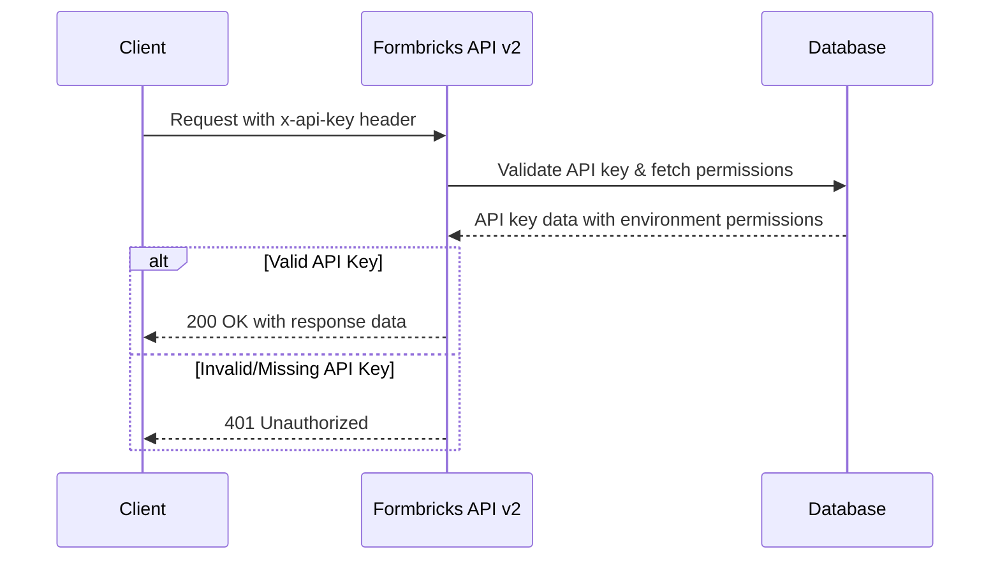

## Overview

The Formbricks API v2 is the next-generation management API built on the **OpenAPI 3.1.0** specification. It provides a standardized, consistent interface for managing surveys, responses, contacts, webhooks, and organizational resources programmatically.

Formbricks exposes two types of API access:

- **Client API** — Public endpoints that do not require authentication. These are used by the Formbricks SDKs for frontend survey interactions such as creating responses, tracking displays, and syncing contact attributes.
- **Management API** — Authenticated endpoints that require an `x-api-key` header. These provide full programmatic access to manage surveys, responses, contacts, webhooks, teams, and other resources.

**Base URLs:**

| Environment | Base URL |
|-------------|----------|
| Formbricks Cloud | `https://app.formbricks.com/api/v2` |
| Self-Hosted | `https://your-domain.com/api/v2` |

<Note>
  The API v2 is currently in **Beta**. While fully functional, some endpoints and response schemas may evolve before the stable release. We recommend using API v2 for new integrations to benefit from improved consistency and expanded capabilities.
</Note>

## Authentication

Management API endpoints require authentication via the `x-api-key` HTTP header. The authentication flow validates the provided API key, resolves its associated permissions (project-level and organization-level), and grants access to the corresponding resources.

Client API endpoints (under `/client/{environmentId}/`) do **not** require authentication and are designed for public-facing SDK interactions.

Source: `apps/web/modules/api/v2/auth/authenticate-request.ts` — the auth flow reads `x-api-key` from request headers, looks up permissions via `getApiKeyWithPermissions(apiKey)`, and returns environment permissions with organization access.

### Authentication Examples

**cURL example:**

```bash
curl -X GET "https://app.formbricks.com/api/v2/me" \
  -H "x-api-key: YOUR_API_KEY"
```

**TypeScript example:**

```typescript
const response = await fetch("https://app.formbricks.com/api/v2/me", {
  headers: {
    "x-api-key": "YOUR_API_KEY",
  },
});
const data = await response.json();
```

### Authentication Flow

The following diagram illustrates how the API v2 authenticates incoming requests:



### Setting Up Your API Key

To authenticate with the Management API, you need to create an API key in your Formbricks dashboard. For detailed instructions, see the [Generate API Key](/api-reference/generate-key) guide.

<Steps>
  <Step title="Navigate To API Keys">
    Go to **Organization Settings** → **API Keys** in your Formbricks dashboard.
  </Step>
  <Step title="Create A New API Key">
    Click **Add API Key** and configure the appropriate project and organization permissions (read, write, or manage).
  </Step>
  <Step title="Copy The Key">
    Copy the generated API key immediately — it is shown only once and cannot be retrieved again.
  </Step>
  <Step title="Include In Requests">
    Add the `x-api-key` header to all Management API requests with your copied key value.
  </Step>
</Steps>

## Response Format

All API v2 endpoints return responses following a standardized Result pattern for consistent client-side handling.

### Success Responses

Source: `apps/web/modules/api/v2/types/api-success.ts`

Success responses return one of the following HTTP status codes:

- **200 OK** — The request succeeded and the response contains the requested data.
- **201 Created** — A new resource was successfully created.
- **207 Multi-Status** — The request processed multiple items with mixed results (used in bulk operations).

**Single resource response:**

```json
{
  "data": {
    "id": "clx1234567890",
    "name": "Customer Satisfaction Survey",
    "status": "inProgress"
  }
}
```

**List response with pagination metadata:**

```json
{
  "data": [
    {
      "id": "clx1234567890",
      "name": "Customer Satisfaction Survey"
    }
  ],
  "meta": {
    "total": 100,
    "limit": 10,
    "offset": 0
  }
}
```

The `data` field contains the response payload (a single object or an array for list endpoints). The `meta` field is present on list endpoints and provides pagination information.

### Error Responses

Source: `apps/web/modules/api/v2/types/api-error.ts` and `apps/web/modules/api/v2/lib/response.ts`

Error responses follow a consistent structure across all endpoints:

```json
{
  "error": {
    "code": 400,
    "message": "Bad Request",
    "details": [
      {
        "field": "name",
        "issue": "Required field is missing"
      }
    ]
  }
}
```

The following error codes are supported:

| HTTP Code | Message | Description |
|-----------|---------|-------------|
| 400 | Bad Request | Invalid request parameters or body |
| 401 | Unauthorized | Missing or invalid API key |
| 403 | Forbidden | Insufficient permissions for the requested resource |
| 404 | Not Found | The requested resource does not exist |
| 409 | Conflict | Resource conflict such as a duplicate entry |
| 422 | Unprocessable Entity | Validation errors in the request body |
| 429 | Too Many Requests | Rate limit exceeded — retry after the cooldown period |
| 500 | Internal Server Error | An unexpected server error occurred |
| 503 | Service Unavailable | The service is temporarily unavailable |

<Warning>
  The `details` field is always an array and may be empty for some error types including unauthorized, forbidden, conflict, too many requests, and internal server error responses.
</Warning>

## Rate Limiting

Source: `apps/web/modules/core/rate-limit/rate-limit-configs.ts`

API v2 enforces rate limits to ensure fair usage and platform stability:

| Endpoint Type | Rate Limit | Scope |
|---------------|------------|-------|
| Management API | **100 requests per minute** | Per API key |
| Client API | **100 requests per minute** | Per environment |

When the rate limit is exceeded, the API returns an HTTP **429 Too Many Requests** response. Clients should implement exponential backoff and retry logic to handle rate-limited responses gracefully.

<Note>
  Rate limits are applied per API key for management endpoints and per environment for client endpoints. Distributing requests across multiple API keys does not increase the per-key limit.
</Note>

## Pagination

Source: `apps/web/modules/api/v2/types/api-success.ts` (`ApiResponseWithMeta`)

List endpoints support **offset-based pagination** using query parameters to control the result set.

### Query Parameters

| Parameter | Type | Description |
|-----------|------|-------------|
| `limit` | number | Maximum number of items to return per page |
| `offset` | number | Number of items to skip from the beginning of the result set |

### Example Request

```bash
curl "https://app.formbricks.com/api/v2/management/responses?limit=10&offset=20" \
  -H "x-api-key: YOUR_API_KEY"
```

### Example Response

```json
{
  "data": [
    {
      "id": "resp_abc123",
      "surveyId": "survey_xyz789",
      "finished": true
    }
  ],
  "meta": {
    "total": 150,
    "limit": 10,
    "offset": 20
  }
}
```

The `meta` object indicates the total number of matching records (`total`), the page size (`limit`), and the current offset (`offset`). Use these values to calculate the next page offset: `nextOffset = offset + limit`.

## Endpoint Catalog

The API v2 organizes endpoints into three categories based on authentication requirements and resource scope.

### Public Client API

Client API endpoints are publicly accessible and do not require authentication. They are designed for SDK and frontend integrations.

<CardGroup cols={2}>
  <Card title="Responses" icon="reply">
    `/client/{environmentId}/responses` — Create and update survey responses.
  </Card>
  <Card title="Contact Attributes" icon="address-card">
    `/client/{environmentId}/contacts/{userId}/attributes` — Sync contact attributes from your application.
  </Card>
  <Card title="Contact Identification" icon="user-check">
    `/client/{environmentId}/identify/contacts/{userId}` — Identify and register contacts.
  </Card>
  <Card title="Displays" icon="eye">
    `/client/{environmentId}/displays` — Track survey display events.
  </Card>
  <Card title="Environment" icon="globe">
    `/client/{environmentId}/environment` — Retrieve environment state with a 5-minute TTL cache.
  </Card>
  <Card title="User" icon="user">
    `/client/{environmentId}/user` — Create and identify users.
  </Card>
  <Card title="Storage" icon="cloud-arrow-up">
    `/client/{environmentId}/storage` — Upload files with signed S3 URLs.
  </Card>
</CardGroup>

### Management API

Management API endpoints require an `x-api-key` header for authentication. They provide full CRUD access to Formbricks resources.

<CardGroup cols={2}>
  <Card title="Health" icon="heart-pulse">
    `/health` — Check application and database health status.
  </Card>
  <Card title="Roles" icon="shield">
    `/roles` — List available system roles and permissions.
  </Card>
  <Card title="Me" icon="circle-user">
    `/me` — Retrieve information about the current API key owner.
  </Card>
  <Card title="Responses" icon="chart-bar">
    `/management/responses` — CRUD operations on survey responses.
  </Card>
  <Card title="Contacts" icon="address-book">
    `/management/contacts` — Create and manage individual contacts.
  </Card>
  <Card title="Bulk Contacts" icon="users">
    `/management/contacts/bulk` — Upload up to 250 contacts at once (email required).
  </Card>
  <Card title="Contact Attribute Keys" icon="tags">
    `/management/contact-attribute-keys` — Manage contact attribute key definitions.
  </Card>
  <Card title="Survey Contact Links" icon="link">
    `/management/surveys/{surveyId}/contact-links` — Generate personalized survey links for contacts.
  </Card>
  <Card title="Webhooks" icon="webhook">
    `/management/webhooks` — Create and manage webhook subscriptions.
  </Card>
</CardGroup>

### Organization API

Organization API endpoints require an `x-api-key` with organization-level access permissions. They manage team structures and user assignments.

<CardGroup cols={2}>
  <Card title="Teams" icon="people-group">
    `/organizations/{organizationId}/teams` — Create and manage organization teams.
  </Card>
  <Card title="Project Teams" icon="diagram-project">
    `/organizations/{organizationId}/project-teams` — Manage project-level team assignments.
  </Card>
  <Card title="Users" icon="user-gear">
    `/organizations/{organizationId}/users` — Manage organization user memberships.
  </Card>
</CardGroup>

## Migrating From API V1

API v1 remains fully available and supported. Both API versions can be used simultaneously within the same application. The following table summarizes the key differences:

| Aspect | API v1 | API v2 |
|--------|--------|--------|
| Base Path | `/api/v1/` | `/api/v2/` |
| Authentication | `x-api-key` header | `x-api-key` header (same) |
| OpenAPI Specification | OpenAPI 3.0 (JSON) | OpenAPI 3.1.0 (YAML) |
| Success Response Format | Varies by endpoint | Standardized `{ data, meta }` |
| Error Response Format | Varies by endpoint | Standardized `{ error: { code, message, details } }` |
| Additional Modules | — | Roles, Me, Bulk Contacts, Contact Links, Teams, Project Teams, Users |

For a complete reference of the API v1 endpoints, see the [REST API documentation](/api-reference/rest-api).

<Note>
  API v1 is not being deprecated. Both APIs can be used simultaneously. We recommend new integrations use API v2 for improved consistency and expanded capabilities.
</Note>

## Getting Help

If you need assistance with the Formbricks API v2, the following resources are available:

- **GitHub Discussions** — Ask questions and get help from the community at [Formbricks Discussions](https://github.com/formbricks/formbricks/discussions).
- **Website** — Visit [formbricks.com](https://formbricks.com/) for product information and documentation.
- **Discord** — Join the [Formbricks Discord](https://formbricks.com/discord) for real-time community support.
