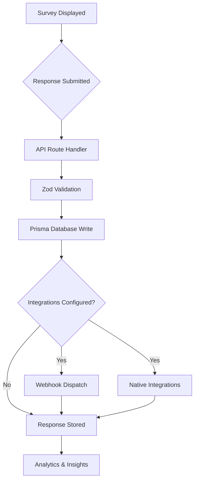

Welcome to the Development section of Formbricks! Whether you're setting up the project locally, contributing to the codebase, or building custom integrations, this guide covers everything you need. Formbricks is organized as a **pnpm/Turborepo monorepo**, splitting application code and shared libraries into well-defined workspaces for fast, incremental builds and clear dependency boundaries.

## Monorepo Structure

Formbricks uses a pnpm workspace configuration with two top-level directories managed by Turborepo for parallel task execution and intelligent caching.

| Component | Version | Purpose |
|-----------|---------|---------|
| **Node.js** | ≥20.0.0 | Runtime environment (LTS recommended) |
| **pnpm** | 10.28.2 | Package manager with workspace support |
| **Turborepo** | 2.5.3 | Build orchestration, task caching, and parallel execution |

The workspace layout is defined in `pnpm-workspace.yaml`:

```yaml
packages:
  - "apps/*"
  - "packages/*"
```

- **`apps/`** — Contains full applications including the main Next.js web app (`apps/web`) and the component Storybook (`apps/storybook`).
- **`packages/`** — Contains shared libraries, configuration presets, and reusable modules consumed by the applications.

*Source: `pnpm-workspace.yaml`, `package.json`*

## Feature Modules

The primary web application (`apps/web`) is organized into **16 feature modules** under `apps/web/modules/`. Each module encapsulates its own routes, components, actions, and server logic.

| Module | Path | Purpose |
|--------|------|---------|
| `account` | `apps/web/modules/account/` | User account management |
| `analysis` | `apps/web/modules/analysis/` | Response analysis and insights |
| `api` | `apps/web/modules/api/` | API v2 implementation |
| `auth` | `apps/web/modules/auth/` | Authentication and authorization |
| `core` | `apps/web/modules/core/` | Core shared utilities and rate limiting |
| `ee` | `apps/web/modules/ee/` | Enterprise features (billing, audit logs, SSO, teams) |
| `email` | `apps/web/modules/email/` | Email sending and templates |
| `environments` | `apps/web/modules/environments/` | Environment management |
| `integrations` | `apps/web/modules/integrations/` | Webhook and native integrations |
| `organization` | `apps/web/modules/organization/` | Organization management |
| `projects` | `apps/web/modules/projects/` | Project settings and configuration |
| `setup` | `apps/web/modules/setup/` | Instance setup and onboarding |
| `storage` | `apps/web/modules/storage/` | File storage management |
| `survey` | `apps/web/modules/survey/` | Survey engine, editor, and responses |
| `ui` | `apps/web/modules/ui/` | Shared UI components |
| `utils` | `apps/web/modules/utils/` | Common utility functions |

<Note>
  The `ee` module contains enterprise-only sub-modules (billing, audit-logs, saml-sso, oidc-sso, teams, role-management, contacts, insights, multi-language, follow-ups, whitelabel) that require an active enterprise license.
</Note>

*Source: `apps/web/modules/`*

## Shared Packages

All **14 shared packages** live under `packages/` and are consumed across applications via pnpm workspace references.

| Package | Path | Purpose |
|---------|------|---------|
| `cache` | `packages/cache/` | Redis caching abstraction |
| `config-eslint` | `packages/config-eslint/` | Shared ESLint configuration |
| `config-prettier` | `packages/config-prettier/` | Shared Prettier configuration |
| `config-typescript` | `packages/config-typescript/` | Shared TypeScript configuration |
| `database` | `packages/database/` | Prisma 6.14.0 schema (32 models, 21 enums) |
| `email` | `packages/email/` | Transactional email (React Email) |
| `i18n-utils` | `packages/i18n-utils/` | Internationalization utilities (14 locales) |
| `js-core` | `packages/js-core/` | Browser SDK (7KB) |
| `logger` | `packages/logger/` | Pino structured logging |
| `storage` | `packages/storage/` | S3-compatible storage abstraction |
| `survey-ui` | `packages/survey-ui/` | React UI toolkit (15 survey elements) |
| `surveys` | `packages/surveys/` | Preact/React survey renderer |
| `types` | `packages/types/` | Zod validation schemas and shared types |
| `vite-plugins` | `packages/vite-plugins/` | Custom Vite build plugins |

*Source: `packages/`*

## Response Collection Pipeline

The following diagram illustrates how a survey response flows through the system — from the moment it is submitted to storage and downstream processing.



*Source: `apps/web/modules/survey/`, `apps/web/modules/integrations/`, `apps/web/modules/analysis/`*

## Getting Started

<CardGroup cols={2}>
  <Card title="Local Setup" icon="laptop-code" href="/development/local-setup/mac">
    Step-by-step instructions to clone the repository, install dependencies, and run Formbricks on your local machine.
  </Card>
  <Card title="Contribution Guidelines" icon="code-pull-request" href="/development/contribution/contribution">
    Learn how to report issues, propose features, and submit pull requests to the Formbricks project.
  </Card>
  <Card title="Coding Standards" icon="book-open" href="/development/standards/organization/file-and-directory-organization">
    File organization, naming conventions, formatting rules, and quality assurance practices.
  </Card>
  <Card title="Technical Handbook" icon="presentation-screen" href="/development/technical-handbook/overview">
    High-level architecture, database model reference, and tenant separation design.
  </Card>
</CardGroup>

