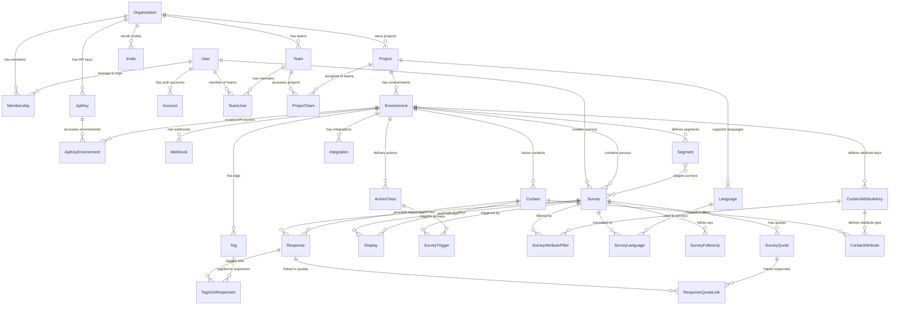

Formbricks uses **PostgreSQL 17** with the `pgvector` extension as its primary database and [Prisma 6.14.0](https://www.prisma.io/) as the Object-Relational Mapping (ORM) tool. The database schema comprises **32 models** organized across **4 bounded domains** and **22 enums** defining type-safe value sets. It supports multi-tenancy through Organization → Project → Environment hierarchy, survey management, response collection, and integration dispatch. Over 120 migration files in `packages/database/migrations/` track schema evolution.

Source: `packages/database/schema.prisma` (1006 lines)

## Entity Relationship Diagram

The following diagram shows the core entities and their relationships across all four bounded domains in the Formbricks database:

## Identity And Access Domain

This domain manages users, organizations, teams, and authentication. It contains 9 models that form the multi-tenancy foundation.

<Note>
  Team-based access control (Team, TeamUser, ProjectTeam models) is an enterprise feature requiring an active enterprise license.
</Note>

| Model | Key Fields | Relationships |
|-------|-----------|---------------|
| **User** | `id`, `name`, `email` (unique), `emailVerified`, `password`, `twoFactorEnabled`, `twoFactorSecret`, `backupCodes`, `identityProvider` (IdentityProvider enum), `identityProviderAccountId`, `locale` (default `"en-US"`), `notificationSettings` (JSON), `groupId`, `lastLoginAt`, `isActive` (default `true`) | `memberships` → Membership[], `accounts` → Account[], `teamUsers` → TeamUser[], `surveys` → Survey[], `invitesCreated` → Invite[], `invitesAccepted` → Invite[] |
| **Account** | `id`, `userId`, `type`, `provider`, `providerAccountId`, `access_token`, `refresh_token`, `expires_at`, `token_type`, `scope`, `id_token`, `session_state` — Unique: [`provider`, `providerAccountId`] | `user` → User |
| **Organization** | `id`, `name`, `billing` (JSON — OrganizationBilling type), `whitelabel` (JSON), `isAIEnabled` (default `false`) | `memberships` → Membership[], `projects` → Project[], `teams` → Team[], `invites` → Invite[], `apiKeys` → ApiKey[] |
| **Membership** | `organizationId`, `userId`, `accepted` (default `false`), `role` (OrganizationRole enum) — Composite ID: [`userId`, `organizationId`] | `organization` → Organization, `user` → User |
| **Team** | `id`, `name`, `organizationId` — Unique: [`organizationId`, `name`] | `organization` → Organization, `teamUsers` → TeamUser[], `projectTeams` → ProjectTeam[] |
| **TeamUser** | `teamId`, `userId`, `role` (TeamUserRole enum) — Composite ID: [`teamId`, `userId`] | `team` → Team, `user` → User |
| **Invite** | `id` (UUID), `email`, `name`, `organizationId`, `creatorId`, `acceptorId`, `expiresAt`, `role` (OrganizationRole enum), `teamIds` (String[]) | `organization` → Organization, `creator` → User, `acceptor` → User? |
| **ApiKey** | `id`, `label`, `hashedKey`, `lookupHash` (unique), `organizationId`, `createdBy`, `lastUsedAt`, `organizationAccess` (JSON) | `organization` → Organization, `apiKeyEnvironments` → ApiKeyEnvironment[] |
| **ApiKeyEnvironment** | `id`, `apiKeyId`, `environmentId`, `permission` (ApiKeyPermission enum) — Unique: [`apiKeyId`, `environmentId`] | `apiKey` → ApiKey, `environment` → Environment |

### User Model Details

The `User` model is the central identity entity. Key behaviors include:

- **Authentication**: Supports 6 identity providers via the `IdentityProvider` enum (`email`, `github`, `google`, `azuread`, `openid`, `saml`)
- **Two-Factor Authentication**: Managed through `twoFactorEnabled`, `twoFactorSecret` (TOTP), and `backupCodes` fields
- **Multi-Organization**: Users can belong to multiple organizations via `Membership` records with distinct roles
- **Locale**: Defaults to `"en-US"`, supporting the 14-locale internationalization system

Source: `packages/database/schema.prisma` (lines 846–873)

### Organization Model Details

The `Organization` model is the top-level tenant boundary. Each organization contains:

- **Billing Configuration**: Stored as JSON in the `billing` field (plan tier, response limits, MIU caps)
- **Whitelabel Settings**: Stored as JSON in the `whitelabel` field for enterprise branding
- **AI Features**: Controlled via the `isAIEnabled` boolean flag

Source: `packages/database/schema.prisma` (lines 665–680)

## Survey Engine Domain

This domain contains the core survey creation, response collection, and display logic. It comprises 16 models.

| Model | Key Fields | Relationships |
|-------|-----------|---------------|
| **Project** | `id`, `name`, `organizationId`, `styling` (JSON), `config` (JSON), `recontactDays` (default `7`), `linkSurveyBranding` (default `true`), `inAppSurveyBranding` (default `true`), `placement` (WidgetPlacement enum), `clickOutsideClose` (default `true`), `overlay` (SurveyOverlay enum), `logo` (JSON?), `customHeadScripts` — Unique: [`organizationId`, `name`] | `organization` → Organization, `environments` → Environment[], `languages` → Language[], `projectTeams` → ProjectTeam[] |
| **Environment** | `id`, `type` (EnvironmentType enum), `projectId`, `appSetupCompleted` (default `false`) | `project` → Project, `surveys` → Survey[], `contacts` → Contact[], `actionClasses` → ActionClass[], `attributeKeys` → ContactAttributeKey[], `webhooks` → Webhook[], `tags` → Tag[], `segments` → Segment[], `integration` → Integration[], `ApiKeyEnvironment` → ApiKeyEnvironment[] |
| **Survey** | `id`, `name`, `type` (SurveyType enum), `status` (SurveyStatus enum), `environmentId`, `createdBy`, `welcomeCard` (JSON), `questions` (JSON[]), `blocks` (JSON[]), `endings` (JSON[]), `hiddenFields` (JSON), `variables` (JSON), `displayOption` (displayOptions enum), `recontactDays`, `displayLimit`, `autoClose`, `autoComplete`, `delay` (default `0`), `surveyClosedMessage` (JSON?), `segmentId`, `projectOverwrites` (JSON?), `styling` (JSON?), `singleUse` (JSON?), `isVerifyEmailEnabled`, `isSingleResponsePerEmailEnabled`, `isBackButtonHidden`, `isCaptureIpEnabled`, `pin`, `displayPercentage`, `showLanguageSwitch`, `recaptcha` (JSON?), `metadata` (JSON), `slug` (unique), `customHeadScripts`, `customHeadScriptsMode` (SurveyScriptMode enum) | `environment` → Environment, `creator` → User?, `responses` → Response[], `quotas` → SurveyQuota[], `triggers` → SurveyTrigger[], `attributeFilters` → SurveyAttributeFilter[], `displays` → Display[], `languages` → SurveyLanguage[], `followUps` → SurveyFollowUp[], `segment` → Segment? |
| **Response** | `id`, `finished` (default `false`), `surveyId`, `contactId`, `endingId`, `data` (JSON), `variables` (JSON), `ttc` (JSON), `meta` (JSON), `contactAttributes` (JSON?), `singleUseId`, `language`, `displayId` (unique) — Unique: [`surveyId`, `singleUseId`] | `survey` → Survey, `contact` → Contact?, `tags` → TagsOnResponses[], `quotaLinks` → ResponseQuotaLink[], `display` → Display? |
| **Display** | `id`, `surveyId`, `contactId` | `survey` → Survey, `contact` → Contact?, `response` → Response? |
| **SurveyTrigger** | `id`, `surveyId`, `actionClassId` — Unique: [`surveyId`, `actionClassId`] | `survey` → Survey, `actionClass` → ActionClass |
| **ActionClass** | `id`, `name`, `description`, `type` (ActionType enum), `key`, `noCodeConfig` (JSON?) , `environmentId` — Unique: [`key`, `environmentId`], [`name`, `environmentId`] | `environment` → Environment, `surveyTriggers` → SurveyTrigger[] |
| **SurveyAttributeFilter** | `id`, `attributeKeyId`, `surveyId`, `condition` (SurveyAttributeFilterCondition enum), `value` — Unique: [`surveyId`, `attributeKeyId`] | `attributeKey` → ContactAttributeKey, `survey` → Survey |
| **SurveyLanguage** | `languageId`, `surveyId`, `default` (default `false`), `enabled` (default `true`) — Composite ID: [`languageId`, `surveyId`] | `language` → Language, `survey` → Survey |
| **Language** | `id`, `code`, `alias`, `projectId` — Unique: [`projectId`, `code`] | `project` → Project, `surveyLanguages` → SurveyLanguage[] |
| **SurveyFollowUp** | `id`, `surveyId`, `name`, `trigger` (JSON), `action` (JSON) | `survey` → Survey |
| **SurveyQuota** | `id`, `surveyId`, `name`, `limit` (Int), `logic` (JSON), `action` (SurveyQuotaAction enum), `endingCardId`, `countPartialSubmissions` (default `false`) — Unique: [`surveyId`, `name`] | `survey` → Survey, `quotaLinks` → ResponseQuotaLink[] |
| **ResponseQuotaLink** | `responseId`, `quotaId`, `status` (ResponseQuotaLinkStatus enum) — Composite ID: [`responseId`, `quotaId`] | `response` → Response, `quota` → SurveyQuota |
| **Tag** | `id`, `name`, `environmentId` — Unique: [`environmentId`, `name`] | `responses` → TagsOnResponses[], `environment` → Environment |
| **TagsOnResponses** | `responseId`, `tagId` — Composite ID: [`responseId`, `tagId`] | `response` → Response, `tag` → Tag |
| **ProjectTeam** | `projectId`, `teamId`, `permission` (ProjectTeamPermission enum) — Composite ID: [`projectId`, `teamId`] | `project` → Project, `team` → Team |

<Note>
  The ProjectTeam model is an enterprise feature that enables team-based access control for projects. It requires an active enterprise license.
</Note>

### Survey Model Details

The `Survey` model is the central configuration entity for questionnaires. Key design decisions include:

- **Question Storage**: Questions are stored as a JSON array, allowing flexible schema evolution without migrations
- **Display Control**: The `displayOption` enum (`displayOnce`, `displayMultiple`, `displaySome`, `respondMultiple`) governs how often a survey can be shown to the same contact
- **Targeting**: Surveys can be targeted via `SurveyAttributeFilter` records or `Segment` references
- **Quotas**: Response limits are managed through `SurveyQuota` with screened-in/screened-out tracking via `ResponseQuotaLink`
- **Multi-Language**: Each survey can support multiple languages through `SurveyLanguage` junction records

Source: `packages/database/schema.prisma` (lines 344–416)

### Response Model Details

The `Response` model stores survey answer data with these key characteristics:

- **Partial Submissions**: The `finished` boolean (default `false`) distinguishes complete from partial responses
- **JSON Data Storage**: Response data, variables, time-to-completion (`ttc`), and metadata are stored as typed JSON fields
- **Single-Use Protection**: The `singleUseId` field with a compound unique constraint (`[surveyId, singleUseId]`) prevents duplicate submissions for single-use link surveys
- **Contact Linking**: Responses are optionally linked to `Contact` records for identified respondents

Source: `packages/database/schema.prisma` (lines 158–190)

## Integration Domain

This domain handles external service connections, contact management, and audience segmentation. It contains 6 models.

| Model | Key Fields | Relationships |
|-------|-----------|---------------|
| **Webhook** | `id`, `name`, `url`, `source` (WebhookSource enum), `environmentId`, `triggers` (PipelineTriggers[]), `surveyIds` (String[]), `secret` | `environment` → Environment |
| **Integration** | `id`, `type` (IntegrationType enum), `environmentId`, `config` (JSON) — Unique: [`type`, `environmentId`] | `environment` → Environment |
| **Contact** | `id`, `environmentId` | `environment` → Environment, `responses` → Response[], `attributes` → ContactAttribute[], `displays` → Display[] |
| **ContactAttribute** | `id`, `attributeKeyId`, `contactId`, `value` (String), `valueNumber` (Float?), `valueDate` (DateTime?) — Unique: [`contactId`, `attributeKeyId`] | `attributeKey` → ContactAttributeKey, `contact` → Contact |
| **ContactAttributeKey** | `id`, `isUnique` (default `false`), `key`, `name`, `description`, `type` (ContactAttributeType enum), `dataType` (ContactAttributeDataType enum), `environmentId` — Unique: [`key`, `environmentId`] | `environment` → Environment, `attributes` → ContactAttribute[], `attributeFilters` → SurveyAttributeFilter[] |
| **Segment** | `id`, `title`, `description`, `isPrivate` (default `true`), `filters` (JSON), `environmentId` — Unique: [`environmentId`, `title`] | `environment` → Environment, `surveys` → Survey[] |

### Contact Attribute System

The contact attribute system uses a key-value architecture with three data type columns for native storage:

- **`value`** (String) — Used for string-type attributes and backward compatibility
- **`valueNumber`** (Float?) — Native numeric storage for number-type attributes
- **`valueDate`** (DateTime?) — Native date storage for date-type attributes

The `ContactAttributeKey` model defines the schema for each attribute type within an environment, while `ContactAttribute` stores the actual values per contact. This design enables efficient querying through database-native indexes on each data type column.

Source: `packages/database/schema.prisma` (lines 59–124)

### Webhook Configuration

Webhooks support Standard Webhooks compliance with HMAC-SHA256 signing. Key fields:

- **`source`**: Identifies the originating platform (`user`, `zapier`, `make`, `n8n`, `activepieces`)
- **`triggers`**: Array of `PipelineTriggers` events (`responseCreated`, `responseUpdated`, `responseFinished`)
- **`surveyIds`**: Scopes the webhook to specific surveys (empty array means all surveys)
- **`secret`**: Used for HMAC-SHA256 request signing

Source: `packages/database/schema.prisma` (lines 43–57)

## Infrastructure Domain

This domain contains models for system-level operations such as migration tracking.

| Model | Key Fields | Relationships |
|-------|-----------|---------------|
| **DataMigration** | `id`, `name` (unique), `status` (DataMigrationStatus enum), `startedAt`, `finishedAt` | None |

The `DataMigration` model tracks the execution status of database schema migrations. Each migration record has a unique `name` identifier and a `status` that progresses through `pending` → `applied` (or `failed`). This model is distinct from Prisma's built-in migration tracking (`_prisma_migrations` table) and is used for application-level data transformation migrations.

<Note>
  The Language model documented under the Survey Engine Domain also serves infrastructure purposes by providing the foundation for the 14-locale internationalization system across projects.
</Note>

Source: `packages/database/schema.prisma` (lines 562–568)

## Data Isolation

The database schema ensures proper data isolation through a hierarchical multi-tenancy model:

### Organization-Level Isolation

- Each organization has its own projects, teams, and API keys
- Users can belong to multiple organizations via `Membership` records with distinct roles
- Billing and whitelabel configuration are scoped per organization
- All resources cascade-delete when an organization is removed

### Environment-Level Isolation

- Each project has exactly two environments: `production` and `development`
- Surveys, contacts, action classes, webhooks, tags, segments, and integrations are all scoped to a specific environment
- API keys are granted per-environment permissions through `ApiKeyEnvironment`
- This separation enables safe testing without affecting production data

### Project-Level Isolation

- Projects group related surveys and environments under a single organization
- Project-specific configurations include styling, branding, widget placement, and language support
- Team-based access control (enterprise) restricts which teams can access specific projects via `ProjectTeam`

## Enums Reference

The schema defines 22 enums for type-safe value constraints across the data model:

| Enum | Values | Used By |
|------|--------|---------|
| **PipelineTriggers** | `responseCreated`, `responseUpdated`, `responseFinished` | Webhook |
| **WebhookSource** | `user`, `zapier`, `make`, `n8n`, `activepieces` | Webhook |
| **ContactAttributeType** | `default`, `custom` | ContactAttributeKey |
| **ContactAttributeDataType** | `string`, `number`, `date` | ContactAttributeKey |
| **SurveyStatus** | `draft`, `inProgress`, `paused`, `completed` | Survey |
| **SurveyAttributeFilterCondition** | `equals`, `notEquals` | SurveyAttributeFilter |
| **SurveyQuotaAction** | `endSurvey`, `continueSurvey` | SurveyQuota |
| **ResponseQuotaLinkStatus** | `screenedIn`, `screenedOut` | ResponseQuotaLink |
| **SurveyType** | `link`, `app` | Survey |
| **displayOptions** | `displayOnce`, `displayMultiple`, `displaySome`, `respondMultiple` | Survey |
| **SurveyScriptMode** | `add`, `replace` | Survey |
| **ActionType** | `code`, `noCode` | ActionClass |
| **EnvironmentType** | `production`, `development` | Environment |
| **IntegrationType** | `googleSheets`, `notion`, `airtable`, `slack` | Integration |
| **DataMigrationStatus** | `pending`, `applied`, `failed` | DataMigration |
| **WidgetPlacement** | `bottomLeft`, `bottomRight`, `topLeft`, `topRight`, `center` | Project |
| **SurveyOverlay** | `none`, `light`, `dark` | Project |
| **OrganizationRole** | `owner`, `manager`, `member`, `billing` | Membership, Invite |
| **ApiKeyPermission** | `read`, `write`, `manage` | ApiKeyEnvironment |
| **IdentityProvider** | `email`, `github`, `google`, `azuread`, `openid`, `saml` | User |
| **TeamUserRole** | `admin`, `contributor` | TeamUser |
| **ProjectTeamPermission** | `read`, `readWrite`, `manage` | ProjectTeam |

## Schema Management

The database schema is managed through Prisma 6.14.0, which provides:

- **Type-Safe Client**: Auto-generated `@prisma/client` with full TypeScript type inference for all 32 models
- **Migration Management**: Over 120 migration files in `packages/database/migrations/` tracked via `pnpm db:migrate:dev`
- **Schema Validation**: Format and lint via `prisma format` (`pnpm format` in the database package)
- **JSON Type Generation**: The `prisma-json-types-generator` generates typed JSON field interfaces
- **pgvector Extension**: PostgreSQL vector extension enabled for embedding-based features

Source: `packages/database/package.json`

For detailed information about specific models and their properties, refer to the [schema.prisma](https://github.com/formbricks/formbricks/blob/main/packages/database/schema.prisma) file in the repository.

## PostgreSQL Database Tables

Formbricks stores all data in PostgreSQL tables. Here is a comprehensive list of all 32 database tables and their purposes:

| Table Name | Description |
|------------|-------------|
| Account | Third-party OAuth authentication accounts and tokens |
| ActionClass | Triggerable user events that can launch surveys |
| ApiKey | Organization-level API authentication keys |
| ApiKeyEnvironment | Environment-specific permissions for API keys |
| Contact | Survey respondents tracked per environment |
| ContactAttribute | Custom attribute values for contacts |
| ContactAttributeKey | Attribute type definitions per environment |
| DataMigration | Schema migration tracking and status |
| Display | Survey display event records |
| Environment | Production/development isolation contexts |
| Integration | Third-party service configurations (Slack, Sheets, Notion, Airtable) |
| Invite | Pending organization membership invitations |
| Language | Supported languages per project |
| Membership | User-organization role assignments |
| Organization | Top-level tenant boundaries |
| Project | Logical survey groupings within organizations |
| ProjectTeam | Team access permissions to projects (Enterprise) |
| Response | Survey response data and metadata |
| ResponseQuotaLink | Response-to-quota tracking junction |
| Segment | Contact groups based on attribute filters |
| Survey | Complete survey configurations and display rules |
| SurveyAttributeFilter | Contact attribute-based targeting rules |
| SurveyFollowUp | Automated follow-up actions on survey responses |
| SurveyLanguage | Survey-to-language assignments |
| SurveyQuota | Response quota configurations per survey |
| SurveyTrigger | Survey-to-action trigger connections |
| Tag | Labels for categorizing responses |
| TagsOnResponses | Tag-to-response junction table |
| Team | User groups within organizations (Enterprise) |
| TeamUser | Team membership and role assignments (Enterprise) |
| User | System user accounts and profiles |
| Webhook | Webhook endpoints for event notifications |

## Schema Reference

For detailed information about the database schema, including:

- Complete field definitions and data types
- Relationships between tables with cascade behavior
- Enums and custom JSON types
- Field constraints, unique indexes, and composite keys
- JSON field type annotations (e.g., `[SurveyQuestions]`, `[ResponseData]`)

Please refer to the [Prisma schema file](https://github.com/formbricks/formbricks/blob/main/packages/database/schema.prisma) in our GitHub repository.

The `schema.prisma` file contains extensive JSDoc-style documentation comments (`///`) for each model, making it the authoritative reference for the database structure.
