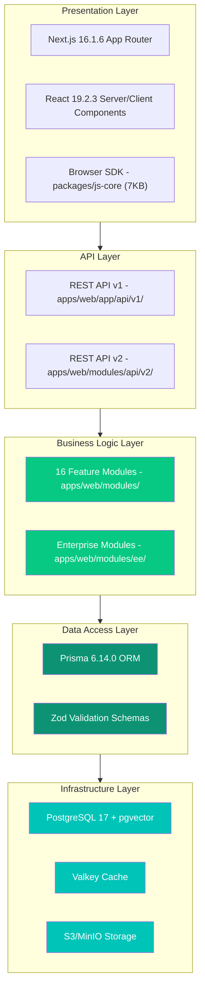
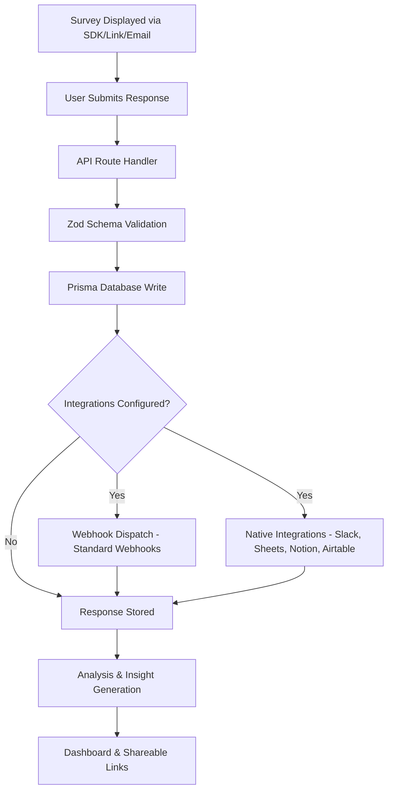

Formbricks is built as a **pnpm/Turborepo monorepo** with a modern, unified architecture centered on Next.js 16.1.6. TypeScript is the sole primary programming language across the entire codebase, ensuring type safety from the presentation layer through to database queries via Prisma 6.14.0 ORM with PostgreSQL 17. This overview documents the platform's five-layer architecture, the response collection pipeline, external integration points, and the key architectural decisions that shape the system.

## Five-Layer Architecture

The Formbricks platform is organized into five distinct layers, each with clear responsibilities and well-defined boundaries. Data flows downward from the Presentation Layer through to the Infrastructure Layer.

### Presentation Layer

The Presentation Layer handles all user-facing rendering and interaction. It is built on Next.js 16.1.6 with the App Router and React 19.2.3, using server components for initial page loads and client components for interactive elements.

- **Next.js 16.1.6 App Router** — Server-side rendering, static generation, and dynamic routing for the admin dashboard and survey pages
- **React 19.2.3** — Server components reduce the client bundle size; client components power interactive editors, form inputs, and real-time updates
- **TailwindCSS 4.x** — Utility-first CSS framework for all styling
- **Radix UI** — Accessible, unstyled component primitives for dropdowns, dialogs, tooltips, and other interactive UI elements
- **Browser SDK** — A lightweight 7KB JavaScript SDK (`packages/js-core`) that renders surveys directly in end-user websites and applications

Source: `apps/web/app/`

### API Layer

The API Layer exposes two versioned REST APIs that serve both internal dashboard operations and external third-party consumers.

- **REST API v1** — Located at `apps/web/app/api/v1/`, this is the legacy client and management API. It provides endpoints for survey display, response submission, and resource management. The OpenAPI 3.0 specification is maintained at `docs/api-reference/openapi.json`.
- **REST API v2** — Located at `apps/web/modules/api/v2/`, this is the new management API with Zod-based request/response validation. Authentication uses the `x-api-key` header scheme. The OpenAPI 3.1.0 specification at `docs/api-v2-reference/openapi.yml` is generated from Zod schemas via the `zod-openapi` library.

Source: `apps/web/modules/api/v2/openapi-document.ts`

### Business Logic Layer

The Business Logic Layer contains 16 feature modules organized under `apps/web/modules/`. Each module encapsulates its own actions, components, and service logic following a consistent server-actions pattern where service calls return `{ data }` or `{ error }` objects.

The feature modules are: **account**, **analysis**, **api**, **auth**, **core**, **ee**, **email**, **environments**, **integrations**, **organization**, **projects**, **setup**, **storage**, **survey**, **ui**, and **utils**.

<Note>
  Enterprise features are isolated in `apps/web/modules/ee/` and gated behind license checks. Enterprise sub-modules include: billing, audit-logs, role-management, teams, saml-sso, oidc-sso, contacts, insights, multi-language, follow-ups, whitelabel, two-factor-auth, quotas, and license-check.
</Note>

Source: `apps/web/modules/`

### Data Access Layer

The Data Access Layer provides type-safe database access and input validation through Prisma ORM and Zod schemas.

- **Prisma 6.14.0 ORM** — Type-safe database client with automatic migration generation and schema versioning. The schema defines 32 models and 22 enums covering surveys, responses, contacts, organizations, and more. See the [Database Model](/development/technical-handbook/database-model) page for the full entity-relationship diagram.
- **Zod Validation Schemas** — Input validation schemas in `packages/types/` enforce API contracts at runtime. Database-level Zod schemas in `packages/database/zod/` provide ORM-integrated validation for create and update operations.

Source: `packages/database/`, `packages/types/`

### Infrastructure Layer

The Infrastructure Layer comprises the stateful services and observability tooling that the application depends on.

- **PostgreSQL 17** — Primary relational data store with the `pgvector` extension for vector similarity operations
- **Valkey** — Redis-compatible in-memory cache used for session data, rate-limit counters, and frequently accessed survey configurations via `packages/cache/`
- **S3-Compatible Storage** — MinIO for self-hosted deployments or AWS S3 for cloud deployments, managed through `packages/storage/`. Handles file uploads with configurable size limits (5 MB free / 10 MB startup / 1 GB enterprise)
- **Pino Structured Logging** — JSON-formatted log output via `packages/logger/` for consistent log aggregation
- **OpenTelemetry** — Distributed tracing and metrics export for production observability

Source: `docker-compose.dev.yml`, `packages/cache/`, `packages/storage/`, `packages/logger/`

## Response Collection Pipeline

The following diagram illustrates the end-to-end flow from survey display through response storage and downstream processing:

The pipeline operates as follows:

1. **Survey Display** — Surveys reach end users through four distribution channels: the in-app SDK widget, the website JavaScript snippet, shareable link URLs, and embedded email surveys.
2. **Response Validation** — Every submitted response passes through Zod validation schemas defined in `packages/types/surveys/`. Invalid payloads are rejected before any database writes occur.
3. **Database Persistence** — Validated responses are written to PostgreSQL via the Prisma ORM, creating `Response` records linked to their parent `Survey` and optional `Contact`.
4. **Webhook Dispatch** — When webhook integrations are configured, responses are dispatched using the Standard Webhooks protocol with HMAC-SHA256 signing. Webhook secrets use the `whsec_` prefix format.
5. **Native Integrations** — OAuth-connected integrations (Slack, Google Sheets, Notion, Airtable) receive response data automatically. Each integration transforms the response payload to match the target platform's API.
6. **Analysis Pipeline** — Stored responses feed into the analysis module for summary aggregation, CSAT scoring, NPS calculations, and insight generation. Results are surfaced on the dashboard and through shareable analytics links.

## External Integration Points

Formbricks connects to external services through four primary integration channels.

### OAuth Integrations

Four native integrations use OAuth for secure authorization:

| Integration | OAuth Flow | Character Limit | Source |
|-------------|-----------|----------------|--------|
| Slack | Standard OAuth 2.0 | 2,995 chars | `apps/web/lib/slack/` |
| Google Sheets | OAuth 2.0 with encrypted tokens | 49,995 chars | `apps/web/lib/googleSheet/` |
| Notion | OAuth 2.0 with PKCE | 1,995 chars (rich text) | `apps/web/lib/notion/` |
| Airtable | OAuth 2.0 with PKCE S256 | 99,995 chars | `apps/web/lib/airtable/` |

OAuth callback handlers are located in `apps/web/app/api/v1/integrations/`. Notion and Airtable use PKCE (Proof Key for Code Exchange) for enhanced security. All OAuth tokens are stored with encryption at rest.

### Webhook Dispatch

Formbricks implements the [Standard Webhooks](https://github.com/standard-webhooks/standard-webhooks) protocol for outbound webhook delivery. Webhook payloads are signed with HMAC-SHA256 using secrets in the `whsec_` format, allowing consumers to verify payload authenticity.

Source: `apps/web/modules/integrations/webhooks/`

### Email Delivery

Transactional emails (invitations, password resets, email follow-ups, survey notifications) are sent through the `packages/email/` package using React Email templates. SMTP credentials are configured via environment variables. See the [Self-Hosting SMTP Configuration](/self-hosting/configuration/smtp) guide for setup details.

### Monitoring And Observability

Production deployments can enable OpenTelemetry for distributed tracing and metrics export. The instrumentation entry point at `apps/web/instrumentation-node.ts` configures trace and metric exporters. Prometheus metrics are exposed on port 9464, and Sentry can be configured for error tracking.

Source: `apps/web/instrumentation-node.ts`

## Key Architectural Decisions

The following decisions shape the Formbricks platform architecture and inform day-to-day development patterns:

| Decision | Rationale |
|----------|-----------|
| **Monorepo With Turborepo** | Shared packages across apps, consistent tooling, and incremental builds reduce duplication and speed up CI pipelines. |
| **Server Components By Default** | React Server Components reduce the client JavaScript bundle and improve SEO by rendering content on the server. Client components are used only where interactivity is required. |
| **Schema-First Validation** | Zod schemas serve as the single source of truth for API request/response contracts and database input validation, eliminating drift between layers. |
| **Result Pattern For Error Handling** | Server actions consistently return `{ data }` or `{ error }` objects instead of throwing exceptions, making error handling explicit and predictable across the codebase. |
| **Single-Database Multi-Tenancy** | All organizations share one PostgreSQL database with row-level filtering by organization and environment IDs. This simplifies operations while maintaining strict data isolation. See [Tenant Separation](/development/technical-handbook/tenant-separation) for details. |
| **Enterprise Feature Gating** | Enterprise-only modules in `apps/web/modules/ee/` are gated behind runtime license checks, keeping the open-source core fully functional while offering advanced features to paying customers. |

## Technology Stack

| Category | Technology | Version / Details |
|----------|-----------|-------------------|
| Frontend | Next.js App Router | 16.1.6 |
| UI Framework | React | 19.2.3 |
| Styling | TailwindCSS | 4.x |
| Components | Radix UI | Accessible primitives |
| Backend | Next.js API Routes + Server Actions | 16.1.6 |
| Database | PostgreSQL | 17 with pgvector |
| ORM | Prisma | 6.14.0 |
| Cache | Valkey | Redis-compatible |
| Storage | S3 / MinIO | Compatible with AWS S3 |
| API Spec | OpenAPI | 3.0 (v1), 3.1.0 (v2) |
| Validation | Zod | Schema-first approach |
| Testing | Vitest + Playwright | Unit + E2E |
| Logging | Pino | Structured JSON logging |
| Build | Turborepo | 2.5.3 |
| Package Manager | pnpm | 10.28.2 |
| Language | TypeScript | Strict mode |
