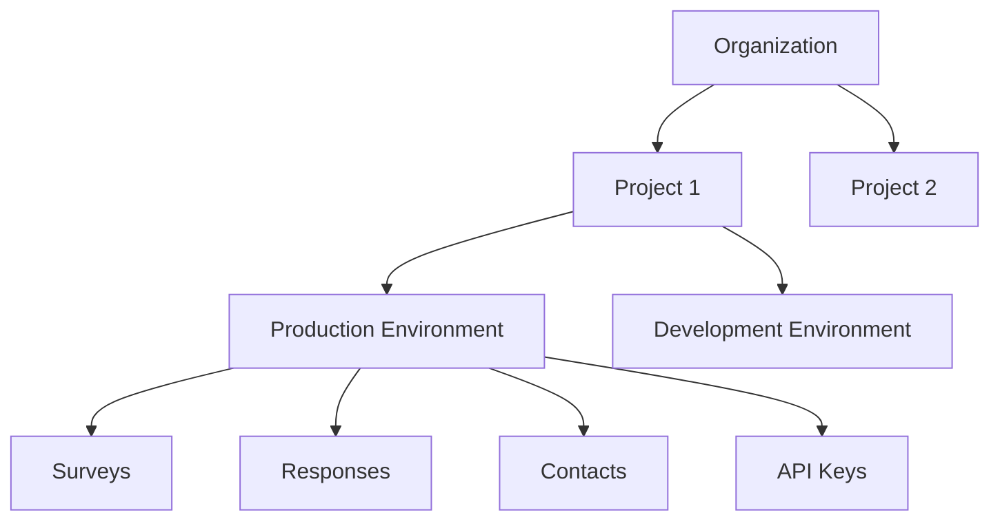
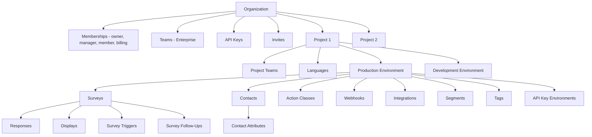

Formbricks implements a single-database, multi-tenant architecture designed to support multiple tenants, each with their own isolated set of surveys, contacts, and response data. All deployments — both Formbricks Cloud and self-hosted instances — use the same **Organization → Project → Environment** hierarchy for tenant separation. Row-level filtering at the ORM layer ensures strict data isolation between tenants without requiring separate databases or schemas.

<Note>
  The tenant separation model described on this page applies to **all Formbricks deployments**. Self-hosted instances typically operate with a single organization, while Formbricks Cloud supports multiple organizations in a shared infrastructure. The underlying isolation architecture is identical in both cases.
</Note>

Source: `packages/database/schema.prisma`

## Organizational Hierarchy

Formbricks organizes all platform resources into a three-level hierarchy. Each level provides an additional layer of isolation and configuration scoping, ensuring that data never leaks between tenants.

### Organization

The **Organization** is the top-level tenant boundary in Formbricks. Every resource in the system belongs to exactly one organization, and all billing, membership, and team management occurs at this level.

| Field | Type | Description |
|-------|------|-------------|
| `id` | `String` | Unique identifier (CUID) |
| `name` | `String` | Display name of the organization |
| `billing` | `Json` | Plan details including tier (Free, Startup, Scale, Enterprise), response limits, and MIU quotas |
| `whitelabel` | `Json` | Branding customization configuration (defaults to `{}`) |
| `isAIEnabled` | `Boolean` | Controls access to AI-powered features (defaults to `false`) |

Key relationships:

- **Memberships** — Users join an organization via the `Membership` model with a specific `OrganizationRole`
- **Projects** — Multiple projects can exist within a single organization
- **Teams** — Organization-level team entities for enterprise access control
- **Invites** — Pending membership invitations
- **API Keys** — Organization-scoped API keys for programmatic access

Source: `packages/database/schema.prisma` — `Organization` model (line ~665)

### Project

A **Project** is a logical grouping of surveys and configurations within an organization. Each project automatically receives two environments (production and development) upon creation.

| Setting | Type | Description |
|---------|------|-------------|
| `styling` | `Json` | Project-wide styling configuration (allows style overwrite by default) |
| `config` | `Json` | Project-specific configuration (defaults to `{}`) |
| `recontactDays` | `Int` | Default recontact delay for surveys (defaults to `7` days) |
| `placement` | `WidgetPlacement` | In-app survey widget placement (`bottomLeft`, `bottomRight`, `topLeft`, `topRight`, `center`) |
| `overlay` | `SurveyOverlay` | Survey overlay style (`none`, `light`, `dark`) |
| `linkSurveyBranding` | `Boolean` | Whether to display Formbricks branding in link surveys |
| `inAppSurveyBranding` | `Boolean` | Whether to display Formbricks branding in in-app surveys |
| `languages` | `Language[]` | Project-level language support for multi-language surveys |
| `clickOutsideClose` | `Boolean` | Whether clicking outside closes the survey widget (defaults to `true`) |
| `customHeadScripts` | `String?` | Custom HTML scripts for self-hosted link surveys |

Team assignments are managed through the `ProjectTeam` model, allowing teams to access specific projects with defined permission levels.

Source: `packages/database/schema.prisma` — `Project` model (line ~627)

### Environment

An **Environment** is the isolation context within a project where all operational resources live. Each project always has exactly two environments, defined by the `EnvironmentType` enum: `production` and `development`.

Resources scoped to each environment include:

- **Surveys** and their responses, displays, triggers, and follow-ups
- **Contacts** and their attributes
- **Action classes** for survey triggering
- **API key access** via the `ApiKeyEnvironment` junction table
- **Webhooks** for event notifications
- **Tags** for response categorization
- **Segments** for contact targeting
- **Integrations** (Slack, Google Sheets, Notion, Airtable)

The `appSetupCompleted` boolean tracks whether the JavaScript SDK has been successfully initialized in the environment.

Source: `packages/database/schema.prisma` — `Environment` model (line ~581)

### Detailed Resource Hierarchy

The following diagram shows the complete resource ownership chain from organization down to individual survey resources:

For a complete reference of all database models and their relationships, see the [Database Model](/development/technical-handbook/database-model) documentation.

## Data Isolation Patterns

Formbricks enforces data isolation through multiple complementary patterns that prevent cross-tenant data leakage at every layer of the application.

### Row-Level Security Via ID Filtering

All database queries filter by the appropriate scoping identifier — `organizationId`, `projectId`, or `environmentId` — ensuring that tenants can only access their own data. This filtering is enforced at the Prisma ORM level, making cross-tenant data leakage impossible through normal application code paths.

Key enforcement mechanisms:

- **Foreign key constraints** enforce referential integrity between all models in the hierarchy
- **Cascading deletes** ensure complete data cleanup when a tenant entity is removed:
  - Deleting an **Organization** cascades through Projects → Environments → Surveys → Responses (and all associated resources)
  - Deleting a **Project** cascades through Environments → all environment-scoped resources
  - Deleting an **Environment** cascades through all resources within that environment
- **Unique constraints** prevent naming collisions within a scope (e.g., `@@unique([organizationId, name])` on `Project`)
- **Indexed queries** ensure filtering performance with indexes such as `@@index([environmentId])`, `@@index([organizationId])`, and `@@index([projectId])`

Source: Prisma schema `onDelete: Cascade` directives throughout `packages/database/schema.prisma`

### API Key Scoping

API keys provide programmatic access to Formbricks resources with fine-grained scoping:

| Model | Scope | Description |
|-------|-------|-------------|
| `ApiKey` | Organization | API keys are created at the organization level with a hashed key and optional lookup hash |
| `ApiKeyEnvironment` | Environment | Junction table linking API keys to specific environments with granular permissions |

The `ApiKeyPermission` enum defines three permission levels:

| Permission | Description |
|------------|-------------|
| `read` | Read-only access to resources in the scoped environment |
| `write` | Read and write access to resources in the scoped environment |
| `manage` | Full management access including configuration changes |

A single API key can be granted different permission levels across different environments, allowing organizations to issue keys that have production read-only access but development write access, for example.

Source: `packages/database/schema.prisma` — `ApiKey` model (line ~751), `ApiKeyEnvironment` model (line ~783)

### Session Isolation

User sessions are scoped to the organization context:

- Sessions are per-user, with the active organization determining the resource access context
- Switching organizations changes the active context and the set of accessible projects, environments, and resources
- Users can be members of **multiple organizations simultaneously**, each with an independent role assignment
- The user's `OrganizationRole` within each organization determines their access level for that organization's resources

### Contact Data Scoping

Contact data is strictly isolated at the environment level:

- **Contacts** belong to a single environment and cannot be shared between environments or projects
- **Contact attributes** are stored per-environment via the `ContactAttributeKey` model, which defines available attribute keys for each environment
- **Segments** are defined per-environment using filter rules against contact attributes
- There is no mechanism to query or reference contacts across environment boundaries

Source: `packages/database/schema.prisma` — `Contact`, `ContactAttributeKey`, `Segment` models

## Multi-Tenancy Implementation

Formbricks uses a single-database multi-tenancy architecture where all tenants share the same PostgreSQL instance and schema. Tenant isolation is achieved through row-level filtering rather than schema-level or database-level separation.

### Single Database Architecture

The platform runs on a single **PostgreSQL 17** database with the `pgvector` extension for AI-powered features. All tenant data coexists in the same tables, with isolation enforced by indexed foreign key columns.

Key architectural decisions:

- **Row-level filtering** at the ORM layer scopes all queries to the appropriate tenant
- **Indexed foreign keys** ensure filtering performance does not degrade as the number of tenants grows
  - `@@index([environmentId])` on surveys, contacts, action classes, webhooks, tags, segments, and integrations
  - `@@index([organizationId])` on projects and API keys
  - `@@index([projectId])` on environments
- **No schema-level isolation** — all tenants share the same table structures
- **Prisma ORM** (`prisma` v6.14.0) manages schema migrations and query generation

Source: `packages/database/schema.prisma` — index definitions throughout

### Organization Membership Roles

Access control within an organization is managed through the `Membership` model, which links a `User` to an `Organization` with a specific role. The `OrganizationRole` enum defines four roles:

| Role | Description |
|------|-------------|
| `owner` | Full access to all organization resources, including member management and billing |
| `manager` | Can manage members, invite new users, and access billing settings |
| `member` | Basic access to organization resources (surveys, responses, contacts) |
| `billing` | Access limited to billing information and subscription management |

Each membership record also tracks whether the user has accepted the invitation via the `accepted` boolean field. Users can hold different roles in different organizations when they belong to multiple tenants.

Source: `packages/database/schema.prisma` — `Membership` model (line ~697), `OrganizationRole` enum (line ~682)

### Team-Based Access Control

<Note>
  Team-based access control is an enterprise feature that requires an active enterprise license.
</Note>

Teams provide an additional layer of access control within an organization, enabling fine-grained project-level permissions for groups of users.

**Team Model**

Teams are organization-level entities created via the `Team` model. Each team has a unique name within its organization (enforced by `@@unique([organizationId, name])`).

**Team Membership**

Users join teams through the `TeamUser` model with one of two roles defined by the `TeamUserRole` enum:

| Role | Description |
|------|-------------|
| `admin` | Full team management including adding/removing members and changing roles |
| `contributor` | Standard team member with access to team-assigned projects |

**Project Access**

Teams are granted access to specific projects via the `ProjectTeam` model. The `ProjectTeamPermission` enum defines three permission levels:

| Permission | Description |
|------------|-------------|
| `read` | Read-only access to the project and its environments |
| `readWrite` | Read and write access to surveys, responses, and configuration |
| `manage` | Full project management including settings, team assignments, and environment configuration |

Source: `packages/database/schema.prisma` — `Team` model (line ~946), `TeamUser` model (line ~970), `ProjectTeam` model (line ~995); `apps/web/modules/ee/teams/`

### Project-Level Team Assignments

Projects can be assigned to one or more teams via the `ProjectTeam` junction table, with each assignment carrying a specific permission level. This enables flexible access patterns:

- A single team can access **multiple projects** with different permission levels per project
- A single project can be accessible to **multiple teams**, each with their own permission level
- Projects that are **not assigned to any team** follow the organization-level access rules — all organization members can access them based on their `OrganizationRole`
- The `@@id([projectId, teamId])` composite primary key ensures each team-project assignment is unique

## Environment Switching And Data Segregation

Each project always has exactly **two environments** — `production` and `development` — which are created automatically when a project is created. These environments provide complete resource isolation for safe testing and staged rollouts.

Resources that are independently managed per environment:

| Resource | Isolation Behavior |
|----------|-------------------|
| Surveys | Each environment has its own set of surveys with independent configurations |
| Responses | Response data is collected and stored separately per environment |
| Contacts | Contact profiles and attributes are independent between environments |
| API Keys | API key environment access is granted per-environment via `ApiKeyEnvironment` |
| Integrations | Third-party integrations (Slack, Google Sheets, Notion, Airtable) are configured independently |
| Webhooks | Webhook endpoints fire independently based on events in their specific environment |
| Segments | Contact segments and targeting rules are defined per-environment |
| Action Classes | Survey trigger actions are scoped to each environment |
| Tags | Response tags are managed independently per environment |

Key behaviors:

- **Changes in development have zero impact on production** — the two environments share no runtime state
- **Surveys can be promoted** by copying them from the development environment to the production environment
- **SDK initialization** is tracked independently via the `appSetupCompleted` flag on each environment
- **Use case**: Test new surveys, targeting rules, and integrations in the development environment before deploying to production

## Billing And Quota Isolation

Billing is managed at the **organization level** through the `billing` JSON field on the `Organization` model. Each organization's plan determines the resource limits available across all of its projects and environments.

### Plan Tiers

| Plan | Projects | Responses/Month | Monthly Identified Users (MIU) |
|------|----------|-----------------|-------------------------------|
| **Free** | 3 | 1,500 | 2,000 |
| **Startup** | 3 | 5,000 | 7,500 |
| **Scale** | Custom | Custom | Custom |
| **Enterprise** | Custom | Custom | Custom |

### Quota Enforcement

Survey-level quotas are enforced through dedicated database models:

- **`SurveyQuota`** — Defines named quota rules with limits, logic conditions, and actions (such as showing an ending card when the quota is reached)
- **`ResponseQuotaLink`** — Junction table that tracks which responses have been counted towards specific quotas and their screening status

Quotas operate at the survey level within an environment, allowing organizations to set granular limits on individual surveys while the overall organization-level plan limits apply globally across all projects and environments.

Source: `packages/database/schema.prisma` — `SurveyQuota` model (line ~428), `ResponseQuotaLink` model (line ~452)
