## Overview

This document provides a comprehensive comparison of Typeform and Formbricks embed and share deployment options. The goal is to map every Typeform embed and share capability to its Formbricks equivalent, identify gaps, and propose implementation strategies for achieving full parity.

Formbricks implements its share and embed functionality through a multi-tab modal system located in the `shareEmbedModal` directory. This system comprises 18 component files organized into share-via tabs, share-settings tabs, and supporting utility components.

Source: `apps/web/app/(app)/environments/[environmentId]/surveys/[surveyId]/(analysis)/summary/components/shareEmbedModal/`

**Key findings:**
- Formbricks covers **3 of 6** Typeform embed options (standard, full-page, popup) and **all 8** Typeform share options
- **3 embed variants are missing:** slider, popover, and side tab
- Formbricks offers **4 additional features** not available in Typeform: App/SDK integration, behavior-triggered dynamic popup, built-in documentation links, and full custom HTML embed code

For the overall parity assessment across all 8 capability areas, see the [Gap Report](/development/typeform-parity/gap-report).

## Formbricks Current Embed and Share Options

The Formbricks share modal is built around the `ShareSurveyModal` component, which renders a sidebar-based tab navigation system. Tabs are organized into two groups: **Share Via** (distribution channels) and **Share Settings** (link configuration).

Source: `apps/web/app/(app)/environments/[environmentId]/surveys/[surveyId]/(analysis)/summary/components/share-survey-modal.tsx`

### Share Via Tabs

These tabs provide the primary distribution and embed mechanisms:

| # | Tab Component | Description | Key Capabilities |
|---|---|---|---|
| 1 | **Anonymous Links Tab** (`anonymous-links-tab.tsx`) | Public survey links with no authentication required | Multi-use and single-use link modes, encryption toggle, batch link generation, link disable/reset functionality |
| 2 | **Personal Links Tab** (`personal-links-tab.tsx`) | Single-use personalized links tied to contact segments | Segment-based targeting, expiry date picker (minimum tomorrow), CSV export of generated links, license-gated contacts feature |
| 3 | **Website Embed Tab** (`website-embed-tab.tsx`) | Script-based website embedding via iframe | Iframe code generation with embed mode toggle (`?embed=true`), clipboard copy with toast notification |
| 4 | **Email Tab** (`email-tab.tsx`) | Email-based survey distribution | Preview and embed code views, DOMPurify sanitization, send preview email, clipboard copy |
| 5 | **Social Media Tab** (`social-media-tab.tsx`) | Social media sharing across multiple platforms | LinkedIn, Threads, Facebook, Reddit, X (Twitter) with per-platform source tracking query parameters |
| 6 | **QR Code Tab** (`qr-code-tab.tsx`) | QR code generation for survey links | QRCodeStyling with 184×184 preview, high-resolution download, error state handling via `@formbricks/logger` |
| 7 | **Dynamic Popup Tab** (`dynamic-popup-tab.tsx`) | In-app popup triggered by user actions | Attribute-based targeting, code/no-code triggers (click, page view, exit intent, 50% scroll), recontact options |

### Share Settings Tabs

These tabs configure link behavior and appearance:

| # | Tab Component | Description | Key Capabilities |
|---|---|---|---|
| 8 | **Link Settings Tab** (`link-settings-tab.tsx`) | Link configuration options | Localized title, description, and OG image metadata, PIN protection, single-use mode, read-only controls |
| 9 | **Pretty URL Tab** (`pretty-url-tab.tsx`) | Custom vanity URLs for surveys | Slug sanitization, copy/share/remove workflows, delete confirmation dialog |
| 10 | **Custom HTML Tab** (`custom-html-tab.tsx`) | Custom HTML head scripts for embed customization | React Hook Form integration, tab toggle, textarea for script editing, security warning, persisted via `updateSurveyAction` |

<Note>
  On **Formbricks Cloud**, the Pretty URL and Custom HTML tabs are hidden from the share modal. These features are available only in self-hosted deployments. This is controlled by the `isFormbricksCloud` flag in the `ShareSurveyModal` component.
</Note>

### Additional Components

| # | Component | Description |
|---|---|---|
| 11 | **App Tab** (`app-tab.tsx`) | Framework-specific SDK integration with documentation links for HTML, React.js, iOS (Swift), Android (Kotlin), and React Native SDKs. Displays survey display criteria, trigger configuration, and recontact settings |
| 12 | **Share View** (`share-view.tsx`) | Responsive sidebar navigation component organizing tabs into Share Via and Share Settings groups. Handles desktop/mobile responsive layout switching at 1024px breakpoint |
| 13 | **Disable Link Modal** (`disable-link-modal.tsx`) | Confirmation dialog for deactivating multi-use or single-use survey links |
| 14 | **Success View** (`success-view.tsx`) | Post-publication celebration view with share link display and call-to-action grid for sharing, personal links, alerts, and integrations |
| 15 | **Tab Container** (`tab-container.tsx`) | Layout wrapper providing heading, description, and overflow-managed content area for each tab |
| 16 | **Documentation Links** (`documentation-links.tsx`, `documentation-links-section.tsx`) | Shared Alert-based presentation for outbound documentation links, using localized titles and `target="_blank"` links |

Source: `apps/web/app/(app)/environments/[environmentId]/surveys/[surveyId]/(analysis)/summary/components/shareEmbedModal/`

## Typeform Embed Options

Typeform provides 6 embed deployment options for integrating forms into external websites and applications:

| # | Embed Type | Description | Behavior |
|---|---|---|---|
| 1 | **Standard Embed** | Inline iframe embed within a web page | Form renders directly inside a container element on the page; scrolls with page content |
| 2 | **Full-page Embed** | Takes over the entire browser viewport | Form occupies 100% width and height of the page; typically used as a standalone landing page |
| 3 | **Popup** | Opens as a centered modal dialog | Triggered by a button click or JavaScript call; overlays the page with a backdrop |
| 4 | **Slider** | Slides in from the side of the page | Panel slides in from the left or right edge; partially covers the underlying page |
| 5 | **Popover** | Small floating button that expands into a form | A persistent floating button (typically bottom-right) that opens the form when clicked |
| 6 | **Side Tab** | Fixed tab on the edge of the page | A vertical tab fixed to the left or right side of the viewport that opens the form on click |

## Embed Option Comparison

The following table maps each Typeform embed option to its Formbricks equivalent:

| Typeform Option | Formbricks Equivalent | Status | Notes |
|---|---|---|---|
| Standard Embed (inline) | Website Embed Tab / Custom HTML Tab | ✅ Full | Iframe-based inline embed with embed mode toggle (`?embed=true` for minimal styling). Source: `website-embed-tab.tsx` |
| Full-page Embed | Anonymous Links (full-page mode) | ✅ Full | Anonymous link opens a full-page survey experience. Source: `anonymous-links-tab.tsx` |
| Popup | Dynamic Popup Tab | ✅ Full | Action-triggered popup with attribute-based targeting, code/no-code triggers. Source: `dynamic-popup-tab.tsx` |
| Slider | — | ❌ Missing | Side-sliding panel embed not available in Formbricks |
| Popover | — | ❌ Missing | Floating button + expandable form widget not available |
| Side Tab | — | ❌ Missing | Fixed edge-of-page tab not available |

**Parity score: 3/6 embed options (50%)**

<Warning>
  Three Typeform embed variants — **slider**, **popover**, and **side tab** — have no equivalent in Formbricks. These are specialized widget-style embeds that allow forms to be triggered from persistent UI elements on the page without requiring a full modal overlay or inline iframe. Implementing these would expand Formbricks' embed flexibility to match Typeform's full deployment model.
</Warning>

## Share Option Comparison

The following table maps each Typeform share option to its Formbricks equivalent:

| Typeform Option | Formbricks Equivalent | Status | Notes |
|---|---|---|---|
| Public Link | Anonymous Links Tab | ✅ Full | Direct mapping — public URL with no authentication. Source: `anonymous-links-tab.tsx` |
| Unique Link per Respondent | Personal Links Tab | ✅ Full | Single-use personalized links with segment targeting and expiry dates. Source: `personal-links-tab.tsx` |
| Email Distribution | Email Tab | ✅ Full | HTML email embed with preview, send preview, and code copy. Source: `email-tab.tsx` |
| QR Code | QR Code Tab | ✅ Full | QRCodeStyling with preview and high-resolution download. Source: `qr-code-tab.tsx` |
| Social Media Sharing | Social Media Tab | ✅ Full | LinkedIn, Threads, Facebook, Reddit, X with source tracking. Source: `social-media-tab.tsx` |
| Custom Branding on URL | Pretty URL Tab | ✅ Full | Custom vanity URL slug with validation and CRUD operations. Source: `pretty-url-tab.tsx` |
| Password/PIN Protection | Link Settings Tab | ✅ Full | PIN-based access protection configurable in link settings. Source: `link-settings-tab.tsx` |
| Single-use Links | Link Settings (single-use mode) | ✅ Full | Single-use link toggle with optional encryption, batch generation. Source: `anonymous-links-tab.tsx` |

**Parity score: 8/8 share options (100%)**

## Gap Analysis — Missing Embed Variants

Three Typeform embed types have no equivalent in Formbricks. Each is documented below with implementation complexity and proposed approach:

### Slider Embed

A panel that slides in from the left or right edge of the page, partially covering the underlying content.

- **Implementation complexity:** Medium
- **User experience:** User clicks a trigger element → a panel slides in from the page edge → form renders inside the sliding panel → user can dismiss by clicking outside or pressing Escape
- **Proposed module:** New `slider-embed-tab.tsx` component in `shareEmbedModal/`
- **Technical approach:** Extend the website embed SDK to support a `slider` placement mode. Generate JavaScript snippet code that creates a fixed-position panel with CSS transition animation. The embed code would include configurable options for slide direction (left/right), panel width, and trigger element selector
- **Dependencies:** Changes to `@formbricks/js` SDK or new embed script generation

### Popover Embed

A small floating button (typically positioned at the bottom-right corner) that expands into the full form when clicked.

- **Implementation complexity:** Medium
- **User experience:** A persistent floating button appears on the page → clicking the button expands/opens the form in a positioned container → the form can be dismissed back to the button state
- **Proposed module:** New `popover-embed-tab.tsx` component in `shareEmbedModal/`
- **Technical approach:** Generate an embed snippet that creates a fixed-position floating action button with configurable icon, color, and position. On click, the button transitions into an expanded form container. This requires a new embed script or SDK mode
- **Dependencies:** New embed mode in `@formbricks/js` SDK, custom CSS for floating button styling

### Side Tab Embed

A fixed vertical tab anchored to the left or right edge of the viewport that opens the form when clicked.

- **Implementation complexity:** Low–Medium
- **User experience:** A vertical tab label (e.g., "Feedback") is permanently visible on the page edge → clicking the tab opens the form → the form can be closed to return to the tab-only state
- **Proposed module:** Extension of website embed options in `website-embed-tab.tsx` or new `side-tab-embed-tab.tsx`
- **Technical approach:** Generate a JavaScript/CSS snippet that creates a rotated text element fixed to the viewport edge. On click, it triggers the existing popup or slider embed mechanism. This could be implemented as a wrapper around the existing dynamic popup functionality
- **Dependencies:** Minimal — primarily CSS/JS snippet generation, could leverage existing popup infrastructure

## Formbricks-only Features (Beyond Typeform)

Formbricks includes several embed and share capabilities that go **beyond** what Typeform offers:

<Note>
  The following features are unique to Formbricks and represent areas where the platform exceeds Typeform's embed and share capabilities.
</Note>

### App and SDK Integration

The **App Tab** provides native framework integration through official SDKs, enabling surveys to be embedded directly into applications without iframe overhead:

- **HTML** — Script tag embed for any website
- **React.js** — React component integration
- **iOS (Swift)** — Native iOS SDK
- **Android (Kotlin)** — Native Android SDK
- **React Native** — Cross-platform mobile SDK

This tab also displays survey display criteria including trigger configuration (click, page view, exit intent, 50% scroll), audience targeting (percentage, specific users), and recontact timing settings.

Source: `apps/web/app/(app)/environments/[environmentId]/surveys/[surveyId]/(analysis)/summary/components/shareEmbedModal/app-tab.tsx`

### Behavior-triggered Dynamic Popup

The Formbricks **Dynamic Popup** is more advanced than Typeform's basic popup embed. While Typeform's popup is triggered by a simple button click or JavaScript call, Formbricks' dynamic popup supports:

- **Attribute-based targeting** — Display surveys based on user attributes and segment membership
- **Code and no-code triggers** — Click events, page view, exit intent, and 50% scroll triggers
- **Recontact options** — Configure how often the same user sees the survey (time-based delay per survey or per project)
- **Display limits** — Control the percentage of eligible users who see the survey

Source: `apps/web/app/(app)/environments/[environmentId]/surveys/[surveyId]/(analysis)/summary/components/shareEmbedModal/dynamic-popup-tab.tsx`

### Built-in Documentation Links

Every embed and share tab includes contextual documentation references through the `DocumentationLinksSection` and `DocumentationLinks` components. These provide localized links to relevant framework guides, targeting documentation, and integration references directly within the share modal.

Source: `apps/web/app/(app)/environments/[environmentId]/surveys/[surveyId]/(analysis)/summary/components/shareEmbedModal/documentation-links-section.tsx`

### Full Custom HTML Embed Code

The **Custom HTML Tab** allows self-hosted Formbricks deployments to inject custom `<head>` scripts into the survey page. This goes beyond standard embed customization by allowing full control over the page's HTML head section, enabling custom analytics, tracking pixels, or third-party script injection.

Source: `apps/web/app/(app)/environments/[environmentId]/surveys/[surveyId]/(analysis)/summary/components/shareEmbedModal/custom-html-tab.tsx`

## Embed and Share Mapping Diagram

The following diagram illustrates the mapping between Typeform embed options and Formbricks equivalents, highlighting gaps and Formbricks-only features:

```mermaid
graph TD
    subgraph Typeform Embed Options
        T1[Standard Embed]
        T2[Full-page Embed]
        T3[Popup]
        T4[Slider]
        T5[Popover]
        T6[Side Tab]
    end

    subgraph Formbricks Embed and Share
        F1[Website Embed / Custom HTML]
        F2[Anonymous Link - Full Page]
        F3[Dynamic Popup]
        F4[Missing — Slider]
        F5[Missing — Popover]
        F6[Missing — Side Tab]
        F7[App / SDK Tab]
        F8[Email Tab]
        F9[QR Code Tab]
        F10[Social Media Tab]
        F11[Personal Links Tab]
    end

    T1 -->|"✅ Full"| F1
    T2 -->|"✅ Full"| F2
    T3 -->|"✅ Full"| F3
    T4 -.->|"❌ Gap"| F4
    T5 -.->|"❌ Gap"| F5
    T6 -.->|"❌ Gap"| F6
```

## Combined Parity Summary

| Category | Formbricks Coverage | Typeform Coverage | Parity Score | Status |
|---|---|---|---|---|
| Embed Options | 3 equivalent + 4 unique | 6 total | 3/6 (50%) | 🟡 Partial |
| Share Options | 8 equivalent + 0 gaps | 8 total | 8/8 (100%) | ✅ Full |
| **Overall** | **11 equivalent + 4 unique** | **14 total** | **11/14 (~79%)** | 🟡 Partial |

The overall embed and share parity stands at approximately **75–79%** when considering all deployment options. The share options are at full parity, while the embed options have 3 gaps that require new implementations.

## Implementation Recommendations

The 3 missing embed variants should be prioritized based on implementation effort and user impact:

| Priority | Embed Variant | Effort | Impact | Recommendation |
|---|---|---|---|---|
| 1 | Side Tab | Low–Medium | Medium | Implement first — can leverage existing popup infrastructure with CSS modifications |
| 2 | Slider | Medium | Medium | Implement second — requires new panel animation logic but similar to popup |
| 3 | Popover | Medium | Medium | Implement third — requires new floating button component and expand/collapse logic |

All 3 variants should be implemented as new tab components in the `shareEmbedModal/` directory, each generating a JavaScript embed snippet with configurable options. The existing `@formbricks/js` SDK should be extended to support these new placement modes.

For the full implementation timeline, see the [Sprint Roadmap](/development/typeform-parity/sprint-roadmap).

## Related Documentation

- [Embed Surveys User Guide](/xm-and-surveys/surveys/link-surveys/embed-surveys) — Current user-facing embed documentation with iframe examples and email embedding instructions
- [Gap Report](/development/typeform-parity/gap-report) — Central hub for all 8 capability area analyses
- [Sprint Roadmap](/development/typeform-parity/sprint-roadmap) — Phased implementation plan including embed/share enhancements in Sprint 3
