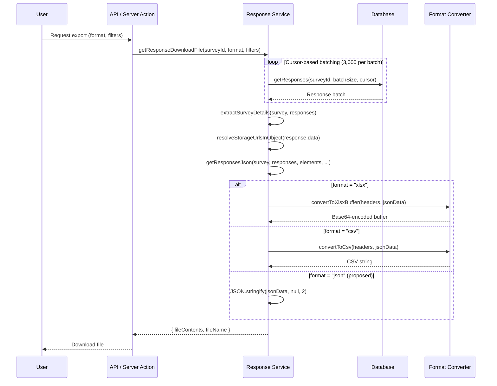

## Overview

This document provides a detailed comparison of response export capabilities between Typeform and Formbricks. It analyzes the existing Formbricks export infrastructure, identifies capability gaps, and defines lossless export validation procedures to ensure complete data fidelity across all export formats.

<Warning>
  **AAP Constraint — Lossless Export:** Response export must be lossless. This document defines data fidelity metrics and validation procedures ensuring that every response field present in the database appears in the export without truncation, rounding, or encoding loss.
</Warning>

The primary gap identified is the absence of a direct JSON export format. Formbricks currently supports CSV and XLSX exports through a robust batched streaming pipeline, while Typeform provides all three formats (CSV, XLSX, JSON) via its Responses API.

For the high-level summary of this capability area, see the [Gap Report — Export Parity Summary](/development/typeform-parity/gap-report#export-parity-summary).

## Current Formbricks Export Infrastructure

Formbricks implements response export through the `getResponseDownloadFile` function, which provides a complete pipeline from database retrieval through format conversion.

Source: `apps/web/lib/response/service.ts:L342-443`

### Function Signature

```typescript
export const getResponseDownloadFile = async (
  surveyId: string,
  format: "csv" | "xlsx",
  filterCriteria?: TResponseFilterCriteria
): Promise<{ fileContents: string; fileName: string }>
```

The function accepts a survey ID, a format specifier limited to `"csv"` or `"xlsx"`, and optional filter criteria. It returns an object containing the file contents (as a string for CSV, or base64-encoded buffer for XLSX) and a generated file name.

### Cursor-based Batch Streaming

The export pipeline processes responses in batches of **3,000** using cursor-based pagination. This design avoids expensive `COUNT + OFFSET` queries on large datasets by using the last response ID as a cursor for the next batch.

```typescript
const batchSize = 3000;
const responses: TResponse[] = [];
let cursor: string | undefined = undefined;
let hasMore = true;

while (hasMore) {
  const batch = await getResponses(surveyId, batchSize, 0, filterCriteria, cursor);
  responses.push(...batch);

  if (batch.length < batchSize) {
    hasMore = false;
  } else {
    cursor = batch[batch.length - 1].id;
  }
}
```

Source: `apps/web/lib/response/service.ts:L355-372`

Responses are sorted by `createdAt` descending with a secondary sort by `id` descending for consistent pagination ordering.

### Dynamic Header Generation

Column headers are dynamically built based on the survey structure using the `extractSurveyDetails` utility. The header set includes:

**Standard fields (always present):**

| Column | Description |
|---|---|
| `No.` | Sequential row number |
| `Response ID` | Unique response identifier (CUID2) |
| `Timestamp` | Formatted creation date-time |
| `Finished` | Completion status (`"Yes"` / `"No"`) |
| `Survey ID` | Parent survey identifier |
| `Formbricks ID (internal)` | Contact ID if linked |
| `User ID` | Contact's user ID attribute |
| `Notes` | Not populated in current export |
| `Tags` | Comma-separated tag names |

**Dynamic fields (survey-dependent):**

| Field Category | Source | Format |
|---|---|---|
| Metadata fields | `response.meta` object | Flattened with `key - subKey` notation for nested objects |
| Element answers | Survey blocks → elements | Prefixed with element index and headline (e.g., `1. How satisfied are you?`) |
| Variables | `survey.variables` | Variable name as column header |
| Hidden fields | `survey.hiddenFields.fieldIds` | Field ID as column header |
| User attributes | `response.contactAttributes` | Attribute key as column header (app surveys only) |

**Conditional fields:**

| Field | Condition |
|---|---|
| `Quotas` | Included only when organization billing plan allows quotas (`isQuotasAllowed`) |
| `Verified Email` | Included only when `survey.isVerifyEmailEnabled` is `true` |

Source: `apps/web/lib/response/service.ts:L391-411`, `apps/web/lib/response/utils.ts:L663-695`

### Storage URL Resolution

Before format conversion, the pipeline resolves all storage URLs in response data using `resolveStorageUrlsInObject`. This ensures that file upload references (from `FileUpload` element types) are converted to accessible download URLs in the exported file.

Source: `apps/web/lib/response/service.ts:L412`

### Internal JSON Data Transformation

The `getResponsesJson` utility converts raw database responses into a flat `Record<string, string | number>[]` structure suitable for tabular export. This intermediate JSON representation is used as input for both CSV and XLSX format converters.

Source: `apps/web/lib/response/utils.ts:L696-795`

**Key data transformations performed by `getResponsesJson`:**

- **Matrix elements**: Each matrix row becomes a separate column with `headline - row label` notation
- **Multiple choice and ranking elements**: Response value in the primary column, with a secondary `Option ID` column containing comma-separated choice identifiers
- **Array values**: Joined with semicolons for hidden fields containing arrays
- **Metadata objects**: Flattened into `key - subKey` columns for nested metadata entries
- **Variables**: Mapped by variable name from the `response.variables` object

### Format Conversion Utilities

Two converter functions in `apps/web/lib/utils/file-conversion.ts` handle the final format transformation:

**CSV conversion** uses the `@json2csv/node` `AsyncParser`:

```typescript
export const convertToCsv = async (
  fields: string[],
  jsonData: Record<string, string | number>[]
) => {
  const parser = new AsyncParser({ fields });
  return await parser.parse(jsonData).promise();
};
```

**XLSX conversion** uses the `xlsx` library:

```typescript
export const convertToXlsxBuffer = (
  fields: string[],
  jsonData: Record<string, string | number>[]
): Buffer => {
  const wb = xlsx.utils.book_new();
  const ws = xlsx.utils.json_to_sheet(jsonData, { header: fields });
  xlsx.utils.book_append_sheet(wb, ws, "Sheet1");
  return xlsx.write(wb, { type: "buffer", bookType: "xlsx" });
};
```

Source: `apps/web/lib/utils/file-conversion.ts:L1-30`

### File Naming Convention

Export files follow a sanitized naming pattern:

```
export-{sanitized-survey-name}-{yyyy-mm-dd-hh-mm-ss}.{format}
```

All characters are lowercased, and spaces are replaced with hyphens.

Source: `apps/web/lib/response/utils.ts:L640-646`

### Filter Criteria

Exports support the full `TResponseFilterCriteria` schema, enabling filtered exports with:

| Filter | Type | Description |
|---|---|---|
| `finished` | `boolean` | Filter by completion status |
| `responseIds` | `string[]` | Filter to specific response IDs |
| `createdAt` | `{ min?: Date, max?: Date }` | Date range filter |
| `contactAttributes` | `Record<string, { op, value }>` | Filter by contact attributes (equals/notEquals) |
| `data` | `Record<string, ...>` | Filter by response data with 20+ operators (lessThan, greaterThan, includesAll, equals, skipped, booked, isEmpty, etc.) |
| `tags` | `{ applied?: string[], notApplied?: string[] }` | Filter by tag presence |
| `meta` | `Record<string, ...>` | Filter by response metadata |
| `quotas` | `Record<string, ...>` | Filter by quota screening status |

Source: `packages/types/responses.ts:L202-290`

## Typeform Export Capabilities

Typeform provides response data export through both its web dashboard and the Responses API. The following capabilities serve as the comparison baseline for parity analysis.

**Supported export formats:**

| Format | Access Method | Description |
|---|---|---|
| CSV | Dashboard download + API | Tabular export with one row per response |
| XLSX | Dashboard download | Excel workbook with formatted columns |
| JSON | Responses API (`GET /forms/{form_id}/responses`) | Structured JSON with typed answer objects |

**JSON API capabilities:**

- REST endpoint returning paginated JSON responses
- Pagination via `page_size` (max 1,000) and `before`/`after` token parameters
- Filtering by `since` and `until` ISO 8601 timestamps
- Filtering by `completed` boolean for completion status
- Response objects include typed `answers` array with field metadata, `variables` object, `hidden` fields, and `calculated` scores
- Each answer object contains `field` reference (id, type, ref), `type` discriminator, and type-specific value properties

**Dashboard export features:**

- Date range selection for export window
- Partial vs. complete response filtering
- Direct download from the Responses tab

## Export Format Comparison

The following table provides a feature-by-feature comparison of export capabilities between Typeform and Formbricks:

| Feature | Typeform | Formbricks | Parity Status |
|---|---|---|---|
| CSV export | ✅ Dashboard + API | ✅ `convertToCsv` via `@json2csv/node` | ✅ Full |
| XLSX export | ✅ Dashboard | ✅ `convertToXlsxBuffer` via `xlsx` | ✅ Full |
| JSON export | ✅ Responses API | ❌ Not implemented | ❌ Missing |
| Filtered export | ✅ Date range, completion status | ✅ `TResponseFilterCriteria` with 20+ operators | ✅ Full |
| Batched streaming | ✅ Paginated API (1,000/page) | ✅ Cursor-based batching (3,000/batch) | ✅ Full |
| Date range filter | ✅ `since`/`until` parameters | ✅ `createdAt.min`/`createdAt.max` | ✅ Full |
| Completion status filter | ✅ `completed` parameter | ✅ `finished` boolean filter | ✅ Full |
| Response metadata | ✅ `metadata` object (browser, platform, network) | ✅ `meta` object (browser, OS, device, URL, action) | ✅ Full |
| Hidden fields in export | ✅ `hidden` object in response | ✅ Hidden fields as separate columns | ✅ Full |
| Variables in export | ✅ `variables` object in response | ✅ Variables as separate columns | ✅ Full |
| Tag-based filtering | ❌ Not available | ✅ `tags.applied`/`tags.notApplied` arrays | ✅ Formbricks-only |
| Quota-based filtering | ❌ Not available | ✅ `quotas` filter criteria (screened in/out) | ✅ Formbricks-only |
| Contact attribute filtering | ❌ Not available | ✅ `contactAttributes` with equals/notEquals | ✅ Formbricks-only |

**Parity assessment:** 7 of 8 core export features are at full parity. The single gap is JSON export, which Typeform provides via its Responses API but Formbricks does not currently support.

## JSON Export Gap Analysis

<Note>
  **Gap identified:** Formbricks does not currently provide a JSON export format. The `getResponseDownloadFile` function's `format` parameter is typed as `"csv" | "xlsx"`, with no JSON option available. This is the only format-level gap in export parity.
</Note>

### Current State

The `format` parameter in `getResponseDownloadFile` is restricted to two values:

```typescript
format: "csv" | "xlsx"
```

There is no direct JSON export endpoint or download option. However, the internal data pipeline already converts responses to a JSON-compatible structure via the `getResponsesJson` utility function before passing them to the CSV or XLSX converters. This means the core data transformation logic already exists — only the final format output step is missing.

Source: `apps/web/lib/response/service.ts:L344`, `apps/web/lib/response/utils.ts:L696-795`

### Proposed Implementation

The JSON export gap can be closed with minimal changes by extending the existing export pipeline:

<Steps>
  <Step title="Extend the format parameter type">
    Update the `format` parameter to accept JSON:
    ```typescript
    format: "csv" | "xlsx" | "json"
    ```
  </Step>
  <Step title="Add JSON branch to format conversion">
    After the existing `getResponsesJson` call (which already produces the intermediate JSON data), add a conditional branch:
    ```typescript
    if (format === "json") {
      fileContents = JSON.stringify(jsonData, null, 2);
    } else if (format === "xlsx") {
      const buffer = convertToXlsxBuffer(headers, jsonData);
      fileContents = buffer.toString("base64");
    } else {
      fileContents = await convertToCsv(headers, jsonData);
    }
    ```
  </Step>
  <Step title="Update the file name generator">
    The existing `getResponsesFileName` function already accepts a dynamic extension string, so it will automatically produce `export-{name}-{date}.json` when called with `"json"` as the extension parameter.
  </Step>
  <Step title="Expose via the download action">
    Update the server action that calls `getResponseDownloadFile` (in the response download flow) to accept `"json"` as a valid format option.
  </Step>
</Steps>

**Estimated complexity:** Low — the intermediate JSON data structure already exists. The implementation requires extending a union type, adding one conditional branch, and updating the UI format selector.

**Module affected:** `apps/web/lib/response/service.ts`

### Structured vs Flat JSON Output

A design decision for the JSON export is whether to output the **flat** tabular structure (matching CSV/XLSX column layout) or a **structured** nested format (matching the database response model):

| Approach | Description | Pros | Cons |
|---|---|---|---|
| **Flat JSON** | Array of `Record<string, string \| number>` matching CSV columns | Consistent with CSV/XLSX; simple implementation using existing `getResponsesJson` | Loses type information; nested metadata is flattened |
| **Structured JSON** | Array of typed response objects with nested `data`, `meta`, `variables` | Preserves data hierarchy; matches Typeform JSON API structure | Requires new serialization logic; different schema from CSV/XLSX |

**Recommendation:** Implement flat JSON first (using existing `getResponsesJson` output) for immediate parity, then consider a structured JSON API endpoint for advanced integrations that need typed answer objects comparable to Typeform's Responses API.

## Export Pipeline Architecture

The following sequence diagram illustrates the complete export pipeline, including the proposed JSON export branch:



Source: `apps/web/lib/response/service.ts:L342-443`, `apps/web/lib/utils/file-conversion.ts:L1-30`

## Lossless Export Validation Procedures

Per the AAP constraint that response export must be lossless, the following 7 data fidelity metrics and verification procedures define the validation framework for all export formats.

### Fidelity Metric 1 — Field Completeness

Every response field present in the database must appear in the exported file. No fields may be silently omitted.

**Verification:** Compare the set of non-null fields in each database response record against the set of populated columns in the corresponding export row. Report any fields present in the database but absent from the export.

**Current coverage:** The `extractSurveyDetails` utility generates headers for all metadata fields, element answers, variables, hidden fields, and user attributes. Conditional fields (Quotas, Verified Email) are included based on survey configuration.

### Fidelity Metric 2 — Value Accuracy

Exported values must exactly match stored values with no truncation, rounding, or encoding loss.

**Verification:** For each response, compare the exported value in every column against the original database value. Numeric values must be compared at full precision. String values must be byte-identical after accounting for format-specific escaping (e.g., CSV quoting).

**Known considerations:** The `getResponsesJson` function formats dates using `getFormattedDateTimeString`, which converts `Date` objects to a human-readable string. This is a lossy transformation for timestamps — the original `Date` precision is reduced to formatted string precision.

### Fidelity Metric 3 — Metadata Preservation

All metadata fields (timestamp, user agent, browser, operating system, device type, URL, country, action) must be included in the export.

**Verification:** Extract all keys from the `response.meta` object (including nested keys using `key - subKey` flattening) and verify that corresponding columns exist in the export with matching values.

### Fidelity Metric 4 — Hidden Field Completeness

Hidden field values passed via URL parameters must be exported completely, preserving all field IDs defined in `survey.hiddenFields.fieldIds`.

**Verification:** For each hidden field ID in the survey configuration, verify that a corresponding column exists in the export and that its value matches `response.data[fieldId]`.

### Fidelity Metric 5 — File Reference Integrity

`FileUpload` element references must resolve to valid, accessible URLs in the exported data.

**Verification:** Extract all values from `FileUpload`-type element columns. Each value should be a valid URL resolvable to the uploaded file. The `resolveStorageUrlsInObject` function handles URL resolution during the export pipeline.

### Fidelity Metric 6 — Unicode Support

Multi-language content must survive export without encoding corruption. This includes survey responses in non-Latin scripts, emoji characters, and special Unicode characters.

**Verification:** Create test responses containing characters from multiple Unicode blocks (Latin Extended, CJK Unified Ideographs, Arabic, Devanagari, Emoji). Export in each format and verify byte-level integrity of the Unicode content.

**Current implementation:** CSV export uses the `@json2csv/node` `AsyncParser` which produces UTF-8 output. XLSX export uses the `xlsx` library which supports Unicode natively.

### Fidelity Metric 7 — Round-trip Verification Procedure

The definitive validation is a full round-trip test confirming field-by-field equivalence between database records and exported data:

<Steps>
  <Step title="Export all responses">
    Export the complete response set for a survey in each supported format (CSV, XLSX, and proposed JSON).
  </Step>
  <Step title="Re-import exported data">
    Parse each exported file back into a structured data format (parse CSV rows, read XLSX cells, parse JSON objects).
  </Step>
  <Step title="Field-by-field comparison">
    For each response, compare every field value between the original database record and the re-imported export data.
  </Step>
  <Step title="Report discrepancies">
    Any mismatch must be reported with:
    - Response ID
    - Field path (column name)
    - Expected value (from database)
    - Actual value (from export)
    - Discrepancy type (missing, truncated, corrupted, type-changed)
  </Step>
  <Step title="Pass criteria">
    The export is considered lossless when zero discrepancies are found across all response fields in all formats, excluding documented format-specific transformations (e.g., date formatting).
  </Step>
</Steps>

## Export Format Specifications

### CSV Format

| Property | Specification |
|---|---|
| **Delimiter** | Comma (`,`) |
| **Encoding** | UTF-8 |
| **Quoting** | RFC 4180 compliant (fields containing commas, newlines, or quotes are enclosed in double quotes) |
| **Multi-value fields** | Semicolon-separated within a single cell (e.g., hidden field arrays: `value1; value2`) |
| **Multiple choice** | Selected option text in primary column; option IDs in secondary `Option ID` column |
| **Header row** | First row contains column headers generated by `extractSurveyDetails` |
| **Date format** | Formatted date-time string via `getFormattedDateTimeString` |
| **Library** | `@json2csv/node` `AsyncParser` |

Source: `apps/web/lib/utils/file-conversion.ts:L5-19`

### XLSX Format

| Property | Specification |
|---|---|
| **Worksheet** | Single worksheet named `"Sheet1"` |
| **Header row** | First row contains column headers matching CSV headers |
| **Cell types** | String and number types (determined by `xlsx` library auto-detection from the JSON data) |
| **Date columns** | Formatted as string (ISO 8601 formatted via `getFormattedDateTimeString`) |
| **Output** | Binary buffer encoded as base64 string for transport |
| **Library** | `xlsx` (`SheetJS`) with `json_to_sheet` conversion |

Source: `apps/web/lib/utils/file-conversion.ts:L22-30`

### JSON Format (Proposed)

| Property | Specification |
|---|---|
| **Structure** | Array of flat response objects (`Record<string, string \| number>[]`) |
| **Encoding** | UTF-8 |
| **Date format** | Formatted date-time string (matching CSV/XLSX for consistency) |
| **Indentation** | 2-space pretty-printed (`JSON.stringify(data, null, 2)`) |
| **Multi-value fields** | Semicolon-separated string (matching CSV representation) |
| **Nested metadata** | Flattened with `key - subKey` notation (matching CSV/XLSX column headers) |
| **File extension** | `.json` |

<Note>
  The proposed JSON format uses the flat tabular structure from `getResponsesJson` for consistency with CSV and XLSX exports. A future enhancement could provide a structured JSON API endpoint with typed answer objects for advanced API consumers, comparable to Typeform's Responses API.
</Note>

## Cross-references

- **[Gap Report](/development/typeform-parity/gap-report)** — High-level summary of export parity status within the overall Typeform parity initiative
- **[Response Export User Guide](/xm-and-surveys/surveys/general-features/response-export)** — User-facing documentation for configuring and using response exports
- **[Sprint Roadmap](/development/typeform-parity/sprint-roadmap)** — Implementation timeline for closing the JSON export gap
- **[Migration Safety](/development/typeform-parity/migration-safety)** — Procedures for safe schema changes when extending the export format parameter
