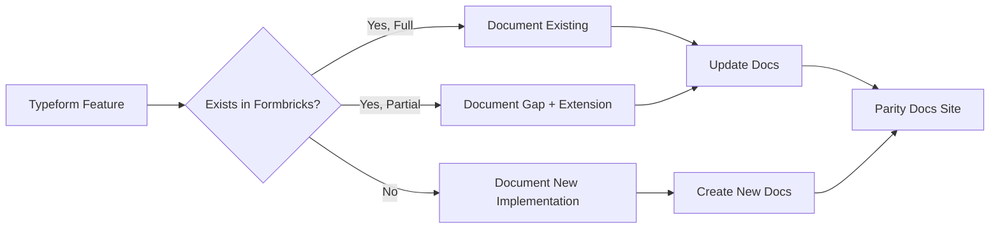

## Overview

This gap report is the central hub for the Typeform parity initiative. It provides a comprehensive analysis of all 8 in-scope capability areas, comparing the current Formbricks platform against Typeform's feature set. The goal is to transform Formbricks into a production-ready form and survey platform that is functionally equivalent to Typeform.

**Methodology:** Each capability area was evaluated by analyzing the Formbricks source code against Typeform's documented feature set. Parity is measured as a percentage of Typeform features that have equivalent implementations in Formbricks. Each area links to a dedicated deep-dive analysis page.

**Scope:** The analysis covers 8 capability areas — question types, conditional logic, hidden fields and answer piping, partial submissions, webhooks, response export, embed and share flows, and workspace governance.

For the phased implementation plan to close identified gaps, see the [Sprint Roadmap](/development/typeform-parity/sprint-roadmap).

<Note>
  **Phase 1 exclusions:** Video questions and Salesforce/HubSpot native integrations are explicitly excluded from Phase 1 scope. These will be addressed in a future phase.
</Note>

<Warning>
  The following constraints are mandatory for all parity work:
  - **Webhook structural parity** — Payloads must maintain structural parity with Typeform format.
  - **100% logic jump coverage** — Logic jump feature equivalence must be 100%.
  - **No broken existing forms** — Existing Formbricks forms must not be broken by any schema migration.
  - **Lossless export** — Response export must be lossless with complete data fidelity.
</Warning>

## Gap Analysis Methodology

The following flowchart illustrates the documentation approach applied to each Typeform feature during the analysis:

## Feature Parity Heatmap

The table below summarizes the parity status across all 8 capability areas. Each row includes a status indicator, an estimated parity percentage, and a link to the corresponding deep-dive page.

| # | Capability Area | Status | Parity % | Details | Deep Dive |
|---|---|---|---|---|---|
| 1 | Question Types | 🟡 Partial | ~88% (15/17) | 15 of 17 Typeform types covered. Missing: Payment, Opinion Scale | [Question Type Parity](/development/typeform-parity/question-type-parity) |
| 2 | Conditional Logic | ✅ Full+ | ~100%+ | All Typeform operators mapped. Formbricks has additional operators beyond Typeform | [Logic Parity](/development/typeform-parity/logic-parity) |
| 3 | Hidden Fields & Answer Piping | ✅ Full | ~95% | `TSurveyHiddenFields` with `recall:<id>` token system for answer piping | [Details Below](#hidden-fields-and-answer-piping) |
| 4 | Partial Submissions | ✅ Full | ~90% | `finished: false` capture in response service | [Details Below](#partial-submissions) |
| 5 | Webhooks | 🟡 Partial | ~70% | Different payload structure from Typeform; same trigger coverage | [Webhook Parity](/development/typeform-parity/webhook-parity) |
| 6 | Response Export | 🟡 Partial | ~67% (2/3) | CSV and XLSX available; JSON export missing | [Export Parity](/development/typeform-parity/export-parity) |
| 7 | Embed & Share | 🟡 Partial | ~75% | Anonymous links, popup, email ✅; Slider, popover, side tab ❌ | [Embed/Share Parity](/development/typeform-parity/embed-share-parity) |
| 8 | Workspace Governance | ✅ Full | ~90% | Organization→Project→Team hierarchy covers Typeform model | [Workspace Parity](/development/typeform-parity/workspace-parity) |

**Legend:** ✅ Full = feature parity achieved or exceeded | 🟡 Partial = gaps exist but core functionality is present | ❌ Missing = feature not implemented

## Question Type Parity Summary

Formbricks defines 15 element types in `TSurveyElementTypeEnum`:

`FileUpload`, `OpenText`, `MultipleChoiceSingle`, `MultipleChoiceMulti`, `NPS`, `CTA`, `Rating`, `Consent`, `PictureSelection`, `Cal`, `Date`, `Matrix`, `Address`, `Ranking`, `ContactInfo`

Source: `packages/types/surveys/constants.ts`

These 15 types provide direct or functional coverage for the majority of Typeform question types. Two Typeform types have no Formbricks equivalent and require new implementations:

| Gap Type | Description | Implementation |
|---|---|---|
| **Payment** | Accepts payments via Stripe during a survey | New `payment` element type with Stripe integration, currency support, and receipt handling |
| **Opinion Scale** | Configurable numeric scale (1–5, 1–7, 1–10) with custom labels | New `opinionScale` element type, differentiated from the fixed 0–10 NPS scale |

For the complete type-by-type mapping, Zod schema proposals, and implementation details, see the [Question Type Parity](/development/typeform-parity/question-type-parity) deep dive.

## Conditional Logic Parity Summary

Formbricks implements a comprehensive block-based conditional logic system with 32 operators defined in `ZSurveyLogicConditionsOperator`.

Source: `packages/types/surveys/logic.ts`

**Key architecture:**

- **Operators:** 32 condition operators covering equality, containment, comparison, submission state, date logic, set membership, and more.
- **Actions:** 3 action types — `jumpToBlock`, `calculate`, and `requireAnswer` — defined in `packages/types/surveys/blocks.ts`.
- **Condition groups:** Nested conditions with `and`/`or` connectors supporting complex branching logic.
- **Cyclic detection:** DFS-based cyclic logic detection prevents infinite loops in block navigation.

<Warning>
  **AAP constraint:** Logic jump coverage must be 100% feature-equivalent. The operator-to-operator mapping confirms full coverage, with Formbricks providing additional operators beyond Typeform's set (e.g., `isBooked`, `isPartiallySubmitted`, `isCompletelySubmitted`, `isSet`, `isNotSet`).
</Warning>

For the exhaustive operator mapping and 100% parity verification, see the [Logic Parity](/development/typeform-parity/logic-parity) deep dive.

## Hidden Fields and Answer Piping

**Status:** ✅ Full parity — both platforms support hidden fields and dynamic content substitution.

Formbricks implements hidden fields via the `TSurveyHiddenFields` type, which includes an `enabled` boolean flag and an optional `fieldIds` array of string identifiers. Field IDs are validated to contain only alphanumeric characters, hyphens, or underscores.

Source: `packages/types/surveys/types.ts` (lines 157–188)

**Answer piping** is implemented through the `recall:<id>` token system. When a survey headline or description contains a `recall:<elementId>` token, the `parseRecallInfo` function dynamically substitutes the referenced element's response value at render time. This provides feature equivalence with Typeform's answer piping (also called "Recall information" in Typeform), where previous answers can be inserted into subsequent question text.

| Feature | Typeform | Formbricks | Status |
|---|---|---|---|
| Hidden fields | URL parameters passed to form | `TSurveyHiddenFields` with `enabled` and `fieldIds` | ✅ Full |
| Answer piping | `{{field:ref}}` syntax | `recall:<id>` token with `parseRecallInfo` | ✅ Full |
| Variable piping | Hidden field calculations | `recall:<variableId>` token | ✅ Full |
| Dynamic content substitution | Real-time replacement in questions | `replaceHeadlineRecall` at render time | ✅ Full |

## Partial Submissions

**Status:** ✅ Full parity — server-side partial response capture is functionally equivalent.

Formbricks captures partial submissions by storing responses with `finished: false` in the database. The `updateResponse` function in the response service supports incremental updates with transaction client support, merging new answer data into existing partial responses.

Source: `apps/web/lib/response/service.ts` (lines 487–533)

**Key implementation details:**

- **Partial capture:** Each response is created when the respondent begins the survey and updated as they progress through blocks. The `finished` flag is set to `true` only upon completion.
- **Data merging:** The `updateResponse` function merges `data`, `ttc` (time-to-completion), and `variables` objects, preserving data from previous blocks while adding new entries.
- **TTC calculation:** Total time-to-completion is calculated via `calculateTtcTotal` only when `finished` is `true`.

| Feature | Typeform | Formbricks | Status |
|---|---|---|---|
| Partial response capture | Progress saved server-side | `finished: false` response record | ✅ Full |
| Incremental data merging | Answer-by-answer save | `updateResponse` with data/ttc/variables merge | ✅ Full |
| Resume capability | Respondent can resume later | Supported via `singleUseId` or `contactId` lookup | ✅ Full |

## Webhooks Parity Summary

Formbricks supports 3 webhook trigger types and 5 webhook sources, with HMAC-SHA256 signature verification.

**Trigger types** (from `PipelineTriggers` enum in `packages/database/schema.prisma`):

- `responseCreated` — fired when a new response is started
- `responseUpdated` — fired when an existing response is updated
- `responseFinished` — fired when a response is completed

**Webhook sources** (from `WebhookSource` enum in `packages/database/schema.prisma`):

`user`, `zapier`, `make`, `n8n`, `activepieces`

**Signature verification:** HMAC-SHA256 via `generateStandardWebhookSignature` in the pipeline route (`apps/web/app/api/(internal)/pipeline/route.ts`). Standard Webhooks headers include `webhook-id` (UUID v7), `webhook-timestamp` (Unix seconds), and `webhook-signature` (v1,base64 format).

Source: `apps/web/app/api/(internal)/pipeline/route.ts` (lines 95–145), `packages/database/zod/webhooks.ts`

<Warning>
  **AAP constraint:** Webhook payloads must maintain structural parity with Typeform format. The current Formbricks payload structure differs from Typeform's schema — the `data` object uses a flat key-value answer format whereas Typeform uses a typed `answers` array with field metadata. A field-by-field transformation specification is required.
</Warning>

For the complete payload comparison, trigger mapping, and transformation requirements, see the [Webhook Parity](/development/typeform-parity/webhook-parity) deep dive.

## Export Parity Summary

Formbricks currently supports 2 of 3 required export formats, with batch streaming for large datasets.

**Current export formats:**

| Format | Function | Status |
|---|---|---|
| CSV | `convertToCsv(headers, jsonData)` | ✅ Available |
| XLSX | `convertToXlsxBuffer(headers, jsonData)` | ✅ Available |
| JSON | — | ❌ Not implemented |

**Batch streaming architecture:** The `getResponseDownloadFile` function processes responses in batches of 3,000 using cursor-based pagination. This avoids expensive `COUNT + OFFSET` queries for large datasets, using the last response ID as a cursor for the next batch.

Source: `apps/web/lib/response/service.ts` (lines 342–441)

**Header generation** dynamically builds column headers based on survey structure, including standard fields (Response ID, Timestamp, Finished), metadata fields, element answers, variables, hidden fields, and user attributes. Conditional headers include Quotas (if billing plan allows) and Verified Email.

<Warning>
  **AAP constraint:** Response export must be lossless. All export formats must preserve complete data fidelity — every response field present in the database must appear in the export without truncation, rounding, or encoding loss. Verification procedures must confirm field-by-field equivalence between database records and exported data.
</Warning>

For the complete format comparison, JSON export gap analysis, and lossless validation procedures, see the [Export Parity](/development/typeform-parity/export-parity) deep dive.

## Embed and Share Parity Summary

Formbricks provides a comprehensive suite of share and embed options through 13+ components in the share modal, covering the majority of Typeform's deployment options.

**Available options:** Anonymous links, personal links, dynamic popup, website embed, custom HTML, email distribution, QR code, social media sharing, pretty URLs, app/SDK integration, and link settings (PIN protection, single-use, expiry).

Source: `apps/web/app/(app)/environments/[environmentId]/surveys/[surveyId]/(analysis)/summary/components/shareEmbedModal/`

**Missing embed variants** (3 Typeform options without Formbricks equivalents):

| Missing Embed | Description | Complexity |
|---|---|---|
| **Slider** | Slides form in from the side of the page | Medium |
| **Popover** | Floating button that expands into the form | Medium |
| **Side Tab** | Fixed tab on the edge of the page | Low–Medium |

**Formbricks-only features** (beyond Typeform): App/SDK integration for native framework embedding (React, Vue, etc.), behavior-triggered dynamic popup, and full HTML customization of embed code.

For the complete comparison table and implementation proposals, see the [Embed/Share Parity](/development/typeform-parity/embed-share-parity) deep dive.

## Workspace Governance Summary

Formbricks implements a robust organizational hierarchy that covers and exceeds Typeform's workspace model in role granularity.

**Formbricks hierarchy:** Organization → Project → Team → Role

- **Organization:** Top-level entity containing memberships, projects, teams, invites, and billing configuration.
- **Project:** Lives within an Organization, contains Environments (production, development).
- **Team:** Enterprise feature — manages access control for subsets of organization members.
- **OrganizationRole** enum: `owner`, `manager`, `member`, `billing` (4 roles vs Typeform's 3).

Source: `packages/database/schema.prisma`, `apps/web/modules/organization/`, `apps/web/modules/ee/teams/`

**Billing plan limits:**

| Plan | Responses | Monthly Identified Users |
|---|---|---|
| Free | 1,500 | 2,000 |
| Startup | 5,000 | 7,500 |
| Custom | Unlimited | Unlimited |

**Primary structural difference:** Formbricks uses a **Project → Environment** paradigm (enforcing dev/prod separation), while Typeform uses a **Folder hierarchy** paradigm (arbitrary nesting). These are different organizational models serving different purposes — not a direct parity gap requiring resolution.

For the complete governance comparison and role mapping, see the [Workspace Parity](/development/typeform-parity/workspace-parity) deep dive.

## Priority Ranking and Implementation Roadmap

The 8 capability areas are ranked by implementation priority based on gap severity and user impact:

| Priority | Capability Area | Rationale |
|---|---|---|
| 🔴 **Critical** | Question Types (Payment, Opinion Scale) | Core functionality gaps — these are fundamental question types that users expect |
| 🟠 **High** | Webhook Payload Parity | Integration compatibility — third-party integrations depend on consistent payload structure |
| 🟠 **High** | Response Export (JSON) | Data portability — JSON export is standard for API-driven workflows |
| 🟡 **Medium** | Logic Operator Verification | Confirm 100% parity through exhaustive operator mapping and test coverage |
| 🟡 **Medium** | Embed/Share Enhancements | User experience — slider, popover, and side tab options expand deployment flexibility |
| 🔵 **Lower** | Workspace Governance | Minor differences — Formbricks already exceeds Typeform in role granularity |
| ⚪ **Documentation Only** | Hidden Fields & Answer Piping | Already at parity — requires documentation updates only |
| ⚪ **Documentation Only** | Partial Submissions | Already at parity — requires documentation updates only |

For the detailed sprint-by-sprint implementation plan with timelines, dependency chains, and validation milestones, see the [Sprint Roadmap](/development/typeform-parity/sprint-roadmap).

## Cross-cutting Concerns

Several concerns apply across all capability areas and must be addressed throughout the implementation effort:

- **Schema migration safety:** All new element types (Payment, Opinion Scale) require safe migration procedures. The `TSurveyElementTypeEnum` is a TypeScript enum, and survey data is stored as JSON, so no SQL migration is needed for the type enum — but Zod validators must be updated to accept new types without breaking existing survey parsing. See [Migration Safety](/development/typeform-parity/migration-safety).

- **Backward compatibility:** Existing Formbricks forms must not be broken by any schema change. The `ZSurveyElements` discriminated union must continue to accept all 15 current element types unchanged. New types are additive — they extend but do not modify the existing union.

- **Lossless export:** All export formats (CSV, XLSX, and the proposed JSON format) must preserve complete data fidelity. Verification procedures must confirm field-by-field equivalence between database records and exported data.

<Note>
  **Phase 1 exclusions:** The following Typeform features are explicitly out of scope for Phase 1:
  - **Video questions** — Typeform's video question type is excluded from the initial parity effort.
  - **Salesforce/HubSpot native integrations** — Direct CRM integrations will be addressed in a future phase.
</Note>

## Deep Dive Navigation

Explore each capability area in detail:

<CardGroup cols={3}>
  <Card title="Question Type Parity" icon="list-check" href="/development/typeform-parity/question-type-parity">
    Element type mapping and gap analysis
  </Card>
  <Card title="Logic Parity" icon="code-branch" href="/development/typeform-parity/logic-parity">
    Operator-to-operator comparison
  </Card>
  <Card title="Webhook Parity" icon="webhook" href="/development/typeform-parity/webhook-parity">
    Payload structure comparison
  </Card>
  <Card title="Export Parity" icon="file-export" href="/development/typeform-parity/export-parity">
    Export format analysis
  </Card>
  <Card title="Embed/Share Parity" icon="share-nodes" href="/development/typeform-parity/embed-share-parity">
    Deployment options comparison
  </Card>
  <Card title="Workspace Parity" icon="building" href="/development/typeform-parity/workspace-parity">
    Governance model comparison
  </Card>
  <Card title="Migration Safety" icon="shield-check" href="/development/typeform-parity/migration-safety">
    Schema migration procedures
  </Card>
  <Card title="Sprint Roadmap" icon="road" href="/development/typeform-parity/sprint-roadmap">
    Phased implementation plan
  </Card>
</CardGroup>
