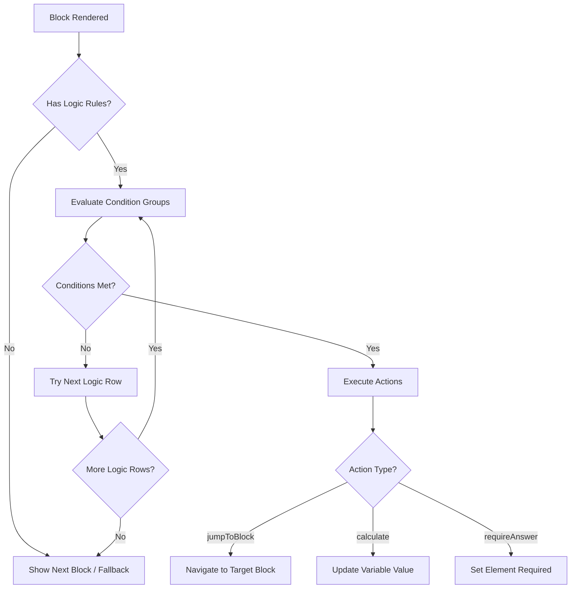

## Overview and Parity Constraint

This document provides an exhaustive operator-to-operator mapping between Typeform's logic jump system and the Formbricks conditional logic engine. The analysis verifies that every Typeform logic condition type has a functionally equivalent operator in Formbricks, satisfying the 100% feature-equivalent coverage requirement.

<Warning>
  **AAP constraint:** Logic jump coverage must be 100% feature-equivalent. Every Typeform logic condition type must map to a Formbricks equivalent. This document serves as the authoritative verification of that constraint.
</Warning>

The Formbricks conditional logic system is defined across two primary source files:

- **Operators and conditions:** `packages/types/surveys/logic.ts` — defines `ZSurveyLogicConditionsOperator` with 32 condition operators, condition group schemas, and variable calculate operators.
- **Blocks and actions:** `packages/types/surveys/blocks.ts` — defines `ZSurveyBlock`, `ZSurveyBlockLogic`, and 3 logic action types (`jumpToBlock`, `calculate`, `requireAnswer`).

Runtime evaluation is implemented in `packages/surveys/src/lib/logic.ts`, with comprehensive test coverage in `packages/surveys/src/lib/logic.test.ts`.

For the overall parity analysis, see the [Gap Report](/development/typeform-parity/gap-report). For the user-facing conditional logic guide, see the [Conditional Logic User Guide](/xm-and-surveys/surveys/general-features/conditional-logic).

## Formbricks Conditional Logic Architecture

Formbricks uses a **block-based logic system** where surveys are composed of blocks, each containing elements and optional logic rules. Logic is evaluated after each block submission and determines what the respondent sees next.

Source: `packages/types/surveys/blocks.ts`

### Blocks

Each block (`ZSurveyBlock`) contains the following fields:

| Field | Type | Description |
|---|---|---|
| `id` | `ZSurveyBlockId` (CUID) | Unique identifier for the block |
| `name` | `string` (min 1 char) | Required display name for the survey editor |
| `elements` | `ZSurveyElements` (min 1) | Array of survey elements (questions) within the block |
| `logic` | `ZSurveyBlockLogic[]` (optional) | Array of logic rows, each with conditions and actions |
| `logicFallback` | `ZSurveyBlockId` (optional) | Block to navigate to when no logic conditions are met |
| `buttonLabel` | `ZI18nString` (optional) | Custom label for the block's submit button |
| `backButtonLabel` | `ZI18nString` (optional) | Custom label for the block's back button |

Element IDs are enforced to be unique within each block via a `superRefine` validator.

### Logic Rows

Each logic row (`ZSurveyBlockLogic`) consists of:

- **`conditions`** — a `ZConditionGroup` defining when the actions should fire.
- **`actions`** — an array of `ZSurveyBlockLogicAction` items to execute when conditions are met.

Logic rows are evaluated in order. The first row whose conditions are satisfied has its actions executed. If no rows match, the `logicFallback` determines the next block.

### Condition Groups

Conditions use a recursive nested structure (`ZConditionGroup`) that supports arbitrary depth. Each group has:

- **`id`** — unique identifier.
- **`connector`** — either `and` or `or`, determining how child conditions are combined.
- **`conditions`** — array of `ZSingleCondition` or nested `ZConditionGroup` items.

This architecture supports complex multi-level branching such as: *(A AND B) OR (C AND D)*.

Each single condition (`ZSingleCondition`) contains:

| Field | Type | Description |
|---|---|---|
| `leftOperand` | `ZDynamicLogicFieldValue` | The field being evaluated — an element, variable, or hidden field |
| `operator` | `ZSurveyLogicConditionsOperator` | One of 32 comparison operators |
| `rightOperand` | `ZRightOperand` (optional) | The comparison value — static, element, variable, or hidden field |

Operators that are unary (do not require a right operand) include: `isSubmitted`, `isSkipped`, `isClicked`, `isNotClicked`, `isAccepted`, `isBooked`, `isPartiallySubmitted`, `isCompletelySubmitted`, `isSet`, `isNotSet`, `isEmpty`, `isNotEmpty`.

Source: `packages/types/surveys/logic.ts:L122-L135`

### Actions

Three action types are supported (`TSurveyBlockLogicActionObjective`):

| Action | Schema | Description |
|---|---|---|
| `jumpToBlock` | `ZActionJumpToBlock` | Navigate to a target block by its CUID. Validated against `ZSurveyBlockId`. |
| `calculate` | `ZActionCalculate` (union of `ZActionCalculateText` and `ZActionCalculateNumber`) | Perform a variable calculation — text operations (assign, concat) or number operations (add, subtract, multiply, divide, assign). |
| `requireAnswer` | `ZActionRequireAnswer` | Make an element conditionally required. Target is validated against `ZSurveyElementId`. |

Multiple actions can be attached to a single logic row. They are executed in order — for example, a single row can calculate a score variable, make a follow-up element required, and then jump to a specific block.

Source: `packages/types/surveys/blocks.ts:L14-L107`

### Cyclic Logic Detection

Formbricks includes a DFS-based (depth-first search) cyclic logic detection algorithm in `packages/types/surveys/blocks-validation.ts`. The `findBlocksWithCyclicLogic` function traverses all blocks, following `jumpToBlock` actions and `logicFallback` references, to detect navigation cycles that would cause infinite loops.

The algorithm uses a visited set and a recursion stack to identify back edges in the block navigation graph. Blocks participating in cycles are returned as an array of block IDs, enabling the editor to flag them as errors.

Source: `packages/types/surveys/blocks-validation.ts:L3-L81`

## Complete Formbricks Operator Catalog

The `ZSurveyLogicConditionsOperator` enum in `packages/types/surveys/logic.ts` defines 32 condition operators. Each operator is listed below with its semantic meaning and operand requirements.

Source: `packages/types/surveys/logic.ts:L8-L41`

### String and Equality Operators

| # | Operator | Semantic Meaning | Right Operand |
|---|---|---|---|
| 1 | `equals` | Exact match comparison. For date elements, compares `Date` timestamps. For arrays with single element, checks inclusion. | Required |
| 2 | `doesNotEqual` | Negated exact match. Handles date elements, picture selection arrays, and multi-choice comparisons. | Required |
| 3 | `contains` | Substring containment — `String(left).includes(String(right))`. | Required |
| 4 | `doesNotContain` | Negated substring containment. | Required |
| 5 | `startsWith` | Prefix match — `String(left).startsWith(String(right))`. | Required |
| 6 | `doesNotStartWith` | Negated prefix match. | Required |
| 7 | `endsWith` | Suffix match — `String(left).endsWith(String(right))`. | Required |
| 8 | `doesNotEndWith` | Negated suffix match. | Required |

### Numeric Comparison Operators

| # | Operator | Semantic Meaning | Right Operand |
|---|---|---|---|
| 9 | `isGreaterThan` | Numeric greater than — `Number(left) > Number(right)`. | Required |
| 10 | `isLessThan` | Numeric less than — `Number(left) < Number(right)`. | Required |
| 11 | `isGreaterThanOrEqual` | Numeric greater than or equal — `Number(left) >= Number(right)`. | Required |
| 12 | `isLessThanOrEqual` | Numeric less than or equal — `Number(left) <= Number(right)`. | Required |

### Set Membership Operators

| # | Operator | Semantic Meaning | Right Operand |
|---|---|---|---|
| 13 | `equalsOneOf` | Left value matches any value in the right-hand array. Used for single values against a set. | Required (array) |
| 14 | `includesAllOf` | Left array contains all values from the right array. | Required (array) |
| 15 | `includesOneOf` | Left array contains at least one value from the right array. | Required (array) |
| 16 | `doesNotIncludeOneOf` | Left array does not contain any value from the right array — `!rightValue.some(v => leftValue.includes(v))`. | Required (array) |
| 17 | `doesNotIncludeAllOf` | Left array does not contain all values from the right array — `rightValue.every(v => !leftValue.includes(v))`. | Required (array) |
| 18 | `isAnyOf` | Matches any value in the set. Functionally similar to `equalsOneOf` but applied in different type contexts. | Required (array) |

### Submission State Operators

| # | Operator | Semantic Meaning | Right Operand |
|---|---|---|---|
| 19 | `isSubmitted` | Element has been submitted. Checks non-empty string, non-empty array, or non-null number. For file upload elements, verifies value is not `"skipped"`. | Not required |
| 20 | `isSkipped` | Element was skipped — empty array, empty string, null, undefined, or empty object. | Not required |
| 21 | `isPartiallySubmitted` | Matrix or multi-part element is partially filled — at least one row has an empty value. | Not required |
| 22 | `isCompletelySubmitted` | Matrix or multi-part element is fully completed — all rows have non-empty values. | Not required |

### Element-specific State Operators

| # | Operator | Semantic Meaning | Right Operand |
|---|---|---|---|
| 23 | `isClicked` | CTA (call-to-action) button has been clicked — value equals `"clicked"`. | Not required |
| 24 | `isNotClicked` | CTA button has not been clicked — value does not equal `"clicked"`. | Not required |
| 25 | `isAccepted` | Consent element has been accepted — value equals `"accepted"`. | Not required |
| 26 | `isBooked` | Calendar booking is confirmed — value equals `"booked"` or is a truthy non-empty string. | Not required |

### Date Comparison Operators

| # | Operator | Semantic Meaning | Right Operand |
|---|---|---|---|
| 27 | `isBefore` | Date comparison — `new Date(left) < new Date(right)`. | Required |
| 28 | `isAfter` | Date comparison — `new Date(left) > new Date(right)`. | Required |

### Hidden Field and Variable State Operators

| # | Operator | Semantic Meaning | Right Operand |
|---|---|---|---|
| 29 | `isSet` | Hidden field or variable has a value — not `undefined`, not `null`, not empty string. Shares implementation with `isNotEmpty`. | Not required |
| 30 | `isNotSet` | Hidden field or variable lacks a value — `undefined`, `null`, or empty string. | Not required |

### Emptiness Operators

| # | Operator | Semantic Meaning | Right Operand |
|---|---|---|---|
| 31 | `isEmpty` | Response value is strictly an empty string — `leftValue === ""`. | Not required |
| 32 | `isNotEmpty` | Response value is not empty — shares implementation with `isSet`. | Not required |

## Typeform Logic Jump Operators

Typeform's logic jump feature provides conditional branching based on respondent answers. The following table catalogs all Typeform logic condition types organized by category.

### Typeform Equality and Comparison Operators

| Typeform Operator | Applies To | Description |
|---|---|---|
| is equal to | Text, number, choice fields | Exact value match |
| is not equal to | Text, number, choice fields | Negated exact value match |
| contains | Text fields | Substring containment |
| does not contain | Text fields | Negated substring containment |
| begins with | Text fields | Prefix match |
| ends with | Text fields | Suffix match |
| greater than | Number fields | Numeric greater-than comparison |
| lower than | Number fields | Numeric less-than comparison |
| greater than or equal to | Number, rating fields | Numeric greater-than-or-equal |
| lower than or equal to | Number, rating fields | Numeric less-than-or-equal |

### Typeform Submission State Operators

| Typeform Operator | Applies To | Description |
|---|---|---|
| is answered | All question types | Field has been answered |
| is not answered | All question types | Field has not been answered |

### Typeform Choice Operators

| Typeform Operator | Applies To | Description |
|---|---|---|
| is | Choice (single), dropdown | Equals a specific choice option |
| is not | Choice (single), dropdown | Does not equal a specific choice option |
| includes all of | Multiple selection fields | Selection contains all specified options |
| includes one of | Multiple selection fields | Selection contains at least one specified option |
| does not include | Multiple selection fields | Selection does not contain specified option(s) |

### Typeform Date Operators

| Typeform Operator | Applies To | Description |
|---|---|---|
| is before | Date fields | Date is before the specified date |
| is after | Date fields | Date is after the specified date |
| is on | Date fields | Date equals the specified date |

## Operator-to-Operator Mapping Table

The following exhaustive mapping table demonstrates that every Typeform logic jump operator has a direct equivalent in Formbricks. This verifies the 100% parity constraint.

| Typeform Operator | Formbricks Operator | Status | Notes |
|---|---|---|---|
| is equal to | `equals` | ✅ Full | Direct mapping. Formbricks adds date-aware and array-aware comparison logic. |
| is not equal to | `doesNotEqual` | ✅ Full | Direct mapping. Handles date, picture selection, and multi-choice edge cases. |
| contains | `contains` | ✅ Full | Direct mapping — `String(left).includes(String(right))`. |
| does not contain | `doesNotContain` | ✅ Full | Direct mapping — negated containment. |
| begins with | `startsWith` | ✅ Full | Direct mapping — `String(left).startsWith(String(right))`. |
| ends with | `endsWith` | ✅ Full | Direct mapping — `String(left).endsWith(String(right))`. |
| greater than | `isGreaterThan` | ✅ Full | Direct mapping — `Number(left) > Number(right)`. |
| lower than | `isLessThan` | ✅ Full | Direct mapping — `Number(left) < Number(right)`. |
| greater than or equal to | `isGreaterThanOrEqual` | ✅ Full | Direct mapping — `Number(left) >= Number(right)`. |
| lower than or equal to | `isLessThanOrEqual` | ✅ Full | Direct mapping — `Number(left) <= Number(right)`. |
| is answered | `isSubmitted` | ✅ Full | Direct mapping. Formbricks checks non-empty string, non-empty array, or non-null number. |
| is not answered | `isSkipped` | ✅ Full | Direct mapping. Formbricks checks empty array, empty string, null, undefined, or empty object. |
| is (choice) | `equals` | ✅ Full | Single-choice comparison uses `equals` with choice ID resolution. |
| is not (choice) | `doesNotEqual` | ✅ Full | Negated single-choice comparison. |
| includes all of | `includesAllOf` | ✅ Full | Direct mapping — `rightValue.every(v => leftValue.includes(v))`. |
| includes one of | `includesOneOf` | ✅ Full | Direct mapping — `rightValue.some(v => leftValue.includes(v))`. |
| does not include | `doesNotIncludeOneOf` | ✅ Full | Direct mapping — `!rightValue.some(v => leftValue.includes(v))`. |
| is before | `isBefore` | ✅ Full | Direct mapping — `new Date(left) < new Date(right)`. |
| is after | `isAfter` | ✅ Full | Direct mapping — `new Date(left) > new Date(right)`. |
| is on (date) | `equals` (date context) | ✅ Full | Date equality uses `equals` with `Date` timestamp comparison via `new Date(left).getTime() === new Date(right).getTime()`. |

**Result: 20/20 Typeform operators mapped → 100% coverage confirmed.**

## Extended Formbricks Operators Beyond Typeform

Formbricks provides 15 additional operators that go beyond Typeform's logic jump capabilities. These operators enable more granular conditional logic for Formbricks-specific element types and field states.

<Note>
  The following operators are Formbricks-exclusive and represent additional functionality beyond Typeform parity. They are not required for Typeform equivalence but provide enhanced logic capabilities.
</Note>

### Negated String Operators

| Operator | Description | Typeform Equivalent |
|---|---|---|
| `doesNotStartWith` | Negated prefix match — `!String(left).startsWith(String(right))` | Not available in Typeform |
| `doesNotEndWith` | Negated suffix match — `!String(left).endsWith(String(right))` | Not available in Typeform |

### Element-specific State Operators

| Operator | Description | Use Case |
|---|---|---|
| `isClicked` | CTA button has been clicked (`value === "clicked"`) | Branch based on CTA interaction |
| `isNotClicked` | CTA button has not been clicked (`value !== "clicked"`) | Show reminder or alternative path |
| `isAccepted` | Consent element has been accepted (`value === "accepted"`) | Gate content behind consent |
| `isBooked` | Calendar booking confirmed (`value === "booked"` or truthy non-empty) | Confirm appointment scheduling |

### Granular Submission Operators

| Operator | Description | Use Case |
|---|---|---|
| `isPartiallySubmitted` | Matrix or multi-part element is partially filled | Prompt completion of multi-row elements |
| `isCompletelySubmitted` | Matrix or multi-part element is fully completed | Validate complete matrix responses |

### Hidden Field and Variable State Operators

| Operator | Description | Use Case |
|---|---|---|
| `isSet` | Hidden field or variable has a value (not undefined, null, or empty) | Conditional logic based on URL parameters or calculated state |
| `isNotSet` | Hidden field or variable lacks a value | Provide default paths when context data is missing |

### Additional Set and Emptiness Operators

| Operator | Description | Use Case |
|---|---|---|
| `isEmpty` | Response value is strictly an empty string | Distinguish between skipped and blank responses |
| `isNotEmpty` | Response value is not empty (same implementation as `isSet`) | General non-empty validation |
| `equalsOneOf` | Left value matches any value in a set (for single values) | Efficient multi-value matching without arrays |
| `doesNotIncludeAllOf` | Left array excludes all values from right array | Ensure no overlap between selection and exclusion set |
| `isAnyOf` | Matches any value in the set (similar to `equalsOneOf` in different contexts) | Set membership for typed comparisons |

## Variable Calculate Operators

Beyond condition operators, Formbricks supports variable calculation actions that can modify survey variables during logic evaluation. These calculations enable dynamic scoring, concatenation, and state management during the survey flow.

Source: `packages/types/surveys/logic.ts:L46-L56`

### Text Variable Operators

Defined in `ZActionTextVariableCalculateOperator`:

| Operator | Description | Example |
|---|---|---|
| `assign` | Replace the variable value with a new value | Set `greeting` to `"Hello"` |
| `concat` | Append a value to the existing string variable | Append `" World"` to `greeting` → `"Hello World"` |

### Number Variable Operators

Defined in `ZActionNumberVariableCalculateOperator`:

| Operator | Description | Example |
|---|---|---|
| `add` | Add a value to the current number — `current + operand` | Add 10 to score → `50 + 10 = 60` |
| `subtract` | Subtract a value from the current number — `current - operand` | Subtract 5 from score → `60 - 5 = 55` |
| `multiply` | Multiply the current number by a value — `current * operand` | Multiply score by 2 → `55 * 2 = 110` |
| `divide` | Divide the current number by a value — `current / operand` | Divide score by 10 → `110 / 10 = 11` |
| `assign` | Replace the variable value with a new number | Set score to `100` |

<Warning>
  **Division by zero protection:** The `ZActionCalculateNumber` schema includes a `superRefine` validator that rejects static zero divisors at the schema level. At runtime, the `performCalculation` function returns `undefined` when the operand is zero, preventing division-by-zero errors.
</Warning>

Source: `packages/types/surveys/blocks.ts:L34-L51`, `packages/surveys/src/lib/logic.ts:L504-L506`

### Operand Sources for Calculations

Calculate actions support dynamic operand values from multiple sources:

| Operand Type | Description |
|---|---|
| `static` | A fixed literal value (string or number) |
| `element` | The response value from a survey element |
| `variable` | The current value of another survey variable |
| `hiddenField` | The value of a hidden field passed via URL parameters |

## Action Type Comparison

The following table compares the 3 Formbricks logic action types with Typeform's logic actions.

| Formbricks Action | Typeform Equivalent | Parity Status | Notes |
|---|---|---|---|
| `jumpToBlock` | Jump to question / Jump to ending | ✅ Full | Formbricks navigates to a target block by CUID. Typeform jumps to a specific question or ending screen. Functionally equivalent — both control the respondent's navigation path. |
| `calculate` | Hidden field calculations | ✅ Full | Formbricks supports text (assign, concat) and number (add, subtract, multiply, divide, assign) calculations on named variables. Typeform provides hidden field calculations for score tracking. Formbricks offers richer operator support. |
| `requireAnswer` | Conditional required fields | ✅ Full | Formbricks can dynamically make elements required based on conditions. Typeform supports conditional required fields through logic jumps. Formbricks provides a dedicated action type for cleaner implementation. |

**Key architectural difference:** Formbricks allows multiple actions per logic row (e.g., calculate a score, require a follow-up, then jump to a block — all in one rule). Typeform's logic jumps are typically single-action (jump to a destination). This gives Formbricks greater composability in conditional logic design.

### Typeform Logic Jump Destinations

Typeform logic jumps support two destination types:

- **Jump to question** — Skip to a specific question in the form.
- **Jump to ending** — Skip directly to a thank-you or ending screen.

Formbricks' `jumpToBlock` action covers both cases:

- Jumping to a regular block (equivalent to "jump to question").
- Jumping to an ending card ID (equivalent to "jump to ending").

The cyclic detection algorithm in `findBlocksWithCyclicLogic` automatically skips destination IDs that do not correspond to valid block IDs, treating them as ending card references.

Source: `packages/types/surveys/blocks-validation.ts:L20-L23`

## Logic Evaluation Flow

The following Mermaid diagram illustrates how Formbricks evaluates conditional logic at runtime when a respondent completes a block.

**Evaluation details:**

1. **Condition group evaluation** uses recursive descent. Groups with `and` connectors require all child conditions to pass (`results.every(r => r)`). Groups with `or` connectors require at least one to pass (`results.some(r => r)`).

2. **Left operand resolution** handles three dynamic field types:
   - `element` — resolves the element's response value from response data, with special handling for number inputs, multiple choice (mapping labels to choice IDs), matrix (row/column resolution), and date elements.
   - `variable` — resolves the variable's current value from the calculation results.
   - `hiddenField` — resolves the hidden field's value directly from response data.

3. **Action execution** processes actions in order within a logic row. The first `jumpToBlock` action encountered sets the navigation target; subsequent jump actions in the same row are ignored. All `calculate` and `requireAnswer` actions are processed regardless.

Source: `packages/surveys/src/lib/logic.ts:L28-L82`

## Parity Assessment Summary

### Coverage Verdict

**Typeform logic jump operators: 20 total → 20 mapped to Formbricks equivalents → 100% coverage confirmed.**

| Metric | Value |
|---|---|
| Typeform operators analyzed | 20 |
| Formbricks operators mapped | 20/20 |
| Parity percentage | **100%** |
| Extended Formbricks operators (beyond Typeform) | 15 |
| Total Formbricks operators | 32 |
| Logic action types | 3 (jumpToBlock, calculate, requireAnswer) |
| Variable calculate operators | 7 (text: assign, concat; number: add, subtract, multiply, divide, assign) |
| Cyclic detection | ✅ DFS-based algorithm in `findBlocksWithCyclicLogic` |

### Parity Confirmation

Every Typeform logic condition type maps to a Formbricks equivalent:

- **Equality operators** (is equal to, is not equal to, is, is not) → `equals`, `doesNotEqual`
- **String operators** (contains, does not contain, begins with, ends with) → `contains`, `doesNotContain`, `startsWith`, `endsWith`
- **Numeric operators** (greater than, lower than, ≥, ≤) → `isGreaterThan`, `isLessThan`, `isGreaterThanOrEqual`, `isLessThanOrEqual`
- **Submission state** (is answered, is not answered) → `isSubmitted`, `isSkipped`
- **Set operators** (includes all of, includes one of, does not include) → `includesAllOf`, `includesOneOf`, `doesNotIncludeOneOf`
- **Date operators** (is before, is after, is on) → `isBefore`, `isAfter`, `equals` (date context)

Formbricks provides 15 additional operators not available in Typeform, including `doesNotStartWith`, `doesNotEndWith`, `isClicked`, `isNotClicked`, `isAccepted`, `isBooked`, `isPartiallySubmitted`, `isCompletelySubmitted`, `isSet`, `isNotSet`, `isEmpty`, `isNotEmpty`, `equalsOneOf`, `doesNotIncludeAllOf`, and `isAnyOf`.

### Test Validation

The logic evaluation engine is validated by a comprehensive test suite in `packages/surveys/src/lib/logic.test.ts`. The test suite covers:

- Condition group evaluation with `and`/`or` connectors
- All operator types including equality, containment, comparison, submission state, date, and set operations
- Nested condition groups with mixed connectors
- Left operand resolution for elements, variables, and hidden fields
- Action execution for `jumpToBlock`, `calculate`, and `requireAnswer`
- Variable calculation with text and number operators
- Edge cases including empty values, null handling, and type coercion

Source: `packages/surveys/src/lib/logic.test.ts`
