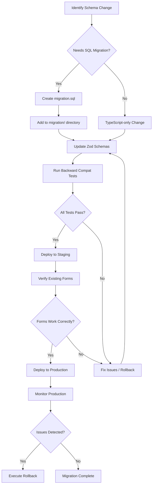

## Overview and Constraint

This document defines the schema migration safety procedures required when extending the Formbricks survey platform with new element types for Typeform parity. Specifically, the addition of `payment` and `opinionScale` element types must follow a rigorous migration process that guarantees zero disruption to existing surveys.

<Warning>
  **AAP Constraint: Existing Formbricks forms must not be broken by any schema migration.** Every migration must include backward-compatibility validation and rollback procedures. This constraint is non-negotiable and applies to all schema changes, Zod validator updates, and data transformations introduced as part of the Typeform parity initiative.
</Warning>

The procedures in this document apply to all element type additions identified in the [Question Type Parity](/development/typeform-parity/question-type-parity) analysis and referenced in the [Gap Report](/development/typeform-parity/gap-report).

Source: `packages/database/schema.prisma`, `packages/database/README.md`

## Formbricks Migration System

Formbricks uses a custom migration system that manages both schema and data migrations in a unified directory structure. Understanding this system is essential before making any changes that affect the survey data model.

### Migration Architecture

The custom migrations directory is located at `packages/database/migration/`. It supports two distinct migration types:

| Migration Type | File | Tracked By | Purpose |
|---|---|---|---|
| **Schema Migration** | `migration.sql` | Prisma `_prisma_migrations` table | DDL changes — adding tables, columns, indexes, enums |
| **Data Migration** | `migration.ts` | `DataMigration` table (status: `pending`, `applied`, `failed`) | DML changes — transforming existing data, backfilling fields |

Source: `packages/database/README.md`

### Key Rules

- **Single type per subdirectory:** Each migration directory contains only one file — either `migration.sql` or `migration.ts`, never both.
- **Naming convention:** Subdirectories follow the format `timestamp_name_of_the_migration` (e.g., `20241214112456_add_users_table`). The timestamp is a 14-digit UTC timestamp.
- **Order of execution:** Migrations execute sequentially based on their timestamps, ensuring precise control over the execution sequence.

### Directory Structure

```
packages/database/migration/
├── 20241214112456_xm_user_identification/
│   └── migration.sql
├── 20241214113000_xm_user_identification/
│   └── migration.ts
├── 20260204083137_added_data_type_and_value_fields/
│   └── migration.sql
└── 20260205033241_added_attributes_data_types/
    └── migration.ts
```

Source: `packages/database/migration/`

### Custom Commands

| Command | Scope | Description |
|---|---|---|
| `pnpm fb-migrate-dev` | Root | Creates and applies schema migrations — prompts for a name, generates `migration.sql`, copies to Prisma's internal directory, and applies all pending migrations |
| `pnpm --filter @formbricks/database db:migrate:dev` | Package | Applies pending migrations in development |
| `pnpm --filter @formbricks/database db:migrate:deploy` | Package | Applies pending migrations in production |
| `pnpm --filter @formbricks/database generate-data-migration` | Package | Creates a new data migration — prompts for a name, generates `migration.ts` with a pre-configured ID |

Source: `packages/database/README.md`

### Data Migration Tracking

The `DataMigration` model in the Prisma schema tracks the state of each data migration to prevent duplicate execution:

```prisma
enum DataMigrationStatus {
  pending
  applied
  failed
}

model DataMigration {
  id         String              @id @default(cuid())
  startedAt  DateTime            @default(now())
  finishedAt DateTime?
  name       String              @unique
  status     DataMigrationStatus
}
```

Source: `packages/database/schema.prisma` (lines 548–570)

## Schema Changes for New Question Types

Adding the `payment` and `opinionScale` element types involves changes at the TypeScript and Zod validation layers — **not** at the SQL database layer. This is a critical distinction that simplifies the migration process.

### Extending TSurveyElementTypeEnum

The element type enum is a TypeScript enum, not a Prisma/database enum:

```typescript
// packages/types/surveys/constants.ts
export enum TSurveyElementTypeEnum {
  FileUpload = "fileUpload",
  OpenText = "openText",
  MultipleChoiceSingle = "multipleChoiceSingle",
  MultipleChoiceMulti = "multipleChoiceMulti",
  NPS = "nps",
  CTA = "cta",
  Rating = "rating",
  Consent = "consent",
  PictureSelection = "pictureSelection",
  Cal = "cal",
  Date = "date",
  Matrix = "matrix",
  Address = "address",
  Ranking = "ranking",
  ContactInfo = "contactInfo",
  Payment = "payment",           // NEW — Typeform parity
  OpinionScale = "opinionScale", // NEW — Typeform parity
}
```

Source: `packages/types/surveys/constants.ts`

<Note>
  **Why no SQL migration is needed for the type enum:** The `TSurveyElementTypeEnum` is used exclusively for TypeScript validation. The `Survey` model in the Prisma schema stores `questions` as `Json` and `blocks` as `Json[]` — both untyped JSON columns. Adding new element types to the TypeScript enum does not require any change to the PostgreSQL schema.
</Note>

### Prisma Schema Impact Analysis

The `Survey` model stores survey structure as JSON fields:

```prisma
model Survey {
  // ...
  /// [SurveyQuestions]
  questions  Json    @default("[]")
  /// [SurveyBlocks]
  blocks     Json[]  @default([])
  // ...
}
```

Source: `packages/database/schema.prisma` (lines 344–416)

**Impact assessment:**

| Layer | Change Required | SQL Migration Needed |
|---|---|---|
| `TSurveyElementTypeEnum` (TypeScript enum) | Add `Payment` and `OpinionScale` values | ❌ No |
| `ZSurveyElement` (Zod discriminated union) | Add `ZSurveyPaymentElement` and `ZSurveyOpinionScaleElement` schemas | ❌ No |
| `ZSurveyElements` (Zod array) | Automatically updated when union is extended | ❌ No |
| `packages/types/surveys/validation-rules.ts` | Add validation rules for new types | ❌ No |
| `Survey.questions` (Prisma `Json` column) | No change — JSON column accepts any valid JSON | ❌ No |
| `Survey.blocks` (Prisma `Json[]` column) | No change — JSON array accepts any valid JSON | ❌ No |

### New Zod Schemas Required

Two new Zod schemas must be created and added to the discriminated union in `packages/types/surveys/elements.ts`:

- **`ZSurveyPaymentElement`** — Extends `ZSurveyElementBase` with payment-specific fields (currency, amount, Stripe configuration, receipt options).
- **`ZSurveyOpinionScaleElement`** — Extends `ZSurveyElementBase` with configurable scale range (1–5, 1–7, 1–10), custom labels, and visual style options.

Both schemas must be added to the `ZSurveyElement` union (currently 15 members) and must include corresponding validation rules in `packages/types/surveys/validation-rules.ts`.

Source: `packages/types/surveys/elements.ts` (lines 354–375)

<Note>
  **Additive-only change:** The `ZSurveyElement` union is extended by adding new members. Existing members are not modified. This guarantees that any existing survey JSON that parses successfully through the current union will continue to parse successfully through the extended union.
</Note>

## Backward-Compatibility Validation Criteria

Every migration for Typeform parity must satisfy all six of the following validation criteria before deployment:

### Criterion 1: Existing Survey Loading

All existing surveys containing any of the 15 current element types must parse without errors through the updated `ZSurvey` schema. This validates that extending the `ZSurveyElement` union does not introduce regressions.

**Validation procedure:** Parse a representative sample of production survey JSON through the updated Zod schema and verify zero validation errors.

### Criterion 2: Zod Schema Backward Compatibility

The `ZSurveyElements` discriminated union must accept all existing element types unchanged. New types are strictly additive — they extend the union without modifying any existing member schema.

**Validation procedure:** Run the existing test suite (`packages/surveys/src/lib/logic.test.ts`, `apps/web/lib/surveyLogic/utils.test.ts`) with the updated schemas and verify all tests pass with zero failures.

### Criterion 3: API Response Compatibility

Existing API endpoints must return the same response format for existing surveys. No field should be added, removed, or renamed in the response payload for surveys that use only the original 15 element types.

**Validation procedure:** Capture API response snapshots before and after the schema change and perform structural diff comparison.

### Criterion 4: Frontend Rendering

The existing survey editor must render all 15 current element types without changes. The addition of new element types must not break the editor's rendering logic for existing types.

**Validation procedure:** Open existing surveys in the editor and verify all elements render correctly. Run relevant Playwright E2E tests.

### Criterion 5: Export Compatibility

Existing export logic (`getResponseDownloadFile` in `apps/web/lib/response/service.ts`) must handle surveys containing only the original 15 element types without any changes to output format.

**Validation procedure:** Export responses from existing surveys in CSV and XLSX formats before and after the migration. Verify byte-level or structural equivalence.

Source: `apps/web/lib/response/service.ts`

### Criterion 6: Webhook Payload Compatibility

Existing webhook payloads must maintain their format for existing surveys. The `PipelineTriggers` (`responseCreated`, `responseUpdated`, `responseFinished`) must fire with unchanged payload structure for surveys using only original element types.

**Validation procedure:** Trigger webhooks for existing surveys and compare payload structure against pre-migration baselines.

Source: `apps/web/app/api/(internal)/pipeline/route.ts`

## Migration Procedure

<Steps>
  <Step title="Pre-migration Validation">
    Establish a baseline to validate against after the migration:

    1. Run the full test suite from the repository root:
       ```bash
       pnpm test
       ```
    2. Snapshot all current survey parsing results by running existing Zod schema validations against representative survey data.
    3. Create a backup of representative survey data (database dump or JSON export of `Survey.questions` and `Survey.blocks`).
    4. Record API response snapshots for key endpoints (`GET /api/v1/surveys/:id`).
    5. Record webhook payload samples by triggering test webhooks for existing surveys.
  </Step>

  <Step title="Schema Development">
    Implement the new element types in the TypeScript and Zod layers:

    1. Add `Payment = "payment"` and `OpinionScale = "opinionScale"` to `TSurveyElementTypeEnum` in `packages/types/surveys/constants.ts`.
    2. Create `ZSurveyPaymentElement` and `ZSurveyOpinionScaleElement` Zod schemas in `packages/types/surveys/elements.ts`, extending `ZSurveyElementBase`.
    3. Add per-element validation rules in `packages/types/surveys/validation-rules.ts`.
    4. Add both new schemas to the `ZSurveyElement` discriminated union in `packages/types/surveys/elements.ts`.
    5. Verify the TypeScript project compiles without errors:
       ```bash
       pnpm build --filter=@formbricks/types
       ```
  </Step>

  <Step title="Backward-Compatibility Testing">
    Validate all six backward-compatibility criteria defined above:

    1. Parse all existing survey fixtures through the updated `ZSurvey` schema — verify zero validation errors.
    2. Run the existing test suites and confirm all tests pass:
       ```bash
       pnpm test --filter=@formbricks/surveys
       pnpm test --filter=@formbricks/web
       ```
    3. Verify API endpoints return correct responses for existing surveys by comparing against pre-migration snapshots.
    4. Open existing surveys in the editor and verify all elements render correctly.
    5. Trigger test webhooks and compare payloads against pre-migration baselines.
    6. Export responses from existing surveys in CSV and XLSX and compare against pre-migration exports.
  </Step>

  <Step title="Data Migration (if Needed)">
    If any existing data requires transformation (e.g., backfilling default values for new fields), create a data migration:

    1. Navigate to the `packages/database` directory.
    2. Run the data migration generator:
       ```bash
       pnpm generate-data-migration
       ```
    3. Follow the prompts to name the migration (e.g., `add_payment_opinion_scale_defaults`).
    4. Implement the data transformation in the generated `migration.ts` file using only Prisma raw queries.
    5. The generated file will have the following structure:
       ```typescript
       import type { MigrationScript } from "../../src/scripts/migration-runner";

       export const migration: MigrationScript = {
         type: "data",
         id: "unique_migration_id",
         name: "20260301120000_add_payment_opinion_scale_defaults",
         run: async ({ tx }) => {
           // Use raw SQL queries for data transformations
         },
       };
       ```
    6. Follow the naming convention: `timestamp_name_of_the_migration`.

    <Note>
      For the `payment` and `opinionScale` additions specifically, **no data migration is expected** because these are new element types. No existing survey data needs transformation — the change is purely additive at the TypeScript/Zod layer. A data migration would only be needed if existing surveys required backfilling or if a column were being altered.
    </Note>
  </Step>

  <Step title="Deployment">
    Deploy the changes to staging and then production:

    1. If a SQL schema migration was created, deploy it:
       ```bash
       pnpm --filter @formbricks/database db:migrate:deploy
       ```
    2. If no SQL migration exists (TypeScript-only change), deploy the updated application code.
    3. Monitor production logs for errors during the first 24 hours post-deployment.
    4. Verify existing forms render and submit correctly by testing a sample of production surveys.
    5. Confirm webhook deliveries continue for existing surveys with unchanged payload structures.
  </Step>
</Steps>

## Rollback Procedures

If any issue is discovered after deployment, follow these rollback procedures in order:

### TypeScript Rollback

Revert the element type enum and Zod schema changes:

1. Remove `Payment` and `OpinionScale` from `TSurveyElementTypeEnum` in `packages/types/surveys/constants.ts`.
2. Remove `ZSurveyPaymentElement` and `ZSurveyOpinionScaleElement` from `packages/types/surveys/elements.ts`.
3. Remove corresponding validation rules from `packages/types/surveys/validation-rules.ts`.
4. Revert the `ZSurveyElement` union to its original 15-member form.
5. Rebuild and redeploy:
   ```bash
   pnpm build --filter=@formbricks/types
   pnpm build
   ```

### Database Rollback (if Applicable)

If a SQL schema migration was applied:

1. Identify the migration in the `_prisma_migrations` table by name.
2. Use Prisma's migration rollback mechanism or apply a reverse migration:
   ```bash
   pnpm --filter @formbricks/database db:migrate:dev
   ```
3. If a manual reverse migration is needed, create a new migration directory with a `migration.sql` that reverses the original DDL changes (e.g., `DROP COLUMN`, `DROP INDEX`).

### Data Rollback (if Applicable)

If a data migration transformed existing data:

1. Check the `DataMigration` table for the migration status:
   ```sql
   SELECT * FROM "DataMigration" WHERE name = 'migration_name';
   ```
2. If `status = 'applied'`, implement and run a reverse data migration to restore original data.
3. The reverse migration should use the same raw SQL query approach as the forward migration.
4. Mark the original migration for re-execution if needed by updating its status:
   ```sql
   UPDATE "DataMigration" SET status = 'pending' WHERE name = 'migration_name';
   ```

### Verification After Rollback

After executing any rollback, re-run the full backward-compatibility validation:

1. Run the complete test suite: `pnpm test`
2. Parse representative surveys through `ZSurvey` — verify zero errors.
3. Test API endpoints for existing surveys — verify unchanged responses.
4. Verify export produces identical output for existing surveys.
5. Confirm webhook payload structure is unchanged.

## Data Integrity Verification

After any migration is deployed, execute the following data integrity verification procedures to confirm no data corruption occurred:

### Survey Count Verification

Count all surveys before and after the migration. The totals must be equal:

```sql
-- Run before migration
SELECT COUNT(*) AS survey_count FROM "Survey";

-- Run after migration and compare
SELECT COUNT(*) AS survey_count FROM "Survey";
```

### Schema Validation Sweep

Parse all surveys through the updated `ZSurvey` schema validation to detect any parsing failures:

```typescript
import { ZSurvey } from "@formbricks/types/surveys/types";

// Fetch all surveys from the database
const surveys = await prisma.survey.findMany({
  select: { id: true, questions: true, blocks: true },
});

let failures = 0;
for (const survey of surveys) {
  const result = ZSurvey.safeParse(survey);
  if (!result.success) {
    console.error(`Survey ${survey.id} failed validation:`, result.error);
    failures++;
  }
}

console.log(`Validated ${surveys.length} surveys. Failures: ${failures}`);
// Expected: failures === 0
```

### Export Equivalence Check

Verify that response exports for existing surveys produce identical output before and after migration:

1. Select a representative set of surveys with responses.
2. Export responses in CSV format using `getResponseDownloadFile` before migration.
3. Export the same responses after migration.
4. Compare the two exports — they must be structurally identical (same headers, same values, same row count).

Source: `apps/web/lib/response/service.ts`

### Webhook Delivery Verification

Confirm webhook deliveries continue functioning for existing surveys:

1. Trigger `responseCreated`, `responseUpdated`, and `responseFinished` events for test surveys.
2. Verify the webhook endpoint receives payloads with the expected structure.
3. Validate the `webhook-signature` header using `generateStandardWebhookSignature`.

Source: `apps/web/app/api/(internal)/pipeline/route.ts`

## Migration Safety Flowchart

The following flowchart illustrates the complete migration safety process from change identification through production deployment:



## Related Documentation

- [Gap Report](/development/typeform-parity/gap-report) — Central hub for the Typeform parity initiative with overall capability analysis
- [Question Type Parity](/development/typeform-parity/question-type-parity) — Detailed element type mapping and Zod schema specifications for new types
- [Webhook Parity](/development/typeform-parity/webhook-parity) — Webhook payload comparison and backward-compatibility requirements
- [Export Parity](/development/typeform-parity/export-parity) — Response export format comparison and lossless export validation
