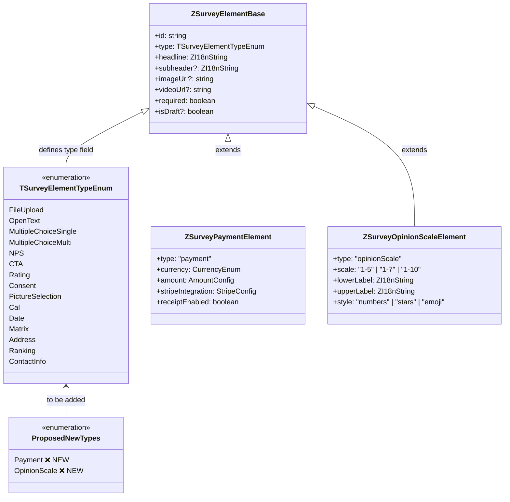

## Overview

This document provides a complete mapping of every Typeform question type to its Formbricks equivalent, using the `TSurveyElementTypeEnum` defined in the Formbricks type system. The analysis identifies which Typeform types have full coverage, which have partial coverage, and which represent gaps requiring new element type implementations.

Formbricks currently defines **15 element types** in `TSurveyElementTypeEnum`:

```typescript
export enum TSurveyElementTypeEnum {
  FileUpload = "fileUpload",
  OpenText = "openText",
  MultipleChoiceSingle = "multipleChoiceSingle",
  MultipleChoiceMulti = "multipleChoiceMulti",
  NPS = "nps",
  CTA = "cta",
  Rating = "rating",
  Consent = "consent",
  PictureSelection = "pictureSelection",
  Cal = "cal",
  Date = "date",
  Matrix = "matrix",
  Address = "address",
  Ranking = "ranking",
  ContactInfo = "contactInfo",
}
```

Source: `packages/types/surveys/constants.ts`

These 15 types provide direct or functional coverage for 18 of 20 Typeform question types. Two Typeform types — **Payment** and **Opinion Scale** — have no Formbricks equivalent and require new element type implementations.

For the overall parity assessment across all capability areas, see the [Gap Report](/development/typeform-parity/gap-report).

## Typeform Question Type Catalog

Typeform offers 20 question types. The table below lists each type with its core semantics and intended use case.

| # | Typeform Type | Description |
|---|---|---|
| 1 | **Short Text** | Single-line free-text input for brief answers (names, titles, short phrases) |
| 2 | **Long Text** | Multi-line free-text area for detailed responses (feedback, descriptions, explanations) |
| 3 | **Multiple Choice** | Selection from a predefined list of options; supports single or multi-select |
| 4 | **Dropdown** | Compact selection from a list, rendered as a dropdown menu instead of radio buttons |
| 5 | **Yes/No** | Binary choice question with two fixed options |
| 6 | **Picture Choice** | Selection from image-based options instead of text labels |
| 7 | **Rating** | Scale-based rating using icons (stars, hearts, thumbs) with configurable range |
| 8 | **Opinion Scale** | Numeric scale (1–5, 1–7, or 1–10) with customizable endpoint labels |
| 9 | **Net Promoter Score®** | Fixed 0–10 likelihood-to-recommend scale following the NPS methodology |
| 10 | **Date** | Date picker input with configurable format |
| 11 | **File Upload** | Allows respondents to upload one or more files |
| 12 | **Payment** | Collects payment via Stripe integration during the survey flow |
| 13 | **Statement** | Informational screen with a call-to-action button; no answer collected |
| 14 | **Email** | Text input with email address validation |
| 15 | **Phone Number** | Text input with phone number formatting and validation |
| 16 | **Website** | Text input with URL validation |
| 17 | **Number** | Numeric-only input with optional min/max constraints |
| 18 | **Legal** | Consent checkbox with terms acceptance (required or optional) |
| 19 | **Ranking** | Drag-and-drop reordering of options to express preference order |
| 20 | **Matrix** | Grid of rows and columns for multi-dimensional evaluation |

## Formbricks Element Type Mapping

The following table maps each Typeform question type to its Formbricks equivalent. The **Status** column indicates coverage level:

- ✅ **Full** — Direct or functionally equivalent mapping exists
- 🟡 **Partial** — Covered by an existing type but with limitations
- ❌ **Missing** — No Formbricks equivalent; new element type required

| Typeform Type | Formbricks Equivalent | Status | Notes |
|---|---|---|---|
| Short Text | `OpenText` | ✅ Full | Direct mapping. `ZSurveyOpenTextElement` with `inputType: "text"` and `longAnswer: false` |
| Long Text | `OpenText` (long mode) | ✅ Full | Same element with `longAnswer: true` enables multi-line textarea |
| Multiple Choice | `MultipleChoiceSingle` / `MultipleChoiceMulti` | ✅ Full | Formbricks uses separate types for single-select and multi-select, providing stricter type safety |
| Dropdown | `MultipleChoiceSingle` | ✅ Full | `ZMultipleChoiceOptionDisplayType` supports `"dropdown"` display variant |
| Yes/No | `MultipleChoiceSingle` | ✅ Full | Configured with two choices; functionally identical behavior |
| Picture Choice | `PictureSelection` | ✅ Full | Direct mapping. `ZSurveyPictureSelectionElement` with `allowMulti` option and image-based choices |
| Rating | `Rating` | ✅ Full | `ZSurveyRatingElement` supports `scale: "number" | "smiley" | "star"` with range options 3, 4, 5, 6, 7, 10 |
| Opinion Scale | — | ❌ Missing | New `opinionScale` element type required. See [Gap Analysis: Opinion Scale](#gap-types--opinion-scale) |
| Net Promoter Score® | `NPS` | ✅ Full | `ZSurveyNPSElement` with fixed 0–10 scale, `lowerLabel`/`upperLabel`, and optional color coding |
| Date | `Date` | ✅ Full | `ZSurveyDateElement` with format options `"M-d-y"`, `"d-M-y"`, `"y-M-d"` |
| File Upload | `FileUpload` | ✅ Full | `ZSurveyFileUploadElement` with `allowMultipleFiles`, `maxSizeInMB`, and `allowedFileExtensions` |
| Payment | — | ❌ Missing | New `payment` element type required. See [Gap Analysis: Payment](#gap-types--payment) |
| Statement | `CTA` | ✅ Full | `ZSurveyCTAElement` with optional external button URL and label; serves as an informational screen |
| Email | `ContactInfo` | ✅ Full | `ZSurveyContactInfoElement` includes a dedicated `email` field with toggle and validation |
| Phone Number | `ContactInfo` | ✅ Full | `ZSurveyContactInfoElement` includes a dedicated `phone` field with toggle and validation |
| Website | `OpenText` (URL validation) | ✅ Full | `ZSurveyOpenTextElement` with `inputType: "url"` provides URL input with validation |
| Number | `OpenText` (number input) | 🟡 Partial | `ZSurveyOpenTextElement` with `inputType: "number"` provides numeric input; however, it is not a dedicated numeric type — it reuses the text field infrastructure with validation rules (`minValue`, `maxValue`, `isGreaterThan`, `isLessThan`) |
| Legal | `Consent` | ✅ Full | `ZSurveyConsentElement` with a `label` field for terms text and `required` flag |
| Ranking | `Ranking` | ✅ Full | `ZSurveyRankingElement` with 2–25 options, shuffle support, and "other" option placeholder |
| Matrix | `Matrix` | ✅ Full | `ZSurveyMatrixElement` with configurable rows and columns, shuffle options |

Source: `packages/types/surveys/elements.ts`

### Coverage Summary

| Status | Count | Percentage |
|---|---|---|
| ✅ Full | 17 | 85% |
| 🟡 Partial | 1 | 5% |
| ❌ Missing | 2 | 10% |
| **Total** | **20** | — |

<Note>
  The **Number** type is classified as partial because Formbricks handles it through `OpenText` with `inputType: "number"` rather than a dedicated element type. While functionally adequate for most use cases (with `minValue`, `maxValue`, `isGreaterThan`, and `isLessThan` validation rules available), a dedicated numeric type could provide better UX with stepper controls, decimal precision settings, and currency formatting. This is a low-priority enhancement — the current implementation satisfies Typeform parity for numeric input.
</Note>

## Gap Types — Payment

**Status:** ❌ Not implemented — new element type required

**Typeform reference:** The Typeform Payment question type allows form creators to accept payments via Stripe during the survey flow. Respondents enter payment details inline, the charge is processed, and the survey continues. Configuration includes currency, amount (fixed or variable), Stripe product/price references, and optional receipt delivery.

### Proposed Zod Schema

The new `payment` element type follows the established pattern in `packages/types/surveys/elements.ts`, extending `ZSurveyElementBase` with payment-specific fields:

```typescript
export const ZSurveyPaymentElement = ZSurveyElementBase.extend({
  type: z.literal("payment"),
  currency: z.enum([
    "USD", "EUR", "GBP", "CAD", "AUD", "JPY", "CHF",
    "CNY", "INR", "BRL", "MXN", "SGD", "HKD", "NOK",
    "SEK", "DKK", "NZD", "ZAR", "KRW", "PLN",
  ]),
  amount: z.object({
    type: z.enum(["fixed", "variable"]),
    value: z.number().positive().optional(),
    min: z.number().positive().optional(),
    max: z.number().positive().optional(),
  }),
  stripeIntegration: z.object({
    priceId: z.string().optional(),
    productId: z.string().optional(),
  }),
  receiptEnabled: z.boolean().default(true),
  buttonLabel: ZI18nString.optional(),
  validation: ZValidation.optional(),
});

export type TSurveyPaymentElement = z.infer<typeof ZSurveyPaymentElement>;
```

### Validation Rules

Payment elements require the following validation:

| Rule | Description |
|---|---|
| Amount > 0 | Fixed amount must be a positive number |
| Valid currency | Currency must be one of the supported ISO 4217 codes |
| Stripe keys configured | Environment must have Stripe API keys configured |
| Amount range (variable) | When `type: "variable"`, `min` and `max` must define a valid range |

### Implementation Modules

The following files require modification to add the Payment element type:

1. **`packages/types/surveys/constants.ts`** — Add `Payment = "payment"` to `TSurveyElementTypeEnum`
2. **`packages/types/surveys/elements.ts`** — Add `ZSurveyPaymentElement` schema and include it in the `ZSurveyElement` union
3. **`packages/types/surveys/validation-rules.ts`** — Add payment-specific validation rules to `APPLICABLE_RULES` (e.g., `minValue`, `maxValue` for variable amounts)

<Warning>
  Adding a new entry to `TSurveyElementTypeEnum` requires updating the `ZSurveyElement` union in `packages/types/surveys/elements.ts`. The union uses `z.union()` (not `z.discriminatedUnion()`), so the new schema must be appended to the union array. Existing element schemas remain unchanged — this is a purely additive operation. See [Migration Safety](/development/typeform-parity/migration-safety) for backward-compatibility procedures.
</Warning>

For user-facing configuration documentation, see [Payment Question Type](/xm-and-surveys/surveys/question-type/payment).

## Gap Types — Opinion Scale

**Status:** ❌ Not implemented — new element type required

**Typeform reference:** The Typeform Opinion Scale question presents respondents with a numeric scale where they select a single value. The scale range is configurable (1–5, 1–7, or 1–10), and endpoint labels describe the meaning of low and high values (e.g., "Strongly disagree" to "Strongly agree").

### Differentiation from NPS

While both Opinion Scale and NPS use numeric scales, they serve different purposes and have different configurations:

| Aspect | NPS (`ZSurveyNPSElement`) | Opinion Scale (proposed) |
|---|---|---|
| Scale range | Fixed 0–10 | Configurable: 1–5, 1–7, or 1–10 |
| Starting value | Always 0 | Always 1 |
| Semantics | "How likely are you to recommend..." | General-purpose agreement/satisfaction/preference |
| Labels | Lower and upper (optional) | Lower and upper (required for clarity) |
| Color coding | Optional (`isColorCodingEnabled`) | Not applicable |
| Visual style | Numbers only | Numbers, stars, or emoji |
| Analytics | NPS score calculation (Promoter/Passive/Detractor) | Mean, median, distribution |

Source: `packages/types/surveys/elements.ts` (lines 177–184 — `ZSurveyNPSElement`)

### Proposed Zod Schema

```typescript
export const ZSurveyOpinionScaleElement = ZSurveyElementBase.extend({
  type: z.literal("opinionScale"),
  scale: z.enum(["1-5", "1-7", "1-10"]).default("1-5"),
  lowerLabel: ZI18nString,
  upperLabel: ZI18nString,
  style: z.enum(["numbers", "stars", "emoji"]).default("numbers"),
  validation: ZValidation.optional(),
});

export type TSurveyOpinionScaleElement = z.infer<typeof ZSurveyOpinionScaleElement>;
```

### Implementation Modules

The same files as the Payment type require modification:

1. **`packages/types/surveys/constants.ts`** — Add `OpinionScale = "opinionScale"` to `TSurveyElementTypeEnum`
2. **`packages/types/surveys/elements.ts`** — Add `ZSurveyOpinionScaleElement` schema and include it in the `ZSurveyElement` union
3. **`packages/types/surveys/validation-rules.ts`** — Opinion Scale does not require custom validation rules beyond the base `required` check, but could optionally support `minValue`/`maxValue` constraints in the future

<Note>
  The Opinion Scale type intentionally uses `ZI18nString` for `lowerLabel` and `upperLabel` (without `.optional()`) because endpoint labels are essential for respondent understanding. This follows the same internationalization pattern used across all Formbricks element types with i18n label support.
</Note>

For user-facing configuration documentation, see [Opinion Scale Question Type](/xm-and-surveys/surveys/question-type/opinion-scale).

## Schema Extension Specifications

This section documents the technical procedure for extending the Formbricks survey type system to add new element types. The procedure applies to both Payment and Opinion Scale implementations.

### Step 1: Extend the Enum

Add new entries to `TSurveyElementTypeEnum` in `packages/types/surveys/constants.ts`:

```typescript
export enum TSurveyElementTypeEnum {
  // ... existing 15 types remain unchanged ...
  Payment = "payment",
  OpinionScale = "opinionScale",
}
```

<Warning>
  The enum string values (`"payment"`, `"opinionScale"`) are stored in survey JSON data. Once a value is assigned and surveys are created with it, the string must never be changed — doing so would break existing survey data. Choose values carefully before implementation.
</Warning>

### Step 2: Define the Zod Schema

Each new element type extends `ZSurveyElementBase` with type-specific fields, following the established pattern in `packages/types/surveys/elements.ts`:

```typescript
// Base schema provides: id, type, headline, subheader, imageUrl,
// videoUrl, required, scale, range, isDraft
export const ZSurveyNewTypeElement = ZSurveyElementBase.extend({
  type: z.literal(TSurveyElementTypeEnum.NewType),
  // ... type-specific fields ...
  validation: ZValidation.optional(),
});
```

Source: `packages/types/surveys/elements.ts` (lines 59–70 — `ZSurveyElementBase`)

### Step 3: Add to the Element Union

Include the new schema in the `ZSurveyElement` union:

```typescript
export const ZSurveyElement = z.union([
  // ... existing 15 schemas ...
  ZSurveyPaymentElement,
  ZSurveyOpinionScaleElement,
]);
```

Source: `packages/types/surveys/elements.ts` (lines 354–370 — `ZSurveyElement`)

### Step 4: Register Validation Rules

Add applicable validation rules to the `APPLICABLE_RULES` map in `packages/types/surveys/validation-rules.ts`:

```typescript
export const APPLICABLE_RULES: Record<string, TValidationRuleType[]> = {
  // ... existing entries ...
  payment: ["minValue", "maxValue"],
  opinionScale: [],  // No custom validation rules — uses base required check
};
```

Source: `packages/types/surveys/validation-rules.ts` (lines 289–299 — `APPLICABLE_RULES`)

### Existing Validation Rules by Element Type

For reference, the current validation rule assignments in `APPLICABLE_RULES` are:

| Element Type | Applicable Validation Rules |
|---|---|
| `openText` | minLength, maxLength, pattern, email, url, phone, equals, doesNotEqual, contains, doesNotContain, minValue, maxValue, isGreaterThan, isLessThan |
| `multipleChoiceMulti` | minSelections, maxSelections |
| `date` | isLaterThan, isEarlierThan, isBetween, isNotBetween |
| `matrix` | minRowsAnswered, answerAllRows |
| `ranking` | minRanked, rankAll |
| `fileUpload` | fileExtensionIs, fileExtensionIsNot |
| `pictureSelection` | minSelections, maxSelections |
| `address` | minLength, maxLength, pattern, email, url, phone, equals, doesNotEqual, contains, doesNotContain |
| `contactInfo` | minLength, maxLength, pattern, email, url, phone, equals, doesNotEqual, contains, doesNotContain |

Source: `packages/types/surveys/validation-rules.ts` (lines 235–299)

### Step 5: Migration Safety Verification

Before deploying new element types to production:

1. **Backward compatibility** — Verify that existing surveys with the current 15 element types parse correctly with the updated `ZSurveyElement` union. New types are additive and must not modify existing schema branches.
2. **Zod union ordering** — The `z.union()` evaluator tries schemas in order. Place new schemas after existing ones to avoid unintended early matches.
3. **Database schema** — Survey data is stored as JSON in the database. No Prisma migration is required for adding new element types to the TypeScript enum — the enum is a code-level construct, not a database column constraint.

For the complete migration safety procedure including rollback steps, see [Migration Safety](/development/typeform-parity/migration-safety).

## Element Type Hierarchy

The following diagram illustrates the current `TSurveyElementTypeEnum` hierarchy with the two proposed new types:



## Cross References

- **[Gap Report](/development/typeform-parity/gap-report)** — Central hub for all parity analysis including the question type summary
- **[Migration Safety](/development/typeform-parity/migration-safety)** — Detailed procedures for safe schema extension and backward compatibility
- **[Sprint Roadmap](/development/typeform-parity/sprint-roadmap)** — Implementation timeline for Payment and Opinion Scale types
- **[Payment Question Type](/xm-and-surveys/surveys/question-type/payment)** — User-facing documentation for configuring payment questions
- **[Opinion Scale Question Type](/xm-and-surveys/surveys/question-type/opinion-scale)** — User-facing documentation for configuring opinion scale questions
