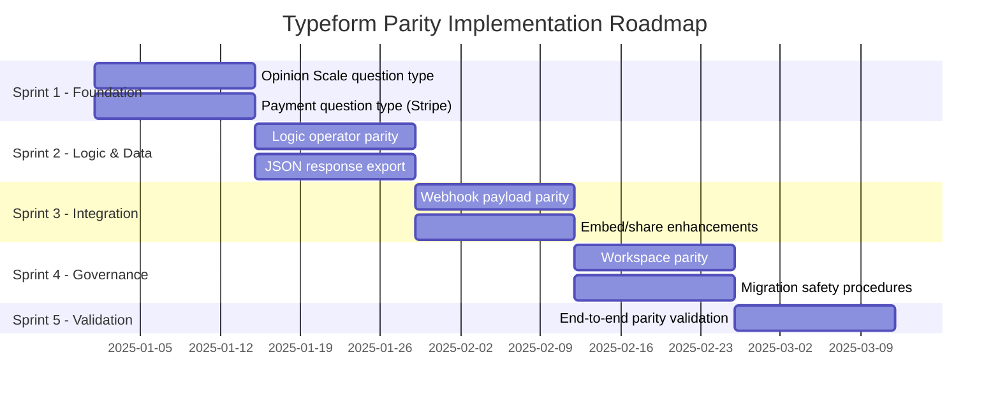

## Roadmap Overview

This document defines the phased sprint-by-sprint implementation plan for closing the capability gaps identified in the Typeform parity initiative. The roadmap is organized into **5 sprints** across **8 capability areas**, sequenced by feature priority, dependency chains, and validation milestones.

See the [Gap Report](/development/typeform-parity/gap-report) for the complete capability analysis that informs this roadmap.

**Scope:** The roadmap addresses all 8 in-scope capability areas from the gap report: question types, conditional logic, hidden fields and answer piping, partial submissions, webhooks, response export, embed and share flows, and workspace governance.

**Methodology:** Sprints are sequenced so that foundational type system changes (new element types) are completed first, enabling dependent features (logic operators, webhook payloads, export formats) to build on a stable base. Each sprint concludes with a validation milestone before the next sprint begins.

<Note>
  **Key constraints governing this roadmap:**
  - **Webhook structural parity** — Payloads must maintain structural parity with Typeform format.
  - **100% logic jump coverage** — Logic jump feature equivalence must be 100%.
  - **No broken existing forms** — Existing Formbricks forms must not be broken by any schema migration.
  - **Lossless export** — Response export must be lossless with complete data fidelity.
</Note>

### Implementation Dependency Graph

The following Gantt chart illustrates the sprint timeline, feature dependencies, and parallel workstreams:

### Sprint Summary

<CardGroup cols={2}>
  <Card title="Sprint 1 — Foundation" icon="layer-group" href="#sprint-1--foundation-question-types">
    New element types: Opinion Scale and Payment. Extends `TSurveyElementTypeEnum` with two new entries.
  </Card>
  <Card title="Sprint 2 — Logic and Data" icon="code-branch" href="#sprint-2--logic-and-data">
    Verify 100% logic operator parity and implement JSON response export.
  </Card>
  <Card title="Sprint 3 — Integration" icon="plug" href="#sprint-3--integration">
    Transform webhook payloads for Typeform structural parity. Add slider, popover, and side tab embeds.
  </Card>
  <Card title="Sprint 4 — Governance" icon="building" href="#sprint-4--governance">
    Workspace model alignment and migration safety procedures.
  </Card>
  <Card title="Sprint 5 — Validation" icon="check-double" href="#sprint-5--validation">
    End-to-end parity validation across all 8 capability areas.
  </Card>
</CardGroup>

---

## Sprint 1 — Foundation (Question Types)

**Duration:** 2 weeks | **Priority:** 🔴 Critical | **Dependencies:** None

Sprint 1 establishes the type system foundation by adding two new element types to `TSurveyElementTypeEnum`. These types must be implemented before dependent sprints can proceed, as logic operators, webhook payloads, and export formats all interact with element type definitions.

Source: `packages/types/surveys/constants.ts` (current 15 element types: `FileUpload`, `OpenText`, `MultipleChoiceSingle`, `MultipleChoiceMulti`, `NPS`, `CTA`, `Rating`, `Consent`, `PictureSelection`, `Cal`, `Date`, `Matrix`, `Address`, `Ranking`, `ContactInfo`)

### Epic 1.1 — Opinion Scale Question Type

Add a new `opinionScale` element type with a configurable numeric range, differentiated from the fixed 0–10 NPS scale.

<Steps>
  <Step title="Define element type constant">
    Add `OpinionScale = "opinionScale"` to `TSurveyElementTypeEnum` in `packages/types/surveys/constants.ts`.
  </Step>
  <Step title="Create Zod schema">
    Define `ZSurveyOpinionScaleElement` in `packages/types/surveys/elements.ts` extending `ZSurveyElementBase` with:
    - `type: z.literal(TSurveyElementTypeEnum.OpinionScale)`
    - `range: z.union([z.literal(5), z.literal(7), z.literal(10)])` — configurable scale endpoints
    - `lowerLabel: ZI18nString.optional()` — custom label for the low end
    - `upperLabel: ZI18nString.optional()` — custom label for the high end
    - `validation: ZValidation.optional()`
  </Step>
  <Step title="Add validation rules">
    Define opinion scale validation rules in `packages/types/surveys/validation-rules.ts` for range boundary enforcement.
  </Step>
  <Step title="Implement survey editor UI">
    Add an Opinion Scale element card in `apps/web/modules/survey/editor/` following the pattern of the existing Rating element editor.
  </Step>
  <Step title="Implement survey renderer">
    Add `OpinionScaleElement` component in `packages/surveys/` for respondent-facing rendering.
  </Step>
</Steps>

**Modules affected:**

| Module | File | Change |
|---|---|---|
| Type system | `packages/types/surveys/constants.ts` | Add `OpinionScale` to `TSurveyElementTypeEnum` |
| Element schemas | `packages/types/surveys/elements.ts` | New `ZSurveyOpinionScaleElement` Zod schema |
| Validation rules | `packages/types/surveys/validation-rules.ts` | Opinion scale range validation |
| Survey editor | `apps/web/modules/survey/editor/` | New editor card and configuration panel |
| Survey renderer | `packages/surveys/` | New respondent-facing element component |

For the complete type mapping and Zod schema proposal, see [Question Type Parity](/development/typeform-parity/question-type-parity).

### Epic 1.2 — Payment Question Type

Add a new `payment` element type with Stripe integration for collecting payments during survey flows.

<Steps>
  <Step title="Define element type constant">
    Add `Payment = "payment"` to `TSurveyElementTypeEnum` in `packages/types/surveys/constants.ts`.
  </Step>
  <Step title="Create Zod schema">
    Define `ZSurveyPaymentElement` in `packages/types/surveys/elements.ts` extending `ZSurveyElementBase` with:
    - `type: z.literal(TSurveyElementTypeEnum.Payment)`
    - `currency: z.string()` — ISO 4217 currency code (e.g., `"usd"`, `"eur"`)
    - `amount: z.number().positive()` — payment amount in the smallest currency unit
    - `description: ZI18nString.optional()` — payment description shown on the Stripe checkout
    - `stripeAccountId: z.string()` — connected Stripe account identifier
  </Step>
  <Step title="Integrate Stripe API">
    Implement Stripe Payment Intent creation in a server action within `apps/web/modules/survey/` using the Stripe Node.js SDK.
  </Step>
  <Step title="Implement survey editor UI">
    Add a Payment element card with currency selector, amount input, and Stripe account connection workflow.
  </Step>
  <Step title="Implement survey renderer">
    Add `PaymentElement` component using Stripe Elements for secure, PCI-compliant payment collection.
  </Step>
</Steps>

**Modules affected:**

| Module | File | Change |
|---|---|---|
| Type system | `packages/types/surveys/constants.ts` | Add `Payment` to `TSurveyElementTypeEnum` |
| Element schemas | `packages/types/surveys/elements.ts` | New `ZSurveyPaymentElement` Zod schema |
| Server actions | `apps/web/modules/survey/` | Stripe Payment Intent creation |
| Survey editor | `apps/web/modules/survey/editor/` | New editor card with Stripe configuration |
| Survey renderer | `packages/surveys/` | New `PaymentElement` with Stripe Elements |

For the complete type mapping and Zod schema proposal, see [Question Type Parity](/development/typeform-parity/question-type-parity).

<Warning>
  **Migration safety:** Adding new values to `TSurveyElementTypeEnum` does not require a SQL migration because element types are stored as JSON, not as database enums. However, all Zod validators that parse survey data must be updated to accept the new types without rejecting existing surveys. See [Migration Safety](/development/typeform-parity/migration-safety) for procedures.
</Warning>

---

## Sprint 2 — Logic and Data

**Duration:** 2 weeks | **Priority:** 🟠 High | **Dependencies:** Sprint 1 (new element types must exist for logic operator targeting)

Sprint 2 completes the data layer by verifying exhaustive logic operator parity and adding JSON export capability. Both workstreams can proceed in parallel.

### Epic 2.1 — Logic Operator Parity

Verify that every Typeform logic condition type has a functionally equivalent operator in Formbricks. Implement any missing operators identified during the verification process.

Source: `packages/types/surveys/logic.ts` (32 operators in `ZSurveyLogicConditionsOperator`)

<Steps>
  <Step title="Map all Typeform operators">
    Complete the exhaustive operator-to-operator mapping documented in [Logic Parity](/development/typeform-parity/logic-parity). Confirm every Typeform operator has a Formbricks equivalent.
  </Step>
  <Step title="Implement missing operators (if any)">
    If the mapping reveals gaps, add new operators to `ZSurveyLogicConditionsOperator` in `packages/types/surveys/logic.ts` and implement the runtime evaluation in `packages/surveys/src/lib/logic.ts`.
  </Step>
  <Step title="Add logic support for new element types">
    Extend the logic condition system to support `opinionScale` and `payment` element types as left operands. Define which operators are valid for each new type (e.g., `equals`, `isGreaterThan`, `isLessThan` for opinion scale; `isSubmitted`, `isSkipped` for payment).
  </Step>
  <Step title="Update cyclic detection">
    Verify that the DFS-based cyclic logic detection in `packages/types/surveys/blocks-validation.ts` correctly handles blocks containing the new element types.
  </Step>
  <Step title="Comprehensive test coverage">
    Add test cases for new operators and element type conditions in `packages/surveys/src/lib/logic.test.ts` and `apps/web/lib/surveyLogic/utils.test.ts`.
  </Step>
</Steps>

**Modules affected:**

| Module | File | Change |
|---|---|---|
| Logic operators | `packages/types/surveys/logic.ts` | Add operators if gaps found |
| Logic runtime | `packages/surveys/src/lib/logic.ts` | Implement new operator evaluation |
| Block validation | `packages/types/surveys/blocks-validation.ts` | Verify cyclic detection |
| Logic tests | `packages/surveys/src/lib/logic.test.ts` | New test cases |

<Note>
  **AAP constraint:** Logic jump coverage must be 100% feature-equivalent. The current Formbricks implementation provides 32 operators, which already exceeds Typeform's operator set with additional operators like `isBooked`, `isPartiallySubmitted`, `isCompletelySubmitted`, `isSet`, and `isNotSet`. This sprint confirms parity through systematic verification.
</Note>

For the exhaustive operator mapping, see [Logic Parity](/development/typeform-parity/logic-parity).

### Epic 2.2 — JSON Response Export

Add JSON as a third export format alongside CSV and XLSX in the response download pipeline.

Source: `apps/web/lib/response/service.ts` (function `getResponseDownloadFile` at lines 342–441, currently supports `"csv" | "xlsx"`)

<Steps>
  <Step title="Extend format parameter">
    Update the `getResponseDownloadFile` function signature to accept `format: "csv" | "xlsx" | "json"`.
  </Step>
  <Step title="Implement JSON conversion">
    Create a `convertToJson` function in `apps/web/lib/utils/file-conversion.ts` that produces structured JSON output with survey metadata, column definitions, and response data.
  </Step>
  <Step title="Update download UI">
    Add a JSON option to the export dropdown in `apps/web/app/(app)/environments/[environmentId]/surveys/[surveyId]/(analysis)/summary/components/CustomFilter.tsx`.
  </Step>
  <Step title="Add API endpoint">
    Expose JSON export through the REST API with filter criteria support, documented in both `docs/api-reference/openapi.json` (v1) and `docs/api-v2-reference/openapi.yml` (v2).
  </Step>
  <Step title="Lossless validation">
    Implement field-by-field equivalence checks between database records and JSON export to satisfy the lossless export constraint.
  </Step>
</Steps>

**Modules affected:**

| Module | File | Change |
|---|---|---|
| Response service | `apps/web/lib/response/service.ts` | Extend format to include `"json"` |
| File conversion | `apps/web/lib/utils/file-conversion.ts` | New `convertToJson` function |
| Download UI | `apps/web/app/(app)/.../CustomFilter.tsx` | Add JSON option |
| API v1 | `docs/api-reference/openapi.json` | New JSON export endpoint |
| API v2 | `docs/api-v2-reference/openapi.yml` | New JSON export endpoint |

<Warning>
  **AAP constraint:** Response export must be lossless. The JSON export must preserve every response field without truncation, rounding, or encoding loss. Verification procedures must confirm field-by-field equivalence between database records and exported data. See [Export Parity](/development/typeform-parity/export-parity) for detailed validation criteria.
</Warning>

For the complete export format comparison and lossless validation procedures, see [Export Parity](/development/typeform-parity/export-parity).

---

## Sprint 3 — Integration

**Duration:** 2 weeks | **Priority:** 🟠 High | **Dependencies:** Sprint 2 (logic operators and export formats must be stable before webhook and embed integration)

Sprint 3 focuses on external integration points: transforming webhook payloads for Typeform structural parity and adding missing embed variants.

### Epic 3.1 — Webhook Payload Parity

Transform the Formbricks webhook payload structure to match the Typeform webhook schema, enabling seamless migration of downstream integrations.

Source: `apps/web/app/api/(internal)/pipeline/route.ts` (webhook dispatch at lines 95–145), `packages/database/zod/webhooks.ts`

<Steps>
  <Step title="Define Typeform-compatible payload schema">
    Create a Zod schema for the Typeform-compatible payload format, transforming the flat key-value `data` object into a typed `answers` array with field metadata (field `ref`, `type`, `text`, value object).
  </Step>
  <Step title="Implement payload transformer">
    Build a transformation layer in the pipeline route that converts the Formbricks internal response format to the Typeform-compatible structure before webhook dispatch.
  </Step>
  <Step title="Map triggers to Typeform events">
    Align `PipelineTriggers` enum values (`responseCreated`, `responseUpdated`, `responseFinished`) with Typeform's event types (`form_response`), ensuring trigger-level compatibility.
  </Step>
  <Step title="Preserve signature verification">
    Maintain the existing HMAC-SHA256 signature via `generateStandardWebhookSignature` while documenting the Typeform signature comparison (Typeform uses SHA-256 HMAC on the raw payload body).
  </Step>
  <Step title="Backward compatibility mode">
    Implement a per-webhook configuration option to select payload format (Formbricks native or Typeform-compatible), ensuring existing integrations are not disrupted.
  </Step>
</Steps>

**Modules affected:**

| Module | File | Change |
|---|---|---|
| Pipeline route | `apps/web/app/api/(internal)/pipeline/route.ts` | Add payload transformation layer |
| Webhook schemas | `packages/database/zod/webhooks.ts` | Typeform-compatible payload Zod schema |
| Webhook model | `packages/database/schema.prisma` | Optional `payloadFormat` field |
| Webhook settings | `apps/web/modules/integrations/webhooks/` | UI for payload format selection |

<Warning>
  **AAP constraint:** Webhook payloads must maintain structural parity with Typeform format. The field-by-field mapping between the Formbricks flat data model and the Typeform typed answers array is documented in [Webhook Parity](/development/typeform-parity/webhook-parity). A backward-compatibility mode ensures that existing Formbricks integrations continue to function.
</Warning>

For the complete payload comparison and transformation specification, see [Webhook Parity](/development/typeform-parity/webhook-parity).

### Epic 3.2 — Embed and Share Enhancements

Implement the 3 missing Typeform embed variants: slider, popover, and side tab.

Source: `apps/web/app/(app)/environments/[environmentId]/surveys/[surveyId]/(analysis)/summary/components/shareEmbedModal/`

<Steps>
  <Step title="Implement Slider embed">
    Create a slider embed variant that slides the survey form in from the side of the page. Add a new tab component in `shareEmbedModal/` with customizable slide direction (left/right), width, and animation timing.
  </Step>
  <Step title="Implement Popover embed">
    Create a popover embed variant with a floating trigger button that expands into the survey form. Support customizable button position, icon, color, and form dimensions.
  </Step>
  <Step title="Implement Side Tab embed">
    Create a side tab embed variant with a fixed tab on the edge of the page. Support customizable tab label, position (left/right), color, and expand behavior.
  </Step>
  <Step title="Generate embed code snippets">
    For each new variant, generate copy-ready HTML/JavaScript embed code snippets in the share modal, following the pattern of the existing website embed tab.
  </Step>
  <Step title="Update Formbricks JS SDK">
    Extend the `@formbricks/js` SDK to support the three new embed modes via configuration options.
  </Step>
</Steps>

**Modules affected:**

| Module | File | Change |
|---|---|---|
| Share modal | `apps/web/app/(app)/.../shareEmbedModal/` | 3 new tab components |
| Embed script | `packages/js/` | New embed mode support |
| Documentation | `docs/xm-and-surveys/surveys/link-surveys/embed-surveys.mdx` | Updated embed options guide |

For the complete embed comparison and implementation proposals, see [Embed/Share Parity](/development/typeform-parity/embed-share-parity).

---

## Sprint 4 — Governance

**Duration:** 2 weeks | **Priority:** 🟡 Medium | **Dependencies:** Sprint 3 (integration layer must be stable before governance alignment)

Sprint 4 addresses organizational governance alignment and establishes the migration safety framework that protects all prior sprint work.

### Epic 4.1 — Workspace Parity

Align the Formbricks Organization → Project → Team model with Typeform workspace concepts to ensure governance feature equivalence.

Source: `apps/web/modules/organization/`, `apps/web/modules/ee/teams/`, `packages/database/schema.prisma`

<Steps>
  <Step title="Evaluate structural alignment">
    Compare Formbricks Organization → Project → Team → Role hierarchy with Typeform Workspace → Team → Folder model. Identify any user-visible differences that affect migration experience.
  </Step>
  <Step title="Implement folder-like project grouping (if needed)">
    If the evaluation reveals that Typeform's folder nesting capability requires equivalence, implement an optional folder/grouping layer within the Formbricks Project model.
  </Step>
  <Step title="Role permissions audit">
    Verify that Formbricks' 4-role system (`owner`, `manager`, `member`, `billing`) provides equivalent or superior access control compared to Typeform's 3-role system (`owner`, `admin`, `member`).
  </Step>
  <Step title="API key scope alignment">
    Ensure API key management supports the same scoping granularity as Typeform's personal access tokens (organization-wide or project-scoped).
  </Step>
</Steps>

**Modules affected:**

| Module | File | Change |
|---|---|---|
| Organization | `apps/web/modules/organization/` | Potential grouping layer |
| Enterprise teams | `apps/web/modules/ee/teams/` | Role mapping verification |
| Projects | `apps/web/modules/projects/` | Folder-like grouping (if needed) |
| Database | `packages/database/schema.prisma` | Schema updates (if needed) |

<Note>
  Formbricks already exceeds Typeform's role granularity with 4 roles versus 3. The primary structural difference — Formbricks' Project → Environment paradigm versus Typeform's Folder hierarchy — represents different organizational philosophies rather than a direct parity gap. Enterprise team features are gated behind the `isTeamsEnabled` license check.
</Note>

For the complete governance comparison, see [Workspace Parity](/development/typeform-parity/workspace-parity).

### Epic 4.2 — Migration Safety Procedures

Implement and validate the migration safety framework ensuring that all schema changes from Sprints 1–3 maintain backward compatibility with existing Formbricks surveys.

Source: `packages/database/migration/`, `packages/database/schema.prisma`, `packages/database/README.md`

<Steps>
  <Step title="Audit all schema changes">
    Review every change made to `TSurveyElementTypeEnum`, Zod validators, and Prisma models across Sprints 1–3. Verify that no changes break parsing of existing survey JSON data.
  </Step>
  <Step title="Write migration scripts">
    Create migration files in `packages/database/migration/` following the timestamp-based naming convention (e.g., `20250128_add_opinion_scale_payment_types/migration.sql`). Include only additive changes — never remove or rename existing enum values.
  </Step>
  <Step title="Implement rollback procedures">
    For each migration, document a corresponding rollback procedure that can safely reverse the change without data loss.
  </Step>
  <Step title="Run backward-compatibility tests">
    Execute the existing test suite against survey fixtures that pre-date the new element types. Verify that all existing surveys parse, render, and export correctly.
  </Step>
  <Step title="Validate Zod schema coexistence">
    Confirm that the updated `ZSurveyElements` discriminated union accepts both legacy element types and the new `opinionScale` and `payment` types without validation errors.
  </Step>
</Steps>

**Modules affected:**

| Module | File | Change |
|---|---|---|
| Migrations | `packages/database/migration/` | New migration directories |
| Prisma schema | `packages/database/schema.prisma` | Additive schema changes only |
| Zod validators | `packages/types/surveys/elements.ts` | Expanded discriminated union |
| Test suite | `packages/surveys/`, `apps/web/` | Backward-compatibility test cases |

<Warning>
  **AAP constraint:** Existing Formbricks forms must not be broken by any schema migration. All migrations must be additive — new enum values, new optional fields, and expanded Zod unions. The custom `fb-migrate-dev` workflow must be followed for all development changes. See [Migration Safety](/development/typeform-parity/migration-safety) for the complete procedural guide.
</Warning>

For the complete migration procedures, see [Migration Safety](/development/typeform-parity/migration-safety).

---

## Sprint 5 — Validation

**Duration:** 2 weeks | **Priority:** 🔴 Critical | **Dependencies:** Sprints 1–4 (all implementation work must be complete)

Sprint 5 is dedicated to end-to-end parity validation, regression testing, and performance benchmarking. No new features are implemented — this sprint confirms that all parity targets are met and existing functionality is preserved.

<Steps>
  <Step title="Question type validation">
    Verify that `opinionScale` and `payment` element types can be created, edited, rendered, submitted, and exported across all survey modes (link survey, website survey, app survey).
  </Step>
  <Step title="Logic operator validation">
    Execute the exhaustive operator comparison matrix from [Logic Parity](/development/typeform-parity/logic-parity). Confirm 100% feature equivalence through automated test execution.
  </Step>
  <Step title="Webhook payload validation">
    Send test webhook payloads in Typeform-compatible format to a mock receiver. Verify field-by-field structural equivalence against Typeform's documented schema.
  </Step>
  <Step title="Export lossless validation">
    Export responses in all 3 formats (CSV, XLSX, JSON). Compare each exported record against the database source record to confirm zero data loss.
  </Step>
  <Step title="Embed variant validation">
    Test all 6 embed variants (standard, full-page, popup, slider, popover, side tab) across major browsers (Chrome, Firefox, Safari) and mobile viewports.
  </Step>
  <Step title="Regression testing">
    Run the complete Formbricks test suite including `packages/surveys/src/lib/logic.test.ts`, `apps/web/lib/surveyLogic/utils.test.ts`, and `apps/web/lib/response/tests/response.test.ts`. Verify zero regressions.
  </Step>
  <Step title="Performance benchmarking">
    Benchmark export performance with large datasets (10,000+ responses). Confirm that the batched streaming pipeline (3,000 per batch with cursor-based pagination) maintains acceptable latency.
  </Step>
  <Step title="Migration safety confirmation">
    Execute migration rollback procedures in a staging environment. Verify that existing surveys remain fully functional after rollback and re-application of migrations.
  </Step>
</Steps>

---

## Phase 1 Exclusions

<Warning>
  The following features are **explicitly excluded from Phase 1** of the Typeform parity initiative. They will be addressed in a future phase.
</Warning>

### Video Questions

Typeform offers a video question type that records respondent video or webcam input. This feature requires significant infrastructure (media capture, video storage, transcoding) and is excluded from Phase 1 to maintain scope focus on core survey capabilities.

**Rationale:** Video capture requires WebRTC integration, cloud storage pipelines, and media processing infrastructure that exceeds the scope of the survey type system changes in Phase 1. The video question type will be evaluated for Phase 2 based on user demand and infrastructure readiness.

### Salesforce/HubSpot Native Integrations

Typeform provides native CRM integrations for Salesforce and HubSpot. Formbricks supports these platforms through the existing webhook and Zapier/Make/n8n integration infrastructure, but does not have dedicated native integration modules.

**Rationale:** Native CRM integrations require bi-directional sync protocols, OAuth configuration, and per-CRM data mapping logic. The existing webhook-based integration path covers the majority of use cases. Dedicated native integrations will be evaluated for Phase 2 based on enterprise customer requirements.

---

## Parity Validation Milestones

The following table maps each sprint to its validation criteria, acceptance metrics, and the corresponding parity analysis document.

| Sprint | Capability Area | Validation Criteria | Acceptance Metric | Parity Analysis |
|---|---|---|---|---|
| Sprint 1 | Question Types | New element types can be created, configured, rendered, and submitted | 2 new element types (`opinionScale`, `payment`) fully functional | [Question Type Parity](/development/typeform-parity/question-type-parity) |
| Sprint 2 | Logic Operators | Every Typeform operator has a confirmed Formbricks equivalent | 100% operator mapping coverage | [Logic Parity](/development/typeform-parity/logic-parity) |
| Sprint 2 | Response Export | JSON export produces lossless output alongside CSV and XLSX | 3/3 formats available, field-by-field equivalence confirmed | [Export Parity](/development/typeform-parity/export-parity) |
| Sprint 3 | Webhooks | Typeform-compatible payloads pass structural validation | Field-by-field payload comparison passes | [Webhook Parity](/development/typeform-parity/webhook-parity) |
| Sprint 3 | Embed/Share | All 6 Typeform embed variants available | 3 new variants (slider, popover, side tab) functional | [Embed/Share Parity](/development/typeform-parity/embed-share-parity) |
| Sprint 4 | Workspace | Role permissions and organizational model cover all Typeform capabilities | 4-role system verified against Typeform's 3-role model | [Workspace Parity](/development/typeform-parity/workspace-parity) |
| Sprint 4 | Migration Safety | All migrations are additive, reversible, and backward-compatible | Existing surveys parse and render after migration | [Migration Safety](/development/typeform-parity/migration-safety) |
| Sprint 5 | End-to-end | All 8 capability areas pass automated validation | Full regression suite passes with zero failures | [Gap Report](/development/typeform-parity/gap-report) |

---

## Cross-reference Navigation

This roadmap connects to the following parity analysis documents:

<CardGroup cols={2}>
  <Card title="Gap Report" icon="magnifying-glass-chart" href="/development/typeform-parity/gap-report">
    Comprehensive gap analysis across all 8 capability areas — the parent document for this roadmap.
  </Card>
  <Card title="Question Type Parity" icon="list-check" href="/development/typeform-parity/question-type-parity">
    Complete type-by-type mapping of Typeform question types to Formbricks element types.
  </Card>
  <Card title="Logic Parity" icon="code-branch" href="/development/typeform-parity/logic-parity">
    Exhaustive operator mapping verifying 100% feature-equivalent logic jump coverage.
  </Card>
  <Card title="Webhook Parity" icon="webhook" href="/development/typeform-parity/webhook-parity">
    Field-by-field structural comparison of webhook payloads between Formbricks and Typeform.
  </Card>
  <Card title="Export Parity" icon="file-export" href="/development/typeform-parity/export-parity">
    Response export format comparison with lossless validation procedures.
  </Card>
  <Card title="Embed/Share Parity" icon="share-nodes" href="/development/typeform-parity/embed-share-parity">
    Embed and share deployment options comparison and missing variant proposals.
  </Card>
  <Card title="Workspace Parity" icon="building" href="/development/typeform-parity/workspace-parity">
    Organizational governance model comparison between Formbricks and Typeform.
  </Card>
  <Card title="Migration Safety" icon="shield-check" href="/development/typeform-parity/migration-safety">
    Schema migration procedures with backward-compatibility guarantees.
  </Card>
</CardGroup>
