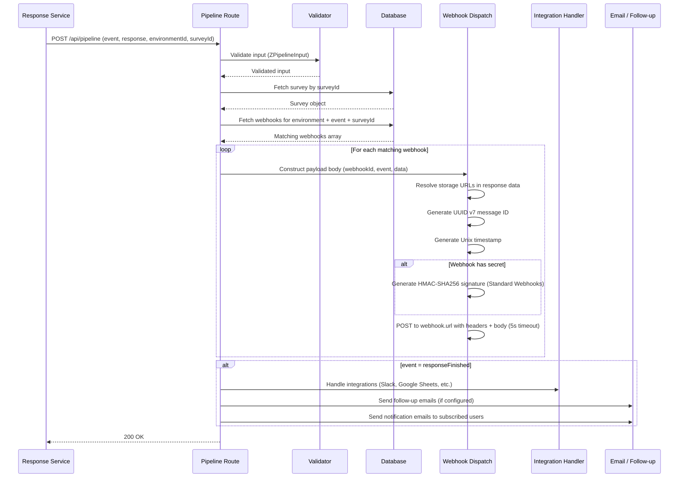

## Overview and Constraint

This document provides a comprehensive structural comparison of Formbricks and Typeform webhook payloads. Achieving webhook parity is essential for organizations migrating from Typeform to Formbricks, ensuring that downstream integrations, automation workflows, and analytics pipelines continue to function without modification.

The analysis covers the current Formbricks webhook implementation, Typeform's webhook payload schema, a field-by-field structural mapping, trigger comparisons, signature verification differences, and concrete transformation requirements to close the parity gap.

<Warning>
  **AAP Constraint:** Webhook payloads must maintain structural parity with Typeform format. This document provides a field-by-field mapping between Typeform and Formbricks webhook schemas. All transformation requirements documented here are mandatory for achieving full parity.
</Warning>

Source: `apps/web/app/api/(internal)/pipeline/route.ts`, `packages/database/zod/webhooks.ts`

For the overall parity assessment, see the [Gap Report](/development/typeform-parity/gap-report). For the existing webhook user guide, see the [Webhooks Integration Guide](/xm-and-surveys/core-features/integrations/webhooks).

## Formbricks Webhook Current Structure

The Formbricks webhook system is built on a Prisma data model with Zod validation, supporting multiple trigger types and integration sources.

### Webhook Data Model

The `Webhook` model is defined in the Prisma schema and validated by the `ZWebhook` Zod schema:

```typescript
// Source: packages/database/zod/webhooks.ts
ZWebhook = z.object({
  id: z.string().cuid2(),
  name: z.string().nullable(),
  createdAt: z.date(),
  updatedAt: z.date(),
  url: z.string().url(),
  source: z.enum(["user", "zapier", "make", "n8n"]),
  environmentId: z.string().cuid2(),
  triggers: z.array(
    z.enum(["responseFinished", "responseCreated", "responseUpdated"])
  ).min(1),
  surveyIds: z.array(z.string().cuid2()),
  secret: z.string().nullable(),
});
```

<Note>
  The Prisma schema (`packages/database/schema.prisma`, line 30) also includes `activepieces` in the `WebhookSource` enum, but the Zod schema currently validates only `user`, `zapier`, `make`, and `n8n`.
</Note>

### Pipeline Triggers Enum

The `PipelineTriggers` enum defines the three event types that can fire webhooks:

Source: `packages/database/schema.prisma` (lines 19–23)

| Trigger | Description |
|---|---|
| `responseCreated` | Fired when a new response is started (first submission) |
| `responseUpdated` | Fired when an existing response is updated with new answers |
| `responseFinished` | Fired when a response is completed (`finished: true`) |

### Webhook Source Enum

The `WebhookSource` enum identifies the origin of the webhook configuration:

Source: `packages/database/schema.prisma` (lines 25–31)

| Source | Description |
|---|---|
| `user` | Manually created by a user via the Formbricks UI or API |
| `zapier` | Created via the Zapier integration |
| `make` | Created via the Make (formerly Integromat) integration |
| `n8n` | Created via the n8n integration |
| `activepieces` | Created via the Activepieces integration |

## Formbricks Webhook Payload Structure

When a webhook fires, the pipeline route constructs a payload and dispatches it to all matching webhook endpoints. The dispatch logic is implemented in `apps/web/app/api/(internal)/pipeline/route.ts` (lines 101–145).

### Request Headers

Every webhook request includes the following Standard Webhooks–compliant headers:

| Header | Format | Description |
|---|---|---|
| `content-type` | `application/json` | Payload media type |
| `webhook-id` | UUID v7 string | Unique message identifier generated per dispatch |
| `webhook-timestamp` | Unix seconds (integer) | Timestamp when the webhook was dispatched |
| `webhook-signature` | `v1,<base64>` | HMAC-SHA256 signature — only included if the webhook has a `secret` configured |

Source: `apps/web/app/api/(internal)/pipeline/route.ts` (lines 118–136)

### Payload Body

The payload body is a JSON object constructed by spreading the response data and adding survey metadata:

```json
{
  "webhookId": "clxyz123abc456",
  "event": "responseCreated | responseUpdated | responseFinished",
  "data": {
    "id": "resp_abc123",
    "createdAt": "2025-07-24T07:47:29.507Z",
    "updatedAt": "2025-07-24T07:47:29.507Z",
    "surveyId": "surv_xyz789",
    "finished": false,
    "data": {
      "q1": "clicked",
      "q2": "Just browsing"
    },
    "ttc": {
      "q1": 2154.7,
      "q2": 3855.8
    },
    "meta": {
      "country": "DE",
      "url": "https://app.formbricks.com/s/surveyId",
      "userAgent": {
        "browser": "Chrome",
        "device": "desktop",
        "os": "macOS"
      }
    },
    "contactAttributes": null,
    "singleUseId": null,
    "language": "en",
    "variables": {},
    "displayId": "displayId",
    "endingId": null,
    "contact": null,
    "tags": [],
    "survey": {
      "title": "Customer Satisfaction Survey",
      "type": "link",
      "status": "inProgress",
      "createdAt": "2025-07-20T10:30:00.000Z",
      "updatedAt": "2025-07-24T07:45:00.000Z"
    }
  }
}
```

**Key implementation detail:** The `data` field is constructed by spreading the full response object (`...response`) and then overriding `data` with `resolvedResponseData` (which resolves storage URLs for file upload answers). A `survey` metadata object is appended with the survey title, type, status, and timestamps.

Source: `apps/web/app/api/(internal)/pipeline/route.ts` (lines 102–116)

## Typeform Webhook Payload Schema Reference

Typeform delivers webhook payloads using a structured schema with explicit field definitions and typed answer arrays. The following represents Typeform's standard webhook payload for a `form_response` event:

```json
{
  "event_id": "f1a2b3c4-d5e6-7890-abcd-ef1234567890",
  "event_type": "form_response",
  "form_response": {
    "form_id": "abc123XYZ",
    "token": "resp_token_unique_id",
    "landed_at": "2025-07-24T07:45:00Z",
    "submitted_at": "2025-07-24T07:47:56Z",
    "definition": {
      "id": "abc123XYZ",
      "title": "Customer Satisfaction Survey",
      "fields": [
        {
          "id": "field_q1",
          "title": "How did you hear about us?",
          "type": "multiple_choice",
          "ref": "how_heard"
        },
        {
          "id": "field_q2",
          "title": "Rate your experience",
          "type": "rating",
          "ref": "experience_rating"
        }
      ]
    },
    "answers": [
      {
        "field": {
          "id": "field_q1",
          "type": "multiple_choice",
          "ref": "how_heard"
        },
        "type": "choice",
        "choice": {
          "id": "choice_1",
          "label": "Social media"
        }
      },
      {
        "field": {
          "id": "field_q2",
          "type": "rating",
          "ref": "experience_rating"
        },
        "type": "number",
        "number": 5
      }
    ],
    "hidden": {
      "utm_source": "google",
      "campaign_id": "camp_123"
    },
    "calculated": {
      "score": 5
    },
    "variables": [
      {
        "key": "total_score",
        "type": "number",
        "number": 5
      }
    ]
  }
}
```

**Key structural differences from Formbricks:**
- Typeform wraps all response data under a `form_response` envelope
- Answers are an explicitly typed array (each with `field` metadata and type-specific value) rather than a flat key-value object
- The form `definition` (field list with types, titles, and refs) is included in the payload
- Hidden fields have a dedicated `hidden` object separate from contact attributes
- Variables are an array of typed objects rather than a flat key-value map

## Field-by-Field Structural Comparison

The following table provides an exhaustive mapping between every Typeform payload field and its Formbricks equivalent:

| Typeform Field | Formbricks Equivalent | Parity | Notes |
|---|---|---|---|
| `event_id` | `webhook-id` header (UUID v7) | ✅ Full | Both provide unique event identifiers; Formbricks places it in headers per Standard Webhooks spec |
| `event_type` | `event` | 🟡 Partial | Typeform uses a fixed `form_response` value; Formbricks uses granular `responseCreated` / `responseUpdated` / `responseFinished` — more expressive but structurally different |
| `form_response.form_id` | `data.surveyId` | ✅ Full | Survey/form identifier — direct semantic mapping |
| `form_response.token` | `data.id` | ✅ Full | Response/submission identifier — direct semantic mapping |
| `form_response.landed_at` | `data.createdAt` | ✅ Full | Response start time — ISO 8601 format in both |
| `form_response.submitted_at` | `data.updatedAt` | ✅ Full | Response completion/update time — ISO 8601 format in both |
| `form_response.definition` | `data.survey` (partial) | 🟡 Partial | Typeform includes full field definitions (id, title, type, ref) for every question; Formbricks includes only survey metadata (title, type, status, timestamps) — **no field-level definitions** |
| `form_response.definition.fields` | Not included | ❌ Missing | Formbricks payload does not include the survey field/element structure |
| `form_response.answers` | `data.data` | 🟡 Partial | Typeform uses a typed array with field metadata per answer; Formbricks uses a flat `{ elementId: value }` object — **different structure** |
| `form_response.answers[].field` | (implicit via key) | 🟡 Partial | Typeform explicitly attaches `field.id`, `field.type`, and `field.ref` to each answer; Formbricks uses the element ID as the object key |
| `form_response.hidden` | `data.contactAttributes` + hidden fields | 🟡 Partial | Typeform has a dedicated `hidden` object; Formbricks merges hidden fields into `contactAttributes` — **different structure** |
| `form_response.calculated.score` | `data.variables` | 🟡 Partial | Typeform uses a dedicated `calculated` object with `score`; Formbricks stores calculated values in the general-purpose `variables` object |
| `form_response.variables` | `data.variables` | 🟡 Partial | Typeform variables are an array of typed objects (`{ key, type, number/text }`); Formbricks variables are a flat key-value map |
| — | `data.ttc` | ✅ Formbricks-only | Time-to-completion metrics per element — no Typeform equivalent |
| — | `data.meta` | ✅ Formbricks-only | Browser/device metadata (country, URL, userAgent) — no Typeform equivalent |
| — | `data.finished` | ✅ Formbricks-only | Explicit completion flag — Typeform infers completion from event type |
| — | `data.singleUseId` | ✅ Formbricks-only | Single-use link tracking — no Typeform equivalent |
| — | `data.language` | ✅ Formbricks-only | Respondent locale — no Typeform equivalent |
| — | `data.displayId` | ✅ Formbricks-only | Display tracking identifier |
| — | `data.endingId` | ✅ Formbricks-only | Ending card identifier |
| — | `data.contact` | ✅ Formbricks-only | Contact reference |
| — | `data.tags` | ✅ Formbricks-only | Response tags array |

## Trigger Mapping

Typeform and Formbricks use different granularity for webhook event types:

| Typeform Event | Formbricks Trigger | Parity | Notes |
|---|---|---|---|
| `form_response` (completed) | `responseFinished` | ✅ Full | Primary completion event — direct semantic mapping |
| — | `responseCreated` | ✅ Formbricks-only | Fires when a respondent starts the survey; no Typeform equivalent. Enables real-time partial submission tracking |
| — | `responseUpdated` | ✅ Formbricks-only | Fires when a respondent submits additional answers; no Typeform equivalent. Enables progressive engagement tracking |

<Note>
  Formbricks provides **more granular** webhook triggers than Typeform. The `responseCreated` and `responseUpdated` triggers enable use cases that Typeform does not support, such as real-time partial submission monitoring and progressive response tracking. These additional triggers should be preserved in any parity implementation.
</Note>

## Signature Verification Comparison

Both platforms use HMAC-SHA256 for webhook signature verification, but with different formats, header names, and encoding schemes.

### Formbricks Signature Scheme

Formbricks follows the [Standard Webhooks](https://github.com/standard-webhooks/standard-webhooks) specification:

```typescript
// Source: apps/web/lib/crypto.ts (lines 184–194)
export const generateStandardWebhookSignature = (
  webhookId: string,
  timestamp: number,
  payload: string,
  secret: string
): string => {
  const signedContent = `${webhookId}.${timestamp}.${payload}`;
  const secretBytes = getWebhookSecretBytes(secret);
  const signature = createHmac("sha256", secretBytes)
    .update(signedContent)
    .digest("base64");
  return `v1,${signature}`;
};
```

| Property | Formbricks | Typeform |
|---|---|---|
| **Algorithm** | HMAC-SHA256 | HMAC-SHA256 |
| **Header name** | `webhook-signature` | `Typeform-Signature` |
| **Signature format** | `v1,<base64 encoded>` | `sha256=<hex encoded>` |
| **Signed content** | `${webhookId}.${timestamp}.${payload}` | Raw request body |
| **Secret format** | `whsec_<base64 encoded random bytes>` (Standard Webhooks prefix) | Plain string secret |
| **Secret decoding** | Strip `whsec_` prefix, base64 decode to raw bytes | Use secret directly as string |
| **Replay protection** | `webhook-timestamp` header with tolerance window | No built-in replay protection |
| **Spec compliance** | Standard Webhooks specification | Proprietary Typeform format |

Source: `apps/web/lib/crypto.ts` (lines 145–194)

### Key Differences

1. **Encoding:** Formbricks outputs base64-encoded signatures; Typeform outputs hex-encoded signatures.
2. **Signed content:** Formbricks signs `{id}.{timestamp}.{body}`; Typeform signs only the raw request body.
3. **Secret format:** Formbricks uses a `whsec_` prefixed base64-encoded secret following the Standard Webhooks specification; Typeform uses a plain string secret.
4. **Replay protection:** Formbricks includes a timestamp in the signed content and provides a `webhook-timestamp` header for replay attack prevention; Typeform does not include a timestamp in the signature.

## Payload Transformation Requirements

To achieve structural parity with Typeform's webhook format, the following transformations are required in the Formbricks pipeline route:

### Required Changes

<Steps>
  <Step title="Add Form Definition to Payload">
    Include the survey structure (element definitions with id, title, type, and ref) in the payload under a `definition` field. This requires fetching the survey's element list during pipeline dispatch — the current implementation already fetches the survey object for metadata.

    **Current:** `data.survey` contains only `{ title, type, status, createdAt, updatedAt }`

    **Target:** Add `data.survey.fields` array with element definitions matching Typeform's `definition.fields` format
  </Step>
  <Step title="Restructure Answer Data">
    Transform the flat `data.data` object (keyed by element ID) into a Typeform-compatible typed `answers` array where each entry includes field metadata and type-specific values.

    **Current:** `data.data = { "q1": "clicked", "q2": 5 }`

    **Target:**
    ```json
    "answers": [
      {
        "field": { "id": "q1", "type": "cta", "ref": "q1" },
        "type": "text",
        "text": "clicked"
      },
      {
        "field": { "id": "q2", "type": "rating", "ref": "q2" },
        "type": "number",
        "number": 5
      }
    ]
    ```
  </Step>
  <Step title="Separate Hidden Fields">
    Extract hidden field values into a dedicated `hidden` object, separate from `contactAttributes`. Currently, hidden fields are merged with contact attributes in the payload.

    **Current:** Hidden fields embedded in `data.contactAttributes`

    **Target:** Dedicated `data.hidden` object containing only URL-parameter hidden fields
  </Step>
  <Step title="Restructure Variables">
    Transform the flat `data.variables` key-value map into a typed array matching Typeform's variable format.

    **Current:** `data.variables = { "total_score": 5 }`

    **Target:**
    ```json
    "variables": [
      { "key": "total_score", "type": "number", "number": 5 }
    ]
    ```
  </Step>
  <Step title="Add Calculated Score">
    Introduce a `calculated` object in the payload containing a `score` field derived from survey variables, matching Typeform's `form_response.calculated.score` field.
  </Step>
  <Step title="Implement Backward Compatibility Toggle">
    Add a payload version flag or webhook configuration option that allows consumers to choose between the current Formbricks format and the Typeform-compatible format. See the [Backward Compatibility Guarantees](#backward-compatibility-guarantees) section.
  </Step>
</Steps>

## Payload Examples

The following three examples illustrate the current Formbricks format, the Typeform reference format, and the proposed Formbricks payload with Typeform structural parity.

### Example 1: Formbricks `responseFinished` Payload (Current Format)

```json
{
  "webhookId": "clxyz123abc456def",
  "event": "responseFinished",
  "data": {
    "id": "resp_abc123def456",
    "createdAt": "2025-07-24T07:47:29.507Z",
    "updatedAt": "2025-07-24T07:47:56.116Z",
    "surveyId": "surv_xyz789ghi012",
    "finished": true,
    "data": {
      "q1": "clicked",
      "q2": "accepted"
    },
    "ttc": {
      "_total": 4947.9,
      "q1": 2154.7,
      "q2": 2793.2
    },
    "meta": {
      "country": "DE",
      "url": "https://app.formbricks.com/s/surv_xyz789ghi012",
      "userAgent": {
        "browser": "Chrome",
        "device": "desktop",
        "os": "macOS"
      }
    },
    "contactAttributes": null,
    "singleUseId": null,
    "language": "en",
    "variables": {},
    "displayId": "disp_001",
    "endingId": "end_001",
    "contact": null,
    "tags": [],
    "survey": {
      "title": "Customer Satisfaction Survey",
      "type": "link",
      "status": "inProgress",
      "createdAt": "2025-07-20T10:30:00.000Z",
      "updatedAt": "2025-07-24T07:45:00.000Z"
    }
  }
}
```

Source: `docs/xm-and-surveys/core-features/integrations/webhooks.mdx` (Response Finished example)

### Example 2: Typeform `form_response` Payload (Reference Format)

```json
{
  "event_id": "f1a2b3c4-d5e6-7890-abcd-ef1234567890",
  "event_type": "form_response",
  "form_response": {
    "form_id": "abc123XYZ",
    "token": "resp_token_abc123",
    "landed_at": "2025-07-24T07:45:00Z",
    "submitted_at": "2025-07-24T07:47:56Z",
    "definition": {
      "id": "abc123XYZ",
      "title": "Customer Satisfaction Survey",
      "fields": [
        {
          "id": "field_q1",
          "title": "How did you hear about us?",
          "type": "multiple_choice",
          "ref": "how_heard"
        },
        {
          "id": "field_q2",
          "title": "Rate your experience",
          "type": "rating",
          "ref": "experience_rating"
        }
      ]
    },
    "answers": [
      {
        "field": {
          "id": "field_q1",
          "type": "multiple_choice",
          "ref": "how_heard"
        },
        "type": "choice",
        "choice": {
          "id": "choice_1",
          "label": "Social media"
        }
      },
      {
        "field": {
          "id": "field_q2",
          "type": "rating",
          "ref": "experience_rating"
        },
        "type": "number",
        "number": 5
      }
    ],
    "hidden": {
      "utm_source": "google",
      "campaign_id": "camp_123"
    },
    "calculated": {
      "score": 5
    },
    "variables": [
      {
        "key": "total_score",
        "type": "number",
        "number": 5
      }
    ]
  }
}
```

### Example 3: Proposed Formbricks Payload with Typeform Structural Parity

This example shows the proposed format that maintains structural parity with Typeform while preserving Formbricks-specific fields. The payload would be sent when the `payloadFormat: "typeform"` option is enabled on the webhook configuration.

```json
{
  "webhookId": "clxyz123abc456def",
  "event": "responseFinished",
  "event_type": "form_response",
  "data": {
    "id": "resp_abc123def456",
    "createdAt": "2025-07-24T07:47:29.507Z",
    "updatedAt": "2025-07-24T07:47:56.116Z",
    "surveyId": "surv_xyz789ghi012",
    "finished": true,
    "definition": {
      "id": "surv_xyz789ghi012",
      "title": "Customer Satisfaction Survey",
      "fields": [
        {
          "id": "q1",
          "title": "Get Started",
          "type": "cta",
          "ref": "q1"
        },
        {
          "id": "q2",
          "title": "Do you accept our terms?",
          "type": "consent",
          "ref": "q2"
        }
      ]
    },
    "answers": [
      {
        "field": { "id": "q1", "type": "cta", "ref": "q1" },
        "type": "text",
        "text": "clicked"
      },
      {
        "field": { "id": "q2", "type": "consent", "ref": "q2" },
        "type": "text",
        "text": "accepted"
      }
    ],
    "hidden": {},
    "calculated": {
      "score": 0
    },
    "variables": [],
    "ttc": {
      "_total": 4947.9,
      "q1": 2154.7,
      "q2": 2793.2
    },
    "meta": {
      "country": "DE",
      "url": "https://app.formbricks.com/s/surv_xyz789ghi012",
      "userAgent": {
        "browser": "Chrome",
        "device": "desktop",
        "os": "macOS"
      }
    },
    "language": "en",
    "displayId": "disp_001",
    "endingId": "end_001",
    "contact": null,
    "tags": [],
    "survey": {
      "title": "Customer Satisfaction Survey",
      "type": "link",
      "status": "inProgress",
      "createdAt": "2025-07-20T10:30:00.000Z",
      "updatedAt": "2025-07-24T07:45:00.000Z"
    }
  }
}
```

**Key changes in the proposed format:**
- Added `event_type: "form_response"` for Typeform compatibility
- Added `definition.fields` array with element id, title, type, and ref
- Restructured `data.data` into `answers` array with field metadata per answer
- Added dedicated `hidden` object for hidden field values
- Added `calculated.score` field
- Restructured `variables` from flat object to typed array
- Preserved all Formbricks-specific fields (`ttc`, `meta`, `language`, `displayId`, `endingId`, `contact`, `tags`, `survey`)

## Webhook Pipeline Data Flow

The following sequence diagram shows the complete webhook dispatch flow from response creation through delivery:



Source: `apps/web/app/api/(internal)/pipeline/route.ts` (lines 26–250)

## Backward Compatibility Guarantees

Any payload transformation to achieve Typeform structural parity must preserve backward compatibility for existing Formbricks webhook consumers.

<Warning>
  Existing webhook consumers must not break when payload parity features are introduced. All changes must be opt-in or additive — never destructive to the current payload format.
</Warning>

### Proposed Compatibility Strategy

The recommended approach uses a **versioned payload format** controlled by a webhook configuration option:

| Strategy | Description | Recommendation |
|---|---|---|
| **Payload format flag** | Add a `payloadFormat` field to the `Webhook` model (`"default"` for current, `"typeform"` for parity format) | ✅ Recommended — cleanest separation, per-webhook granularity |
| **Global feature flag** | Environment-level toggle for all webhooks | ❌ Not recommended — too coarse, breaks existing consumers |
| **Dual delivery** | Send both formats to each endpoint | ❌ Not recommended — doubles bandwidth and processing |
| **Header-based negotiation** | Consumer specifies preferred format via an Accept header on registration | 🟡 Alternative — requires webhook model extension |

### Implementation Approach

<Steps>
  <Step title="Extend Webhook Model">
    Add an optional `payloadFormat` field to the `Webhook` Prisma model and `ZWebhook` Zod schema. Default to `"default"` (current format) for backward compatibility.

    ```typescript
    // Proposed extension to ZWebhook
    payloadFormat: z.enum(["default", "typeform"]).default("default")
    ```
  </Step>
  <Step title="Branch Payload Construction">
    In the pipeline route (`apps/web/app/api/(internal)/pipeline/route.ts`), check `webhook.payloadFormat` before constructing the payload body. For `"default"`, use the current format; for `"typeform"`, apply the transformations from the [Payload Transformation Requirements](#payload-transformation-requirements) section.
  </Step>
  <Step title="Leverage Webhook Source for Defaults">
    Use the existing `WebhookSource` enum to apply intelligent defaults:
    - `user` webhooks: Default to `"default"`, allow user to switch to `"typeform"`
    - `zapier`, `make`, `n8n`, `activepieces` webhooks: Default to `"default"`, preserving current integration behavior
    - Future migration tools could set `"typeform"` by default for Typeform imports
  </Step>
  <Step title="Maintain Signature Compatibility">
    The Standard Webhooks signature scheme (HMAC-SHA256 with `v1,<base64>` format) must remain unchanged regardless of payload version. The signature is computed over the full body, so the only change is the body content — the signing mechanism stays the same.
  </Step>
</Steps>

<Note>
  The `payloadFormat` approach ensures zero disruption to existing consumers. New webhooks created for Typeform migration can opt into the `"typeform"` format, while all existing webhooks continue to receive the current `"default"` format unchanged.
</Note>

### Migration Path for Existing Consumers

For consumers that want to adopt the Typeform-compatible format:

1. Update webhook configuration via the API or UI to set `payloadFormat: "typeform"`
2. Update consumer code to handle the new `answers` array structure instead of the flat `data.data` object
3. Update any code that reads `data.contactAttributes` to also check the new `hidden` field
4. Test with the webhook test endpoint before enabling in production

## Summary and Parity Assessment

| Dimension | Current Parity | After Transformation |
|---|---|---|
| Trigger coverage | ✅ Full+ (Formbricks has more triggers) | ✅ Full+ |
| Event identification | ✅ Full | ✅ Full |
| Form/survey identification | ✅ Full | ✅ Full |
| Response identification | ✅ Full | ✅ Full |
| Timestamps | ✅ Full | ✅ Full |
| Form definition in payload | ❌ Missing | ✅ Full (after transformation) |
| Answer structure | 🟡 Partial (different format) | ✅ Full (after transformation) |
| Hidden fields | 🟡 Partial (merged with contacts) | ✅ Full (after transformation) |
| Variables | 🟡 Partial (flat vs typed array) | ✅ Full (after transformation) |
| Calculated scores | ❌ Missing | ✅ Full (after transformation) |
| Signature verification | ✅ Full (different but robust) | ✅ Full |
| Replay protection | ✅ Formbricks-only advantage | ✅ Full |

**Overall webhook parity: ~70% currently → ~100% after implementing the documented transformations.**

Source: `apps/web/app/api/(internal)/pipeline/route.ts` (lines 95–145), `packages/database/zod/webhooks.ts`, `apps/web/lib/crypto.ts` (lines 184–195)
