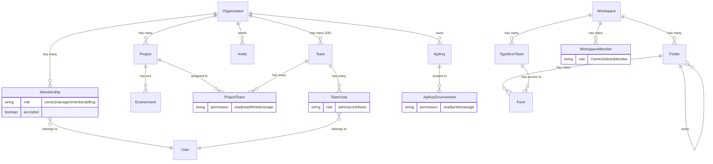

## Overview

This document compares the workspace governance models of Formbricks and Typeform to evaluate organizational parity. Formbricks implements an **Organization → Project → Team → Role** hierarchy, while Typeform uses a **Workspace → Team → Folder** model. Despite structural differences, both platforms provide equivalent multi-user governance capabilities, with Formbricks offering additional role granularity.

**Source references:**

- `packages/database/schema.prisma` — Organization, Membership, Team, Project, Invite, ApiKey models
- `apps/web/modules/organization/` — Organization management module (actions, auth, settings)
- `apps/web/modules/ee/teams/` — Enterprise team management module (roles, project teams, team list, utilities)
- `apps/web/modules/projects/` — Project management module (settings, creation, tags)

For the overall parity assessment, see the [Gap Report](/development/typeform-parity/gap-report). For user management documentation, see [User Management](/xm-and-surveys/core-features/user-management).

## Formbricks Governance Model

Formbricks uses a multi-layered hierarchy that enforces environment separation and granular access control. Each layer is backed by a Prisma model in `packages/database/schema.prisma`.

### Organization

The **Organization** is the top-level entity in Formbricks. It contains all memberships, projects, teams, invites, billing configuration, and API keys.

Source: `packages/database/schema.prisma` (line 665)

```typescript
model Organization {
  id          String       @id @default(cuid())
  name        String
  memberships Membership[]
  projects    Project[]
  billing     Json
  whitelabel  Json         @default("{}")
  invites     Invite[]
  isAIEnabled Boolean      @default(false)
  teams       Team[]
  apiKeys     ApiKey[]
}
```

Key characteristics:
- Self-hosting instances typically have a **single organization**, while Formbricks Cloud supports **multi-tenancy** with multiple organizations.
- Multi-organization creation is gated by an enterprise license check via `getIsMultiOrgEnabled` in `apps/web/modules/organization/actions.ts`.
- Billing configuration is stored as a JSON field, supporting plan-based limits (responses, monthly identified users, and feature gates).
- Whitelabel settings allow branding customization at the organization level.

### Membership

The **Membership** model links Users to Organizations with a specific role and an acceptance flag for the invite flow.

Source: `packages/database/schema.prisma` (line 697)

```typescript
model Membership {
  organization   Organization     @relation(...)
  organizationId String
  user           User             @relation(...)
  userId         String
  accepted       Boolean          @default(false)
  role           OrganizationRole @default(member)

  @@id([userId, organizationId])
}
```

Key characteristics:
- Uses a **composite primary key** (`userId` + `organizationId`) ensuring one membership per user per organization.
- The `accepted` flag enables an invite workflow where users must confirm membership before gaining access.
- Default role is `member`, escalated to `owner` when the organization is first created (see `createOrganizationAction` in `apps/web/modules/organization/actions.ts`).

### Organization Roles

The **OrganizationRole** enum defines four distinct roles with increasing levels of access.

Source: `packages/database/schema.prisma` (line 682)

| Role | Access Scope | Description |
|---|---|---|
| `owner` | Full administrative | Complete control over the organization, including billing, member management, project creation, and all settings |
| `manager` | Management-level | Manage projects, teams, surveys, and organization settings; cannot modify billing or transfer ownership |
| `member` | Standard access | Access assigned projects and surveys; cannot manage teams or organization settings |
| `billing` | Billing-only | View and manage billing configuration; cannot access projects, surveys, or organization settings |

The authorization helper in `apps/web/modules/organization/lib/utils.ts` computes access flags (`isOwner`, `isManager`, `isBillingAdmin`, `canViewBilling`) from the membership role, which are used throughout the application to gate features and UI elements.

### Project

The **Project** model is the primary grouping mechanism for resources within an organization. Each project contains exactly two environments.

Source: `packages/database/schema.prisma` (line 627)

Key characteristics:
- Lives within an Organization via `organizationId` foreign key.
- Contains **two Environments** — `production` and `development` — enforcing environment separation for testing and live operations.
- Includes project-wide configuration: styling, survey settings, recontact days, widget placement, languages, and branding.
- Has `projectTeams` relation for team-based access control.
- Project names are unique within an organization (`@@unique([organizationId, name])`).

When an organization is created, a default project named "My Project" is automatically bootstrapped via `createProject` in `apps/web/modules/organization/actions.ts`.

### Environment

The **Environment** model represents a deployment context within a project.

Source: `packages/database/schema.prisma` (line 581)

Key characteristics:
- Each project has exactly **two environments**: `production` and `development`.
- Surveys, contacts, webhooks, tags, segments, integrations, and API key permissions are all scoped to a specific environment.
- This separation ensures that development and testing activities do not affect production data or respondent experiences.

### Team (Enterprise)

<Note>
  Teams and team-based access control are Enterprise features. They require an active Enterprise license to enable.
</Note>

The **Team** model enables group-based access control for subsets of organization members.

Source: `packages/database/schema.prisma` (line 946), `apps/web/modules/ee/teams/`

```typescript
model Team {
  id             String        @id @default(cuid())
  name           String
  organizationId String
  organization   Organization  @relation(...)
  teamUsers      TeamUser[]
  projectTeams   ProjectTeam[]

  @@unique([organizationId, name])
}
```

Key characteristics:
- Lives within an Organization, uniquely identified by name within that organization.
- Links to users through the **TeamUser** junction model, which assigns team-level roles.
- Links to projects through the **ProjectTeam** junction model, which assigns project-level permissions.

**Team user roles** (from `TeamUserRole` enum, line 959):

| Team Role | Description |
|---|---|
| `admin` | Team administration — manage team membership, project assignments, and team settings |
| `contributor` | Standard team member — access projects assigned to the team based on project permissions |

**Project team permissions** (from `ProjectTeamPermission` enum, line 983):

| Permission | Description |
|---|---|
| `read` | View-only access to project surveys and responses |
| `readWrite` | View and modify surveys, responses, and project settings |
| `manage` | Full control over the project, including team assignments and configuration |

Permission precedence follows `manage > readWrite > read` when a user belongs to multiple teams with different permissions on the same project. This logic is implemented in `apps/web/modules/ee/teams/lib/roles.ts` via the `getProjectPermissionByUserId` helper.

### Invite System

The **Invite** model manages the process of adding new users to an organization.

Source: `packages/database/schema.prisma` (line 722)

Key characteristics:
- Invites are sent to an email address with a specified `OrganizationRole`.
- Invites include an `expiresAt` timestamp for time-limited access.
- The `teamIds` array specifies which teams the user will be added to upon acceptance.
- Invites track both the `creator` (who sent the invite) and `acceptor` (who accepted it).
- Once accepted, an invite is converted into a Membership record.

### API Key Management

The **ApiKey** model provides programmatic access to the Formbricks API with organization-level ownership and environment-scoped permissions.

Source: `packages/database/schema.prisma` (line 751)

Key characteristics:
- API keys are owned by an organization and created by a specific user.
- Each key has a `hashedKey` for secure storage and an optional `lookupHash` for fast retrieval.
- Access is scoped to specific environments through **ApiKeyEnvironment** junction records.
- Each environment link specifies a permission level: `read`, `write`, or `manage` (from `ApiKeyPermission` enum).
- The `organizationAccess` JSON field stores additional organization-level permission overrides.
- Keys track `lastUsedAt` for monitoring and auditing purposes.

## Typeform Workspace Model

Typeform uses a flatter governance structure organized around workspaces, teams, and folders.

### Workspace

The **Workspace** is Typeform's top-level container, equivalent to a Formbricks Organization.

Key characteristics:
- Contains all forms, teams, and workspace members.
- Billing is attached at the workspace level.
- Workspace settings control global defaults for forms, notifications, and integrations.
- Each Typeform account can access multiple workspaces.

### Team

Typeform **Teams** group workspace members for collaborative access to forms.

Key characteristics:
- Teams live within a workspace.
- Forms can be assigned to teams, granting shared access to all team members.
- Team members share access to form responses and analytics.
- Teams provide a flat grouping mechanism without hierarchical nesting.

### Folder

Typeform **Folders** provide a hierarchical organizational structure for forms.

Key characteristics:
- Folders can contain forms and other folders, enabling arbitrary nesting.
- Used purely for organization — folders do not control access permissions.
- No direct Formbricks equivalent; Formbricks uses the Project → Environment model instead.
- Folders can be shared across teams for collaborative organization.

### Roles

Typeform defines **three** workspace-level roles:

| Role | Description |
|---|---|
| Owner | Full workspace control including billing, member management, and all settings |
| Admin | Manage workspace settings, members, and teams; limited billing access |
| Member | Access assigned forms and teams; cannot modify workspace settings |

Additionally, Typeform supports **form-level permissions**:
- **View** — read-only access to form responses
- **Edit** — modify form structure and settings
- **Share** — distribute the form via links and embeds

## Governance Comparison

The following table provides a feature-by-feature comparison between the two governance models.

| Feature | Typeform | Formbricks | Status |
|---|---|---|---|
| Top-level entity | Workspace | Organization | ✅ Full |
| Sub-organization grouping | Team | Team (Enterprise) | ✅ Full (EE) |
| Content organization | Folder hierarchy | Project → Environment | 🟡 Partial — Different model |
| Role types | Owner, Admin, Member (3) | `owner`, `manager`, `member`, `billing` (4) | ✅ Full+ — More granular |
| Billing-specific role | — | `billing` role | ✅ Formbricks-only |
| Form-level permissions | View, Edit, Share | `read`, `readWrite`, `manage` (via ProjectTeam) | ✅ Full |
| API key management | Per-workspace API keys | Per-environment API keys with `read`/`write`/`manage` | ✅ Full+ — More granular |
| Invite system | Email invites with role | Email invites with role + team assignment (`teamIds`) | ✅ Full+ |
| SSO/SAML support | Enterprise plan | Enterprise license | ✅ Full |
| Folder hierarchy | Arbitrary nesting of forms | Project → Environment (2-level fixed) | 🟡 Partial — Different paradigm |
| Billing plan limits | Per-workspace | Per-organization (Free: 1,500 responses / 2,000 MIU, Startup: 5,000 / 7,500, Custom: unlimited) | ✅ Full |
| Team-level roles | — | `admin`, `contributor` (TeamUserRole) | ✅ Formbricks-only |
| Project-level permissions | — | `read`, `readWrite`, `manage` (ProjectTeamPermission) | ✅ Formbricks-only |
| Environment separation | — | Production and Development environments per project | ✅ Formbricks-only |
| Two-factor authentication | Available | Available | ✅ Full |
| Audit logging | — | Enterprise feature via `withAuditLogging` | ✅ Formbricks-only (EE) |

## Role Permissions Mapping

The following table maps Typeform roles to their closest Formbricks equivalents and documents the permissions scope of each.

| Typeform Role | Formbricks Role | Permissions Scope |
|---|---|---|
| Owner | `owner` | Full administrative access — billing, member management, project creation, organization settings, API keys, and all surveys |
| Admin | `manager` | Manage projects, teams, surveys, and organization settings; cannot modify billing or transfer ownership |
| Member | `member` | Access assigned projects and surveys; participate in teams; cannot manage organization settings |
| — | `billing` | Billing management only — view invoices, modify subscription, update payment methods; no access to projects or surveys (Formbricks-only) |

**Key difference:** Formbricks provides a dedicated `billing` role that Typeform does not have. This enables organizations to grant financial administrators access to billing without exposing survey data or project configurations.

### Team-level Role Comparison

<Note>
  Team roles and project-level permissions are Enterprise features. They require an active Enterprise license to enable.
</Note>

Formbricks extends governance beyond organization roles with **team-level roles** and **project-level permissions**, providing finer-grained access control than Typeform's workspace model.

| Formbricks Team Role | Purpose | Equivalent in Typeform |
|---|---|---|
| `admin` (TeamUserRole) | Manage team membership, settings, and project assignments | Partial — Typeform Admins manage workspace, not individual teams |
| `contributor` (TeamUserRole) | Access projects assigned to the team | Similar to Typeform Member within a team context |

| Formbricks Project Permission | Access Level | Equivalent in Typeform |
|---|---|---|
| `read` (ProjectTeamPermission) | View surveys and responses | Typeform "View" form permission |
| `readWrite` (ProjectTeamPermission) | Modify surveys, responses, and project settings | Typeform "Edit" form permission |
| `manage` (ProjectTeamPermission) | Full project control including team assignments | No direct equivalent — Typeform has no project-level management |

## Structural Model Differences

While both platforms provide multi-user governance, they use fundamentally different organizational paradigms for content structure.

### Formbricks: Project → Environment Model

Formbricks organizes content through a **fixed two-level hierarchy**:

```
Organization
├── Project A
│   ├── Production Environment
│   │   ├── Surveys
│   │   ├── Contacts
│   │   └── Webhooks
│   └── Development Environment
│       ├── Surveys
│       ├── Contacts
│       └── Webhooks
├── Project B
│   ├── Production Environment
│   └── Development Environment
└── ...
```

**Advantages of this model:**
- **Environment separation** — Development and production are strictly isolated, preventing test data from contaminating live surveys and respondent data.
- **Predictable structure** — Every project always has exactly two environments, simplifying API key scoping and webhook configuration.
- **Built-in staging workflow** — Teams can develop and test surveys in the development environment before promoting to production.

### Typeform: Folder Hierarchy Model

Typeform organizes content through an **arbitrary nesting hierarchy**:

```
Workspace
├── Folder: Marketing
│   ├── Folder: Q1 Campaigns
│   │   ├── Form: Customer Feedback
│   │   └── Form: NPS Survey
│   └── Folder: Q2 Campaigns
│       └── Form: Product Launch Survey
├── Folder: Engineering
│   └── Form: Developer Survey
└── Form: Quick Poll (unfoldered)
```

**Advantages of this model:**
- **Flexible organization** — Forms can be grouped in any way that suits the team's workflow.
- **Arbitrary depth** — Folders can be nested to any level for complex organizational structures.
- **No forced separation** — All forms exist in a single namespace without environment boundaries.

### Analysis

These are **different paradigms serving different purposes** — not a direct parity gap requiring resolution:

- Formbricks' model **enforces environment separation** (dev vs. prod), which Typeform lacks entirely. This is a significant operational advantage for teams that require staging workflows.
- Typeform's model **provides flexible form grouping**, which is useful for organizing large numbers of forms by team, campaign, or time period.
- A folder system could be added to Formbricks as a layer within projects if demand arises, but it is not required for Typeform functional parity.

## Enterprise Features

<Note>
  The following features are part of the Enterprise Edition. They require an active Enterprise license to enable. For licensing details, see [Enterprise License](/self-hosting/advanced/license).
</Note>

The following capabilities are gated behind the Enterprise license:

| Feature | Module | Description |
|---|---|---|
| Team creation and management | `apps/web/modules/ee/teams/team-list/` | Create, rename, and delete teams within an organization |
| Team membership management | `apps/web/modules/ee/teams/team-list/` | Add, remove, and update team member roles (`admin`/`contributor`) |
| Project team assignments | `apps/web/modules/ee/teams/project-teams/` | Assign teams to projects with specific permissions (`read`/`readWrite`/`manage`) |
| Advanced role-based access control | `apps/web/modules/ee/teams/lib/roles.ts` | Permission precedence computation, role-based UI gating via access flags |
| Multi-organization creation | `apps/web/modules/organization/actions.ts` | Create additional organizations (gated by `getIsMultiOrgEnabled`) |
| SSO/SAML authentication | `apps/web/modules/ee/` | Single sign-on via SAML, Azure AD, and OpenID identity providers |
| Audit logging | `apps/web/modules/ee/audit-logs/` | Organization-level audit trail for governance and compliance |

## Governance Model Comparison Diagram

The following entity-relationship diagram compares the Formbricks and Typeform governance models side by side.



## Billing Plan Limits

Formbricks enforces usage limits at the organization level based on the billing plan. These limits are stored in the `billing` JSON field of the Organization model.

| Plan | Monthly Responses | Monthly Identified Users (MIU) | Features |
|---|---|---|---|
| **Free** | 1,500 | 2,000 | Core survey features, unlimited members |
| **Startup** | 5,000 | 7,500 | Extended limits, priority support |
| **Custom** | Unlimited | Unlimited | All features including enterprise capabilities |

Typeform similarly enforces plan-based limits at the workspace level with response caps and feature gating. Both platforms provide a comparable billing governance model.

## Gap Summary and Recommendations

### Parity Assessment

The workspace governance comparison reveals **strong parity** between Formbricks and Typeform, with Formbricks exceeding Typeform in several areas:

| Assessment Area | Parity Status | Details |
|---|---|---|
| Multi-user collaboration | ✅ Full+ | Formbricks has 4 organization roles vs. Typeform's 3 |
| Team-based access control | ✅ Full (EE) | Enterprise teams provide equivalent functionality to Typeform teams |
| API key management | ✅ Full+ | Per-environment scoping with 3 permission levels exceeds Typeform's model |
| Invite workflow | ✅ Full+ | Formbricks invites include team assignment (`teamIds`) on acceptance |
| SSO/SAML | ✅ Full | Both platforms support enterprise SSO |
| Content organization | 🟡 Different paradigm | Project → Environment vs. Folder hierarchy — not a parity gap |
| Billing governance | ✅ Full | Both platforms enforce plan-based limits at the top-level entity |

### Primary Structural Difference

The only notable structural difference is **content organization**: Formbricks uses a **Project → Environment** model enforcing dev/prod separation, while Typeform uses a **Folder hierarchy** for arbitrary form grouping. This represents a different design philosophy rather than a capability gap:

- Formbricks' approach is optimized for **software development workflows** with built-in staging.
- Typeform's approach is optimized for **content management workflows** with flexible grouping.

### Recommendations

1. **No immediate action required** — Formbricks' governance model meets or exceeds Typeform parity in all critical areas.
2. **Optional enhancement** — A folder or tagging system within projects could provide Typeform-style organizational flexibility without sacrificing environment separation. This is a low-priority enhancement.
3. **Documentation priority** — Ensure the Enterprise team features are prominently documented, as they provide the governance layer that achieves parity with Typeform's team model.

For the complete parity assessment across all capability areas, see the [Gap Report](/development/typeform-parity/gap-report). For the implementation timeline, see the [Sprint Roadmap](/development/typeform-parity/sprint-roadmap).
