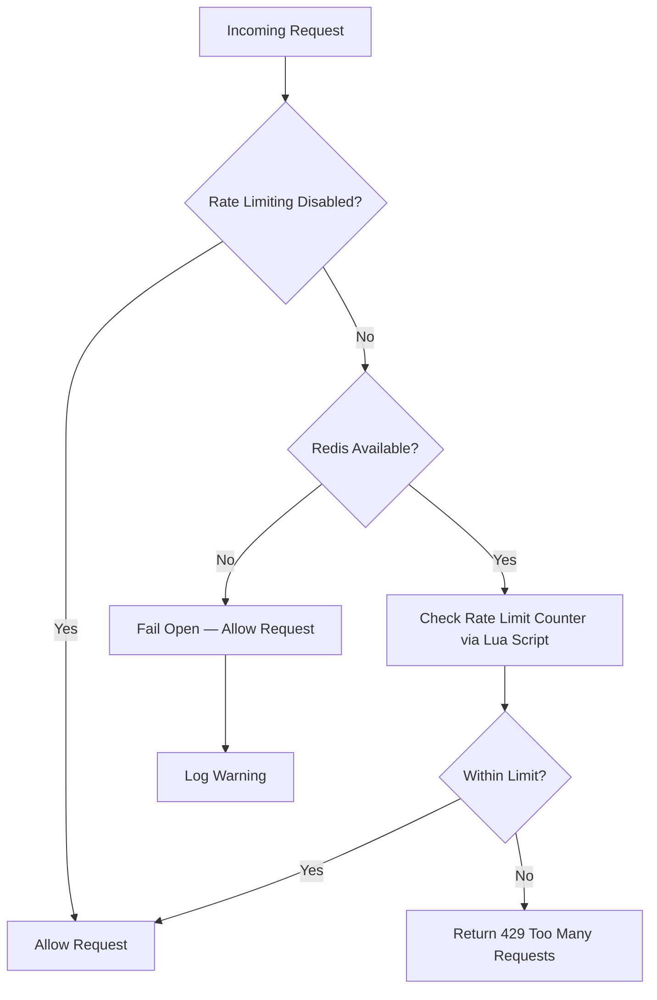

Formbricks applies request rate limits to protect against abuse and keep API usage fair. The rate limiting system uses **Redis Lua scripts** for atomic increment-and-check operations, preventing race conditions in multi-pod Kubernetes environments. Each rate limit counter is incremented and checked in a single atomic Redis operation, ensuring accuracy even under high concurrency.

Formbricks follows a **fail-open design pattern**: when Redis is unavailable, rate limiting allows all requests through to ensure system availability takes priority over perfect rate limiting. This means your application remains accessible even during temporary Redis outages.

Rate limits are scoped by identifier, depending on the endpoint:

- **IP hash** — for unauthenticated/client-side routes and public actions
- **API key ID** — for authenticated API calls
- **User ID** — for authenticated session-based calls and server actions
- **Organization ID** — for follow-up email dispatch

When a limit is exceeded, the API returns `429 Too Many Requests`.

<Note>
  Redis/Valkey is required for robust rate limiting. Set the `REDIS_URL` environment variable to point to your Redis instance. See [Environment Variables](/self-hosting/configuration/environment-variables) for details.
</Note>

## How Rate Limiting Works

The following diagram shows the rate limiting decision flow for each incoming request:



Key implementation details:

- Formbricks uses atomic Redis Lua scripts to increment counters and check limits in a single operation, preventing race conditions across multiple application pods
- Each rate limit window uses a **fixed-window algorithm** with automatic key expiry — the Redis key TTL is set to expire exactly at the window boundary
- Counter keys include the namespace, identifier, and window start timestamp (e.g., `rate-limit:api:v1:<identifier>:<window_start>`)
- If Redis is unavailable, the system **fails open** — allowing all requests through while logging a warning, ensuring service availability over strict enforcement

_Source: `apps/web/modules/core/rate-limit/rate-limit.ts`_

## Management API Rate Limits

These are the current limits for Management APIs:

| **Route Group** | **Limit** | **Window** | **Identifier** |
| --- | --- | --- | --- |
| `/api/v1/management/*` (except `/api/v1/management/storage`), `/api/v1/webhooks/*`, `/api/v1/integrations/*`, `/api/v1/management/me` | 100 requests | 1 minute | API key ID or session user ID |
| `/api/v2/management/*` (and other v2 authenticated routes that use `authenticatedApiClient`) | 100 requests | 1 minute | API key ID |
| `POST /api/v1/management/storage` | 5 requests | 1 minute | API key ID or session user ID |

## All Enforced Limits

| **Config** | **Limit** | **Window** | **Identifier** | **Used For** |
| --- | --- | --- | --- | --- |
| `auth.login` | 10 requests | 15 minutes | IP hash | Email/password login flow (`/api/auth/callback/credentials`) |
| `auth.signup` | 30 requests | 60 minutes | IP hash | Signup server action |
| `auth.forgotPassword` | 5 requests | 60 minutes | IP hash | Forgot password server action |
| `auth.verifyEmail` | 10 requests | 60 minutes | IP hash | Email verification callback + resend verification action |
| `api.v1` | 100 requests | 1 minute | API key ID or session user ID | v1 management, webhooks, integrations, and `/api/v1/management/me` |
| `api.v2` | 100 requests | 1 minute | API key ID | v2 authenticated API wrapper (`authenticatedApiClient`) |
| `api.client` | 100 requests | 1 minute | IP hash | v1 client API routes (except `/api/v1/client/og` and storage upload override), plus v2 routes that re-use those v1 handlers |
| `storage.upload` | 5 requests | 1 minute | IP hash or authenticated ID | Client storage upload and management storage upload |
| `storage.delete` | 5 requests | 1 minute | API key ID or session user ID | `DELETE /storage/[environmentId]/[accessType]/[fileName]` |
| `actions.emailUpdate` | 3 requests | 60 minutes | User ID | Profile email update action |
| `actions.surveyFollowUp` | 50 requests | 60 minutes | Organization ID | Survey follow-up email processing |
| `actions.sendLinkSurveyEmail` | 10 requests | 60 minutes | IP hash | Link survey email send action |
| `actions.licenseRecheck` | 5 requests | 1 minute | User ID | Enterprise license recheck action |

## Current Endpoint Exceptions

The following routes are currently not rate-limited by the server-side limiter:

- `GET /api/v1/client/og` (explicitly excluded)
- `POST /api/v2/client/[environmentId]/responses`
- `POST /api/v2/client/[environmentId]/displays`
- `GET /api/v2/health`

## 429 Response Shape

v1-style endpoints return:

```json
{
  "code": "too_many_requests",
  "message": "Maximum number of requests reached. Please try again later.",
  "details": {}
}
```

v2-style endpoints return:

```json
{
  "error": {
    "code": 429,
    "message": "Too Many Requests"
  }
}
```

## Disabling Rate Limiting

For self-hosters, rate limiting can be disabled if necessary. We strongly recommend keeping it enabled in production.

<Warning>
  Disabling rate limiting in production is strongly discouraged. It removes protection against brute-force attacks and API abuse. Only disable rate limiting in development or testing environments.
</Warning>

Set:

```bash
RATE_LIMITING_DISABLED=1
```

After changing this value, restart the server.

Rate limits are enforced differently based on the authentication context of the request:

- **API key-authenticated requests** — rate limited by API key ID
- **Session-authenticated requests** — rate limited by User ID
- **Unauthenticated requests** — rate limited by IP hash

## Operational Notes

- Redis/Valkey is required for robust rate limiting (`REDIS_URL`).
- If Redis is unavailable at runtime, rate-limiter checks currently fail open (requests are allowed through without enforcement).
- Authentication failure audit logging uses a separate throttle (`shouldLogAuthFailure()`) and is intentionally **fail-closed**: when Redis is unavailable or errors occur, audit log entries are **skipped entirely** rather than written without throttle control. This prevents spam while preserving the hash-integrity chain required for compliance. In other words, if Redis is down, no authentication-failure audit logs will be recorded—requests themselves are still allowed (fail-open rate limiting above), but the audit trail for those failures will not be written.
- Rate limit violations are reported to **Sentry** when `SENTRY_DSN` is configured. Violations are logged as breadcrumbs for correlation with subsequent error events, and Redis errors during rate limit checks are captured as Sentry exceptions. _(Source: `apps/web/modules/core/rate-limit/rate-limit.ts`)_

## Rate Limiting Environment Variables

The following environment variables control rate limiting behavior:

| Variable | Type | Default | Description |
|----------|------|---------|-------------|
| `REDIS_URL` | String | (required) | Redis/Valkey connection URL for rate limiting |
| `RATE_LIMITING_DISABLED` | Boolean | `0` | Set to `1` to disable all rate limiting |
| `SENTRY_DSN` | String | (optional) | Sentry DSN for monitoring rate limit violations |

For a complete list of environment variables, see [Environment Variables](/self-hosting/configuration/environment-variables).
