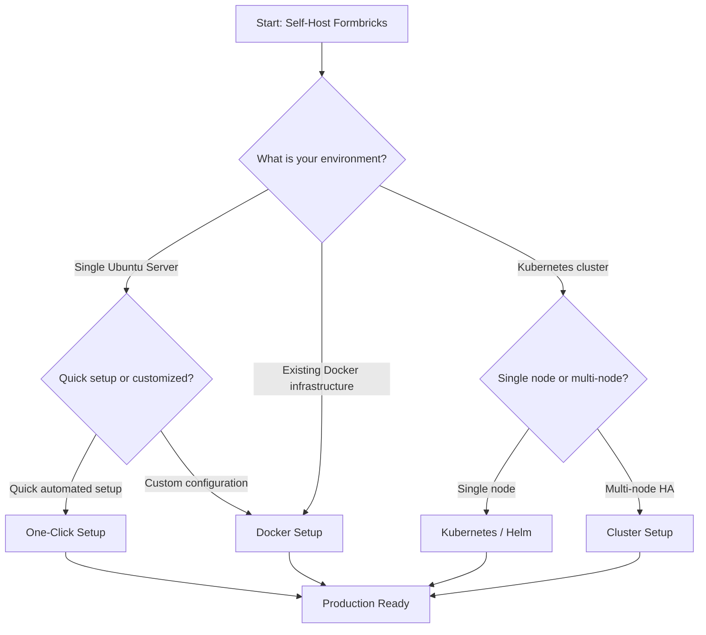

## System Requirements

<Note>
  **Minimum Setup**: 1 vCPU, 2 GB RAM, 8 GB SSD.
</Note>

<Note>
  **Recommended Production Setup**: 2+ vCPU, 4+ GB RAM, 20+ GB SSD for optimal performance with larger response volumes and file uploads.
</Note>

<Note>
  **HTTPS Required**: Ensure your server runs with a valid HTTPS certificate.
</Note>

## Choosing A Deployment Method

Use the decision tree below to determine the best deployment method for your infrastructure:

- **One-Click Setup** — Automated shell script for Ubuntu servers, ideal for getting started quickly
- **Docker Setup** — Pre-built Docker images with docker-compose, full control over services (PostgreSQL pgvector:pg17, Valkey cache, MinIO S3 storage)
- **Kubernetes / Helm** — Helm chart deployment for Kubernetes clusters
- **Cluster Setup** — Multi-node high-availability deployment for large-scale production

## Self-Hosting Options

<CardGroup cols={2}>

  <Card title="One-Click Setup" icon="rocket" href="/self-hosting/setup/one-click">
    Set up Formbricks on Ubuntu in minutes with our automated shell script.
  </Card>

  <Card title="Docker Setup" icon="docker" href="/self-hosting/setup/docker">
    Deploy with Docker Compose including PostgreSQL, Valkey, and MinIO.
  </Card>

  <Card title="Kubernetes" icon="circle-nodes" href="/self-hosting/setup/kubernetes">
    Deploy using Helm charts on Kubernetes.
  </Card>

  <Card title="Monitoring" icon="magnifying-glass-chart" href="/self-hosting/setup/monitoring">
    Configure OpenTelemetry, Prometheus, and Sentry for observability.
  </Card>

  <Card title="Migration Guide" icon="arrow-right" href="/self-hosting/advanced/migration">
    Upgrade your existing Formbricks instance smoothly.
  </Card>

  <Card title="Configuration" icon="code" href="/self-hosting/configuration/environment-variables">
    Customize your setup with 75+ environment variables.
  </Card>

  <Card title="Integrations" icon="plug" href="/self-hosting/configuration/integrations/airtable">
    Connect to Slack, Google Sheets, Notion, Airtable, and more.
  </Card>

  <Card title="Licensing" icon="file-certificate" href="/self-hosting/advanced/license">
    AGPL core license and Enterprise License for advanced features.
  </Card>

</CardGroup>

## Hosting Options

- **Cloud Hosting:** Hassle-free managed deployment at [app.formbricks.com](https://app.formbricks.com) with all features included and no maintenance required.

- **Self-Hosting Free:** Deploy on your own infrastructure with all core survey features, 15 question types, 4 distribution channels, and community support — perfect for personal use or small projects.

- **Self-Hosting With EE License:** Unlock enterprise features including SSO (OIDC/SAML), team access control, audit logging, multi-language surveys, contact management, and white-label — ideal for large teams and enterprises.

## Licensing Options Comparison

For self-hosting, the core product is free. Certain advanced features are part of the Enterprise License offering. Refer to this table to understand which features are included in each tier:

| **Feature** | Cloud Hosting | Self-Hosting Free | Self-Hosting EE License |
| --- | --- | --- | --- |
| Setup & Maintenance | Managed | DIY | DIY |
| Survey Types | All (App + Link + Email) | All (App + Link + Email) | All (App + Link + Email) |
| Question Types | All 15 | All 15 | All 15 |
| Integrations | All | All | All |
| SSO (OIDC/SAML) | Included | Not Available | Included |
| Team Access Control | Included | Not Available | Included |
| Audit Logging | Included | Not Available | Included |
| Multi-Language Surveys | Included | Not Available | Included |
| Contact Management | Included | Not Available | Included |
| White-Label | Included | Not Available | Included |
| Support | Included | Community | Prioritized |
| Price | Subscription | Free | Fixed Monthly |

For licensing queries, contact us at [**hola@formbricks.com**](mailto:hola@formbricks.com).

Formbricks is designed to be intuitive and accessible, ensuring an easy setup no matter which option you choose. Start using Formbricks today and take your surveys to the next level!

**Need Help?**
Join the conversation on [**GitHub Discussions**](https://github.com/formbricks/formbricks/discussions).
