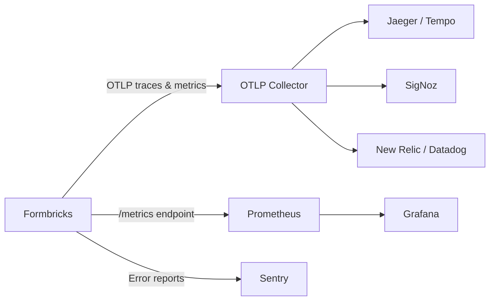

## Logging

Formbricks follows Next.js best practices with all logs being written to stdout/stderr, making it easy to collect and forward logs to your preferred logging solution.

### Log Levels

- `debug`: Detailed information for debugging purposes.
- `info`: General information about the system's operation.
- `warn`: Potential issues that may require attention.
- `error`: Errors that occur during the operation of the system.
- `fatal`: Critical errors that cause the system to crash.

### Log Format

Formbricks uses JSON format for logs, which is structured and easy to parse. Each log entry includes:

- `level`: The log level (e.g., info, error).
- `time`: Timestamp of the log entry in milliseconds since epoch.
- `pid`: Process ID of the application.
- `hostname`: Hostname of the server where the log was generated.
- `requestId`: Unique identifier for the request (if applicable).
- `userId`: Unique identifier for the user (if applicable).
- `msg`: The log message.
- `stack`: Stack trace (if applicable).
- `data`: Additional data related to the log entry.

### Example Log Entry

```json
{
  "hostname": "server-1",
  "level": 30,
  "msg": "User logged in successfully",
  "pid": 12345,
  "requestId": "abc-123",
  "time": 1710000000000,
  "userId": "user-789"
}
```

### Configuring Log Levels

You can configure the minimum log level using the `LOG_LEVEL` environment variable. Valid values: `debug`, `info`, `warn`, `error`, `fatal`.
The default log level in production environments is `warn`, while in development environments it is `debug`.

```env
LOG_LEVEL=debug
```

### Access Docker Container Logs

```bash
# One-Click setup
cd formbricks
docker compose logs

# Standard Docker commands
docker logs <container-name>
docker logs -f <container-name> # Follow logs
```

### Access Kubernetes Pod Logs

```bash
kubectl logs <pod-name> -n <namespace>
kubectl logs -f <pod-name> -n <namespace> # Follow logs
```

### Log Forwarding

Since all logs are written to stdout/stderr, you can integrate with various logging solutions:

- ELK Stack (Elasticsearch, Logstash, Kibana)
- Fluentd/Fluent Bit
- Datadog
- Splunk
- CloudWatch Logs (AWS)

## OpenTelemetry Integration

Formbricks includes built-in OpenTelemetry instrumentation via the `@opentelemetry/sdk-node` NodeSDK. When configured, it provides distributed tracing, metrics collection, and auto-instrumentation of HTTP requests, database queries (Prisma), and Node.js runtime metrics.

<Note>
  OpenTelemetry is disabled by default. It only activates when `OTEL_EXPORTER_OTLP_ENDPOINT` is set (for OTLP trace and metric export) or `PROMETHEUS_ENABLED` is set to `1` (for pull-based Prometheus metrics). Without either variable, the SDK initializes with no exporters.
</Note>

Source: `apps/web/instrumentation-node.ts`

### Configuration Environment Variables

The following environment variables control OpenTelemetry and monitoring behavior. See the [Environment Variables](/self-hosting/configuration/environment-variables) page for the full list.

| Variable | Type | Default | Description |
|----------|------|---------|-------------|
| `OTEL_EXPORTER_OTLP_ENDPOINT` | string | (none) | OTLP collector endpoint (e.g., `http://localhost:4318`). Enables trace and metric export when set. Exporters append `/v1/traces` and `/v1/metrics` automatically for HTTP transport. |
| `OTEL_EXPORTER_OTLP_PROTOCOL` | string | `http/protobuf` | Transport protocol for OTLP export. |
| `OTEL_EXPORTER_OTLP_HEADERS` | string | (none) | Additional headers for OTLP export in W3C OTel format (`key=value,key2=value2`). |
| `OTEL_SERVICE_NAME` | string | `formbricks` | Service name reported in telemetry resource attributes. |
| `OTEL_RESOURCE_ATTRIBUTES` | string | (none) | Additional resource attributes in comma-separated `key=value` format. |
| `OTEL_TRACES_SAMPLER` | string | `always_on` | Trace sampling strategy. Options: `always_on`, `always_off`, `traceidratio`, `parentbased_traceidratio`, `parentbased_always_on`, `parentbased_always_off`. |
| `OTEL_TRACES_SAMPLER_ARG` | number | `1` | Sampling ratio argument (0.0 to 1.0) for ratio-based samplers. |
| `PROMETHEUS_ENABLED` | string | (none) | Set to `1` to enable the Prometheus metrics endpoint. |
| `PROMETHEUS_EXPORTER_PORT` | number | `9464` | Port for the Prometheus metrics scrape endpoint. |
| `SENTRY_DSN` | string | (none) | Sentry DSN for error tracking and performance monitoring. |
| `SENTRY_AUTH_TOKEN` | string | (none) | Sentry auth token for source map uploads during build. |
| `SENTRY_ENVIRONMENT` | string | (none) | Environment identifier in Sentry (e.g., `production`, `staging`). |

### Setting Up OpenTelemetry Tracing

<Steps>
  <Step title="Deploy An OTLP-Compatible Collector">
    Set up an OTLP-compatible backend such as Jaeger, SigNoz, Grafana Tempo, or any platform that accepts OTLP data. Ensure the collector is reachable from your Formbricks instance.
  </Step>
  <Step title="Configure The OTLP Endpoint">
    Set the `OTEL_EXPORTER_OTLP_ENDPOINT` environment variable to point to your collector. The exporter automatically appends `/v1/traces` and `/v1/metrics` for HTTP transport.

    ```env
    OTEL_EXPORTER_OTLP_ENDPOINT=http://localhost:4318
    OTEL_SERVICE_NAME=formbricks
    ```
  </Step>
  <Step title="Configure Sampling (Optional)">
    Optionally adjust the trace sampling strategy with `OTEL_TRACES_SAMPLER` and `OTEL_TRACES_SAMPLER_ARG` to control the volume of trace data:

    ```env
    OTEL_TRACES_SAMPLER=parentbased_traceidratio
    OTEL_TRACES_SAMPLER_ARG=0.5
    ```

    This example uses parent-based sampling with a 50% trace ratio — child spans inherit the sampling decision of their parent, and root spans are sampled at 50%.
  </Step>
  <Step title="Restart Formbricks">
    Restart your Formbricks instance. The OpenTelemetry instrumentation initializes automatically on startup and logs the active exporters and sampler configuration.
  </Step>
</Steps>

**Complete example `.env` configuration:**

```env
OTEL_EXPORTER_OTLP_ENDPOINT=http://localhost:4318
OTEL_SERVICE_NAME=formbricks
OTEL_TRACES_SAMPLER=parentbased_traceidratio
OTEL_TRACES_SAMPLER_ARG=0.5
```

### Auto-Instrumentation Details

Formbricks automatically instruments the following components when OpenTelemetry is active:

- **HTTP requests and responses** — All inbound and outbound HTTP calls are traced, providing visibility into request latency and error rates.
- **Database queries** — Prisma query tracing via `@prisma/instrumentation` captures SQL execution times and query patterns.
- **Node.js runtime** — Garbage collection frequency and duration, event loop lag, and heap statistics are collected via `@opentelemetry/instrumentation-runtime-node`.

The following instrumentations are **disabled by default** to reduce noise:

- **File system (`fs`)** — Disabled to avoid tracing every file read/write operation.
- **DNS** — Disabled to reduce trace volume from DNS resolution.
- **TCP (`net`)** — Disabled to avoid low-level network tracing.
- **Raw PostgreSQL (`pg`)** — Disabled because Prisma instrumentation handles database tracing at a higher level.

<Note>
  The HTTP instrumentation automatically ignores `/health`, `/metrics`, and `/api/v2/health` endpoints to prevent health check and metrics scrape requests from generating trace noise.
</Note>

### Batch Processing Configuration

Trace spans are batched before export using a `BatchSpanProcessor` with the following settings:

| Setting | Value | Description |
|---------|-------|-------------|
| `maxQueueSize` | 2048 spans | Maximum number of spans buffered in memory before dropping. |
| `maxExportBatchSize` | 512 spans | Maximum number of spans exported in a single batch. |
| `scheduledDelayMillis` | 5000 ms (5 seconds) | Time interval between scheduled batch exports. |
| `exportTimeoutMillis` | 30000 ms (30 seconds) | Maximum time allowed for a single export operation. |

Metrics are exported every **60 seconds** via the `PeriodicExportingMetricReader`.

<Note>
  Formbricks registers a `SIGTERM` handler to gracefully shut down the OpenTelemetry SDK, ensuring all pending spans and metrics are flushed before the process exits.
</Note>

### Supported OTLP Backends

Formbricks exports telemetry data using the standard OTLP protocol, which is compatible with a wide range of observability platforms:

**Tracing Backends:**

- **Jaeger** — Open-source distributed tracing
- **Grafana Tempo** — Scalable trace storage and querying
- **Zipkin** — Distributed tracing system

**Full-Stack Observability Platforms:**

- **SigNoz** — Open-source observability (traces + metrics + logs)
- **New Relic** — APM and observability
- **Datadog** — APM and monitoring
- **Dynatrace** — Full-stack observability

**Cloud Provider Backends (via OTLP Collector):**

- **AWS X-Ray** — Distributed tracing on AWS
- **Google Cloud Trace** — Tracing on Google Cloud
- **Azure Monitor** — Monitoring on Azure

**Example: SigNoz Cloud configuration:**

```env
OTEL_EXPORTER_OTLP_ENDPOINT=https://ingest.signoz.io:443
OTEL_EXPORTER_OTLP_HEADERS=signoz-ingestion-key=YOUR_SIGNOZ_KEY
OTEL_SERVICE_NAME=formbricks
```

## Prometheus Integration

Formbricks includes a built-in Prometheus metrics exporter using the `@opentelemetry/exporter-prometheus` package. When enabled, it exposes a `/metrics` endpoint for Prometheus scraping on a dedicated port, separate from the main application.

### Enabling Prometheus Metrics

To enable and configure the Prometheus exporter, set the following environment variables:

```env
PROMETHEUS_ENABLED=1
PROMETHEUS_EXPORTER_PORT=9464  # Optional, defaults to 9464
```

The `PROMETHEUS_ENABLED` environment variable must be set to `1` to enable metrics collection. The `PROMETHEUS_EXPORTER_PORT` variable is optional and defaults to `9464` if not specified.

<Warning>
  The Prometheus exporter listens on all network interfaces (`0.0.0.0`) on the configured port. Ensure this port is accessible from your Prometheus server but **not** exposed to the public internet. Use firewall rules or network policies to restrict access.
</Warning>

### Available Metrics

The metrics exported by the Prometheus integration include:

- **Host Metrics**:

  - CPU usage (user, system, idle)
  - Memory usage (used, free, cached)
  - Disk I/O (reads, writes)
  - Network I/O (bytes in/out, packets in/out)

- **HTTP Metrics**:

  - Request counts
  - Request durations
  - Error rates

- **Runtime Metrics**:
  - Garbage collection frequency and duration
  - Event loop lag
  - Heap statistics (size, used, available)

### Prometheus Scrape Configuration

Add the following to your Prometheus configuration to scrape metrics from Formbricks:

```yaml
scrape_configs:
  - job_name: "formbricks"
    static_configs:
      - targets: ["your-formbricks-host:9464"]
```

For Kubernetes deployments using the Prometheus Operator, you can use a `ServiceMonitor` resource:

```yaml
apiVersion: monitoring.coreos.com/v1
kind: ServiceMonitor
metadata:
  name: formbricks
spec:
  selector:
    matchLabels:
      app: formbricks
  endpoints:
    - port: metrics
      interval: 5s
      path: /metrics
```

<Note>
  The Formbricks Helm chart includes a built-in ServiceMonitor that is enabled by default (`serviceMonitor.enabled: true`). Metrics are scraped every 5 seconds from the `/metrics` endpoint on port `9464`. See the [Kubernetes Deployment](/self-hosting/setup/kubernetes) guide for details.
</Note>

### Resource Attributes

The metrics include resource attributes automatically detected from:

- Environment variables
- Process information
- Host information

Additionally, the following resource attributes are set by Formbricks:

| Attribute | Source | Description |
|-----------|--------|-------------|
| `service.name` | `OTEL_SERVICE_NAME` or `formbricks` | Identifies the service in dashboards. |
| `service.version` | `npm_package_version` | Application version from `package.json`. |
| `deployment.environment` | `ENVIRONMENT` or `NODE_ENV` | Deployment environment (e.g., `production`). |

These attributes can help you filter and group metrics in your dashboards.

## Sentry Integration

Formbricks supports Sentry for error tracking and performance monitoring. Sentry captures unhandled exceptions, tracks performance bottlenecks, and provides readable stack traces with source map support.

### Configuring Sentry

```env
SENTRY_DSN=https://your-sentry-dsn@sentry.io/project-id
SENTRY_AUTH_TOKEN=your-sentry-auth-token
SENTRY_ENVIRONMENT=production
```

| Variable | Purpose |
|----------|---------|
| `SENTRY_DSN` | Enables error tracking and performance monitoring at runtime. Obtain from your Sentry project settings. |
| `SENTRY_AUTH_TOKEN` | Used during the build process by the Sentry Build Plugin to upload source maps for readable error stack traces. |
| `SENTRY_ENVIRONMENT` | Tags errors with the deployment environment name (e.g., `production`, `staging`, `development`). |

<Note>
  `SENTRY_AUTH_TOKEN` is only required during build time for source map uploads. If you are using pre-built Docker images, you only need to set `SENTRY_DSN` at runtime.
</Note>

## Observability Architecture

The following diagram illustrates the three observability paths available in Formbricks:



Formbricks provides three complementary observability paths that can be used independently or together:

1. **OTLP Export** — Distributed traces and metrics are sent to an OTLP-compatible collector via `OTEL_EXPORTER_OTLP_ENDPOINT`. The collector forwards data to backends such as Jaeger, Grafana Tempo, SigNoz, or commercial APM platforms.
2. **Prometheus Scrape** — Pull-based metrics collection from the `/metrics` endpoint. Prometheus scrapes host, HTTP, and runtime metrics at a configurable interval, which can be visualized in Grafana dashboards.
3. **Sentry** — Error tracking and performance monitoring with source map support for readable stack traces. Sentry captures unhandled exceptions and can be configured independently of OpenTelemetry.

Source: `apps/web/instrumentation-node.ts`

## Health Checks

Available endpoints:

```text
GET /health
GET /api/v2/health
```

Use these endpoints for monitoring system health in container orchestration and monitoring tools.

<Note>
  Both `/health` and `/api/v2/health` endpoints are available for health checks. The HTTP instrumentation automatically excludes these endpoints from tracing to prevent noise.
</Note>
