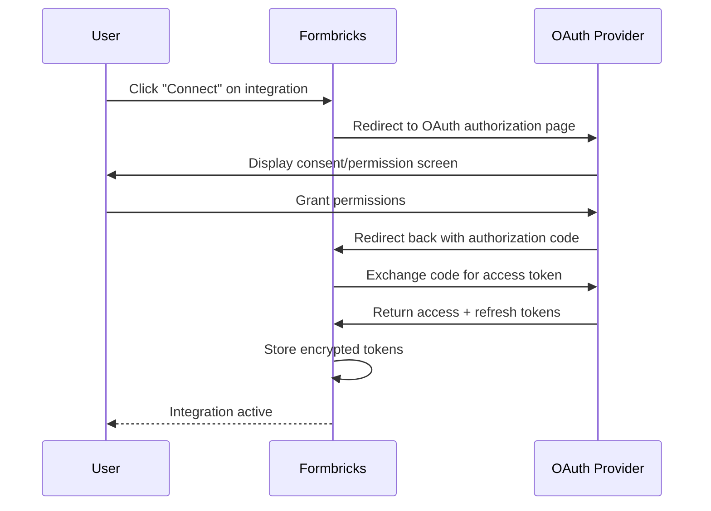

Formbricks integrates with a wide range of third-party services to help you route survey responses wherever you need them. Whether you use native OAuth-based connections or webhook-driven automation platforms, Formbricks provides step-by-step guides for every supported integration.

<Note>
  If you are on a self-hosted instance, you will need to configure these integrations manually. Please follow the guides [here](/self-hosting/configuration/integrations) to configure integrations on your self-hosted instance.
</Note>

## Integration Types

Formbricks supports four categories of integrations, each designed for different use cases and levels of customization.

### OAuth-Based (Native) Integrations

These integrations connect directly to third-party services using OAuth authentication. Formbricks manages the token exchange and data delivery automatically. Once authorized, survey responses are sent to the connected service in real time without any additional configuration.

- **Slack** — Post survey responses to Slack channels
- **Google Sheets** — Write survey responses to spreadsheet rows
- **Notion** — Create database entries from survey responses
- **Airtable** — Map survey responses to Airtable records (uses PKCE S256 challenge)

### Webhook-Based (Automation Platform) Integrations

These integrations use Formbricks webhooks to send data to automation platforms, which then route it to hundreds or thousands of downstream services. They are ideal for building complex multi-step workflows.

- **Zapier** — Connect with 5,000+ apps through Zapier automations
- **n8n** — Build flexible workflows with n8n's open-source automation platform
- **Make** (formerly Integromat) — Automate data flows with Make.com scenario builder
- **Activepieces** — Automate workflows with the open-source Activepieces tool

### Direct Integrations

These integrations embed Formbricks functionality directly into other platforms or provide raw event data via HTTP callbacks.

- **WordPress** — Embed Formbricks surveys on WordPress sites using the official plugin
- **Webhooks** — Receive real-time HTTP notifications at custom endpoints with Standard Webhooks compliance

### Indirect Integrations (Via Automation Platforms)

Some services do not have a native Formbricks integration but can be connected through automation platforms or custom webhooks.

- **HubSpot** — Sync survey responses to HubSpot CRM via Make, n8n, or custom webhooks

## Cloud Vs. Self-Hosted Setup

- **Formbricks Cloud:** Native OAuth integrations work out of the box. Navigate to **Configuration > Integrations** in your project dashboard to connect a service.
- **Self-Hosted:** Native OAuth integrations require additional configuration, including creating OAuth app credentials and setting environment variables. See [Self-Hosted Integration Configuration](/self-hosting/configuration/integrations) for detailed setup guides.

## OAuth Integration Flow

The following diagram illustrates the OAuth authorization flow used by native integrations (Slack, Google Sheets, Notion, and Airtable). This flow runs once per integration; after authorization, Formbricks stores encrypted tokens and delivers data automatically.

## Available Integrations

<CardGroup cols={3}>
  <Card title="Slack" icon="hashtag" href="/xm-and-surveys/core-features/integrations/slack">
    Send survey responses to Slack channels automatically via OAuth integration.
  </Card>
  <Card title="Google Sheets" icon="table" href="/xm-and-surveys/core-features/integrations/google-sheets">
    Write survey responses to Google Sheets spreadsheets via OAuth integration.
  </Card>
  <Card title="Notion" icon="book" href="/xm-and-surveys/core-features/integrations/notion">
    Create Notion database entries from survey responses via OAuth integration.
  </Card>
  <Card title="Airtable" icon="table-columns" href="/xm-and-surveys/core-features/integrations/airtable">
    Map survey responses to Airtable records via PKCE OAuth integration.
  </Card>
  <Card title="Webhooks" icon="webhook" href="/xm-and-surveys/core-features/integrations/webhooks">
    Receive real-time HTTP notifications with Standard Webhooks compliance.
  </Card>
  <Card title="Zapier" icon="bolt" href="/xm-and-surveys/core-features/integrations/zapier">
    Connect Formbricks with 5,000+ apps through Zapier automation.
  </Card>
  <Card title="n8n" icon="circle-nodes" href="/xm-and-surveys/core-features/integrations/n8n">
    Build flexible workflows with n8n's open-source automation platform.
  </Card>
  <Card title="Make" icon="wand-magic-sparkles" href="/xm-and-surveys/core-features/integrations/make">
    Automate data flows with Make.com's powerful scenario builder.
  </Card>
  <Card title="WordPress" icon="plug" href="/xm-and-surveys/core-features/integrations/wordpress">
    Embed Formbricks surveys on WordPress sites with the official plugin.
  </Card>
  <Card title="Activepieces" icon="puzzle-piece" href="/xm-and-surveys/core-features/integrations/activepieces">
    Automate workflows with Activepieces open-source automation tool.
  </Card>
  <Card title="HubSpot" icon="address-book" href="/xm-and-surveys/core-features/integrations/hubspot">
    Sync survey responses to HubSpot CRM via Make, n8n, or webhooks.
  </Card>
</CardGroup>

---

If you have any questions or need help with any of the integrations or even want a new integration, please reach out to us on [Github Discussions](https://github.com/formbricks/formbricks/discussions).

<!-- Source: apps/web/modules/integrations/ -->
