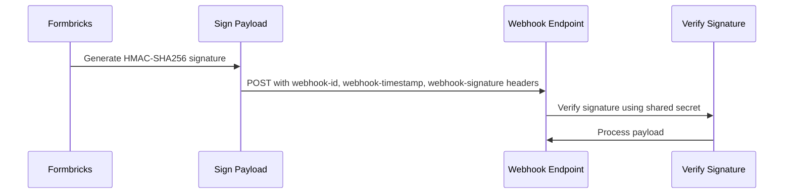

## Webhook Triggers

Webhooks are configured to send notifications based on trigger events. The available triggers include:

- **`responseCreated`**

- **`responseUpdated`**

- **`responseFinished`**

---

## Webhook Configuration

The following options are available when creating a webhook:

| Configuration | Description | Required |
|--------------|-------------|----------|
| **URL** | The HTTPS endpoint that will receive webhook payloads | Yes |
| **Triggers** | Which events fire the webhook: `responseCreated`, `responseUpdated`, `responseFinished` | Yes (at least one) |
| **Survey Filter** | Optionally restrict the webhook to fire only for specific surveys | No (defaults to all surveys) |
| **Name** | Optional descriptive name for the webhook | No |

**Trigger Events Detail:**

| Event | Description | When Fired |
|-------|-------------|------------|
| `responseCreated` | A new response has been submitted | When the first question of a survey is answered |
| `responseUpdated` | An existing response has been updated | When additional questions are answered in a multi-step survey |
| `responseFinished` | A response has been completed | When all required questions are answered and the survey is submitted |

Source: `apps/web/modules/integrations/webhooks/components/trigger-checkbox-group.tsx` lines 27-35

---

## Creating Webhooks

You can create webhooks either through the **Formbricks App UI** or programmatically via the **Webhook API**.

## Creating Webhooks Via UI

- **Log in to Formbricks**
  and click on the `Configuration` tab in the left sidebar and then click on the `Integrations` tab.


- Click on **Manage Webhooks** & then **Add Webhook** button:


- Add your webhook listener endpoint & test it to make sure it can receive the test endpoint otherwise you will not be able to save it.


- Now add the triggers you want to listen to and the surveys!

- That's it! Your webhooks will not start receiving data as soon as it arrives!


## Creating Webhooks Via API

Use our documented methods on the **Creation**, **List**, and **Deletion** endpoints of the Webhook API mentioned in our [API v2 playground](https://formbricks.com/docs/api-v2-reference/management-api-%3E-webhooks/get-webhooks).

If you encounter any issues or need help setting up webhooks, feel free to reach out to us on [GitHub Discussions](https://github.com/formbricks/formbricks/discussions). 😃

---

## Discord URL Blocking

Formbricks blocks Discord webhook URLs to prevent misuse of the webhook system. Attempting to register a Discord webhook URL will result in an error.

**Blocked URL pattern:** `https://discord.com/api/webhooks/{id}/{token}`

<Warning>
  Discord webhook URLs (`https://discord.com/api/webhooks/...`) are not supported and will be rejected.
  Use an automation platform to route data to Discord instead.
</Warning>

If you need to send Formbricks data to Discord, use an automation platform like n8n or Zapier as an intermediary. See the [n8n integration guide](/xm-and-surveys/core-features/integrations/n8n) for an example using Discord as a destination.

Source: `isDiscordWebhook()` function in `apps/web/modules/integrations/webhooks/lib/utils.ts`

---

## URL Validation Rules

When registering a webhook endpoint, the URL must pass all of the following validation checks:

1. **HTTPS Required** — URL must start with `https://`
2. **Valid Domain** — Must have a valid domain with a TLD of 2+ characters (e.g., `.com`, `.io`, `.dev`)
3. **No Multiple Consecutive Slashes** — URL path cannot contain `//` (except in the protocol `https://`)
4. **Complete URL** — Must be a fully-formed URL that can be parsed by the URL constructor
5. **No Discord URLs** — Discord webhook URLs are blocked (see [Discord URL Blocking](#discord-url-blocking) above)

**Error Messages Returned For Invalid URLs:**

| Validation Failure | Error Message |
|-------------------|---------------|
| Empty URL | "Please enter a URL" |
| Not HTTPS | "URL must start with https://" |
| Invalid domain or multiple slashes | "Please enter a complete URL with a valid domain (e.g., https://formbricks.com)" |
| Malformed URL | "Invalid URL format. Please enter a complete URL including https://" |

Source: `validWebHookURL()` in `apps/web/modules/integrations/webhooks/lib/utils.ts`

---

## Webhook Security With Standard Webhooks

Formbricks implements the [Standard Webhooks](https://github.com/standard-webhooks/standard-webhooks) specification to ensure webhook requests can be verified as genuinely originating from Formbricks. For complete specification details, see the [Standard Webhooks specification](https://github.com/standard-webhooks/standard-webhooks/blob/main/spec/standard-webhooks.md).

The following sequence diagram illustrates the webhook delivery and verification flow:



### Webhook Headers

Every webhook request includes the following headers:

| Header              | Description                                          | Example                                |
| ------------------- | ---------------------------------------------------- | -------------------------------------- |
| `webhook-id`        | Unique message identifier                            | `019ba292-c1f6-7618-aaf2-ecf8e39d1cc7` |
| `webhook-timestamp` | Unix timestamp (seconds) when the webhook was sent   | `1704547200`                           |
| `webhook-signature` | HMAC-SHA256 signature (only if secret is configured) | `v1,K3Q2bXlzZWNyZXQ=`                  |

### Signing Secret

When you create a webhook (via the UI or API), Formbricks automatically generates a unique signing secret for that webhook. The secret follows the Standard Webhooks format: `whsec_` followed by a base64-encoded random value.

Source: `generateWebhookSecret()` in `apps/web/lib/crypto.ts` line 155

**Via UI:** After creating a webhook, the signing secret is displayed immediately. Copy and store it securely—you can also view it later in the webhook settings.

**Via API:** The signing secret is returned in the webhook creation response.

This secret is used to generate the HMAC signature included in each webhook request, allowing you to verify the authenticity of incoming webhooks.

Source: `generateStandardWebhookSignature()` in `apps/web/lib/crypto.ts` line 184

### Signature Verification

The signature is computed as follows:

```text
signed_content = "{webhook-id}.{webhook-timestamp}.{body}"
signature = base64(HMAC-SHA256(secret, signed_content))
header_value = "v1,{signature}"
```

The signature output format is `v1,{base64_signature}` where `v1` denotes the signature version.

Source: `apps/web/lib/crypto.ts` line 193

### Validating Webhooks

To validate incoming webhook requests:

1. Extract the `webhook-id`, `webhook-timestamp`, and `webhook-signature` headers
2. Verify the timestamp is within an acceptable tolerance (e.g., 5 minutes) to prevent replay attacks
3. Decode the secret by stripping the `whsec_` prefix and base64 decoding the rest
4. Compute the expected signature using HMAC-SHA256 with the decoded secret
5. Compare your computed signature with the received signature (after stripping the `v1,` prefix)

### Node.js Verification Functions

```javascript
const crypto = require("crypto");

const WEBHOOK_TOLERANCE_IN_SECONDS = 300; // 5 minutes

/**
 * Decodes a Formbricks webhook secret (whsec_...) to raw bytes
 */
function decodeSecret(secret) {
  const base64 = secret.startsWith("whsec_") ? secret.slice(6) : secret;
  return Buffer.from(base64, "base64");
}

/**
 * Verifies the webhook timestamp is within tolerance
 * @throws {Error} if timestamp is too old or too new
 */
function verifyTimestamp(timestampHeader) {
  const now = Math.floor(Date.now() / 1000);
  const timestamp = parseInt(timestampHeader, 10);

  if (isNaN(timestamp)) {
    throw new Error("Invalid timestamp");
  }

  if (Math.abs(now - timestamp) > WEBHOOK_TOLERANCE_IN_SECONDS) {
    throw new Error("Timestamp outside tolerance window");
  }

  return timestamp;
}

/**
 * Computes the expected signature for a webhook payload
 */
function computeSignature(webhookId, timestamp, body, secret) {
  const signedContent = `${webhookId}.${timestamp}.${body}`;
  const secretBytes = decodeSecret(secret);
  return crypto.createHmac("sha256", secretBytes).update(signedContent).digest("base64");
}

/**
 * Verifies a Formbricks webhook request
 * @param {string} body - Raw request body as string
 * @param {object} headers - Object containing webhook-id, webhook-timestamp, webhook-signature
 * @param {string} secret - Your webhook secret (whsec_...)
 * @returns {boolean} true if valid
 * @throws {Error} if verification fails
 */
function verifyWebhook(body, headers, secret) {
  const webhookId = headers["webhook-id"];
  const webhookTimestamp = headers["webhook-timestamp"];
  const webhookSignature = headers["webhook-signature"];

  if (!webhookId || !webhookTimestamp || !webhookSignature) {
    throw new Error("Missing required webhook headers");
  }

  // Verify timestamp
  const timestamp = verifyTimestamp(webhookTimestamp);

  // Compute expected signature
  const expectedSignature = computeSignature(webhookId, timestamp, body, secret);

  // Extract signature from header (format: "v1,{signature}")
  const receivedSignature = webhookSignature.split(",")[1];

  if (!receivedSignature) {
    throw new Error("Invalid signature format");
  }

  // Use constant-time comparison to prevent timing attacks
  const expectedBuffer = Buffer.from(expectedSignature, "utf8");
  const receivedBuffer = Buffer.from(receivedSignature, "utf8");

  if (
    expectedBuffer.length !== receivedBuffer.length ||
    !crypto.timingSafeEqual(expectedBuffer, receivedBuffer)
  ) {
    throw new Error("Invalid signature");
  }

  return true;
}

module.exports = { verifyWebhook, decodeSecret, computeSignature, verifyTimestamp };
```

**Usage:**

```javascript
// In your webhook handler, use the raw body (not parsed JSON)
try {
  verifyWebhook(rawBody, req.headers, process.env.FORMBRICKS_WEBHOOK_SECRET);
  const payload = JSON.parse(rawBody);
  // Process verified webhook...
} catch (error) {
  // Verification failed - reject the request
  console.error("Webhook verification failed:", error.message);
}
```

<Note>
  Always use the **raw request body** (as a string) for signature verification, not the parsed JSON object.
  Parsing and re-stringifying can change the formatting and break signature validation.
</Note>

### Using Standard Webhooks Libraries

You can also use the official [Standard Webhooks libraries](https://github.com/standard-webhooks/standard-webhooks#libraries) available for various languages:

- **Node.js**: `npm install standardwebhooks`
- **Python**: `pip install standardwebhooks`
- **Go, Ruby, Java, Kotlin, PHP, Rust**: See the [Standard Webhooks GitHub](https://github.com/standard-webhooks/standard-webhooks)

---

## Example Webhook Payloads

We provide the following webhook payloads, `responseCreated`, `responseUpdated`, and `responseFinished`.

### Response Created

Example of Response Created webhook payload:

```json
[
  {
    "data": {
      "contact": null,
      "contactAttributes": null,
      "createdAt": "2025-07-24T07:47:29.507Z",
      "data": {
        "q1": "clicked"
      },
      "displayId": "displayId",
      "endingId": null,
      "finished": false,
      "id": "responseId",
      "language": "en",
      "meta": {
        "country": "DE",
        "url": "https://app.formbricks.com/s/surveyId",
        "userAgent": {
          "browser": "Chrome",
          "device": "desktop",
          "os": "macOS"
        }
      },
      "singleUseId": null,
      "survey": {
        "createdAt": "2025-07-20T10:30:00.000Z",
        "status": "inProgress",
        "title": "Customer Satisfaction Survey",
        "type": "link",
        "updatedAt": "2025-07-24T07:45:00.000Z"
      },
      "surveyId": "surveyId",
      "tags": [],
      "ttc": {
        "q1": 2154.700000047684
      },
      "updatedAt": "2025-07-24T07:47:29.507Z",
      "variables": {}
    },
    "event": "responseCreated",
    "webhookId": "webhookId"
  }
]
```

### Response Updated

Example of Response Updated webhook payload:

```json
[
  {
    "data": {
      "contact": null,
      "contactAttributes": null,
      "createdAt": "2025-07-24T07:47:29.507Z",
      "data": {
        "q1": "clicked",
        "q2": "Just browsing"
      },
      "displayId": "displayId",
      "endingId": null,
      "finished": false,
      "id": "responseId",
      "language": "en",
      "meta": {
        "country": "DE",
        "url": "https://app.formbricks.com/s/surveyId",
        "userAgent": {
          "browser": "Chrome",
          "device": "desktop",
          "os": "macOS"
        }
      },
      "singleUseId": null,
      "survey": {
        "createdAt": "2025-07-20T10:30:00.000Z",
        "status": "inProgress",
        "title": "Customer Satisfaction Survey",
        "type": "link",
        "updatedAt": "2025-07-24T07:45:00.000Z"
      },
      "surveyId": "surveyId",
      "tags": [],
      "ttc": {
        "q1": 2154.700000047684,
        "q2": 3855.799999952316
      },
      "updatedAt": "2025-07-24T07:47:33.696Z",
      "variables": {}
    },
    "event": "responseUpdated",
    "webhookId": "webhookId"
  }
]
```

### Response Finished

Example of Response Finished webhook payload:

```json
[
  {
    "data": {
      "contact": null,
      "contactAttributes": null,
      "createdAt": "2025-07-24T07:47:29.507Z",
      "data": {
        "q1": "clicked",
        "q2": "accepted"
      },
      "displayId": "displayId",
      "endingId": "endingId",
      "finished": true,
      "id": "responseId",
      "language": "en",
      "meta": {
        "country": "DE",
        "url": "https://app.formbricks.com/s/surveyId",
        "userAgent": {
          "browser": "Chrome",
          "device": "desktop",
          "os": "macOS"
        }
      },
      "singleUseId": null,
      "survey": {
        "createdAt": "2025-07-20T10:30:00.000Z",
        "status": "inProgress",
        "title": "Customer Satisfaction Survey",
        "type": "link",
        "updatedAt": "2025-07-24T07:45:00.000Z"
      },
      "surveyId": "surveyId",
      "tags": [],
      "ttc": {
        "_total": 4947.899999035763,
        "q1": 2154.700000047684,
        "q2": 2793.199999988079
      },
      "updatedAt": "2025-07-24T07:47:56.116Z",
      "variables": {}
    },
    "event": "responseFinished",
    "webhookId": "webhookId"
  }
]
```
