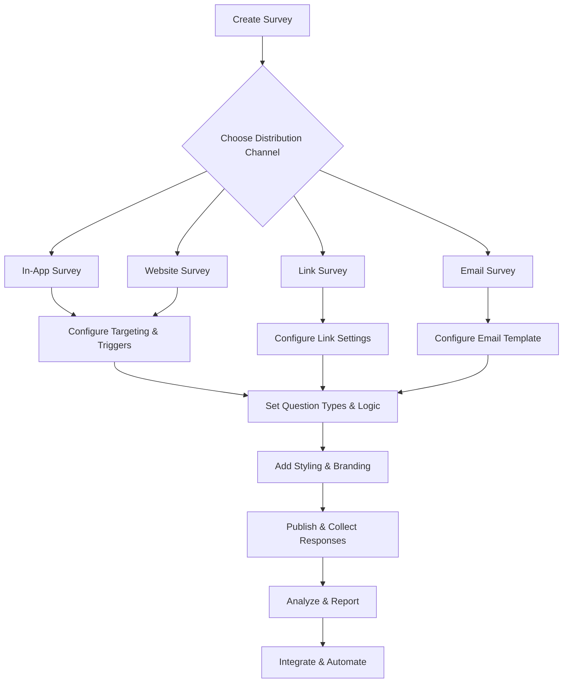

Experience Management is the practice of measuring and managing how a stakeholder group of an organization (customers, employees, patients, citizens, etc...) experience the products or services of the organization.

Formbricks is a comprehensive open-source Experience Management platform with 26 features spanning survey creation, multi-channel distribution, analytics, integrations, and enterprise-grade access control. Distribute surveys across 4 channels — in-app, website, link, and email — and choose from 15 question types to build the perfect experience measurement workflow.

Historically, Experience Management has three steps:

1. **Gather** data

2. **Analyze** and report on the data

3. **Integrate** and automate to measure experiences at scale

## Survey Creation Workflow

The following diagram illustrates the end-to-end survey creation and distribution workflow:

## Gather Data

The heart of Formbricks data gathering is a powerful yet user-friendly survey builder. With a simple drag-and-drop interface, you can add questions, set response options, handle variables, set up complex logic, and manage quotas. Surveys have a modern look and feel, can be fully customized to match your brand, and keep respondent data safe.

### Distribution Channels

Formbricks supports 4 distribution channels so you can reach respondents wherever they are:

- **In-App Surveys** — Trigger surveys inside your web or mobile application based on user actions and segments
- **Website Surveys** — Embed surveys on your website to capture visitor feedback with the lightweight 7KB SDK
- **Link Surveys** — Share standalone survey URLs via any channel, with options for single-use links, PIN protection, and email verification
- **Email Surveys** — Deliver surveys directly to respondents' inboxes with customizable email templates

### Question Types

Choose from 15 question types to build the perfect survey experience:

| Question Type | Description |
|---------------|-------------|
| Free Text | Open-ended text input for custom answers |
| Single Select | Choose one option from a list |
| Multi Select | Choose multiple options from a list |
| Net Promoter Score (NPS) | Standard 0–10 NPS rating scale |
| Statement / CTA | Display information or a call-to-action button |
| Rating | Star, smiley, or numeric rating scales (supports CSAT scoring) |
| Consent | Collect explicit consent with a checkbox |
| Picture Selection | Choose from image-based options |
| Schedule A Meeting | Integrate with Cal.com for appointment booking |
| Date | Date picker input |
| Matrix | Grid-based questions with rows and columns |
| Address | Structured address input fields |
| Ranking | Drag-and-drop ranking of options |
| Contact Info | Collect name, email, phone, and company details |
| File Upload | Accept file attachments (5 MB / 10 MB / 1 GB limits by plan) |

### General Features

Formbricks surveys include a rich set of features to create personalized, intelligent survey experiences:

- **Conditional Logic** — Branch surveys based on previous answers using conditions, calculations, and jump-to-block actions
- **Hidden Fields** — Pass contextual data into surveys without displaying it to respondents
- **Multi-Language Surveys** — Deliver surveys in up to 14 locales for global audiences
- **Partial Submissions** — Capture incomplete responses to maximize data collection
- **Email Follow-Ups** — Trigger automated email follow-ups based on survey responses
- **Recall / Piping** — Reference previous answers in subsequent questions for a personalized flow
- **Variables** — Use calculated variables to create dynamic survey logic
- **Spam Protection** — Protect surveys with Cloudflare Turnstile or Google reCAPTCHA
- **Validation Rules** — Enforce input constraints using Zod-based validation schemas

<CardGroup cols={2}>

  <Card title="General Features" icon="sliders" href="/xm-and-surveys/surveys/general-features/conditional-logic">
    Explore conditional logic, hidden fields, multi-language support, partial submissions, and more.
  </Card>

  <Card title="Link Surveys" icon="link" href="/xm-and-surveys/surveys/link-surveys/quickstart">
    Create shareable survey links with single-use tokens, PIN protection, data prefilling, and source tracking.
  </Card>

  <Card title="Website & App Surveys" icon="browser" href="/xm-and-surveys/surveys/website-app-surveys/quickstart">
    Embed surveys in your web or mobile application with the lightweight JavaScript SDK.
  </Card>

  <Card title="Question Types" icon="circle-question" href="/xm-and-surveys/surveys/question-type/free-text">
    Browse all 15 question types with interactive previews and configuration options.
  </Card>

</CardGroup>

## Analytics & Report

Formbricks gives you clear analytics and insights to understand user responses. The response analytics dashboard organizes survey results into easy-to-read formats, helping you spot trends, identify issues, and find opportunities for improvement.

- **CSAT Scoring** — Automatically calculate Customer Satisfaction scores from rating questions
- **Insight Generation** — Surface key patterns and themes from response data
- **Shareable Analytics** — Generate public links to share analytics dashboards with stakeholders
- **Data Export** — Export responses to `.csv` or `.xlsx`, or pipe data to your data lake via the REST API

## Integrate & Automate

Experience Management scales best when it is automated. Formbricks provides a comprehensive set of integrations and APIs to connect your survey data with your existing tech stack.

### Native Integrations

- [Slack](/xm-and-surveys/core-features/integrations/slack) — Forward survey responses to Slack channels in real time
- [Google Sheets](/xm-and-surveys/core-features/integrations/google-sheets) — Automatically sync responses to a Google Sheet
- [Notion](/xm-and-surveys/core-features/integrations/notion) — Send responses to a Notion database
- [Airtable](/xm-and-surveys/core-features/integrations/airtable) — Push responses to Airtable bases

### Automation Platforms

- [Zapier](/xm-and-surveys/core-features/integrations/zapier) — Connect Formbricks with 5,000+ apps
- [n8n](/xm-and-surveys/core-features/integrations/n8n) — Build automation workflows with the open-source n8n platform
- [ActivePieces](/xm-and-surveys/core-features/integrations/activepieces) — Automate workflows with the open-source ActivePieces tool
- [Make](/xm-and-surveys/core-features/integrations/make) — Leverage Make's visual automation builder

### Additional Integrations

- [WordPress](/xm-and-surveys/core-features/integrations/wordpress) — Embed surveys on WordPress sites
- [HubSpot](/xm-and-surveys/core-features/integrations/hubspot) — Create or update HubSpot contacts from survey responses
- **Webhooks** — Receive real-time event notifications with [Standard Webhooks](https://github.com/standard-webhooks/standard-webhooks) compliance and HMAC-SHA256 signing

### REST API

Formbricks offers a comprehensive REST API in two versions — [API v1](/api-reference/rest-api) (stable) and [API v2](/api-v2-reference/introduction) (beta) — enabling full programmatic access to surveys, responses, contacts, and more.

For the complete list of integrations and setup guides, visit the [integrations overview](/xm-and-surveys/core-features/integrations/overview).

## Core Features

Beyond surveys and analytics, Formbricks includes essential platform features for managing your organization and customizing the survey experience.

- **User Management** — Manage organizations, teams, and roles with fine-grained permissions at the organization, team, and project levels. [Learn more](/xm-and-surveys/core-features/user-management).
- **Styling & Theming** — Fully customize the look and feel of your surveys using a CSS variable system, brand colors, fonts, and background images. [Learn more](/xm-and-surveys/core-features/styling-theme).
- **Email Customization** — Customize transactional email templates with your branding, logo, and legal footers. [Learn more](/xm-and-surveys/core-features/email-customization).
- **Test Environment** — Test surveys in a dedicated environment before publishing them to production. [Learn more](/xm-and-surveys/core-features/test-environment).

## Enterprise Features

Formbricks Enterprise Edition provides advanced capabilities for organizations that require enhanced security, compliance, and scale.

<Note>
  Enterprise features require an active enterprise license. Visit the [license management](/self-hosting/advanced/license) page for details.
</Note>

- **SSO (SAML / OIDC)** — Enable Single Sign-On with SAML 2.0 or OpenID Connect identity providers for secure, centralized authentication
- **Audit Logging** — Track all user actions with an asynchronous audit log queue and Zod-validated event records
- **Team-Based Access Control** — Assign team-level roles (admin, contributor) for granular project access management
- **Contact Management & Segments** — Manage contacts, attributes, and advanced segmentation rules for targeted survey distribution
- **Multi-Language Surveys** — Deliver surveys in up to 14 locales with full translation management
- **Email Follow-Ups (Whitelabel)** — Send branded follow-up emails without Formbricks branding
- **Billing & Quotas** — Manage subscription plans with response quotas (Free: 1,500 responses, Startup: 5,000 responses) and monthly identified user limits
- **Role Management** — Configure organization-level roles (owner, manager, member, billing) for precise access control
- **Whitelabel (Hide Powered By)** — Remove "Powered by Formbricks" branding from surveys
- **Two-Factor Authentication** — Secure accounts with TOTP-based two-factor authentication and backup codes

## Best Practices

Formbricks provides 13 best practice guides to help you get the most out of your experience management program. These guides cover proven methodologies for common use cases, from measuring product-market fit to collecting in-app feedback.

<CardGroup cols={2}>

  <Card title="Product-Market Fit Survey" icon="chart-line-up" href="/xm-and-surveys/xm/best-practices/pmf-survey">
    Measure product-market fit using the proven Superhuman methodology.
  </Card>

  <Card title="Feedback Box" icon="comment" href="/xm-and-surveys/xm/best-practices/feedback-box">
    Collect contextual feedback from users with an always-available feedback widget.
  </Card>

  <Card title="Feature Chaser" icon="bullseye" href="/xm-and-surveys/xm/best-practices/feature-chaser">
    Follow up with users after they interact with a specific feature.
  </Card>

  <Card title="Interview Prompt" icon="microphone" href="/xm-and-surveys/xm/best-practices/interview-prompt">
    Identify and recruit users for qualitative interviews directly from your app.
  </Card>

</CardGroup>
