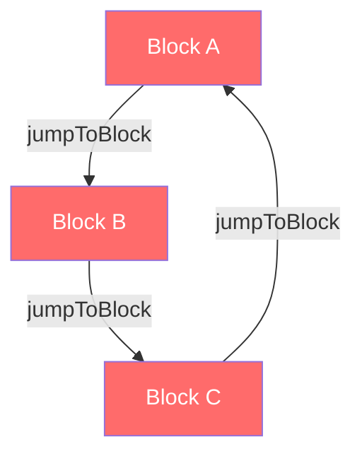

## Terminology

- **Condition**: A rule that determines when an action should be executed. Conditions evaluate data from question answers, variables, or hidden fields against specified operators and values.

- **Action**: A task that is executed when a condition is met. Actions include performing calculations, requiring answers, and jumping to specific blocks.

- **Block**: A group of one or more survey questions (elements) that are displayed together. Logic operates at the block level — conditions evaluate data and actions control survey flow between blocks.

## Creating Logic

- **Add a Logic Block**: Click the `Add logic +` button to add a new logic block.

<Note>
  You can add multiple logic blocks to a survey. Logic blocks are executed in
  the order they are added. You can rearrange the order of logic blocks.
</Note>

## Conditions

Add conditions to the logic block. Conditions are rules that determine when an action should be executed.

### Condition Sources (Left Operand)

Conditions can be based on the following data sources:

- **Element (Question)**: The answer to a specific survey question. References the question by its element ID.

- **Variable**: The current value of a survey variable. Variables can be text or number types and are updated dynamically during survey completion. See [Variables](/xm-and-surveys/surveys/general-features/variables) for details.

- **Hidden Field**: The value of a hidden field passed into the survey via URL parameters or SDK initialization.

*Source: `packages/types/surveys/logic.ts` — `ZDynamicLogicFieldValue`*

### Condition Options

Choose from a list of available conditions.

### Condition Operators

Choose an operator to compare the condition value. The available operators depend on the question type and condition source.

The following table lists all available condition operators, organized by category:

| Category | Operator | Description |
|----------|----------|-------------|
| **String / General** | `equals` | Exact match comparison |
| | `doesNotEqual` | Negated exact match |
| | `contains` | Substring match |
| | `doesNotContain` | Negated substring match |
| | `startsWith` | Prefix match |
| | `doesNotStartWith` | Negated prefix match |
| | `endsWith` | Suffix match |
| | `doesNotEndWith` | Negated suffix match |
| **Submission State** | `isSubmitted` | Question has been answered |
| | `isSkipped` | Question was skipped |
| **Numeric Comparison** | `isGreaterThan` | Value exceeds threshold |
| | `isLessThan` | Value is below threshold |
| | `isGreaterThanOrEqual` | Value meets or exceeds threshold |
| | `isLessThanOrEqual` | Value is at or below threshold |
| **Multi-Value** | `equalsOneOf` | Matches any value in the set |
| | `includesAllOf` | Contains all specified values |
| | `includesOneOf` | Contains at least one specified value |
| | `doesNotIncludeOneOf` | Does not contain any specified value |
| | `doesNotIncludeAllOf` | Does not contain all specified values |
| **CTA** | `isClicked` | Call-to-action button was clicked |
| | `isNotClicked` | Call-to-action button was not clicked |
| **Consent** | `isAccepted` | Consent was accepted |
| **Date** | `isBefore` | Date is before the specified date |
| | `isAfter` | Date is after the specified date |
| **Booking** | `isBooked` | A meeting was booked (Cal.com integration) |
| **Matrix** | `isPartiallySubmitted` | Some rows of the matrix were answered |
| | `isCompletelySubmitted` | All rows of the matrix were answered |
| **State** | `isSet` | Value exists and is defined |
| | `isNotSet` | Value is undefined or not set |
| | `isEmpty` | Value is an empty string |
| | `isNotEmpty` | Value is a non-empty string |
| | `isAnyOf` | Matches any value from a predefined list |

*Source: `packages/types/surveys/logic.ts` — `ZSurveyLogicConditionsOperator`*

<Note>
  Some operators are **self-contained** and do not require a comparison value (right operand). These include:
  `isSubmitted`, `isSkipped`, `isClicked`, `isNotClicked`, `isAccepted`, `isBooked`,
  `isPartiallySubmitted`, `isCompletelySubmitted`, `isSet`, `isNotSet`, `isEmpty`, and `isNotEmpty`.

  *Source: `packages/types/surveys/logic.ts` — `operatorsWithoutRightOperand`*
</Note>

### Condition Value

Enter a value to compare the condition against. Comparisons can be made against a fixed value or a dynamic value. Dynamic values can be based on a question, variable, or hidden field.

### Condition Grouping (AND / OR)

Conditions can be combined using **AND** or **OR** connectors to create complex evaluation rules:

- **AND**: All conditions in the group must be true for the actions to execute.
- **OR**: At least one condition in the group must be true for the actions to execute.

You can add multiple conditions to a logic block. Conditions are evaluated in the order they are added. Nested condition groups are supported, enabling sophisticated multi-level logic.

*Source: `packages/types/surveys/logic.ts` — `ZConnector`, `ZConditionGroup`*

## Actions

Add actions to the logic block. Actions are tasks that are executed when the associated conditions are met.

<Note>
  You can add multiple actions to a logic block. Actions are executed in the
  order they are added.
</Note>

**Action Options**: Choose from a list of available actions.

There are three types of actions available:

### Calculate

The **Calculate** action (`objective: "calculate"`) performs computations on [survey variables](/xm-and-surveys/surveys/general-features/variables). These variables are then available for use in other questions via recall or in subsequent logic conditions.

Calculation operators differ based on the variable type:

| Variable Type | Operator | Description |
|---------------|----------|-------------|
| **Text** | `assign` | Set the variable to a specific text value |
| | `concat` | Append text to the existing variable value |
| **Number** | `assign` | Set the variable to a specific number value |
| | `add` | Add a value to the variable |
| | `subtract` | Subtract a value from the variable |
| | `multiply` | Multiply the variable by a value |
| | `divide` | Divide the variable by a value |

Values can be **static** (a fixed value you enter) or **dynamic** (sourced from a question answer, another variable, or a hidden field).

*Source: `packages/types/surveys/blocks.ts` — `ZActionCalculateText`, `ZActionCalculateNumber`*

<Warning>
  Division by zero is automatically prevented. If a static value of `0` is used
  with the `divide` operator, validation will reject the logic configuration.
</Warning>

### Require Answer

The **Require Answer** action (`objective: "requireAnswer"`) dynamically makes a specific question required based on a condition. The action targets a question (element) by its ID.

*Source: `packages/types/surveys/blocks.ts` — `ZActionRequireAnswer`*

<Note>
  Only questions that are **optional** can be dynamically made required. Questions
  already marked as required in the editor are not affected by this action.
</Note>

### Jump To Block

The **Jump to Block** action (`objective: "jumpToBlock"`) redirects the survey to a specific block. This enables skip logic, branching, and non-linear survey flows. The target can be any block in the survey or an ending card.

*Source: `packages/types/surveys/blocks.ts` — `ZActionJumpToBlock`*

**Save Logic**: Click the `Save` button to save the logic block.

## Question Logic

This logic is executed when the user answers the question. Logic can be as simple as showing a follow-up question based on the answer or as complex as calculating a score based on multiple answers.

## Cycle Detection

The conditional logic system includes an automatic **cycle detection** algorithm that prevents infinite loops in survey flows. When you configure jump-to-block actions, the system uses a Depth-First Search (DFS) algorithm to detect cyclic paths between blocks.

### How Cycle Detection Works

The algorithm traverses all blocks in the survey and checks for cycles by tracking:

1. **Jump-to-block actions** within logic rules — identifies where each block can redirect the respondent.
2. **Fallback logic** — checks the default destination when no conditions match (`logicFallback`).
3. **Sequential flow** — considers the natural progression to the next block in order.

Using a visited/recursion-stack tracking pattern, the algorithm marks blocks as visited while recursively following all possible paths. If a block is encountered that is already in the current recursion stack, a cycle has been detected.

*Source: `packages/types/surveys/blocks-validation.ts` — `findBlocksWithCyclicLogic()`*

### Cycle Detection Example

The following diagram illustrates a cyclic logic scenario where three blocks form an infinite loop:

In this example, Block A jumps to Block B, Block B jumps to Block C, and Block C jumps back to Block A — creating an infinite loop. The cycle detection algorithm identifies all three blocks as participating in the cycle and the survey editor displays a warning, preventing the survey from being published with cyclic logic.

<Warning>
  Surveys with cyclic logic cannot be published. Resolve all cycle warnings in
  the survey editor before publishing your survey.
</Warning>

## Common Branching Patterns

Below are frequently used conditional logic patterns to help you build effective survey flows.

### Simple Skip Logic

Skip irrelevant questions based on a respondent's answer. For example, if a respondent indicates they have **not** used a feature, jump past the detailed feedback questions for that feature.

**Setup:**
1. Add a condition on the qualifying question (e.g., "Have you used Feature X?" `equals` "No")
2. Add a **Jump to Block** action targeting the next relevant block

### Score Calculation

Build quizzes or assessments by accumulating a score based on answers. Use the **Calculate** action to add points to a number variable for each correct or weighted answer.

**Setup:**
1. Create a number variable (e.g., `score`) with a default value of `0` — see [Variables](/xm-and-surveys/surveys/general-features/variables)
2. For each question, add logic with a condition matching the desired answer
3. Add a **Calculate** action using the `add` operator to increment the `score` variable
4. On the final block, use [Recall](/xm-and-surveys/surveys/general-features/recall) to display the score to the respondent

### Conditional Required Fields

Make follow-up questions required only when they are relevant. For example, require a detailed explanation only when a respondent selects "Other".

**Setup:**
1. Add a condition on the triggering question (e.g., answer `equals` "Other")
2. Add a **Require Answer** action targeting the follow-up question

### Multi-Branch Survey

Create different survey paths based on respondent segments. For example, route enterprise users to one set of questions and individual users to another.

**Setup:**
1. Add a segmentation question (e.g., "What describes your organization?")
2. Add multiple logic blocks, each with a condition matching a segment
3. Each logic block uses a **Jump to Block** action to redirect to the appropriate survey path
4. Use a final common block to collect shared closing questions from all paths
