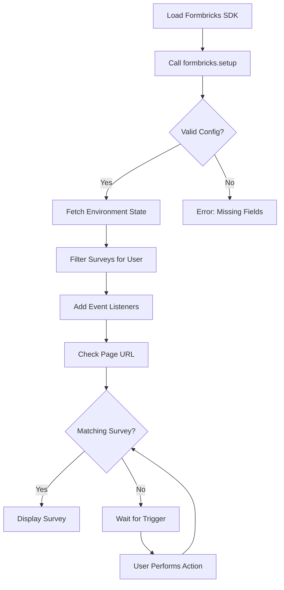

<Note>
  The Formbricks browser SDK is only **~7KB** in size, ensuring minimal impact on your application's load time and performance.
</Note>

## How The SDK Works

The following diagram illustrates the SDK initialization and survey display flow:



After calling `formbricks.setup()`, the SDK fetches the current environment state from the server, filters available surveys for the user, and adds event listeners. It then checks the current page URL for matching surveys. If a match is found, the survey is displayed immediately. Otherwise, the SDK waits for a user action (such as a click or page navigation) to trigger a matching survey.

<Steps>
  <Step title="Create a Formbricks cloud account">
    While you can [self-host](/self-hosting) Formbricks, the fastest and easiest way to get started is with the free Cloud plan. Simply [sign up](https://app.formbricks.com/auth/signup) here, follow the onboarding steps, and choose the "Formbricks Surveys" option.
    
    
  </Step>

  <Step title="Choose 'In-product surveys'">
    You can create In-product and Link Surveys with both options, but the onboarding will prompt you to connect your app/website to Formbricks.

    

  </Step>

  <Step title="Install The Formbricks SDK">
    Install the Formbricks SDK in your project using your preferred package manager. Note that **`zod`** is a required peer dependency and must also be installed.

    ```bash npm
    npm install @formbricks/js zod
    ```

    ```bash pnpm
    pnpm add @formbricks/js zod
    ```

    ```bash yarn
    yarn add @formbricks/js zod
    ```

    Alternatively, you can load the SDK via a CDN script tag in your HTML `<head>`:

    ```html
    <!-- START Formbricks Surveys -->
    <script type="text/javascript">
    !function(){
        var appUrl = "https://app.formbricks.com";
        var environmentId = "<your-environment-id>";
    var t=document.createElement("script");t.type="text/javascript",t.async=!0,t.src=appUrl+"/js/formbricks.umd.cjs";var e=document.getElementsByTagName("script")[0];e.parentNode.insertBefore(t,e),setTimeout(function(){window.formbricks.setup({environmentId: environmentId, appUrl: appUrl})},500)}();
    </script>
    <!-- END Formbricks Surveys -->
    ```

    For framework-specific installation guides (React, Next.js, Vue.js, React Native, Swift, Android), see the [Framework Guides](/xm-and-surveys/surveys/website-app-surveys/framework-guides).
  </Step>

<Step title="Connect Your App/Website With formbricks.setup()">
  After installing the SDK, initialize it by calling `formbricks.setup()` with your environment configuration. The `setup()` function accepts a `TConfigInput` object with two required fields:

  | Parameter | Type | Description |
  | :--- | :--- | :--- |
  | `environmentId` | `string` | Your Formbricks Environment ID, found in **Settings → Setup Checklist**. |
  | `appUrl` | `string` | The URL of your Formbricks instance. Use `PUBLIC_URL` for multi-domain setups, or `WEBAPP_URL` for single-domain setups. |

  ```typescript
  import formbricks from "@formbricks/js";

  formbricks.setup({
    environmentId: "<your-environment-id>",
    appUrl: "<your-app-url>", // use PUBLIC_URL for multi-domain, WEBAPP_URL for single-domain
  });
  ```

  <Note>
    The legacy `formbricks.init()` method is deprecated. Please use `formbricks.setup()` for all new integrations. If you are migrating from an older version, the legacy `apiHost` parameter is automatically mapped to `appUrl` for backward compatibility.
  </Note>

  Follow the on-screen instructions in the Formbricks onboarding to confirm your connection:

  
</Step>

  <Step title="Confirm setup">
    As soon as Formbricks receives the first data point, you will see a message in the onboarding:

    

    Onboarding is complete! Now let's create our first survey as you should see templates to choose from after clicking on **Next**:

    

  </Step>

  <Step title="Create your first survey">
    To be able to see a survey in your app, you need to create one. We'll choose one of the templates and head over to the survey settings:

    Pick the Survey Type as **Website & App Survey**.

  </Step>

  <Step title="Create trigger to show survey">
    Scroll to **Survey Trigger**, click **+ Add Action**, and select **Page View**. This ensures the survey appears when the Formbricks Widget detects any page load.

    

  </Step>

  <Step title="Set Recontact Options right">
  A common hiccup is users seeing one survey but it doesn't appear again. This is due to the default settings we chose to avoid survey fatigue. While setting up, we recommend the following Recontact Options:
  

    <Note>
      Please change this setting after testing your survey to avoid user fatigue.
    </Note>

  </Step>

<Step title="Publish the survey">
  Publish the survey to make it available for the SDK to pull into the website or app where you want to show
  it.
</Step>

<Step title="Understand caching behavior">
  For better scalability, we cache the request the SDK makes to the server. This allows you to use Formbricks
  on websites with millions of visitors without high hosting cost.
  <Note>
    **Important**: Any changes to surveys, action classes, project settings, or environment configuration will
    take **up to 1 minute** to reflect in your app/website due to server-side caching. This includes survey
    modifications, new triggers, styling changes, and other updates.
  </Note>
  For troubleshooting, you can enable [Debug
  Mode](/xm-and-surveys/surveys/website-app-surveys/framework-guides#activate-debug-mode) to see detailed logs
  in your browser console.
</Step>

  <Step title="Check browser compatibility">
    Formbricks is designed to work with all modern browsers. Please ensure your users are using a supported version:

    | Browser | Minimum Version | Release Date |
    | :--- | :--- | :--- |
    | **Chrome** | 111+ | March 2023 |
    | **Edge** | 111+ | March 2023 |
    | **Firefox** | 128+ | July 2024 |
    | **Safari** | 16.4+ | March 2023 |

    *Internet Explorer is not supported.*

  </Step>
</Steps>

Need help? Join us in [**GitHub Discussions**](https://github.com/formbricks/formbricks/discussions), and we'll be happy to assist!

---

*Source: `packages/js-core/src/index.ts` (SDK API), `packages/js-core/src/types/config.ts` (`TConfigInput` interface)*
